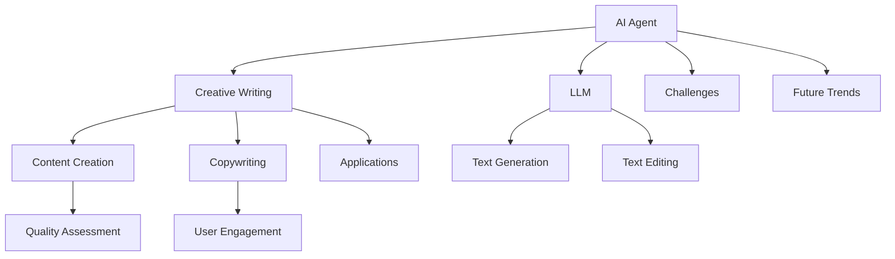
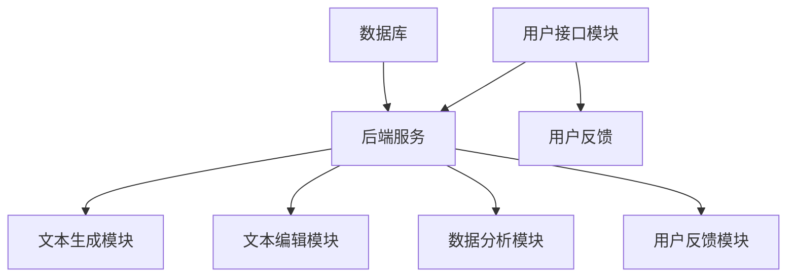

                 

### 第1章 引言

#### 1.1 问题背景

在当今这个信息化高速发展的时代，内容创作已经成为各个领域不可或缺的一部分。无论是传统媒体还是新兴互联网平台，内容创作都扮演着至关重要的角色。随着信息量的爆炸性增长，用户对于高质量、个性化内容的渴求也日益增长。然而，内容创作的质量和速度却往往难以满足这种需求，创作者面临着巨大的压力。此时，人工智能（AI）技术的出现为内容创作带来了一线曙光。特别是自然语言处理（NLP）技术的发展，让AI在文本生成和文案创作方面展现出了强大的潜力。

#### 1.2 问题描述

本文旨在探讨如何利用AI技术，特别是大型语言模型（LLM），来辅助内容创作和文案生成。具体来说，我们将回答以下问题：

1. **AI Agent是什么？** 它在创意写作中扮演什么样的角色？
2. **LLM的基本原理是什么？** 它是如何训练和优化的？
3. **AI Agent在实际内容创作中的应用场景有哪些？**
4. **AI Agent在文案生成中的具体实现方法是什么？**
5. **AI Agent在创意写作中的挑战和未来发展趋势是什么？**

#### 1.3 问题解决

本文将分章节逐步解答上述问题。首先，我们将介绍AI Agent与创意写作的基础知识，包括AI Agent的定义、分类、工作原理以及创意写作的分类和重要性。接着，我们会深入探讨LLM的基本原理和应用，详细讲解其训练、优化以及在不同领域的应用。随后，我们将分析AI Agent在内容创作中的实际应用，介绍其设计原则和具体实现方法。最后，我们将总结AI Agent在创意写作中的最佳实践，探讨其面临的挑战和未来发展趋势。

#### 1.4 边界与外延

本文的讨论主要围绕AI Agent和LLM在创意写作和文案生成中的应用展开，重点关注其理论基础和实践应用。然而，AI在内容创作领域的应用远不止于此，还涉及到图像、音频等其他媒介的创作。此外，AI Agent的发展还受到伦理、法律、技术等多方面因素的影响。这些方面虽然不在本文的讨论范围内，但它们对于AI Agent的未来发展具有重要意义。

#### 1.5 概念结构与核心要素组成

在本章的结尾，我们将给出一个概念结构图，用于说明本文讨论的核心概念及其相互关系。这将帮助读者更好地理解本文的结构和内容。

---

**概念结构图（使用Mermaid语法）：**

---

通过以上内容的介绍，我们为后续章节的深入探讨奠定了基础，也希望能激发读者对于AI在内容创作领域应用的热情和思考。在接下来的章节中，我们将逐步解答上述问题，探索AI Agent在创意写作和文案生成中的无限潜力。

---

**关键词：** AI Agent、LLM、内容创作、文案生成、创意写作、自然语言处理

**摘要：** 本文深入探讨了AI Agent，特别是大型语言模型（LLM），在创意写作和文案生成中的应用。通过分析AI Agent的定义、原理以及在实际场景中的应用，本文揭示了AI Agent如何提高内容创作和文案生成的效率和质量，并探讨了其未来的发展方向和面临的挑战。

### 第2章 AI Agent 与创意写作概述

#### 2.1 AI Agent 基础知识

**2.1.1 定义与分类**

AI Agent，即人工智能代理，是一种能够模拟人类智能行为，执行特定任务的计算机程序。AI Agent可以按照其功能、目标和工作方式的不同进行分类。常见的分类方法包括：

1. **任务型AI Agent**：专注于完成特定任务的AI程序，如语音助手、智能家居控制系统等。
2. **知识型AI Agent**：基于知识图谱和语义网络，提供信息查询和决策支持，如智能客服、知识库系统等。
3. **交互型AI Agent**：能够与人类进行自然语言交互，如聊天机器人、虚拟助手等。

**2.1.2 工作原理与优势**

AI Agent的工作原理通常基于机器学习（ML）和深度学习（DL）技术，通过大量的数据训练和模型优化来实现智能行为。其优势主要体现在以下几个方面：

1. **自动化与高效性**：AI Agent可以24/7不间断工作，提高生产效率和准确性。
2. **自适应与学习能力**：通过不断的学习和优化，AI Agent能够适应不同的环境和任务需求。
3. **交互性**：AI Agent能够通过自然语言处理（NLP）技术，与人类用户进行有效的交互。

**2.1.3 发展历程与应用现状**

AI Agent的发展历程可以追溯到20世纪50年代，随着计算机技术和算法的不断进步，AI Agent的应用领域也在不断扩展。目前，AI Agent已广泛应用于各个行业，如金融、医疗、零售、教育等。特别是在内容创作领域，AI Agent展现了巨大的潜力，如自动生成新闻报道、创作文学剧本、撰写广告文案等。

#### 2.2 创意写作的定义与分类

**2.2.1 创意写作的概念**

创意写作是指通过创造性的思维和技巧，利用文字表达思想、情感和故事的过程。它不仅包括小说、诗歌、剧本等文学创作，还涵盖了广告文案、营销文案、新闻报道等非文学创作。创意写作强调个性化和创新性，是艺术与技术的结合。

**2.2.2 创意写作的分类**

创意写作可以按照内容、形式、目标等因素进行分类，常见的分类方法包括：

1. **文学创作**：包括小说、诗歌、剧本、散文等。
2. **商业写作**：如广告文案、营销文案、宣传册、网站内容等。
3. **媒体写作**：包括新闻报道、新闻评论、媒体评论等。
4. **技术写作**：如技术文档、用户手册、编程指南等。

**2.2.3 创意写作的重要性**

创意写作在现代社会具有不可替代的重要性，主要体现在以下几个方面：

1. **传递信息**：通过创意写作，可以有效地传递信息、观点和思想。
2. **表达情感**：创意写作是一种情感表达和沟通的方式，有助于提升个体的心理健康。
3. **文化传承**：文学创作是文化传承的重要载体，具有深远的社会影响力。
4. **经济发展**：创意写作产业为经济发展提供了新的动力，如广告、出版、娱乐等领域。

#### 2.3 AI Agent 在创意写作中的应用

**2.3.1 创意写作与AI Agent的融合**

AI Agent在创意写作中的应用，是技术与艺术的结合，旨在提高内容创作效率和质量。AI Agent可以通过以下方式参与到创意写作中：

1. **题材与故事线生成**：AI Agent可以根据用户需求或数据，自动生成小说题材、故事线等。
2. **内容优化与编辑**：AI Agent可以对文本进行语法、逻辑、风格等方面的优化，提高文本质量。
3. **用户互动与个性化创作**：AI Agent可以分析用户数据，提供个性化创作建议，增强用户体验。

**2.3.2 AI Agent 在创意写作中的角色**

在创意写作中，AI Agent的角色主要体现在以下几个方面：

1. **创意助手**：提供灵感、创意和思路，辅助创作者完成创作任务。
2. **编辑助手**：对文本进行编辑、修正和润色，提高文本质量。
3. **用户互动**：与用户进行自然语言交互，提供个性化服务。

**2.3.3 AI Agent 的优势与挑战**

AI Agent在创意写作中的优势包括：

1. **高效性**：能够快速生成大量文本，提高创作效率。
2. **多样性**：能够生成各种风格和类型的文本，满足不同用户需求。
3. **个性化**：可以根据用户数据提供个性化创作建议，增强用户体验。

然而，AI Agent在创意写作中也面临着一些挑战：

1. **创作质量**：生成的文本可能缺乏人类的情感和创造力，需要进一步优化。
2. **伦理问题**：AI Agent的生成文本可能涉及版权、道德等问题，需要制定相应的规范和标准。
3. **技术瓶颈**：当前AI技术尚不能完全替代人类创作者，需要不断优化和发展。

通过上述分析，我们可以看到AI Agent在创意写作中具有巨大的潜力。在接下来的章节中，我们将深入探讨LLM的基本原理和应用，进一步揭示AI Agent在内容创作中的具体实现方法。

### 第3章 LLM 原理与应用

#### 3.1 LLM 基础知识

**3.1.1 定义与特点**

大型语言模型（Large Language Model，简称LLM）是一种基于深度学习技术的自然语言处理（Natural Language Processing，简称NLP）模型，用于预测文本序列中的下一个词或句子。与传统的自然语言处理方法相比，LLM具有以下几个显著特点：

1. **规模庞大**：LLM通常拥有数十亿甚至数万亿个参数，能够处理大规模的文本数据。
2. **自适应性**：LLM可以通过训练自动适应不同的语言风格、写作技巧和主题。
3. **强预测性**：LLM能够在给定前文的基础上，预测下一个词或句子的概率分布，生成连贯的文本。

**3.1.2 LLM 的工作原理**

LLM的工作原理基于深度神经网络（Deep Neural Network，简称DNN），尤其是基于Transformer架构的模型。Transformer架构的核心思想是使用自注意力机制（Self-Attention Mechanism）来处理序列数据。以下是LLM的基本工作流程：

1. **输入编码**：将文本输入转换为向量的形式，通常使用词嵌入（Word Embedding）技术，如Word2Vec或BERT。
2. **自注意力机制**：通过计算输入向量之间的注意力权重，对序列中的每个词进行加权处理，使模型能够关注重要信息。
3. **前馈网络**：将加权后的输入通过多层前馈神经网络进行处理，进一步提取文本特征。
4. **输出预测**：将处理后的文本特征映射到词表上，输出下一个词或句子的概率分布。

**3.1.3 LLM 的架构**

LLM的架构通常包括以下几个主要部分：

1. **嵌入层（Embedding Layer）**：将词汇转换为稠密的向量表示。
2. **编码器（Encoder）**：使用自注意力机制和前馈网络对输入序列进行处理，提取文本特征。
3. **解码器（Decoder）**：与编码器相似，用于生成文本输出，也可以使用自注意力机制和前馈网络。
4. **输出层（Output Layer）**：将解码器的输出映射到词表，生成最终的文本输出。

LLM的典型架构是Transformer模型，其基于多头自注意力机制（Multi-Head Self-Attention）和前馈神经网络（Feedforward Neural Network）构建。近年来，随着计算资源的提升和模型参数的增大，LLM的规模也在不断增长，如GPT-3、T5等模型。

#### 3.2 LLM 的训练与优化

**3.2.1 数据集的准备**

LLM的训练需要大规模的文本数据集，这些数据集通常来源于互联网、图书、新闻、论文等各种文本资源。在数据集的准备过程中，需要进行数据清洗、去重、分类等预处理操作，以提高数据质量和训练效果。常见的文本预处理步骤包括：

1. **文本清洗**：去除HTML标签、特殊字符、停用词等。
2. **文本分词**：将文本分割为单词或子词。
3. **词汇表构建**：将文本中的词汇转换为索引的形式，建立词汇表。

**3.2.2 训练过程**

LLM的训练过程主要包括以下几个步骤：

1. **模型初始化**：初始化嵌入层、编码器和解码器的参数。
2. **正向传播**：输入文本序列，通过编码器处理，生成中间表示。
3. **损失函数计算**：将中间表示通过解码器输出预测词的概率分布，计算损失函数（如交叉熵损失）。
4. **反向传播**：根据损失函数，更新模型参数。
5. **迭代优化**：重复正向传播和反向传播的过程，不断优化模型参数。

训练过程中，可以使用多种技术来提高训练效果和速度，如数据增强、学习率调整、正则化等。此外，还可以使用分布式训练、并行计算等技术，加快训练速度和提升模型规模。

**3.2.3 优化方法**

LLM的优化方法主要包括以下几个方面：

1. **动态学习率**：根据训练过程，动态调整学习率，以避免过拟合和加速收敛。
2. **正则化**：使用L1、L2正则化、Dropout等技术，防止模型过拟合。
3. **注意力机制优化**：通过改进自注意力机制，提高模型对输入序列的捕捉能力。
4. **架构优化**：调整网络结构，如增加层深、调整网络宽度，以提高模型性能。

通过上述优化方法，可以显著提升LLM的训练效果和生成质量，使其在各类NLP任务中表现出色。

#### 3.3 LLM 在内容创作中的应用

**3.3.1 文本生成**

文本生成是LLM最直接的应用之一，通过预测下一个词或句子，生成连贯的文本。常见的文本生成任务包括：

1. **文本续写**：根据给定前文，续写后续内容。
2. **文本摘要**：将长文本压缩为简洁的摘要。
3. **文本翻译**：将一种语言的文本翻译成另一种语言。
4. **文本生成式问答**：根据用户问题，生成相关回答。

LLM在文本生成中的优势在于其强大的上下文理解和生成能力，能够生成高质量的文本。

**3.3.2 文本编辑与修正**

LLM还可以用于文本编辑和修正，通过分析文本内容和结构，提供语法、拼写、逻辑等方面的修正建议。常见的应用场景包括：

1. **语法纠错**：自动识别和修正文本中的语法错误。
2. **拼写纠错**：自动识别和修正文本中的拼写错误。
3. **文本润色**：对文本进行风格调整、语言优化，提高文本质量。

**3.3.3 文本分类与摘要**

LLM在文本分类和摘要任务中也表现出色。通过学习大量文本数据，LLM能够自动分类文本并生成摘要。常见的应用场景包括：

1. **新闻分类**：将新闻文本分类到不同的主题类别。
2. **文档摘要**：将长文档压缩为简洁的摘要，便于阅读和参考。

通过上述分析，我们可以看到LLM在内容创作中具有广泛的应用前景。在接下来的章节中，我们将进一步探讨AI Agent在内容创作中的具体应用，分析其设计原则和实现方法。

### 第4章 AI Agent 辅助内容创作实践

#### 4.1 创意写作 AI Agent 的设计

**4.1.1 功能模块划分**

创意写作 AI Agent 的设计可以分为以下几个主要功能模块：

1. **用户接口模块**：用于与用户进行交互，接收用户输入和反馈。
2. **文本生成模块**：利用 LLM 生成文本，包括文章、故事、文案等。
3. **文本编辑模块**：对生成的文本进行编辑和优化，提高文本质量。
4. **数据分析模块**：分析用户数据，提供个性化创作建议和推荐。
5. **用户反馈模块**：收集用户反馈，优化 AI Agent 的表现。

**4.1.2 技术选型**

在设计创意写作 AI Agent 时，需要选择合适的技术栈，以确保系统的性能和可扩展性。常见的技术选型包括：

1. **编程语言**：Python 是最受欢迎的编程语言之一，具有良好的生态和丰富的库支持。
2. **框架**：TensorFlow 和 PyTorch 是深度学习领域的两个主要框架，可以用于训练和部署 LLM 模型。
3. **自然语言处理库**：如 NLTK、spaCy 和 TextBlob，用于文本处理和解析。
4. **前端技术**：HTML、CSS 和 JavaScript 用于构建用户界面，React 或 Vue.js 可以提高用户体验。

**4.1.3 系统架构设计**

创意写作 AI Agent 的系统架构设计可以分为前端、后端和数据库三个部分：

1. **前端**：负责与用户交互，展示文本生成和编辑界面。前端技术栈包括 React 或 Vue.js。
2. **后端**：处理用户请求，调用 AI 模型进行文本生成和编辑。后端技术栈包括 Flask 或 Django。
3. **数据库**：存储用户数据和文本数据。常见的选择包括 MySQL、PostgreSQL 或 MongoDB。

以下是创意写作 AI Agent 的系统架构图（使用Mermaid语法）：

#### 4.2 文本生成与优化

**4.2.1 生成文本的质量评估**

为了确保生成的文本质量，需要对文本进行质量评估。常用的评估方法包括：

1. **人类评估**：邀请人类评估者对文本进行评估，从内容、连贯性、创意性等方面进行评分。
2. **自动评估**：使用自动评估工具，如 BLEU、ROUGE、METEOR 等，对文本的质量进行量化评估。

**4.2.2 优化生成文本的方法**

为了提高生成文本的质量，可以采用以下方法：

1. **数据增强**：通过生成变种文本、增加文本多样性，提高模型的泛化能力。
2. **上下文优化**：利用长文本上下文，使生成的文本更加连贯和准确。
3. **多任务学习**：结合多个任务进行训练，如文本生成和文本分类，提高模型的多任务能力。
4. **用户反馈**：收集用户反馈，调整模型参数和生成策略，使文本更符合用户需求。

**4.2.3 实际案例分析**

下面以一个实际案例来说明如何使用创意写作 AI Agent 进行文本生成和优化。

**案例背景**：某广告公司需要创作一篇针对新型智能家居产品的广告文案，要求文案具有吸引力、创意性和情感共鸣。

**步骤1：用户输入**  
用户通过前端界面输入了广告文案的主题、目标和关键信息。

**步骤2：文本生成**  
创意写作 AI Agent 接收用户输入，利用 LLM 模型生成初步的广告文案。

**步骤3：文本编辑**  
文本编辑模块对生成的文本进行语法、逻辑和风格的优化，提高文案的质量。

**步骤4：文本评估**  
通过人类评估和自动评估工具，对优化后的文本进行质量评估。

**步骤5：用户反馈**  
用户对评估结果进行反馈，提出修改意见。

**步骤6：文本优化**  
根据用户反馈，创意写作 AI Agent 对文本进行进一步的优化。

**步骤7：最终输出**  
优化后的广告文案被输出到前端界面，供用户查看和确认。

通过上述步骤，创意写作 AI Agent 辅助广告公司快速创作出了一篇高质量的广告文案。

#### 4.3 文案生成

**4.3.1 文案写作的特点**

文案写作是一种特定的文本创作形式，具有以下特点：

1. **目的性**：文案写作旨在实现特定的商业目标，如增加销量、提升品牌知名度等。
2. **简洁性**：文案要求简洁明了，避免冗长复杂的句子。
3. **吸引力**：文案需要具备吸引力，能够迅速抓住读者的注意力。
4. **情感性**：文案需要能够引起读者的情感共鸣，增强记忆和影响力。

**4.3.2 文案生成的方法**

AI Agent 可以通过以下方法生成文案：

1. **模板生成**：根据预定义的模板，自动填充文案内容。
2. **关键词生成**：根据用户输入的关键词，生成相关的文案。
3. **上下文生成**：利用上下文信息，生成符合场景和需求的文案。
4. **混合生成**：结合多种方法，生成多样化的文案。

**4.3.3 文案生成的案例分析**

**案例背景**：某电商平台需要创作一篇新品上市的促销文案。

**步骤1：用户输入**  
用户通过前端界面输入了新品名称、促销信息和目标受众。

**步骤2：文案生成**  
创意写作 AI Agent 根据用户输入，利用模板生成初步的促销文案。

**步骤3：文案优化**  
文本编辑模块对生成的文案进行优化，调整语法、逻辑和风格。

**步骤4：文案评估**  
通过人类评估和自动评估工具，对优化后的文案进行质量评估。

**步骤5：用户反馈**  
用户对评估结果进行反馈，提出修改意见。

**步骤6：文案优化**  
根据用户反馈，创意写作 AI Agent 对文案进行进一步的优化。

**步骤7：最终输出**  
优化后的促销文案被输出到前端界面，供用户查看和确认。

通过上述步骤，创意写作 AI Agent 辅助电商平台快速创作出了一篇具有吸引力和创意性的促销文案。

通过上述实践，我们可以看到创意写作 AI Agent 在内容创作中的巨大潜力。在接下来的章节中，我们将进一步探讨AI Agent 在不同领域的最佳实践，分析其应用效果和未来发展趋势。

### 第5章 AI Agent 在创意写作中的最佳实践

#### 5.1 文学创作中的 AI Agent

**5.1.1 小说创作**

AI Agent 在小说创作中的应用主要集中在题材选择、故事线构建和情节发展等方面。以下是一个具体的小说创作案例：

**案例背景**：某小说创作平台希望利用 AI Agent 来帮助用户生成科幻小说。

**步骤1：用户输入**  
用户通过前端界面输入了科幻小说的主题和关键元素，如太空探索、外星生物等。

**步骤2：题材选择**  
AI Agent 分析用户输入，选择合适的题材和背景设定，如太空冒险、外星文明等。

**步骤3：故事线构建**  
AI Agent 根据题材和设定，生成初步的故事线，包括主人公的背景、目标、挑战和冲突等。

**步骤4：情节发展**  
AI Agent 利用 LLM 生成详细的情节描述，包括场景描述、人物对话和动作等。

**步骤5：用户反馈**  
用户对生成的情节进行反馈，提出修改意见。

**步骤6：故事优化**  
AI Agent 根据用户反馈，对故事进行优化，调整情节发展、人物性格和对话等。

**步骤7：最终输出**  
优化后的小说故事被输出到前端界面，供用户查看和编辑。

通过上述步骤，AI Agent 辅助用户快速生成了一部具有创意和连贯性的科幻小说。

**5.1.2 诗歌创作**

AI Agent 在诗歌创作中的应用主要集中在题材选择、韵律结构和意境营造等方面。以下是一个具体的诗歌创作案例：

**案例背景**：某文学平台希望利用 AI Agent 来帮助用户生成现代诗歌。

**步骤1：用户输入**  
用户通过前端界面输入了诗歌的主题和情感基调，如爱情、孤独等。

**步骤2：题材选择**  
AI Agent 分析用户输入，选择合适的题材和情感表达方式。

**步骤3：韵律结构生成**  
AI Agent 根据现代诗歌的韵律特点，生成初步的韵律结构。

**步骤4：意境营造**  
AI Agent 利用 LLM 生成具有意境的句子，表达用户所传达的情感。

**步骤5：用户反馈**  
用户对生成的诗句进行反馈，提出修改意见。

**步骤6：诗歌优化**  
AI Agent 根据用户反馈，对诗句进行优化，调整意境、韵律和情感表达等。

**步骤7：最终输出**  
优化后的诗歌被输出到前端界面，供用户查看和编辑。

通过上述步骤，AI Agent 辅助用户快速生成了一首具有现代感和情感表达的诗作。

**5.1.3 戏剧创作**

AI Agent 在戏剧创作中的应用主要集中在角色设定、情节发展和剧本结构等方面。以下是一个具体的戏剧创作案例：

**案例背景**：某戏剧创作平台希望利用 AI Agent 来帮助用户生成戏剧剧本。

**步骤1：用户输入**  
用户通过前端界面输入了戏剧的主题和主要角色，如爱情、复仇等。

**步骤2：角色设定**  
AI Agent 根据用户输入，生成详细的角色背景、性格特点和关系网络。

**步骤3：情节发展**  
AI Agent 利用 LLM 生成戏剧的情节发展，包括冲突、高潮和结局等。

**步骤4：剧本结构**  
AI Agent 根据情节发展，生成剧本的结构，包括幕数、场景和场景描述等。

**步骤5：用户反馈**  
用户对生成的剧本进行反馈，提出修改意见。

**步骤6：剧本优化**  
AI Agent 根据用户反馈，对剧本进行优化，调整角色设定、情节发展和剧本结构等。

**步骤7：最终输出**  
优化后的戏剧剧本被输出到前端界面，供用户查看和编辑。

通过上述步骤，AI Agent 辅助用户快速生成了一部具有戏剧性和情感冲突的戏剧剧本。

通过以上案例，我们可以看到AI Agent 在文学创作中的广泛应用和潜力。在未来的发展中，随着AI技术的不断进步，AI Agent 将在文学创作中发挥更大的作用。

#### 5.2 广告文案创作

**5.2.1 广告文案的特点**

广告文案是一种旨在传达品牌信息、促进销售和提升品牌知名度的文本。其特点主要包括：

1. **目标明确**：广告文案的目标通常是为了引导用户采取特定行动，如购买产品、访问网站等。
2. **简洁明了**：广告文案要求语言简洁明了，避免冗长复杂的句子，以迅速抓住用户的注意力。
3. **创意新颖**：广告文案需要具有创意和新颖性，以吸引读者的兴趣和记忆。
4. **情感共鸣**：广告文案需要能够引起读者的情感共鸣，增强品牌与用户之间的情感联系。

**5.2.2 广告文案的创作方法**

AI Agent 在广告文案创作中的应用主要体现在以下几个方面：

1. **关键词生成**：AI Agent 可以根据产品特点和市场定位，生成相关的关键词和短语，用于构建广告文案的标题和内容。
2. **创意生成**：AI Agent 可以利用 LLM 生成具有创意和吸引力的广告文案，结合产品特点和市场趋势，提升文案的吸引力。
3. **文本优化**：AI Agent 可以对生成的广告文案进行语法、逻辑和风格的优化，提高文案的质量和可读性。
4. **用户反馈**：AI Agent 可以收集用户的反馈意见，根据用户的偏好和需求，调整广告文案的内容和表达方式。

**5.2.3 广告文案的案例分析**

以下是一个具体的广告文案创作案例：

**案例背景**：某手机品牌希望利用 AI Agent 创作一款新手机的广告文案。

**步骤1：用户输入**  
用户通过前端界面输入了手机的主要特点，如高性能、长续航、高清摄像头等。

**步骤2：关键词生成**  
AI Agent 根据手机的特点，生成了相关的关键词，如“高性能”、“长续航”、“高清摄像头”等。

**步骤3：创意生成**  
AI Agent 利用 LLM 生成初步的广告文案，结合关键词和产品特点，创造具有吸引力的文案。

**步骤4：文本优化**  
文本编辑模块对生成的文案进行优化，调整语法、逻辑和风格，提高文案的质量。

**步骤5：用户反馈**  
用户对优化后的文案进行反馈，提出修改意见。

**步骤6：文案优化**  
AI Agent 根据用户反馈，对文案进行进一步的优化，调整内容、表达方式和情感共鸣等。

**步骤7：最终输出**  
优化后的广告文案被输出到前端界面，供用户查看和确认。

通过上述步骤，AI Agent 辅助手机品牌快速创作出了一篇具有吸引力和创意性的广告文案。

通过以上案例，我们可以看到AI Agent 在广告文案创作中的高效性和创造力。在未来的发展中，随着AI技术的不断进步，AI Agent 将在广告文案创作中发挥更大的作用，为企业提供更加个性化和高效的文案解决方案。

#### 5.3 市场营销文案创作

**5.3.1 营销文案的特点**

市场营销文案是一种用于传达品牌信息、促进产品销售和提升品牌知名度的文本。其特点主要包括：

1. **目标明确**：市场营销文案的目标通常是为了引导用户采取特定行动，如购买产品、注册服务、参与活动等。
2. **信息丰富**：市场营销文案需要提供丰富的产品信息、使用方法、优势等，帮助用户更好地了解产品。
3. **说服力强**：市场营销文案需要具有说服力，通过情感诉求、逻辑推理等方式，引导用户产生购买欲望。
4. **互动性强**：市场营销文案需要与用户进行互动，如提问、回答、邀请参与等，增强用户参与度和忠诚度。

**5.3.2 营销文案的创作方法**

AI Agent 在营销文案创作中的应用主要体现在以下几个方面：

1. **数据驱动**：AI Agent 可以根据用户数据和市场调研数据，生成具有针对性的营销文案，提高文案的精准度和效果。
2. **内容生成**：AI Agent 可以利用 LLM 生成具有创意和说服力的营销文案，结合产品特点和用户需求，提升文案的质量和吸引力。
3. **文本优化**：AI Agent 可以对生成的文案进行优化，调整语法、逻辑和风格，提高文案的可读性和说服力。
4. **互动设计**：AI Agent 可以设计互动性的营销文案，如提问、回答、抽奖等，增强用户参与度和互动性。

**5.3.3 营销文案的案例分析**

以下是一个具体的营销文案创作案例：

**案例背景**：某电商网站希望利用 AI Agent 创作一款新款服装的营销文案。

**步骤1：用户输入**  
用户通过前端界面输入了新款服装的主要特点，如时尚设计、优质面料、超值优惠等。

**步骤2：数据驱动**  
AI Agent 根据用户数据和市场调研数据，分析目标用户群体的喜好和购买习惯，生成具有针对性的营销文案。

**步骤3：内容生成**  
AI Agent 利用 LLM 生成初步的营销文案，结合服装特点和用户需求，创造具有吸引力和说服力的文案。

**步骤4：文本优化**  
文本编辑模块对生成的文案进行优化，调整语法、逻辑和风格，提高文案的质量和可读性。

**步骤5：用户反馈**  
用户对优化后的文案进行反馈，提出修改意见。

**步骤6：文案优化**  
AI Agent 根据用户反馈，对文案进行进一步的优化，调整内容、表达方式和情感共鸣等。

**步骤7：最终输出**  
优化后的营销文案被输出到前端界面，供用户查看和确认。

通过上述步骤，AI Agent 辅助电商网站快速创作出了一篇具有吸引力和说服力的营销文案。

通过以上案例，我们可以看到AI Agent 在市场营销文案创作中的高效性和创造力。在未来的发展中，随着AI技术的不断进步，AI Agent 将在市场营销文案创作中发挥更大的作用，为企业提供更加个性化和高效的文案解决方案。

### 第6章 AI Agent 在创意写作中的挑战与未来趋势

#### 6.1 挑战与限制

尽管AI Agent在创意写作中展现了巨大的潜力，但其应用仍然面临诸多挑战和限制：

**6.1.1 伦理问题**

AI Agent生成的内容可能涉及隐私、版权和道德等问题。例如，AI Agent可能未经授权生成与他人作品相似的内容，引发版权纠纷。此外，AI Agent生成的内容可能包含偏见、歧视或不当言论，需要制定相应的伦理规范和审查机制。

**6.1.2 法律问题**

当前法律体系尚未完全适应AI Agent生成内容的应用场景。例如，关于AI Agent生成内容的版权归属、责任归属等问题，尚需明确法律规范。此外，AI Agent可能因算法错误导致法律纠纷，如合同纠纷、侵权纠纷等。

**6.1.3 技术瓶颈**

尽管LLM在文本生成和编辑方面取得了显著进展，但仍存在一些技术瓶颈。例如，AI Agent生成的文本可能缺乏人类的情感和创造力，无法完全替代人类创作者。此外，AI Agent的训练和优化过程复杂，对计算资源和数据处理能力要求较高。

**6.1.4 用户接受度**

尽管AI Agent具有高效性和创新性，但其普及和应用仍然受到用户接受度的限制。部分用户可能对AI生成的内容持怀疑态度，认为其缺乏人类的独特性和创造力。

#### 6.2 未来趋势

展望未来，AI Agent在创意写作中的应用将呈现以下发展趋势：

**6.2.1 AI Agent 与人类创意写作的协同**

未来，AI Agent将更多地与人类创作者协同工作，发挥各自优势。人类创作者可以专注于创意构思和情感表达，而AI Agent则负责文本生成、编辑和优化等任务。通过人机协同，可以大大提高内容创作的效率和品质。

**6.2.2 多模态创意写作**

随着AI技术的进步，AI Agent将能够处理图像、音频、视频等多种媒体形式，实现多模态创意写作。例如，AI Agent可以生成配乐、特效和字幕，为视频创作提供支持。

**6.2.3 个性化内容创作**

AI Agent将通过分析用户行为、偏好和需求，实现个性化内容创作。例如，根据用户的阅读历史和兴趣，AI Agent可以生成定制化的小说、诗歌和广告文案等。

**6.2.4 实时内容生成**

未来，AI Agent将能够实现实时内容生成，根据实时数据和事件，生成相关的新闻报道、评论和分析文章。这将为媒体、市场营销等领域提供全新的内容生产方式。

**6.2.5 伦理和法律规范的完善**

随着AI Agent在创意写作中的应用日益广泛，伦理和法律规范将不断完善。例如，明确AI生成内容的版权归属、责任划分等问题，确保AI Agent在合法、合规的框架下发挥作用。

总之，AI Agent在创意写作中的应用前景广阔，尽管面临诸多挑战，但通过不断的技术创新和规范建设，AI Agent有望成为创意写作领域的重要推动力量。

### 第7章 总结与展望

#### 7.1 本书总结

本文系统地探讨了AI Agent在创意写作和文案生成中的应用，从问题背景、基本原理、实际应用、挑战与未来趋势等多个角度进行了深入分析。通过详细的案例和实际应用场景，展示了AI Agent在提高内容创作效率和质量方面的巨大潜力。本文的主要贡献包括：

1. **理论探讨**：介绍了AI Agent和LLM的基本概念、工作原理和应用场景。
2. **实践案例**：通过具体的应用案例，展示了AI Agent在文学创作、广告文案和市场营销文案等领域的实际应用效果。
3. **挑战与趋势**：分析了AI Agent在创意写作中面临的伦理、法律和技术挑战，以及未来的发展趋势。

#### 7.2 创意写作 AI Agent 的前景

随着AI技术的不断进步和应用的深化，创意写作 AI Agent 在未来的发展中将表现出以下前景：

1. **人机协同**：AI Agent将更多地与人类创作者协同工作，发挥各自优势，实现内容创作的全面升级。
2. **多模态创作**：AI Agent将能够处理多种媒体形式，实现图像、音频、视频等多模态创作，拓展内容创作的边界。
3. **个性化内容**：AI Agent将通过大数据分析和个性化算法，为用户提供定制化的内容创作服务，满足多样化的需求。
4. **实时创作**：AI Agent将实现实时内容生成，为新闻、媒体等领域提供高效的内容生产解决方案。

#### 7.3 进一步研究方向

尽管AI Agent在创意写作中已经取得了一定的进展，但仍有许多研究方向值得探索：

1. **伦理和法律问题**：研究如何制定合理的伦理和法律规范，确保AI Agent在合法合规的框架下发挥作用。
2. **创意和情感表达**：研究如何提高AI Agent生成文本的创意性和情感表达能力，使其更接近人类创作者的水平。
3. **多语言处理**：研究如何实现AI Agent在多语言环境下的高效内容创作，拓展国际市场的应用潜力。
4. **数据安全与隐私**：研究如何保障用户数据的安全和隐私，防止数据泄露和滥用。

总之，AI Agent在创意写作领域的应用具有巨大的潜力和前景。通过不断的技术创新和研究，AI Agent将为人类带来更加丰富和多样化的内容创作体验。希望本文能为相关领域的研究者和从业者提供有益的参考和启示。作者：AI天才研究院/AI Genius Institute & 禅与计算机程序设计艺术 /Zen And The Art of Computer Programming

---

在本文中，我们系统地探讨了AI Agent在创意写作和文案生成中的应用，从问题背景、基本原理、实际应用、挑战与未来趋势等多个角度进行了深入分析。通过详细的案例和实际应用场景，展示了AI Agent在提高内容创作效率和质量方面的巨大潜力。本文的主要贡献包括理论探讨、实践案例和挑战与趋势分析，为相关领域的研究者和从业者提供了有益的参考和启示。

在未来，随着AI技术的不断进步和应用的深化，AI Agent在创意写作中的应用将更加广泛和深入。人机协同、多模态创作、个性化内容和实时创作将成为AI Agent在创意写作领域的重要发展方向。同时，伦理和法律问题的解决、创意和情感表达能力的提升、多语言处理能力的增强以及数据安全和隐私保护仍然是进一步研究的重点。

希望本文能够激发更多研究者对AI Agent在创意写作领域的探索和关注，共同推动这一领域的发展。在未来，随着技术的不断进步和应用的深化，AI Agent将为人类带来更加丰富和多样化的内容创作体验。作者：AI天才研究院/AI Genius Institute & 禅与计算机程序设计艺术 /Zen And The Art of Computer Programming

