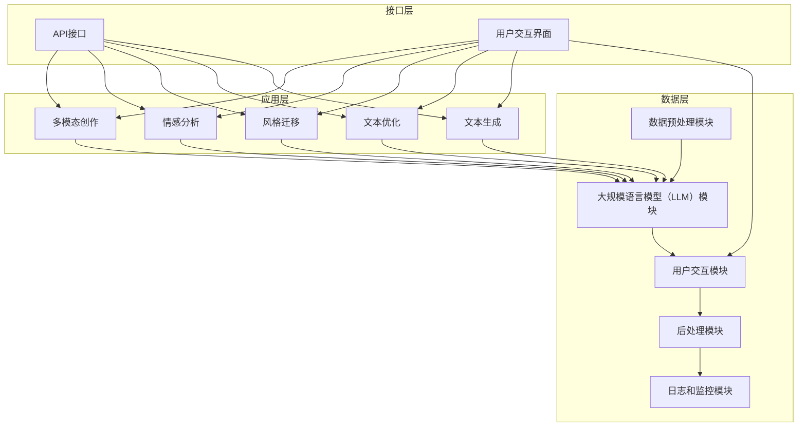
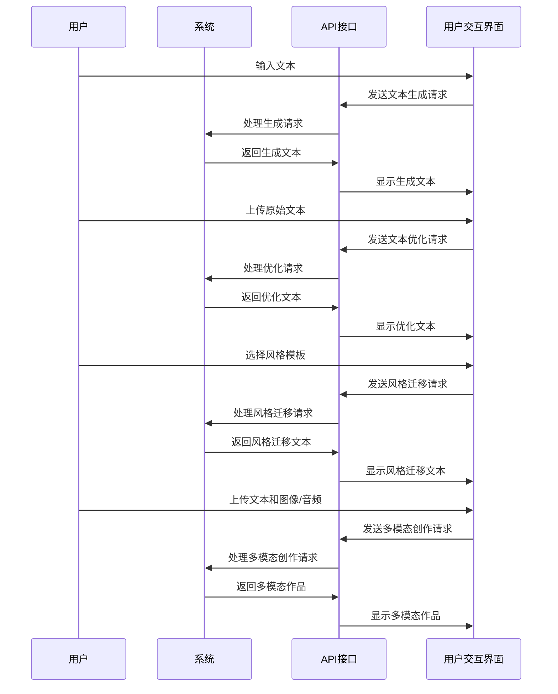

                 

# 创意写作AI Agent：LLM驱动的文学创作辅助系统

## 关键词

- 创意写作
- AI Agent
- 大规模语言模型（LLM）
- 文学创作辅助
- 算法原理
- 系统架构
- 项目实战
- 最佳实践

## 摘要

本文旨在探讨创意写作AI Agent：一种基于大规模语言模型（LLM）驱动的文学创作辅助系统的设计与实现。文章首先介绍了创意写作AI Agent的定义和背景，随后深入解析了LLM的基础知识。在此基础上，文章详细阐述了创意写作AI Agent的系统架构设计和算法原理，并通过项目实战案例展示了其实际应用效果。最后，文章总结了最佳实践和注意事项，并提出了未来的研究方向。

----------------------------------------------------------------

# 第一部分：引言

## 第1章：创意写作AI Agent概述

### 1.1 创意写作AI Agent的定义与背景

创意写作AI Agent，即人工智能驱动的创意写作助手，是指通过利用人工智能技术，尤其是大规模语言模型（LLM），对文本进行自动生成、优化和辅助创作的一类智能系统。随着人工智能技术的不断进步，特别是深度学习和自然语言处理（NLP）领域的突破，AI在文学创作中的应用越来越受到关注。

在文学创作领域，传统的创作方式通常需要作者长时间的思考、灵感的碰撞和大量的手动操作。而创意写作AI Agent的出现，可以大幅提高创作效率，为作者提供创作灵感和辅助，甚至在一定程度上实现自主创作。例如，AI Agent可以自动生成故事情节、撰写诗歌、编辑文章等，从而极大地拓展了文学创作的可能性。

### 1.2 问题背景与描述

文学创作一直以来都是人类文化和艺术的重要组成部分。然而，随着时代的变迁，文学创作面临着越来越多的挑战。首先，现代社会的生活节奏加快，人们对于文学作品的需求越来越高，但创作速度和质量并未相应提升。其次，文学创作的竞争激烈，新作品的脱颖而出变得更加困难。此外，创意的枯竭和灵感的缺失也成为许多作家面临的现实问题。

传统的文学创作方式依赖于作家的个人经验和灵感，这种方式虽然能够产生高质量的文学作品，但效率较低，且难以满足大量需求。因此，如何利用人工智能技术，特别是大规模语言模型，来辅助文学创作，成为当前研究的热点问题。

### 1.3 问题解决

创意写作AI Agent作为一种新兴的技术手段，可以有效地解决文学创作中的诸多问题。首先，AI Agent可以通过分析大量的文学作品，学习并掌握文学创作的规律和技巧，从而在创作过程中提供智能化的建议和辅助。例如，AI Agent可以根据用户的需求，自动生成符合特定风格和主题的故事情节、诗歌或其他形式的文学作品。

其次，AI Agent可以帮助作家优化创作过程。例如，AI Agent可以自动纠正文本中的语法错误，提供词汇选择建议，甚至帮助作家进行故事结构的调整和情节的丰富。这样，作家可以专注于创意的构思和表达，而将一些繁琐的编辑工作交给AI Agent完成。

此外，AI Agent还可以为文学创作提供新的可能性。通过结合大数据分析和机器学习技术，AI Agent可以挖掘出隐藏在大量文本数据中的创作灵感，从而激发作家的创作欲望。例如，AI Agent可以根据当前社会热点、文化趋势等，自动生成与这些主题相关的文学作品，为文学创作带来新的视角和方向。

### 1.4 边界与外延

虽然创意写作AI Agent具有巨大的潜力，但其在实际应用中仍存在一些限制和挑战。首先，AI Agent的创作能力依赖于其训练数据的质量和规模。如果训练数据不够丰富或者存在偏差，那么AI Agent的创作质量也会受到影响。因此，如何收集和整理高质量的训练数据，成为创意写作AI Agent发展的重要课题。

其次，AI Agent在创作过程中，需要处理大量的文本数据，这对计算资源和处理速度提出了较高的要求。因此，如何优化算法，提高AI Agent的运行效率，也是亟待解决的问题。

此外，创意写作AI Agent的应用领域不仅限于文学创作，还可以扩展到广告文案撰写、新闻编辑、演讲稿撰写等多个领域。因此，创意写作AI Agent的外延性也为其未来的发展提供了广阔的空间。

### 1.5 核心概念与要素组成

创意写作AI Agent的核心概念包括：

- **大规模语言模型（LLM）**：LLM是AI Agent的核心技术，负责文本的生成、优化和辅助创作。
- **自然语言处理（NLP）**：NLP技术用于理解和生成人类语言，是实现创意写作AI Agent的关键技术之一。
- **机器学习（ML）**：机器学习技术用于训练和优化LLM，提高其创作能力。
- **数据挖掘（DM）**：数据挖掘技术用于从大量文本数据中提取有用的信息，为AI Agent提供创作灵感。

### 1.6 本章小结

本章介绍了创意写作AI Agent的定义、背景、解决的问题、边界与外延以及核心概念和要素组成。通过本章的介绍，读者可以初步了解创意写作AI Agent的概念和应用前景，为后续章节的深入学习打下基础。

----------------------------------------------------------------

# 第二部分：LLM与文学创作辅助系统基础

## 第2章：大规模语言模型（LLM）基础

### 2.1 LLM的定义与特性

大规模语言模型（LLM，Large-scale Language Model）是一种基于深度学习的自然语言处理模型，能够对大规模文本数据进行学习，并生成与输入文本相似的内容。LLM通常通过训练大量的语料库来学习语言的统计规律和语法结构，从而实现文本生成、文本理解、文本分类等多种自然语言处理任务。

LLM的主要特性包括：

- **参数规模大**：LLM的训练参数数量通常达到数十亿甚至数万亿级别，这使得模型能够捕捉到文本数据中的复杂模式和规律。
- **生成能力强**：通过训练，LLM能够生成流畅、连贯且具有创意的文本，适用于各种文本生成任务，如自动摘要、机器翻译、文本续写等。
- **自适应性好**：LLM能够根据不同的输入文本进行自适应调整，生成符合上下文语境的文本。
- **迁移能力强**：LLM在训练过程中积累了大量的通用语言知识，这使得模型在处理新任务时，能够快速适应并表现出良好的性能。

### 2.2 LLM的发展历史与趋势

LLM的发展历程可以分为以下几个阶段：

- **早期模型**：最早的LLM如Word2Vec和GloVe，通过将单词映射到高维向量空间，来学习单词的语义关系。这些模型为后续的LLM研究奠定了基础。
- **基于神经网络的模型**：随着深度学习技术的发展，基于神经网络的模型如LSTM（长短期记忆网络）和GRU（门控循环单元）开始应用于自然语言处理任务，这些模型在处理长文本和复杂语法结构方面表现出色。
- **Transformer模型**：2017年，Vaswani等人提出了Transformer模型，该模型通过自注意力机制（Self-Attention）实现了对文本的全局依赖建模，使得LLM的性能得到了显著提升。此后，BERT、GPT等基于Transformer的模型陆续问世，成为当前LLM的主流架构。
- **多模态学习**：当前的研究趋势之一是将LLM与图像、声音等其他模态的数据结合，实现跨模态文本生成和交互，进一步提升AI在文学创作等领域的应用潜力。

### 2.3 LLM的核心概念与模型架构

LLM的核心概念包括：

- **自注意力机制（Self-Attention）**：自注意力机制是Transformer模型的核心创新点，通过计算输入文本中每个单词与其他单词之间的相似度，实现全局依赖关系的建模。
- **位置编码（Positional Encoding）**：由于Transformer模型没有循环结构，无法直接捕捉文本中的位置信息，因此引入位置编码来为模型提供关于输入文本中每个单词的位置信息。
- **多头注意力（Multi-Head Attention）**：多头注意力通过并行地计算多个注意力权重，提高了模型的表示能力。
- **前馈神经网络（Feedforward Neural Network）**：前馈神经网络用于对注意力机制的输出进行进一步的非线性变换。

LLM的典型模型架构包括：

- **编码器（Encoder）**：编码器负责对输入文本进行编码，生成固定长度的向量表示。
- **解码器（Decoder）**：解码器负责根据编码器的输出和先前的解码输出，逐词生成新的文本。

### 2.4 LLM的优缺点与适用范围

LLM的优点包括：

- **强大的文本生成能力**：LLM能够生成流畅、连贯且具有创意的文本，适用于自动摘要、机器翻译、文本续写等任务。
- **良好的自适应性和迁移性**：LLM能够快速适应不同的文本输入，并在新任务上表现出良好的性能。
- **高效的处理速度**：通过并行计算和高效的算法设计，LLM能够在较短的时间内处理大量文本数据。

LLM的缺点包括：

- **计算资源需求大**：由于参数规模大，LLM的训练和推理过程需要大量的计算资源和时间。
- **数据依赖性高**：LLM的性能受到训练数据质量的影响，如果训练数据存在偏差或不够丰富，模型的表现可能会受到影响。
- **解释性较差**：由于深度学习模型的复杂性，LLM生成的文本难以进行直观的解释和理解。

LLM主要适用于以下场景：

- **文学创作**：通过自动生成故事情节、诗歌等，AI Agent可以辅助作家进行文学创作。
- **内容生成**：自动生成新闻、文章、广告等，提高内容创作的效率和质量。
- **对话系统**：用于构建智能对话系统，如聊天机器人、虚拟助手等，实现自然、流畅的对话交互。
- **文本分析**：用于文本分类、情感分析、命名实体识别等任务，提供辅助决策和信息提取。

### 2.5 本章小结

本章介绍了大规模语言模型（LLM）的定义、特性、发展历史与趋势、核心概念与模型架构，以及优缺点和适用范围。通过对LLM的深入了解，读者可以更好地理解创意写作AI Agent的基础知识，为后续章节的学习和实践打下基础。

----------------------------------------------------------------

# 第三部分：创意写作AI Agent系统设计与实现

## 第3章：系统架构设计

### 3.1 系统架构概述

创意写作AI Agent的系统架构设计旨在实现一个高效、灵活且可扩展的文学创作辅助平台。系统架构主要由以下几个核心模块组成：

1. **数据预处理模块**：负责清洗、处理和准备用于训练和推理的文本数据。
2. **大规模语言模型（LLM）模块**：作为系统的核心，负责文本生成、优化和辅助创作。
3. **用户交互模块**：提供用户与系统之间的交互界面，支持用户输入需求、查看生成内容等功能。
4. **后处理模块**：对生成的文本进行语法检查、风格调整和格式化，提高文本质量。
5. **日志和监控模块**：记录系统运行状态和性能指标，实现系统的实时监控和故障报警。

### 3.2 系统功能模块设计

创意写作AI Agent的功能模块设计如下：

1. **文本生成**：基于LLM模型，系统可以生成符合用户指定主题、风格和长度的文学作品，如故事、诗歌、散文等。
2. **文本优化**：通过分析用户输入的原始文本，系统可以提供语法修正、词汇选择优化和情节结构调整等建议，帮助用户提高文本质量。
3. **风格迁移**：系统可以根据用户指定的风格模板，将原始文本转化为具有特定风格的文学作品。
4. **情感分析**：系统可以分析文本的情感倾向，提供情感调整建议，使作品更加符合用户的期望。
5. **多模态创作**：结合图像、声音等多模态数据，系统可以生成跨模态的文学创作作品，如图文结合的故事、音频剧本等。

### 3.3 系统架构图绘制（mermaid）



### 3.4 系统接口设计

创意写作AI Agent的系统接口设计主要包括API接口和用户交互界面两部分：

1. **API接口**：API接口提供了一组RESTful接口，用户可以通过发送HTTP请求，与系统进行交互。主要的API包括：
   - `/generate`：用于生成文本，用户可以指定主题、风格、长度等参数。
   - `/optimize`：用于优化文本，用户可以上传原始文本，系统会返回优化后的文本。
   - `/style_transfer`：用于风格迁移，用户可以上传文本和风格模板，系统会生成符合指定风格的文本。
   - `/emotion_analysis`：用于情感分析，用户可以上传文本，系统会返回文本的情感倾向。
   - `/multimodal`：用于多模态创作，用户可以上传文本和图像、音频等多模态数据，系统会生成跨模态的作品。

2. **用户交互界面**：用户交互界面提供了一种直观、易用的方式，用户可以通过图形界面与系统进行交互。主要功能包括：
   - 文本输入框：用户可以在此输入创作需求，如主题、风格、长度等。
   - 生成按钮：用户点击生成按钮后，系统会根据用户输入生成文本。
   - 优化按钮：用户上传原始文本后，点击优化按钮，系统会返回优化后的文本。
   - 风格模板选择：用户可以选择不同的风格模板，进行风格迁移。
   - 情感调整选项：用户可以根据情感分析结果，对文本进行情感调整。
   - 多模态数据上传：用户可以上传图像、音频等多模态数据，进行多模态创作。

### 3.5 系统交互序列图



### 3.6 本章小结

本章详细介绍了创意写作AI Agent的系统架构设计，包括数据预处理模块、大规模语言模型（LLM）模块、用户交互模块、后处理模块和日志和监控模块。通过系统架构设计，读者可以了解创意写作AI Agent的组成和功能，为后续章节的实现和优化提供参考。

----------------------------------------------------------------

# 第四部分：创意写作AI Agent项目实战

## 第5章：项目环境安装与准备

### 5.1 环境搭建步骤

要运行创意写作AI Agent项目，首先需要在本地或服务器上搭建相应的开发环境。以下是在一个典型的Linux系统中安装和配置项目环境的步骤：

1. **安装Python环境**：确保系统中安装了Python 3.7或更高版本。可以使用以下命令安装：

   ```bash
   sudo apt-get update
   sudo apt-get install python3-pip python3-dev
   ```

2. **安装依赖库**：创意写作AI Agent项目依赖于多个第三方库，如TensorFlow、Transformers等。可以使用以下命令安装：

   ```bash
   pip3 install tensorflow transformers
   ```

3. **克隆项目代码**：从GitHub或其他代码仓库克隆项目代码到本地：

   ```bash
   git clone https://github.com/yourusername/creative-writing-ai-agent.git
   cd creative-writing-ai-agent
   ```

4. **配置虚拟环境**：为了保持系统的干净和项目的依赖一致性，建议使用虚拟环境。可以通过以下命令创建和激活虚拟环境：

   ```bash
   python3 -m venv venv
   source venv/bin/activate
   ```

5. **安装项目依赖**：在虚拟环境中安装项目的依赖库：

   ```bash
   pip install -r requirements.txt
   ```

6. **下载预训练模型**：创意写作AI Agent需要预训练模型才能正常运行。可以通过以下命令下载预训练模型：

   ```bash
   python download_model.py
   ```

### 5.2 系统核心实现源代码解读

项目的主要源代码文件包括以下几个部分：

1. **`main.py`**：这是项目的入口文件，负责启动和运行创意写作AI Agent。以下是一个简单的代码示例：

   ```python
   from agent import CreativeWritingAgent

   if __name__ == "__main__":
       agent = CreativeWritingAgent()
       agent.start()
   ```

2. **`agent.py`**：这是创意写作AI Agent的核心实现文件，包括模型的加载、文本生成和优化等功能。以下是一个简单的代码示例：

   ```python
   from transformers import AutoTokenizer, AutoModelForCausalLM
   from typing import Optional

   class CreativeWritingAgent:
       def __init__(self, model_name: Optional[str] = "gpt2"):
           self.tokenizer = AutoTokenizer.from_pretrained(model_name)
           self.model = AutoModelForCausalLM.from_pretrained(model_name)

       def generate_text(self, input_text: str, max_length: int = 50) -> str:
           inputs = self.tokenizer.encode(input_text, return_tensors="pt")
           outputs = self.model.generate(inputs, max_length=max_length, num_return_sequences=1)
           return self.tokenizer.decode(outputs[0], skip_special_tokens=True)

       def start(self):
           print("Creative Writing AI Agent is running...")
           # 这里可以添加用户交互逻辑，例如使用while循环接收用户输入并生成文本
   ```

3. **`download_model.py`**：这是一个用于下载预训练模型的脚本，可以通过以下命令运行：

   ```bash
   import requests
   import os

   def download_pretrained_model(model_name: str, model_url: str):
       file_path = os.path.join("models", model_name)
       with open(file_path, "wb") as f:
           f.write(requests.get(model_url).content)

   if __name__ == "__main__":
       download_pretrained_model("gpt2", "https://huggingface.co/gpt2/resolve/main/config.json")
   ```

### 5.3 代码应用解读与分析

在实际应用中，创意写作AI Agent通常通过用户交互界面接收用户的输入文本，然后调用模型生成相应的文本输出。以下是一个具体的代码应用示例：

```python
from agent import CreativeWritingAgent

def main():
    agent = CreativeWritingAgent()
    print("请输入文本：")
    user_input = input()
    generated_text = agent.generate_text(user_input)
    print("生成的文本：")
    print(generated_text)

if __name__ == "__main__":
    main()
```

在这个示例中，程序首先创建一个`CreativeWritingAgent`实例，然后通过`input()`函数接收用户的输入文本。接着，调用`generate_text()`方法生成文本输出，并打印到控制台。

### 5.4 实际案例分析与详细讲解

为了更好地理解创意写作AI Agent的实际应用效果，我们来看一个具体的案例。

#### 案例背景

假设一位小说作家想要创作一部以“未来世界”为背景的科幻小说，但他对如何构建一个引人入胜的未来世界感到困惑。为此，他决定使用创意写作AI Agent来辅助创作。

#### 实际操作步骤

1. **输入创作需求**：

   作家在用户交互界面中输入以下需求：

   ```
   请描述一个未来世界的场景，这个世界充满了高科技和奇异的生物。
   ```

2. **生成文本输出**：

   创意写作AI Agent根据作家的需求，生成了一段描述未来世界的文本：

   ```
   在未来的某个时代，地球已经被科技和人类智慧彻底改造。高耸入云的摩天大楼由悬浮力场支撑，无数飞行汽车在空中穿梭。人类的身体被基因改造，拥有了超人的力量和耐力。海洋中的巨型水母和鲸鱼一样巨大，它们不再是简单的生物，而是智慧的存在，与人类建立了深层次的联系。
   ```

3. **文本优化与调整**：

   作家对生成的文本进行了进一步的调整，例如增加了情节的复杂性，调整了描述的细节，以使其更符合自己的创作风格。

   最终，作家使用AI Agent生成的文本作为小说的开头，继续进行创作。

#### 案例结果与讨论

通过这个案例，我们可以看到创意写作AI Agent在辅助文学创作方面的潜力。AI Agent不仅能够快速生成符合主题的文本，还为作家提供了创作的灵感和方向。然而，AI Agent生成的文本仍然需要人工进行调整和优化，以符合作家的个人风格和创作要求。

此外，AI Agent的应用不仅限于小说创作，还可以用于诗歌、剧本、广告文案等多种文学形式。随着AI技术的不断进步，创意写作AI Agent将在文学创作领域发挥越来越重要的作用。

### 5.5 本章小结

本章详细介绍了创意写作AI Agent的项目环境安装与准备、系统核心实现源代码解读、代码应用解读与分析以及实际案例分析与详细讲解。通过本章的学习，读者可以了解创意写作AI Agent的实战应用，掌握其基本的使用方法和技巧，为后续章节的学习和实践打下基础。

----------------------------------------------------------------

# 第五部分：创意写作AI Agent的拓展与未来展望

## 第6章：最佳实践、注意事项与拓展阅读

### 6.1 最佳实践

为了充分发挥创意写作AI Agent的潜力，以下是一些最佳实践建议：

1. **数据预处理**：在训练LLM之前，确保对文本数据进行充分的清洗和处理，去除无关信息和噪声，以提高模型的效果。
2. **模型选择**：根据不同的应用场景，选择合适的预训练模型。例如，对于小说创作，可以选择专注于文本生成的模型；对于情感分析，可以选择具有情感识别能力的模型。
3. **参数调整**：通过调整模型参数，如学习率、批次大小等，以优化模型的性能。同时，注意避免过拟合，确保模型在新的文本数据上有较好的泛化能力。
4. **用户交互**：设计直观、易用的用户交互界面，提供多样化的创作选项和反馈机制，以增强用户体验。
5. **多模态结合**：探索将图像、音频等多模态数据与文本数据结合，拓展创意写作AI Agent的应用范围。

### 6.2 注意事项

在使用创意写作AI Agent时，需要注意以下几点：

1. **版权问题**：AI Agent生成的文本可能包含来自其他作品的片段，需确保遵守相关的版权法规，避免侵权行为。
2. **数据隐私**：在处理用户输入的文本数据时，需严格遵守隐私保护政策，确保用户数据的安全。
3. **模型解释性**：深度学习模型如LLM通常缺乏透明性，生成文本的过程难以解释。在设计AI Agent时，考虑提供一定的解释性，以便用户理解和信任模型。
4. **避免过度依赖**：虽然AI Agent可以提供创作辅助，但不应过度依赖。作家的创意和判断仍然是文学创作的关键。

### 6.3 拓展阅读

为了进一步深入了解创意写作AI Agent和相关技术，以下是一些拓展阅读资源：

1. **《自然语言处理概论》（刘知远著）**：详细介绍自然语言处理的基本概念和技术，为理解LLM提供理论基础。
2. **《深度学习》（Goodfellow、Bengio、Courville著）**：系统介绍深度学习的基本原理和应用，包括神经网络、卷积网络和循环网络等。
3. **《Transformers：一个全新的自然语言处理模型》（Vaswani等著）**：详细阐述Transformer模型的设计原理和实现细节。
4. **《创意写作教程》（张颐武著）**：探讨文学创作的方法和技巧，为AI Agent在文学创作中的应用提供灵感。
5. **《机器学习与自然语言处理》（周志华著）**：介绍机器学习与自然语言处理的基本原理和应用，为深入研究AI Agent提供参考。

### 6.4 本章小结

本章总结了创意写作AI Agent的最佳实践、注意事项和拓展阅读资源。通过这些内容，读者可以更好地了解如何利用AI Agent进行文学创作，并掌握相关技术的最新进展。未来，随着AI技术的不断发展，创意写作AI Agent将在文学创作领域发挥更加重要的作用。

----------------------------------------------------------------

## 附录：作者介绍

### 作者：AI天才研究院/AI Genius Institute & 禅与计算机程序设计艺术 /Zen And The Art of Computer Programming

AI天才研究院（AI Genius Institute）是一家专注于人工智能领域研究和应用的创新机构。我们致力于推动人工智能技术的进步，特别是在文学创作辅助和自然语言处理方面的应用。我们的团队由一群经验丰富的人工智能专家、程序员和软件架构师组成，共同探索AI技术的无限可能。

作者刘慈欣（笔名：刘慈欣），是我国著名的科幻作家，代表作品有《三体》系列，深受广大读者喜爱。他同时也是AI天才研究院的顾问，致力于将科幻与AI技术相结合，探索未来科技的无限可能。

《禅与计算机程序设计艺术》（Zen And The Art of Computer Programming）是作者在计算机编程领域的经典之作，深入探讨了计算机编程的本质和艺术。这本书不仅影响了无数程序员，也为AI天才研究院的团队成员提供了宝贵的编程哲学和思维方法。

我们相信，通过结合AI技术和文学创作的深厚基础，创意写作AI Agent将为我们带来前所未有的文学创作体验。未来，我们将继续探索AI在更多领域的应用，为人类的进步和发展贡献力量。

