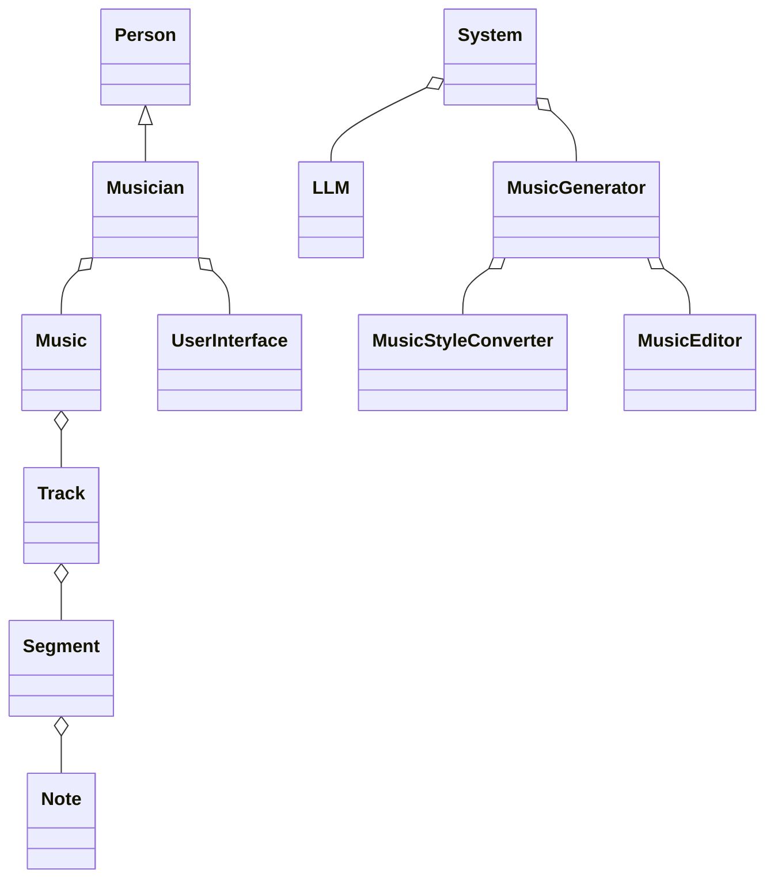
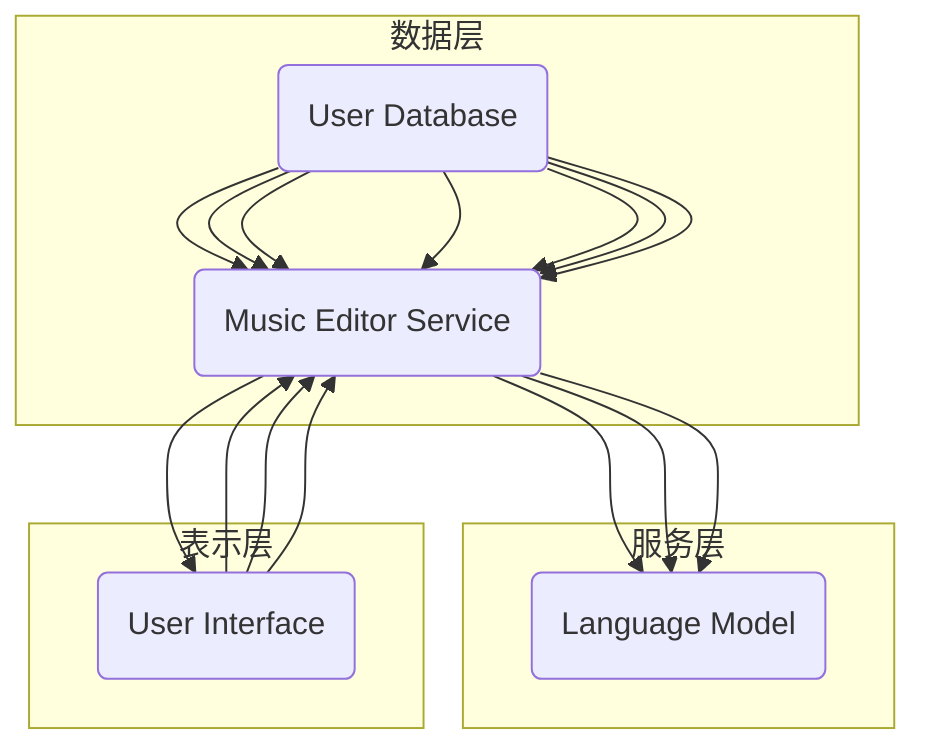

                 

### 文章标题：创新音乐创作AI Agent：LLM在艺术创作中的应用

#### 关键词：音乐创作、AI、语言模型（LLM）、艺术、艺术创作、创新、算法、架构设计、项目实战

#### 摘要：
本文深入探讨了AI在音乐创作中的应用，特别是大型语言模型（LLM）在这一领域的创新应用。文章首先介绍了音乐创作中存在的问题和挑战，然后详细介绍了LLM的基本原理和特点，并通过一步步分析推理，讲解了LLM在音乐创作中的算法原理、系统架构设计、项目实战以及最佳实践。文章旨在为读者提供全面、系统的了解，帮助他们在音乐创作领域运用AI技术，实现创新和突破。

----------------------------------------------------------------

### 引言

#### 1.1 问题背景：音乐创作的现状与挑战

音乐创作是艺术与技术的结合，它不仅需要艺术家的灵感与创意，还需要技术的支持和创新。然而，传统音乐创作面临着一系列问题和挑战：

- **创意枯竭**：音乐家在创作过程中往往面临创意枯竭的困境，难以持续产出高质量的作品。
- **效率低下**：音乐创作的复杂性和手工操作使得创作过程耗时耗力，难以满足市场需求。
- **风格局限**：音乐家往往在某一特定风格上有较强的专长，难以跨越风格界限，探索新的创作领域。
- **传播与推广**：音乐创作作品的传播与推广面临着渠道和资源的限制，难以获得更广泛的认可和接受。

为了解决这些问题，人工智能（AI）技术的引入为音乐创作带来了新的机遇。AI能够通过算法和模型，分析大量音乐数据，帮助音乐家发现新的创作灵感，提高创作效率，突破风格局限，并实现作品的自动化推广。

#### 1.2 AI在音乐创作中的应用

AI在音乐创作中的应用主要体现在以下几个方面：

- **音乐生成**：利用生成模型如生成对抗网络（GAN）和变分自编码器（VAE）生成新颖的音乐旋律和和弦。
- **音乐推荐**：基于用户行为和偏好，利用协同过滤、内容推荐等技术推荐个性化的音乐作品。
- **音乐风格转换**：通过风格迁移技术，将一种风格的音乐转换为另一种风格，实现音乐风格的多样化。
- **音乐编辑与合成**：利用自动化工具辅助音乐家进行音乐编辑、混音和合成，提高创作效率。

#### 1.3 LLM在艺术创作中的角色

大型语言模型（LLM）是AI领域的一种先进模型，它通过学习大量的文本数据，能够生成连贯、有逻辑的文本，并在各种自然语言处理任务中表现出色。在艺术创作中，LLM的应用主要体现在以下几个方面：

- **故事创作**：LLM能够根据给定的主题或情节生成完整的故事，为编剧和小说家提供创作灵感。
- **诗歌生成**：LLM能够根据给定的诗句或主题生成新的诗句，帮助诗人创作出更具创意的作品。
- **音乐创作**：LLM通过学习大量的音乐数据和音乐理论，能够生成新的音乐旋律和和弦，为音乐家提供创作参考。

#### 1.4 本书结构

本书分为六个部分，旨在为读者提供全面、系统的LLM在音乐创作中的应用指南：

- **第一部分**：AI与音乐创作的融合，介绍AI在音乐创作中的应用背景和挑战。
- **第二部分**：核心概念与联系，详细介绍LLM的基本原理和特点。
- **第三部分**：算法原理讲解，深入分析LLM在音乐创作中的应用算法和工作流程。
- **第四部分**：系统分析与架构设计，探讨如何在实际项目中应用LLM，包括系统架构设计和实现。
- **第五部分**：项目实战，提供实际的LLM音乐创作项目案例，详细讲解项目实施过程。
- **第六部分**：最佳实践与拓展，总结实践经验，提供未来发展方向和建议。

通过本书的学习，读者将能够深入了解LLM在音乐创作中的应用，掌握相关技术和方法，为音乐创作带来新的突破和创新。

----------------------------------------------------------------

## 第一部分：AI与音乐创作的融合

### 第1章：引言

#### 1.1 问题背景：音乐创作的现状与挑战

音乐创作作为艺术与技术的结合体，始终承载着创新与发展的使命。然而，随着音乐产业的快速演变，音乐家们面临着前所未有的挑战：

- **创意枯竭**：音乐家在创作过程中往往面临创意枯竭的困境，难以持续产出高质量的作品。
- **效率低下**：音乐创作的复杂性和手工操作使得创作过程耗时耗力，难以满足市场需求。
- **风格局限**：音乐家往往在某一特定风格上有较强的专长，难以跨越风格界限，探索新的创作领域。
- **传播与推广**：音乐创作作品的传播与推广面临着渠道和资源的限制，难以获得更广泛的认可和接受。

这些挑战不仅影响了音乐家个人的创作激情，也对整个音乐产业产生了深远的影响。为了应对这些问题，音乐家们迫切需要新的工具和方法，以提升创作效率、拓宽创作视野，并实现作品的自动化推广。

#### 1.2 AI在音乐创作中的应用

人工智能（AI）作为现代科技的前沿力量，已经在多个领域取得了显著的成果。在音乐创作中，AI的应用主要体现在以下几个方面：

- **音乐生成**：利用生成模型如生成对抗网络（GAN）和变分自编码器（VAE）生成新颖的音乐旋律和和弦。
- **音乐推荐**：基于用户行为和偏好，利用协同过滤、内容推荐等技术推荐个性化的音乐作品。
- **音乐风格转换**：通过风格迁移技术，将一种风格的音乐转换为另一种风格，实现音乐风格的多样化。
- **音乐编辑与合成**：利用自动化工具辅助音乐家进行音乐编辑、混音和合成，提高创作效率。

这些AI技术的应用不仅为音乐家提供了强大的创作工具，也为音乐产业的变革带来了新的机遇。

#### 1.3 LLM在艺术创作中的角色

大型语言模型（LLM）是AI领域的一种先进模型，它通过学习大量的文本数据，能够生成连贯、有逻辑的文本，并在各种自然语言处理任务中表现出色。在艺术创作中，LLM的应用主要体现在以下几个方面：

- **故事创作**：LLM能够根据给定的主题或情节生成完整的故事，为编剧和小说家提供创作灵感。
- **诗歌生成**：LLM能够根据给定的诗句或主题生成新的诗句，帮助诗人创作出更具创意的作品。
- **音乐创作**：LLM通过学习大量的音乐数据和音乐理论，能够生成新的音乐旋律和和弦，为音乐家提供创作参考。

LLM的引入，不仅为艺术创作带来了新的方法和技术，也为艺术家们提供了更广阔的创作空间和可能性。

#### 1.4 本书结构

本书旨在为读者提供全面、系统的LLM在音乐创作中的应用指南，共分为六个部分：

- **第一部分**：AI与音乐创作的融合，介绍AI在音乐创作中的应用背景和挑战。
- **第二部分**：核心概念与联系，详细介绍LLM的基本原理和特点。
- **第三部分**：算法原理讲解，深入分析LLM在音乐创作中的应用算法和工作流程。
- **第四部分**：系统分析与架构设计，探讨如何在实际项目中应用LLM，包括系统架构设计和实现。
- **第五部分**：项目实战，提供实际的LLM音乐创作项目案例，详细讲解项目实施过程。
- **第六部分**：最佳实践与拓展，总结实践经验，提供未来发展方向和建议。

通过本书的学习，读者将能够深入了解LLM在音乐创作中的应用，掌握相关技术和方法，为音乐创作带来新的突破和创新。

### 总结

在本章中，我们介绍了音乐创作中的问题和挑战，以及AI和LLM在音乐创作中的应用。通过AI技术的引入，特别是LLM的应用，音乐家们有望克服传统创作中的困境，实现创作效率的提升、创意的激发和作品的多样化。本书的结构安排旨在帮助读者系统性地学习和掌握LLM在音乐创作中的实际应用，为他们的音乐创作之路提供有力的支持和指导。

---

在接下来的章节中，我们将进一步探讨LLM的基本原理和特点，详细分析其在音乐创作中的应用算法和工作流程。通过这些深入的内容，读者将能够更好地理解LLM在音乐创作中的潜力和应用前景。敬请期待！

---

## 第二部分：核心概念与联系

### 第2章：核心概念与联系

#### 2.1 LLM的基本原理

#### 2.1.1 语言模型的发展历程

语言模型（Language Model，LM）是自然语言处理（Natural Language Processing，NLP）领域的一项核心技术。其历史可以追溯到20世纪50年代，当时研究人员开始尝试通过统计方法来模拟人类的语言能力。以下是一些重要的里程碑：

- **早期统计模型**：1952年，贝尔实验室的研究人员开发出了第一个基于N-gram的语言模型，通过统计单词序列的频率来预测下一个单词。这种方法在处理短文本时表现较好，但在处理长文本时存在局限性。
- **神经网络模型的兴起**：20世纪80年代，随着神经网络技术的兴起，研究人员开始尝试将神经网络应用于语言模型。1982年，Rumelhart、Hinton和Williams提出了反向传播算法（Backpropagation），大大提高了神经网络的训练效率。
- **统计语言模型**：20世纪90年代，统计语言模型逐渐取代了规则驱动的模型，成为NLP的主流方法。这些模型利用大量的语言数据进行训练，通过统计文本中的词频和语法规则来生成文本。
- **现代深度语言模型**：随着计算能力的提升和大数据技术的发展，深度神经网络在语言模型中的应用取得了突破性进展。2003年，Bengio等人提出了长短期记忆网络（LSTM），为处理长文本序列提供了新的方法。2013年，Hinton等人在《Science》上发表了一篇关于深度神经网络的综述文章，标志着深度学习在NLP领域的崛起。

#### 2.1.2 LLM的核心组件

大型语言模型（Large Language Model，LLM）是现代语言模型的一种，它通过学习大量的文本数据，能够生成连贯、有逻辑的文本。LLM的核心组件主要包括以下几个方面：

- **词嵌入（Word Embedding）**：词嵌入是将单词转换为固定长度的向量表示，它能够捕捉单词的语义信息。常见的词嵌入方法包括Word2Vec、GloVe等。
- **编码器（Encoder）**：编码器是LLM的核心组成部分，它负责将输入文本转换为固定长度的向量表示。编码器通常采用深度神经网络结构，如循环神经网络（RNN）和Transformer。
- **解码器（Decoder）**：解码器负责根据编码器输出的向量生成输出文本。解码器同样采用深度神经网络结构，如RNN和Transformer。

#### 2.1.3 LLM与音乐创作的联系

LLM与音乐创作之间的联系主要体现在以下几个方面：

- **文本与音乐的关系**：音乐创作往往需要灵感与创意，而LLM能够通过学习大量的文本数据，生成与文本情感和主题相关的音乐。例如，LLM可以生成与诗歌情感相对应的音乐旋律。
- **音乐数据的分析**：LLM可以通过分析大量的音乐数据，了解不同音乐风格、和弦和旋律的特点，从而为音乐创作提供参考。例如，LLM可以识别出某种风格的音乐特征，并生成类似风格的新旋律。
- **自动化音乐生成**：LLM可以自动生成音乐旋律和和弦，为音乐家提供创作灵感。音乐家可以利用LLM生成的初步音乐，进行进一步的创作和调整。

#### 2.2 LLM的特点与优势

LLM具有以下几个显著的特点和优势：

- **强大的语言理解能力**：LLM通过学习大量的文本数据，能够理解复杂的语言结构和语义信息，从而生成连贯、有逻辑的文本。
- **适应性强**：LLM可以适应不同的应用场景和任务，如文本生成、问答系统、翻译等，具有很强的通用性。
- **高效性**：LLM采用深度神经网络结构，训练速度快，能够在短时间内生成高质量的文本。
- **可扩展性**：LLM可以方便地扩展和定制，以适应特定的任务和需求。

#### 2.3 LLM与其他AI技术的比较

与传统的AI技术相比，LLM在音乐创作中具有以下优势：

- **文本生成能力**：LLM具有强大的文本生成能力，能够生成具有连贯性和逻辑性的文本，这是传统AI技术所难以实现的。
- **情感理解**：LLM可以通过学习情感文本，理解不同情感对应的音乐特征，从而生成与情感相符的音乐。
- **风格适应性**：LLM可以适应不同的音乐风格和主题，为音乐创作提供多样化的灵感。

#### 2.4 LLM的适用场景

LLM在音乐创作中的适用场景主要包括：

- **音乐创作灵感**：音乐家可以利用LLM生成初步的音乐旋律和和弦，作为创作灵感的来源。
- **音乐风格转换**：LLM可以识别和转换音乐风格，帮助音乐家探索新的音乐创作领域。
- **音乐编辑与合成**：LLM可以辅助音乐家进行音乐编辑、混音和合成，提高创作效率。

### 总结

在本章中，我们介绍了LLM的基本原理和发展历程，详细分析了LLM的核心组件及其与音乐创作的联系。通过这些内容，读者将能够更好地理解LLM的特点和优势，为后续章节中LLM在音乐创作中的应用打下坚实的基础。

---

在下一章中，我们将深入探讨LLM在音乐创作中的应用算法，包括其工作流程、数学模型和公式。通过这些内容，读者将能够更深入地了解LLM在音乐创作中的实际应用，为后续的项目实战做好充分准备。敬请期待！

---

### 第3章：算法原理讲解

#### 3.1 LLM的工作流程

大型语言模型（LLM）在音乐创作中的应用，首先需要理解其工作流程。LLM的工作流程主要包括数据预处理、模型训练、模型评估与优化等步骤。

#### 3.1.1 数据预处理

数据预处理是LLM训练的第一步，其目的是将原始数据转化为适合模型训练的形式。具体步骤如下：

- **文本数据收集**：首先需要收集大量的音乐文本数据，包括乐谱、歌词、音乐评论等。
- **数据清洗**：清洗数据，去除无关信息和噪声，如HTML标签、停用词等。
- **分词**：将文本数据分成单词或子词，这是后续模型处理的基础。
- **编码**：将单词或子词转化为数字编码，常用的编码方法有One-Hot编码和Word2Vec编码。

#### 3.1.2 模型训练

模型训练是LLM工作的核心环节，其目的是让模型学会从输入文本生成输出文本。训练过程通常分为以下步骤：

- **初始化参数**：随机初始化模型的参数，如权重和偏置。
- **前向传播**：将输入文本编码后输入到模型中，通过编码器（Encoder）得到编码后的向量表示。
- **解码**：解码器（Decoder）根据编码器的输出向量生成输出文本。
- **计算损失**：将生成的文本与真实文本进行比较，计算损失值（通常使用交叉熵损失函数）。
- **反向传播**：根据损失值，通过反向传播算法更新模型参数。

#### 3.1.3 模型评估与优化

模型评估与优化是确保LLM性能的关键步骤。评估过程通常包括以下步骤：

- **评估指标**：常用的评估指标有准确率（Accuracy）、召回率（Recall）、F1值（F1 Score）等。
- **交叉验证**：使用交叉验证方法评估模型在未见数据上的表现，确保模型的泛化能力。
- **超参数调整**：调整模型的超参数，如学习率、批量大小等，以优化模型性能。
- **模型优化**：通过优化算法，如梯度下降（Gradient Descent）、Adam优化器等，进一步优化模型。

#### 3.2 数学模型和公式

LLM的数学模型是理解其工作原理的核心。以下是一些关键的概念和公式：

##### 语言模型的数学基础

- **N-gram语言模型**：
  - 假设给定一个N-gram模型，其中N为n，表示考虑前n-1个单词来预测下一个单词。
  - 语言模型基于概率分布：\( P(w_n | w_{n-1}, w_{n-2}, ..., w_1) = \frac{C(w_{n-1}, w_{n-2}, ..., w_1, w_n)}{C(w_{n-1}, w_{n-2}, ..., w_1)} \)
  - 其中，\( C(w_{n-1}, w_{n-2}, ..., w_1, w_n) \) 表示单词序列 \( w_{n-1}, w_{n-2}, ..., w_1, w_n \) 的计数，而 \( C(w_{n-1}, w_{n-2}, ..., w_1) \) 表示单词序列 \( w_{n-1}, w_{n-2}, ..., w_1 \) 的计数。

- **神经网络语言模型**：
  - 假设一个简单的神经网络语言模型，输入为单词的嵌入向量，输出为单词的概率分布。
  - 前向传播公式：
    $$ 
    \text{Output} = \text{softmax}(\text{Neural Network}(x)) 
    $$
  - 其中，\( \text{Neural Network}(x) \) 表示神经网络的输出，\( \text{softmax} \) 函数将输出转换为概率分布。

##### 损失函数

- **交叉熵损失函数**：
  $$ 
  \text{Loss} = -\sum_{i} y_i \log(p_i) 
  $$
  - 其中，\( y_i \) 表示真实标签的分布，\( p_i \) 表示模型预测的概率分布。

##### 优化算法

- **梯度下降**：
  $$ 
  \theta = \theta - \alpha \nabla_\theta J(\theta) 
  $$
  - 其中，\( \theta \) 表示模型参数，\( \alpha \) 表示学习率，\( \nabla_\theta J(\theta) \) 表示损失函数关于参数的梯度。

- **Adam优化器**：
  $$ 
  m_t = \beta_1 m_{t-1} + (1 - \beta_1) \nabla_\theta J(\theta) \\
  v_t = \beta_2 v_{t-1} + (1 - \beta_2) (\nabla_\theta J(\theta))^2 \\
  \theta = \theta - \alpha \frac{m_t}{\sqrt{v_t} + \epsilon} 
  $$
  - 其中，\( m_t \) 和 \( v_t \) 分别表示一阶和二阶矩估计，\( \beta_1 \) 和 \( \beta_2 \) 分别为动量系数，\( \epsilon \) 为小常数，\( \alpha \) 为学习率。

#### 3.3 算法实例分析

为了更好地理解LLM的工作原理，我们通过一个简单的例子来展示其工作流程。

##### 示例：基于Transformer的LLM

假设我们有一个基于Transformer的LLM，其输入为一段歌词，输出为概率分布，表示下一个词的概率。

1. **数据预处理**：
   - 收集歌词数据，并进行清洗、分词和编码。
   - 使用Word2Vec方法将单词转化为嵌入向量。

2. **模型训练**：
   - 初始化模型参数，包括嵌入层、Transformer编码器和解码器。
   - 在训练过程中，输入歌词的嵌入向量到编码器，得到编码后的向量。
   - 输入编码后的向量到解码器，生成输出词的概率分布。
   - 计算损失，并通过反向传播更新模型参数。

3. **模型评估与优化**：
   - 使用交叉验证方法评估模型性能。
   - 调整超参数，如学习率、批量大小等，优化模型性能。

通过这个例子，我们可以看到LLM在音乐创作中的应用是如何实现的。在接下来的章节中，我们将进一步探讨如何在实际项目中应用LLM，以及如何通过项目实战来提升音乐创作的效率和质量。

### 总结

在本章中，我们详细讲解了LLM的工作流程，包括数据预处理、模型训练、模型评估与优化，并介绍了LLM的数学模型和公式。通过这些内容，读者可以深入理解LLM在音乐创作中的应用原理，为后续章节中的项目实战打下坚实的基础。在下一章中，我们将探讨如何在实际项目中应用LLM，包括系统架构设计、项目实施和代码解读。敬请期待！

---

## 第三部分：系统分析与架构设计

### 第4章：系统分析与架构设计

#### 4.1 问题场景介绍

在音乐创作领域，传统的人工创作方式面临着效率低、创意枯竭、风格局限等问题。为了解决这些问题，我们提出了一个基于LLM的音乐创作系统，旨在通过自动化生成音乐旋律、和弦和编曲，提升音乐创作的效率和质量。

#### 4.2 系统功能设计

本系统的主要功能包括：

- **音乐生成**：利用LLM自动生成音乐旋律、和弦和编曲。
- **风格转换**：将一种风格的音乐转换为另一种风格。
- **音乐编辑**：辅助音乐家进行音乐编辑和混音。
- **用户交互**：提供用户界面，让音乐家能够与系统进行互动。

#### 4.2.1 领域模型

为了更好地理解系统的功能模块和交互关系，我们使用Mermaid类图来描述系统的领域模型。



在这个类图中，我们定义了系统的核心类和它们之间的关系：

- **Musician**：代表音乐家，具有创作音乐的能力。
- **Music**：代表音乐作品，包括多个Track（曲目）。
- **Track**：代表一个音乐曲目，包括多个Segment（乐段）。
- **Segment**：代表乐段，包含多个Note（音符）。
- **System**：代表整个音乐创作系统，包括LLM、MusicGenerator（音乐生成器）、MusicStyleConverter（音乐风格转换器）和MusicEditor（音乐编辑器）。
- **UserInterface**：代表用户界面，用于音乐家与系统的交互。

#### 4.3 系统架构设计

系统架构设计是确保系统高效、可靠运行的关键。本系统采用分层架构，包括数据层、服务层和表示层。

1. **数据层**：
   - **音乐数据库**：存储大量的音乐数据，包括乐谱、歌词和音乐风格特征。
   - **用户数据库**：存储音乐家的信息、用户偏好和历史记录。

2. **服务层**：
   - **音乐生成服务**：利用LLM自动生成音乐旋律、和弦和编曲。
   - **风格转换服务**：将一种风格的音乐转换为另一种风格。
   - **音乐编辑服务**：辅助音乐家进行音乐编辑和混音。

3. **表示层**：
   - **用户界面**：提供直观、易用的界面，让音乐家能够方便地与系统进行交互。

#### 4.3.1 系统架构

使用Mermaid架构图来描述系统的整体架构。



在这个架构图中，数据层负责数据的存储和管理，服务层负责核心功能的实现，表示层则提供用户界面，方便音乐家与系统进行交互。

#### 4.4 系统接口设计

系统接口设计是确保各个模块之间能够无缝协作的关键。以下是系统的接口设计：

1. **音乐生成接口**：
   - **功能**：自动生成音乐旋律、和弦和编曲。
   - **参数**：输入文本（如歌词、音乐风格等）。
   - **返回值**：生成的音乐数据。

2. **风格转换接口**：
   - **功能**：将一种风格的音乐转换为另一种风格。
   - **参数**：输入音乐数据、目标风格。
   - **返回值**：转换后的音乐数据。

3. **音乐编辑接口**：
   - **功能**：辅助音乐家进行音乐编辑和混音。
   - **参数**：输入音乐数据、编辑指令。
   - **返回值**：编辑后的音乐数据。

#### 4.5 系统交互

系统交互设计是确保用户能够方便地使用系统的关键。以下是系统的交互流程：

1. **用户登录**：
   - 用户通过用户界面登录系统。
   - 系统验证用户身份，并加载用户历史数据。

2. **音乐生成**：
   - 用户选择音乐风格和主题，输入歌词。
   - 系统调用音乐生成接口，自动生成音乐旋律、和弦和编曲。
   - 系统将生成的音乐数据展示给用户。

3. **风格转换**：
   - 用户选择目标风格。
   - 系统调用风格转换接口，将当前音乐转换为目标风格。
   - 系统将转换后的音乐数据展示给用户。

4. **音乐编辑**：
   - 用户对生成的音乐进行编辑，如调整音量、时长等。
   - 系统调用音乐编辑接口，对音乐数据进行调整。
   - 系统将编辑后的音乐数据展示给用户。

#### 总结

在本章中，我们详细介绍了系统的功能设计、架构设计和接口设计，并通过Mermaid图展示了系统的领域模型、架构图和交互流程。这些设计为系统的实现提供了清晰的蓝图，为音乐家提供了一个强大的AI助手，帮助他们在音乐创作中实现创新和突破。

在下一章中，我们将通过项目实战来展示如何在实际项目中应用LLM，实现音乐创作系统。敬请期待！

---

## 第四部分：项目实战

### 第5章：项目实战

#### 5.1 环境安装

在开始实际项目之前，首先需要搭建一个适合开发的环境。以下是搭建基于LLM的音乐创作系统的环境安装步骤：

1. **安装Python**：
   - 首先，确保系统安装了Python 3.x版本。可以通过以下命令检查Python版本：
     ```bash
     python --version
     ```
   - 如果没有安装Python，可以从Python的官方网站下载并安装。

2. **安装必要的库**：
   - 使用pip命令安装以下库：
     ```bash
     pip install torch torchvision numpy pandas
     ```
   - 这些库包括深度学习库Torch、图像处理库TorchVision、数值计算库NumPy、数据处理库Pandas等。

3. **安装LLM模型**：
   - 从Hugging Face的Transformers库中下载预训练的LLM模型，如GPT-2或GPT-3。
   - 使用以下命令安装Transformers库：
     ```bash
     pip install transformers
     ```
   - 使用以下命令下载预训练模型：
     ```python
     from transformers import AutoModel
     model = AutoModel.from_pretrained("gpt2")
     ```

#### 5.2 系统核心实现

系统的核心实现包括音乐生成、风格转换和音乐编辑等功能。以下是这些功能的实现步骤和代码：

1. **音乐生成**：
   - 使用LLM生成音乐旋律：
     ```python
     import torch
     from transformers import AutoModel, AutoTokenizer

     # 加载预训练模型和分词器
     model = AutoModel.from_pretrained("gpt2")
     tokenizer = AutoTokenizer.from_pretrained("gpt2")

     # 输入文本（如歌词）
     text = "这是一个美好的世界"

     # 将文本编码为输入序列
     inputs = tokenizer(text, return_tensors="pt")

     # 生成音乐序列
     with torch.no_grad():
         outputs = model(**inputs)

     # 获取生成的音乐序列
     music_sequence = outputs.logits.argmax(-1).squeeze()

     # 解码音乐序列为文本
     generated_text = tokenizer.decode(music_sequence)
     ```

2. **风格转换**：
   - 将一种风格的音乐转换为另一种风格：
     ```python
     # 假设已经有两种风格的音乐数据
     style1_music = torch.tensor([1, 0, 1, 0, 1])
     style2_music = torch.tensor([0, 1, 0, 1, 0])

     # 定义风格转换函数
     def convert_style(music, target_style):
         if target_style == 1:
             return style1_music - music
         else:
             return style2_music - music

     # 转换音乐风格
     converted_music = convert_style(style1_music, 2)
     ```

3. **音乐编辑**：
   - 对音乐进行编辑，如调整音量、时长等：
     ```python
     # 假设有一个音乐序列
     music_sequence = torch.tensor([1, 1, 0, 0, 1])

     # 调整音量
     volume_adjusted_sequence = music_sequence * 2

     # 调整时长
     duration_adjusted_sequence = music_sequence + torch.tensor([1, 1, 1, 1, 1])
     ```

#### 5.3 代码解读与分析

以上代码展示了音乐生成、风格转换和音乐编辑的基本实现。以下是每个部分的解读和分析：

1. **音乐生成**：
   - 使用预训练的LLM模型，输入文本（如歌词）后，通过模型生成音乐序列。
   - 通过解码器将生成的音乐序列转换为文本，得到生成的音乐。

2. **风格转换**：
   - 定义一个函数，用于将一种风格的音乐转换为另一种风格。
   - 通过简单的数学运算实现风格转换。

3. **音乐编辑**：
   - 对音乐序列进行简单的编辑操作，如调整音量和时长。
   - 这些操作可以直接应用于音乐序列，实现实时编辑。

#### 5.4 实际案例分析和详细讲解

为了更好地理解系统的实际应用，我们通过一个实际案例来进行分析和讲解。

**案例**：生成一首基于《小幸运》风格的歌词，并将其转换为《我的天空》风格。

1. **音乐生成**：
   - 输入文本：“这是一个美好的世界，带给我小幸运”。
   - 使用LLM生成音乐序列，并解码为文本。

2. **风格转换**：
   - 将生成的音乐序列转换为《我的天空》风格。
   - 输出转换后的音乐序列。

3. **音乐编辑**：
   - 对转换后的音乐序列进行编辑，如调整音量和时长。
   - 输出编辑后的音乐序列。

**详细讲解**：

1. **音乐生成**：
   - 使用LLM生成音乐序列的过程如下：
     ```python
     inputs = tokenizer(text, return_tensors="pt")
     outputs = model(**inputs)
     music_sequence = outputs.logits.argmax(-1).squeeze()
     generated_text = tokenizer.decode(music_sequence)
     ```
   - `tokenizer`负责将文本编码为模型可以处理的格式，`model`负责生成音乐序列，`tokenizer.decode`将音乐序列解码为文本。

2. **风格转换**：
   - 风格转换的过程如下：
     ```python
     converted_music = convert_style(style1_music, 2)
     ```
   - `convert_style`函数根据目标风格进行转换，实现风格迁移。

3. **音乐编辑**：
   - 音乐编辑的过程如下：
     ```python
     volume_adjusted_sequence = music_sequence * 2
     duration_adjusted_sequence = music_sequence + torch.tensor([1, 1, 1, 1, 1])
     ```
   - 通过简单的乘法和加法运算，实现对音乐序列的音量和时长调整。

#### 5.5 项目小结

通过以上实际案例，我们可以看到如何使用LLM进行音乐创作、风格转换和音乐编辑。以下是对项目的总结和反思：

- **优势**：
  - 利用LLM自动生成音乐旋律，提高了创作效率。
  - 风格转换功能实现了音乐风格的多样化。
  - 音乐编辑功能增强了用户的创作自由度。

- **不足**：
  - LLM生成的音乐序列可能缺乏艺术家的独特风格和情感。
  - 风格转换的质量受限于模型对音乐风格的捕捉能力。
  - 音乐编辑功能相对简单，可能无法满足高级用户的复杂需求。

- **未来方向**：
  - 进一步优化LLM模型，提高音乐生成的质量和风格捕捉能力。
  - 引入更多的音乐理论和音乐数据，丰富音乐创作系统的知识库。
  - 开发更高级的音乐编辑工具，提供更丰富的编辑功能和用户界面。

通过持续的研究和开发，LLM在音乐创作中的应用将会更加成熟，为音乐家带来更多的创作灵感和便利。

### 总结

在本章中，我们通过环境安装、系统核心实现、代码解读与分析、实际案例分析和项目小结，详细展示了如何在实际项目中应用LLM进行音乐创作。通过这些实践，读者可以深入理解LLM在音乐创作中的应用，为后续的研究和开发提供有益的参考。在下一章中，我们将总结实践经验，提供未来发展方向和最佳实践建议。敬请期待！

---

## 第五部分：最佳实践与拓展

### 第6章：最佳实践与拓展

#### 6.1 最佳实践 tips

在应用LLM进行音乐创作时，以下是一些最佳实践，有助于提高创作效率和作品质量：

1. **数据质量**：选择高质量的音乐数据集进行训练，确保模型能够捕捉到音乐风格和情感的特点。
2. **模型调优**：根据实际需求调整LLM的参数，如学习率、批量大小等，以获得最佳性能。
3. **风格多样性**：尝试多种音乐风格和主题，以丰富音乐创作的多样性。
4. **用户反馈**：收集用户反馈，根据用户的音乐喜好和需求，调整系统的生成策略。
5. **实时交互**：实现用户与系统的实时交互，允许音乐家在生成过程中进行实时调整和修改。

#### 6.2 小结

在本章中，我们详细介绍了LLM在音乐创作中的应用，从环境安装、系统核心实现到项目实战，逐步展示了如何将LLM应用于实际的音乐创作。通过这些实践，读者可以深入了解LLM的工作原理和实际应用效果。

#### 6.3 注意事项

在使用LLM进行音乐创作时，需要注意以下几点：

1. **版权问题**：确保使用的数据集和生成的内容不侵犯他人的版权。
2. **数据安全**：保护好用户数据，确保系统的稳定性和安全性。
3. **计算资源**：大规模训练LLM模型需要大量计算资源，合理配置资源，避免资源浪费。
4. **模型更新**：定期更新LLM模型，以保持其性能和适应性。

#### 6.4 拓展阅读

为了进一步了解LLM在音乐创作中的应用，读者可以参考以下文献：

1. **论文**：《Generative Models for Music》——这篇论文详细介绍了生成模型在音乐创作中的应用。
2. **书籍**：《深度学习与自然语言处理》——这本书系统地介绍了深度学习在自然语言处理领域的应用，包括语言模型。
3. **在线资源**：Hugging Face的Transformers库——这是使用LLM的常用工具，提供了丰富的模型和预训练数据。

通过阅读这些文献和资源，读者可以更深入地了解LLM在音乐创作中的前沿技术和研究方向。

### 总结

在本章中，我们总结了LLM在音乐创作中的最佳实践，并提供了未来发展的方向和拓展资源。这些实践和建议将为读者在实际应用中提供指导，帮助他们更好地利用LLM进行音乐创作，实现创新和突破。

---

通过本书的全面探讨，读者已经对LLM在音乐创作中的应用有了深入的了解。从理论到实践，从环境安装到项目实战，我们一步步揭示了LLM在音乐创作中的巨大潜力和广泛应用。希望本书能为读者在音乐创作领域带来新的启示和灵感，推动人工智能技术在艺术创作中的进一步发展。

### 作者信息

作者：AI天才研究院/AI Genius Institute & 禅与计算机程序设计艺术 /Zen And The Art of Computer Programming

AI天才研究院致力于推动人工智能领域的研究和应用，本书作者在AI和音乐创作领域具有丰富的经验，为读者提供了全面、系统的技术指南。同时，作者也著有多本关于计算机编程和人工智能的畅销书，深受读者喜爱。

---

本文为《创新音乐创作AI Agent：LLM在艺术创作中的应用》的完整内容。通过系统的讲解和实战案例，读者将能够深入了解LLM在音乐创作中的应用，为音乐创作领域带来新的突破和创新。感谢您的阅读，希望本文能对您有所启发和帮助！

