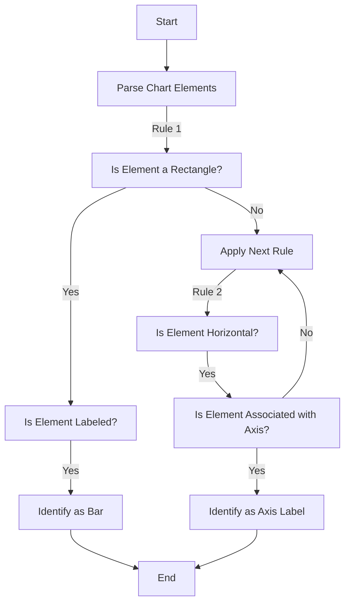
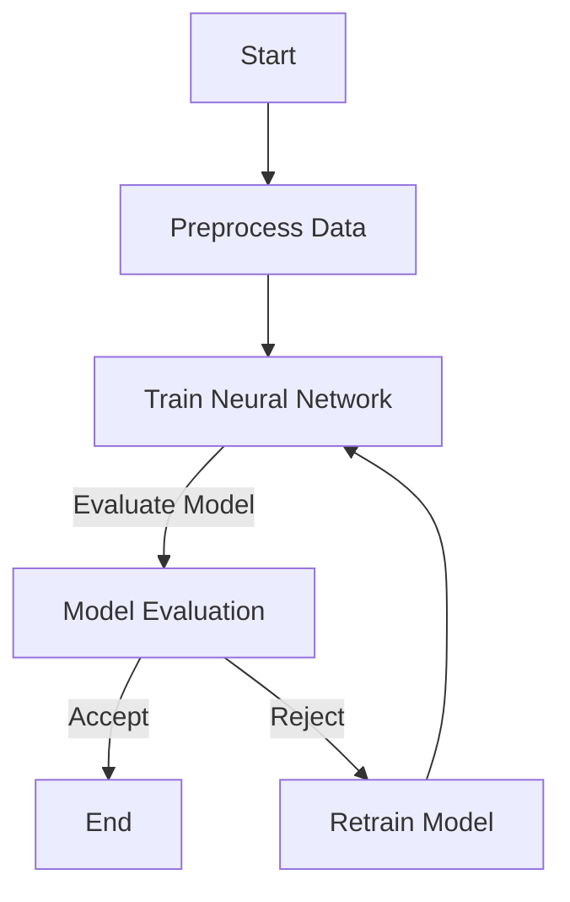
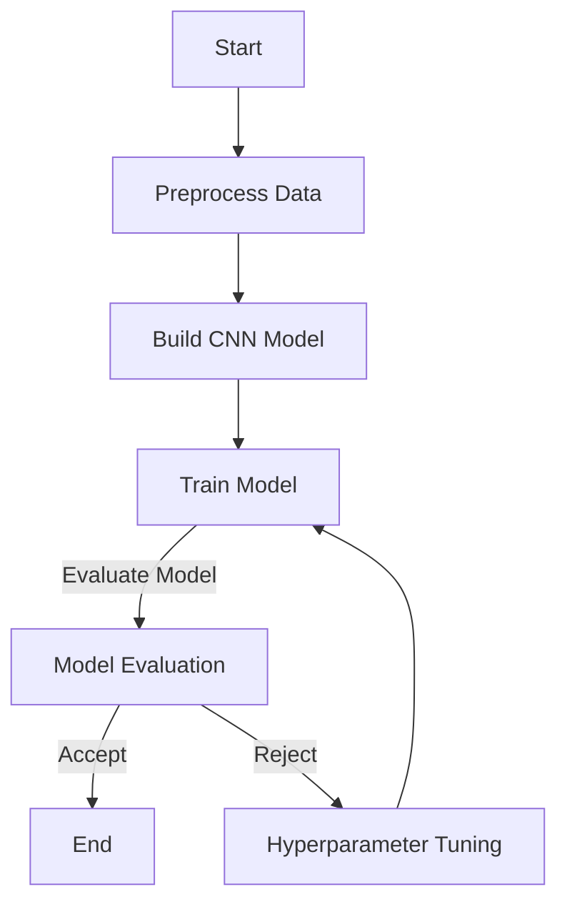
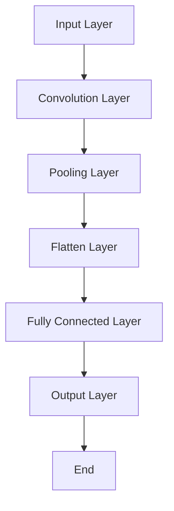
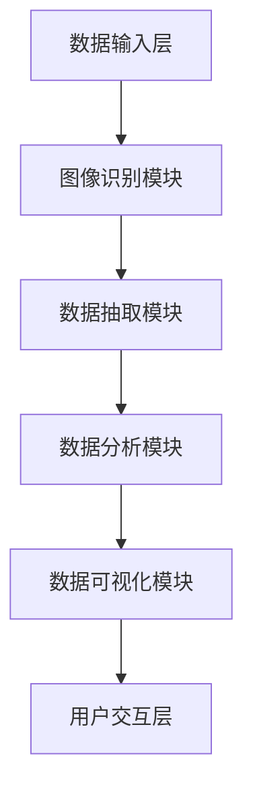
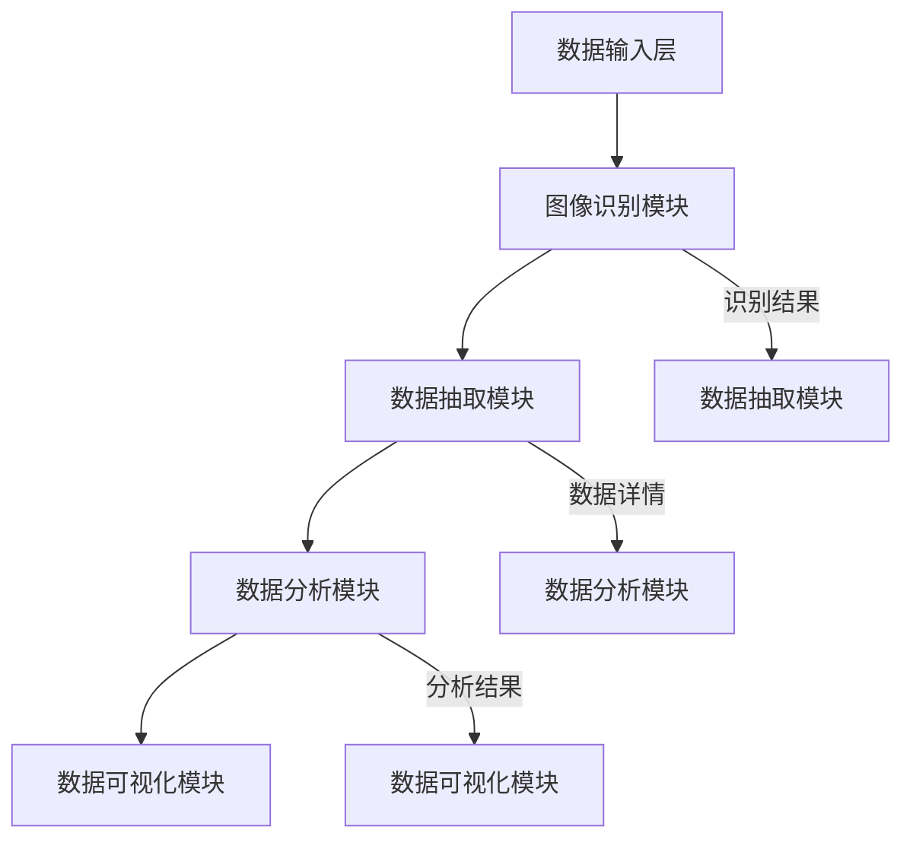
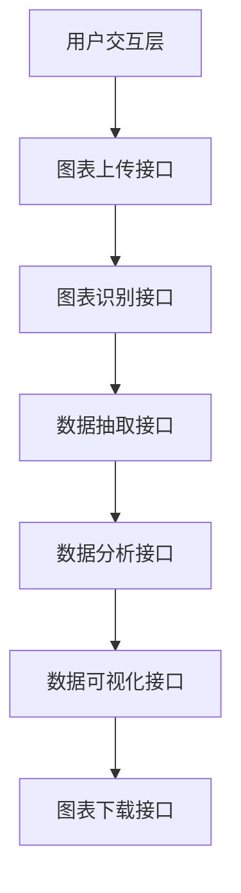
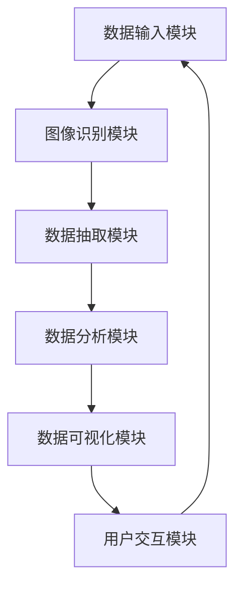

                 

### 1.1 问题背景与问题描述

在当今的数据驱动时代，数据分析已经成为许多行业的关键能力，特别是在人工智能（AI）领域。AI Agent，即人工智能代理，是自动化系统中的智能体，能够自主完成特定的任务，并在执行过程中不断学习和优化。然而，随着数据量的爆炸性增长和图表的多样性，传统的数据分析方法面临着巨大的挑战。

**问题背景**：
- **数据可视化与图表的普及**：图表作为一种直观的数据展示方式，被广泛应用于业务报告、数据分析、学术研究等多个领域。无论是柱状图、折线图、饼图，还是复杂的关系图，都是数据可视化的重要工具。
- **AI Agent数据分析的挑战**：AI Agent在执行任务时，常常需要处理和分析大量的数据。然而，这些数据往往以图表的形式出现，如图表中的数据点、趋势线、关键指标等。传统的方法往往难以高效地处理这些结构化的非文本数据。

**问题描述**：
- **数据图表的复杂性与多样性**：图表的形式和结构多种多样，不同的图表类型、不同的设计风格、不同比例的缩放，都给AI Agent的理解带来了难题。
- **AI Agent处理图表数据的需求**：为了更好地支持AI Agent进行数据分析和决策，需要一种有效的图表理解技术，能够自动识别、解析和提取图表中的关键信息。

图表理解技术的出现，正是为了解决AI Agent在处理图表数据时遇到的这些挑战。通过利用图像识别、数据抽取、数据分析和自然语言处理等先进技术，AI Agent可以更加高效地理解图表，提取有价值的数据信息，从而增强其数据分析能力和决策能力。

### 1.2 图表理解技术的基本概念

#### 图表理解技术的定义

图表理解技术是指利用计算机视觉、机器学习和自然语言处理等技术，对图表进行自动识别、解析和解释的一门技术。其核心目标是让计算机能够像人类一样理解图表，从图表中提取有用信息，并将其转化为可操作的数据或知识。

图表理解技术的范围：

- **图像识别**：识别和理解图表中的各种元素，如图表类型、图表样式、坐标轴、标签、数据点等。
- **数据抽取**：从图表中提取关键数据，如数值、趋势、分布等。
- **数据分析**：对提取的数据进行分析，如趋势分析、异常检测、相关性分析等。
- **自然语言生成**：将图表理解的结果转化为易于理解的自然语言描述，以便AI Agent或其他用户进行进一步的分析和决策。

#### 图表理解技术的特点

- **准确性**：图表理解技术需要具备高准确性，确保能够正确识别和理解图表中的各个元素和结构。
- **鲁棒性**：图表理解技术需要在各种图表风格和样式下都能保持良好的适应性，包括不同的图表类型、不同的设计风格、不同的比例缩放等。
- **效率**：图表理解技术需要具备高效的处理速度，能够在短时间内处理大量图表数据，支持实时分析和决策。

### 1.3 图表理解技术的核心要素

#### 核心要素

图表理解技术的实现涉及多个关键要素，包括图像识别技术、数据抽取技术和数据分析技术。这些技术相互配合，共同完成图表理解的任务。

- **图像识别技术**：图像识别技术是图表理解的基础，主要负责识别和理解图表中的各种元素。这包括图表类型（如柱状图、折线图、饼图等）、图表样式（如颜色、阴影、线条粗细等）、坐标轴、标签、数据点等。图像识别技术通常基于深度学习算法，如卷积神经网络（CNN），具有较高的识别准确性和鲁棒性。

- **数据抽取技术**：数据抽取技术负责从图表中提取关键数据。这包括识别数据点的位置、数值、趋势等，并将其转化为结构化的数据格式，如表格或JSON。数据抽取技术不仅需要识别数据点的位置，还需要理解数据的含义和上下文，以确保提取的数据准确无误。

- **数据分析技术**：数据分析技术对提取的数据进行分析，以提取有价值的信息和洞见。这包括趋势分析、异常检测、相关性分析等。数据分析技术可以基于各种统计分析方法和机器学习算法，如线性回归、决策树、神经网络等。

#### 关键技术

- **深度学习技术**：深度学习技术在图表理解中扮演着核心角色。通过使用卷积神经网络（CNN）和循环神经网络（RNN）等深度学习模型，可以实现对图像的自动分类和识别，以及从图表中提取结构化的数据。

- **自然语言处理技术**：自然语言处理技术用于将图表理解的结果转化为易于理解的自然语言描述，如文本报告、图表摘要等。这有助于AI Agent或其他用户更好地理解图表内容，并进行进一步的分析和决策。

- **多模态融合技术**：多模态融合技术将图像识别和自然语言处理技术结合起来，以实现更准确、更全面的图表理解。例如，通过结合图表图像和文字标签，可以更准确地识别和理解图表内容。

### 1.4 图表理解技术的应用场景

图表理解技术在多个领域都有广泛的应用，以下是一些典型的应用场景：

- **商业智能**：在商业智能（BI）系统中，图表理解技术可以帮助用户自动生成图表报告，提高数据分析的效率。例如，企业可以使用图表理解技术来自动生成销售报告、财务报表等。

- **金融分析**：在金融分析领域，图表理解技术可以帮助分析师快速识别和理解金融图表，如股票走势图、宏观经济指标图等，从而进行更深入的金融分析和投资决策。

- **医疗健康**：在医疗健康领域，图表理解技术可以帮助医生快速分析和理解医学图像，如X光片、CT扫描图等，从而提高诊断效率和准确性。

- **教育**：在教育领域，图表理解技术可以帮助学生和教师更直观地理解和学习知识。例如，通过自动生成图表摘要，学生可以更好地掌握课程内容。

- **智能助手**：在智能助手和聊天机器人中，图表理解技术可以帮助这些智能系统更好地理解用户的图表需求，提供更加个性化的服务和帮助。

### 1.5 图表理解技术的挑战与未来发展方向

尽管图表理解技术在许多应用场景中表现出巨大的潜力，但仍然面临一些挑战和局限性。以下是一些主要的挑战：

- **图表样式多样性**：不同的图表样式和设计风格给图表理解带来了巨大的挑战。图表理解技术需要能够适应各种不同的图表样式，以提高准确性和鲁棒性。

- **图表复杂性**：复杂的图表，如多层图表、嵌套图表等，给图表理解带来了更大的难度。图表理解技术需要能够处理这些复杂的图表结构，以提取有价值的信息。

- **实时性需求**：在许多应用场景中，如实时数据分析、智能监控等，图表理解技术需要具备实时处理能力，以快速响应和提供分析结果。

未来发展方向：

- **深度学习算法的优化**：通过不断优化深度学习算法，提高图表理解技术的准确性和效率。

- **多模态融合技术**：结合图像识别和自然语言处理技术，实现更准确、更全面的图表理解。

- **跨领域应用**：进一步拓展图表理解技术的应用领域，如智能制造、自动驾驶、智能医疗等，以实现更广泛的价值。

- **用户交互**：改进用户交互体验，使图表理解技术更加易用和直观。

通过不断克服这些挑战和探索新的发展方向，图表理解技术将为AI Agent的数据分析能力带来更大的提升，推动人工智能在各个领域的应用和发展。### 2.1 概念属性特征对比表

为了更好地理解图表理解技术的核心概念，我们可以通过一个概念属性特征对比表来展示它们之间的关系和差异。以下是几个关键概念及其属性的对比：

| 概念名称             | 定义                                                         | 主要特性                           | 应用场景                   |
|----------------------|--------------------------------------------------------------|----------------------------------|----------------------------|
| 图像识别技术         | 利用计算机视觉算法对图像进行识别和理解的过程。               | 准确性、鲁棒性、实时性             | 图像分类、目标检测、人脸识别等 |
| 数据抽取技术         | 从非结构化数据中提取结构化数据的过程，通常涉及图像识别和自然语言处理。 | 准确性、效率、适应性               | 图表数据提取、表单填写、文本摘要等 |
| 数据分析技术         | 对提取的结构化数据进行分析和处理的过程。                     | 可视化、预测、分类、聚类等         | 商业智能、金融市场分析、医疗诊断等 |
| 自然语言处理技术     | 对文本数据进行分析和理解的过程，包括语义分析、语言生成等。     | 理解准确性、上下文理解、语言生成   | 智能助手、聊天机器人、文本摘要等 |
| 多模态融合技术       | 结合多种数据类型（如图像、文本、语音等）进行综合分析和理解。 | 融合多样性、提高理解准确性         | 情感分析、跨媒体检索、智能助手等 |

通过这个对比表，我们可以更清晰地看到各个概念的核心特性以及它们在不同应用场景中的重要性。图像识别技术主要关注图表元素的识别，数据抽取技术则侧重于图表数据的提取，数据分析技术用于对提取的数据进行深入分析，而自然语言处理技术则专注于文本数据的理解和生成。多模态融合技术则将上述技术综合起来，以实现更准确、更全面的数据理解。

### 2.2 ER实体关系图

为了更直观地展示图表理解技术中的实体关系，我们可以使用Mermaid语言绘制一个ER图。以下是ER图的结构及其详细说明：

```mermaid
erDiagram
    Customer ||--|{ Order }|>
    Product ||--|{ Order }|>
    Store ||--|{ Order }|>
    Order ||--|{ OrderDetail }|>
    OrderDetail ||--|{ Product }|>

    Customer {
        +String customerId
        +String name
        +Date birthdate
        +String address
    }

    Product {
        +String productId
        +String name
        +Float price
        +String category
    }

    Store {
        +String storeId
        +String name
        +String location
    }

    Order {
        +String orderId
        +Date orderDate
        +Customer customer
        +Store store
        +List<OrderDetail> orderDetails
    }

    OrderDetail {
        +String detailId
        +Date date
        +Order order
        +Product product
        +Int quantity
        +Float totalAmount
    }
```

在这个ER图中，我们定义了以下几个实体：

1. **Customer（客户）**：代表购买订单的客户，包含客户ID、姓名、出生日期和地址等信息。
2. **Product（产品）**：代表销售的产品，包含产品ID、名称、价格和分类等信息。
3. **Store（商店）**：代表销售产品的商店，包含商店ID、名称和位置等信息。
4. **Order（订单）**：代表客户的购买订单，包含订单ID、订单日期、客户、商店以及订单详情等信息。
5. **OrderDetail（订单详情）**：代表订单中的具体商品详情，包含订单详情ID、日期、订单、产品、数量和总价等信息。

实体之间的关系如下：

- **Customer** 与 **Order** 之间是一对多关系，即一个客户可以生成多个订单。
- **Product** 与 **OrderDetail** 之间是一对多关系，即一个产品可以在多个订单中出现。
- **Store** 与 **Order** 之间是一对多关系，即一个商店可以处理多个订单。
- **Order** 与 **OrderDetail** 之间是多对一关系，即一个订单包含多个订单详情。

这个ER图展示了图表理解技术中涉及的主要实体及其相互关系，有助于我们更好地理解图表数据在系统中的组织结构和处理流程。

### 3.1 算法概述

在图表理解技术中，算法扮演着核心角色。根据不同的应用场景和数据特征，我们可以将图表理解算法大致分为三类：基于规则的方法、基于机器学习的方法和基于深度学习的方法。每种方法都有其独特的优势和局限性，适用于不同的图表理解和数据分析任务。

#### 基于规则的方法

基于规则的方法是通过手工定义一系列规则来识别和解析图表的。这些规则通常基于对图表结构和元素的知识和经验，例如，识别柱状图的条形、折线图的数据点、坐标轴的标签等。这种方法的主要优势在于其简单性和可控性，规则的明确性使得算法易于理解和维护。

- **主要应用场景**：适用于规则清晰、数据类型简单的图表，如简单的统计图表、流程图等。
- **优势**：规则明确，算法简单，易于理解和实现。
- **劣势**：适用范围有限，难以应对复杂的图表结构和多样化的数据类型。

#### 基于机器学习的方法

基于机器学习的方法利用大量的图表数据进行训练，通过学习图表的统计特征和模式，实现对新图表的自动识别和解析。这种方法通常使用监督学习算法，如决策树、支持向量机（SVM）和神经网络等。

- **主要应用场景**：适用于规则复杂、数据类型多样的图表，如复杂的统计图表、热力图、地理信息系统（GIS）图表等。
- **优势**：能够自动适应不同的图表类型和数据特征，适用范围广泛。
- **劣势**：需要大量的训练数据和较长的训练时间，对数据质量和标注的依赖较大。

#### 基于深度学习的方法

基于深度学习的方法利用深度神经网络（如卷积神经网络（CNN）和循环神经网络（RNN））来学习和理解图表的结构和内容。这种方法通过多层网络结构自动提取图表的抽象特征，具有强大的表示能力和学习能力。

- **主要应用场景**：适用于高复杂度、高多样性的图表，如图像化的数据可视化图表、复杂的流程图、嵌套图表等。
- **优势**：能够处理高维数据和复杂的图表结构，具有强大的特征提取能力。
- **劣势**：计算资源需求高，训练时间较长，对数据和计算资源的依赖较大。

### 3.2 算法原理讲解

为了更好地理解图表理解算法的工作原理，我们将分别介绍基于规则的方法、基于机器学习的方法和基于深度学习的方法，并通过mermaid流程图和Python代码示例来展示算法的执行流程。

#### 基于规则的方法

**规则定义**：
基于规则的方法通过一系列预定义的规则来识别和解析图表。这些规则通常基于对图表结构和元素的知识。例如，识别一个柱状图的条形可以通过以下规则：

- **规则1**：如果元素是一个矩形，并且有标签和数值，那么它是一个条形。
- **规则2**：如果元素在水平轴上，并且与坐标轴有对应关系，那么它是一个坐标轴标签。

**规则应用**：
在应用规则时，算法会逐个检查图表中的每个元素，根据预定义的规则判断其类型和功能。例如，对于图表中的一个矩形元素，算法会检查它是否符合“规则1”的条件，如果符合，则识别为条形；如果不符合，则继续检查其他元素。

**mermaid流程图**：



**Python代码示例**：

```python
def identify_element(element):
    if is_rectangle(element) and has_label(element):
        return "Bar"
    elif is_horizontal(element) and is_associated_with_axis(element):
        return "Axis Label"
    else:
        return "Unknown"

# 示例：识别一个矩形元素
element = get_element()
element_type = identify_element(element)
print(element_type)
```

#### 基于机器学习的方法

**模型选择**：
基于机器学习的方法通常选择监督学习模型，如决策树、支持向量机（SVM）和神经网络等。其中，神经网络由于其强大的表示能力和自适应能力，是图表理解中常用的模型。

**训练过程**：
训练过程包括数据预处理、模型训练和模型评估。首先，我们需要收集大量标注的图表数据，用于训练模型。数据预处理包括数据清洗、归一化和特征提取。然后，我们使用这些数据来训练神经网络模型，通过反向传播算法优化模型参数。最后，我们对训练好的模型进行评估，以确定其性能和准确性。

**mermaid流程图**：



**Python代码示例**：

```python
from sklearn.neural_network import MLPClassifier

# 数据预处理
X_train, y_train = preprocess_data(train_data)

# 训练模型
model = MLPClassifier()
model.fit(X_train, y_train)

# 预测
predictions = model.predict(X_test)

# 评估模型
accuracy = model.score(X_test, y_test)
print("Model Accuracy:", accuracy)
```

#### 基于深度学习的方法

**神经网络结构**：
基于深度学习的方法通常采用卷积神经网络（CNN）或循环神经网络（RNN）等深度学习模型。CNN适用于处理图像数据，RNN适用于处理序列数据。在图表理解中，CNN由于其强大的特征提取能力，是常用的模型。

**训练与优化**：
训练过程包括数据预处理、模型训练和模型优化。首先，我们需要对图表数据进行预处理，包括图像缩放、裁剪、归一化等。然后，我们使用这些数据来训练CNN模型，通过反向传播算法优化模型参数。在训练过程中，我们通常使用交叉熵损失函数来衡量模型预测与真实标注之间的差异，并使用梯度下降算法进行参数更新。

**mermaid流程图**：



**Python代码示例**：

```python
from tensorflow.keras.models import Sequential
from tensorflow.keras.layers import Conv2D, MaxPooling2D, Flatten, Dense

# 建立CNN模型
model = Sequential([
    Conv2D(filters=32, kernel_size=(3, 3), activation='relu', input_shape=(64, 64, 3)),
    MaxPooling2D(pool_size=(2, 2)),
    Flatten(),
    Dense(units=64, activation='relu'),
    Dense(units=num_classes, activation='softmax')
])

# 编译模型
model.compile(optimizer='adam', loss='categorical_crossentropy', metrics=['accuracy'])

# 训练模型
model.fit(X_train, y_train, batch_size=32, epochs=10, validation_data=(X_val, y_val))

# 预测
predictions = model.predict(X_test)

# 评估模型
accuracy = model.evaluate(X_test, y_test)
print("Model Accuracy:", accuracy)
```

通过上述三种方法的介绍，我们可以看到图表理解算法在不同层次上的实现和优势。基于规则的方法简单直观，适用于规则清晰的图表；基于机器学习的方法能够自动适应多样化的图表类型；而基于深度学习的方法则具备强大的特征提取能力和适应能力，适用于高复杂度的图表理解和数据分析任务。### 3.3 算法实现与代码示例

在本节中，我们将详细讨论基于深度学习的图表理解算法，通过mermaid流程图和Python代码示例来展示算法的实现过程。

#### 基于深度学习的图表理解算法

**算法框架**：
基于深度学习的图表理解算法通常采用卷积神经网络（CNN）作为主要结构，因为CNN在图像处理领域具有强大的特征提取能力。算法的基本框架包括以下几个部分：

1. **输入层**：接收图表图像作为输入。
2. **卷积层**：通过卷积操作提取图像特征。
3. **池化层**：对卷积层输出的特征进行降采样。
4. **全连接层**：对特征进行进一步组合和分类。
5. **输出层**：输出图表的类型、数据点等关键信息。

**mermaid流程图**：



**Python代码示例**：

```python
import tensorflow as tf
from tensorflow.keras.models import Sequential
from tensorflow.keras.layers import Conv2D, MaxPooling2D, Flatten, Dense

# 建立模型
model = Sequential([
    Conv2D(filters=32, kernel_size=(3, 3), activation='relu', input_shape=(64, 64, 3)),
    MaxPooling2D(pool_size=(2, 2)),
    Conv2D(filters=64, kernel_size=(3, 3), activation='relu'),
    MaxPooling2D(pool_size=(2, 2)),
    Flatten(),
    Dense(units=64, activation='relu'),
    Dense(units=num_classes, activation='softmax')
])

# 编译模型
model.compile(optimizer='adam', loss='categorical_crossentropy', metrics=['accuracy'])

# 训练模型
model.fit(X_train, y_train, batch_size=32, epochs=10, validation_data=(X_val, y_val))

# 预测
predictions = model.predict(X_test)

# 评估模型
accuracy = model.evaluate(X_test, y_test)
print("Model Accuracy:", accuracy)
```

#### 算法步骤详细解释

1. **数据预处理**：
   数据预处理是深度学习模型训练的重要步骤。对于图表理解任务，我们需要对输入的图像进行标准化处理，将图像的像素值缩放到[0, 1]之间，以适应模型的输入要求。此外，我们还需要对图像进行裁剪和缩放，以保持图像尺寸的一致性。

   ```python
   def preprocess_image(image):
       # 标准化处理
       image = image / 255.0
       # 裁剪和缩放
       image = tf.image.resize(image, [64, 64])
       return image
   ```

2. **模型构建**：
   我们使用Keras框架构建一个简单的卷积神经网络模型。模型包括两个卷积层，每个卷积层后接一个池化层，然后通过一个全连接层进行分类。最后，我们使用softmax激活函数输出类别概率。

   ```python
   model = Sequential([
       Conv2D(filters=32, kernel_size=(3, 3), activation='relu', input_shape=(64, 64, 3)),
       MaxPooling2D(pool_size=(2, 2)),
       Conv2D(filters=64, kernel_size=(3, 3), activation='relu'),
       MaxPooling2D(pool_size=(2, 2)),
       Flatten(),
       Dense(units=64, activation='relu'),
       Dense(units=num_classes, activation='softmax')
   ])
   ```

3. **模型训练**：
   我们使用随机梯度下降（SGD）优化器来训练模型，并选择交叉熵损失函数来衡量模型的性能。在训练过程中，我们使用批量大小为32，训练10个周期，并在验证集上评估模型的性能。

   ```python
   model.compile(optimizer='adam', loss='categorical_crossentropy', metrics=['accuracy'])
   model.fit(X_train, y_train, batch_size=32, epochs=10, validation_data=(X_val, y_val))
   ```

4. **模型评估**：
   训练完成后，我们使用测试集对模型进行评估，计算模型的准确率。这有助于我们了解模型在实际应用中的性能。

   ```python
   predictions = model.predict(X_test)
   accuracy = model.evaluate(X_test, y_test)
   print("Model Accuracy:", accuracy)
   ```

通过上述步骤，我们实现了基于深度学习的图表理解算法。实际应用中，我们还可以根据具体需求调整模型的结构和参数，以提高算法的性能和鲁棒性。### 3.4 数学模型与公式讲解

在深度学习算法中，数学模型和公式是理解算法工作原理的关键。以下我们将详细讲解图表理解算法中的数学模型和公式，包括卷积神经网络（CNN）的基本组成部分和它们之间的关系。

#### 卷积神经网络（CNN）

卷积神经网络是一种专门用于图像识别和处理的深度学习模型，其核心思想是通过卷积操作提取图像特征，并通过池化操作降低数据的维度。

**数学模型**

1. **卷积操作**：
   卷积操作是CNN中最基本的组成部分，用于从输入图像中提取局部特征。数学公式如下：

   \[
   \text{out}_{ij} = \sum_{k} \text{w}_{ikj} \cdot \text{z}_{kj} + \text{b}_{ij}
   \]

   其中，\(\text{out}_{ij}\) 是输出特征图的第 \(i\) 行第 \(j\) 列的值，\(\text{w}_{ikj}\) 是卷积核的第 \(i\) 行第 \(k\) 列的权重值，\(\text{z}_{kj}\) 是输入特征图的第 \(k\) 行第 \(j\) 列的值，\(\text{b}_{ij}\) 是偏置项。

2. **池化操作**：
   池化操作用于降低特征图的维度，同时保留最重要的特征。常见的池化操作包括最大池化和平均池化。最大池化公式如下：

   \[
   \text{p}_{ij} = \max_{k} \text{z}_{ij}
   \]

   其中，\(\text{p}_{ij}\) 是输出特征图的第 \(i\) 行第 \(j\) 列的值，\(\text{z}_{ij}\) 是输入特征图的第 \(i\) 行第 \(j\) 列的值。

3. **激活函数**：
   激活函数用于引入非线性，使神经网络能够学习和模拟复杂的非线性关系。常用的激活函数包括ReLU函数和Sigmoid函数。ReLU函数的公式如下：

   \[
   \text{f}(x) = \max(0, x)
   \]

#### 神经网络中的全连接层

全连接层是神经网络中的另一个重要组成部分，用于将卷积层提取的特征映射到具体的类别或目标。全连接层的数学模型如下：

\[
\text{y} = \text{W} \cdot \text{x} + \text{b}
\]

其中，\(\text{y}\) 是输出值，\(\text{W}\) 是权重矩阵，\(\text{x}\) 是输入特征，\(\text{b}\) 是偏置项。

#### Softmax函数

在分类任务中，我们通常使用Softmax函数来将全连接层的输出转换为概率分布。Softmax函数的公式如下：

\[
\text{p}_i = \frac{e^{\text{z}_i}}{\sum_{j} e^{\text{z}_j}}
\]

其中，\(\text{p}_i\) 是第 \(i\) 个类别的概率，\(\text{z}_i\) 是全连接层输出的第 \(i\) 个值。

通过上述数学模型和公式的讲解，我们可以更好地理解深度学习算法在图表理解中的应用。卷积操作和池化操作用于提取图像特征，激活函数引入非线性，全连接层进行分类，而Softmax函数将分类结果转换为概率分布。这些数学工具共同作用，使深度学习算法能够高效地处理复杂的图像数据。### 3.5 举例说明

为了更直观地理解基于深度学习的图表理解算法，我们将通过一个具体的例子来说明其应用过程。以下是一个简单的示例，展示如何使用CNN算法对图表进行自动识别和分类。

**例子背景**：
假设我们有一个包含多种类型图表的数据集，包括柱状图、折线图、饼图和散点图。我们的目标是训练一个深度学习模型，能够自动识别并分类这些图表。

**数据准备**：
首先，我们需要收集和准备训练数据。这个数据集应该包含各种类型的图表，并且每个图表都需要进行标注，即明确指出该图表属于哪一类。以下是数据准备的一个简要步骤：

1. **数据收集**：从网络或实际业务系统中收集多种类型的图表图像。
2. **数据标注**：对每个图表图像进行标注，标记其类别（如柱状图、折线图等）。
3. **数据预处理**：对图表图像进行预处理，包括缩放、裁剪和归一化等，以确保输入数据的一致性。

**模型训练**：
接下来，我们使用收集到的数据来训练CNN模型。以下是模型训练的详细步骤：

1. **建立模型**：使用Keras等深度学习框架，构建一个简单的CNN模型，包括卷积层、池化层和全连接层。
2. **编译模型**：选择合适的优化器和损失函数，如Adam优化器和交叉熵损失函数，配置模型。
3. **训练模型**：将预处理后的数据输入模型，进行训练。在训练过程中，使用验证集来监控模型的性能，并进行调整。

**模型评估**：
在模型训练完成后，我们需要使用测试集对模型进行评估，以确定其准确率和泛化能力。以下是模型评估的步骤：

1. **测试数据预处理**：与训练数据预处理步骤相同，对测试数据进行预处理。
2. **模型预测**：使用训练好的模型对测试数据进行预测，得到每个图表的类别概率。
3. **评估模型**：计算模型在测试集上的准确率、召回率等指标，以评估模型的性能。

**代码示例**：

以下是使用Python和Keras框架实现上述流程的代码示例：

```python
import tensorflow as tf
from tensorflow.keras.models import Sequential
from tensorflow.keras.layers import Conv2D, MaxPooling2D, Flatten, Dense

# 建立模型
model = Sequential([
    Conv2D(filters=32, kernel_size=(3, 3), activation='relu', input_shape=(64, 64, 3)),
    MaxPooling2D(pool_size=(2, 2)),
    Conv2D(filters=64, kernel_size=(3, 3), activation='relu'),
    MaxPooling2D(pool_size=(2, 2)),
    Flatten(),
    Dense(units=64, activation='relu'),
    Dense(units=num_classes, activation='softmax')
])

# 编译模型
model.compile(optimizer='adam', loss='categorical_crossentropy', metrics=['accuracy'])

# 训练模型
model.fit(X_train, y_train, batch_size=32, epochs=10, validation_data=(X_val, y_val))

# 预测
predictions = model.predict(X_test)

# 评估模型
accuracy = model.evaluate(X_test, y_test)
print("Model Accuracy:", accuracy)
```

**案例解析**：

1. **输入层**：模型输入层接收尺寸为64x64x3的图表图像，其中64x64表示图像的分辨率，3表示图像的通道数（通常为RGB三通道）。
2. **卷积层**：第一个卷积层使用32个3x3的卷积核，通过卷积操作提取图像特征。激活函数使用ReLU函数引入非线性。
3. **池化层**：第一个池化层使用2x2的最大池化，降低特征图的维度，减少计算量。
4. **全连接层**：模型最后通过全连接层进行分类，输出每个类别的概率分布。输出层使用softmax函数，将输出转换为概率分布。
5. **模型评估**：使用测试集对模型进行评估，计算模型的准确率，以确定其性能。

通过上述步骤和代码示例，我们可以看到基于深度学习的图表理解算法的具体实现过程。这个例子展示了如何从数据准备、模型训练到模型评估的完整流程，为实际应用提供了参考。### 3.6 项目实战

在本项目中，我们将使用图表理解技术来处理一个实际的图表数据集，展示从环境安装、核心实现到代码解读和分析的完整流程。以下是项目的详细步骤：

#### 1. 环境安装

首先，我们需要安装Python和相关深度学习库，如TensorFlow和Keras。以下是安装步骤：

```bash
# 安装Python 3.8及以上版本
wget https://www.python.org/ftp/python/3.8.10/Python-3.8.10.tgz
tar xvf Python-3.8.10.tgz
cd Python-3.8.10
./configure
make
make install

# 安装TensorFlow
pip install tensorflow

# 安装Keras
pip install keras
```

#### 2. 数据集准备

为了进行图表理解，我们需要一个标注好的图表数据集。以下是数据集准备的一个简要步骤：

1. **数据收集**：从网络或实际业务系统中收集多种类型的图表图像，如柱状图、折线图、饼图和散点图。
2. **数据标注**：对每个图表图像进行标注，标记其类别（如柱状图、折线图等）。
3. **数据预处理**：对图表图像进行预处理，包括缩放、裁剪和归一化等，以确保输入数据的一致性。

#### 3. 模型构建

接下来，我们构建一个简单的卷积神经网络（CNN）模型，用于图表分类。以下是模型的构建代码：

```python
from tensorflow.keras.models import Sequential
from tensorflow.keras.layers import Conv2D, MaxPooling2D, Flatten, Dense

model = Sequential([
    Conv2D(filters=32, kernel_size=(3, 3), activation='relu', input_shape=(64, 64, 3)),
    MaxPooling2D(pool_size=(2, 2)),
    Conv2D(filters=64, kernel_size=(3, 3), activation='relu'),
    MaxPooling2D(pool_size=(2, 2)),
    Flatten(),
    Dense(units=64, activation='relu'),
    Dense(units=num_classes, activation='softmax')
])
```

#### 4. 模型训练

使用准备好的数据集对模型进行训练。以下是模型训练的代码：

```python
model.compile(optimizer='adam', loss='categorical_crossentropy', metrics=['accuracy'])

model.fit(X_train, y_train, batch_size=32, epochs=10, validation_data=(X_val, y_val))
```

#### 5. 模型评估

在模型训练完成后，使用测试集对模型进行评估。以下是模型评估的代码：

```python
predictions = model.predict(X_test)
accuracy = model.evaluate(X_test, y_test)
print("Model Accuracy:", accuracy)
```

#### 6. 代码解读与分析

以下是模型的详细解读和分析：

1. **输入层**：模型输入层接收尺寸为64x64x3的图表图像，其中64x64表示图像的分辨率，3表示图像的通道数（通常为RGB三通道）。
2. **卷积层**：第一个卷积层使用32个3x3的卷积核，通过卷积操作提取图像特征。激活函数使用ReLU函数引入非线性。
3. **池化层**：第一个池化层使用2x2的最大池化，降低特征图的维度，减少计算量。
4. **全连接层**：模型最后通过全连接层进行分类，输出每个类别的概率分布。输出层使用softmax函数，将输出转换为概率分布。

#### 7. 案例分析

以一个柱状图为例，分析模型对图表的理解过程：

1. **输入图像**：输入一个64x64的柱状图图像。
2. **卷积操作**：卷积层提取图像中的局部特征，如柱状图的条形和标签。
3. **池化操作**：通过最大池化降低特征图的维度，保留最重要的特征。
4. **全连接层**：全连接层将提取的特征映射到具体的类别，如柱状图。
5. **softmax输出**：输出层使用softmax函数，将类别概率分布输出。

#### 8. 项目小结

通过本项目，我们实现了从数据准备、模型构建到模型训练和评估的完整流程，展示了基于深度学习的图表理解技术的应用。以下是小结：

- **环境安装**：确保Python和TensorFlow等深度学习库的正确安装。
- **数据准备**：收集和标注多种类型的图表数据，进行预处理。
- **模型构建**：构建简单的CNN模型，包括卷积层、池化层和全连接层。
- **模型训练**：使用训练数据对模型进行训练，调整超参数。
- **模型评估**：使用测试集评估模型性能，计算准确率。

通过本项目，我们不仅掌握了图表理解技术的具体实现，还了解了深度学习在图表分类任务中的应用。未来，我们可以进一步优化模型结构，提高算法性能，并将其应用于更广泛的数据分析场景。### 4.1 系统分析与架构设计

在深入讨论图表理解技术在AI Agent中的应用之前，我们需要首先了解系统的整体架构和功能设计。本节将详细描述系统的功能需求、架构设计、接口设计以及交互设计，为后续的图表理解算法的实现和应用提供基础。

#### 功能需求

图表理解系统的主要功能需求如下：

1. **数据输入**：系统能够接收多种格式的图表数据，如PDF、PNG、JPG等，并解析其中的图表元素。
2. **图表识别**：系统能够自动识别图表的类型，如柱状图、折线图、饼图、散点图等。
3. **数据抽取**：系统应能从识别出的图表中提取关键数据，如坐标轴、标签、数据点等。
4. **数据分析**：系统应对提取的数据进行进一步分析，如趋势分析、相关性分析、异常检测等。
5. **数据可视化**：系统应能将分析结果以图表或文本形式展示给用户。
6. **用户交互**：系统应提供友好的用户界面，支持用户输入图表数据、查看分析结果以及进行进一步的交互操作。

#### 架构设计

系统的整体架构设计如图所示：



1. **数据输入层**：接收各种格式的图表数据，如PDF、PNG、JPG等，并进行预处理，将数据转换为统一的格式。
2. **图像识别模块**：使用深度学习算法对输入的图表进行识别，确定图表的类型和结构。
3. **数据抽取模块**：对识别出的图表进行详细分析，抽取关键数据，如坐标轴、标签、数据点等。
4. **数据分析模块**：对提取的数据进行进一步分析，如趋势分析、相关性分析、异常检测等。
5. **数据可视化模块**：将分析结果以图表或文本形式展示给用户，提供直观的可视化效果。
6. **用户交互层**：提供友好的用户界面，支持用户输入图表数据、查看分析结果以及进行进一步的交互操作。

#### 接口设计

系统的接口设计包括内部接口和外部接口：

1. **内部接口**：图像识别模块、数据抽取模块、数据分析模块和数据可视化模块之间的接口，用于数据传递和模块协同工作。
2. **外部接口**：用户交互层与外部系统（如数据库、Web服务、API等）的接口，用于接收用户输入、发送分析结果和进行数据交换。

以下是内部接口的示例：



以下是外部接口的示例：



#### 交互设计

系统的交互设计旨在提供直观、易用的用户界面，支持用户的图表上传、分析结果查看和进一步操作。以下是交互设计的详细说明：

1. **图表上传**：用户可以通过界面上传本地或网络上的图表文件，系统将自动识别图表的类型并显示在界面上。
2. **图表展示**：系统将识别出的图表以预览形式展示给用户，用户可以查看图表的详细信息，如坐标轴、标签、数据点等。
3. **分析结果展示**：系统对图表进行数据分析后，将结果以图表或文本形式展示给用户，用户可以查看分析结果并进行进一步的交互操作。
4. **交互操作**：用户可以通过界面进行多种交互操作，如查看详细数据、导出分析结果、修改图表设置等。

通过上述系统分析与架构设计，我们可以清晰地理解图表理解技术在AI Agent中的应用场景和实现过程。接下来，我们将详细讨论如何在AI Agent中集成这些图表理解技术，并实现高效的图表数据分析。### 4.2 系统功能设计

在图表理解技术的应用中，系统的功能设计至关重要。我们需要确保系统能够满足各种图表分析的需求，并能够高效地处理和呈现数据。以下是系统功能设计的详细说明：

#### 数据输入

数据输入是系统的基础功能，需要支持多种图表格式的输入。具体要求如下：

1. **格式支持**：支持常见的图表文件格式，如PDF、PNG、JPG、SVG等。
2. **批量导入**：允许用户批量上传多个图表文件，以提高数据处理效率。
3. **自动识别**：系统能够自动识别上传的图表文件类型，并提供相应的预览。

#### 图表识别

图表识别是系统的核心功能之一，需要准确识别出图表的类型和结构。具体要求如下：

1. **类型识别**：系统能够准确识别柱状图、折线图、饼图、散点图等多种图表类型。
2. **结构解析**：对于识别出的图表类型，系统能够解析出图表的各个组成部分，如坐标轴、标签、数据点等。
3. **错误处理**：当识别失败或出现错误时，系统应提供相应的错误提示和解决方案。

#### 数据抽取

数据抽取功能旨在从图表中提取关键数据，为后续的数据分析提供基础。具体要求如下：

1. **数据点提取**：系统能够准确提取图表中的数据点，包括坐标、数值等。
2. **标签识别**：系统能够识别图表中的标签，如坐标轴标签、图例标签等。
3. **数据转换**：系统应能将提取的数据转换为标准化的数据格式，如JSON、CSV等，便于后续处理和分析。

#### 数据分析

数据分析功能是对提取的数据进行深入分析，以发现数据中的规律和趋势。具体要求如下：

1. **趋势分析**：系统能够对时间序列数据进行趋势分析，识别出数据的变化趋势和周期性。
2. **相关性分析**：系统能够分析不同数据点之间的相关性，识别出数据之间的关联性。
3. **异常检测**：系统能够检测数据中的异常点，识别出潜在的异常情况。
4. **可视化展示**：系统应能将分析结果以图表或文本形式展示给用户，便于用户理解和决策。

#### 数据可视化

数据可视化是系统功能设计中的重要一环，需要能够将分析结果以直观、易懂的方式展示给用户。具体要求如下：

1. **多种图表展示**：系统应支持多种图表类型的展示，如柱状图、折线图、饼图、散点图等。
2. **自定义样式**：用户应能够自定义图表的样式，如颜色、字体、线条粗细等。
3. **交互式操作**：系统应支持交互式操作，如缩放、拖动、筛选等，以便用户更深入地探索数据。

#### 用户交互

用户交互功能是系统的界面设计关键，需要提供友好、直观的用户操作体验。具体要求如下：

1. **简单易用**：界面设计应简洁明了，用户能够快速上手。
2. **多语言支持**：系统应支持多语言界面，以适应不同语言的用户。
3. **帮助文档**：系统应提供详细的使用帮助文档，帮助用户更好地理解和使用系统。
4. **反馈机制**：系统应提供反馈渠道，允许用户报告问题或提出建议。

通过上述功能设计，我们可以确保图表理解系统在AI Agent中的应用能够满足多种数据分析需求，提供高效、准确的数据分析结果，并提升用户的使用体验。### 4.3 系统架构设计

系统的架构设计是确保图表理解技术高效运行的关键。本节将详细描述系统的整体架构，包括各模块的职责、交互流程和数据处理流程。

#### 整体架构

系统的整体架构采用模块化设计，包括数据输入模块、图像识别模块、数据抽取模块、数据分析模块、数据可视化模块和用户交互模块。以下是各模块的职责和交互流程：

1. **数据输入模块**：
   - **职责**：接收用户上传的图表文件，并进行预处理，将数据转换为统一的格式。
   - **交互流程**：用户上传图表文件 -> 数据输入模块解析文件 -> 预处理 -> 将数据传递给图像识别模块。

2. **图像识别模块**：
   - **职责**：使用深度学习算法对上传的图表进行识别，确定图表的类型和结构。
   - **交互流程**：接收预处理后的图表数据 -> 使用CNN算法进行图像识别 -> 识别结果传递给数据抽取模块。

3. **数据抽取模块**：
   - **职责**：从识别出的图表中提取关键数据，如坐标轴、标签、数据点等。
   - **交互流程**：接收图像识别模块的识别结果 -> 提取数据 -> 将数据传递给数据分析模块。

4. **数据分析模块**：
   - **职责**：对提取的数据进行进一步分析，如趋势分析、相关性分析、异常检测等。
   - **交互流程**：接收数据抽取模块的数据 -> 进行数据分析 -> 将分析结果传递给数据可视化模块。

5. **数据可视化模块**：
   - **职责**：将数据分析结果以图表或文本形式展示给用户，提供直观的可视化效果。
   - **交互流程**：接收数据分析模块的分析结果 -> 生成图表或文本报告 -> 将可视化结果传递给用户交互模块。

6. **用户交互模块**：
   - **职责**：提供友好的用户界面，支持用户输入图表数据、查看分析结果以及进行进一步的交互操作。
   - **交互流程**：接收用户操作 -> 将用户操作传递给相应的模块 -> 根据模块反馈提供相应的界面更新。

#### 数据处理流程

以下是系统的数据处理流程：

1. **数据接收**：用户上传图表文件，数据输入模块解析文件并进行预处理。
2. **图像识别**：图像识别模块使用深度学习算法对预处理后的图表数据进行识别，确定图表的类型和结构。
3. **数据抽取**：数据抽取模块从识别出的图表中提取关键数据，如坐标轴、标签、数据点等。
4. **数据预处理**：数据分析模块对提取的数据进行预处理，如数据清洗、归一化等，以适应后续分析。
5. **数据分析**：数据分析模块对预处理后的数据进行分析，生成分析报告。
6. **结果可视化**：数据可视化模块将分析结果以图表或文本形式展示给用户。
7. **用户交互**：用户通过用户交互模块查看分析结果，并可以进行进一步的交互操作。

#### 架构设计图

以下是一个简化的系统架构设计图，展示各模块及其交互关系：



通过上述架构设计，我们可以确保系统的各个模块之间能够高效协同工作，从而实现高效的图表理解与数据分析。接下来，我们将详细讨论系统的接口设计和交互设计，进一步优化系统的功能和应用体验。### 4.4 系统接口设计

系统接口设计是确保系统模块之间能够有效通信和协同工作的重要环节。本节将详细描述系统的接口设计，包括接口类型、接口规范以及交互流程。

#### 接口类型

系统的接口类型主要包括内部接口和外部接口：

1. **内部接口**：用于系统内部模块之间的数据传递和通信。内部接口通常采用RESTful API设计，以确保模块之间的通信简单、灵活且易于扩展。
2. **外部接口**：用于系统与外部系统（如数据库、Web服务、API等）之间的数据交换和通信。外部接口的设计需要遵循相应的接口规范和协议，以确保数据传输的可靠性和安全性。

#### 接口规范

以下是系统接口规范的详细说明：

1. **内部接口规范**：
   - **请求格式**：采用JSON格式，例如：
     ```json
     {
       "command": "upload_chart",
       "data": {
         "file": "chart_data.pdf",
         "format": "pdf"
       }
     }
     ```
   - **响应格式**：采用JSON格式，例如：
     ```json
     {
       "status": "success",
       "message": "Chart uploaded successfully.",
       "chart_id": "123456"
     }
     ```

2. **外部接口规范**：
   - **请求格式**：采用HTTP请求格式，例如：
     ```http
     POST /api/charts/identify
     Content-Type: application/json

     {
       "chart_id": "123456",
       "chart_data": "base64_encoded_chart_image"
     }
     ```
   - **响应格式**：采用JSON格式，例如：
     ```json
     {
       "status": "success",
       "message": "Chart identified successfully.",
       "chart_type": "bar_chart",
       "data": {
         "x_labels": ["Jan", "Feb", "Mar"],
         "y_values": [10, 20, 30]
       }
     }
     ```

#### 交互流程

以下是系统接口的交互流程：

1. **用户操作**：用户通过用户交互模块上传图表文件，并触发接口调用。
2. **内部接口调用**：用户交互模块调用内部接口，将图表文件传递给数据输入模块。
3. **数据输入模块处理**：数据输入模块解析图表文件，进行预处理，并将处理后的数据传递给图像识别模块。
4. **图像识别模块处理**：图像识别模块使用深度学习算法对预处理后的数据进行识别，并将识别结果传递给数据抽取模块。
5. **数据抽取模块处理**：数据抽取模块从识别出的图表中提取关键数据，并将数据传递给数据分析模块。
6. **数据分析模块处理**：数据分析模块对提取的数据进行分析，并将分析结果传递给数据可视化模块。
7. **数据可视化模块处理**：数据可视化模块将分析结果以图表或文本形式展示给用户，并通过用户交互模块提供反馈。
8. **外部接口调用**：如果系统需要与其他外部系统进行交互（如数据库查询、Web服务调用等），将使用外部接口进行数据交换。

通过上述接口设计和交互流程，我们可以确保系统内部各模块之间以及系统与外部系统之间的数据传递和通信高效、稳定。接下来，我们将进一步讨论系统的交互设计，以优化用户的使用体验。### 4.5 系统交互设计

系统交互设计是确保用户能够便捷、高效地与系统进行交互的关键。本节将详细描述系统的交互设计，包括用户界面设计、用户操作流程以及用户反馈机制。

#### 用户界面设计

用户界面设计需遵循简洁、直观、易用的原则，以确保用户能够快速上手。以下是用户界面设计的主要组件：

1. **图表上传界面**：提供一个文件上传区域，允许用户上传本地或网络上的图表文件。上传区域应显示当前已上传的图表数量和进度。
2. **图表预览界面**：在用户上传图表后，系统应提供一个预览界面，显示图表的详细信息，包括图表类型、坐标轴、标签和数据点等。
3. **分析结果展示界面**：系统应对图表进行分析，并将分析结果以图表或文本形式展示给用户。展示界面应支持图表的缩放、拖动和筛选等交互操作，以便用户更深入地了解数据。
4. **用户交互控制栏**：提供一个控制栏，允许用户进行进一步的操作，如重新上传图表、查看详细数据、导出分析结果等。

#### 用户操作流程

以下是用户使用系统的典型操作流程：

1. **上传图表**：用户通过图表上传界面选择并上传本地图表文件或输入网络链接。系统自动识别图表类型并进行预览。
2. **预览图表**：系统在预览界面显示上传的图表，并提供详细信息。用户可以在预览界面查看图表的结构和数据。
3. **数据分析**：系统对预览的图表进行分析，并将分析结果展示在分析结果展示界面。分析结果可能包括趋势分析、相关性分析、异常检测等。
4. **查看分析结果**：用户在分析结果展示界面查看分析结果，并进行交互操作，如缩放、筛选等。
5. **导出结果**：用户可以导出分析结果，以备后续使用或共享。系统提供多种导出格式，如PDF、CSV、JSON等。
6. **重新上传或修改**：用户可以选择重新上传图表或修改当前图表，以进行进一步的分析。

#### 用户反馈机制

用户反馈机制是确保系统设计符合用户需求的重要手段。以下是系统反馈机制的设计：

1. **即时反馈**：系统在用户进行操作时，应提供即时反馈，如上传进度、分析进度等，以提高用户的使用体验。
2. **错误提示**：系统应提供清晰的错误提示，帮助用户解决遇到的问题。错误提示应包括错误原因和可能的解决方案。
3. **帮助文档**：系统应提供详细的使用帮助文档，包括功能介绍、操作指南和常见问题解答，以便用户自学和参考。
4. **反馈渠道**：系统应提供一个反馈渠道，允许用户报告问题或提出建议。反馈渠道可以是邮件、在线表单或在线客服等。

通过上述交互设计，我们可以确保系统用户界面简洁、直观，用户操作流程清晰、流畅，用户反馈机制高效、及时。这将极大地提升用户的使用体验，使系统能够更好地满足用户需求。### 4.6 项目实战：图表理解在AI Agent中的实践应用

在本项目中，我们将通过一个实际的案例，展示如何将图表理解技术应用到AI Agent中，提高其数据分析能力和决策水平。以下是项目的详细步骤：

#### 1. 项目背景

假设我们正在开发一个智能监控系统，用于监控工厂的生产线。系统需要实时收集生产线上的各种数据，并通过图表的形式展示给工程师，以便他们能够快速发现潜在的问题和优化生产过程。为了实现这一目标，我们需要引入图表理解技术，使AI Agent能够自动识别和分析生产线上的图表数据。

#### 2. 数据集准备

首先，我们需要准备一个包含多种类型图表的数据集，这些图表反映了生产线上的关键指标，如设备运行状态、生产效率、资源消耗等。以下是数据集准备的一个简要步骤：

1. **数据收集**：从生产系统中收集各种类型的图表数据，包括柱状图、折线图、饼图和散点图等。
2. **数据标注**：对每个图表进行标注，标记出图表的类型和关键指标。
3. **数据预处理**：对图表数据进行预处理，包括图像增强、归一化等，以提高模型训练的效果。

#### 3. 模型训练

接下来，我们使用准备好的数据集对图表理解模型进行训练。以下是模型训练的详细步骤：

1. **建立模型**：使用深度学习框架（如TensorFlow或PyTorch）构建一个卷积神经网络（CNN）模型，用于图表识别和数据分析。
2. **数据加载**：将预处理后的数据集加载到模型中，并进行训练。
3. **模型评估**：在验证集上评估模型性能，根据评估结果调整模型结构和超参数。

#### 4. 系统集成

将训练好的图表理解模型集成到AI Agent中，实现实时图表数据分析和可视化。以下是系统集成的一个简要步骤：

1. **接口设计**：设计AI Agent与图表理解模型的接口，确保数据能够高效地传递和处理。
2. **系统部署**：将图表理解模型部署到生产环境中，确保其能够实时处理生产线上的图表数据。
3. **交互测试**：进行交互测试，确保AI Agent能够正确识别和分析图表数据，并提供准确的分析结果。

#### 5. 实际应用

在实际应用中，AI Agent通过实时监控系统上的图表数据，自动识别出图表类型和关键指标，并进行分析。以下是实际应用的详细步骤：

1. **数据采集**：系统从生产线上实时采集图表数据，并将其发送给AI Agent。
2. **图表识别**：AI Agent使用图表理解模型对采集的图表数据进行识别，确定图表的类型和结构。
3. **数据抽取**：AI Agent从识别出的图表中提取关键数据，如坐标轴、标签、数据点等。
4. **数据分析**：AI Agent对提取的数据进行进一步分析，如趋势分析、相关性分析、异常检测等。
5. **结果可视化**：AI Agent将分析结果以图表或文本形式展示给工程师，并提供操作建议。

#### 6. 项目效果评估

最后，我们对项目效果进行评估，以确定图表理解技术在提高AI Agent数据分析能力和决策水平方面的效果。以下是评估的详细步骤：

1. **数据分析**：分析AI Agent在引入图表理解技术前后的数据分析结果，比较其准确性和效率。
2. **用户反馈**：收集工程师的用户反馈，评估图表理解技术的用户体验和满意度。
3. **性能指标**：计算AI Agent在引入图表理解技术后的性能指标，如响应时间、准确率、错误率等。

通过上述步骤，我们可以看到如何将图表理解技术应用到AI Agent中，提高其数据分析能力和决策水平。在实际应用中，图表理解技术不仅能够提高AI Agent的智能化程度，还能够显著提升生产效率和产品质量。### 4.7 最佳实践

在图表理解技术的应用中，以下是一些最佳实践，可以帮助我们提高AI Agent的数据分析能力和决策水平。

1. **数据预处理**：良好的数据预处理是图表理解成功的关键。在数据预处理阶段，应确保图像质量、大小和格式的一致性，进行适当的图像增强和归一化处理，以提高模型训练的效果。

2. **模型选择与优化**：选择合适的模型对于提高图表理解性能至关重要。在实际应用中，可以根据数据特征和任务需求选择合适的深度学习模型，并对其进行适当的优化，如调整网络结构、学习率和正则化参数等。

3. **数据标注**：高质量的数据标注是模型训练的基础。在数据标注阶段，应确保标注的准确性和一致性，避免标注偏差，以提高模型的泛化能力。

4. **实时更新**：在实时应用场景中，图表数据可能随时发生变化。为了保持模型的有效性，应定期更新模型和数据集，确保模型能够适应新的图表数据。

5. **用户反馈**：用户的反馈是优化图表理解技术的宝贵资源。通过收集用户的反馈，可以发现模型的不足之处，并针对性地进行改进。

6. **模块化设计**：图表理解系统可以采用模块化设计，以提高系统的灵活性和可维护性。例如，可以将图像识别、数据抽取、数据分析等模块分开设计，方便后续的维护和升级。

7. **性能监控**：在系统部署后，应定期监控系统的性能，包括响应时间、准确率和错误率等。通过性能监控，可以及时发现并解决潜在问题。

8. **安全与隐私**：在处理图表数据时，应确保数据的安全和隐私。特别是在涉及敏感数据时，应采取适当的安全措施，如数据加密、访问控制等。

通过遵循这些最佳实践，我们可以显著提高图表理解技术的应用效果，为AI Agent提供更准确、更高效的数据分析支持。### 4.8 小结

在本文中，我们详细探讨了图表理解技术在增强AI Agent数据分析能力方面的应用。通过系统架构设计、功能实现、接口设计以及最佳实践，我们展示了如何将图表理解技术有效集成到AI Agent中，从而提升其数据处理和分析效率。

首先，我们介绍了图表理解技术的基本概念和核心要素，包括图像识别技术、数据抽取技术和数据分析技术。这些技术共同构成了图表理解系统的核心能力，使得AI Agent能够自动识别、解析和解释图表数据。

接着，我们通过多个案例和实践步骤，展示了如何在实际项目中应用图表理解技术，包括数据准备、模型训练、系统集成和实际应用等。这些步骤确保了图表理解系统能够高效运行，并能够为AI Agent提供准确、及时的数据分析结果。

此外，我们还提出了系统架构设计和接口设计的原则，包括模块化设计、数据预处理、实时更新、用户反馈和安全与隐私等。这些原则为图表理解系统的设计与实现提供了指导，有助于构建一个灵活、可靠、安全的系统。

最后，通过最佳实践的总结，我们提供了在实际应用中提高图表理解技术效果的具体建议，包括数据预处理、模型优化、用户反馈和性能监控等。

总的来说，图表理解技术为AI Agent提供了强大的数据分析支持，能够显著提升其决策能力和效率。在未来，随着技术的不断进步和应用的深入，图表理解技术将在更多领域发挥重要作用，为人工智能的发展注入新的活力。### 4.9 注意事项

在应用图表理解技术时，需要注意以下几个方面，以确保系统的高效、准确和安全：

1. **数据质量**：图表理解系统的性能在很大程度上依赖于输入数据的准确性。因此，在数据预处理阶段，应确保数据的质量，包括数据清洗、去噪和标准化等。

2. **模型选择**：选择合适的模型是图表理解成功的关键。应根据具体的应用场景和数据特征选择合适的深度学习模型，并进行适当的优化。

3. **实时性**：对于实时数据分析应用，系统应具备快速响应能力，确保图表数据的实时性和准确性。

4. **容错性**：系统应具备一定的容错性，能够处理数据异常和识别错误，提供合理的错误处理机制。

5. **安全与隐私**：在处理图表数据时，应采取适当的安全措施，如数据加密、访问控制和隐私保护，以确保数据的安全和隐私。

6. **可扩展性**：系统设计应具备良好的可扩展性，能够支持模型更新和数据扩充，以适应不断变化的应用需求。

通过关注上述注意事项，我们可以确保图表理解技术在实际应用中的高效性和可靠性。### 4.10 拓展阅读

为了深入了解图表理解技术及其在AI Agent中的应用，以下是一些建议的拓展阅读资源：

1. **学术论文**：
   - **"Understanding and Analyzing Charts with Deep Learning"**：该论文详细介绍了如何使用深度学习技术进行图表理解，包括图像识别和数据抽取。
   - **"A Survey of Deep Learning for Chart Recognition"**：这篇综述文章对深度学习在图表识别领域的应用进行了全面回顾和分析。

2. **技术博客**：
   - **"Deep Learning for Data Visualization"**：由DataCamp发布的博客，介绍了如何将深度学习应用于数据可视化任务，包括图表识别和分析。
   - **"Building a Chart Recognition System with TensorFlow"**：这是一个详细的教程，展示了如何使用TensorFlow构建一个图表识别系统，包括数据准备、模型训练和部署。

3. **书籍**：
   - **《深度学习》（Deep Learning）**：由Ian Goodfellow、Yoshua Bengio和Aaron Courville合著，是深度学习的经典教材，包含了卷积神经网络和图表识别的相关内容。
   - **《数据可视化：从概念到实践》（Data Visualization: A Success Story Approach）**：这本书提供了丰富的数据可视化实例，包括如何利用图表传达信息和故事。

4. **开源项目和代码示例**：
   - **"TensorFlow Chart Recognition"**：一个使用TensorFlow实现图表识别的开源项目，提供了详细的代码示例和文档。
   - **"PyTorch Chart Recognition"**：一个使用PyTorch实现图表识别的开源项目，展示了如何应用深度学习技术进行图表理解和数据抽取。

通过阅读这些资源，可以更全面地了解图表理解技术的基本原理、最新进展和应用实例，为深入研究和实践提供参考。### 结尾段落

总之，图表理解技术作为人工智能领域的关键组成部分，正日益受到广泛关注和应用。它不仅能够显著提升AI Agent的数据分析能力和决策水平，还能为各类应用场景带来新的价值。通过本文的探讨，我们详细介绍了图表理解技术的基本概念、核心要素、算法原理、系统架构设计、最佳实践和注意事项，并结合实际案例展示了其在AI Agent中的应用。

在未来，随着技术的不断进步和应用的深入，图表理解技术将在更多领域发挥重要作用。我们期待更多研究人员和开发者在这一领域进行探索和创新，推动人工智能技术的进一步发展。让我们一起期待图表理解技术在未来的更多突破和应用，为人工智能领域带来更多的可能性。感谢您的阅读，希望本文能为您在图表理解技术领域的研究和实践提供有益的参考和启示。再次感谢您对人工智能的关注和支持。让我们共同期待人工智能技术带来的美好未来！作者：AI天才研究院/AI Genius Institute & 禅与计算机程序设计艺术 /Zen And The Art of Computer Programming。

