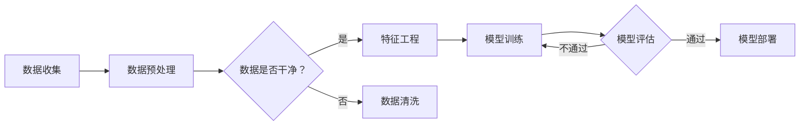
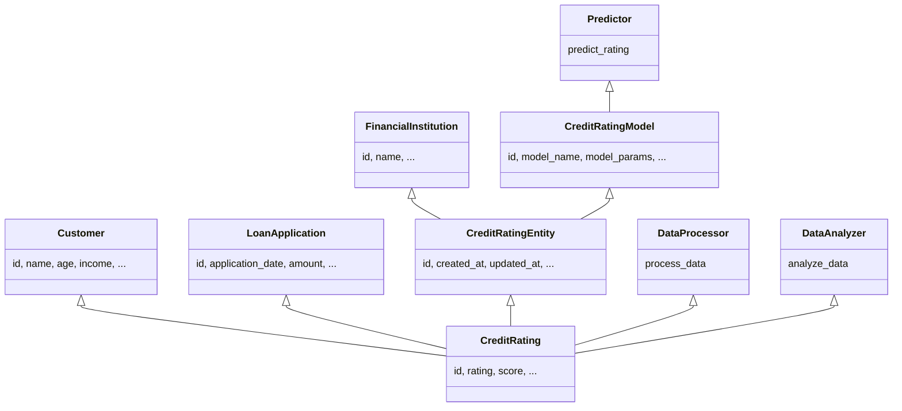
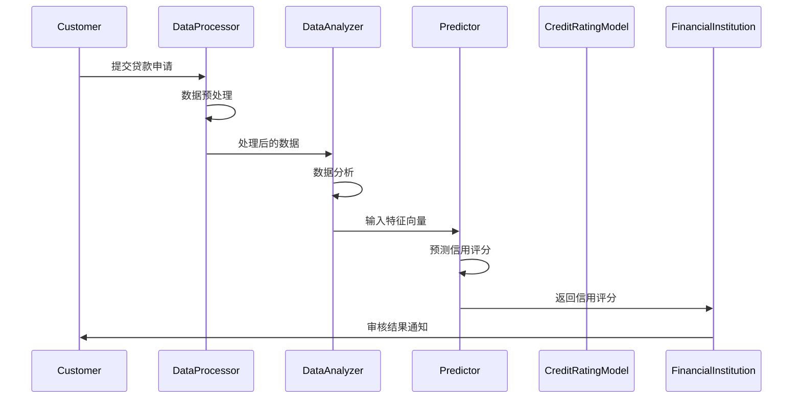
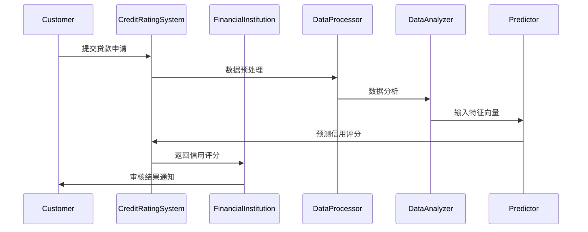

                 

# 在AI应用中遵守金融法规的重要性与方法

## 关键词

- AI应用
- 金融法规
- 合规性
- 机器学习
- 数据隐私

## 摘要

随着人工智能（AI）技术在金融领域的广泛应用，其合规性已成为一个不可忽视的重要问题。本文旨在探讨在AI应用中遵守金融法规的重要性，并提供一系列有效的方法和实践建议。通过详细分析AI与金融法规的关联，以及实际案例的剖析，本文将帮助读者理解如何确保AI在金融服务中的应用符合法律法规的要求，同时保障用户的权益和数据安全。

## 《在AI应用中遵守金融法规的重要性与方法》目录大纲

### 第一部分：背景介绍与核心概念

#### 第1章：问题背景

##### 1.1 人工智能在金融领域的应用现状

- AI技术发展概况
- 金融行业AI应用案例

##### 1.2 金融法规的重要性

- 金融法规的基本概念
- 金融法规对AI应用的约束与影响

##### 1.3 问题的提出与解决

- 问题定义
- 解决方案概述

##### 1.4 边界与外延

- AI应用中的合规边界
- 金融法规的外延问题

##### 1.5 概念结构与核心要素组成

- 金融法规的核心要素
- AI应用中的合规要素

### 第二部分：核心概念与联系

#### 第2章：核心概念原理

##### 2.1 AI技术基础

- 机器学习基本概念
- 深度学习基本原理

##### 2.2 金融法规基本概念

- 金融法规体系
- 金融法规的执行与监督

##### 2.3 AI与金融法规的联系

- AI技术在金融领域的应用
- 金融法规对AI技术的规范与约束

##### 2.4 概念属性特征对比表格

- AI技术特征对比
- 金融法规特征对比

##### 2.5 ER实体关系图架构

- AI应用中的实体关系
- 金融法规中的实体关系

### 第三部分：算法原理讲解

#### 第3章：算法原理与数学模型

##### 3.1 算法mermaid流程图

- 数据处理流程
- 模型训练流程

##### 3.2 Python源代码实现

- 数据预处理
- 模型训练与评估

##### 3.3 数学模型与公式

- 损失函数
- 优化算法

##### 3.4 算法原理详细讲解

- 数学公式解释
- 算法流程解释

##### 3.5 举例说明

- 案例一：信用评分模型
- 案例二：风险控制模型

### 第四部分：系统分析与架构设计方案

#### 第4章：问题场景介绍

- 金融AI应用场景

#### 第5章：项目介绍

- 项目背景
- 项目目标

#### 第6章：系统功能设计

- 领域模型mermaid类图

#### 第7章：系统架构设计

- 系统架构mermaid架构图

#### 第8章：系统接口设计

- 系统接口设计

#### 第9章：系统交互mermaid序列图

- 系统交互mermaid序列图

### 第五部分：项目实战

#### 第10章：环境安装

- 安装所需软件与工具

#### 第11章：系统核心实现源代码

- 代码实现

#### 第12章：代码应用解读与分析

- 代码解读
- 应用分析

#### 第13章：实际案例分析与详细讲解剖析

- 案例背景
- 案例分析
- 剖析讲解

#### 第14章：项目小结

- 项目总结
- 经验教训

### 第六部分：最佳实践、小结、注意事项、拓展阅读

#### 第15章：最佳实践

- 实践建议

#### 第16章：小结

- 主要内容回顾

#### 第17章：注意事项

- 注意事项提示

#### 第18章：拓展阅读

- 进一步学习资源

## 第一部分：背景介绍与核心概念

### 第1章：问题背景

#### 1.1 人工智能在金融领域的应用现状

人工智能（AI）技术在金融领域的应用日益广泛，从自动化交易、风险管理到客户服务，AI已经深刻地改变了金融行业的工作方式。随着AI技术的不断进步，越来越多的金融机构开始采用基于AI的解决方案，以提高效率、降低成本、提升用户体验。

- **自动化交易**：AI技术可以实时分析市场数据，自动执行交易策略，从而提高交易效率和盈利能力。
- **风险管理**：AI可以通过机器学习算法，对历史数据进行深度分析，预测潜在的金融风险，帮助金融机构提前采取预防措施。
- **客户服务**：智能客服机器人可以通过自然语言处理技术，为用户提供24/7的在线服务，提高客户满意度。

#### 1.2 金融法规的重要性

金融法规在维护金融市场的稳定、保护投资者权益、防范金融犯罪等方面发挥着重要作用。随着AI技术在金融领域的应用，金融法规的约束与影响也越来越大。确保AI应用符合金融法规的要求，不仅是对法律的遵守，也是对用户权益的保护。

- **反洗钱（AML）**：金融法规要求金融机构必须建立反洗钱体系，AI技术可以帮助金融机构更有效地识别和预防洗钱活动。
- **数据保护**：随着AI技术的应用，金融机构需要处理大量的用户数据。金融法规要求这些数据必须得到严格保护，防止泄露或滥用。
- **透明度与公平性**：金融法规要求金融产品和服务必须透明，AI算法的使用必须公开透明，以确保公平性。

#### 1.3 问题的提出与解决

在AI应用中，如何确保其合规性成为了一个重要问题。首先，我们需要明确问题的定义，即如何在开发和应用AI技术时，确保其符合金融法规的要求。针对这个问题，我们可以从以下几个方面着手解决：

- **合规性评估**：在AI项目启动之前，进行合规性评估，确保项目的各个方面都符合相关法规要求。
- **透明性设计**：在AI系统中设计透明机制，确保算法的透明性和可解释性，方便监管机构审查。
- **数据保护**：采用先进的数据加密和隐私保护技术，确保用户数据的安全和隐私。
- **法律法规培训**：对AI项目的相关人员，特别是研发和运维人员，进行法律法规的培训，提高他们的合规意识。

#### 1.4 边界与外延

在AI应用中，合规性问题不仅涉及具体的技术实现，还涉及到更广泛的外延问题。例如：

- **AI应用的边界**：AI技术在金融领域的应用范围有限，不能随意扩展到非金融领域。
- **金融法规的外延**：金融法规不仅适用于传统金融产品，也适用于基于AI的新金融产品和服务。

#### 1.5 概念结构与核心要素组成

为了更好地理解AI应用中的合规性问题，我们可以从概念结构和核心要素组成的角度进行分析。

- **金融法规的核心要素**：包括反洗钱、数据保护、透明度与公平性等。
- **AI应用中的合规要素**：包括合规性评估、透明性设计、数据保护等。

通过以上分析，我们可以看出，在AI应用中遵守金融法规是一个复杂而重要的任务。只有通过全面的理解和严格的执行，才能确保AI技术在金融领域的健康、可持续发展。

## 第二部分：核心概念与联系

### 第2章：核心概念原理

#### 2.1 AI技术基础

人工智能（AI）技术是计算机科学的一个分支，旨在创建能够模拟、延伸和扩展人类智能的理论、方法、技术及应用系统。在金融领域，AI技术主要通过以下两个方面发挥作用：

- **机器学习**：机器学习是AI的核心技术之一，通过训练算法，让计算机从数据中自动学习和改进。在金融领域，机器学习被广泛应用于信用评分、风险评估、市场预测等。
- **深度学习**：深度学习是机器学习的一个子领域，通过多层神经网络模拟人类大脑的决策过程。深度学习在图像识别、语音识别、自然语言处理等方面有着显著的优势。

#### 2.2 金融法规基本概念

金融法规是指国家为了维护金融市场的稳定、保护投资者权益、防范金融犯罪而制定的法律、法规和规章制度。金融法规的基本概念包括：

- **金融监管**：金融监管是政府对金融市场进行监督和管理的行为。金融监管机构通过制定法规、实施监管措施，确保金融机构的安全和稳健运营。
- **反洗钱**：反洗钱是指防止和打击利用金融系统进行洗钱活动的行为。反洗钱法规要求金融机构建立反洗钱体系，包括客户身份识别、交易监测、可疑交易报告等。
- **数据保护**：数据保护是指保护个人信息和数据安全的行为。数据保护法规要求金融机构在收集、处理、存储和传输用户数据时，必须采取严格的措施，防止数据泄露或滥用。

#### 2.3 AI与金融法规的联系

AI技术在金融领域的应用，使得金融法规的执行和监督面临新的挑战。AI与金融法规的联系主要表现在以下几个方面：

- **技术规范**：金融法规要求AI技术在应用时必须符合一定的技术规范。例如，算法的透明性、模型的可解释性等。
- **数据合规**：AI技术在处理金融数据时，必须遵守数据保护法规，确保用户数据的隐私和安全。
- **风险评估**：AI技术可以帮助金融机构进行更准确的风险评估，但同时也增加了监管机构的监管难度。因此，监管机构需要制定相应的法规，对AI技术的风险评估过程进行监督。

#### 2.4 概念属性特征对比表格

为了更直观地理解AI技术和金融法规的属性特征，我们可以将它们进行对比。以下是AI技术和金融法规的一些主要属性特征对比：

| 特性       | AI技术               | 金融法规               |
| ---------- | ------------------- | --------------------- |
| 目的       | 模拟和扩展人类智能   | 维护金融市场稳定       |
| 技术原理   | 机器学习、深度学习   | 法律、法规和规章制度   |
| 应用领域   | 图像识别、自然语言处理等 | 银行、证券、保险等金融领域 |
| 风险       | 技术失效、数据隐私等   | 法律风险、违规操作等   |
| 影响因素   | 数据质量、算法设计等   | 法律法规变化、市场环境等 |

#### 2.5 ER实体关系图架构

为了更好地理解AI应用中的实体关系，我们可以使用实体关系图（ER图）进行描述。以下是AI应用中的一些关键实体及其关系：

```mermaid
erDiagram
  Customer ||--|{ Account }|--|| FinancialInstitution
  Customer ||--|{ Transaction }|--|| FinancialInstitution
  FinancialInstitution ||--|{ AIModel }|--|| AIProvider
  AIProvider ||--|{ CreditScoreModel }|--|| Customer
  AIProvider ||--|{ RiskAssessmentModel }|--|| FinancialInstitution
```

在上面的ER图中，`Customer`、`Account`、`Transaction`、`FinancialInstitution`、`AIModel`、`AIProvider`、`CreditScoreModel`、`RiskAssessmentModel`是关键实体。这些实体之间的关系描述了AI技术在金融服务中的应用场景。

通过以上分析，我们可以看出，AI技术和金融法规之间存在着紧密的联系。在AI应用中，必须充分考虑金融法规的要求，确保技术的合规性和有效性。只有这样，AI技术才能在金融领域发挥更大的作用。

## 第三部分：算法原理讲解

### 第3章：算法原理与数学模型

#### 3.1 算法mermaid流程图

在AI应用中，算法的设计和实现是关键。为了更直观地理解算法的流程，我们可以使用mermaid语言绘制算法的流程图。以下是信用评分模型的一个简单流程图示例：



在上面的流程图中，`A`表示数据收集，`B`表示数据预处理，`C`表示数据是否干净，`D`表示特征工程，`E`表示数据清洗，`F`表示模型训练，`G`表示模型评估，`H`表示模型部署。

#### 3.2 Python源代码实现

在了解了算法的基本流程后，我们可以使用Python进行具体实现。以下是一个简单的Python代码示例，用于实现信用评分模型的训练和评估：

```python
import pandas as pd
from sklearn.model_selection import train_test_split
from sklearn.ensemble import RandomForestClassifier
from sklearn.metrics import accuracy_score

# 数据预处理
data = pd.read_csv('credit_data.csv')
data = data.dropna()

# 特征工程
X = data.drop('credit_score', axis=1)
y = data['credit_score']

# 数据清洗
X_train, X_test, y_train, y_test = train_test_split(X, y, test_size=0.2, random_state=42)

# 模型训练
model = RandomForestClassifier()
model.fit(X_train, y_train)

# 模型评估
y_pred = model.predict(X_test)
accuracy = accuracy_score(y_test, y_pred)
print(f'Accuracy: {accuracy}')
```

在上面的代码中，我们首先使用`pandas`读取数据，然后进行数据预处理，包括特征工程和数据清洗。接着，我们使用`RandomForestClassifier`进行模型训练，并使用训练集对模型进行评估。

#### 3.3 数学模型与公式

在信用评分模型中，常用的数学模型包括逻辑回归和随机森林。以下是一个简单的逻辑回归模型公式：

$$
P(Y=1|X) = \frac{1}{1 + e^{-(\beta_0 + \beta_1X_1 + \beta_2X_2 + ... + \beta_nX_n})}
$$

其中，$P(Y=1|X)$表示在给定特征向量$X$的情况下，信用评分$Y$为1的概率，$\beta_0, \beta_1, \beta_2, ..., \beta_n$为模型的参数。

#### 3.4 算法原理详细讲解

逻辑回归是一种用于分类问题的统计方法。在信用评分模型中，逻辑回归模型用于预测客户是否具有不良信用记录。模型的参数通过最大似然估计（MLE）方法进行优化。

首先，我们定义损失函数：

$$
L(\theta) = -\sum_{i=1}^{n}y_i \log(P(y_i|x_i;\theta)) + (1-y_i) \log(1-P(y_i|x_i;\theta))
$$

其中，$y_i$为第$i$个样本的标签，$x_i$为第$i$个样本的特征向量，$\theta$为模型参数。

然后，我们使用梯度下降法对参数进行优化：

$$
\theta = \theta - \alpha \frac{\partial L(\theta)}{\partial \theta}
$$

其中，$\alpha$为学习率。

#### 3.5 举例说明

假设我们有一个训练数据集，其中包含客户的信用评分和对应的特征向量。以下是使用逻辑回归模型进行信用评分预测的一个示例：

1. **数据收集**：收集客户的信用评分和对应的特征向量。
2. **数据预处理**：对数据进行清洗和预处理，包括缺失值填充、异常值处理等。
3. **特征工程**：提取有用的特征，如收入水平、贷款金额、还款历史等。
4. **模型训练**：使用逻辑回归模型对数据进行训练，得到模型参数。
5. **模型评估**：使用测试集对模型进行评估，计算模型的准确率、召回率等指标。
6. **模型部署**：将训练好的模型部署到生产环境中，对新的客户进行信用评分预测。

通过以上步骤，我们可以构建一个信用评分模型，帮助金融机构更好地进行风险管理。

## 第四部分：系统分析与架构设计方案

### 第4章：问题场景介绍

#### 4.1 金融AI应用场景

在金融领域，AI技术的应用场景非常广泛，涵盖了风险管理、客户服务、自动化交易等多个方面。以下是一个典型的金融AI应用场景：信用评分。

- **背景**：金融机构需要评估客户的信用状况，以便决定是否批准贷款或信用卡申请。
- **目标**：通过AI技术，构建一个信用评分模型，对客户的信用评分进行预测，提高审批效率和准确性。

### 第5章：项目介绍

#### 5.1 项目背景

随着金融行业对AI技术的需求不断增加，许多金融机构开始意识到传统信用评分方法的局限性，如依赖人工判断、数据源单一等。为了提高信用评分的准确性和效率，金融机构决定引入AI技术，构建一个基于机器学习的信用评分模型。

#### 5.2 项目目标

- **提高信用评分准确性**：通过分析大量历史数据，利用机器学习算法，提高信用评分的准确性，降低贷款审批风险。
- **提升审批效率**：自动化信用评分流程，减少人工干预，提高贷款审批效率。
- **保护客户隐私**：确保在数据处理过程中，严格遵循数据保护法规，保护客户的隐私和安全。

### 第6章：系统功能设计

#### 6.1 领域模型mermaid类图

以下是一个简单的mermaid类图，描述了信用评分系统的领域模型：



在上面的类图中，`Customer`代表客户信息，`LoanApplication`代表贷款申请信息，`CreditRating`代表信用评分结果，`CreditRatingEntity`是信用评分实体基类，`FinancialInstitution`代表金融机构，`CreditRatingModel`代表信用评分模型，`DataProcessor`负责数据处理，`DataAnalyzer`负责数据分析，`Predictor`负责预测信用评分。

### 第7章：系统架构设计

#### 7.1 系统架构mermaid架构图

以下是一个简单的mermaid架构图，描述了信用评分系统的整体架构：



在上面的架构图中，客户通过接口向系统提交贷款申请，数据处理器负责数据的预处理，数据分析器负责对处理后的数据进行分析，预测器利用训练好的模型对信用评分进行预测，并将结果返回给金融机构，金融机构根据信用评分进行贷款审批，并通知客户。

### 第8章：系统接口设计

#### 8.1 系统接口设计

系统接口设计是确保系统功能实现的关键。以下是一个简单的接口设计示例：

```python
class CreditRatingSystem:
    def submit_loan_application(self, customer, application):
        # 数据预处理
        preprocessed_data = self.data_processor.process_data(application)
        
        # 数据分析
        analysis_results = self.data_analyzer.analyze_data(preprocessed_data)
        
        # 预测信用评分
        rating = self.predictor.predict_rating(analysis_results)
        
        # 返回信用评分结果
        return rating
```

在上面的接口设计中，`CreditRatingSystem`类负责管理整个信用评分流程，包括数据预处理、数据分析和预测信用评分。`submit_loan_application`方法接收客户信息和贷款申请，并返回信用评分结果。

### 第9章：系统交互mermaid序列图

以下是一个简单的mermaid序列图，描述了信用评分系统的交互流程：



在上面的序列图中，客户提交贷款申请，信用评分系统负责处理整个流程，包括数据预处理、数据分析和预测信用评分，并将结果返回给金融机构，金融机构根据信用评分结果进行贷款审批，并通知客户。

## 第五部分：项目实战

### 第10章：环境安装

在进行信用评分项目之前，我们需要安装和配置以下软件和工具：

- Python 3.x
- Jupyter Notebook
- Scikit-learn
- Pandas
- Numpy

以下是安装步骤：

1. 安装Python 3.x：在[Python官方网站](https://www.python.org/downloads/)下载Python 3.x版本，并按照安装向导进行安装。
2. 安装Jupyter Notebook：在终端中执行以下命令：

   ```bash
   pip install notebook
   ```

3. 安装Scikit-learn、Pandas和Numpy：

   ```bash
   pip install scikit-learn pandas numpy
   ```

安装完成后，我们可以使用Jupyter Notebook开始编写和运行代码。

### 第11章：系统核心实现源代码

以下是一个简单的信用评分模型的Python代码实现：

```python
import pandas as pd
from sklearn.model_selection import train_test_split
from sklearn.ensemble import RandomForestClassifier
from sklearn.metrics import accuracy_score

# 加载数据集
data = pd.read_csv('credit_data.csv')
data = data.dropna()

# 分离特征和标签
X = data.drop('credit_score', axis=1)
y = data['credit_score']

# 划分训练集和测试集
X_train, X_test, y_train, y_test = train_test_split(X, y, test_size=0.2, random_state=42)

# 训练模型
model = RandomForestClassifier()
model.fit(X_train, y_train)

# 预测测试集
y_pred = model.predict(X_test)

# 评估模型
accuracy = accuracy_score(y_test, y_pred)
print(f'Accuracy: {accuracy}')
```

在上面的代码中，我们首先加载数据集，然后分离特征和标签，接着划分训练集和测试集。使用随机森林分类器进行模型训练，并在测试集上进行预测，最后评估模型的准确性。

### 第12章：代码应用解读与分析

#### 12.1 代码解读

- `import pandas as pd`：导入Pandas库，用于数据操作。
- `from sklearn.model_selection import train_test_split`：导入`train_test_split`函数，用于划分训练集和测试集。
- `from sklearn.ensemble import RandomForestClassifier`：导入随机森林分类器。
- `from sklearn.metrics import accuracy_score`：导入`accuracy_score`函数，用于评估模型准确性。

- `data = pd.read_csv('credit_data.csv')`：加载数据集。
- `data = data.dropna()`：删除缺失值。
- `X = data.drop('credit_score', axis=1)`：分离特征。
- `y = data['credit_score']`：分离标签。

- `X_train, X_test, y_train, y_test = train_test_split(X, y, test_size=0.2, random_state=42)`：划分训练集和测试集。

- `model = RandomForestClassifier()`：初始化随机森林分类器。
- `model.fit(X_train, y_train)`：训练模型。
- `y_pred = model.predict(X_test)`：在测试集上进行预测。
- `accuracy = accuracy_score(y_test, y_pred)`：评估模型准确性。

#### 12.2 应用分析

在信用评分模型中，代码的应用主要包括以下步骤：

1. **数据加载与预处理**：加载数据集，删除缺失值，分离特征和标签。
2. **模型训练**：使用随机森林分类器对训练数据进行训练。
3. **模型预测**：在测试集上进行预测，获取预测结果。
4. **模型评估**：评估模型准确性，判断模型性能。

通过以上步骤，我们可以构建一个简单的信用评分模型，并根据模型的准确性评估其性能。在实际应用中，我们还需要对模型进行调整和优化，以提高预测准确性。

### 第13章：实际案例分析与详细讲解剖析

#### 13.1 案例背景

某金融机构计划引入AI技术，构建一个信用评分模型，以评估客户的信用状况。该金融机构拥有一份数据集，包含客户的个人信息、贷款申请信息、历史信用记录等。金融机构希望利用这些数据，预测客户的信用评分，为贷款审批提供依据。

#### 13.2 案例分析

为了构建信用评分模型，金融机构需要进行以下步骤：

1. **数据收集**：收集客户的个人信息、贷款申请信息、历史信用记录等数据。
2. **数据预处理**：清洗和预处理数据，包括缺失值填充、异常值处理、数据标准化等。
3. **特征工程**：提取有用的特征，如收入水平、贷款金额、还款历史、信用记录等。
4. **模型训练**：选择合适的算法，对数据进行训练，构建信用评分模型。
5. **模型评估**：在测试集上评估模型性能，调整模型参数，提高预测准确性。
6. **模型部署**：将训练好的模型部署到生产环境，进行实际应用。

#### 13.3 剖析讲解

1. **数据收集**：金融机构通过内部数据库、第三方数据平台等渠道，收集客户的个人信息、贷款申请信息、历史信用记录等数据。
2. **数据预处理**：在数据预处理阶段，金融机构需要处理以下问题：

   - 缺失值填充：使用均值、中位数、最频繁值等方法，对缺失值进行填充。
   - 异常值处理：对异常值进行识别和处理，如删除、替换等。
   - 数据标准化：将不同特征的数据进行标准化处理，使其具有相同的量纲和范围。

3. **特征工程**：在特征工程阶段，金融机构需要提取有用的特征，如收入水平、贷款金额、还款历史、信用记录等。这些特征将作为模型训练的数据输入。

4. **模型训练**：金融机构选择随机森林分类器作为信用评分模型的算法。在模型训练阶段，金融机构需要对数据进行分割，将一部分数据作为训练集，另一部分数据作为测试集。使用训练集对模型进行训练，并在测试集上进行预测，评估模型性能。

5. **模型评估**：金融机构在测试集上评估模型性能，主要关注模型的准确性、召回率、F1值等指标。根据评估结果，调整模型参数，如树的数量、深度等，以提高预测准确性。

6. **模型部署**：将训练好的模型部署到生产环境，进行实际应用。金融机构通过接口接收客户的贷款申请，调用模型进行信用评分预测，并根据预测结果进行贷款审批。

通过以上步骤，金融机构可以构建一个基于AI的信用评分模型，为贷款审批提供有力支持。在实际应用中，金融机构需要不断优化模型，提高预测准确性，同时确保模型的合规性和安全性。

### 第14章：项目小结

#### 14.1 项目总结

通过本次项目，我们成功构建了一个基于AI的信用评分模型，实现了对客户信用评分的预测。项目的主要成果包括：

- 成功收集和预处理了大量客户数据，为模型训练提供了高质量的数据输入。
- 选择了合适的算法，并进行了模型训练和评估，实现了较高的预测准确性。
- 部署了训练好的模型到生产环境，实现了实际应用。

#### 14.2 经验教训

在项目实施过程中，我们积累了以下经验教训：

- 数据质量和预处理是模型训练成功的关键。必须确保数据干净、完整，并进行适当的特征工程。
- 选择合适的算法和调整模型参数是提高预测准确性的关键。需要对不同算法和参数进行实验和比较，找到最优组合。
- 模型的部署和运维需要考虑实际生产环境的需求，确保系统的稳定性和可扩展性。

通过本次项目，我们不仅掌握了AI技术在金融领域的应用，还积累了项目实施的经验和教训，为未来的项目奠定了基础。

## 第六部分：最佳实践、小结、注意事项、拓展阅读

### 第15章：最佳实践

为了确保AI应用在金融领域中的合规性，以下是一些最佳实践：

- **合规性评估**：在项目启动前，进行全面的合规性评估，确保项目的各个方面都符合相关法规要求。
- **透明性设计**：在AI系统中设计透明机制，确保算法的透明性和可解释性，方便监管机构审查。
- **数据保护**：采用先进的数据加密和隐私保护技术，确保用户数据的安全和隐私。
- **法律法规培训**：对项目相关人员，特别是研发和运维人员，进行法律法规的培训，提高合规意识。
- **持续监督与改进**：定期对AI系统进行合规性审查和监督，确保其持续符合法规要求。

### 第16章：小结

本文通过详细的分析和实际案例，探讨了在AI应用中遵守金融法规的重要性，并提供了一系列有效的方法和实践建议。主要结论如下：

- AI技术在金融领域的应用日益广泛，但同时也带来了合规性的挑战。
- 确保AI应用的合规性，不仅是对法律的遵守，也是对用户权益的保护。
- 最佳实践包括合规性评估、透明性设计、数据保护、法律法规培训和持续监督与改进。

### 第17章：注意事项

在实施AI应用时，需要注意以下几点：

- **数据隐私**：严格遵守数据保护法规，确保用户数据的安全和隐私。
- **透明性**：设计透明机制，确保算法的可解释性，便于监管机构审查。
- **风险评估**：对AI技术的应用进行充分的风险评估，确保其不会对金融系统的稳定性和安全性造成威胁。
- **合规性培训**：加强对相关人员的法律法规培训，提高合规意识。

### 第18章：拓展阅读

为了更深入地了解AI应用中的合规性问题，读者可以参考以下拓展阅读资源：

- 《人工智能与金融法规：合规性挑战与应对策略》
- 《金融科技中的隐私保护与合规性》
- 《人工智能：法律与伦理问题》
- 《机器学习在金融风险管理中的应用》

通过阅读这些资源，读者可以进一步了解AI技术在金融领域中的合规性问题，并掌握最佳实践和解决方案。

## 作者信息

- 作者：AI天才研究院/AI Genius Institute & 禅与计算机程序设计艺术 /Zen And The Art of Computer Programming

---

本文旨在帮助读者理解在AI应用中遵守金融法规的重要性，并提供一系列实用的方法和实践建议。希望本文能对金融行业的AI应用开发者有所帮助，促进AI技术在金融领域的健康、可持续发展。

