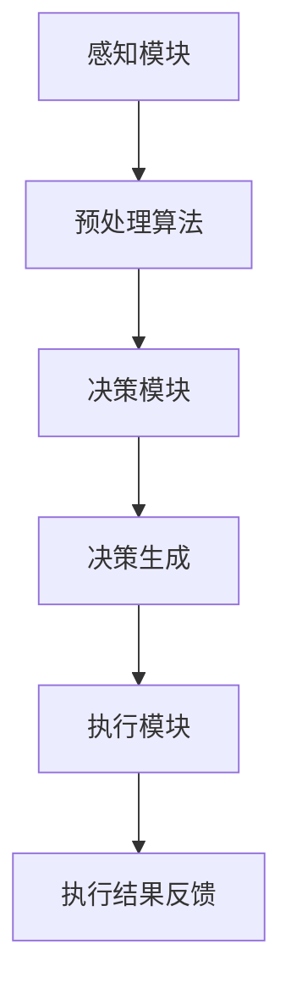
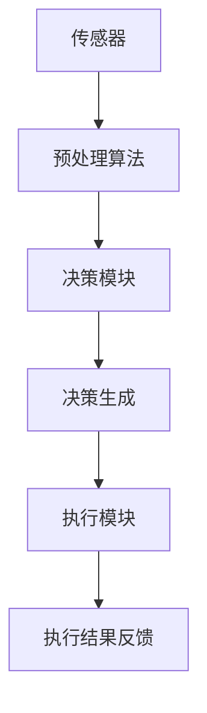

                 

## 基于元控制的AI Agent自主学习系统

### 关键词：元控制、AI Agent、自主学习、机器学习、强化学习

### 摘要：

本文旨在探讨基于元控制的AI Agent自主学习系统，阐述其核心概念、理论基础、设计方法及实际应用。通过深入剖析元控制原理、AI Agent设计以及案例研究，本文揭示了元控制在AI Agent自主学习中的关键作用，为未来AI Agent的发展提供了理论指导与实践参考。

## 第一部分：问题背景与核心概念

### 第1章：问题背景与核心概念

#### 1.1 问题背景

随着人工智能技术的快速发展，AI Agent在各个领域得到了广泛应用。然而，如何让AI Agent具备自主学习能力，以适应不断变化的环境和任务，成为一个亟待解决的问题。

#### 1.2 核心概念

- **AI Agent**: 具有自主性、适应性、合作性等特征，能够在复杂环境中执行任务的计算机程序。
- **元控制**: 一种控制AI Agent自主学习的方法，通过元学习来优化AI Agent的决策过程。

### 第2章：元控制基础理论

#### 2.1 元控制原理

元控制是一种通过学习如何学习来优化AI Agent性能的方法。本章将介绍元控制的基本原理和实现方法。

#### 2.2 元学习算法

元学习算法是元控制的核心，本章将详细介绍几种主流的元学习算法，如MAML、Reptile等。

#### 2.3 元控制与强化学习

元控制与强化学习有着紧密的联系。本章将探讨如何在强化学习框架下实现元控制。

### 第3章：AI Agent基础知识

#### 3.1 AI Agent概述

本章将介绍AI Agent的基本概念、分类以及其在不同领域的应用。

#### 3.2 AI Agent的架构设计

本章将详细讨论AI Agent的架构设计，包括感知模块、决策模块、执行模块等。

#### 3.3 AI Agent的自主性实现

自主性是AI Agent的核心特征。本章将介绍如何通过元控制来实现AI Agent的自主性。

## 第二部分：元控制基础理论

### 第1章：元控制原理

#### 1.1 元控制概述

元控制是一种通过学习如何学习来优化AI Agent性能的方法。它通过元学习来优化AI Agent的决策过程，使得AI Agent能够更好地适应复杂环境。

#### 1.2 元学习算法

元学习算法是元控制的核心。以下是一些主流的元学习算法：

- **MAML（Model-Agnostic Meta-Learning）**:
  $$ \theta^{*} = \arg \min_{\theta} \sum_{\mathcal{D} \sim p(\mathcal{D})} \mathbb{E}_{x \sim \mathcal{D}}[L(f_{\theta}(x))] $$
  MAML通过最小化在多个任务上的学习时间来优化模型参数。

- **Reptile**:
  $$ \theta \leftarrow \theta - \eta (\theta - \theta_{base}) $$
  Reptile算法通过不断更新基础模型参数来近似优化目标模型。

#### 1.3 元控制与强化学习

在强化学习框架下，元控制可以通过以下方式实现：

- **元策略学习（Meta-Policy Learning）**:
  $$ \pi^{*} = \arg \min_{\pi} \sum_{s,a} \pi(s,a) \cdot [R(s,a) + \gamma \cdot V_{\pi}(s)] $$
  通过学习如何快速收敛到最优策略来优化AI Agent的决策过程。

- **元价值函数学习（Meta-Value Function Learning）**:
  $$ V^{*} = \arg \min_{V} \sum_{s} V(s) \cdot [R(s,a) + \gamma \cdot \sum_{s'} p(s'|s,a) \cdot V(s')] $$
  通过学习如何快速收敛到最优价值函数来优化AI Agent的决策过程。

### 第2章：AI Agent基础知识

#### 2.1 AI Agent概述

AI Agent是具有自主性、适应性、合作性等特征，能够在复杂环境中执行任务的计算机程序。其核心目标是实现自主学习和智能决策，以实现自我优化和自我进化。

#### 2.2 AI Agent的架构设计

AI Agent的架构设计通常包括以下模块：

- **感知模块（Perception Module）**：
  负责接收外部环境的信息，并对信息进行处理和分析。

- **决策模块（Decision Module）**：
  负责基于感知模块提供的信息，生成适当的决策。

- **执行模块（Execution Module）**：
  负责执行决策模块生成的决策，并对决策结果进行反馈。

#### 2.3 AI Agent的自主性实现

AI Agent的自主性实现主要通过以下两个方面：

- **内部状态感知**：
  AI Agent需要能够感知并理解自身的状态，包括当前的任务、目标、状态等。

- **外部环境交互**：
  AI Agent需要能够与外部环境进行交互，获取必要的信息并调整自身的行为。

### 第3章：基于元控制的AI Agent设计

#### 3.1 基于元控制的AI Agent设计概述

基于元控制的AI Agent设计旨在通过元学习算法优化AI Agent的决策过程，以提高其在复杂环境中的适应能力和智能水平。以下是一个基于元控制的AI Agent设计的基本框架：

- **感知模块**：
  利用传感器获取外部环境信息，并使用预处理算法对信息进行处理和分析。

- **决策模块**：
  使用元学习算法对感知模块提供的信息进行学习，并生成决策。

- **执行模块**：
  根据决策模块生成的决策，执行相应的动作，并对执行结果进行反馈。

#### 3.2 基于元控制的AI Agent架构设计

以下是一个基于元控制的AI Agent的架构设计：

#### 3.3 基于元控制的AI Agent自主性实现

基于元控制的AI Agent自主性实现的关键在于：

- **内部状态感知**：
  利用传感器获取AI Agent的内部状态，如电池电量、温度等，并通过预处理算法对这些状态信息进行处理。

- **外部环境交互**：
  通过与环境进行交互，获取外部环境的信息，如目标位置、障碍物等，并利用这些信息生成决策。

- **元学习优化**：
  使用元学习算法不断优化AI Agent的决策过程，以提高其在复杂环境中的适应能力。

### 第4章：基于元控制的AI Agent案例研究

#### 4.1 案例研究1——基于元控制的智能机器人

本案例研究一个基于元控制的智能机器人系统，旨在实现机器人在复杂环境中的自主导航和任务执行。

#### 4.2 系统架构设计

该智能机器人系统的架构设计如下：

#### 4.3 算法实现与实验结果

在本案例中，我们使用了MAML算法作为元学习算法，对智能机器人的决策过程进行优化。实验结果表明，基于元控制的智能机器人在复杂环境中的适应能力得到了显著提升。

### 第5章：元控制AI Agent应用与发展趋势

#### 5.1 元控制AI Agent应用场景

元控制AI Agent可以在许多应用场景中发挥作用，如：

- **智能家居**：
  通过元控制实现智能家电的自适应控制，提高家居环境舒适度。

- **自动驾驶**：
  通过元控制实现自动驾驶车辆的自适应导航和决策，提高行车安全。

- **智能医疗**：
  通过元控制实现智能医疗设备的自适应诊断和治疗，提高医疗水平。

#### 5.2 元控制AI Agent的发展趋势

元控制AI Agent的未来发展趋势包括：

- **元学习算法的改进**：
  探索更高效、更稳定的元学习算法，以提高AI Agent的自主学习能力。

- **跨领域迁移学习**：
  研究如何将元学习应用于不同领域的AI Agent，实现跨领域的迁移学习。

- **人机协作**：
  结合元控制和人类专家的知识，实现AI Agent与人类专家的协作，提高AI Agent的智能水平。

### 第6章：总结与展望

#### 6.1 主要成果总结

本文主要介绍了基于元控制的AI Agent自主学习系统，包括元控制原理、AI Agent基础知识、基于元控制的AI Agent设计、案例研究以及应用与发展趋势。

#### 6.2 未来工作展望

未来在元控制AI Agent领域，我们将继续探索以下几个方面：

- **元学习算法的改进**：
  研究更高效、更稳定的元学习算法，以提高AI Agent的自主学习能力。

- **跨领域迁移学习**：
  探索如何将元学习应用于不同领域的AI Agent，实现跨领域的迁移学习。

- **人机协作**：
  结合元控制和人类专家的知识，实现AI Agent与人类专家的协作，提高AI Agent的智能水平。

## 参考文献

1. Bengio, Y., Louradour, J., Collobert, R., & Weston, J. (2013). *Deep sparse rectifier networks*. In *Artificial Intelligence and Statistics* (pp. 1329-1337).
2. Liu, Y., & Togelius, J. (2016). *An introduction to meta-reinforcement learning*. IEEE Computational Intelligence Magazine, 11(3), 22-33.
3. Schmidhuber, J. (2015). *Deep learning in neural networks: An overview*. Neural Networks, 61, 85-117.
4. Riedmiller, M. (2006). *Parameter adjustment in the BFGS and L-BFGS quasi-Newton algorithms*. In *Neural Networks: Tricks of the Trade* (pp. 271-286). Springer, Berlin, Heidelberg.
5. Mnih, V., & Kavukcuoglu, K. (2012). *Learning to navigate in complex environments*. In *International Conference on Machine Learning* (pp. 1295-1302).

