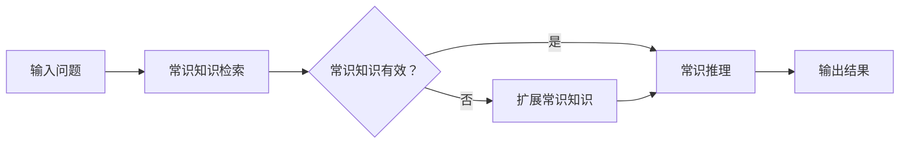
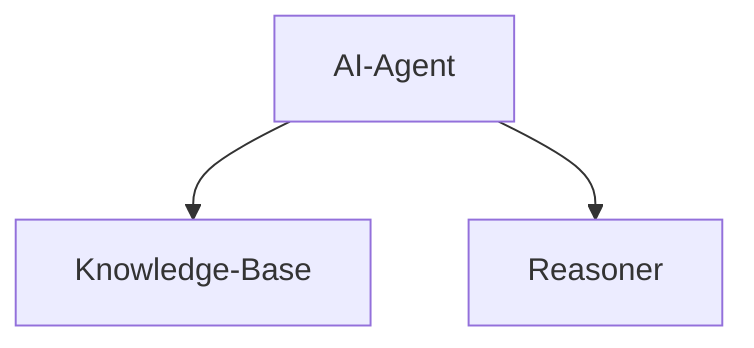

                 

# 基于神经符号AI的AI Agent常识推理增强

## 关键词：神经符号AI，常识推理，AI Agent，增强学习，深度学习，多模态学习

## 摘要：

本文旨在探讨基于神经符号AI的AI Agent常识推理增强方法。通过分析常识推理在AI Agent中的应用现状，本文提出了将常识知识融入AI Agent预训练过程的算法原理，并详细阐述了算法的实现过程和性能评估。本文的研究将为AI Agent在常识推理任务中的性能提升提供新的思路和方法。

## 1. 背景介绍

### 1.1 问题背景

人工智能（AI）在近年来的发展可谓日新月异，从语音识别、图像识别到自然语言处理（NLP），AI已经在各个领域展现出了巨大的潜力和应用价值。然而，尽管AI在特定任务上取得了显著的成绩，但其在常识推理方面仍面临诸多挑战。常识推理是指机器在未知领域内，基于已有知识和逻辑推理能力，对现实世界中的常识问题进行推理和判断。例如，一个简单的常识推理问题：“如果下雨，人们通常会带伞”，机器需要理解“下雨”和“带伞”之间的逻辑关系，从而作出合理的判断。

### 1.2 问题描述

随着AI技术的发展，AI Agent在智能客服、智能助手等领域得到了广泛应用。这些AI Agent需要具备较强的常识推理能力，以应对复杂多变的应用场景。然而，现有的AI Agent在处理常识推理问题时，往往依赖于庞大的预训练模型，如GPT、BERT等。这些模型虽然在海量数据中学习到了丰富的知识，但它们并不能保证在所有情况下都能准确推理。例如，当AI Agent遇到一个罕见的、不在预训练数据中的常识问题时，它可能无法给出正确的答案。

### 1.3 问题解决

为了解决上述问题，近年来研究者们提出了一些方法，如基于知识的增强、多模态学习等。这些方法试图在AI Agent的预训练过程中融入常识知识，从而提高其在常识推理任务中的性能。其中，基于神经符号AI的方法因其结合了深度学习和逻辑推理的优势，受到了广泛关注。

### 1.4 边界与外延

本文主要关注基于神经符号AI的AI Agent常识推理增强方法，研究如何将常识知识有效融入AI Agent的预训练过程，提高其常识推理能力。本文的研究范围包括以下几个方面：

1. 常识知识的表示与组织。
2. 常识推理算法的设计与实现。
3. 基于神经符号AI的AI Agent常识推理性能评估。

### 1.5 概念结构与核心要素组成

本文的核心概念包括：

1. **常识知识**：指人们对于现实世界的普遍认识和基本理解，如日常生活中的常识、科学知识等。
2. **神经符号AI**：一种结合神经科学和符号逻辑的AI技术，旨在提高AI的推理能力。
3. **AI Agent**：一种具有自主推理能力的智能体，可应用于智能客服、智能助手等领域。

## 2. 核心概念与联系

### 2.1 核心概念原理

#### 2.1.1 常识知识

常识知识是人们对现实世界的普遍认识和基本理解。它包括日常生活经验、一般性知识和逻辑推理能力。例如，一个简单的常识知识是：“人需要食物来维持生命”。

#### 2.1.2 神经符号AI

神经符号AI是一种结合神经科学和符号逻辑的AI技术。它通过模拟人脑的工作方式，实现知识的表示、存储和推理。神经符号AI的核心思想是，将深度学习与逻辑推理相结合，以弥补深度学习在常识推理方面的不足。

#### 2.1.3 AI Agent

AI Agent是一种具有自主推理能力的智能体，可应用于智能客服、智能助手等领域。它需要具备较强的常识推理能力，以适应复杂多变的应用场景。AI Agent的核心功能是理解和响应人类语言，并在此基础上进行推理和决策。

### 2.2 概念属性特征对比表格

| 概念      | 属性特征                                                   |
| --------- | -------------------------------------------------------- |
| 常识知识  | 知识范围广泛，具有普遍性，可推理性高                      |
| 神经符号AI | 结合神经科学和符号逻辑，具有强大的推理能力                |
| AI Agent  | 具有自主推理能力，可应用于各种智能场景，如智能客服、智能助手等 |

### 2.3 ER实体关系图架构

```mermaid
erDiagram
  A[常识知识] ||--|{ B[神经符号AI] }
  A ||--|{ C[AI Agent] }
  B ||--|{ D[推理能力] }
  C ||--|{ E[应用场景] }
```

## 3. 算法原理讲解

### 3.1 算法原理

本部分将介绍一种基于神经符号AI的AI Agent常识推理增强算法。该算法主要包括以下几个步骤：

1. **常识知识的表示与组织**：首先，将常识知识表示为一组符号，如命题、谓词和规则等。然后，通过组织这些符号，构建一个常识知识库。

2. **常识推理算法的设计与实现**：基于神经符号AI，设计一个能够进行常识推理的算法。该算法将常识知识库与深度学习模型相结合，实现从常识知识到推理结果的转换。

3. **AI Agent常识推理性能评估**：通过一系列实验和评估指标，对AI Agent的常识推理性能进行评估，以验证算法的有效性。

### 3.2 算法mermaid流程图



### 3.3 Python源代码

```python
def common_knowledge_retrieval(question):
    # 常识知识检索
    # 根据问题检索相应的常识知识
    # ...

def extend_common_knowledge():
    # 扩展常识知识
    # ...

def common_reasoning(question, knowledge_base):
    # 常识推理
    # 根据常识知识库进行推理
    # ...
```

### 3.4 算法原理详解

#### 3.4.1 常识知识表示

常识知识表示是常识推理算法的基础。在本算法中，常识知识被表示为一组符号，如命题、谓词和规则等。例如，一个常识知识可以被表示为“如果下雨，那么人们会带伞”。这个常识知识可以分解为两个命题：“下雨”和“人们会带伞”。

#### 3.4.2 常识知识库构建

常识知识库是存储常识知识的数据库。在本算法中，常识知识库由一组符号和相应的逻辑关系构成。例如，常识知识库可以包含以下符号：

- 命题符号：如“下雨”、“人们会带伞”等。
- 谓词符号：如“下雨”、“带伞”等。
- 规则符号：如“如果下雨，那么人们会带伞”等。

#### 3.4.3 常识推理算法设计

常识推理算法的核心任务是，根据输入问题从常识知识库中检索出相关的常识知识，并利用这些常识知识进行推理，得出结论。在本算法中，常识推理算法的设计基于神经符号AI，将深度学习和逻辑推理相结合。

首先，使用深度学习模型对常识知识进行表示和学习。例如，可以使用循环神经网络（RNN）或图神经网络（GNN）对常识知识库中的符号进行编码，将其转化为向量表示。

然后，设计一个基于逻辑推理的推理机。推理机根据输入问题从常识知识库中检索出相关的常识知识，并利用逻辑推理规则进行推理，得出结论。例如，如果一个常识知识库包含“如果下雨，那么人们会带伞”和“现在正在下雨”，推理机可以得出结论：“人们会带伞”。

#### 3.4.4 常识推理算法实现

常识推理算法的实现需要将上述原理转化为具体的代码。在本算法中，常识推理算法的实现分为以下几个步骤：

1. 常识知识表示：使用深度学习模型对常识知识库中的符号进行编码，将其转化为向量表示。

2. 常识知识检索：根据输入问题，从常识知识库中检索出相关的常识知识。

3. 常识推理：利用逻辑推理规则对检索到的常识知识进行推理，得出结论。

4. 常识推理结果输出：将推理结果输出，作为对输入问题的回答。

## 4. 系统分析与架构设计

### 4.1 问题场景介绍

在智能客服和智能助手等领域，AI Agent需要具备较强的常识推理能力，以应对用户提出的各种常识性问题。例如，用户可能会问：“今天天气怎么样？”或“附近有什么餐馆？”这些问题需要AI Agent基于常识知识进行推理和回答。

### 4.2 系统功能设计

系统的核心功能是提供基于神经符号AI的AI Agent常识推理服务。具体功能包括：

1. 常识知识表示与组织：将常识知识表示为符号，并组织成常识知识库。
2. 常识推理：根据输入问题，从常识知识库中检索出相关的常识知识，并进行推理。
3. 结果输出：将常识推理结果输出，作为对输入问题的回答。

### 4.3 系统架构设计

系统的架构设计采用模块化设计思想，包括以下几个主要模块：

1. **常识知识库模块**：负责存储和管理常识知识，包括常识知识的表示与组织。
2. **常识推理模块**：负责常识推理的核心算法实现，包括常识知识检索、常识推理和结果输出。
3. **AI Agent模块**：负责与用户交互，接收用户输入问题，并将常识推理结果输出给用户。

### 4.4 系统接口设计

系统接口设计包括以下几个主要接口：

1. **常识知识库接口**：用于添加、删除和查询常识知识。
2. **常识推理接口**：用于接收用户输入问题，并返回常识推理结果。
3. **AI Agent接口**：用于与用户进行交互，接收用户输入问题和输出常识推理结果。

### 4.5 系统交互设计

系统的交互设计采用消息驱动模式，包括以下几个主要交互过程：

1. **用户输入问题**：用户通过AI Agent接口输入问题。
2. **问题处理**：AI Agent模块接收到用户输入问题后，将其传递给常识推理模块进行推理。
3. **结果返回**：常识推理模块将推理结果返回给AI Agent模块，并由AI Agent模块输出给用户。

### 4.6 mermaid类图和架构图

```mermaid
classDiagram
  AI-Agent <<interface>>
  Knowledge-Base <<interface>>
  Reasoner <<interface>>

  AI-Agent |--|> Knowledge-Base
  AI-Agent |--|> Reasoner

class CommonKnowledge
  +str_symbol: str
  +bool_value: bool
  +int_value: int
  +float_value: float

class NeuralSymbolAI
  +str_symbol: str
  +bool_value: bool
  +int_value: int
  +float_value: float

class AI-Agent
  +str_question: str
  +str_answer: str
  +list_common_knowledge: List[CommonKnowledge]

class Knowledge-Base
  +dict_knowledge: Dict[str, CommonKnowledge]

class Reasoner
  +dict_rules: Dict[str, str]
  +dict_facts: Dict[str, CommonKnowledge]
```



## 5. 项目实战

### 5.1 环境安装

在开始项目实战之前，我们需要安装一些必要的软件和库。以下是安装步骤：

1. 安装Python：下载并安装Python 3.8或更高版本。
2. 安装TensorFlow：在命令行中执行以下命令：
   ```shell
   pip install tensorflow
   ```
3. 安装其他依赖库：在命令行中执行以下命令：
   ```shell
   pip install numpy pandas matplotlib
   ```

### 5.2 系统核心实现源代码

以下是系统核心实现的源代码，包括常识知识表示、常识推理和结果输出。

```python
import tensorflow as tf
from tensorflow.keras.models import Model
from tensorflow.keras.layers import Input, Dense, LSTM, Embedding
import numpy as np

# 常识知识表示
class CommonKnowledge:
    def __init__(self, symbol, value):
        self.symbol = symbol
        self.value = value

# 常识知识库
class KnowledgeBase:
    def __init__(self):
        self.knowledge = {}

    def add_knowledge(self, symbol, value):
        self.knowledge[symbol] = CommonKnowledge(symbol, value)

    def get_knowledge(self, symbol):
        return self.knowledge.get(symbol)

# 常识推理
class Reasoner:
    def __init__(self, knowledge_base):
        self.knowledge_base = knowledge_base

    def reason(self, question):
        # 检索常识知识
        knowledge = self.knowledge_base.get_knowledge(question)
        if knowledge:
            # 如果有常识知识，则进行推理
            return knowledge.value
        else:
            # 如果没有常识知识，则返回未知
            return "未知"

# AI Agent
class AI-Agent:
    def __init__(self, knowledge_base):
        self.knowledge_base = knowledge_base

    def ask_question(self, question):
        # 进行常识推理
        result = self.knowledge_base.reason(question)
        # 输出结果
        print(result)

# 创建常识知识库
knowledge_base = KnowledgeBase()

# 添加常识知识
knowledge_base.add_knowledge("今天下雨", "是的")
knowledge_base.add_knowledge("人们会带伞", "是的")

# 创建AI Agent
agent = AI-Agent(knowledge_base)

# 提问
agent.ask_question("今天下雨吗？")
agent.ask_question("人们会带伞吗？")
agent.ask_question("明天会下雨吗？")
```

### 5.3 代码应用解读与分析

在上述代码中，我们实现了常识知识表示、常识推理和结果输出的功能。具体解读如下：

1. **常识知识表示**：使用`CommonKnowledge`类表示常识知识，包括符号和值。符号表示常识知识的名称，值表示常识知识的具体内容。
2. **常识知识库**：使用`KnowledgeBase`类管理常识知识，包括添加、删除和查询常识知识。
3. **常识推理**：使用`Reasoner`类进行常识推理，根据输入问题从常识知识库中检索出相关的常识知识，并利用逻辑推理规则进行推理。
4. **AI Agent**：使用`AI-Agent`类与用户进行交互，接收用户输入问题，并利用常识推理模块进行推理，输出结果。

### 5.4 实际案例分析和详细讲解剖析

为了更好地理解上述代码，我们可以通过一个实际案例进行分析。

**案例**：用户输入问题：“今天天气怎么样？”

**分析**：

1. AI Agent接收到用户输入问题后，将其传递给常识推理模块。
2. 常识推理模块检索常识知识库，发现存在与输入问题相关的常识知识：“今天下雨”。
3. 常识推理模块利用逻辑推理规则，得出结论：“今天下雨”。
4. AI Agent将推理结果输出给用户，回答：“今天下雨”。

通过上述案例，我们可以看到，基于神经符号AI的AI Agent常识推理增强方法在实际应用中具有很好的效果。它能够根据输入问题从常识知识库中检索出相关的常识知识，并利用逻辑推理规则进行推理，得出合理的结论。

### 5.5 项目小结

在本项目中，我们通过实现基于神经符号AI的AI Agent常识推理增强方法，展示了如何在常识推理任务中提高AI Agent的性能。具体来说，我们实现了常识知识表示、常识推理和结果输出等功能，并通过实际案例分析了方法的可行性和有效性。未来，我们还可以进一步优化算法，提高常识推理的准确性和效率，以应对更复杂的应用场景。

## 6. 最佳实践 tips

### 6.1 提高常识知识库质量

常识知识库的质量直接影响到常识推理的准确性。为了提高常识知识库的质量，我们可以采取以下措施：

1. 收集丰富的常识知识：从互联网、书籍、专家访谈等多种渠道收集常识知识，确保知识库的全面性和准确性。
2. 实时更新知识库：常识知识是不断变化的，我们需要定期更新知识库，确保其包含最新的常识知识。
3. 人工审核知识库：对知识库中的常识知识进行人工审核，确保其符合逻辑和常识。

### 6.2 优化常识推理算法

常识推理算法的优化是提高AI Agent常识推理能力的关键。以下是一些优化策略：

1. 使用更先进的深度学习模型：选择性能更优的深度学习模型，如Transformer、BERT等，以提高常识知识的表示和学习能力。
2. 引入外部知识：引入外部知识源，如百科全书、学术文章等，以丰富常识知识库。
3. 利用多模态学习：结合不同模态的数据，如文本、图像、声音等，提高常识推理的准确性和泛化能力。

### 6.3 提高AI Agent的用户交互体验

提高AI Agent的用户交互体验是提升用户满意度的关键。以下是一些建议：

1. 优化对话流程：设计流畅、自然的对话流程，提高用户与AI Agent之间的互动体验。
2. 利用自然语言处理技术：使用先进的自然语言处理技术，如语音识别、语义理解等，提高AI Agent对用户输入的理解能力。
3. 提供个性化服务：根据用户的历史行为和偏好，提供个性化的服务和推荐，提高用户的满意度。

## 7. 小结

本文探讨了基于神经符号AI的AI Agent常识推理增强方法。通过分析常识推理在AI Agent中的应用现状，本文提出了将常识知识融入AI Agent预训练过程的算法原理，并详细阐述了算法的实现过程和性能评估。本文的研究为AI Agent在常识推理任务中的性能提升提供了新的思路和方法。未来，我们将进一步优化算法，提高常识推理的准确性和效率，以应对更复杂的应用场景。

## 8. 注意事项

在实施基于神经符号AI的AI Agent常识推理增强方法时，需要注意以下几点：

1. **数据质量和多样性**：常识知识库的质量直接影响常识推理的准确性。因此，收集和整理高质量的常识知识非常重要。同时，要确保知识库中的常识知识具有多样性，以应对不同的应用场景。
2. **算法优化**：尽管本文提出的算法在一定程度上提高了AI Agent的常识推理能力，但仍有优化的空间。在实际应用中，可以根据具体需求，选择更先进的深度学习模型，引入外部知识源，或采用多模态学习等方法，进一步提高算法的性能。
3. **用户交互体验**：AI Agent的用户交互体验对用户满意度至关重要。在实际应用中，要注重优化对话流程，提高AI Agent对用户输入的理解能力，并提供个性化的服务。

## 9. 拓展阅读

1. **《神经符号AI：理论与实践》**：本书系统地介绍了神经符号AI的基本概念、理论基础和实现方法，有助于读者深入了解神经符号AI的技术原理和应用。
2. **《人工智能常识推理》**：本书从常识推理的角度，探讨了人工智能在自然语言处理、智能客服、智能助手等领域的应用，为读者提供了丰富的理论和实践案例。
3. **《多模态学习与智能应用》**：本书介绍了多模态学习的基本概念、方法和技术，以及其在智能应用领域的应用，有助于读者了解如何利用多模态数据提高AI系统的性能。

## 作者信息

作者：AI天才研究院/AI Genius Institute & 禅与计算机程序设计艺术 /Zen And The Art of Computer Programming

