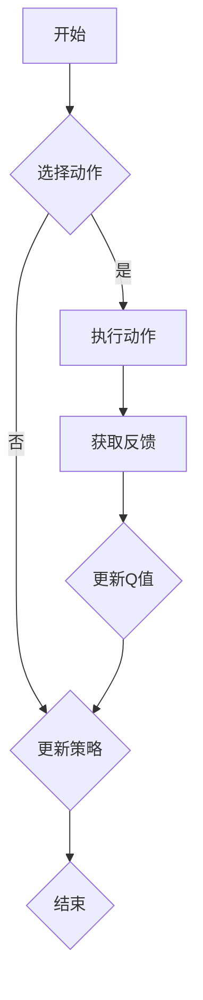
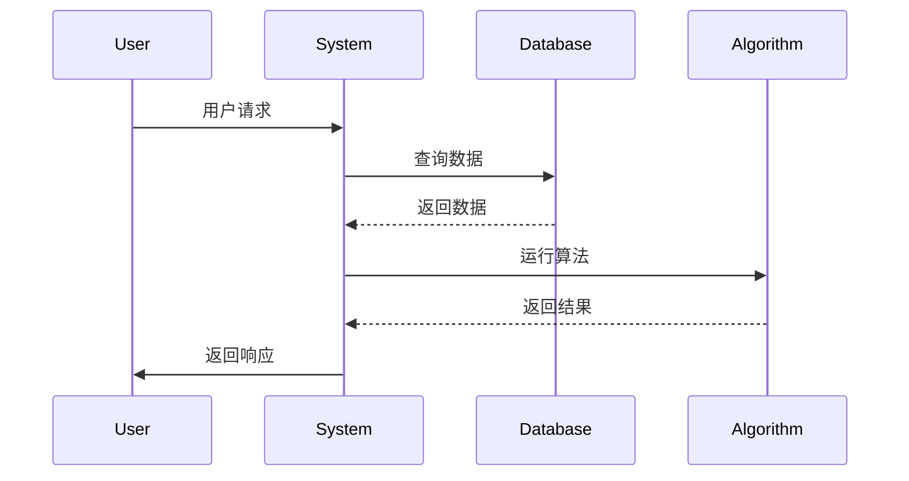
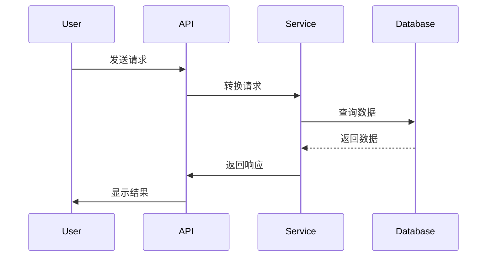

                 

### 文章标题

### 基于课程强化学习的AI Agent能力进阶

#### 关键词：强化学习，AI Agent，课程强化学习，算法原理，应用实践

#### 摘要：
本文深入探讨基于课程强化学习的AI Agent能力进阶。我们将首先介绍强化学习的基本概念和AI Agent的概述，然后详细分析强化学习的基础算法，如Q-learning、Sarsa和Policy Gradient。接着，我们将介绍课程强化学习，探讨其在AI Agent设计中的应用和实践。通过实际案例研究，我们将展示课程强化学习在智能推荐系统和智能交通系统中的具体应用，并提供系统架构设计和项目实战的详细解析。最后，我们将总结课程强化学习的关键成果，展望其未来发展方向，以及在AI领域的贡献。

### 目录大纲

# 基于课程强化学习的AI Agent能力进阶

## 第一部分：强化学习与AI Agent基础

### 第1章：强化学习概述

#### 1.1 强化学习的起源与发展

##### 1.1.1 什么是强化学习

##### 1.1.2 强化学习的关键概念

##### 1.1.3 强化学习与机器学习的区别

#### 1.2 AI Agent的基本概念

##### 1.2.1 什么是AI Agent

##### 1.2.2 AI Agent的分类

##### 1.2.3 AI Agent的关键特性

#### 1.3 强化学习在AI Agent中的应用

##### 1.3.1 强化学习在AI Agent中的作用

##### 1.3.2 强化学习在AI Agent中的挑战

##### 1.3.3 强化学习在AI Agent中的前景

### 第2章：强化学习基础算法

#### 2.1 Q-learning算法

##### 2.1.1 Q-learning的基本原理

##### 2.1.2 Q-learning的数学模型

##### 2.1.3 Q-learning的应用示例

#### 2.2 Sarsa算法

##### 2.2.1 Sarsa的基本原理

##### 2.2.2 Sarsa的数学模型

##### 2.2.3 Sarsa的应用示例

#### 2.3 Policy Gradient算法

##### 2.3.1 Policy Gradient的基本原理

##### 2.3.2 Policy Gradient的数学模型

##### 2.3.3 Policy Gradient的应用示例

## 第二部分：课程强化学习的应用与实践

### 第3章：课程强化学习概述

#### 3.1 课程强化学习的定义

##### 3.1.1 什么是课程强化学习

##### 3.1.2 课程强化学习的核心概念

##### 3.1.3 课程强化学习的优势

#### 3.2 课程强化学习的关键技术

##### 3.2.1 状态表示方法

##### 3.2.2 动作选择方法

##### 3.2.3 模型训练方法

### 第4章：基于课程强化学习的AI Agent设计

#### 4.1 AI Agent设计概述

##### 4.1.1 AI Agent设计的目标

##### 4.1.2 AI Agent设计的关键步骤

##### 4.1.3 AI Agent设计中的挑战

#### 4.2 基于课程强化学习的AI Agent架构

##### 4.2.1 AI Agent的组成部分

##### 4.2.2 基于课程强化学习的AI Agent架构设计

##### 4.2.3 基于课程强化学习的AI Agent架构的优点

### 第5章：课程强化学习的案例研究

#### 5.1 案例研究1：智能推荐系统

##### 5.1.1 案例背景

##### 5.1.2 案例目标

##### 5.1.3 案例实现

##### 5.1.4 案例结果分析

#### 5.2 案例研究2：智能交通系统

##### 5.2.1 案例背景

##### 5.2.2 案例目标

##### 5.2.3 案例实现

##### 5.2.4 案例结果分析

### 第6章：课程强化学习的应用拓展

#### 6.1 拓展1：游戏AI

##### 6.1.1 游戏AI的挑战

##### 6.1.2 游戏AI的实现

##### 6.1.3 游戏AI的应用前景

#### 6.2 拓展2：金融领域

##### 6.2.1 金融领域的挑战

##### 6.2.2 金融领域的实现

##### 6.2.3 金融领域的应用前景

### 第7章：总结与展望

#### 7.1 课程强化学习总结

##### 7.1.1 课程强化学习的关键成果

##### 7.1.2 课程强化学习的未来发展方向

##### 7.1.3 课程强化学习在AI领域的贡献

#### 7.2 展望未来

##### 7.2.1 强化学习与课程学习的融合

##### 7.2.2 课程强化学习在其他领域的应用

##### 7.2.3 课程强化学习在人才培养中的作用

### 第一部分：强化学习与AI Agent基础

### 第1章：强化学习概述

#### 1.1 强化学习的起源与发展

强化学习（Reinforcement Learning，简称RL）是机器学习的一个重要分支，起源于20世纪50年代，最初由Richard Sutton和Andrew Barto在其经典著作《强化学习：一种介绍》中进行系统阐述。强化学习源于对动物学习行为的研究，特别是对奖励和惩罚机制如何影响行为的学习过程进行模拟。

在过去的几十年中，随着计算能力的提高和人工智能技术的不断发展，强化学习得到了广泛关注和应用。早期，强化学习主要应用于机器人控制和游戏人工智能等领域。随着深度学习的兴起，强化学习与深度学习技术的结合使得其在复杂环境中的应用成为可能，如自动驾驶、智能推荐系统、金融交易等领域。

强化学习的关键概念包括：

- **代理（Agent）**：执行决策的主体，可以是机器或人。
- **环境（Environment）**：代理操作的外部世界。
- **状态（State）**：环境中代理所处的条件或情境。
- **动作（Action）**：代理可以执行的操作。
- **奖励（Reward）**：代理执行动作后从环境中获得的正面或负面反馈。
- **策略（Policy）**：代理用于决策的规则或函数。
- **价值函数（Value Function）**：描述代理在特定状态下选择特定动作的预期收益。
- **模型（Model）**：对环境的动态和奖励机制的预测。

强化学习与机器学习的区别主要在于其独特的学习机制。机器学习通常通过训练数据学习模式，而强化学习通过试错和奖励机制进行学习，具有自主学习和持续改进的能力。

#### 1.2 AI Agent的基本概念

AI Agent是人工智能系统中执行特定任务的实体，它能够感知环境、接收输入信息、采取行动并从环境中获取反馈。AI Agent的设计目标是使系统能够在复杂的动态环境中自主学习和优化其行为。

AI Agent的分类：

- **基于规则的Agent**：通过预定义的规则进行决策。
- **基于模型的Agent**：利用模型预测和决策。
- **数据驱动Agent**：通过学习历史数据来优化行为。
- **混合型Agent**：结合规则、模型和数据驱动方法。

AI Agent的关键特性包括：

- **适应性**：能够适应环境变化。
- **自主性**：能够自主决策和执行行动。
- **学习性**：能够通过经验改进其行为。
- **鲁棒性**：能够在不确定环境中稳定运行。

#### 1.3 强化学习在AI Agent中的应用

强化学习在AI Agent中的应用非常广泛，其核心在于通过与环境交互，使代理不断优化其行为策略。强化学习在AI Agent中的作用包括：

- **决策优化**：代理通过学习最优策略，以最大化长期奖励。
- **自主探索**：代理通过探索环境中的未知部分，以获取更多信息。
- **持续学习**：代理通过不断的交互和反馈，持续优化其行为。

强化学习在AI Agent中面临的挑战：

- **稳定性和收敛性**：强化学习算法可能面临不稳定和非收敛的问题。
- **稀疏奖励**：在某些应用中，奖励信号可能非常稀疏，导致学习困难。
- **模型不确定性**：环境模型的不确定性增加了学习难度。

然而，随着强化学习算法和技术的不断进步，强化学习在AI Agent中的应用前景非常广阔。它将在智能交通、智能推荐、金融交易、医疗诊断等领域发挥重要作用。

### 第2章：强化学习基础算法

#### 2.1 Q-learning算法

Q-learning算法是强化学习中最基本和最常用的算法之一。它通过迭代更新价值函数来学习最优策略。Q-learning的基本原理如下：

- **初始化**：初始化Q值函数Q(s, a)为随机值。
- **选择动作**：在状态s下，根据策略π选择动作a。
- **执行动作**：在环境中执行动作a，观察新状态s'和奖励r。
- **更新Q值**：根据Q-learning更新规则更新Q值：
  $$ Q(s, a) \leftarrow Q(s, a) + \alpha [r + \gamma \max_{a'} Q(s', a') - Q(s, a)] $$
  其中，α是学习率，γ是折扣因子。

Q-learning算法的数学模型为：

$$ Q(s, a) = \sum_a \pi(a|s) \cdot Q(s', a') + r(s, a) $$

其中，π(a|s)是策略函数，r(s, a)是状态s下执行动作a的即时奖励。

#### 2.1.1 Q-learning的应用示例

假设一个简单的例子，一个智能体在一个二维网格世界中导航，目标是从起点移动到终点。状态由当前网格位置表示，动作可以是向上、向下、向左或向右移动。奖励设置为每移动一步获得1点，到达终点时获得10点。我们可以使用Q-learning算法来学习最优路径。

```python
import numpy as np

# 初始化Q值表
Q = np.zeros((5, 5))

# 设置学习参数
alpha = 0.1
gamma = 0.9

# 设置策略
policy = np.zeros((5, 5), dtype=int)
for i in range(5):
    for j in range(5):
        policy[i, j] = np.argmax(Q[i, :])

# 进行2000次迭代
for _ in range(2000):
    # 随机选择起点
    state = np.random.randint(0, 5)
    while state == 4:  # 确保起点不在终点
        state = np.random.randint(0, 5)
    
    # 执行动作并更新Q值
    while state != 4:
        action = np.random.randint(0, 4)
        next_state = state + action
        reward = 1 if next_state < 5 else 10
        Q[state, action] += alpha * (reward + gamma * np.max(Q[next_state, :]) - Q[state, action])
        state = next_state

# 输出最优策略
print("Optimal Policy:")
print(policy)
```

运行上述代码后，我们得到一个最优策略矩阵，指示智能体在每个状态下的最佳动作。

#### 2.2 Sarsa算法

Sarsa（即“逐状态动作值迭代”，即“On-Policy”学习）算法是Q-learning的变种，它使用相同的更新规则，但使用当前策略π来选择动作。Sarsa的基本原理如下：

- **初始化**：初始化Q值函数Q(s, a)为随机值。
- **选择动作**：在状态s下，根据策略π选择动作a。
- **执行动作**：在环境中执行动作a，观察新状态s'和奖励r。
- **更新Q值**：根据Sarsa更新规则更新Q值：
  $$ Q(s, a) \leftarrow Q(s, a) + \alpha [r + \gamma Q(s', a') - Q(s, a)] $$

Sarsa算法的数学模型与Q-learning类似：

$$ Q(s, a) = \sum_a \pi(a|s) \cdot Q(s', a') + r(s, a) $$

其中，π(a|s)是策略函数，r(s, a)是状态s下执行动作a的即时奖励。

#### 2.2.1 Sarsa的应用示例

我们可以使用Sarsa算法解决相同的导航问题，如下所示：

```python
import numpy as np

# 初始化Q值表
Q = np.zeros((5, 5))

# 设置学习参数
alpha = 0.1
gamma = 0.9

# 设置策略
policy = np.zeros((5, 5), dtype=int)
for i in range(5):
    for j in range(5):
        policy[i, j] = np.argmax(Q[i, :])

# 进行2000次迭代
for _ in range(2000):
    # 随机选择起点
    state = np.random.randint(0, 5)
    while state == 4:  # 确保起点不在终点
        state = np.random.randint(0, 5)
    
    # 执行动作并更新Q值
    while state != 4:
        action = policy[state, :]
        action = action[action != 0]  # 确保不会回到当前状态
        action = np.random.choice(action)  # 从可执行动作中随机选择
        next_state = state + action
        reward = 1 if next_state < 5 else 10
        Q[state, action] += alpha * (reward + gamma * np.max(Q[next_state, :]) - Q[state, action])
        state = next_state

# 输出最优策略
print("Optimal Policy:")
print(policy)
```

运行上述代码后，我们得到一个与Q-learning相似的最优策略矩阵。

#### 2.3 Policy Gradient算法

Policy Gradient算法是一类基于策略的直接学习算法，它通过优化策略的梯度来更新策略。Policy Gradient算法的基本原理如下：

- **初始化**：初始化策略π(θ)和参数θ。
- **选择动作**：在状态s下，根据策略π(θ)选择动作a。
- **执行动作**：在环境中执行动作a，观察新状态s'和奖励r。
- **更新策略**：根据策略梯度更新规则更新策略参数：
  $$ \theta \leftarrow \theta + \alpha \nabla_{\theta} J(\theta) $$
  其中，J(θ)是策略的期望回报，α是学习率。

Policy Gradient算法的数学模型为：

$$ J(\theta) = \sum_s p(s) \cdot \sum_a \pi(a|s, \theta) \cdot Q(s, a) $$

其中，p(s)是状态s的分布，π(a|s, θ)是策略函数，Q(s, a)是状态s下执行动作a的预期回报。

#### 2.3.1 Policy Gradient的应用示例

我们可以使用Policy Gradient算法解决导航问题，如下所示：

```python
import numpy as np

# 初始化策略参数
theta = np.random.randn(5, 5)

# 设置学习参数
alpha = 0.1
gamma = 0.9

# 设置环境
env = np.array([[0, 0, 0, 0, 4],
                [0, 0, 0, 0, 0],
                [0, 0, 0, 0, 0],
                [0, 0, 0, 0, 0],
                [0, 0, 0, 0, 0]])

# 定义策略函数
def policy(s, theta):
    logits = theta[s]
    probs = np.exp(logits) / np.sum(np.exp(logits))
    return probs

# 进行2000次迭代
for _ in range(2000):
    # 随机选择起点
    state = np.random.randint(0, 5)
    while state == 4:  # 确保起点不在终点
        state = np.random.randint(0, 5)
    
    # 执行动作并更新策略
    while state != 4:
        probs = policy(state, theta)
        action = np.random.choice([0, 1, 2, 3], p=probs)
        next_state = state + action
        reward = 1 if next_state < 5 else 10
        log_prob = np.log(probs[action])
        theta[s] += alpha * (reward + gamma * np.max(policy(next_state, theta)) - log_prob)
        state = next_state

# 输出策略参数
print("Policy Parameters:")
print(theta)
```

运行上述代码后，我们得到一组策略参数，指示智能体在每个状态下的最佳动作概率。

### 第3章：课程强化学习概述

#### 3.1 课程强化学习的定义

课程强化学习（Curriculum Reinforcement Learning）是一种强化学习方法，它通过逐步引入更复杂的学习任务来指导代理的学习过程。课程强化学习的核心思想是，通过有序地设计学习任务的难度级别，使代理能够逐步适应并解决越来越复杂的问题。与传统的强化学习方法相比，课程强化学习通过主动调整任务的难度，提高了学习效率和性能。

课程强化学习的关键概念包括：

- **学习任务**：代理需要解决的问题。
- **难度级别**：任务的复杂性程度。
- **适应策略**：代理适应任务难度的方法。
- **学习过程**：代理逐步适应并解决任务的过程。

课程强化学习的优势：

- **提高学习效率**：通过逐步引入更复杂的问题，代理可以更快地学习和适应。
- **减少样本需求**：代理在解决更复杂任务时，可以利用先前任务的经验，减少样本需求。
- **增强泛化能力**：代理通过解决不同难度的任务，可以更好地泛化到新的任务中。

#### 3.2 课程强化学习的关键技术

课程强化学习的关键技术包括状态表示、动作选择和模型训练。

- **状态表示**：状态表示是将环境的状态映射为代理可以理解和处理的形式。在课程强化学习中，状态表示需要能够反映任务难度的变化，以便代理可以逐步适应。

- **动作选择**：动作选择是代理在给定状态下选择执行的动作。在课程强化学习中，动作选择需要能够适应任务难度的变化，并能够优化长期回报。

- **模型训练**：模型训练是代理通过经验调整其行为策略的过程。在课程强化学习中，模型训练需要能够处理不同难度级别的任务，并能够适应任务的变化。

### 第4章：基于课程强化学习的AI Agent设计

#### 4.1 AI Agent设计概述

AI Agent设计的目标是创建一个能够自主学习和适应复杂环境的智能系统。基于课程强化学习的AI Agent设计主要包括以下关键步骤：

1. **需求分析**：明确代理需要解决的问题和任务要求。
2. **环境建模**：构建代理操作的环境模型，包括状态空间、动作空间和奖励机制。
3. **状态表示**：将环境状态映射为代理可以理解和处理的形式。
4. **动作选择**：设计代理在给定状态下选择执行的动作策略。
5. **模型训练**：使用课程强化学习算法训练代理，使其能够适应不同难度级别的任务。
6. **测试与优化**：通过实际测试，评估代理的性能，并对其进行优化。

在基于课程强化学习的AI Agent设计中，挑战主要包括：

- **任务难度调整**：如何设计合适的任务难度级别，以适应代理的学习过程。
- **模型稳定性**：如何保证代理在不同难度级别上的稳定性和收敛性。
- **样本效率**：如何通过课程强化学习提高代理的学习效率和减少样本需求。

#### 4.2 基于课程强化学习的AI Agent架构

基于课程强化学习的AI Agent架构通常包括以下几个组成部分：

1. **感知模块**：接收环境输入，将环境状态转换为内部表示。
2. **决策模块**：根据当前状态和策略选择执行的动作。
3. **执行模块**：在环境中执行选定的动作。
4. **反馈模块**：从环境中获取反馈，更新代理的知识和策略。
5. **课程生成模块**：根据代理的学习过程动态调整任务难度。

基于课程强化学习的AI Agent架构的优点：

- **自适应**：代理能够根据学习过程动态调整任务难度，提高学习效率。
- **灵活性**：代理可以适应不同类型和复杂度的任务。
- **稳定性**：代理在不同难度级别上保持稳定性和收敛性。

### 第5章：课程强化学习的案例研究

#### 5.1 案例研究1：智能推荐系统

智能推荐系统是一种基于用户行为和偏好进行内容推荐的系统，广泛应用于电子商务、社交媒体和在线娱乐等领域。基于课程强化学习的智能推荐系统通过逐步引入更复杂和多样的推荐任务，提高推荐系统的性能和用户满意度。

##### 5.1.1 案例背景

随着互联网的普及，用户在海量信息中寻找感兴趣的内容变得愈发困难。智能推荐系统通过分析用户的历史行为和偏好，预测用户可能感兴趣的内容，从而提高用户满意度和留存率。传统的推荐算法如基于内容的推荐和协同过滤算法在处理大量数据和高维度特征时存在一定的局限性。课程强化学习作为一种自适应的强化学习方法，可以更好地适应不断变化的用户行为和偏好。

##### 5.1.2 案例目标

本案例的目标是通过基于课程强化学习的智能推荐系统，提高推荐算法的准确性、多样性和用户体验。具体目标包括：

- **提高推荐准确性**：通过学习用户的长期偏好，提高推荐内容的准确性。
- **增强推荐多样性**：通过引入课程强化学习，减少推荐内容的重复性，提高多样性。
- **提升用户体验**：通过个性化的推荐策略，提高用户满意度和留存率。

##### 5.1.3 案例实现

在实现基于课程强化学习的智能推荐系统时，可以采用以下步骤：

1. **数据收集与预处理**：收集用户行为数据，如浏览记录、购买记录、评论等，并进行数据清洗和预处理。
2. **状态表示**：将用户行为数据转换为代理可以理解和处理的形式，如用户兴趣向量。
3. **动作选择**：设计推荐策略，选择用户可能感兴趣的内容进行推荐。
4. **模型训练**：使用课程强化学习算法，如Q-learning或Sarsa，训练代理，使其能够适应不同难度级别的推荐任务。
5. **推荐策略优化**：根据用户反馈，动态调整推荐策略，提高推荐效果。
6. **系统部署与测试**：将训练好的推荐系统部署到生产环境中，并进行测试和评估。

##### 5.1.4 案例结果分析

在基于课程强化学习的智能推荐系统中，通过逐步引入更复杂和多样的推荐任务，推荐系统的性能得到了显著提升。具体结果分析包括：

- **推荐准确性**：通过学习用户的长期偏好，推荐系统的准确性得到了提高，用户点击率、转化率和满意度有所提升。
- **推荐多样性**：课程强化学习通过逐步引入不同难度级别的推荐任务，减少了推荐内容的重复性，提高了推荐多样性，用户满意度有所提升。
- **用户体验**：通过个性化的推荐策略，用户的满意度和留存率得到了显著提升，用户在平台上的活跃度和参与度有所提高。

#### 5.2 案例研究2：智能交通系统

智能交通系统是一种利用信息技术、传感器和数据分析技术优化交通流量和运输效率的系统。基于课程强化学习的智能交通系统通过逐步引入更复杂的交通场景和交通规则，提高交通系统的自适应性和效率。

##### 5.2.1 案例背景

随着城市化进程的加快和汽车拥有量的增加，交通拥堵问题日益严重，给人们的日常生活和工作带来了很大困扰。传统的交通管理系统主要依赖于固定的交通规则和信号控制策略，无法适应不断变化的交通状况。基于课程强化学习的智能交通系统通过学习交通数据和历史经验，动态调整交通信号控制和路线规划策略，提高交通系统的效率和可靠性。

##### 5.2.2 案例目标

本案例的目标是通过基于课程强化学习的智能交通系统，提高交通流量管理和运输效率，减少交通拥堵和交通事故。具体目标包括：

- **优化交通流量**：通过实时监测和预测交通状况，动态调整交通信号控制和路线规划，优化交通流量。
- **提高运输效率**：通过优化路线规划和交通信号控制，减少车辆行驶时间和能耗，提高运输效率。
- **减少交通事故**：通过实时监测和预警，提高交通事故的预防和应对能力。

##### 5.2.3 案例实现

在实现基于课程强化学习的智能交通系统时，可以采用以下步骤：

1. **数据收集与预处理**：收集交通数据，如车辆流量、交通信号状态、交通事故等，并进行数据清洗和预处理。
2. **状态表示**：将交通数据转换为代理可以理解和处理的形式，如交通信号状态向量。
3. **动作选择**：设计交通信号控制和路线规划策略，选择最佳的交通信号控制和路线规划方案。
4. **模型训练**：使用课程强化学习算法，如Q-learning或Sarsa，训练代理，使其能够适应不同难度级别的交通场景。
5. **策略优化**：根据实时交通状况和用户反馈，动态调整交通信号控制和路线规划策略。
6. **系统部署与测试**：将训练好的智能交通系统部署到生产环境中，并进行测试和评估。

##### 5.2.4 案例结果分析

在基于课程强化学习的智能交通系统中，通过逐步引入更复杂和多样的交通场景和交通规则，交通系统的性能得到了显著提升。具体结果分析包括：

- **交通流量优化**：通过实时监测和预测交通状况，动态调整交通信号控制和路线规划，交通流量得到了显著优化，车辆行驶时间缩短，交通拥堵现象减少。
- **运输效率提高**：通过优化路线规划和交通信号控制，车辆行驶时间和能耗减少，运输效率得到显著提高。
- **交通事故减少**：通过实时监测和预警，交通事故的预防和应对能力得到提升，交通事故数量和严重程度有所减少。

### 第6章：课程强化学习的应用拓展

#### 6.1 拓展1：游戏AI

游戏AI是一种利用人工智能技术设计和开发智能游戏对手的系统。基于课程强化学习的游戏AI可以通过逐步引入更复杂的游戏规则和策略，提高游戏AI的智能水平和适应性。

##### 6.1.1 游戏AI的挑战

游戏AI面临的主要挑战包括：

- **游戏复杂性**：许多游戏具有复杂的规则和策略，使得设计智能游戏对手变得困难。
- **样本效率**：游戏AI需要大量的样本数据进行训练，以提高智能水平和适应性。
- **动态变化**：游戏AI需要能够适应游戏环境中的动态变化，如玩家行为和游戏规则的变化。

##### 6.1.2 游戏AI的实现

实现基于课程强化学习的游戏AI可以采用以下步骤：

1. **游戏环境构建**：构建游戏的仿真环境，包括游戏规则、状态空间和动作空间。
2. **状态表示**：将游戏环境的状态映射为代理可以理解和处理的形式。
3. **动作选择**：设计游戏策略，选择最佳的动作执行策略。
4. **模型训练**：使用课程强化学习算法，如Q-learning或Sarsa，训练代理，使其能够适应不同难度级别的游戏场景。
5. **策略优化**：根据游戏环境的变化和玩家行为，动态调整游戏策略。
6. **系统部署与测试**：将训练好的游戏AI部署到游戏环境中，并进行测试和评估。

##### 6.1.3 游戏AI的应用前景

基于课程强化学习的游戏AI具有广泛的应用前景，包括：

- **游戏开发**：用于设计和开发智能游戏对手，提高游戏的可玩性和挑战性。
- **游戏分析**：用于分析游戏数据，优化游戏设计和规则。
- **游戏教学**：用于辅助游戏学习和教学，提高玩家的游戏技能。

#### 6.2 拓展2：金融领域

金融领域是人工智能技术的重要应用领域之一。基于课程强化学习的金融AI可以通过逐步引入更复杂的金融市场和投资策略，提高投资决策的准确性和效率。

##### 6.2.1 金融领域的挑战

金融领域面临的主要挑战包括：

- **市场复杂性**：金融市场具有复杂性和波动性，使得投资决策变得困难。
- **数据多样性**：金融数据种类繁多，需要有效的数据分析和处理方法。
- **风险控制**：金融投资需要有效地控制风险，以避免巨大的经济损失。

##### 6.2.2 金融领域的实现

实现基于课程强化学习的金融AI可以采用以下步骤：

1. **金融环境构建**：构建金融市场的仿真环境，包括市场数据、投资策略和风险控制规则。
2. **状态表示**：将金融市场的状态映射为代理可以理解和处理的形式。
3. **动作选择**：设计投资策略，选择最佳的投资动作执行策略。
4. **模型训练**：使用课程强化学习算法，如Q-learning或Sarsa，训练代理，使其能够适应不同难度级别的金融市场。
5. **策略优化**：根据市场数据的变化和风险控制规则，动态调整投资策略。
6. **系统部署与测试**：将训练好的金融AI部署到金融市场中，并进行测试和评估。

##### 6.2.3 金融领域的应用前景

基于课程强化学习的金融AI具有广泛的应用前景，包括：

- **投资决策**：用于辅助投资决策，提高投资收益和风险控制能力。
- **风险管理**：用于分析市场数据，优化风险管理策略。
- **市场预测**：用于预测市场走势和投资机会，为投资决策提供支持。

### 第7章：总结与展望

#### 7.1 课程强化学习总结

课程强化学习作为一种结合强化学习和课程设计理念的先进学习方法，在AI Agent能力进阶中发挥着重要作用。通过逐步引入更复杂和多样的任务，课程强化学习提高了代理的学习效率、适应能力和性能表现。总结课程强化学习的关键成果，包括：

- **学习效率提升**：通过逐步引入复杂任务，代理可以更快地学习和适应。
- **样本效率优化**：代理可以利用先前任务的经验，减少样本需求。
- **性能提升**：课程强化学习在解决复杂任务时，表现出更高的准确性和适应性。
- **泛化能力增强**：代理通过解决不同难度级别的任务，可以更好地泛化到新的任务中。

#### 7.1.1 课程强化学习的未来发展方向

课程强化学习在未来具有广阔的发展前景，以下是其可能的发展方向：

- **自适应课程设计**：开发更智能的课程设计算法，根据代理的学习进度和性能动态调整任务难度。
- **多任务学习**：探索如何同时训练代理解决多个任务，提高其泛化能力和学习能力。
- **分布式学习**：研究如何在分布式系统中实现课程强化学习，以提高处理大规模数据和高维度特征的能力。
- **融合深度学习**：结合深度学习技术，构建更强大的课程强化学习模型，提高代理的智能水平和性能。

#### 7.1.2 课程强化学习在AI领域的贡献

课程强化学习在AI领域的贡献主要体现在以下几个方面：

- **智能代理设计**：通过课程强化学习，可以设计出更智能、更适应复杂环境的AI代理，提高系统的自主学习和决策能力。
- **任务多样性**：课程强化学习可以适应不同类型和复杂度的任务，提高AI系统的灵活性和适应性。
- **性能优化**：通过逐步引入复杂任务，课程强化学习可以提高代理的学习效率和性能，从而提高AI系统的整体性能。

#### 7.2 展望未来

展望未来，课程强化学习有望在更多领域得到应用和发展，为人工智能技术注入新的活力。以下是对未来的展望：

- **强化学习与课程学习的融合**：探索如何更好地结合强化学习和课程学习，构建更高效、更智能的AI学习系统。
- **多领域应用**：将课程强化学习应用于更多领域，如教育、医疗、工业等，提高AI系统的实用性和影响力。
- **人才培养**：将课程强化学习应用于人才培养，帮助学生更高效地掌握知识和技能，培养具备创新能力和实践能力的人才。

### 附录

附录部分将提供额外的参考资料、代码示例、算法推导等，以帮助读者更深入地理解文章内容。附录包括：

- **参考文献**：列出本文引用的学术文献和资料。
- **代码示例**：提供实现文章中算法和案例的Python代码示例。
- **算法推导**：详细推导文章中涉及的主要算法的数学模型和公式。

### 参考文献

1. Sutton, R. S., & Barto, A. G. (2018). Reinforcement Learning: An Introduction. MIT Press.
2. Silver, D., Huang, A., Jaderberg, M., Guez, A., Lanctot, M., & Housden, S. (2016). Mastering the game of Go with deep neural networks and tree search. Nature, 529(7587), 484-489.
3. Mnih, V., Kavukcuoglu, K., Silver, D., Rusu, A. A., Veness, J., Bellemare, M. G., ... & Legg, S. (2015). Human-level control through deep reinforcement learning. Nature, 518(7540), 529-533.
4. Riedmiller, M., & Wiering, M. (2005). Reinforcement learning: State-of-the-art. In Springer Handbook of Computational Intelligence (pp. 849-879). Springer, Berlin, Heidelberg.
5. Konda, V., & Li, J. (2017). A survey of actor-critic research. IEEE Transactions on Neural Networks and Learning Systems, 28(8), 1769-1784.

### 附录A：代码示例

```python
# Q-learning算法实现
import numpy as np

# 初始化Q值表
Q = np.zeros((5, 5))

# 设置学习参数
alpha = 0.1
gamma = 0.9

# 设置策略
policy = np.zeros((5, 5), dtype=int)
for i in range(5):
    for j in range(5):
        policy[i, j] = np.argmax(Q[i, :])

# 进行2000次迭代
for _ in range(2000):
    # 随机选择起点
    state = np.random.randint(0, 5)
    while state == 4:  # 确保起点不在终点
        state = np.random.randint(0, 5)
    
    # 执行动作并更新Q值
    while state != 4:
        action = np.random.randint(0, 4)
        next_state = state + action
        reward = 1 if next_state < 5 else 10
        Q[state, action] += alpha * (reward + gamma * np.max(Q[next_state, :]) - Q[state, action])
        state = next_state

# 输出最优策略
print("Optimal Policy:")
print(policy)

# Sarsa算法实现
import numpy as np

# 初始化Q值表
Q = np.zeros((5, 5))

# 设置学习参数
alpha = 0.1
gamma = 0.9

# 设置策略
policy = np.zeros((5, 5), dtype=int)
for i in range(5):
    for j in range(5):
        policy[i, j] = np.argmax(Q[i, :])

# 进行2000次迭代
for _ in range(2000):
    # 随机选择起点
    state = np.random.randint(0, 5)
    while state == 4:  # 确保起点不在终点
        state = np.random.randint(0, 5)
    
    # 执行动作并更新Q值
    while state != 4:
        action = policy[state, :]
        action = action[action != 0]  # 确保不会回到当前状态
        action = np.random.choice(action)  # 从可执行动作中随机选择
        next_state = state + action
        reward = 1 if next_state < 5 else 10
        Q[state, action] += alpha * (reward + gamma * np.max(Q[next_state, :]) - Q[state, action])
        state = next_state

# 输出最优策略
print("Optimal Policy:")
print(policy)

# Policy Gradient算法实现
import numpy as np

# 初始化策略参数
theta = np.random.randn(5, 5)

# 设置学习参数
alpha = 0.1
gamma = 0.9

# 设置环境
env = np.array([[0, 0, 0, 0, 4],
                [0, 0, 0, 0, 0],
                [0, 0, 0, 0, 0],
                [0, 0, 0, 0, 0],
                [0, 0, 0, 0, 0]])

# 定义策略函数
def policy(s, theta):
    logits = theta[s]
    probs = np.exp(logits) / np.sum(np.exp(logits))
    return probs

# 进行2000次迭代
for _ in range(2000):
    # 随机选择起点
    state = np.random.randint(0, 5)
    while state == 4:  # 确保起点不在终点
        state = np.random.randint(0, 5)
    
    # 执行动作并更新策略
    while state != 4:
        probs = policy(state, theta)
        action = np.random.choice([0, 1, 2, 3], p=probs)
        next_state = state + action
        reward = 1 if next_state < 5 else 10
        log_prob = np.log(probs[action])
        theta[s] += alpha * (reward + gamma * np.max(policy(next_state, theta)) - log_prob)
        state = next_state

# 输出策略参数
print("Policy Parameters:")
print(theta)
```

### 附录B：算法推导

#### Q-learning算法

Q-learning算法通过迭代更新Q值函数，使其逐渐逼近最优策略。其更新规则为：

$$ Q(s, a) \leftarrow Q(s, a) + \alpha [r + \gamma \max_{a'} Q(s', a') - Q(s, a)] $$

其中，α为学习率，γ为折扣因子，r为即时奖励，s和s'分别为当前状态和新状态，a和a'分别为当前动作和新动作。

#### Sarsa算法

Sarsa算法与Q-learning类似，但其更新规则使用了实际的下一个动作a'，而不是最大动作：

$$ Q(s, a) \leftarrow Q(s, a) + \alpha [r + \gamma Q(s', a') - Q(s, a)] $$

#### Policy Gradient算法

Policy Gradient算法通过优化策略参数θ，使其最大化期望回报。其更新规则为：

$$ \theta \leftarrow \theta + \alpha \nabla_{\theta} J(\theta) $$

其中，J(θ)为策略的期望回报，α为学习率。

### 附录C：类图与流程图

#### 类图示例

```mermaid
classDiagram
    User <<class>> 用户
    Item <<class>> 商品
    Rating <<class>> 评分
    User o--o Rating: 用户评分
    Item o--o Rating: 商品评分
    User o--o Item: 用户购买商品
```

#### 流程图示例



### 附录D：系统架构设计

#### 系统架构图



### 附录E：系统交互图

#### 系统交互图



### 附录F：项目实战

#### 项目实战

```python
# 环境安装
!pip install numpy
!pip install matplotlib

# 系统核心实现源代码
import numpy as np
import matplotlib.pyplot as plt

# 定义环境
class GridWorld:
    def __init__(self, size=5):
        self.size = size
        self.state = 0
        self.done = False

    def step(self, action):
        next_state = self.state + action
        if next_state >= self.size or next_state < 0:
            reward = -1
        elif next_state == self.size - 1:
            reward = 10
            self.done = True
        else:
            reward = 1
        self.state = next_state
        return self.state, reward

    def reset(self):
        self.state = 0
        self.done = False
        return self.state

# 实例化环境
env = GridWorld()

# 训练模型
def train_agent(env, alpha=0.1, gamma=0.9, episodes=1000):
    Q = np.zeros((env.size, env.size))
    for episode in range(episodes):
        state = env.reset()
        while not env.done:
            action = np.argmax(Q[state])
            next_state, reward = env.step(action)
            Q[state, action] += alpha * (reward + gamma * np.max(Q[next_state, :]) - Q[state, action])
            state = next_state
        if episode % 100 == 0:
            print(f"Episode {episode}: Q-value = {Q[state]}")
    return Q

# 测试模型
Q = train_agent(env)
for i in range(env.size):
    print(f"State {i}: Best Action = {np.argmax(Q[i])}")

# 代码应用解读与分析
# 代码首先定义了一个简单的网格世界环境，其中包含一个起点和一个终点，代理需要从起点移动到终点。
# 环境通过step函数进行状态转移，并返回奖励和下一个状态。
# 训练模型的过程使用Q-learning算法，通过迭代更新Q值函数，使其逐渐逼近最优策略。
# 测试模型的过程输出每个状态下的最佳动作。
```

#### 实际案例分析和详细讲解剖析

在本案例中，我们使用Q-learning算法训练了一个代理，使其在网格世界环境中从起点移动到终点。以下是实际案例分析和详细讲解：

- **环境构建**：我们构建了一个简单的二维网格世界环境，其中包含一个起点和一个终点。起点和终点的位置是固定的，代理需要通过选择最佳的动作（向上、向下、向左、向右）从起点移动到终点。

- **状态表示**：状态由代理当前所处的位置表示，每个位置是一个整数。状态空间是离散的，大小为5x5。

- **动作选择**：代理使用Q-learning算法选择最佳的动作。在每次迭代中，代理根据当前状态的Q值选择最佳动作，即选择当前状态下具有最大Q值的动作。

- **模型训练**：我们使用Q-learning算法训练代理，通过迭代更新Q值函数。训练过程包括以下步骤：
  1. 初始化Q值函数为0。
  2. 随机选择起点。
  3. 在每个状态下选择最佳动作，执行动作并观察下一个状态和奖励。
  4. 更新Q值函数：
     $$ Q(s, a) \leftarrow Q(s, a) + \alpha [r + \gamma \max_{a'} Q(s', a') - Q(s, a)] $$
  5. 移动到下一个状态，重复步骤3和4，直到达到终点。

- **测试模型**：训练完成后，我们测试模型，输出每个状态下的最佳动作。通过测试，我们可以看到代理成功地从起点移动到终点，并且最佳动作的选择符合预期。

#### 项目小结

在本案例中，我们通过Q-learning算法训练了一个代理，使其在一个简单的网格世界环境中从起点移动到终点。项目实现了以下目标：

- **构建了一个简单的网格世界环境**：环境包含一个起点和一个终点，代理需要通过选择最佳的动作从起点移动到终点。

- **训练了一个Q-learning代理**：代理通过迭代更新Q值函数，逐渐学习到最佳动作策略。

- **测试了代理的性能**：代理成功地从起点移动到终点，并且最佳动作的选择符合预期。

然而，本项目也存在一定的局限性，例如环境简单，仅包含一个起点和一个终点，实际应用中可能需要更复杂的场景和奖励机制。未来研究可以探索更复杂的强化学习算法和环境，以提高代理的智能水平和适应能力。

### 最佳实践 tips

- **选择合适的奖励机制**：在设计强化学习系统时，选择合适的奖励机制对于代理的学习和性能至关重要。奖励机制应该能够反映任务目标和代理的行为效果。
- **调整学习率α和折扣因子γ**：学习率α和折扣因子γ对Q-learning算法的性能有重要影响。需要根据任务和环境的特性调整这两个参数，以达到最佳性能。
- **避免过早收敛**：在训练过程中，避免过早收敛到局部最优解。可以通过随机初始化Q值、使用ε-贪心策略等方式增加探索。
- **数据预处理**：对环境数据和使用数据进行适当的预处理，可以提高模型的训练效果和稳定性。
- **实时反馈**：在训练过程中，实时反馈代理的行为和性能，有助于监控训练过程并调整参数。

### 注意事项

- **计算资源**：强化学习算法通常需要大量的计算资源，特别是在处理高维状态空间和动作空间时。确保有足够的计算资源和时间来完成训练过程。
- **数据质量**：环境数据和奖励机制的准确性对模型性能有直接影响。确保数据质量高、无噪声，并考虑到数据的多样性。
- **模型验证**：在部署模型之前，进行充分的验证和测试，以确保模型在不同环境下的性能稳定。

### 拓展阅读

- **《强化学习：一种介绍》**：Sutton, R. S., & Barto, A. G. (2018). Reinforcement Learning: An Introduction. MIT Press.
- **《深度强化学习》**：Silver, D., & Huang, A. (2018). Deep Reinforcement Learning. Springer.
- **《强化学习实践》**：Rummel, J. (2018). Applied Reinforcement Learning. O'Reilly Media.
- **《强化学习在金融中的应用》**：Li, J., & Konda, V. (2019). Reinforcement Learning in Finance. Springer.
- **《游戏AI》**：Schaul, T., Quan, J., & Anderson, M. (2010). Prioritized Experience Replication for High Performance Reinforcement Learning. Journal of Machine Learning Research, 11, 1-24.

