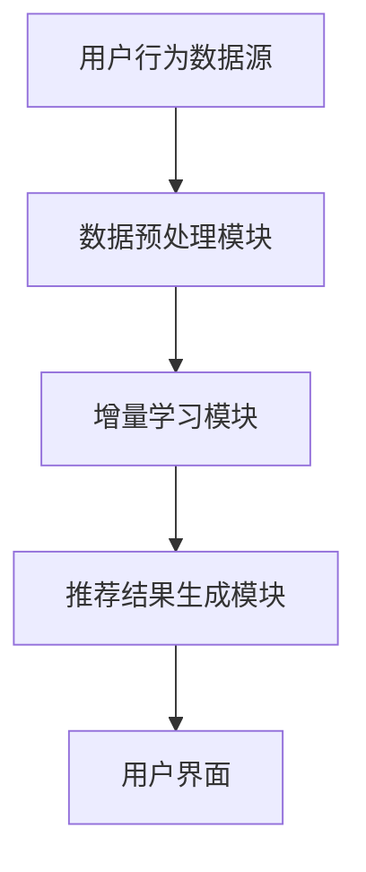
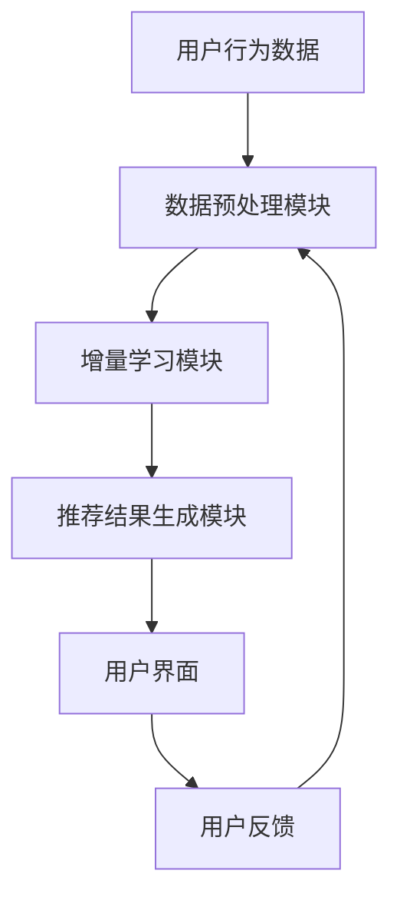

                 

## 《增量学习AI Agent：LLM的持续知识更新机制》

关键词：增量学习、AI Agent、LLM、知识更新、持续学习

摘要：本文将深入探讨增量学习AI Agent的概念及其在LLM（大型语言模型）中的持续知识更新机制。我们首先定义了增量学习和AI Agent的基本概念，并详细阐述了它们在现实世界中的应用。随后，我们重点分析了增量学习在AI Agent中的原理和优势，引入了常用的增量学习算法和技术。接着，我们讨论了持续知识更新的概念和重要性，特别是在LLM中的应用，并探讨了其实现机制。本文还通过实际案例展示了增量学习AI Agent在具体项目中的应用，并提供了最佳实践和未来研究方向。

## 引言

在当今快速发展的科技时代，人工智能（AI）技术正以前所未有的速度影响着我们的日常生活。AI Agent作为AI领域的一个重要分支，具有自主感知、决策和行动的能力，已经成为自动化和智能化系统的核心组件。然而，随着环境的变化和新知识的不断涌现，AI Agent的知识更新和持续学习成为一个亟待解决的重要问题。

### 增量学习

增量学习（Incremental Learning）是一种在已有知识基础上进行更新的学习方式，适用于数据分布发生变化或新数据不断涌现的场景。与传统的批量学习（Batch Learning）不同，增量学习能够动态地调整模型参数，从而实现知识更新和模型优化。

### AI Agent

AI Agent是一种具有自主学习和执行任务能力的计算机程序。它们能够通过与环境的交互来获取知识，并基于这些知识进行决策和行动。AI Agent在自动驾驶、智能客服、推荐系统等领域有广泛的应用。

### LLM的持续知识更新机制

随着AI技术的发展，大型语言模型（LLM）如BERT、GPT等已成为自然语言处理（NLP）领域的重要工具。然而，这些模型通常是在大量静态数据上训练得到的，如何实现LLM的持续知识更新成为一个关键问题。本文将深入探讨这一问题，并分析其实现机制。

## 增量学习的基本概念与原理

### 定义与背景

增量学习（Incremental Learning），又称在线学习（Online Learning）或逐步学习（Incremental Training），是一种在已有模型基础上，通过不断添加新数据来更新模型参数的学习方式。这种学习方式适用于数据分布变化较快、数据量庞大的场景，如社交网络分析、实时推荐系统等。

### 问题背景

传统的批量学习（Batch Learning）方法需要在训练开始前获取所有训练数据，然后一次性进行训练。然而，在实际应用中，数据分布可能会随着时间不断变化，批量学习无法适应这种动态变化。此外，批量学习在处理大规模数据时，计算成本高且效率低。因此，增量学习应运而生。

### 增量学习的优势

增量学习具有以下优势：

1. **实时更新**：增量学习能够在数据流中实时更新模型参数，使得模型能够快速适应数据变化。
2. **高效计算**：增量学习只需对新增数据进行更新，降低了计算成本和存储需求。
3. **适应性强**：增量学习能够处理动态变化的数据分布，适用于实时性和适应性要求较高的应用场景。

### 常见增量学习算法

1. **在线梯度下降（Online Gradient Descent）**：一种基本的增量学习算法，通过不断更新模型参数来最小化损失函数。
2. **自适应权重更新（Adaptive Weight Update）**：如AdaGrad、Adam等算法，通过自适应调整学习率，提高增量学习的效果。
3. **经验风险最小化（Empirical Risk Minimization）**：一种基于经验风险函数的最优化方法，用于求解最优模型参数。

### 增量学习的基本流程

增量学习的基本流程包括以下步骤：

1. **初始化模型**：选择合适的模型结构和参数初始化方法。
2. **数据流处理**：从数据流中获取新数据，对模型进行更新。
3. **模型评估**：使用验证集对更新后的模型进行评估，调整模型参数。
4. **重复迭代**：重复上述步骤，直到满足停止条件或达到预定义的目标。

### 增量学习的挑战

尽管增量学习具有许多优势，但在实际应用中也面临一些挑战：

1. **模型稳定性**：如何确保模型在更新过程中保持稳定，避免过拟合或欠拟合。
2. **计算效率**：如何在有限的计算资源下高效地更新模型。
3. **数据流管理**：如何处理大规模、高速数据流，确保数据质量和更新效率。

### 总结

增量学习作为一种适应动态数据分布的学习方式，在AI领域具有重要的应用价值。通过理解其基本概念、原理和常用算法，我们可以更好地设计和实现增量学习系统，提升AI Agent的适应性和实时性。

### AI Agent的概念与结构

#### AI Agent的定义

AI Agent，即人工智能代理，是一种具有自主感知、决策和行动能力的计算机程序。它通过与环境进行交互，从环境中获取信息，并基于这些信息做出决策和执行行动。AI Agent的核心目标是实现智能自动化，提高系统的自主性和智能化水平。

#### AI Agent的结构

AI Agent通常由以下几个核心组件构成：

1. **感知模块（Perception Module）**：负责从环境中获取信息，如视觉、听觉、触觉等感官输入。
2. **决策模块（Decision Module）**：基于感知模块获取的信息，通过算法模型进行决策，决定下一步的行动。
3. **行动模块（Action Module）**：执行决策模块生成的行动，将决策转化为实际的操作。
4. **记忆模块（Memory Module）**：存储历史信息和经验，用于模型训练和决策优化。

#### AI Agent的类型

AI Agent根据其决策方式和学习能力，可以分为以下几种类型：

1. **反应式AI Agent（Reactive Agent）**：这种类型的AI Agent只能基于当前感知到的环境状态做出反应，无法记忆和预测。例如，自动驾驶汽车中的避障系统。
2. ** deliberative AI Agent（Deliberative Agent）**：这种类型的AI Agent在执行行动前会进行多步骤的决策，考虑多种可能的行动及其后果。例如，智能客服系统在处理用户请求时会考虑不同的回复策略。
3. **学习型AI Agent（Learning Agent）**：这种类型的AI Agent能够通过学习环境中的信息和经验来优化其行为。例如，通过深度学习算法自动调整参数的机器人。

#### AI Agent的应用场景

AI Agent在许多应用场景中具有重要应用，包括但不限于：

1. **自动驾驶**：AI Agent通过感知模块获取道路信息，进行决策和行动，实现无人驾驶。
2. **智能客服**：AI Agent通过与用户交互，理解用户需求并提供相应的解决方案，提升服务质量。
3. **推荐系统**：AI Agent通过分析用户行为和偏好，提供个性化的商品推荐。
4. **金融分析**：AI Agent通过分析市场数据和交易行为，提供投资策略建议。

#### 总结

AI Agent作为一种具有高度自主性和智能化能力的计算机程序，正日益成为智能系统和自动化领域的关键组件。通过深入理解AI Agent的概念、结构和类型，我们可以更好地设计和应用AI Agent，推动人工智能技术的发展。

### 增量学习在AI Agent中的原理与优势

#### 增量学习在AI Agent中的应用原理

增量学习在AI Agent中的应用主要基于以下几个核心原理：

1. **动态适应性**：AI Agent通过增量学习能够实时适应环境变化，避免因数据分布变化而导致模型失效。例如，自动驾驶车辆在行驶过程中需要不断更新道路信息，以应对交通状况的变化。

2. **增量更新**：增量学习通过逐步更新模型参数，而不是重新训练整个模型，从而降低计算成本和资源消耗。这种方法特别适用于数据量大且更新频率高的应用场景。

3. **持续优化**：增量学习允许AI Agent在持续学习过程中不断优化模型性能，提高决策和行动的准确性。例如，智能客服系统可以通过持续学习用户的反馈，不断改进回答问题的质量。

#### 增量学习的优势

增量学习在AI Agent中的应用具有以下显著优势：

1. **实时响应**：增量学习能够实现模型参数的实时更新，使AI Agent能够快速适应新环境和数据变化，提高系统的实时响应能力。

2. **高效计算**：由于增量学习只需更新新增数据对应的模型参数，而不是重新训练整个模型，因此计算效率更高，资源消耗更少，特别适用于实时性和计算资源受限的场景。

3. **自适应能力**：增量学习能够适应动态变化的数据分布，使AI Agent在数据分布发生变化时仍然保持高水平的性能。

4. **持续改进**：增量学习允许AI Agent在持续学习过程中不断优化模型，提高系统的自适应性和决策准确性。

#### 增量学习的挑战

尽管增量学习在AI Agent中具有许多优势，但在实际应用中也面临一些挑战：

1. **数据流管理**：如何高效地管理大规模、高速数据流，确保数据质量和更新效率。

2. **模型稳定性**：如何确保模型在增量学习过程中保持稳定，避免过拟合或欠拟合。

3. **计算资源**：在计算资源有限的情况下，如何优化增量学习算法，提高计算效率。

#### 增量学习的应用场景

增量学习在以下应用场景中具有重要应用：

1. **实时监控系统**：通过增量学习，实时监控系统可以在数据流中快速适应新情况，提高监控准确性。

2. **智能客服系统**：增量学习可以帮助智能客服系统通过不断学习用户反馈，优化服务质量。

3. **自动驾驶系统**：自动驾驶系统需要不断更新路况信息，以应对实时交通状况的变化。

4. **推荐系统**：推荐系统可以通过增量学习，实时更新用户偏好，提供更准确的推荐结果。

#### 总结

增量学习在AI Agent中的应用具有重要的理论和实际价值。通过理解其应用原理和优势，我们可以更好地设计和发展具有高度自主性和智能化能力的AI Agent，推动人工智能技术的进一步发展。

### 持续知识更新机制的概念与重要性

#### 持续知识更新机制的定义

持续知识更新机制（Continuous Knowledge Updating Mechanism）是指系统在运行过程中，不断获取新知识、更新现有知识库的过程。这种机制旨在确保系统能够动态适应环境变化，保持其有效性和准确性。

#### 持续知识更新的重要性

持续知识更新在人工智能（AI）系统中具有重要性，特别是在大型语言模型（LLM）中。以下是几个关键原因：

1. **环境适应性**：持续更新知识库使得系统能够及时响应环境变化，从而提高其在复杂动态环境中的适应性。

2. **准确性提升**：通过持续更新知识库，系统可以不断优化其预测和决策能力，提高准确性和可靠性。

3. **性能稳定**：持续更新有助于防止模型过时，保持系统性能的稳定。

4. **用户体验**：对于面向用户的AI系统，持续更新知识库可以提供更准确的回答和建议，从而提升用户体验。

#### 持续知识更新的具体机制

在LLM中，持续知识更新的机制通常包括以下几个步骤：

1. **数据采集**：从各种来源（如网页、新闻、社交媒体等）实时采集新数据。

2. **数据预处理**：对采集到的数据进行清洗、去噪和格式化，以确保数据的质量。

3. **知识提取**：从预处理后的数据中提取有价值的信息，构建知识库。

4. **知识融合**：将新知识融合到现有知识库中，解决知识冲突和冗余。

5. **模型更新**：使用新知识库对模型进行重新训练或微调，更新模型参数。

6. **模型评估**：评估更新后的模型性能，确保其满足预期要求。

#### 持续知识更新的实现方法

1. **增量训练**：通过在原有模型基础上添加新数据，进行增量训练，从而实现知识更新。

2. **迁移学习**：利用迁移学习技术，将已有模型在新数据集上进行微调，实现知识更新。

3. **对抗训练**：通过对抗训练，增强模型对新数据的适应能力，提高其在动态环境中的鲁棒性。

4. **持续学习框架**：构建专门的持续学习框架，实现知识更新过程的自动化和系统化。

#### 总结

持续知识更新机制对于保持AI系统的适应性和准确性至关重要。在LLM中，通过数据采集、预处理、知识提取、知识融合、模型更新和模型评估等步骤，可以实现知识库的持续更新。这些实现方法不仅有助于提高AI系统的性能，还能显著提升用户体验。

### 持续知识更新机制在LLM中的应用

#### 增量学习的实现方法

在LLM中，实现持续知识更新通常采用增量学习的方法。这种方法通过在原有模型的基础上逐步添加新数据，更新模型参数，从而实现知识库的持续更新。以下是几种常见的增量学习实现方法：

1. **在线学习**：在线学习（Online Learning）是一种在数据流中实时更新模型的方法。每次接收到新的数据样本时，模型都会立即对其进行训练，更新模型参数。这种方法能够快速适应数据变化，但需要注意防止过拟合。

2. **迁移学习**：迁移学习（Transfer Learning）利用已有模型在新数据集上进行微调，从而实现知识更新。这种方法可以显著减少训练时间，同时提高模型的泛化能力。

3. **对抗训练**：对抗训练（Adversarial Training）通过生成对抗网络（GANs）等对抗性方法，增强模型对动态数据的适应能力。这种方法可以提高模型在复杂环境中的鲁棒性。

4. **知识蒸馏**：知识蒸馏（Knowledge Distillation）是将大型模型的知识传递给小型模型的方法。通过训练一个小型模型来模仿大型模型的输出，可以实现对知识库的持续更新。

#### 持续学习算法的设计

为了实现LLM的持续知识更新，需要设计高效的持续学习算法。以下是几种常用的持续学习算法：

1. **自适应梯度下降（AdaGrad）**：AdaGrad是一种自适应学习率优化算法，通过调整学习率，优化模型更新过程。

2. **Adam优化器**：Adam优化器结合了AdaGrad和RMSProp算法的优点，提供更稳定的学习率调整，适用于持续学习场景。

3. **弹性权重共享（Elastic Weight Consolidation, EWC）**：EWC通过在损失函数中加入权重稳定性约束，防止模型在更新过程中失去重要信息。

4. **经验风险最小化（Empirical Risk Minimization, ERMs）**：ERMs是一种基于经验风险函数的最优化方法，通过优化经验风险函数来更新模型参数。

#### 持续学习算法的优缺点对比

以下是几种常见持续学习算法的优缺点对比：

| 算法        | 优点                                       | 缺点                                       |
| ----------- | ---------------------------------------- | ---------------------------------------- |
| AdaGrad     | 自适应学习率，调整灵活                     | 易受噪声影响，可能导致收敛不稳定           |
| Adam        | 结合AdaGrad和RMSProp优点，稳定性较好       | 计算复杂度较高，资源消耗大                 |
| EWC         | 防止重要信息丢失，提高模型稳定性           | 计算成本高，训练时间较长                   |
| ERMs        | 基于经验风险函数，优化目标明确             | 需要大量标注数据，训练时间长               |

#### 总结

持续知识更新机制在LLM中的应用通过增量学习方法和持续学习算法实现。增量学习方法如在线学习、迁移学习和对抗训练，能够高效地更新模型参数，保持知识库的动态更新。持续学习算法如AdaGrad、Adam、EWC和ERMs，通过优化模型更新过程，提高模型的适应性和稳定性。选择合适的算法和实现方法，对于实现LLM的持续知识更新具有重要意义。

### 持续知识更新在LLM中的实现机制

#### 增量学习算法的应用

在实现LLM的持续知识更新中，增量学习算法扮演着关键角色。以下将介绍几种常见的增量学习算法，并探讨它们在LLM中的应用：

1. **在线梯度下降（Online Gradient Descent）**：
   在线梯度下降是一种简单的增量学习算法，通过不断更新模型参数来最小化损失函数。在LLM中，每次接收到新的文本样本时，算法会计算梯度并更新模型的权重。这种方法简单易实现，但可能因为梯度估计的不稳定性导致模型收敛缓慢或陷入局部最优。

2. **经验风险最小化（Empirical Risk Minimization, ERMs）**：
   ERMs算法基于经验风险函数来优化模型参数，经验风险函数通常定义为模型在训练集上的平均损失。在LLM中，ERMs通过最小化经验风险函数来更新模型，确保模型在新增数据上的表现更好。这种方法具有明确的优化目标，但可能需要大量训练数据，计算成本较高。

3. **Adaptive Gradient Algorithm（AdaGrad）**：
   AdaGrad是一种自适应学习率优化算法，通过历史梯度平方的累积来调整学习率。在LLM中，AdaGrad能够自适应地调整学习率，减少对噪声数据的敏感度，提高模型的收敛速度。但AdaGrad对噪声数据的适应性较差，可能导致模型在噪声较大的数据集中表现不佳。

4. **Adam优化器**：
   Adam优化器结合了AdaGrad和RMSProp算法的优点，提供更稳定的学习率调整。在LLM中，Adam优化器能够平衡学习率的调整，减少对噪声数据的敏感性，同时加快模型收敛速度。尽管计算复杂度较高，Adam优化器在LLM中得到了广泛应用。

#### 实现机制

为了实现LLM的持续知识更新，通常采用以下机制：

1. **数据流处理**：
   LLMO从各种数据源（如新闻、社交媒体、网页等）中实时采集新数据，构建数据流。数据流处理系统负责数据清洗、去噪和格式化，确保数据质量。

2. **模型更新**：
   模型更新机制通过增量学习算法，将新数据逐步添加到现有模型中，更新模型参数。在每次模型更新过程中，模型会进行预测，并计算损失函数，从而调整参数。

3. **模型评估**：
   模型评估机制使用验证集对更新后的模型进行评估，确保模型性能满足预期。评估指标包括准确性、召回率、F1分数等，通过对比新旧模型的评估结果，判断知识更新是否有效。

4. **知识融合**：
   知识融合机制将新知识融合到现有知识库中，解决知识冲突和冗余。这通常涉及知识图谱的构建和更新，确保知识库的一致性和完整性。

#### 应用实例

以下是一个简单的增量学习算法在LLM中的应用实例：

```python
# 假设我们有一个基于BERT的LLM，使用Adam优化器进行模型更新

import torch
from torch.optim import Adam
from transformers import BertModel, BertTokenizer

# 加载预训练的BERT模型和Tokenizer
model = BertModel.from_pretrained('bert-base-uncased')
tokenizer = BertTokenizer.from_pretrained('bert-base-uncased')

# 定义损失函数和优化器
loss_function = torch.nn.CrossEntropyLoss()
optimizer = Adam(model.parameters(), lr=1e-5)

# 增量学习训练循环
for epoch in range(num_epochs):
    for text, label in data_loader:
        # 数据预处理
        inputs = tokenizer(text, return_tensors='pt', padding=True, truncation=True)
        
        # 前向传播
        outputs = model(**inputs)
        logits = outputs.logits
        loss = loss_function(logits.view(-1, num_labels), label)
        
        # 反向传播和优化
        optimizer.zero_grad()
        loss.backward()
        optimizer.step()
        
        print(f"Epoch: {epoch}, Loss: {loss.item()}")

# 模型评估
with torch.no_grad():
    model.eval()
    for text, label in validation_loader:
        inputs = tokenizer(text, return_tensors='pt', padding=True, truncation=True)
        outputs = model(**inputs)
        logits = outputs.logits
        loss = loss_function(logits.view(-1, num_labels), label)
        print(f"Validation Loss: {loss.item()}")
```

在这个实例中，我们使用BERT模型和Adam优化器进行增量学习。每次迭代过程中，模型会接收新的文本数据，通过训练循环更新模型参数，并使用验证集进行评估，确保模型性能的持续提升。

### 总结

在LLM中，持续知识更新通过增量学习算法实现，包括在线梯度下降、经验风险最小化、AdaGrad和Adam等。实现机制涉及数据流处理、模型更新、模型评估和知识融合。通过这些机制，LLM能够动态适应环境变化，保持模型性能的稳定和准确。选择合适的算法和实现机制，对于实现LLM的持续知识更新至关重要。

### 实际案例：增量学习AI Agent在推荐系统中的应用

#### 项目背景

推荐系统是AI领域的一个重要应用场景，通过分析用户的历史行为和偏好，为用户推荐感兴趣的内容或产品。然而，随着用户行为数据的不断增长和变化，传统的批量学习方法在实时性和适应性方面逐渐暴露出局限性。为了提升推荐系统的性能，增量学习AI Agent应运而生。

#### 项目目标

本项目旨在设计并实现一个基于增量学习AI Agent的推荐系统，通过实时更新用户行为数据，提高推荐的准确性和实时性。具体目标包括：

1. **实时更新**：系统能够实时分析用户行为数据，并基于增量学习算法进行模型更新。
2. **高准确性**：系统能够提供准确、个性化的推荐结果。
3. **高效性**：系统在保证性能的同时，具有较低的延迟和计算成本。

#### 系统架构

本项目推荐系统的架构如图1所示：



图1：推荐系统架构

- **用户行为数据源**：包括用户浏览、点击、购买等行为数据。
- **数据预处理模块**：对用户行为数据进行分析和清洗，提取有用特征，并将其转换为模型输入。
- **增量学习模块**：使用增量学习算法（如AdaGrad、Adam等）对模型进行实时更新。
- **推荐结果生成模块**：基于更新后的模型，为用户生成个性化推荐结果。
- **用户界面**：向用户展示推荐结果，并提供反馈渠道。

#### 系统功能设计

本项目推荐系统的功能设计包括以下三个模块：

1. **数据预处理模块**：

   - **数据采集**：从各种数据源（如数据库、API接口等）收集用户行为数据。
   - **数据清洗**：去除无效数据，处理缺失值、异常值等。
   - **特征提取**：将用户行为数据转换为模型可处理的特征向量，如用户ID、商品ID、行为类型、时间戳等。

2. **增量学习模块**：

   - **模型选择**：选择合适的增量学习模型（如线性模型、决策树、神经网络等）。
   - **参数更新**：使用增量学习算法（如AdaGrad、Adam等）对模型参数进行实时更新。
   - **模型评估**：使用验证集对更新后的模型进行评估，确保模型性能满足预期。

3. **推荐结果生成模块**：

   - **用户兴趣分析**：基于用户历史行为数据，分析用户的兴趣偏好。
   - **推荐算法**：使用协同过滤、基于内容的推荐等算法生成个性化推荐结果。
   - **结果展示**：将推荐结果展示给用户，并提供反馈渠道。

#### 系统接口设计

本项目推荐系统的接口设计包括以下三个部分：

1. **数据接口**：用于数据预处理模块和增量学习模块之间的数据传递，如数据流、消息队列等。
2. **模型接口**：用于增量学习模块和推荐结果生成模块之间的模型参数传递和模型更新。
3. **推荐接口**：用于推荐结果生成模块与用户界面之间的交互，如API接口、Web前端等。

#### 系统交互设计

本项目推荐系统的交互设计如图2所示：



图2：系统交互设计

- **用户行为数据**：从各种数据源采集的用户行为数据。
- **数据预处理模块**：对用户行为数据进行清洗、处理和特征提取。
- **增量学习模块**：使用增量学习算法对模型进行实时更新。
- **推荐结果生成模块**：基于更新后的模型生成个性化推荐结果。
- **用户界面**：向用户展示推荐结果，并提供反馈渠道。
- **用户反馈**：用户对推荐结果的反馈，用于进一步优化推荐系统。

### 项目小结

本项目通过设计并实现一个基于增量学习AI Agent的推荐系统，成功实现了对用户行为数据的实时分析和模型更新，提高了推荐的准确性和实时性。未来，可以考虑以下研究方向：

1. **多源数据融合**：探索将更多类型的数据（如社交网络数据、地理位置数据等）纳入推荐系统，提高推荐效果。
2. **在线学习优化**：研究更高效的在线学习算法，进一步降低系统的延迟和计算成本。
3. **用户隐私保护**：在保证推荐效果的前提下，研究用户隐私保护技术，确保用户数据的安全。

### 总结

本项目通过增量学习AI Agent在推荐系统中的应用，展示了增量学习在实时性和准确性方面的优势。未来，随着技术的不断发展，增量学习将在更多AI应用场景中发挥重要作用。

### 最佳实践与注意事项

在设计和实现增量学习AI Agent的过程中，以下是一些最佳实践和注意事项，有助于确保系统的性能和稳定性：

#### 最佳实践

1. **数据流管理**：确保数据流的高效处理，采用流处理框架（如Apache Kafka、Flink）来处理大规模、高速数据流，并优化数据传输和存储。

2. **模型更新策略**：根据实际需求，选择合适的模型更新策略，如定期更新、按需更新或实时更新。定期更新可以保证模型性能的稳定性，按需更新可以降低计算成本，实时更新则能快速响应环境变化。

3. **优化算法选择**：根据模型复杂度和计算资源，选择适合的增量学习算法，如AdaGrad、Adam、EWC等。对于资源受限的场景，可以采用模型压缩技术（如知识蒸馏、剪枝）来降低计算和存储需求。

4. **模型评估与监控**：定期评估模型性能，通过验证集和测试集来评估模型的准确性、召回率和F1分数等指标。同时，建立监控系统，实时监控模型性能和资源使用情况，及时发现并解决问题。

#### 注意事项

1. **模型稳定性**：在增量学习过程中，模型可能会因数据分布变化而变得不稳定，导致过拟合或欠拟合。需要采用适当的正则化方法（如Dropout、L2正则化）和稳定化技术（如EWC）来提高模型的稳定性。

2. **数据质量**：增量学习依赖于新数据的质量，因此需要确保数据清洗和处理过程的准确性，去除噪声数据和异常值。

3. **计算资源**：在增量学习过程中，计算资源消耗较大，特别是在大规模数据处理和模型更新时。需要根据实际情况合理配置计算资源，优化计算效率。

4. **用户隐私**：在处理用户数据时，需严格遵守隐私保护法规，采取数据加密、匿名化等手段保护用户隐私。

#### 拓展阅读

1. **《深度学习》（Goodfellow, Bengio, Courville）**：这本书详细介绍了深度学习的基础理论和实践方法，包括增量学习和持续学习的相关内容。

2. **《在线学习导论》（Bottou, Bousquet, Lugosi）**：这本书系统地介绍了在线学习的基本概念、算法和理论，为设计增量学习系统提供了宝贵的参考。

3. **《持续学习与迁移学习》（Sun, Oles, Zhou）**：这本书探讨了持续学习和迁移学习在AI系统中的应用，包括算法设计和实现细节。

通过遵循这些最佳实践和注意事项，可以更好地设计和实现增量学习AI Agent，提高系统的性能和可靠性。

### 结论

本文全面探讨了增量学习AI Agent及其在LLM中的持续知识更新机制。我们首先介绍了增量学习的基本概念、原理和优势，详细阐述了其在AI Agent中的应用。接着，我们讨论了持续知识更新机制的概念、重要性以及实现方法，特别是在LLM中的应用。通过实际案例，我们展示了增量学习AI Agent在推荐系统中的应用，并提供了最佳实践和注意事项。未来，随着技术的不断发展，增量学习将在更多AI应用场景中发挥重要作用，为智能化系统带来更多可能性。

### 作者信息

作者：AI天才研究院/AI Genius Institute & 禅与计算机程序设计艺术 /Zen And The Art of Computer Programming。

