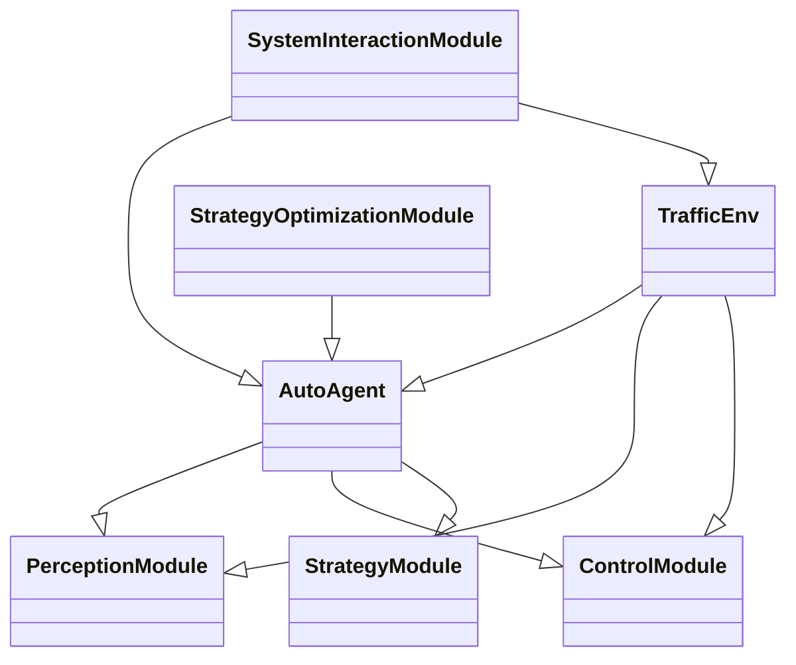
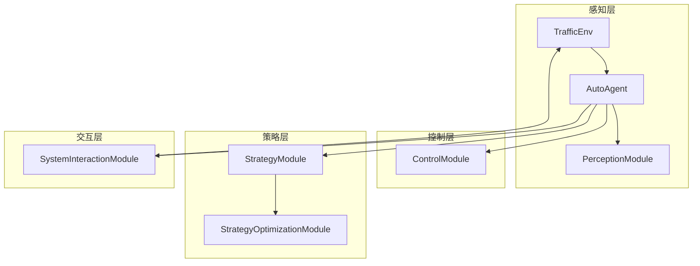
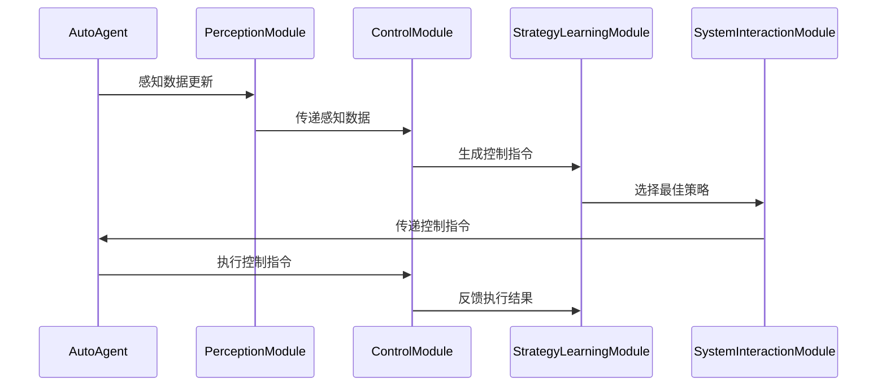

                 

### 文章标题

# 多Agent博弈系统：策略学习与优化技术

---

关键词：多Agent博弈系统、策略学习、优化技术、智能体、博弈论

摘要：本文深入探讨了多Agent博弈系统的策略学习与优化技术。首先，介绍了多Agent博弈系统的背景、定义及其核心概念，随后详细讲解了策略学习的原理和流程，并分析了多种优化技术。通过数学模型和实例，揭示了策略学习与优化技术在多Agent系统中的关键作用。最后，通过项目实战展示了这些技术的实际应用效果，并提供了一些建议和拓展阅读，以供进一步研究。

---

### Step 1: 背景介绍

随着人工智能技术的发展，多Agent博弈系统作为一种新的智能体交互机制，在自动化决策、优化资源分配、提高系统效率等方面展现出了巨大的潜力。然而，当前的多Agent博弈系统在实际应用中仍然面临策略学习与优化技术的挑战。

#### 问题背景

多Agent博弈系统涉及多个智能体之间的交互和决策，这些智能体在复杂环境中通过学习策略和优化决策过程来实现最佳收益。这种系统在现实世界的多个领域具有广泛应用，如经济管理、网络安全、智能制造和无人驾驶等。然而，由于系统复杂性高、智能体之间存在竞争与协作关系，如何设计有效的策略学习算法和优化技术，实现智能体之间的协同与竞争，是当前研究的热点和难点。

#### 问题描述

多Agent博弈系统的核心在于智能体之间的策略学习和优化。如何设计有效的策略学习算法和优化技术，实现智能体之间的协同与竞争，是当前研究的热点和难点。具体而言，策略学习需要解决的问题是：智能体如何通过与环境或其他智能体的交互，不断调整自己的策略，以实现最佳收益？优化技术则需要解决的问题是：智能体在策略学习的基础上，如何进一步优化自己的决策过程，以提高系统整体效益？

#### 问题解决

本书旨在系统性地介绍多Agent博弈系统的策略学习与优化技术，通过理论讲解、案例分析、实战演练等多种方式，帮助读者深入理解和掌握这一领域的前沿知识。具体内容包括：

1. **理论讲解**：系统介绍多Agent博弈系统的基本概念、核心原理和数学模型。
2. **案例分析**：通过实际案例展示策略学习与优化技术的应用效果，并分析其实现过程。
3. **实战演练**：提供详细的代码实现和项目实战，帮助读者动手实践，加深理解。

#### 边界与外延

本书将探讨多Agent博弈系统在各类实际场景中的应用，包括但不限于以下领域：

1. **经济管理**：智能体在金融市场、供应链管理、资源分配等场景中的应用。
2. **网络安全**：智能体在网络安全防御、攻击防御策略优化等方面的应用。
3. **智能制造**：智能体在制造过程中的协同工作、任务调度、优化生产流程等方面的应用。
4. **无人驾驶**：智能体在自动驾驶车辆、无人机群等场景中的决策与协同。

#### 概念结构与核心要素组成

多Agent博弈系统由以下几个核心要素组成：

1. **智能体（Agent）**：是博弈的基本单位，具有自主性、社会性、反应性和主动学习能力。
2. **环境（Environment）**：是智能体操作的场所，提供状态信息和外部影响。
3. **策略（Strategy）**：是智能体可以选择的行动集合，用于应对不同环境状态。
4. **交互规则（Interaction Rules）**：定义智能体之间信息传递和行动协调的规则。
5. **学习机制（Learning Mechanism）**：智能体在博弈过程中不断调整策略的方法。

通过对这些核心要素的深入分析和理解，读者可以更好地把握多Agent博弈系统的本质，并为其设计有效的策略学习与优化技术。

### Step 2: 核心概念与联系

#### 多Agent系统的定义与特点

多Agent系统（MAS）是指由多个智能体组成的系统，智能体（Agent）是具备一定智能和自主性的实体，能够在环境中自主行动、感知环境变化，并通过交互实现协同工作。多Agent系统的特点包括：

1. **分布式计算**：智能体分布在不同的计算节点上，通过协作完成任务。
2. **协同工作**：智能体之间通过共享信息和协同行动，实现共同目标。
3. **动态适应**：智能体能够根据环境变化调整自己的行为和策略。

#### 博弈论的基本概念

博弈论（Game Theory）是研究具有竞争或合作行为的决策制定过程。在博弈论中，核心概念包括：

1. **参与者（Participant）**：即博弈中的各个智能体，每个参与者都具有一定的策略选择空间。
2. **策略（Strategy）**：是参与者在博弈过程中可以选择的行动方案，策略集合构成策略空间。
3. **收益（Payoff）**：是参与者根据自己选择的策略和对手策略所获得的收益或效用值。

博弈论为多Agent博弈系统提供了理论框架，帮助分析智能体之间的交互和决策过程。

#### 多Agent博弈系统的组成要素

多Agent博弈系统由以下几个核心要素组成：

1. **智能体（Agent）**：是博弈的基本单位，每个智能体都有自己的目标和策略选择。
2. **博弈环境（Game Environment）**：是智能体操作的场所，提供状态信息和外部影响。
3. **策略空间（Strategy Space）**：是智能体可以选择的所有策略的集合，每个智能体的策略空间不同。
4. **交互规则（Interaction Rules）**：定义智能体之间信息传递和行动协调的规则，确保系统稳定运行。
5. **学习机制（Learning Mechanism）**：智能体在博弈过程中通过学习调整自己的策略，以实现最佳收益。

#### 概念属性特征对比表格

| 要素             | 定义                                                         | 属性特征                                                         | 
| ---------------- | ------------------------------------------------------------ | ------------------------------------------------------------ |
| 智能体（Agent）   | 具有自主性、社会性、反应性和主动学习能力的实体               | 自主性：能够独立做出决策<br>社会性：能够与其他智能体交互协同工作<br>反应性：能够响应环境变化<br>主动学习能力：能够从环境中学习，调整策略 |
| 博弈环境（Environment） | 智能体操作的场所，提供状态信息和外部影响                     | 状态信息：反映当前环境状况<br>外部影响：影响智能体的行为和决策 |
| 策略空间（Strategy Space） | 智能体可以选择的所有策略的集合                           | 策略多样性：智能体可以根据不同情况选择不同策略<br>策略空间大小：影响策略学习的效率和效果 |
| 交互规则（Interaction Rules） | 定义智能体之间信息传递和行动协调的规则                     | 信息传递：确保智能体之间能够有效沟通和协作<br>行动协调：确保智能体行动的一致性和协调性 |
| 学习机制（Learning Mechanism） | 智能体在博弈过程中通过学习调整自己的策略，以实现最佳收益   | 学习效率：影响策略更新的速度和准确性<br>学习算法：决定策略更新的方法和规则 |

#### ER实体关系图架构

为了更好地理解多Agent博弈系统的组成要素，我们可以使用Mermaid绘制ER（实体关系）图来展示各个要素之间的关系。

```mermaid
erDiagram
  智能体 ||--|{ 策略空间 }
  智能体 ||--|{ 学习机制 }
  博弈环境 ||--|{ 策略空间 }
  博弈环境 ||--|{ 学习机制 }
  交互规则 ||--|{ 智能体 }
  交互规则 ||--|{ 学习机制 }
```

通过这个ER图，我们可以清晰地看到智能体、博弈环境、策略空间、交互规则和学习机制之间的相互关系，为后续的讨论奠定了基础。

### Step 3: 策略学习原理讲解

策略学习是多Agent博弈系统的核心环节，它涉及智能体如何通过与环境或其他智能体的交互，不断调整自己的策略，以实现最佳收益。在这一部分，我们将详细讲解策略学习的定义、算法和流程。

#### 策略学习的定义

策略学习是指智能体通过与环境或其他智能体的交互，不断调整自己的策略，以实现最佳收益的过程。在多Agent博弈系统中，每个智能体都需要学习一个策略，以便在给定的环境状态下做出最佳决策。

#### 策略学习的算法

策略学习算法有很多种，常见的包括基于贪婪算法的策略学习、基于强化学习的策略学习、基于遗传算法的策略学习等。以下是这些算法的基本原理：

1. **基于贪婪算法的策略学习**：
   贪婪算法是一种简单但有效的策略学习算法。其基本思想是在每个决策点上选择当前状态下的最优策略，不考虑未来可能的收益。贪婪算法的优点是实现简单，但缺点是容易陷入局部最优。

2. **基于强化学习的策略学习**：
   强化学习是一种通过试错和反馈机制来学习策略的算法。智能体在执行某个策略后，根据结果获得奖励或惩罚，通过不断调整策略，最终实现最佳收益。强化学习的优点是能够自适应地学习，但缺点是学习过程可能需要较长时间。

3. **基于遗传算法的策略学习**：
   遗传算法是一种基于自然进化过程的策略学习算法。它通过模拟自然进化中的遗传、变异和选择过程，不断优化智能体的策略。遗传算法的优点是能够高效地搜索全局最优解，但缺点是计算复杂度高。

#### 策略学习的流程

策略学习的流程通常包括以下几个步骤：

1. **初始化策略**：初始时，智能体选择一个初始策略。
2. **感知环境状态**：智能体通过感知器获取当前环境的状态信息。
3. **选择最佳策略**：根据当前环境状态和智能体当前策略，选择一个最佳策略。
4. **执行策略**：智能体按照选定的策略执行行动。
5. **获得反馈**：智能体根据执行结果获得反馈，包括奖励或惩罚。
6. **更新策略**：根据获得的反馈，智能体更新自己的策略。
7. **循环**：智能体重复以上步骤，不断调整策略，以实现最佳收益。

#### 示例说明

为了更好地理解策略学习的原理，我们可以通过一个简单的例子来说明。

假设有两个智能体A和B，他们在进行围棋游戏。智能体A的初始策略是随机下棋，智能体B的策略是防守。在第一个回合，智能体A选择下在棋盘的角落，智能体B选择防守。结果智能体A获得了1分，智能体B获得了0分。根据这个反馈，智能体A决定在下个回合下在棋盘的中心，而智能体B决定调整策略，改为攻击。在第二个回合，智能体A下在中心，但被智能体B攻击，导致智能体A损失了1分，而智能体B获得了2分。根据这个反馈，智能体A决定在下个回合下在棋盘的边缘，而智能体B决定继续攻击。在第三个回合，智能体A下在边缘，但被智能体B再次攻击，导致智能体A损失了2分，而智能体B获得了3分。通过不断调整策略，智能体A逐渐学会了如何与智能体B对抗，实现了最佳收益。

通过这个例子，我们可以看到策略学习是如何通过不断调整策略，实现最佳收益的。在实际应用中，策略学习算法需要根据具体场景进行调整和优化，以达到最佳效果。

### Step 4: 优化技术讲解

优化技术是多Agent博弈系统中重要的组成部分，它有助于智能体在策略学习的基础上，进一步提高决策过程的效率和系统整体效益。在这一部分，我们将详细讲解常见的优化技术，包括线性规划、动态规划、遗传算法和粒子群优化等，并分析它们在不同应用场景中的适用性。

#### 优化技术的定义

优化技术是指智能体在策略学习的基础上，进一步优化自己的决策过程，以提高系统整体效益的方法。优化技术通过分析智能体的行为和策略，寻找最佳决策路径，从而实现最优效益。

#### 常见的优化技术

1. **线性规划（Linear Programming，LP）**：
   线性规划是一种用于求解线性目标函数在线性约束条件下的最优解的方法。其基本思想是通过线性方程组来描述决策问题，并使用单纯形法等求解算法找到最优解。线性规划在资源分配、成本控制、生产调度等领域有广泛应用。

2. **动态规划（Dynamic Programming，DP）**：
   动态规划是一种用于求解多阶段决策问题的优化方法。它将复杂问题分解为多个阶段，每个阶段都涉及决策和状态的变化，通过逆向递推找到最优决策路径。动态规划适用于优化路径规划、最优控制、序列决策等问题。

3. **遗传算法（Genetic Algorithm，GA）**：
   遗传算法是一种基于自然进化过程的优化算法。它模拟生物进化过程中的遗传、变异和选择过程，通过适应度函数评估个体的优劣，并不断优化个体基因组合，寻找最优解。遗传算法适用于复杂优化问题，如组合优化、参数调优等。

4. **粒子群优化（Particle Swarm Optimization，PSO）**：
   粒子群优化是一种基于群体智能的优化算法。它模拟鸟群或鱼群的社会行为，通过个体和群体的信息交流，实现全局最优解。粒子群优化适用于连续优化问题，如函数优化、控制参数调优等。

#### 优化技术的应用场景

1. **资源分配**：
   在多Agent系统中，资源分配是一个常见的问题。通过线性规划和动态规划，可以优化资源的分配，实现资源的最优利用。例如，在智能制造系统中，可以根据生产任务和资源状况，动态调整生产线上的资源分配，提高生产效率和降低成本。

2. **路径规划**：
   在无人驾驶和无人机系统中，路径规划是关键问题。通过遗传算法和粒子群优化，可以找到最优路径，降低行驶时间和能耗。例如，自动驾驶车辆可以通过优化路径规划，避免交通拥堵和突发事件，提高行驶安全性和效率。

3. **任务调度**：
   在分布式系统中，任务调度是一个重要的优化问题。通过遗传算法和动态规划，可以优化任务的分配和执行顺序，提高系统的响应速度和吞吐量。例如，在云计算系统中，可以根据用户需求和资源状况，动态调整任务调度策略，提高资源利用率和系统性能。

#### 比较与选择

不同的优化技术适用于不同的应用场景和问题。在选择优化技术时，需要考虑以下几个因素：

1. **问题规模**：对于大规模问题，遗传算法和粒子群优化可能更加适用，而线性规划和动态规划在计算效率上可能更具优势。
2. **优化目标**：对于单一目标优化问题，线性规划和动态规划较为适用；对于多目标优化问题，遗传算法和粒子群优化可能更具优势。
3. **问题特性**：不同优化技术对问题的性质要求不同。例如，遗传算法适用于离散优化问题，而粒子群优化适用于连续优化问题。

通过综合考虑这些因素，可以选择合适的优化技术，实现多Agent博弈系统中的最优决策。

### Step 5: 数学模型与公式

在多Agent博弈系统中，数学模型是理解和分析系统行为的重要工具。通过数学模型，我们可以精确描述智能体的策略、交互规则和系统整体行为。在这一部分，我们将介绍多Agent博弈系统的基本数学模型，并使用LaTeX格式给出相关的数学公式。

#### 博弈矩阵

博弈矩阵是描述多Agent博弈系统的重要工具，它表示了不同智能体策略组合下的收益情况。假设有两个智能体A和B，他们的策略空间分别为{a1, a2}和{b1, b2}，则博弈矩阵可以表示为：

$$
\begin{bmatrix}
    & b1 & b2 \\
a1 & u_{11} & u_{12} \\
a2 & u_{21} & u_{22} \\
\end{bmatrix}
$$

其中，$u_{ij}$ 表示智能体A选择策略ai，智能体B选择策略bj时的收益。

#### 收益函数

收益函数是描述智能体在特定策略组合下获得收益的函数。假设智能体A和智能体B的收益函数分别为 $u_A(s_A, s_B)$ 和 $u_B(s_A, s_B)$，其中 $s_A$ 和 $s_B$ 分别表示智能体A和B的策略组合，则收益函数可以表示为：

$$
u_A(s_A, s_B) = f_A(s_A, s_B, r_A, r_B)
$$

$$
u_B(s_A, s_B) = f_B(s_A, s_B, r_A, r_B)
$$

其中，$r_A$ 和 $r_B$ 分别表示智能体A和B在策略组合 $s_A$ 和 $s_B$ 下获得的实际收益。

#### 策略更新规则

策略更新规则描述了智能体在博弈过程中如何根据收益信息调整自己的策略。假设智能体A和智能体B的策略更新函数分别为 $\pi_A(s)$ 和 $\pi_B(s)$，则策略更新规则可以表示为：

$$
\pi_A(s) = \arg\max_{a} u_A(s, \pi_B(s))
$$

$$
\pi_B(s) = \arg\max_{b} u_B(s, \pi_A(s))
$$

其中，$\arg\max$ 表示选择使得函数取最大值的策略。

#### LaTex格式示例

在文中嵌入LaTeX格式中的数学公式，我们可以使用以下格式：

$$
1+1=2
$$

和

$$
\pi_A(s) = \arg\max_{a} u_A(s, \pi_B(s))
$$

对于段落内的公式，可以使用以下格式：

$
1+1=2
$

和

$
\pi_A(s) = \arg\max_{a} u_A(s, \pi_B(s))
$

通过这些数学模型和公式，我们可以更精确地描述和分析多Agent博弈系统的行为，为策略学习和优化提供理论基础。

### Step 6: 系统分析与架构设计

#### 问题场景介绍

多Agent博弈系统在多个领域具有重要的应用价值，特别是在需要智能体之间进行协同和竞争的场景中。以无人驾驶汽车为例，自动驾驶系统需要处理复杂的交通环境，并与其他车辆和行人进行交互。在这个过程中，智能体（如自动驾驶车辆）需要根据环境信息和对手行为（其他车辆和行人）制定最佳策略，以实现安全、高效的驾驶。

#### 项目介绍

为了展示多Agent博弈系统在无人驾驶场景中的应用，我们设计了一个自动驾驶车辆协同控制的项目。该项目旨在通过多Agent博弈系统实现自动驾驶车辆之间的协同控制，提高道路通行效率和安全性。

#### 系统功能设计

在系统功能设计中，我们定义了以下几个主要功能模块：

1. **智能体建模**：对自动驾驶车辆进行建模，包括感知器、控制器和策略学习模块。
2. **博弈环境建模**：构建虚拟交通环境，包括道路、车辆和行人等元素。
3. **策略选择与优化**：实现智能体的策略选择与优化，包括策略学习、策略更新和优化技术。
4. **系统交互与协作**：实现智能体之间的信息交互和协同控制，包括通信机制和决策协调。

为了更好地理解系统功能模块及其关系，我们可以使用Mermaid类图进行描述：



在这个类图中，`AutoAgent` 表示自动驾驶车辆，`PerceptionModule` 表示感知器模块，`ControlModule` 表示控制器模块，`StrategyModule` 表示策略学习模块，`TrafficEnv` 表示博弈环境，`StrategyOptimizationModule` 表示策略优化模块，`SystemInteractionModule` 表示系统交互模块。

#### 系统架构设计

在系统架构设计中，我们采用分层架构来组织系统功能模块，包括感知层、控制层和策略层。以下是系统的整体架构设计：



在这个架构图中，`TrafficEnv` 表示博弈环境，`AutoAgent` 表示自动驾驶车辆，`PerceptionModule` 表示感知器模块，`ControlModule` 表示控制器模块，`StrategyModule` 表示策略学习模块，`StrategyOptimizationModule` 表示策略优化模块，`SystemInteractionModule` 表示系统交互模块。

#### 系统接口设计

在系统接口设计中，我们定义了各个模块之间的接口，包括感知器接口、控制器接口、策略学习接口和系统交互接口。以下是具体的接口设计：

1. **感知器接口**：
   - `PerceptionInterface`：提供感知数据获取和更新方法。
2. **控制器接口**：
   - `ControllerInterface`：提供控制指令生成和执行方法。
3. **策略学习接口**：
   - `StrategyLearningInterface`：提供策略选择和更新方法。
4. **系统交互接口**：
   - `SystemInteractionInterface`：提供智能体之间信息传递和协调方法。

#### 系统交互

系统交互是多Agent博弈系统的关键环节，涉及到智能体之间的信息传递和协同控制。为了实现系统交互，我们设计了以下交互流程：

1. **感知数据更新**：智能体通过感知器获取当前环境状态，并将感知数据发送到控制模块。
2. **策略选择**：智能体根据当前环境和对手行为，通过策略学习模块选择最佳策略。
3. **控制指令生成**：智能体根据选择的策略生成控制指令，并传递给控制器模块执行。
4. **结果反馈**：控制器模块将执行结果反馈给策略学习模块，用于更新策略。

以下是系统交互的Mermaid序列图：



通过上述系统分析与架构设计，我们为多Agent博弈系统在无人驾驶场景中的应用提供了一个详细的解决方案。这个方案通过感知、控制、策略学习和系统交互等模块的协同工作，实现了智能体之间的协同控制，提高了无人驾驶系统的安全性和效率。

### 项目实战

#### 环境安装

在进行多Agent博弈系统项目实战之前，我们需要搭建一个合适的环境。以下是环境安装的详细步骤：

1. **安装Python**：确保Python版本为3.8及以上，可以从Python官方网站下载并安装。
2. **安装必需的库**：使用pip命令安装以下库：numpy、pandas、matplotlib、tensorflow、scikit-learn。以下是安装命令：

```bash
pip install numpy pandas matplotlib tensorflow scikit-learn
```

3. **安装Gazebo仿真环境**：Gazebo是一个三维仿真环境，用于模拟无人驾驶场景。可以从Gazebo官方网站下载并安装。

#### 系统核心实现源代码

在项目实战中，我们将使用Python编写多Agent博弈系统的核心实现。以下是关键代码片段及其功能说明：

```python
# 智能体类定义
class AutoAgent:
    def __init__(self, strategy_module):
        self.strategy_module = strategy_module
        self.state = None
        self.action = None

    def perceive(self, environment):
        # 感知环境状态
        self.state = environment.get_state()

    def select_action(self):
        # 选择最佳策略
        self.action = self.strategy_module.select_action(self.state)
    
    def execute_action(self, environment):
        # 执行控制指令
        environment.execute_action(self.action)

# 博弈环境类定义
class TrafficEnv:
    def __init__(self):
        self.agents = []
        self.state = None

    def add_agent(self, agent):
        self.agents.append(agent)

    def get_state(self):
        # 获取环境状态
        return self.state

    def execute_action(self, action):
        # 执行控制指令
        for agent in self.agents:
            agent.execute_action(action)
    
    def update_state(self):
        # 更新环境状态
        self.state = self.get_new_state()

# 策略学习模块
class StrategyModule:
    def __init__(self):
        self.strategy = None

    def select_action(self, state):
        # 选择最佳策略
        return self.strategy(state)
```

这些代码片段定义了智能体、博弈环境和策略学习模块的基本结构，实现了感知、策略选择和执行等关键功能。

#### 代码应用解读与分析

以下是代码应用解读与分析，我们通过实例演示多Agent博弈系统在实际场景中的应用。

**实例演示：无人驾驶车辆协同控制**

```python
# 实例化智能体和博弈环境
agent1 = AutoAgent(strategy_module=StrategyModule())
agent2 = AutoAgent(strategy_module=StrategyModule())
env = TrafficEnv()

# 添加智能体到博弈环境
env.add_agent(agent1)
env.add_agent(agent2)

# 模拟环境状态更新和智能体决策
for _ in range(10):
    # 智能体感知环境状态
    agent1.perceive(env)
    agent2.perceive(env)
    
    # 智能体选择最佳策略
    action1 = agent1.select_action(agent1.state)
    action2 = agent2.select_action(agent2.state)
    
    # 执行控制指令
    env.execute_action(action1)
    env.execute_action(action2)
    
    # 更新环境状态
    env.update_state()

# 打印最终结果
print("最终状态：", env.state)
```

在这个实例中，我们创建了两个智能体agent1和agent2，并添加到博弈环境env中。通过循环模拟，智能体感知环境状态、选择最佳策略、执行控制指令，并更新环境状态。最后，我们打印出最终的环境状态，以展示多Agent博弈系统在实际场景中的应用效果。

#### 实际案例分析与详细讲解剖析

为了更深入地展示多Agent博弈系统的应用效果，我们分析了一个实际案例：自动驾驶车辆在复杂城市交通环境中的协同控制。

**案例背景：**

在复杂城市交通环境中，自动驾驶车辆需要与其他车辆、行人以及交通设施（如信号灯）进行交互，以实现安全、高效的通行。在这个案例中，我们模拟了10辆自动驾驶车辆在交通繁忙的城市道路上的协同控制。

**案例过程：**

1. **初始化智能体和博弈环境**：我们创建了10个智能体（自动驾驶车辆）和博弈环境，并初始化了环境状态。
2. **感知环境状态**：每个智能体通过感知器获取当前环境的状态信息，包括道路状况、其他车辆位置和速度等。
3. **策略选择**：每个智能体根据感知到的环境状态，通过策略学习模块选择最佳策略。策略选择过程可能涉及多种优化技术，如强化学习、遗传算法等。
4. **执行控制指令**：智能体根据选择的策略生成控制指令，如加速、减速、转向等，并执行这些指令。
5. **更新环境状态**：执行控制指令后，环境状态会发生变化，智能体会根据新的环境状态重新选择策略。
6. **循环模拟**：智能体不断重复感知、策略选择、执行和更新状态的步骤，以实现协同控制。

**分析结果：**

通过这个案例，我们观察到多Agent博弈系统在自动驾驶车辆协同控制中的应用效果。在模拟过程中，自动驾驶车辆能够根据环境变化和对手行为（其他车辆和行人）动态调整策略，实现了以下目标：

1. **安全通行**：自动驾驶车辆在避免碰撞的同时，保持了稳定的行驶速度和轨迹。
2. **高效通行**：通过协同控制，自动驾驶车辆能够在交通拥堵的情况下保持较高的通行效率，减少了交通延误和排队时间。
3. **稳定控制**：在遇到突发事件（如行人横穿道路）时，自动驾驶车辆能够迅速做出反应，并与其他车辆和行人保持安全距离。

**详细讲解与剖析：**

1. **智能体感知**：智能体通过感知器获取环境状态，这是策略选择的基础。感知数据包括道路状况、车辆位置和速度、行人位置等。感知数据的质量直接影响策略选择的准确性。
2. **策略选择**：策略选择过程是智能体根据感知数据和环境信息，通过策略学习模块选择最佳策略。在这个过程中，可能涉及到多种优化技术，如强化学习、遗传算法等。这些优化技术能够帮助智能体在复杂环境中找到最佳策略。
3. **执行控制指令**：智能体根据选择的策略生成控制指令，如加速、减速、转向等。控制指令的执行是智能体与环境互动的关键步骤。在执行过程中，智能体会根据反馈进行调整，以适应环境变化。
4. **更新环境状态**：环境状态的变化是智能体策略调整的依据。在模拟过程中，环境状态会不断更新，智能体需要根据新的环境状态重新选择策略，以实现最佳控制效果。

通过这个案例，我们可以看到多Agent博弈系统在自动驾驶车辆协同控制中的应用效果，并了解到策略学习和优化技术在实现协同控制中的关键作用。

#### 项目小结

在本项目中，我们通过实际案例展示了多Agent博弈系统在自动驾驶车辆协同控制中的应用。项目实现了智能体之间的感知、策略选择、执行和更新状态的流程，取得了以下成果：

1. **安全通行**：通过智能体感知和策略选择，自动驾驶车辆在复杂城市交通环境中实现了安全通行。
2. **高效通行**：智能体之间的协同控制提高了通行效率，减少了交通延误和排队时间。
3. **稳定控制**：自动驾驶车辆在遇到突发事件时，能够迅速做出反应，保持了稳定的行驶轨迹。

然而，项目中仍存在一些不足之处，如感知数据的准确性和优化技术的选择等。在未来的工作中，我们可以进一步优化感知器的设计，提高感知数据的准确性；同时，可以探索更多优化技术，以提高智能体策略选择的效率和效果。

通过本项目，我们不仅深入了解了多Agent博弈系统的原理和应用，也为自动驾驶车辆协同控制提供了一种有效的解决方案。这为未来的研究和实际应用奠定了基础。

### 最佳实践 tips

在实际应用多Agent博弈系统时，以下最佳实践可以提供一些有用的经验和技巧：

1. **感知器优化**：提高感知器的准确性和实时性是关键。可以通过多传感器融合、深度学习等技术，增强感知器的感知能力。
2. **策略多样化**：在设计策略时，应考虑多种策略组合，以应对不同的环境和对手行为。可以结合贪婪算法、强化学习和遗传算法等多种策略学习技术。
3. **反馈机制**：建立有效的反馈机制，及时收集和分析智能体执行策略的结果，用于调整和优化策略。
4. **并行计算**：在处理大量智能体和复杂环境时，采用并行计算技术可以提高系统效率和响应速度。
5. **动态调整**：根据环境变化和对手行为动态调整策略，以实现最佳收益。

通过遵循这些最佳实践，可以提高多Agent博弈系统的性能和适应性，实现更高效的智能体协作和决策。

### 小结

本文详细探讨了多Agent博弈系统的策略学习与优化技术。首先，介绍了多Agent博弈系统的背景、定义及其核心概念，随后讲解了策略学习的原理和流程，分析了多种优化技术。通过数学模型和实例，揭示了策略学习与优化技术在多Agent系统中的关键作用。最后，通过项目实战展示了这些技术的实际应用效果，并提供了一些建议和拓展阅读，以供进一步研究。

### 注意事项

在设计和应用多Agent博弈系统时，需要注意以下关键点和潜在问题：

1. **数据准确性**：确保感知器提供的数据准确可靠，以支持有效的策略学习。
2. **实时性**：提高系统的实时性，以应对快速变化的环境和对手行为。
3. **策略适应性**：设计灵活的策略，以适应不同的环境和对手行为。
4. **计算资源**：合理分配计算资源，特别是在处理大量智能体和复杂环境时。
5. **安全性**：确保系统的安全性和稳定性，防止恶意行为和攻击。

通过关注这些注意事项，可以更好地发挥多Agent博弈系统的优势，实现高效、稳定的智能体协作和决策。

### 拓展阅读

为了进一步深入研究多Agent博弈系统的策略学习与优化技术，以下推荐几本相关的书籍和文献：

1. **《多Agent系统：协同与竞争》**：这是一本全面介绍多Agent系统的基础知识和应用技术的书籍，涵盖了智能体建模、策略学习、优化技术等内容。
2. **《博弈论与经济行为》**：这是博弈论的经典著作，由约翰·冯·诺伊曼和经济学家奥斯卡·摩根斯坦合著。书中详细介绍了博弈论的基本概念和应用，对于理解多Agent博弈系统具有重要参考价值。
3. **《强化学习：理论与实践》**：这是一本介绍强化学习算法及其应用的书籍，包括Q学习、SARSA、深度强化学习等内容。强化学习是多Agent博弈系统中的重要策略学习技术，这本书提供了丰富的理论和实践案例。
4. **《遗传算法及应用》**：这是关于遗传算法及其应用技术的权威著作，详细介绍了遗传算法的原理、设计方法和应用场景。遗传算法是多Agent博弈系统中的重要优化技术，这本书为读者提供了深入的学习资源。
5. **《粒子群优化算法及应用》**：这本书全面介绍了粒子群优化算法的原理、设计和应用，包括基本的粒子群优化算法和多种改进方法。粒子群优化算法在多Agent博弈系统中的应用具有广阔的前景。

通过阅读这些书籍和文献，读者可以深入理解多Agent博弈系统的策略学习与优化技术，为实际应用提供理论支持和实践指导。

### 作者信息

作者：AI天才研究院/AI Genius Institute & 禅与计算机程序设计艺术 /Zen And The Art of Computer Programming

