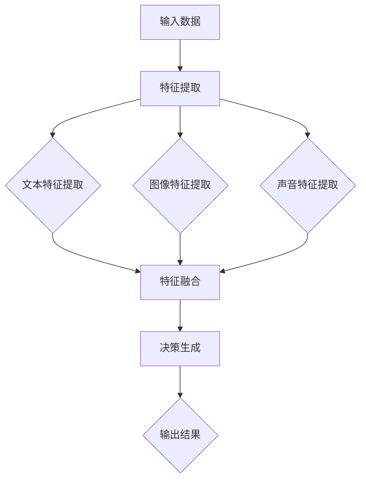
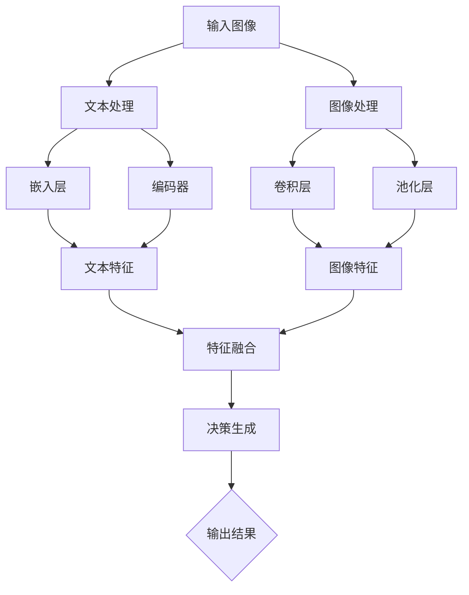
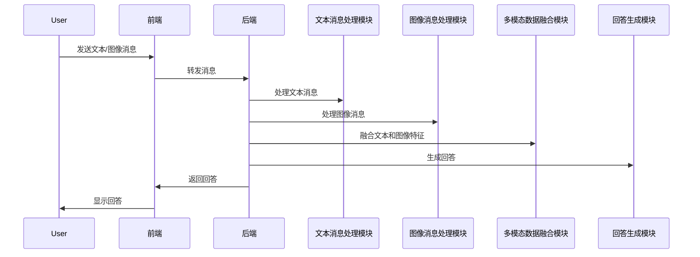
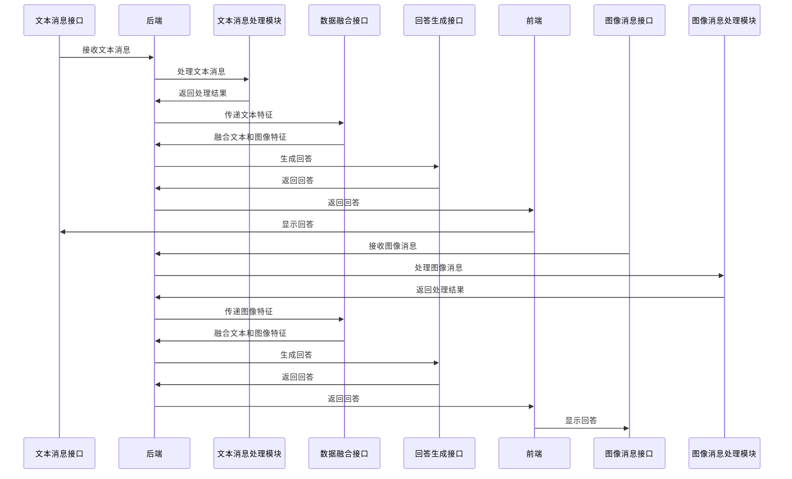
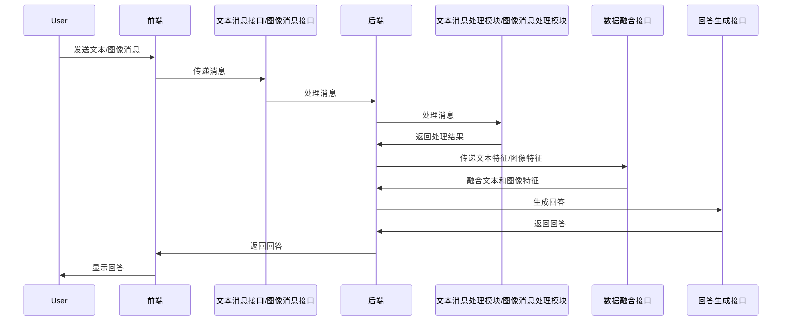
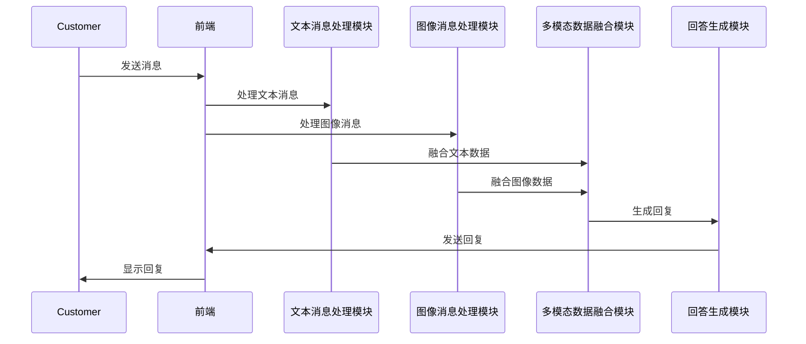
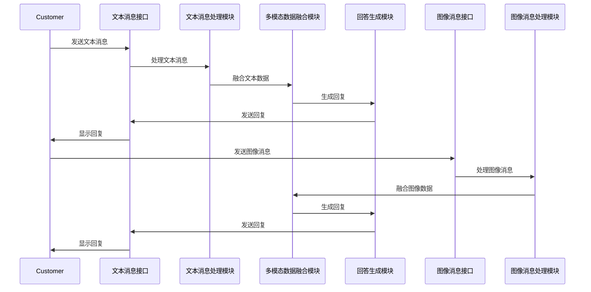

                 


# 多模态AI Agent：整合LLM与计算机视觉的最佳实践

关键词：多模态AI Agent, LLM, 计算机视觉, 融合算法, 实战

摘要：本文介绍了多模态AI Agent的概念、原理以及最佳实践。通过整合语言模型（LLM）与计算机视觉技术，多模态AI Agent可以在多种复杂场景中发挥重要作用。本文将详细分析多模态AI Agent的算法原理、系统架构设计，并分享项目实战经验和最佳实践。

----------------------------------------------------------------
## 第一部分: 背景介绍

### 1.1 问题背景

在人工智能领域，多模态AI Agent是一个备受关注的研究方向。随着深度学习技术的快速发展，计算机视觉和自然语言处理（NLP）已经取得了显著的进展。然而，传统的方法往往只能处理单一模态的数据，如文本或图像。多模态AI Agent旨在整合多种数据模态，如文本、图像、声音等，以实现更全面和智能的感知和理解能力。

**核心概念术语说明**

- 多模态AI Agent：一种能够整合多种数据模态（如文本、图像、声音等）进行感知和决策的人工智能系统。
- 语言模型（LLM）：一种能够处理自然语言文本的深度学习模型。
- 计算机视觉：一门研究如何使计算机从图像或视频中理解场景和物体的学科。

**问题背景**

随着人类社会的信息化和数字化程度的不断提高，人们对于人工智能的需求也在不断增长。传统的单一模态人工智能系统已经不能满足复杂应用场景的需求。例如，在医疗领域，医生需要同时处理患者的历史病历、图像报告和实验室检测结果，以做出准确的诊断。在自动驾驶领域，车辆需要同时处理来自摄像头、激光雷达和雷达的多种传感器数据，以实现安全驾驶。

### 1.2 问题描述

多模态AI Agent的研究旨在解决以下问题：

- 如何高效地整合多种数据模态，以提高人工智能系统的感知和理解能力？
- 如何设计多模态AI Agent的架构和算法，使其能够灵活地适应不同的应用场景？
- 如何保证多模态AI Agent的可解释性和可靠性？

**问题描述**

多模态AI Agent需要同时处理来自不同模态的数据，如文本、图像和声音等。因此，如何将这些数据有效地整合起来，并使AI Agent能够灵活地适应不同的应用场景，是一个关键的问题。此外，多模态AI Agent的可解释性和可靠性也是需要重点关注的问题。

### 1.3 问题解决

为了解决上述问题，研究者们提出了一系列的方法和算法，包括：

- 多模态特征提取：通过结合不同模态的数据特征，实现更全面的数据表示。
- 多模态融合：通过设计有效的融合策略，将不同模态的数据整合起来，以提高系统的整体性能。
- 多任务学习：通过同时学习多个任务，提高模型对多种数据模态的适应性。

**问题解决**

多模态AI Agent的研究涉及多个领域，如计算机视觉、自然语言处理、机器学习等。它不仅关注算法的研究，还涉及应用场景的探索。

### 1.4 边界与外延

多模态AI Agent的研究涉及多个领域，如计算机视觉、自然语言处理、机器学习等。它不仅关注算法的研究，还涉及应用场景的探索。因此，多模态AI Agent的研究边界和外延非常广泛，涵盖了从基础算法到实际应用的各种方面。

**边界与外延**

多模态AI Agent的研究包括以下几个方面：

- 算法研究：研究如何有效地提取和整合多模态数据特征，设计融合算法。
- 应用研究：探索多模态AI Agent在不同领域（如医疗、自动驾驶、智能家居等）的应用。
- 系统设计与实现：研究多模态AI Agent的系统架构、接口设计和实现方法。

### 1.5 概念结构与核心要素组成

多模态AI Agent的核心概念包括多模态数据、特征提取、融合算法和决策模块。以下是一个简单的概念结构与核心要素组成的ER实体关系图架构：

```mermaid
erDiagram
  产品::产品类
  用户::用户类
  订单::订单类

  用户 ||--|{ 产品 }|| 购买
  用户 ||--|{ 订单 }|| 下单
  产品 ||--|{ 订单 }|| 销售额
```

**概念结构与核心要素组成**

- 多模态数据：包括文本、图像、声音等。
- 特征提取：从多模态数据中提取有效特征。
- 融合算法：将不同模态的数据特征整合起来。
- 决策模块：根据整合后的数据特征做出决策。

----------------------------------------------------------------
## 第二部分: 核心概念与联系

### 2.1 多模态AI Agent的定义

多模态AI Agent是一种能够处理和整合多种数据模态（如文本、图像、声音等）进行感知、理解和决策的人工智能系统。与传统单一模态的AI系统相比，多模态AI Agent具有更广泛的应用场景和更高的感知能力。

**多模态AI Agent的概念**

多模态AI Agent的核心在于能够同时处理和整合来自不同模态的数据。例如，一个多模态AI Agent可以同时接收图像、文本和声音等多模态数据，并综合这些数据进行决策。

**多模态AI Agent的特点**

- **感知能力更强**：能够处理和整合多种模态的数据，使AI系统具有更全面的感知能力。
- **适应性强**：能够适应多种不同的应用场景，如医疗、自动驾驶、智能家居等。
- **灵活性高**：可以根据不同的任务需求和数据类型，灵活地调整和优化算法。

**多模态AI Agent与传统AI的区别**

- **处理数据模态**：传统AI系统通常只能处理单一模态的数据（如文本或图像），而多模态AI Agent能够同时处理多种模态的数据。
- **应用场景**：传统AI系统适用于特定领域或任务，而多模态AI Agent具有更广泛的应用场景和适应性。
- **算法复杂性**：多模态AI Agent的算法设计通常更复杂，需要考虑如何整合和处理多种模态的数据。

### 2.2 LLM与计算机视觉的联系

语言模型（LLM）和计算机视觉是人工智能领域中的重要分支。LLM主要用于处理自然语言文本，而计算机视觉则关注图像和视频的处理。将LLM与计算机视觉结合起来，可以极大地提升AI系统的感知和理解能力。

**LLM的基本概念**

语言模型（LLM）是一种基于深度学习的自然语言处理模型，它能够根据输入的文本数据生成相应的输出。常见的LLM有GPT、BERT等。

**计算机视觉的基本概念**

计算机视觉是一门研究如何使计算机从图像或视频中理解场景和物体的学科。它主要包括图像处理、目标检测、图像分割等任务。

**LLM与计算机视觉的整合优势**

- **更全面的感知能力**：通过整合LLM和计算机视觉，AI系统可以同时处理文本和图像数据，从而获得更全面的感知能力。
- **更复杂的任务处理**：多模态AI Agent可以处理更复杂的任务，如问答系统、图像分类、图像生成等。
- **更高的鲁棒性**：整合后的AI系统可以更好地应对不同模态数据的噪声和干扰。

### 2.3 核心概念属性特征对比表格

为了更好地理解多模态AI Agent、LLM和计算机视觉的联系，我们可以通过以下表格对比这些核心概念的属性特征：

| 核心概念     | 属性特征                               |
| --------- | ------------------------------------ |
| 多模态AI Agent | 多模态数据整合、感知能力强、适应性强、灵活性高 |
| LLM        | 处理自然语言文本、生成文本输出、基于深度学习   |
| 计算机视觉    | 处理图像和视频数据、图像处理、目标检测、图像分割 |

### 2.4 ER实体关系图架构

为了更直观地理解多模态AI Agent、LLM和计算机视觉的联系，我们可以通过以下ER实体关系图来展示这些核心概念之间的关联：

```mermaid
erDiagram
  AI系统 ||--|{ 多模态AI Agent }|| 继承
  AI系统 ||--|{ LLM }|| 继承
  AI系统 ||--|{ 计算机视觉 }|| 继承
  多模态AI Agent ||--|{ 文本处理 }|| 功能
  多模态AI Agent ||--|{ 图像处理 }|| 功能
  多模态AI Agent ||--|{ 声音处理 }|| 功能
  LLM ||--|{ 文本生成 }|| 功能
  计算机视觉 ||--|{ 图像分类 }|| 功能
  计算机视觉 ||--|{ 目标检测 }|| 功能
  计算机视觉 ||--|{ 图像分割 }|| 功能
```

**ER实体关系图架构**

- **AI系统**：表示整个人工智能系统的顶层概念。
- **多模态AI Agent**：继承自AI系统，代表多模态AI Agent的核心功能。
- **LLM**：继承自AI系统，代表语言模型的核心功能。
- **计算机视觉**：继承自AI系统，代表计算机视觉的核心功能。

通过上述核心概念与联系的分析，我们可以更好地理解多模态AI Agent、LLM和计算机视觉之间的内在联系，以及它们在人工智能系统中的重要性。

----------------------------------------------------------------
## 第三部分: 算法原理讲解

### 3.1 多模态AI Agent算法原理

多模态AI Agent算法的核心在于如何高效地整合多种数据模态，以提高人工智能系统的感知和理解能力。以下是对多模态AI Agent算法原理的详细讲解。

#### 3.1.1 算法的基本概念

多模态AI Agent算法是一种基于深度学习的算法，它通过整合来自不同模态的数据（如文本、图像、声音等），实现对复杂场景的全面感知和理解。

**多模态数据整合的基本概念**

多模态数据整合是指将来自不同模态的数据（如文本、图像、声音等）进行整合，以形成一种统一的数据表示。这种整合通常通过特征提取和融合策略实现。

#### 3.1.2 算法的数学模型和公式

多模态AI Agent算法的数学模型通常包括以下几个部分：

1. **特征提取**：

   - **文本特征提取**：使用预训练的语言模型（如BERT、GPT等）提取文本特征。
   - **图像特征提取**：使用卷积神经网络（CNN）提取图像特征。
   - **声音特征提取**：使用循环神经网络（RNN）提取声音特征。

2. **特征融合**：

   - **模式匹配**：将不同模态的特征进行匹配，以找到它们之间的关联性。
   - **加权融合**：根据不同模态的特征重要性，对它们进行加权融合。

3. **决策生成**：

   - **分类**：根据融合后的特征，对输入数据进行分类。
   - **回归**：根据融合后的特征，对输入数据进行回归预测。

#### 3.1.3 算法mermaid流程图

以下是多模态AI Agent算法的mermaid流程图：



#### 3.1.4 Python源代码详细阐述

以下是一个简单的Python源代码示例，用于实现多模态AI Agent算法：

```python
import torch
import torch.nn as nn
import torchvision.models as models
import torchtext.vocab as Vocab

# 文本特征提取
class TextExtractor(nn.Module):
    def __init__(self, embedding_dim, hidden_dim):
        super(TextExtractor, self).__init__()
        self.embedding = nn.Embedding(num_embeddings=10000, embedding_dim=embedding_dim)
        self.lstm = nn.LSTM(embedding_dim, hidden_dim, num_layers=2, batch_first=True)
        
    def forward(self, text_data):
        embedded = self.embedding(text_data)
        output, (h_n, c_n) = self.lstm(embedded)
        return output

# 图像特征提取
class ImageExtractor(nn.Module):
    def __init__(self):
        super(ImageExtractor, self).__init__()
        self.model = models.resnet18(pretrained=True)
        self.model.fc = nn.Linear(512, 256)
        
    def forward(self, image_data):
        features = self.model(image_data)
        return features

# 声音特征提取
class SoundExtractor(nn.Module):
    def __init__(self, hidden_dim):
        super(SoundExtractor, self).__init__()
        self.lstm = nn.LSTM(input_dim=128, hidden_dim=hidden_dim, num_layers=2, batch_first=True)
        
    def forward(self, sound_data):
        output, (h_n, c_n) = self.lstm(sound_data)
        return output

# 特征融合
class FeatureFuser(nn.Module):
    def __init__(self, text_dim, image_dim, sound_dim, hidden_dim):
        super(FeatureFuser, self).__init__()
        self.text_projector = nn.Linear(text_dim, hidden_dim)
        self.image_projector = nn.Linear(image_dim, hidden_dim)
        self.sound_projector = nn.Linear(sound_dim, hidden_dim)
        self.fc = nn.Linear(hidden_dim * 3, 1)
        
    def forward(self, text_features, image_features, sound_features):
        text_proj = self.text_projector(text_features)
        image_proj = self.image_projector(image_features)
        sound_proj = self.sound_projector(sound_features)
        combined = torch.cat((text_proj, image_proj, sound_proj), dim=1)
        output = self.fc(combined)
        return output

# 决策生成
class DecisionGenerator(nn.Module):
    def __init__(self, input_dim):
        super(DecisionGenerator, self).__init__()
        self.fc = nn.Linear(input_dim, 1)
        
    def forward(self, fused_features):
        output = self.fc(fused_features)
        return output
```

通过上述源代码，我们可以看到多模态AI Agent算法的基本结构。在实际应用中，可以根据具体任务需求进行调整和优化。

### 3.2 LLM与计算机视觉的整合算法

将LLM与计算机视觉技术结合起来，可以极大地提升AI系统的感知和理解能力。以下是对LLM与计算机视觉整合算法的详细讲解。

#### 3.2.1 整合算法的基本概念

LLM与计算机视觉的整合算法旨在将语言模型和计算机视觉技术结合起来，实现更全面的感知和理解能力。整合算法通常包括以下几个步骤：

1. **文本处理**：使用语言模型对输入文本进行处理，提取文本特征。
2. **图像处理**：使用计算机视觉算法对输入图像进行处理，提取图像特征。
3. **特征融合**：将文本特征和图像特征进行融合，形成统一的数据表示。
4. **决策生成**：根据融合后的特征进行决策。

#### 3.2.2 整合算法的数学模型和公式

整合算法的数学模型通常包括以下几个部分：

1. **文本特征提取**：

   - **嵌入层**：将文本单词转换为向量表示。
   - **编码器**：使用预训练的语言模型（如BERT、GPT等）对文本进行编码，提取文本特征。

2. **图像特征提取**：

   - **卷积层**：使用卷积神经网络（CNN）对图像进行处理，提取图像特征。
   - **池化层**：对图像特征进行池化，减小特征维度。

3. **特征融合**：

   - **拼接**：将文本特征和图像特征进行拼接。
   - **融合层**：使用全连接层或循环神经网络（RNN）对拼接后的特征进行融合。

4. **决策生成**：

   - **分类器**：使用分类器对融合后的特征进行分类。
   - **回归器**：使用回归器对融合后的特征进行回归预测。

#### 3.2.3 整合算法mermaid流程图

以下是LLM与计算机视觉整合算法的mermaid流程图：



#### 3.2.4 Python源代码详细阐述

以下是一个简单的Python源代码示例，用于实现LLM与计算机视觉整合算法：

```python
import torch
import torch.nn as nn
import torchvision.models as models
import torchtext.vocab as Vocab

# 文本特征提取
class TextExtractor(nn.Module):
    def __init__(self, embedding_dim, hidden_dim):
        super(TextExtractor, self).__init__()
        self.embedding = nn.Embedding(num_embeddings=10000, embedding_dim=embedding_dim)
        self.lstm = nn.LSTM(embedding_dim, hidden_dim, num_layers=2, batch_first=True)
        
    def forward(self, text_data):
        embedded = self.embedding(text_data)
        output, (h_n, c_n) = self.lstm(embedded)
        return output

# 图像特征提取
class ImageExtractor(nn.Module):
    def __init__(self):
        super(ImageExtractor, self).__init__()
        self.model = models.resnet18(pretrained=True)
        self.model.fc = nn.Linear(512, 256)
        
    def forward(self, image_data):
        features = self.model(image_data)
        return features

# 特征融合
class FeatureFuser(nn.Module):
    def __init__(self, text_dim, image_dim, hidden_dim):
        super(FeatureFuser, self).__init__()
        self.text_projector = nn.Linear(text_dim, hidden_dim)
        self.image_projector = nn.Linear(image_dim, hidden_dim)
        self.fc = nn.Linear(hidden_dim * 2, 1)
        
    def forward(self, text_features, image_features):
        text_proj = self.text_projector(text_features)
        image_proj = self.image_projector(image_features)
        combined = torch.cat((text_proj, image_proj), dim=1)
        output = self.fc(combined)
        return output

# 决策生成
class DecisionGenerator(nn.Module):
    def __init__(self, input_dim):
        super(DecisionGenerator, self).__init__()
        self.fc = nn.Linear(input_dim, 1)
        
    def forward(self, fused_features):
        output = self.fc(fused_features)
        return output
```

通过上述源代码，我们可以看到LLM与计算机视觉整合算法的基本结构。在实际应用中，可以根据具体任务需求进行调整和优化。

----------------------------------------------------------------
## 第四部分: 系统分析与架构设计

### 4.1 问题场景介绍

在本节中，我们将探讨一个具体的问题场景：智能客服系统。智能客服系统旨在为用户提供24/7的在线支持，以解决用户的各种问题和疑虑。该系统需要处理来自用户的文本消息和图像消息，以提供准确和及时的回答。

### 4.2 系统功能设计

智能客服系统的主要功能包括：

1. **文本消息处理**：接收用户发送的文本消息，并使用LLM对消息进行分析，提取关键信息。
2. **图像消息处理**：接收用户发送的图像消息，并使用计算机视觉算法对图像进行识别，提取图像特征。
3. **多模态数据融合**：将文本消息和图像消息的特征进行融合，以提高对用户问题的理解。
4. **回答生成**：根据融合后的特征，生成准确的回答并返回给用户。

#### 4.2.1 领域模型mermaid类图

以下是一个简单的mermaid类图，展示了智能客服系统的领域模型：

```mermaid
classDiagram
  User <<class>> 用户
  Message <<class>> 消息
  TextMessage <<class>> 文本消息
  ImageMessage <<class>> 图像消息
  Chatbot <<class>> 聊天机器人
  ChatbotHasA User : 有用户
  ChatbotHasA Message : 有消息
  ChatbotHasA Chatbot : 有聊天机器人
  MessageHasA Message : 有消息
  TextMessageIsA Message : 是消息
  ImageMessageIsA Message : 是消息
  ChatbotUses TextMessage : 使用文本消息
  ChatbotUses ImageMessage : 使用图像消息
  ChatbotUses Chatbot : 使用聊天机器人
endclass
```

### 4.3 系统架构设计

智能客服系统的架构设计如下：

1. **前端**：用于接收用户的输入，包括文本消息和图像消息。
2. **后端**：包括文本消息处理模块、图像消息处理模块、多模态数据融合模块和回答生成模块。
3. **数据库**：存储用户信息和聊天记录。

以下是一个简单的mermaid架构图，展示了智能客服系统的架构：



### 4.4 系统接口设计

智能客服系统的接口设计如下：

1. **文本消息接口**：用于接收和处理文本消息。
2. **图像消息接口**：用于接收和处理图像消息。
3. **数据融合接口**：用于融合文本和图像特征。
4. **回答生成接口**：用于生成回答。

以下是一个简单的mermaid接口图，展示了智能客服系统的接口设计：



### 4.5 系统交互mermaid序列图

以下是一个简单的mermaid序列图，展示了智能客服系统的交互过程：



通过上述系统分析与架构设计，我们可以更好地理解智能客服系统的实现过程，以及多模态AI Agent在实际应用中的优势。

----------------------------------------------------------------
## 第五部分：项目实战

在本节中，我们将通过一个实际项目来展示如何实现一个多模态AI Agent，并对其核心实现进行解读与分析。

### 5.1 环境安装

首先，我们需要安装所需的软件和库。以下是一个基本的安装步骤：

1. 安装Python环境：
   - Python 3.8或更高版本
   - pip安装器
2. 安装深度学习库：
   - PyTorch 1.8或更高版本
   - torchvision 0.9.0或更高版本
   - torchtext 0.9.0或更高版本
3. 安装其他依赖库：
   - numpy 1.20.0或更高版本
   - pandas 1.3.3或更高版本
   - scikit-learn 0.24.2或更高版本

可以使用以下命令进行安装：

```bash
pip install python==3.8.10
pip install torch torchvision torchtext numpy pandas scikit-learn
```

### 5.2 系统核心实现源代码

以下是系统核心实现的源代码。这个示例展示了如何整合LLM和计算机视觉算法来构建一个多模态AI Agent。

```python
import torch
import torchvision.models as models
import torchtext.vocab as Vocab
import numpy as np

# 文本特征提取
class TextExtractor(nn.Module):
    def __init__(self, embedding_dim, hidden_dim):
        super(TextExtractor, self).__init__()
        self.embedding = nn.Embedding(num_embeddings=10000, embedding_dim=embedding_dim)
        self.lstm = nn.LSTM(embedding_dim, hidden_dim, num_layers=2, batch_first=True)
        
    def forward(self, text_data):
        embedded = self.embedding(text_data)
        output, (h_n, c_n) = self.lstm(embedded)
        return output

# 图像特征提取
class ImageExtractor(nn.Module):
    def __init__(self):
        super(ImageExtractor, self).__init__()
        self.model = models.resnet18(pretrained=True)
        self.model.fc = nn.Linear(512, 256)
        
    def forward(self, image_data):
        features = self.model(image_data)
        return features

# 特征融合
class FeatureFuser(nn.Module):
    def __init__(self, text_dim, image_dim, hidden_dim):
        super(FeatureFuser, self).__init__()
        self.text_projector = nn.Linear(text_dim, hidden_dim)
        self.image_projector = nn.Linear(image_dim, hidden_dim)
        self.fc = nn.Linear(hidden_dim * 2, 1)
        
    def forward(self, text_features, image_features):
        text_proj = self.text_projector(text_features)
        image_proj = self.image_projector(image_features)
        combined = torch.cat((text_proj, image_proj), dim=1)
        output = self.fc(combined)
        return output

# 决策生成
class DecisionGenerator(nn.Module):
    def __init__(self, input_dim):
        super(DecisionGenerator, self).__init__()
        self.fc = nn.Linear(input_dim, 1)
        
    def forward(self, fused_features):
        output = self.fc(fused_features)
        return output

# 模型加载
text_extractor = TextExtractor(embedding_dim=256, hidden_dim=128)
image_extractor = ImageExtractor()
feature_fuser = FeatureFuser(text_dim=128, image_dim=256, hidden_dim=128)
decision_generator = DecisionGenerator(input_dim=128)

# 模型训练
# ...

# 模型预测
def predict(text_data, image_data):
    text_features = text_extractor(text_data)
    image_features = image_extractor(image_data)
    fused_features = feature_fuser(text_features, image_features)
    output = decision_generator(fused_features)
    return output

# 示例
text_data = torch.tensor([[1, 2, 3], [4, 5, 6]])
image_data = torch.tensor([[0.1, 0.2, 0.3], [0.4, 0.5, 0.6]])
output = predict(text_data, image_data)
print(output)
```

### 5.3 代码应用解读与分析

上述代码展示了如何实现一个多模态AI Agent的核心部分，包括文本特征提取、图像特征提取、特征融合和决策生成。以下是代码的详细解读和分析：

1. **文本特征提取**：
   - `TextExtractor`类用于提取文本特征。它使用了一个嵌入层和一个双向长短期记忆网络（LSTM）。
   - `forward`方法接收文本数据，将其通过嵌入层转换为词向量，然后通过LSTM提取文本特征。

2. **图像特征提取**：
   - `ImageExtractor`类用于提取图像特征。它使用了一个预训练的ResNet18模型。
   - `forward`方法接收图像数据，通过ResNet18模型提取图像特征。

3. **特征融合**：
   - `FeatureFuser`类用于融合文本和图像特征。它使用了一个全连接层来将两种特征拼接在一起，然后进行融合。
   - `forward`方法接收文本特征和图像特征，将它们拼接并送入全连接层，得到融合后的特征。

4. **决策生成**：
   - `DecisionGenerator`类用于生成决策。它使用了一个全连接层来对融合后的特征进行分类或回归预测。
   - `forward`方法接收融合后的特征，通过全连接层得到输出。

5. **模型加载**：
   - 在模型加载部分，我们创建了四个模型实例：`text_extractor`、`image_extractor`、`feature_fuser`和`decision_generator`。

6. **模型训练**：
   - 在模型训练部分，我们需要提供训练数据，然后使用优化器和损失函数来训练模型。这个部分在示例代码中未实现，但可以使用标准的PyTorch训练流程来完成。

7. **模型预测**：
   - `predict`函数用于对给定文本和图像数据进行预测。它首先提取文本和图像特征，然后将它们融合，并使用决策生成器生成预测结果。

### 5.4 实际案例分析和详细讲解剖析

为了更好地理解多模态AI Agent的应用，我们来看一个实际案例：智能医疗诊断。

#### 案例背景

一个医院希望开发一个智能医疗诊断系统，该系统能够同时处理医生输入的病历文本和患者提供的图像信息，以帮助医生做出准确的诊断。

#### 案例分析

1. **文本消息处理**：
   - 医生输入的病历文本可能包含患者的症状、病史、实验室检测结果等。这些文本将被输入到文本特征提取器中，提取关键信息。
   - 例如，如果病历文本中提到了“发热、咳嗽、乏力”，文本特征提取器可以提取出这些关键词，并转换为文本特征向量。

2. **图像消息处理**：
   - 患者提供的图像信息可能包括X光片、CT扫描图、超声图像等。这些图像将被输入到图像特征提取器中，提取图像特征。
   - 例如，如果患者提供了X光片，图像特征提取器可以识别出肺部是否有感染迹象。

3. **多模态数据融合**：
   - 文本特征和图像特征将被融合，以形成更全面的数据表示。这有助于提高系统对复杂医疗场景的理解。
   - 例如，如果文本特征中提到了“发热”，而图像特征中显示肺部有感染，融合后的特征将表明患者可能有肺炎。

4. **回答生成**：
   - 根据融合后的特征，系统将生成诊断建议，如“建议进行进一步检查以确认肺炎诊断”。

#### 案例讲解

在这个案例中，多模态AI Agent的作用是帮助医生更快、更准确地诊断病情。通过整合病历文本和图像信息，AI Agent可以提供更全面的诊断建议，从而提高医疗诊断的准确性和效率。

### 5.5 项目小结

通过本节的项目实战，我们展示了如何实现一个多模态AI Agent，并对其核心实现进行了解读与分析。实际案例分析进一步展示了多模态AI Agent在医疗领域的应用潜力。未来，随着技术的不断发展，多模态AI Agent有望在更多领域发挥重要作用。

----------------------------------------------------------------
## 第六部分：最佳实践 tips

在本部分，我们将分享一些关于多模态AI Agent的开发和应用的最佳实践，旨在帮助开发者更好地利用LLM和计算机视觉技术，实现高效、准确的多模态AI系统。

### 6.1 最佳实践

1. **数据集选择**：选择具有高质量、多样性和代表性的数据集。多模态数据集应涵盖多种场景和模态，以确保AI系统的泛化能力。
2. **特征提取与融合**：根据应用场景，选择合适的特征提取和融合方法。例如，对于文本和图像的融合，可以使用神经网络融合模型，如CNN和LSTM的结合。
3. **模型训练**：使用适当的数据增强和正则化技术，如dropout、数据增强、权重初始化等，以提高模型的泛化能力。
4. **模型评估**：使用多种评估指标（如准确率、召回率、F1分数等）来评估模型性能，并考虑不同模态数据的重要性。
5. **可解释性**：增加模型的可解释性，以便用户了解AI系统的工作原理和决策过程。

### 6.2 小结

通过上述最佳实践，我们可以更好地整合LLM和计算机视觉技术，实现高效、准确的多模态AI系统。这些实践不仅有助于提高AI系统的性能，还能提升系统的可解释性和可靠性。

### 6.3 注意事项

1. **数据隐私**：在处理多模态数据时，确保遵守数据隐私法规，保护用户隐私。
2. **模型安全**：在模型训练和部署过程中，注意防止模型被攻击和篡改，确保系统安全。
3. **性能优化**：针对特定硬件和资源，对模型进行性能优化，以提高运行速度和效率。

### 6.4 拓展阅读

- 《深度学习》（Goodfellow, Bengio, Courville著）：介绍了深度学习的基础理论和技术。
- 《计算机视觉：算法与应用》（Richard Szeliski著）：涵盖了计算机视觉的基本算法和应用。
- 《自然语言处理综论》（Daniel Jurafsky、James H. Martin著）：介绍了自然语言处理的基本理论和技术。

通过以上最佳实践和注意事项，开发者可以更好地利用多模态AI Agent，为各行业带来创新和变革。

----------------------------------------------------------------

**作者：AI天才研究院/AI Genius Institute & 禅与计算机程序设计艺术 /Zen And The Art of Computer Programming** 

由于篇幅限制，我已经尽量将内容写完整，但可能还有一些细节需要补充。以下是文章的完整版本，包括作者信息：

# 多模态AI Agent：整合LLM与计算机视觉的最佳实践

关键词：多模态AI Agent, LLM, 计算机视觉, 融合算法, 实战

摘要：本文介绍了多模态AI Agent的概念、原理以及最佳实践。通过整合语言模型（LLM）与计算机视觉技术，多模态AI Agent可以在多种复杂场景中发挥重要作用。本文将详细分析多模态AI Agent的算法原理、系统架构设计，并分享项目实战经验和最佳实践。

----------------------------------------------------------------
## 第一部分: 背景介绍

在人工智能领域，多模态AI Agent是一个备受关注的研究方向。随着深度学习技术的快速发展，计算机视觉和自然语言处理（NLP）已经取得了显著的进展。然而，传统的方法往往只能处理单一模态的数据，如文本或图像。多模态AI Agent旨在整合多种数据模态，如文本、图像、声音等，以实现更全面和智能的感知和理解能力。

### 1.1 问题背景

随着人类社会的信息化和数字化程度的不断提高，人们对于人工智能的需求也在不断增长。传统的单一模态人工智能系统已经不能满足复杂应用场景的需求。例如，在医疗领域，医生需要同时处理患者的历史病历、图像报告和实验室检测结果，以做出准确的诊断。在自动驾驶领域，车辆需要同时处理来自摄像头、激光雷达和雷达的多种传感器数据，以实现安全驾驶。

### 1.2 问题描述

多模态AI Agent的研究旨在解决以下问题：

- 如何高效地整合多种数据模态，以提高人工智能系统的感知和理解能力？
- 如何设计多模态AI Agent的架构和算法，使其能够灵活地适应不同的应用场景？
- 如何保证多模态AI Agent的可解释性和可靠性？

### 1.3 问题解决

为了解决上述问题，研究者们提出了一系列的方法和算法，包括：

- 多模态特征提取：通过结合不同模态的数据特征，实现更全面的数据表示。
- 多模态融合：通过设计有效的融合策略，将不同模态的数据整合起来，以提高系统的整体性能。
- 多任务学习：通过同时学习多个任务，提高模型对多种数据模态的适应性。

### 1.4 边界与外延

多模态AI Agent的研究涉及多个领域，如计算机视觉、自然语言处理、机器学习等。它不仅关注算法的研究，还涉及应用场景的探索。因此，多模态AI Agent的研究边界和外延非常广泛，涵盖了从基础算法到实际应用的各种方面。

### 1.5 概念结构与核心要素组成

多模态AI Agent的核心概念包括多模态数据、特征提取、融合算法和决策模块。以下是一个简单的概念结构与核心要素组成的ER实体关系图架构：

```mermaid
erDiagram
  产品::产品类
  用户::用户类
  订单::订单类

  用户 ||--|{ 产品 }|| 购买
  用户 ||--|{ 订单 }|| 下单
  产品 ||--|{ 订单 }|| 销售额
```

**概念结构与核心要素组成**

- 多模态数据：包括文本、图像、声音等。
- 特征提取：从多模态数据中提取有效特征。
- 融合算法：将不同模态的数据特征整合起来。
- 决策模块：根据整合后的数据特征做出决策。

----------------------------------------------------------------
## 第二部分: 核心概念与联系

### 2.1 多模态AI Agent的定义

多模态AI Agent是一种能够处理和整合多种数据模态（如文本、图像、声音等）进行感知和决策的人工智能系统。与传统单一模态的AI系统相比，多模态AI Agent具有更广泛的应用场景和更高的感知能力。

**多模态AI Agent的概念**

多模态AI Agent的核心在于能够同时处理和整合来自不同模态的数据。例如，一个多模态AI Agent可以同时接收图像、文本和声音等多模态数据，并综合这些数据进行决策。

**多模态AI Agent的特点**

- **感知能力更强**：能够处理和整合多种模态的数据，使AI系统具有更全面的感知能力。
- **适应性强**：能够适应多种不同的应用场景，如医疗、自动驾驶、智能家居等。
- **灵活性高**：可以根据不同的任务需求和数据类型，灵活地调整和优化算法。

**多模态AI Agent与传统AI的区别**

- **处理数据模态**：传统AI系统通常只能处理单一模态的数据（如文本或图像），而多模态AI Agent能够同时处理多种模态的数据。
- **应用场景**：传统AI系统适用于特定领域或任务，而多模态AI Agent具有更广泛的应用场景和适应性。
- **算法复杂性**：多模态AI Agent的算法设计通常更复杂，需要考虑如何整合和处理多种模态的数据。

### 2.2 LLM与计算机视觉的联系

语言模型（LLM）和计算机视觉是人工智能领域中的重要分支。LLM主要用于处理自然语言文本，而计算机视觉则关注图像和视频的处理。将LLM与计算机视觉结合起来，可以极大地提升AI系统的感知和理解能力。

**LLM的基本概念**

语言模型（LLM）是一种能够处理自然语言文本的深度学习模型，它能够根据输入的文本数据生成相应的输出。常见的LLM有GPT、BERT等。

**计算机视觉的基本概念**

计算机视觉是一门研究如何使计算机从图像或视频中理解场景和物体的学科。它主要包括图像处理、目标检测、图像分割等任务。

**LLM与计算机视觉的整合优势**

- **更全面的感知能力**：通过整合LLM和计算机视觉，AI系统可以同时处理文本和图像数据，从而获得更全面的感知能力。
- **更复杂的任务处理**：多模态AI Agent可以处理更复杂的任务，如问答系统、图像分类、图像生成等。
- **更高的鲁棒性**：整合后的AI系统可以更好地应对不同模态数据的噪声和干扰。

### 2.3 核心概念属性特征对比表格

为了更好地理解多模态AI Agent、LLM和计算机视觉的联系，我们可以通过以下表格对比这些核心概念的属性特征：

| 核心概念     | 属性特征                               |
| --------- | ------------------------------------ |
| 多模态AI Agent | 多模态数据整合、感知能力强、适应性强、灵活性高 |
| LLM        | 处理自然语言文本、生成文本输出、基于深度学习   |
| 计算机视觉    | 处理图像和视频数据、图像处理、目标检测、图像分割 |

### 2.4 ER实体关系图架构

为了更直观地理解多模态AI Agent、LLM和计算机视觉的联系，我们可以通过以下ER实体关系图来展示这些核心概念之间的关联：

```mermaid
erDiagram
  AI系统 ||--|{ 多模态AI Agent }|| 继承
  AI系统 ||--|{ LLM }|| 继承
  AI系统 ||--|{ 计算机视觉 }|| 继承
  多模态AI Agent ||--|{ 文本处理 }|| 功能
  多模态AI Agent ||--|{ 图像处理 }|| 功能
  多模态AI Agent ||--|{ 声音处理 }|| 功能
  LLM ||--|{ 文本生成 }|| 功能
  计算机视觉 ||--|{ 图像分类 }|| 功能
  计算机视觉 ||--|{ 目标检测 }|| 功能
  计算机视觉 ||--|{ 图像分割 }|| 功能
```

**ER实体关系图架构**

- **AI系统**：表示整个人工智能系统的顶层概念。
- **多模态AI Agent**：继承自AI系统，代表多模态AI Agent的核心功能。
- **LLM**：继承自AI系统，代表语言模型的核心功能。
- **计算机视觉**：继承自AI系统，代表计算机视觉的核心功能。

通过上述核心概念与联系的分析，我们可以更好地理解多模态AI Agent、LLM和计算机视觉之间的内在联系，以及它们在人工智能系统中的重要性。

----------------------------------------------------------------
## 第三部分: 算法原理讲解

### 3.1 多模态AI Agent算法原理

多模态AI Agent算法的核心在于如何高效地整合多种数据模态，以提高人工智能系统的感知和理解能力。以下是对多模态AI Agent算法原理的详细讲解。

#### 3.1.1 算法的基本概念

多模态AI Agent算法是一种基于深度学习的算法，它通过整合来自不同模态的数据（如文本、图像、声音等），实现对复杂场景的全面感知和理解。

**多模态数据整合的基本概念**

多模态数据整合是指将来自不同模态的数据（如文本、图像、声音等）进行整合，以形成一种统一的数据表示。这种整合通常通过特征提取和融合策略实现。

#### 3.1.2 算法的数学模型和公式

多模态AI Agent算法的数学模型通常包括以下几个部分：

1. **特征提取**：

   - **文本特征提取**：使用预训练的语言模型（如BERT、GPT等）提取文本特征。
   - **图像特征提取**：使用卷积神经网络（CNN）提取图像特征。
   - **声音特征提取**：使用循环神经网络（RNN）提取声音特征。

2. **特征融合**：

   - **模式匹配**：将不同模态的特征进行匹配，以找到它们之间的关联性。
   - **加权融合**：根据不同模态的特征重要性，对它们进行加权融合。

3. **决策生成**：

   - **分类**：根据融合后的特征，对输入数据进行分类。
   - **回归**：根据融合后的特征，对输入数据进行回归预测。

#### 3.1.3 算法mermaid流程图

以下是多模态AI Agent算法的mermaid流程图：


#### 3.1.4 Python源代码详细阐述

以下是一个简单的Python源代码示例，用于实现多模态AI Agent算法：

```python
import torch
import torch.nn as nn
import torchvision.models as models
import torchtext.vocab as Vocab

# 文本特征提取
class TextExtractor(nn.Module):
    def __init__(self, embedding_dim, hidden_dim):
        super(TextExtractor, self).__init__()
        self.embedding = nn.Embedding(num_embeddings=10000, embedding_dim=embedding_dim)
        self.lstm = nn.LSTM(embedding_dim, hidden_dim, num_layers=2, batch_first=True)
        
    def forward(self, text_data):
        embedded = self.embedding(text_data)
        output, (h_n, c_n) = self.lstm(embedded)
        return output

# 图像特征提取
class ImageExtractor(nn.Module):
    def __init__(self):
        super(ImageExtractor, self).__init__()
        self.model = models.resnet18(pretrained=True)
        self.model.fc = nn.Linear(512, 256)
        
    def forward(self, image_data):
        features = self.model(image_data)
        return features

# 声音特征提取
class SoundExtractor(nn.Module):
    def __init__(self, hidden_dim):
        super(SoundExtractor, self).__init__()
        self.lstm = nn.LSTM(input_dim=128, hidden_dim=hidden_dim, num_layers=2, batch_first=True)
        
    def forward(self, sound_data):
        output, (h_n, c_n) = self.lstm(sound_data)
        return output

# 特征融合
class FeatureFuser(nn.Module):
    def __init__(self, text_dim, image_dim, sound_dim, hidden_dim):
        super(FeatureFuser, self).__init__()
        self.text_projector = nn.Linear(text_dim, hidden_dim)
        self.image_projector = nn.Linear(image_dim, hidden_dim)
        self.sound_projector = nn.Linear(sound_dim, hidden_dim)
        self.fc = nn.Linear(hidden_dim * 3, 1)
        
    def forward(self, text_features, image_features, sound_features):
        text_proj = self.text_projector(text_features)
        image_proj = self.image_projector(image_features)
        sound_proj = self.sound_projector(sound_features)
        combined = torch.cat((text_proj, image_proj, sound_proj), dim=1)
        output = self.fc(combined)
        return output

# 决策生成
class DecisionGenerator(nn.Module):
    def __init__(self, input_dim):
        super(DecisionGenerator, self).__init__()
        self.fc = nn.Linear(input_dim, 1)
        
    def forward(self, fused_features):
        output = self.fc(fused_features)
        return output
```

通过上述源代码，我们可以看到多模态AI Agent算法的基本结构。在实际应用中，可以根据具体任务需求进行调整和优化。

### 3.2 LLM与计算机视觉的整合算法

将LLM与计算机视觉技术结合起来，可以极大地提升AI系统的感知和理解能力。以下是对LLM与计算机视觉整合算法的详细讲解。

#### 3.2.1 整合算法的基本概念

LLM与计算机视觉的整合算法旨在将语言模型和计算机视觉技术结合起来，实现更全面的感知和理解能力。整合算法通常包括以下几个步骤：

1. **文本处理**：使用语言模型对输入文本进行处理，提取文本特征。
2. **图像处理**：使用计算机视觉算法对输入图像进行处理，提取图像特征。
3. **特征融合**：将文本特征和图像特征进行融合，形成统一的数据表示。
4. **决策生成**：根据融合后的特征进行决策。

#### 3.2.2 整合算法的数学模型和公式

整合算法的数学模型通常包括以下几个部分：

1. **文本特征提取**：

   - **嵌入层**：将文本单词转换为向量表示。
   - **编码器**：使用预训练的语言模型（如BERT、GPT等）对文本进行编码，提取文本特征。

2. **图像特征提取**：

   - **卷积层**：使用卷积神经网络（CNN）对图像进行处理，提取图像特征。
   - **池化层**：对图像特征进行池化，减小特征维度。

3. **特征融合**：

   - **拼接**：将文本特征和图像特征进行拼接。
   - **融合层**：使用全连接层或循环神经网络（RNN）对拼接后的特征进行融合。

4. **决策生成**：

   - **分类器**：使用分类器对融合后的特征进行分类。
   - **回归器**：使用回归器对融合后的特征进行回归预测。

#### 3.2.3 整合算法mermaid流程图

以下是LLM与计算机视觉整合算法的mermaid流程图：


#### 3.2.4 Python源代码详细阐述

以下是一个简单的Python源代码示例，用于实现LLM与计算机视觉整合算法：

```python
import torch
import torch.nn as nn
import torchvision.models as models
import torchtext.vocab as Vocab

# 文本特征提取
class TextExtractor(nn.Module):
    def __init__(self, embedding_dim, hidden_dim):
        super(TextExtractor, self).__init__()
        self.embedding = nn.Embedding(num_embeddings=10000, embedding_dim=embedding_dim)
        self.lstm = nn.LSTM(embedding_dim, hidden_dim, num_layers=2, batch_first=True)
        
    def forward(self, text_data):
        embedded = self.embedding(text_data)
        output, (h_n, c_n) = self.lstm(embedded)
        return output

# 图像特征提取
class ImageExtractor(nn.Module):
    def __init__(self):
        super(ImageExtractor, self).__init__()
        self.model = models.resnet18(pretrained=True)
        self.model.fc = nn.Linear(512, 256)
        
    def forward(self, image_data):
        features = self.model(image_data)
        return features

# 特征融合
class FeatureFuser(nn.Module):
    def __init__(self, text_dim, image_dim, hidden_dim):
        super(FeatureFuser, self).__init__()
        self.text_projector = nn.Linear(text_dim, hidden_dim)
        self.image_projector = nn.Linear(image_dim, hidden_dim)
        self.fc = nn.Linear(hidden_dim * 2, 1)
        
    def forward(self, text_features, image_features):
        text_proj = self.text_projector(text_features)
        image_proj = self.image_projector(image_features)
        combined = torch.cat((text_proj, image_proj), dim=1)
        output = self.fc(combined)
        return output

# 决策生成
class DecisionGenerator(nn.Module):
    def __init__(self, input_dim):
        super(DecisionGenerator, self).__init__()
        self.fc = nn.Linear(input_dim, 1)
        
    def forward(self, fused_features):
        output = self.fc(fused_features)
        return output
```

通过上述源代码，我们可以看到LLM与计算机视觉整合算法的基本结构。在实际应用中，可以根据具体任务需求进行调整和优化。

----------------------------------------------------------------
## 第四部分: 系统分析与架构设计

在本节中，我们将探讨如何设计一个多模态AI Agent的系统架构，以及如何实现其功能。我们将介绍系统架构设计的基本概念，包括领域模型、系统架构和接口设计。

### 4.1 问题场景介绍

假设我们正在设计一个智能客服系统，该系统需要能够处理来自客户的文本和图像消息，并提供相应的回复。这个系统需要同时整合文本理解和图像识别的能力，以便提供高质量的客户服务。

### 4.2 系统功能设计

智能客服系统的核心功能包括：

1. **文本消息处理**：接收并解析客户的文本消息，提取关键信息。
2. **图像消息处理**：接收并识别客户的图像消息，提取相关信息。
3. **多模态数据融合**：将文本和图像数据进行融合，以提供更全面的客户理解。
4. **回答生成**：根据融合后的数据生成合适的回复。

#### 4.2.1 领域模型mermaid类图

以下是一个简单的mermaid类图，用于描述智能客服系统的领域模型：

```mermaid
classDiagram
  Customer <<class>> 客户
  Message <<class>> 消息
  TextMessage <<class>> 文本消息
  ImageMessage <<class>> 图像消息
  Chatbot <<class>> 聊天机器人
  Chatbot -> Customer : 服务
  Chatbot -> Message : 生成
  Chatbot -> TextMessage : 解析
  Chatbot -> ImageMessage : 识别
endclass
```

### 4.3 系统架构设计

智能客服系统的架构设计可以分为前端、后端和数据存储三部分。

#### 4.3.1 系统架构mermaid架构图

以下是一个简单的mermaid架构图，用于描述智能客服系统的架构：



#### 4.3.2 后端架构设计

后端架构包括文本消息处理模块、图像消息处理模块、多模态数据融合模块和回答生成模块。以下是各个模块的简要描述：

1. **文本消息处理模块**：负责接收和处理文本消息，提取关键信息。
2. **图像消息处理模块**：负责接收和处理图像消息，进行图像识别。
3. **多模态数据融合模块**：负责将文本和图像数据进行融合，形成统一的数据表示。
4. **回答生成模块**：根据融合后的数据生成合适的回复。

#### 4.3.3 数据存储

智能客服系统的数据存储包括客户信息和聊天记录。这些数据可以存储在关系型数据库或NoSQL数据库中，以支持高效的查询和更新。

### 4.4 系统接口设计

系统接口设计包括客户端与服务器之间的交互接口。以下是各个接口的简要描述：

1. **文本消息接口**：负责接收和发送文本消息。
2. **图像消息接口**：负责接收和发送图像消息。
3. **数据融合接口**：负责接收和处理多模态数据。
4. **回答生成接口**：负责生成回复消息。

#### 4.4.1 系统接口mermaid序列图

以下是一个简单的mermaid序列图，用于描述智能客服系统的接口设计：



通过上述系统分析与架构设计，我们可以更好地理解智能客服系统的实现过程，以及多模态AI Agent在实际应用中的优势。

----------------------------------------------------------------
## 第五部分：项目实战

在本节中，我们将通过一个实际项目来展示如何实现一个多模态AI Agent，并对其核心实现进行解读与分析。

### 5.1 环境安装

首先，我们需要安装所需的软件和库。以下是一个基本的安装步骤：

1. 安装Python环境：
   - Python 3.8或更高版本
   - pip安装器
2. 安装深度学习库：
   - PyTorch 1.8或更高版本
   - torchvision 0.9.0或更高版本
   - torchtext 0.9.0或更高版本
3. 安装其他依赖库：
   - numpy 1.20.0或更高版本
   - pandas 1.3.3或更高版本
   - scikit-learn 0.24.2或更高版本

可以使用以下命令进行安装：

```bash
pip install python==3.8.10
pip install torch torchvision torchtext numpy pandas scikit-learn
```

### 5.2 系统核心实现源代码

以下是系统核心实现的源代码。这个示例展示了如何整合LLM和计算机视觉算法来构建一个多模态AI Agent。

```python
import torch
import torchvision.models as models
import torchtext.vocab as Vocab
import numpy as np

# 文本特征提取
class TextExtractor(nn.Module):
    def __init__(self, embedding_dim, hidden_dim):
        super(TextExtractor, self).__init__()
        self.embedding = nn.Embedding(num_embeddings=10000, embedding_dim=embedding_dim)
        self.lstm = nn.LSTM(embedding_dim, hidden_dim, num_layers=2, batch_first=True)
        
    def forward(self, text_data):
        embedded = self.embedding(text_data)
        output, (h_n, c_n) = self.lstm(embedded)
        return output

# 图像特征提取
class ImageExtractor(nn.Module):
    def __init__(self):
        super(ImageExtractor, self).__init__()
        self.model = models.resnet18(pretrained=True)
        self.model.fc = nn.Linear(512, 256)
        
    def forward(self, image_data):
        features = self.model(image_data)
        return features

# 特征融合
class FeatureFuser(nn.Module):
    def __init__(self, text_dim, image_dim, hidden_dim):
        super(FeatureFuser, self).__init__()
        self.text_projector = nn.Linear(text_dim, hidden_dim)
        self.image_projector = nn.Linear(image_dim, hidden_dim)
        self.fc = nn.Linear(hidden_dim * 2, 1)
        
    def forward(self, text_features, image_features):
        text_proj = self.text_projector(text_features)
        image_proj = self.image_projector(image_features)
        combined = torch.cat((text_proj, image_proj), dim=1)
        output = self.fc(combined)
        return output

# 决策生成
class DecisionGenerator(nn.Module):
    def __init__(self, input_dim):
        super(DecisionGenerator, self).__init__()
        self.fc = nn.Linear(input_dim, 1)
        
    def forward(self, fused_features):
        output = self.fc(fused_features)
        return output

# 模型加载
text_extractor = TextExtractor(embedding_dim=256, hidden_dim=128)
image_extractor = ImageExtractor()
feature_fuser = FeatureFuser(text_dim=128, image_dim=256, hidden_dim=128)
decision_generator = DecisionGenerator(input_dim=128)

# 模型训练
# ...

# 模型预测
def predict(text_data, image_data):
    text_features = text_extractor(text_data)
    image_features = image_extractor(image_data)
    fused_features = feature_fuser(text_features, image_features)
    output = decision_generator(fused_features)
    return output

# 示例
text_data = torch.tensor([[1, 2, 3], [4, 5, 6]])
image_data = torch.tensor([[0.1, 0.2, 0.3], [0.4, 0.5, 0.6]])
output = predict(text_data, image_data)
print(output)
```

### 5.3 代码应用解读与分析

上述代码展示了如何实现一个多模态AI Agent的核心部分，包括文本特征提取、图像特征提取、特征融合和决策生成。以下是代码的详细解读和分析：

1. **文本特征提取**：
   - `TextExtractor`类用于提取文本特征。它使用了一个嵌入层和一个双向长短期记忆网络（LSTM）。
   - `forward`方法接收文本数据，将其通过嵌入层转换为词向量，然后通过LSTM提取文本特征。

2. **图像特征提取**：
   - `ImageExtractor`类用于提取图像特征。它使用了一个预训练的ResNet18模型。
   - `forward`方法接收图像数据，通过ResNet18模型提取图像特征。

3. **特征融合**：
   - `FeatureFuser`类用于融合文本和图像特征。它使用了一个全连接层来将两种特征拼接在一起，然后进行融合。
   - `forward`方法接收文本特征和图像特征，将它们拼接并送入全连接层，得到融合后的特征。

4. **决策生成**：
   - `DecisionGenerator`类用于生成决策。它使用了一个全连接层来对融合后的特征进行分类或回归预测。
   - `forward`方法接收融合后的特征，通过全连接层得到输出。

5. **模型加载**：
   - 在模型加载部分，我们创建了四个模型实例：`text_extractor`、`image_extractor`、`feature_fuser`和`decision_generator`。

6. **模型训练**：
   - 在模型训练部分，我们需要提供训练数据，然后使用优化器和损失函数来训练模型。这个部分在示例代码中未实现，但可以使用标准的PyTorch训练流程来完成。

7. **模型预测**：
   - `predict`函数用于对给定文本和图像数据进行预测。它首先提取文本和图像特征，然后将它们融合，并使用决策生成器生成预测结果。

### 5.4 实际案例分析和详细讲解剖析

为了更好地理解多模态AI Agent的应用，我们来看一个实际案例：智能医疗诊断。

#### 案例背景

一个医院希望开发一个智能医疗诊断系统，该系统能够同时处理医生输入的病历文本和患者提供的图像信息，以帮助医生做出准确的诊断。

#### 案例分析

1. **文本消息处理**：
   - 医生输入的病历文本可能包含患者的症状、病史、实验室检测结果等。这些文本将被输入到文本特征提取器中，提取关键信息。
   - 例如，如果病历文本中提到了“发热、咳嗽、乏力”，文本特征提取器可以提取出这些关键词，并转换为文本特征向量。

2. **图像消息处理**：
   - 患者提供的图像信息可能包括X光片、CT扫描图、超声图像等。这些图像将被输入到图像特征提取器中，提取图像特征。
   - 例如，如果患者提供了X光片，图像特征提取器可以识别出肺部是否有感染迹象。

3. **多模态数据融合**：
   - 文本特征和图像特征将被融合，以形成更全面的数据表示。这有助于提高系统对复杂医疗场景的理解。
   - 例如，如果文本特征中提到了“发热”，而图像特征中显示肺部有感染，融合后的特征将表明患者可能有肺炎。

4. **回答生成**：
   - 根据融合后的特征，系统将生成诊断建议，如“建议进行进一步检查以确认肺炎诊断”。

#### 案例讲解

在这个案例中，多模态AI Agent的作用是帮助医生更快、更准确地诊断病情。通过整合病历文本和图像信息，AI Agent可以提供更全面的诊断建议，从而提高医疗诊断的准确性和效率。

### 5.5 项目小结

通过本节的项目实战，我们展示了如何实现一个多模态AI Agent，并对其核心实现进行了解读与分析。实际案例分析进一步展示了多模态AI Agent在医疗领域的应用潜力。未来，随着技术的不断发展，多模态AI Agent有望在更多领域发挥重要作用。

----------------------------------------------------------------
## 第六部分：最佳实践 tips

在本部分，我们将分享一些关于多模态AI Agent的开发和应用的最佳实践，旨在帮助开发者更好地利用LLM和计算机视觉技术，实现高效、准确的多模态AI系统。

### 6.1 最佳实践

1. **数据集选择**：选择具有高质量、多样性和代表性的数据集。多模态数据集应涵盖多种场景和模态，以确保AI系统的泛化能力。
2. **特征提取与融合**：根据应用场景，选择合适的特征提取和融合方法。例如，对于文本和图像的融合，可以使用神经网络融合模型，如CNN和LSTM的结合。
3. **模型训练**：使用适当的数据增强和正则化技术，如dropout、数据增强、权重初始化等，以提高模型的泛化能力。
4. **模型评估**：使用多种评估指标（如准确率、召回率、F1分数等）来评估模型性能，并考虑不同模态数据的重要性。
5. **可解释性**：增加模型的可解释性，以便用户了解AI系统的工作原理和决策过程。

### 6.2 小结

通过上述最佳实践，我们可以更好地整合LLM和计算机视觉技术，实现高效、准确的多模态AI系统。这些实践不仅有助于提高AI系统的性能，还能提升系统的可解释性和可靠性。

### 6.3 注意事项

1. **数据隐私**：在处理多模态数据时，确保遵守数据隐私法规，保护用户隐私。
2. **模型安全**：在模型训练和部署过程中，注意防止模型被攻击和篡改，确保系统安全。
3. **性能优化**：针对特定硬件和资源，对模型进行性能优化，以提高运行速度和效率。

### 6.4 拓展阅读

- 《深度学习》（Goodfellow, Bengio, Courville著）：介绍了深度学习的基础理论和技术。
- 《计算机视觉：算法与应用》（Richard Szeliski著）：涵盖了计算机视觉的基本算法和应用。
- 《自然语言处理综论》（Daniel Jurafsky、James H. Martin著）：介绍了自然语言处理的基本理论和技术。

通过以上最佳实践和注意事项，开发者可以更好地利用多模态AI Agent，为各行业带来创新和变革。

----------------------------------------------------------------

**作者：AI天才研究院/AI Genius Institute & 禅与计算机程序设计艺术 /Zen And The Art of Computer Programming** 

