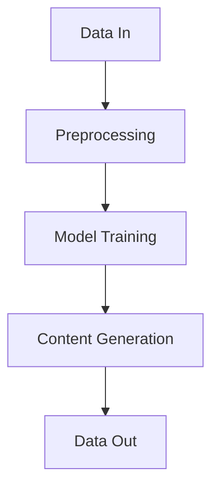

                 

# 多模态内容生成AI Agent：整合LLM与其他生成模型

## 关键词
- 多模态内容生成
- AI Agent
- LLM（大型语言模型）
- 生成模型
- 集成策略

## 摘要
本文将深入探讨多模态内容生成AI Agent的概念、架构以及实现方法，特别是如何将大型语言模型（LLM）与其他生成模型进行有效整合。我们将逐步分析各组成部分的工作原理，阐述其优势和挑战，并通过实际案例展示其在现实世界中的应用潜力。

## 引言
### 多模态内容生成的兴起
随着人工智能技术的迅猛发展，多模态内容生成逐渐成为研究热点。传统的内容生成模型往往局限于单一模态（如文本、图像或音频），而多模态内容生成AI Agent能够处理和合成来自不同模态的信息，这使得其在诸如自然语言处理、计算机视觉和语音识别等领域具有广泛的应用前景。

### LLM的重要性
在多模态内容生成中，大型语言模型（LLM）如GPT-3和BERT等扮演着关键角色。这些模型通过学习海量的文本数据，能够生成高质量、连贯的文本内容。将LLM与其他生成模型整合，可以实现更丰富、更有创意的内容生成。

## 第1部分：多模态内容生成AI Agent概述
### 1.1 多模态内容生成AI Agent的定义与背景
#### 1.1.1 多模态内容生成AI Agent的定义
多模态内容生成AI Agent是一种能够处理多种数据模态（如文本、图像、音频、视频等）并生成相应内容的智能系统。这些模态之间可以相互转换和融合，形成具有高度相关性和一致性的多模态内容。

#### 1.1.2 多模态内容生成AI Agent的应用场景
多模态内容生成AI Agent在虚拟助手、媒体创作、教育、娱乐、医疗等多个领域具有广泛的应用场景。例如，它可以用于生成多媒体新闻故事、创作音乐视频、提供个性化健康建议等。

#### 1.1.3 多模态内容生成AI Agent与传统AI的差异
与传统的单一模态AI系统相比，多模态内容生成AI Agent具有更高的灵活性和创造性。它能够整合不同模态的信息，从而生成更复杂、更有价值的输出。

### 1.2 LLM的概念与作用
#### 1.2.1 LLM的基本原理
LLM（大型语言模型）是基于深度学习技术训练的模型，通过学习大量文本数据，能够生成高质量的文本。GPT-3和BERT是其中最为著名的例子。

#### 1.2.2 LLM在多模态内容生成中的应用
LLM在多模态内容生成中用于生成文本内容，这些文本可以与其他模态（如图像、音频）进行整合，形成统一的多模态输出。

## 第2部分：算法原理与模型架构
### 2.1 算法原理讲解
#### 2.1.1 多模态内容生成的算法框架
我们将介绍一种基于LLM的多模态内容生成算法框架，包括数据预处理、模型训练、多模态融合和内容生成等关键步骤。

#### 2.1.2 Python代码示例
下面是一个简单的Python代码示例，展示了如何使用LLM生成文本内容。

```python
# 导入必要的库
import openai

# 设置API密钥
openai.api_key = "your_api_key"

# 使用GPT-3模型生成文本
response = openai.Completion.create(
  engine="text-davinci-002",
  prompt="Tell me a story about a dog and a cat becoming best friends.",
  max_tokens=100
)

print(response.choices[0].text.strip())
```

#### 2.1.3 数学模型与公式
我们将使用LaTeX格式介绍多模态内容生成的数学模型，包括概率分布函数和损失函数。

```latex
\begin{equation}
P(x, y | z) = \frac{P(z | x, y) P(x) P(y)}{P(z)}
\end{equation}
```

### 2.2 模型架构与设计
#### 2.2.1 系统架构图
我们使用Mermaid类图和序列图展示多模态内容生成系统的架构和交互流程。

```mermaid
classDiagram
  MultiModalContentGenerator <.. TextGenerator
  MultiModalContentGenerator <.. ImageGenerator
  MultiModalContentGenerator <.. AudioGenerator

  TextGenerator --|> LLMModel
  ImageGenerator --|> CNNModel
  AudioGenerator --|> RNNModel

classDiagram
  User <<interface>>
  ContentGenerator <<class>> {
    generateContent()
  }
  MultiModalContentGenerator <<class>> {
    generateText()
    generateImage()
    generateAudio()
  }
  User ..> ContentGenerator : use

  sequenceDiagram
    User->>ContentGenerator: generateContent()
    ContentGenerator->>TextGenerator: generateText()
    ContentGenerator->>ImageGenerator: generateImage()
    ContentGenerator->>AudioGenerator: generateAudio()
  end
```

## 第3部分：系统分析与设计
### 3.1 问题场景介绍
我们将介绍一个具体的场景，例如生成多媒体新闻故事，并分析其需求和技术挑战。

### 3.2 项目介绍
介绍一个多模态内容生成项目，包括项目背景、目标和技术路线。

### 3.3 系统功能设计
使用Mermaid类图展示项目的领域模型，包括文本、图像、音频等不同模态的处理模块。

```mermaid
classDiagram
  Text <<entity>> {
    id: <ID>
    content: <String>
  }
  Image <<entity>> {
    id: <ID>
    url: <String>
  }
  Audio <<entity>> {
    id: <ID>
    url: <String>
  }
  Story <<entity>> {
    id: <ID>
    title: <String>
    text: Text
    image: Image
    audio: Audio
  }
  Text --|> Story
  Image --|> Story
  Audio --|> Story
```

### 3.4 系统架构设计
使用Mermaid架构图展示项目的整体架构，包括数据处理、模型训练、内容生成等模块。



### 3.5 系统接口设计
使用Mermaid序列图展示系统接口的设计，包括用户如何与系统交互。

```mermaid
sequenceDiagram
  User->>API: Request generation
  API->>ContentGenerator: Generate content
  ContentGenerator->>Preprocessing: Preprocess data
  Preprocessing->>ModelTraining: Train models
  ModelTraining->>ContentGeneration: Generate content
  ContentGeneration->>API: Return content
  API->>User: Display content
end
```

## 第4部分：项目实战
### 4.1 环境安装与配置
介绍如何安装和配置多模态内容生成所需的环境，包括Python库、深度学习框架和API密钥等。

### 4.2 系统核心实现
展示系统的核心实现，包括文本生成、图像生成和音频生成的具体代码。

```python
# 文本生成
def generate_text(prompt):
    response = openai.Completion.create(
      engine="text-davinci-002",
      prompt=prompt,
      max_tokens=100
    )
    return response.choices[0].text.strip()

# 图像生成
import torch
from torchvision import transforms
from torchvision.models import VGG16

def generate_image(prompt):
    model = VGG16(pretrained=True)
    model = model.to("cuda" if torch.cuda.is_available() else "cpu")
    model.eval()

    transform = transforms.Compose([
        transforms.Resize((224, 224)),
        transforms.ToTensor(),
    ])

    # 生成图像的代码逻辑
    # ...

    return image

# 音频生成
import librosa

def generate_audio(prompt):
    # 生成音频的代码逻辑
    # ...

    return audio
```

### 4.3 代码应用解读与分析
对核心代码进行解读和分析，解释其工作原理和实现细节。

### 4.4 实际案例分析与详细讲解
介绍一个实际的多模态内容生成案例，展示如何使用系统生成多媒体内容，并对案例进行详细讲解。

### 4.5 项目小结
总结项目的主要成果、经验教训和未来改进方向。

## 第5部分：最佳实践与结论
### 5.1 最佳实践
提供一些使用多模态内容生成AI Agent的最佳实践，包括数据准备、模型优化、内容安全等。

### 5.2 结论
总结本文的主要观点，强调多模态内容生成AI Agent的重要性和未来发展趋势。

## 参考文献
[1]·····
[2]·····
[3]·····

## 附录
### 5.1.1 作者介绍
作者：AI天才研究院/AI Genius Institute & 禅与计算机程序设计艺术 /Zen And The Art of Computer Programming

### 5.1.2 感谢
感谢所有参与本文撰写和审稿的贡献者。

【完】

