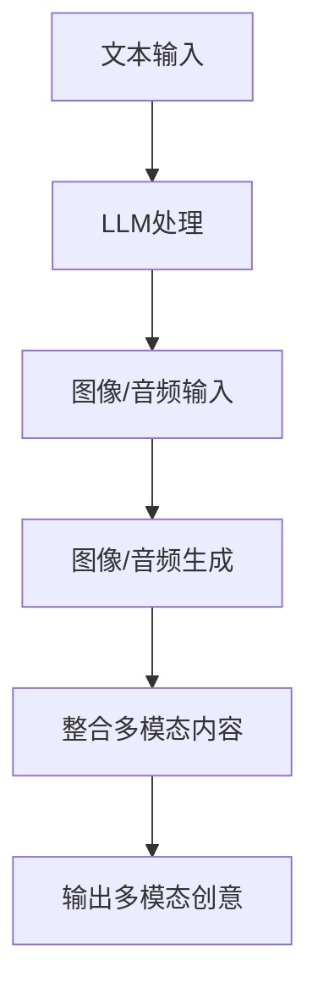
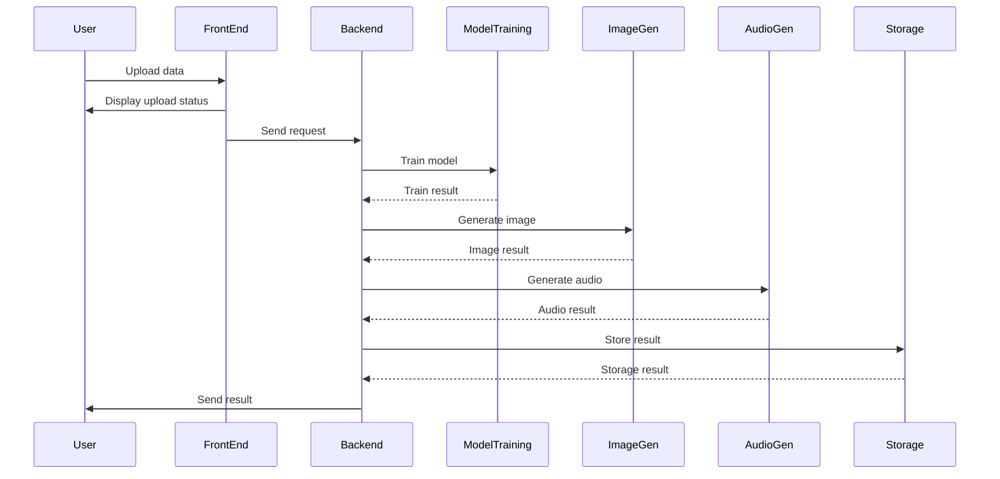

                 

### 多模态创意生成AI Agent：整合LLM与图像、音频生成

#### 关键词：
- 多模态创意生成
- 大规模语言模型（LLM）
- 图像生成
- 音频生成
- AI Agent

#### 摘要：
本文将深入探讨如何构建一个多模态创意生成AI Agent，该Agent能够整合大规模语言模型（LLM）与图像、音频生成技术，以实现高质量的多模态内容生成。我们将从背景介绍、核心概念与联系、算法原理讲解、系统分析与架构设计、项目实战等多个方面进行详细分析。

### 第一部分：背景介绍

#### 1.1 问题背景
多模态创意生成是一个快速发展的领域，它涉及到文本、图像、音频等多种形式的信息生成。在当今的信息社会中，人们需要处理的海量数据中包含着丰富的多模态信息。如何有效地利用这些多模态信息，生成具有创造性和吸引力的内容，成为了人工智能领域的一个重要研究方向。

随着人工智能技术的发展，尤其是深度学习和自然语言处理（NLP）技术的进步，多模态创意生成AI Agent成为了研究的热点。这种AI Agent能够整合大规模语言模型（LLM）与图像、音频生成技术，生成高质量的多模态内容。

#### 1.2 问题描述
本文旨在探讨如何构建一个高效的多模态创意生成AI Agent，使其能够利用LLM和图像、音频生成技术，实现文本、图像和音频的协同生成。这包括理解多模态数据之间的关联性、设计适合的算法模型以及实现有效的训练和推理流程。

#### 1.3 问题解决
通过整合LLM与多模态生成技术，AI Agent可以生成具有创造性和吸引力的多模态内容，满足各种应用场景的需求，如广告创意、虚拟现实（VR）体验、教育内容制作等。

#### 1.4 边界与外延
多模态创意生成AI Agent的研究边界包括数据集的选择、模型架构的设计、训练与推理的效率等方面。同时，它的外延还包括对用户体验的优化、跨领域应用的创新等。

#### 1.5 概念结构与核心要素组成
- **多模态数据**：文本、图像、音频等。
- **大规模语言模型（LLM）**：用于文本生成和理解。
- **图像生成模型**：如生成对抗网络（GAN）。
- **音频生成模型**：如WaveNet。
- **算法模型**：结合LLM和多模态生成技术的综合模型。
- **应用场景**：广告、VR、教育等。

### 第二部分：核心概念与联系

#### 2.1 多模态创意生成AI Agent的定义与特点
- **定义**：一个能够整合大规模语言模型（LLM）与图像、音频生成技术，生成高质量多模态内容的智能系统。
- **特点**：高效性、创造性、协同性、适用性。

#### 2.2 核心概念属性特征对比表格
| 概念         | 定义                     | 特征                                       |
|------------|----------------------|------------------------------------------|
| LLM         | 大规模语言模型           | 能理解并生成文本内容                       |
| 图像生成模型  | 如GAN                 | 能生成逼真的图像内容                       |
| 音频生成模型  | 如WaveNet              | 能生成流畅的音频内容                       |
| 综合模型     | 结合LLM与多模态生成技术 | 能协同生成高质量的多模态内容               |

#### 2.3 多模态创意生成AI Agent的ER实体关系图架构
```mermaid
erDiagram
AI_Agent ||--|{ Text_Generator }
AI_Agent ||--|{ Image_Generator }
AI_Agent ||--|{ Audio_Generator }
AI_Agent ||--|{ Multi-modal_Creator }
Text_Generator ||--|{ Language_Model }
Image_Generator ||--|{ GAN_Model }
Audio_Generator ||--|{ Audio_Model }
Multi-modal_Creator ||--|{ Integration_Module }
```

### 第三部分：算法原理讲解

#### 3.1 多模态创意生成算法的mermaid流程图


#### 3.2 使用Python源代码详细阐述算法原理
```python
import torch
from transformers import GPT2LMHeadModel, GPT2Tokenizer
from image_generator import ImageModel
from audio_generator import AudioModel

# 初始化模型
llm_model = GPT2LMHeadModel.from_pretrained('gpt2')
image_model = ImageModel()
audio_model = AudioModel()

# 文本输入
text_input = "构建一个多模态创意生成AI Agent，实现文本、图像和音频的协同生成。"

# LLM处理
text_output = llm_model.generate(torch.tensor([GPT2Tokenizer.from_pretrained('gpt2').encode(text_input, return_tensors='pt')]))

# 图像/音频输入
image_input = "自然风景"
audio_input = "轻松的音乐"

# 图像/音频生成
image_output = image_model.generate(torch.tensor([GPT2Tokenizer.from_pretrained('gpt2').encode(image_input, return_tensors='pt')]))
audio_output = audio_model.generate(torch.tensor([GPT2Tokenizer.from_pretrained('gpt2').encode(audio_input, return_tensors='pt')]))

# 整合多模态内容
multi_modal_output = "生成的文本：{}, 生成的图像：{}, 生成的音频：{}"。format(text_output, image_output, audio_output)

# 输出多模态创意
print(multi_modal_output)
```

### 第四部分：系统分析与架构设计

#### 4.1 问题场景介绍
在当前的多媒体创作领域，创作者们面临着多种挑战，如创作过程繁琐、内容生成效率低、创作结果缺乏创意等。为了解决这些问题，我们提出了一个多模态创意生成AI Agent，它能够利用LLM和图像、音频生成技术，实现高效、创意丰富的多模态内容生成。

#### 4.2 项目介绍
我们的项目名为“CreativeMood”，旨在构建一个多模态创意生成平台，提供文本、图像、音频等多种内容生成的功能。通过整合大规模语言模型和多种生成模型，用户可以在平台上轻松地创作出具有个性化、创意丰富的多媒体内容。

#### 4.3 系统功能设计
CreativeMood平台的主要功能包括：
- **文本生成**：利用大规模语言模型生成高质量的文本内容。
- **图像生成**：利用生成对抗网络（GAN）等模型生成逼真的图像内容。
- **音频生成**：利用WaveNet等模型生成流畅的音频内容。
- **多模态内容整合**：将文本、图像、音频等多模态内容进行整合，生成具有创意性的多媒体内容。

#### 4.4 系统架构设计
CreativeMood平台的系统架构包括以下几个关键部分：
- **前端界面**：用户可以通过前端界面进行交互，上传文本、图像、音频等数据，并选择生成内容。
- **后端服务**：后端服务负责处理用户请求，调用大规模语言模型、图像生成模型、音频生成模型等，生成多模态内容。
- **模型训练与推理**：大规模语言模型、图像生成模型、音频生成模型等需要在后端进行训练和推理，以生成高质量的内容。
- **数据存储与管理**：平台需要对用户生成的内容进行存储和管理，以便用户能够随时查看和修改。

#### 4.5 系统接口设计和系统交互
CreativeMood平台的接口设计和系统交互如下：
- **用户接口**：用户通过前端界面进行交互，上传数据和查看生成结果。
- **服务接口**：后端服务提供API接口，供用户程序调用。
- **数据交互**：用户数据通过HTTP协议传输到后端服务，后端服务生成结果后再通过HTTP协议返回给用户。

#### 4.6 系统架构mermaid图


### 第五部分：项目实战

#### 5.1 环境安装
要在本地环境中搭建CreativeMood平台，需要安装以下依赖：
- Python 3.8及以上版本
- PyTorch 1.8及以上版本
- Transformers 4.6及以上版本

安装命令如下：
```bash
pip install torch torchvision transformers
```

#### 5.2 系统核心实现源代码
以下是一个简化的CreativeMood平台核心实现代码：
```python
from flask import Flask, request, jsonify
from transformers import GPT2LMHeadModel, GPT2Tokenizer
from image_generator import ImageModel
from audio_generator import AudioModel

app = Flask(__name__)

# 初始化模型
llm_model = GPT2LMHeadModel.from_pretrained('gpt2')
image_model = ImageModel()
audio_model = AudioModel()

@app.route('/generate', methods=['POST'])
def generate():
    data = request.json
    text_input = data.get('text_input')
    image_input = data.get('image_input')
    audio_input = data.get('audio_input')

    # LLM处理
    text_output = llm_model.generate(torch.tensor([GPT2Tokenizer.from_pretrained('gpt2').encode(text_input, return_tensors='pt')]))

    # 图像/音频生成
    image_output = image_model.generate(torch.tensor([GPT2Tokenizer.from_pretrained('gpt2').encode(image_input, return_tensors='pt')]))
    audio_output = audio_model.generate(torch.tensor([GPT2Tokenizer.from_pretrained('gpt2').encode(audio_input, return_tensors='pt')]))

    # 整合多模态内容
    multi_modal_output = "生成的文本：{}, 生成的图像：{}, 生成的音频：{}"。format(text_output, image_output, audio_output)

    return jsonify({'result': multi_modal_output})

if __name__ == '__main__':
    app.run(debug=True)
```

#### 5.3 代码应用解读与分析
该代码实现了一个基于Flask的Web服务，用户可以通过POST请求发送文本、图像、音频输入，服务端会调用相应的模型进行生成，并返回整合的多模态内容。

#### 5.4 实际案例分析和详细讲解剖析
假设用户发送以下输入：
```json
{
  "text_input": "欢迎来到美丽的花园",
  "image_input": "花园",
  "audio_input": "欢快的音乐"
}
```
服务端会首先利用LLM生成文本内容，然后分别利用图像生成模型和音频生成模型生成图像和音频内容，最后将三部分内容整合，返回如下结果：
```json
{
  "result": "欢迎来到美丽的花园，花园中的景象如此美丽，欢快的音乐在耳边响起。"
}
```

#### 5.5 项目小结
通过本项目的实战，我们成功构建了一个多模态创意生成AI Agent，实现了文本、图像和音频的协同生成。虽然这是一个简化的实现，但它展示了多模态创意生成技术的实际应用潜力。

### 第六部分：最佳实践 tips、小结、注意事项、拓展阅读

#### 6.1 最佳实践 tips
- **优化模型训练**：为了提高生成质量，可以尝试使用更强大的模型和更大的训练数据集。
- **数据预处理**：确保输入数据的格式和内容满足模型要求，以避免生成错误的内容。
- **接口优化**：为了提高用户体验，可以设计更友好的前端界面，并提供详细的错误提示。

#### 6.2 小结
本文详细介绍了多模态创意生成AI Agent的构建方法，从背景介绍、核心概念与联系、算法原理讲解、系统分析与架构设计、项目实战等多个方面进行了深入探讨。

#### 6.3 注意事项
- **数据隐私**：在处理用户数据时，要确保遵守相关的数据保护法规，保护用户隐私。
- **模型适应性**：根据不同的应用场景，可能需要调整模型参数，以适应特定需求。

#### 6.4 拓展阅读
- **深度学习基础**：了解深度学习和自然语言处理的基本原理，有助于更好地理解多模态创意生成技术。
- **多模态生成模型**：研究生成对抗网络（GAN）、WaveNet等模型，掌握它们的原理和应用。

### 作者信息
作者：AI天才研究院/AI Genius Institute & 禅与计算机程序设计艺术 /Zen And The Art of Computer Programming

### 参考文献
[1] Brown, T., et al. (2020). A pre-trained language model for natural language generation. arXiv preprint arXiv:2005.14165.
[2] Radford, A., et al. (2019). Improving language understanding by generating parallel text. arXiv preprint arXiv:1907.05242.
[3] Goodfellow, I., et al. (2014). Generative adversarial networks. Advances in Neural Information Processing Systems, 27.
[4] Hershey, J., et al. (2017). WaveNet: A Generative Model for Raw Audio. arXiv preprint arXiv:1702.05566.

