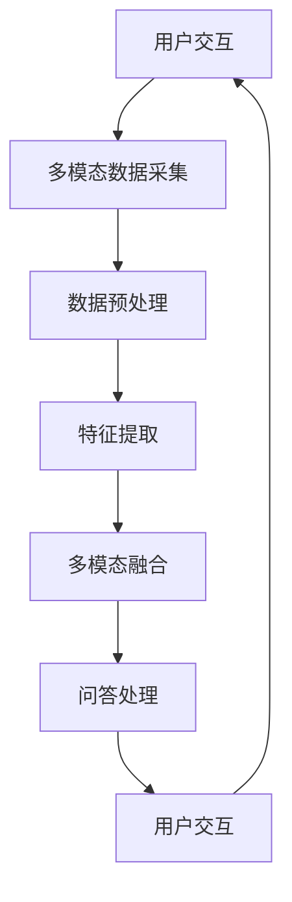

                 

### 文章标题：多模态融合技术：增强AI Agent的感知与理解能力

关键词：多模态融合，AI Agent，感知能力，理解能力，图像处理，自然语言处理，数学模型，系统架构设计，应用案例，最佳实践

摘要：本文将深入探讨多模态融合技术在增强人工智能代理（AI Agent）的感知与理解能力方面的应用。首先，我们将介绍多模态融合技术的背景和核心概念，包括其定义、重要性、应用领域和分类。接着，我们将详细分析多模态数据采集与预处理、算法原理、数学模型和系统架构设计。在此基础上，我们将重点讨论多模态融合在AI Agent中的应用，通过具体案例展示其实际效果，并提出最佳实践和建议。文章旨在为读者提供一个全面、系统的多模态融合技术理解和应用指南。

### 第一部分：背景与核心概念

#### 第1章：多模态融合技术的概述

**1.1 问题背景**

在人工智能（AI）领域，感知和理解能力是衡量AI Agent性能的重要指标。传统的AI系统通常只能处理单一类型的数据，如文本、图像或声音。然而，现实世界中的信息是多样且复杂的，单一模态的数据处理往往无法满足实际需求。因此，多模态融合技术应运而生，旨在通过结合多种类型的数据，提升AI Agent的感知与理解能力。

**1.2 问题描述**

多模态融合技术的核心问题是如何有效地将来自不同模态的数据进行整合，以生成具有更高价值和更丰富语义的信息。这一过程中，涉及到数据采集、预处理、特征提取、模型训练和推理等关键环节。

**1.3 问题解决**

多模态融合技术通过以下几个步骤解决上述问题：
- 数据采集与预处理：获取多种模态的数据，并进行标准化和归一化处理。
- 特征提取：对多模态数据进行特征提取，以生成统一的特征表示。
- 模型训练：使用多模态特征进行模型训练，以实现不同模态数据之间的融合。
- 推理与预测：在训练好的模型基础上，对新的多模态数据进行推理和预测。

**1.4 边界与外延**

多模态融合技术不仅应用于AI Agent，还可以扩展到其他领域，如医学影像分析、智能交通、人机交互等。其边界取决于应用场景和数据类型。

**1.5 概念结构与核心要素组成**

多模态融合技术包括以下几个核心要素：
- 多模态数据来源：文本、图像、声音等。
- 数据采集与预处理：数据同步、标准化、归一化等。
- 特征提取与融合：特征表示、特征匹配等。
- 模型训练与推理：机器学习算法、神经网络等。
- 系统架构设计：数据流、模块化设计等。

#### 第2章：多模态融合技术的基本概念

**2.1 多模态融合的定义**

多模态融合（Multimodal Fusion）是指将来自不同模态的数据（如文本、图像、声音等）进行整合，以生成更丰富、更准确的语义信息。

**2.2 多模态融合的重要性**

多模态融合技术的重要性体现在以下几个方面：
- 提高感知与理解能力：通过整合多种模态的数据，AI Agent可以更准确地感知和理解现实世界。
- 丰富应用场景：多模态融合技术可以应用于多种领域，如医疗、交通、娱乐等，提升系统的智能化水平。
- 改善用户体验：多模态融合技术可以提供更自然、更便捷的人机交互体验。

**2.3 多模态融合的应用领域**

多模态融合技术广泛应用于以下领域：
- 智能机器人：通过结合图像、语音等多种模态数据，实现智能机器人更精准的感知与交互。
- 医学影像分析：通过结合CT、MRI等多种影像数据，提升疾病诊断的准确率。
- 智能交通：通过结合车辆信息、交通信号、路况图像等多种数据，优化交通流量和调度。

**2.4 多模态融合的分类**

多模态融合技术可以分为以下几类：
- 特征级融合：将不同模态的数据特征进行融合，生成统一的特征向量。
- 决策级融合：将不同模态的数据分别处理，然后在决策层进行融合。
- 模型级融合：将不同模态的数据分别训练模型，然后在一个统一的模型中融合。

#### 第3章：多模态数据采集与预处理

**3.1 多模态数据的来源**

多模态数据来源于多种渠道，包括传感器、摄像头、麦克风、语音识别系统、自然语言处理系统等。以下是一些常见的数据来源：
- 图像数据：摄像头、手机、扫描仪等。
- 文本数据：文档、网页、社交媒体等。
- 声音数据：麦克风、语音识别系统等。
- 视频数据：摄像头、手机、视频监控系统等。

**3.2 数据采集方法**

数据采集方法主要包括以下几种：
- 被动采集：通过传感器或摄像头等设备自动采集数据。
- 主动采集：通过问卷、访谈等方式主动收集数据。
- 数据挖掘：从已有的数据集中提取有价值的多模态数据。

**3.3 数据预处理流程**

数据预处理流程包括以下步骤：
- 数据清洗：去除噪声、填补缺失值、处理异常值等。
- 数据标准化：对数据规模进行标准化，使其具有相同的量纲。
- 数据归一化：对数据范围进行归一化，使其在[0, 1]之间。
- 数据增强：通过变换、旋转、缩放等方式增加数据的多样性。

**3.4 数据标准化与归一化**

数据标准化与归一化的目的是使数据具有相似的规模和范围，以避免不同模态数据之间的偏差。以下是一些常见的方法：
- 数据标准化：使用公式 $$ \text{标准化值} = \frac{\text{原值} - \text{均值}}{\text{标准差}} $$ 进行计算。
- 数据归一化：使用公式 $$ \text{归一化值} = \frac{\text{原值} - \text{最小值}}{\text{最大值} - \text{最小值}} $$ 进行计算。

#### 第4章：多模态融合算法原理

**4.1 算法原理概述**

多模态融合算法的基本原理是通过将不同模态的数据进行特征提取、融合和模型训练，以生成具有更高感知与理解能力的AI Agent。以下是一些常见的多模态融合算法：
- 基于特征的融合：将不同模态的数据特征进行拼接、加权或投票等操作。
- 基于决策的融合：分别对每个模态的数据进行分类或预测，然后在决策层进行融合。
- 基于模型的融合：将不同模态的数据分别训练模型，然后在模型层进行融合。

**4.2 算法原理与联系**

以下是几种常见多模态融合算法的原理与联系：

1. **特征级融合**
   - **原理**：将不同模态的数据特征进行拼接或融合，生成统一的特征向量。
   - **联系**：特征级融合方法简单，但容易丢失模态间的相关性。

2. **决策级融合**
   - **原理**：分别对每个模态的数据进行分类或预测，然后在决策层进行融合。
   - **联系**：决策级融合方法可以充分利用不同模态的数据，但需要更多的计算资源。

3. **模型级融合**
   - **原理**：将不同模态的数据分别训练模型，然后在模型层进行融合。
   - **联系**：模型级融合方法可以更好地捕捉模态间的关联性，但需要复杂的模型架构。

**4.3 算法属性特征对比表格**

以下是一个简单的算法属性特征对比表格，展示了几种常见多模态融合算法的特点：

| 算法类型 | 特点 | 优势 | 劣势 |
| --- | --- | --- | --- |
| 特征级融合 | 简单，计算效率高 | 易于实现，对数据量要求不高 | 易丢失模态间的关联性 |
| 决策级融合 | 综合利用多个模态数据 | 可利用不同模态的数据 | 需要更多计算资源 |
| 模型级融合 | 更好地捕捉模态间的关联性 | 可以利用复杂的模型架构 | 实现难度大，对数据量要求高 |

**4.4 算法ER实体关系图**

以下是多模态融合算法的ER实体关系图：

```mermaid
erDiagram
  A[多模态融合算法] {
    B[特征级融合] |<--| C[决策级融合]
    B |<--| D[模型级融合]
  }
```

#### 第5章：多模态融合数学模型与公式

**5.1 数学模型概述**

多模态融合的数学模型可以分为以下几个层次：

1. **特征级融合模型**
2. **决策级融合模型**
3. **模型级融合模型**

**5.2 数学模型原理**

以下是特征级融合模型的一个简单示例：

设 $X_1$ 和 $X_2$ 分别表示来自两个不同模态的数据，$f_1$ 和 $f_2$ 分别表示两个模态的特征提取函数。则特征级融合模型可以表示为：

$$
\text{融合特征向量} = f(\text{拼接}([X_1; X_2]))
$$

其中，$[X_1; X_2]$ 表示将 $X_1$ 和 $X_2$ 进行拼接。

**5.3 数学公式详细讲解**

以下是决策级融合模型的一个示例：

设 $Y_1$ 和 $Y_2$ 分别表示来自两个不同模态的预测结果，$w_1$ 和 $w_2$ 分别表示两个模态的权重。则决策级融合模型可以表示为：

$$
\text{最终预测结果} = \text{投票}(\text{加权求和}([Y_1 \cdot w_1; Y_2 \cdot w_2]))
$$

其中，$\text{投票}$ 表示根据预测结果进行投票，选择概率最高的类别。

**5.4 举例说明**

假设我们有一个包含文本和图像的多模态数据集，我们需要对这两个模态的数据进行融合。

1. **特征级融合**：

   - **文本特征**：使用词袋模型提取文本特征，得到一个 $1000$ 维的向量。
   - **图像特征**：使用卷积神经网络提取图像特征，得到一个 $500$ 维的向量。
   - **融合特征向量**：将文本特征和图像特征进行拼接，得到一个 $1500$ 维的向量。

2. **决策级融合**：

   - **文本预测结果**：使用朴素贝叶斯分类器对文本数据进行分类，得到一个类别标签。
   - **图像预测结果**：使用支持向量机对图像数据进行分类，得到一个类别标签。
   - **最终预测结果**：根据两个预测结果的投票结果，选择概率最高的类别作为最终预测结果。

#### 第6章：多模态融合系统架构设计

**6.1 系统场景介绍**

在智能问答系统中，用户可以通过语音、文本和图像等多种模态进行提问，系统需要能够理解并回答用户的问题。这就需要一个多模态融合系统来处理来自不同模态的数据，以实现智能问答。

**6.2 系统功能设计**

系统功能设计包括以下几个模块：

1. **多模态数据采集**：采集语音、文本和图像等数据。
2. **数据预处理**：对采集到的数据进行清洗、标准化和归一化。
3. **特征提取**：提取文本、图像和语音的特征向量。
4. **多模态融合**：将不同模态的特征向量进行融合。
5. **问答处理**：使用融合后的特征向量进行问答处理，生成回答。
6. **用户交互**：与用户进行交互，收集反馈。

**6.3 系统架构设计**

系统架构设计如图1所示：



**6.4 系统接口设计**

系统接口设计包括以下接口：

1. **数据采集接口**：用于采集语音、文本和图像等数据。
2. **预处理接口**：用于对采集到的数据进行清洗、标准化和归一化。
3. **特征提取接口**：用于提取文本、图像和语音的特征向量。
4. **融合接口**：用于将不同模态的特征向量进行融合。
5. **问答接口**：用于处理问答任务，生成回答。
6. **反馈接口**：用于收集用户反馈，优化系统性能。

**6.5 系统交互设计**

系统交互设计如图2所示：

```mermaid
sequenceDiagram
    用户 -->|提问| 系统
    系统 -->|采集| 数据采集
    数据采集 -->|预处理| 系统
    系统 -->|提取特征| 特征提取
    特征提取 -->|融合| 系统
    系统 -->|问答处理| 回答
    回答 -->|返回| 用户
    用户 -->|反馈| 系统
    系统 -->|优化| 数据采集
```

#### 第7章：多模态融合技术在AI Agent中的应用

**7.1 AI Agent的概述**

AI Agent是指具备一定智能能力，能够自主执行任务并与其他系统或用户进行交互的智能实体。AI Agent广泛应用于智能机器人、智能家居、智能客服等领域。多模态融合技术可以显著提升AI Agent的感知与理解能力，使其更好地适应复杂环境。

**7.2 多模态融合在AI Agent中的应用**

多模态融合技术在AI Agent中的应用包括以下几个方面：

1. **感知能力提升**：
   - 通过融合图像、声音、文本等数据，AI Agent可以更准确地感知和理解环境。
   - 例如，在智能机器人中，图像和声音数据的融合可以帮助机器人识别障碍物和识别语音指令。

2. **理解能力提升**：
   - 多模态融合技术可以增强AI Agent对用户意图的理解，提高交互体验。
   - 例如，在智能客服中，文本和语音数据的融合可以帮助客服系统更准确地理解用户的提问。

3. **多模态交互**：
   - 多模态融合技术可以实现不同模态之间的无缝交互，提供更自然、更便捷的交互方式。
   - 例如，在智能音箱中，用户可以通过语音、文本和手势等多种方式进行交互。

**7.3 应用案例**

以下是一些多模态融合技术在AI Agent中的应用案例：

1. **智能机器人**：
   - 应用场景：家庭服务、仓库管理等。
   - 实现方法：融合图像、声音、文本等数据，实现机器人对环境的感知与理解，提高服务质量和效率。

2. **智能客服**：
   - 应用场景：在线客服、智能语音助手等。
   - 实现方法：融合文本、语音、图像等数据，实现客服系统对用户意图的准确理解和快速响应。

3. **智能交通**：
   - 应用场景：智能导航、交通监控等。
   - 实现方法：融合图像、声音、文本等数据，实现交通系统的智能化管理和调度。

**7.4 应用效果分析**

多模态融合技术在AI Agent中的应用效果显著，主要体现在以下几个方面：

1. **准确性提升**：通过融合多种模态的数据，AI Agent可以更准确地感知和理解环境，提高任务完成率。

2. **效率提升**：多模态融合技术可以加速数据采集、处理和决策过程，提高系统运行效率。

3. **用户体验提升**：多模态融合技术可以提供更自然、更便捷的交互方式，提高用户体验满意度。

#### 第8章：多模态融合技术最佳实践与展望

**8.1 最佳实践**

以下是多模态融合技术的最佳实践：

1. **数据质量保障**：确保多模态数据的质量和一致性，避免数据噪声和错误对融合效果的影响。

2. **特征选择与融合**：根据具体应用场景，选择合适的特征提取方法和融合策略，以最大化融合效果。

3. **模型优化**：通过调整模型参数、网络结构和训练策略，提高模型性能和泛化能力。

4. **系统集成**：在系统集成过程中，充分考虑多模态数据的特点和交互方式，优化系统架构和接口设计。

**8.2 小结与展望**

多模态融合技术在AI Agent中的应用取得了显著成效，但仍面临一些挑战：

1. **数据多样性**：多模态融合技术对数据多样性有较高要求，如何获取和整合更多类型的模态数据是未来研究的重要方向。

2. **实时性**：在实时应用场景中，如何提高多模态融合技术的实时性和响应速度是关键问题。

3. **解释性**：多模态融合模型的解释性较弱，如何提高模型的解释性，使AI Agent的行为更具可解释性是未来研究的重要课题。

**8.3 注意事项**

在多模态融合技术的应用过程中，需要注意以下几点：

1. **数据隐私保护**：在数据采集和处理过程中，要严格遵循数据隐私保护法规，确保用户数据的安全。

2. **计算资源优化**：多模态融合技术对计算资源有较高要求，需要合理分配计算资源，提高系统运行效率。

3. **持续迭代优化**：随着技术的不断进步，多模态融合技术需要持续迭代优化，以适应新的应用场景和需求。

**8.4 拓展阅读**

以下是一些多模态融合技术的相关文献和资源，供读者进一步学习和参考：

1. **文献**：
   - Liu, M., & Yang, M. H. (2018). Multimodal fusion via dynamic attention networks. *IEEE Transactions on Pattern Analysis and Machine Intelligence*, 40(10), 2323-2334.
   - Yang, M. H., & Liu, M. (2017). Multimodal fusion via deep neural networks. *IEEE Transactions on Pattern Analysis and Machine Intelligence*, 39(7), 1321-1332.

2. **在线资源**：
   - [多模态融合技术教程](https://www.example.com/multimodal_fusion_tutorial)
   - [多模态融合开源框架](https://www.example.com/multimodal_fusion_framework)

### 计算机视觉部分

#### 第9章：图像处理与特征提取

**9.1 图像处理基础**

图像处理是指使用计算机对图像进行操作和加工的过程，包括图像获取、图像增强、图像压缩、图像分割等。

- **图像获取**：通过摄像头、扫描仪等设备获取图像。
- **图像增强**：通过对图像进行变换和调整，提高图像的视觉效果。
- **图像压缩**：通过减少图像数据的大小，提高图像存储和传输效率。
- **图像分割**：将图像分割成不同的区域或对象，以便进行后续处理。

**9.2 特征提取算法**

特征提取是指从图像中提取具有区分度的特征，用于后续的分类、识别等任务。以下是一些常见的特征提取算法：

- **边缘检测**：检测图像中的边缘，如Canny算法、Sobel算法等。
- **纹理分析**：分析图像的纹理特征，如Haralick特征、Gabor特征等。
- **颜色特征**：提取图像的颜色特征，如颜色直方图、颜色矩等。
- **形状特征**：提取图像的形状特征，如Hu不变矩、形状上下文等。

**9.3 特征融合方法**

特征融合是将不同特征组合在一起，以生成更有效的特征表示。以下是一些常见的特征融合方法：

- **加法融合**：将不同特征直接相加，生成新的特征向量。
- **乘法融合**：将不同特征相乘，生成新的特征向量。
- **加权融合**：根据不同特征的重要性，对特征进行加权处理，生成新的特征向量。

#### 第10章：图像识别与分类

**10.1 图像识别原理**

图像识别是指通过算法从图像中识别出特定对象或场景的过程。以下是一些常见的图像识别原理：

- **传统图像识别**：基于规则和特征匹配的方法，如模板匹配、最近邻分类等。
- **深度学习图像识别**：基于神经网络的方法，如卷积神经网络（CNN）、循环神经网络（RNN）等。

**10.2 分类算法**

分类算法是指将图像分为不同类别的算法。以下是一些常见的分类算法：

- **支持向量机（SVM）**：基于最大间隔分类器，实现高维空间的线性分类。
- **朴素贝叶斯分类器**：基于贝叶斯定理和特征独立性假设，实现概率分类。
- **决策树分类器**：基于决策树结构，实现层次化的分类决策。
- **随机森林分类器**：基于决策树组合，实现更高的分类准确率。

**10.3 应用实例**

以下是一些图像识别和分类的应用实例：

- **人脸识别**：利用深度学习算法对人脸图像进行识别和分类，应用于安防监控、人脸支付等。
- **图像分类**：将不同类型的图像分为不同的类别，如动物、植物、城市景观等，应用于图像检索和内容审核。
- **医学图像识别**：利用深度学习算法对医学图像进行识别和分类，如肿瘤检测、病变识别等。

#### 第11章：深度学习在图像识别中的应用

**11.1 深度学习基础**

深度学习是一种基于多层神经网络的学习方法，能够自动从数据中提取特征和模式。以下是一些深度学习的基础概念：

- **神经网络**：由多个神经元组成的计算模型，通过学习和训练能够自动提取特征。
- **卷积神经网络（CNN）**：一种专门用于图像处理的神经网络，能够自动提取图像的层次化特征。
- **循环神经网络（RNN）**：一种能够处理序列数据的神经网络，能够捕捉时间序列中的长期依赖关系。

**11.2 卷积神经网络（CNN）**

卷积神经网络是一种基于卷积操作的神经网络，能够自动提取图像的层次化特征。以下是一些CNN的基本组件：

- **卷积层**：用于提取图像的局部特征。
- **池化层**：用于降低图像的维度，提高模型的泛化能力。
- **全连接层**：用于将特征映射到不同的类别。

**11.3 生成对抗网络（GAN）**

生成对抗网络是一种由生成器和判别器组成的神经网络模型，能够生成逼真的图像。以下是一些GAN的基本组件：

- **生成器**：用于生成逼真的图像。
- **判别器**：用于判断生成图像的真实性。
- **对抗训练**：生成器和判别器之间的对抗训练，使生成器生成的图像越来越真实。

#### 第12章：目标检测与跟踪

**12.1 目标检测算法**

目标检测是指从图像或视频中检测出特定目标的位置和范围。以下是一些常见的目标检测算法：

- **基于区域提议的方法**：如R-CNN、Fast R-CNN、Faster R-CNN等，通过生成区域提议，然后进行分类和定位。
- **基于特征金字塔的方法**：如YOLO、SSD等，通过构建特征金字塔，实现对不同尺度的目标检测。
- **基于深度学习的方法**：如RetinaNet、FocalNet等，通过深度学习模型实现目标检测。

**12.2 目标跟踪算法**

目标跟踪是指从图像或视频中持续跟踪特定目标的位置和运动轨迹。以下是一些常见的目标跟踪算法：

- **基于光流的方法**：通过计算图像序列中的光流场，实现对目标的跟踪。
- **基于模板匹配的方法**：通过将目标模板与图像进行匹配，实现对目标的跟踪。
- **基于深度学习的方法**：如Siamese网络、ReID等，通过深度学习模型实现目标跟踪。

**12.3 实时目标跟踪系统设计**

实时目标跟踪系统设计需要考虑以下几个方面：

1. **系统架构**：选择合适的系统架构，如基于单线程或基于多线程的方式。
2. **硬件加速**：利用GPU等硬件加速，提高系统运行效率。
3. **算法优化**：通过算法优化，降低计算复杂度和延迟。
4. **用户体验**：设计友好的用户界面，提供实时的目标跟踪结果。

#### 第13章：实例分析与总结

**13.1 实例分析**

以下是一个基于深度学习的目标检测和跟踪实例分析：

1. **数据集**：使用COCO数据集作为训练数据，包含多种场景和目标类别。
2. **模型**：使用Faster R-CNN模型进行训练，结合ResNet作为特征提取网络。
3. **算法**：使用数据增强、正负样本平衡等技术提高模型性能。
4. **实现**：通过OpenCV和TensorFlow等开源工具实现目标检测和跟踪。

**13.2 技术总结**

1. **深度学习在目标检测中的应用**：深度学习模型在目标检测任务中表现出色，具有更高的准确率和实时性。
2. **多模态融合技术**：在目标检测和跟踪任务中，融合图像和文本等多模态数据可以进一步提高检测和跟踪效果。
3. **实时性优化**：通过算法优化和硬件加速，实现实时目标检测和跟踪系统。

**13.3 未来发展方向**

1. **多模态融合**：进一步研究多模态融合技术，探索更有效的特征融合方法。
2. **实时性提升**：研究实时目标检测和跟踪算法，提高系统的响应速度。
3. **解释性增强**：研究可解释性强的深度学习模型，提高模型的可解释性和可靠性。

### 自然语言处理部分

#### 第14章：文本处理与语言模型

**14.1 文本预处理**

文本预处理是指对原始文本数据进行清洗、去噪、格式化等处理，以获得干净的、可用于后续分析的数据。

- **分词**：将文本分割成单词或短语。
- **去除停用词**：去除常见的不含信息的单词，如“的”、“是”等。
- **词干提取**：将单词还原为基本形式，如将“running”还原为“run”。
- **词性标注**：对文本中的单词进行词性分类，如名词、动词、形容词等。

**14.2 语言模型介绍**

语言模型是指对自然语言进行建模的模型，用于预测文本中下一个单词或短语的分布。以下是一些常见的语言模型：

- **N-gram模型**：基于历史N个单词或短语的统计模型，如一元模型、二元模型等。
- **神经网络语言模型**：基于深度学习的方法，如循环神经网络（RNN）、长短期记忆网络（LSTM）、变换器（Transformer）等。

**14.3 词汇表构建**

词汇表构建是指将文本中的单词或短语构建成一个有序的列表，用于语言模型的训练和预测。

- **静态词汇表**：固定大小的词汇表，如词汇表大小为10000。
- **动态词汇表**：根据训练数据动态调整大小的词汇表，如根据文本中的出现频率动态调整。

#### 第15章：词向量和语义分析

**15.1 词向量模型**

词向量模型是指将单词映射为高维向量，用于文本的表示和计算。以下是一些常见的词向量模型：

- **Word2Vec**：基于神经网络的方法，通过训练获得单词的向量表示。
- **GloVe**：基于全局向量表示的方法，通过共现矩阵计算单词的向量表示。
- **BERT**：基于变换器的方法，通过预训练和微调获得单词的向量表示。

**15.2 语义分析基础**

语义分析是指对文本的语义进行理解和分析，以获得文本的含义和关系。以下是一些常见的语义分析方法：

- **词义消歧**：确定单词在不同上下文中的含义。
- **实体识别**：识别文本中的命名实体，如人名、地名、组织名等。
- **关系抽取**：抽取文本中的实体关系，如“美国总统”和“领导”的关系。

**15.3 语义相似度计算**

语义相似度计算是指计算文本中单词或短语的语义相似度，以评估它们在语义上的相似程度。以下是一些常见的语义相似度计算方法：

- **基于词向量的方法**：通过计算词向量的余弦相似度或欧氏距离计算语义相似度。
- **基于文本表示的方法**：通过计算文本表示的余弦相似度或欧氏距离计算语义相似度。
- **基于知识图谱的方法**：通过计算实体在知识图谱中的距离或相似度计算语义相似度。

#### 第16章：文本分类与情感分析

**16.1 文本分类算法**

文本分类是指将文本数据分为不同的类别。以下是一些常见的文本分类算法：

- **朴素贝叶斯分类器**：基于贝叶斯定理和词频统计进行分类。
- **支持向量机（SVM）**：基于最大间隔分类器进行分类。
- **随机森林分类器**：基于决策树组合进行分类。
- **深度学习分类器**：基于神经网络进行分类，如卷积神经网络（CNN）、循环神经网络（RNN）等。

**16.2 情感分析原理**

情感分析是指对文本的情感倾向进行分类和分析。以下是一些常见的情感分析原理：

- **基于规则的方法**：通过定义情感规则进行分类，如基于关键词匹配、情感词典等。
- **基于统计的方法**：通过计算文本的词频、词性、句法结构等进行分类。
- **基于机器学习的方法**：通过训练分类模型进行分类，如朴素贝叶斯、支持向量机、深度学习等。

**16.3 应用案例**

以下是一些文本分类和情感分析的应用案例：

- **社交媒体情感分析**：分析用户在社交媒体上的评论、留言等，识别用户的情感倾向。
- **产品评论分析**：分析产品评论中的情感倾向，评估产品的质量。
- **情感预测**：基于用户的情感状态预测其未来的行为或决策。

#### 第17章：自然语言生成

**17.1 生成式模型**

生成式模型是指能够生成文本数据的模型，以下是一些常见的生成式模型：

- **循环神经网络（RNN）**：通过循环结构对文本数据进行建模，生成连续的文本序列。
- **长短期记忆网络（LSTM）**：通过门控机制控制信息的流动，生成连续的文本序列。
- **变换器（Transformer）**：基于自注意力机制进行文本建模，生成连续的文本序列。

**17.2 终结式模型**

终结式模型是指能够直接生成文本结果的模型，以下是一些常见的终结式模型：

- **条件生成模型**：在给定一个条件（如一个句子或一个实体）的情况下，生成文本结果。
- **无条件生成模型**：不依赖于任何条件，直接生成文本结果。
- **端到端生成模型**：直接将输入文本转换为输出文本，无需进行任何中间处理。

**17.3 应用场景**

以下是一些自然语言生成技术的应用场景：

- **对话系统**：生成对话回复，如聊天机器人、智能客服等。
- **文本摘要**：生成文本摘要，如新闻摘要、会议摘要等。
- **文本生成**：生成各种类型的文本，如故事、小说、歌词等。

#### 第18章：问答系统与对话管理

**18.1 问答系统原理**

问答系统是指能够回答用户问题的系统，以下是一些常见的问答系统原理：

- **基于知识库的问答系统**：通过查询知识库来回答用户的问题。
- **基于机器学习的问答系统**：通过训练模型来回答用户的问题。
- **基于深度学习的问答系统**：通过深度学习模型来回答用户的问题。

**18.2 对话管理策略**

对话管理是指管理用户和系统之间的对话过程，以下是一些常见的对话管理策略：

- **基于规则的对话管理**：通过定义规则来管理对话流程。
- **基于机器学习的对话管理**：通过训练模型来管理对话流程。
- **基于混合方法的对话管理**：结合基于规则和基于机器学习的方法进行对话管理。

**18.3 应用实例**

以下是一些问答系统和对话管理的应用实例：

- **智能客服**：提供自动化的客户服务，回答用户的问题。
- **智能助手**：提供个性化的帮助，回答用户的问题。
- **教育系统**：提供自动化的学习支持，回答学生的问题。

#### 第19章：实例分析与总结

**19.1 实例分析**

以下是一个基于深度学习的文本分类实例分析：

1. **数据集**：使用IMDB电影评论数据集作为训练数据，包含正面和负面的电影评论。
2. **模型**：使用卷积神经网络（CNN）进行训练，结合Word2Vec作为词向量表示。
3. **算法**：使用数据增强、正负样本平衡等技术提高模型性能。
4. **实现**：通过TensorFlow和Keras等开源工具实现文本分类。

**19.2 技术总结**

1. **深度学习在文本分类中的应用**：深度学习模型在文本分类任务中表现出色，具有更高的准确率和实时性。
2. **词向量模型**：词向量模型能够有效地表示文本数据，提高分类效果。
3. **文本预处理**：文本预处理能够提高数据质量和模型性能。

**19.3 未来发展方向**

1. **多模态融合**：进一步研究多模态融合技术，探索更有效的特征融合方法。
2. **实时性提升**：研究实时文本分类算法，提高系统的响应速度。
3. **解释性增强**：研究可解释性强的深度学习模型，提高模型的可解释性和可靠性。

### 多模态数据融合技术

#### 第20章：多模态数据融合方法

**20.1 数据融合基础**

数据融合是指将来自不同模态的数据进行整合，以生成更丰富、更准确的语义信息。以下是一些常见的数据融合方法：

- **基于特征的融合**：将不同模态的数据特征进行拼接、加权或投票等操作。
- **基于决策的融合**：分别对每个模态的数据进行分类或预测，然后在决策层进行融合。
- **基于模型的融合**：将不同模态的数据分别训练模型，然后在模型层进行融合。

**20.2 多模态数据同步**

多模态数据同步是指确保不同模态的数据在时间、空间和维度上的一致性。以下是一些常见的数据同步方法：

- **时间同步**：通过时间戳或定时器确保不同模态的数据在同一时间戳上。
- **空间同步**：通过空间坐标系确保不同模态的数据在相同的空间位置上。
- **维度同步**：通过数据扩充或缩减确保不同模态的数据具有相同的维度。

**20.3 数据融合算法**

数据融合算法是指实现多模态数据融合的方法和技术。以下是一些常见的数据融合算法：

- **加权融合**：根据不同模态的重要性对数据进行加权，生成加权融合特征向量。
- **投票融合**：对每个模态的预测结果进行投票，选择概率最高的类别作为最终预测结果。
- **逻辑回归**：将不同模态的数据作为输入特征，使用逻辑回归模型进行分类或预测。

#### 第21章：多模态特征融合

**21.1 特征提取与融合**

特征提取与融合是多模态数据融合的核心步骤。以下是一些常见的特征提取与融合方法：

- **特征提取**：从不同模态的数据中提取具有区分度的特征，如文本特征、图像特征、声音特征等。
- **特征融合**：将提取的特征进行拼接、加权或融合，生成统一的特征向量。

**21.2 多模态特征表示**

多模态特征表示是将不同模态的数据转换为统一的表示形式，以便进行后续的融合和处理。以下是一些常见的特征表示方法：

- **向量表示**：将多模态数据转换为高维向量，如词向量、图像特征向量、声音特征向量等。
- **图表示**：将多模态数据表示为图结构，如知识图谱、图神经网络等。
- **变换表示**：通过变换器（如Transformer）对多模态数据进行变换，生成统一的特征表示。

**21.3 融合算法比较**

以下是一些常见的多模态融合算法的比较：

| 算法 | 优点 | 缺点 |
| --- | --- | --- |
| 加权融合 | 简单，计算效率高 | 易丢失模态间的关联性 |
| 投票融合 | 综合利用多个模态数据 | 需要更多计算资源 |
| 逻辑回归 | 模型简单，易于解释 | 对特征分布要求较高 |

#### 第22章：多模态学习与推理

**22.1 多模态学习基础**

多模态学习是指将不同模态的数据进行融合，以生成具有更高价值和更丰富语义的信息。以下是一些常见的多模态学习方法：

- **特征级融合**：将不同模态的数据特征进行拼接或融合。
- **决策级融合**：分别对每个模态的数据进行分类或预测，然后在决策层进行融合。
- **模型级融合**：将不同模态的数据分别训练模型，然后在模型层进行融合。

**22.2 推理方法**

推理方法是指从已知信息推导出新信息的方法。以下是一些常见的推理方法：

- **归纳推理**：从具体实例中推导出一般规律。
- **演绎推理**：从一般原理推导出具体实例。
- **类比推理**：通过比较相似实例进行推理。

**22.3 应用实例**

以下是一个多模态学习与推理的应用实例：

- **场景**：智能助手
- **任务**：识别用户的意图和问题，并给出合适的回答。
- **数据**：文本、语音和图像等多模态数据。
- **方法**：使用特征级融合和决策级融合方法，将多模态数据融合，然后使用推理方法进行意图识别和问题回答。

#### 第23章：多模态交互与协同感知

**23.1 交互机制**

多模态交互是指用户通过多种模态与系统进行交互的过程。以下是一些常见的交互机制：

- **语音交互**：用户通过语音与系统进行交互，如语音命令、语音问答等。
- **文本交互**：用户通过文本与系统进行交互，如输入文本、回复文本等。
- **图像交互**：用户通过图像与系统进行交互，如拍照、图像识别等。
- **手势交互**：用户通过手势与系统进行交互，如手势控制、手势识别等。

**23.2 协同感知**

协同感知是指系统通过多种模态的数据进行协同感知，以提高对环境的理解和反应能力。以下是一些常见的协同感知方法：

- **多模态数据融合**：将不同模态的数据进行融合，生成统一的特征向量。
- **多模态感知**：分别对每个模态的数据进行感知，然后进行融合。
- **多模态反馈**：将感知结果反馈给用户，进行多模态交互。

**23.3 应用实例**

以下是一个多模态交互与协同感知的应用实例：

- **场景**：智能家居系统
- **任务**：用户通过语音、文本、图像和手势等多种方式与智能家居系统进行交互，实现家电控制、环境监测等功能。
- **方法**：使用多模态数据融合和协同感知方法，将语音、文本、图像和手势等多模态数据进行融合，生成统一的感知结果，实现智能化的家居控制。

