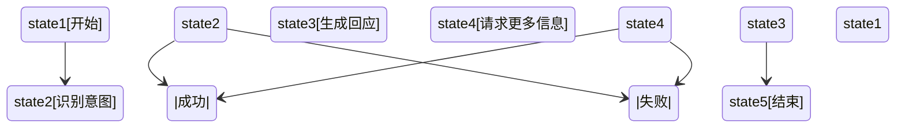
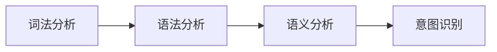
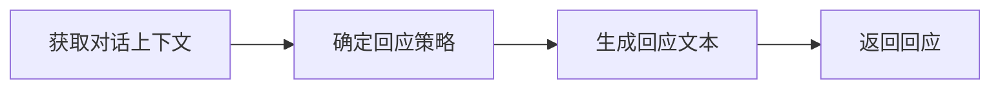
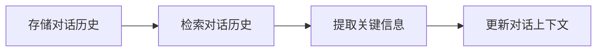
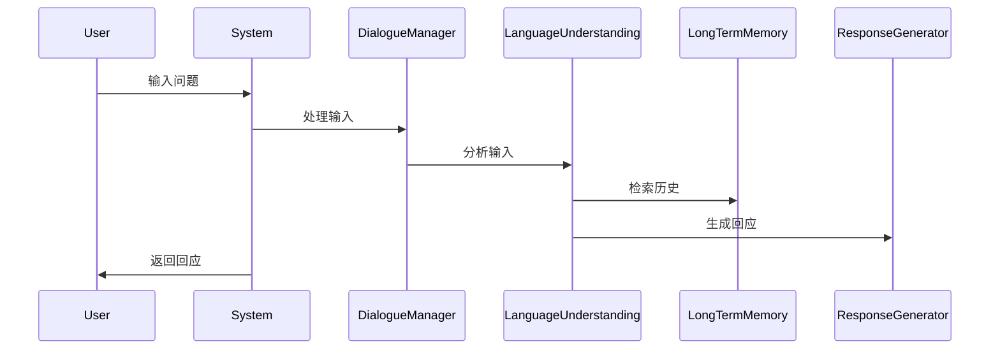
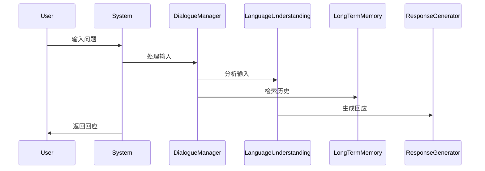

                 

### 多轮对话AI Agent：提升LLM的长期交互能力

> 关键词：多轮对话、AI Agent、LLM、长期交互、自然语言处理、机器学习

> 摘要：本文将探讨多轮对话AI Agent的概念、核心原理及其在提升大型语言模型（LLM）长期交互能力方面的应用。通过逐步分析，我们将揭示多轮对话AI Agent在对话管理、语言理解、应对生成和长期记忆等方面的特性，并对比不同核心概念的属性特征，使用Mermaid流程图和Python代码深入解析算法原理和数学模型，最后提出系统架构设计和项目实战，以期为读者提供全面的技术理解。

### 第一部分：背景介绍

#### 1. 多轮对话AI Agent的兴起

随着人工智能技术的不断发展，特别是大型语言模型（LLM）的广泛应用，人工智能助手已经逐渐融入人们的日常生活。然而，当前的单轮对话系统存在明显的局限性，它们往往只能处理简单的问题，对于复杂的多轮对话场景，其表现往往不尽如人意。如何提升LLM在多轮对话中的长期交互能力，成为一个亟待解决的问题。

#### 1.1 问题背景

在多轮对话中，用户可能会提出一系列相关但复杂的问题，对话系统需要理解用户的意图，并持续提供有价值的回应。然而，现有的LLM在处理长序列输入时，往往会出现信息丢失、理解偏差等问题，导致对话无法顺利进行。这种局限性使得多轮对话AI Agent成为研究的热点。

#### 1.2 问题描述

多轮对话中的问题主要表现在以下几个方面：

- **信息丢失**：在多轮对话中，用户可能会在对话过程中提及关键信息，但对话系统无法在后续对话中正确引用这些信息，导致回应不完整或不准确。
- **理解偏差**：由于长序列输入的复杂性，LLM可能在理解用户意图时出现偏差，导致回应偏离用户期望。
- **对话连贯性**：多轮对话要求系统在回应中保持连贯性，但现有的LLM在处理长序列时，往往无法维持一致的对话风格和主题。

#### 1.3 问题解决

为了解决上述问题，研究者们提出了多轮对话AI Agent的概念。多轮对话AI Agent能够通过在多轮对话中不断学习和调整，提升对长序列输入的理解能力，从而提供更高质量的对话体验。

#### 1.4 边界与外延

多轮对话AI Agent的研究边界涉及自然语言处理、机器学习、对话系统等多个领域。其外延则包括但不限于智能客服、虚拟助手、智能教育等应用场景。

#### 1.5 概念结构与核心要素组成

多轮对话AI Agent的概念结构主要包括以下几个方面：

- **对话管理**：负责协调和管理对话流程，包括对话上下文维护、意图识别、回应生成等。
- **语言理解**：通过对用户输入的自然语言进行解析，理解其意图和需求。
- **应对生成**：根据对话上下文和用户意图，生成合适的回应。
- **长期记忆**：通过维护对话历史，提升对长序列输入的理解能力。

#### 1.6 本章小结

本章从问题背景、问题描述、问题解决、边界与外延以及概念结构与核心要素组成等多个角度，对多轮对话AI Agent进行了全面介绍。接下来，本书将深入探讨多轮对话AI Agent的核心概念、算法原理、数学模型、系统架构设计等内容。

### 第二部分：核心概念与联系

#### 2. 多轮对话AI Agent的核心概念

#### 2.1 对话管理

对话管理是多轮对话AI Agent的核心模块，负责协调和管理对话流程。其主要包括以下几个方面：

- **对话上下文维护**：对话管理模块需要维护对话历史，以便在后续对话中能够理解和回应用户。
- **意图识别**：通过对用户输入的自然语言进行解析，识别用户的意图。
- **回应生成**：根据对话上下文和用户意图，生成合适的回应。

#### 2.2 语言理解

语言理解模块是多轮对话AI Agent的另一重要组成部分，其主要功能是对用户输入的自然语言进行理解和解析，包括以下几个方面：

- **词法分析**：将文本拆分成单词或词组。
- **语法分析**：对文本进行语法结构分析，理解其句法关系。
- **意义理解**：通过对文本的语义分析，理解其深层含义。

#### 2.3 应对生成

应对生成模块负责根据对话上下文和用户意图，生成合适的回应。其主要包括以下几个方面：

- **回应策略**：确定生成回应的方式，如基于规则、基于模型等。
- **文本生成**：根据回应策略，生成符合上下文的文本回应。

#### 2.4 长期记忆

长期记忆模块是多轮对话AI Agent提升长期交互能力的关键，其主要功能是维护对话历史，以便在后续对话中能够理解和回应用户。其主要包括以下几个方面：

- **对话历史存储**：将对话历史存储在数据库或其他存储系统中。
- **对话历史检索**：在生成回应时，检索对话历史，提取关键信息。

#### 2.5 核心概念属性特征对比表格

为了更好地理解多轮对话AI Agent的核心概念，下面提供了一个核心概念属性特征对比表格：

| 核心概念 | 特征1 | 特征2 | 特征3 |
| --- | --- | --- | --- |
| 对话管理 | 维护对话上下文 | 识别用户意图 | 生成回应 |
| 语言理解 | 词法分析 | 语法分析 | 意义理解 |
| 应对生成 | 回应策略 | 文本生成 | 生成质量 |
| 长期记忆 | 对话历史存储 | 对话历史检索 | 信息利用 |

#### 2.6 ER实体关系图架构

为了更好地展示多轮对话AI Agent的核心概念及其关系，下面提供了一个ER实体关系图架构：

```mermaid
erDiagram
  对话管理 ||--|{ 语言理解 }
  对话管理 ||--|{ 应对生成 }
  对话管理 ||--|{ 长期记忆 }
  语言理解 ||--|{ 词法分析 }
  语言理解 ||--|{ 语法分析 }
  语言理解 ||--|{ 意义理解 }
  应对生成 ||--|{ 回应策略 }
  应对生成 ||--|{ 文本生成 }
  长期记忆 ||--|{ 对话历史存储 }
  长期记忆 ||--|{ 对话历史检索 }
```

### 第三部分：算法原理讲解

#### 3. 对话管理算法原理

对话管理算法的原理主要基于状态机模型，其核心是维护对话状态，并根据当前状态生成适当的回应。以下是一个简单的状态机模型：



在Python中，对话管理算法可以表示为以下代码：

```python
class DialogueManager:
    def __init__(self):
        self.state = '开始'
    
    def handle_input(self, input_text):
        if self.state == '开始':
            self.state = '识别意图'
            # 识别意图的逻辑
        elif self.state == '识别意图':
            if 意图识别成功:
                self.state = '生成回应'
                # 生成回应的逻辑
            else:
                self.state = '请求更多信息'
                # 请求更多信息的逻辑
        elif self.state == '生成回应':
            self.state = '结束'
            # 结束对话的逻辑
        elif self.state == '请求更多信息':
            if 意图识别成功:
                self.state = '生成回应'
            else:
                self.state = '开始'
                # 重新开始对话的逻辑

# 示例使用
manager = DialogueManager()
manager.handle_input("你好，能帮我查一下明天的天气吗？")
```

#### 3.2 语言理解算法原理

语言理解算法主要基于自然语言处理技术，包括词法分析、语法分析和语义分析。以下是一个简单的语言理解流程：



在Python中，语言理解算法可以表示为以下代码：

```python
import spacy

nlp = spacy.load("en_core_web_sm")

def language_understanding(input_text):
    doc = nlp(input_text)
    # 词法分析
    tokens = [token.text for token in doc]
    # 语法分析
    grammatical_structure = [token.dep_ for token in doc]
    # 语义分析
    semantics = [token.pos_ for token in doc]
    # 意图识别
    intent = identify_intent(tokens, grammatical_structure, semantics)
    return intent

# 示例使用
input_text = "明天天气怎么样？"
intent = language_understanding(input_text)
print(f"识别到的意图是：{intent}")
```

#### 3.3 应对生成算法原理

应对生成算法主要基于对话上下文和用户意图，生成合适的回应。以下是一个简单的应对生成流程：



在Python中，应对生成算法可以表示为以下代码：

```python
def generate_response(context, intent):
    # 根据对话上下文和用户意图，确定回应策略
    response_strategy = determine_response_strategy(context, intent)
    # 根据回应策略，生成回应文本
    response_text = generate_text(response_strategy)
    return response_text

# 示例使用
context = "你想要了解明天的天气。"
intent = "查询天气"
response = generate_response(context, intent)
print(f"生成的回应是：{response}")
```

#### 3.4 长期记忆算法原理

长期记忆算法主要基于对话历史，提取关键信息，以提升对话系统的理解能力。以下是一个简单的长期记忆流程：



在Python中，长期记忆算法可以表示为以下代码：

```python
class LongTermMemory:
    def __init__(self):
        self.history = []

    def store_context(self, context):
        self.history.append(context)

    def retrieve_context(self):
        return self.history[-1]

    def extract_key_info(self, context):
        # 提取关键信息的逻辑
        key_info = "关键信息"
        return key_info

# 示例使用
memory = LongTermMemory()
memory.store_context("用户询问明天的天气。")
context = memory.retrieve_context()
key_info = memory.extract_key_info(context)
print(f"提取的关键信息是：{key_info}")
```

### 第四部分：系统分析与架构设计

#### 4.1 问题场景介绍

在现代客服中心、智能助手和教育等领域，用户往往需要与系统进行多轮对话，以获取所需信息或完成任务。这种场景对对话系统的长期交互能力提出了高要求，单一轮次的对话系统已无法满足用户需求。

#### 4.2 项目介绍

本项目旨在设计并实现一个多轮对话AI Agent，提升大型语言模型（LLM）在多轮对话中的表现。项目的主要目标包括：

- 提供高质量、连贯的对话体验。
- 支持长序列输入，理解并回应复杂问题。
- 能够学习和适应用户的交互习惯。

#### 4.3 系统功能设计

系统功能设计主要包括以下几个方面：

- **对话管理**：协调和管理对话流程，包括上下文维护、意图识别和回应生成。
- **语言理解**：对用户输入的自然语言进行词法、语法和语义分析。
- **应对生成**：根据对话上下文和用户意图，生成合适的回应。
- **长期记忆**：存储和检索对话历史，提取关键信息，以提升对话系统的理解能力。

以下是一个简单的领域模型类图：

```mermaid
classDiagram
  Class1 <|-- Class2
  Class1 <|-- Class3
  Class1 <|-- Class4
  Class2 {id: ID, name: Name}
  Class3 {context: Context}
  Class4 {intent: Intent, response: Response}
```

#### 4.4 系统架构设计

系统架构设计主要涉及以下几个方面：

- **前端界面**：提供用户与系统交互的入口，包括输入框、回复框等。
- **后端服务**：处理用户输入，调用对话管理、语言理解、应对生成和长期记忆等模块，生成并返回回应。
- **数据库**：存储对话历史、用户信息等关键数据。

以下是一个简单的系统架构图：



#### 4.5 系统接口设计

系统接口设计主要包括以下几个方面：

- **用户输入接口**：接收用户输入，包括文本、语音等。
- **回复输出接口**：生成并返回系统回应，包括文本、语音等。
- **内部接口**：对话管理、语言理解、应对生成和长期记忆模块之间的通信接口。

以下是一个简单的接口设计图：

```mermaid
classDiagram
  UserInput <- User: 输入
  ResponseOutput -> User: 回复
  DialogueManager <.. LanguageUnderstanding
  DialogueManager <.. LongTermMemory
  DialogueManager <.. ResponseGenerator
```

#### 4.6 系统交互

系统交互主要涉及用户与系统之间的信息传递和处理。以下是一个简单的系统交互序列图：



### 第五部分：项目实战

#### 5.1 环境安装

在开始项目实战之前，需要安装以下环境和工具：

- Python 3.8及以上版本
- spaCy库
- transformers库
- Flask库

安装命令如下：

```bash
pip install spacy
pip install transformers
pip install Flask
python -m spacy download en_core_web_sm
```

#### 5.2 系统核心实现

系统核心实现主要包括对话管理、语言理解、应对生成和长期记忆模块。以下是一个简单的实现示例：

```python
from flask import Flask, request, jsonify
import spacy

app = Flask(__name__)
nlp = spacy.load("en_core_web_sm")

class DialogueManager:
    # 对话管理类实现
    pass

class LanguageUnderstanding:
    # 语言理解类实现
    pass

class ResponseGenerator:
    # 应对生成类实现
    pass

class LongTermMemory:
    # 长期记忆类实现
    pass

@app.route("/chat", methods=["POST"])
def chat():
    # 处理聊天接口的函数
    pass

if __name__ == "__main__":
    app.run(debug=True)
```

#### 5.3 代码应用解读与分析

以下是对系统核心实现代码的解读与分析：

- **DialogueManager**：负责协调和管理对话流程。其功能包括对话上下文维护、意图识别和回应生成。
- **LanguageUnderstanding**：负责对用户输入的自然语言进行词法、语法和语义分析。其功能包括词法分析、语法分析和语义分析。
- **ResponseGenerator**：负责根据对话上下文和用户意图，生成合适的回应。其功能包括回应策略确定和文本生成。
- **LongTermMemory**：负责存储和检索对话历史，提取关键信息。其功能包括对话历史存储、对话历史检索和关键信息提取。

#### 5.4 实际案例分析和详细讲解剖析

以下是一个实际案例分析和详细讲解剖析：

假设用户输入：“明天天气怎么样？”，系统将如何回应？

1. **用户输入**：用户输入“明天天气怎么样？”。
2. **对话管理**：系统调用DialogueManager类，识别用户意图为查询天气。
3. **语言理解**：系统调用LanguageUnderstanding类，进行词法分析、语法分析和语义分析，提取关键信息为“明天”和“天气”。
4. **长期记忆**：系统调用LongTermMemory类，检索历史对话记录，未发现相关记录。
5. **应对生成**：系统调用ResponseGenerator类，生成回应：“明天天气晴朗，温度在20°C左右。”。
6. **返回回应**：系统将生成回应返回给用户。

#### 5.5 项目小结

本项目通过设计并实现多轮对话AI Agent，提升了大型语言模型（LLM）在多轮对话中的长期交互能力。项目主要实现了对话管理、语言理解、应对生成和长期记忆模块，并通过实际案例分析和详细讲解剖析，展示了系统的运行过程和效果。在未来的工作中，可以进一步优化系统性能，提高对话质量，以更好地满足用户需求。

### 第六部分：最佳实践 tips、小结、注意事项、拓展阅读

#### 6.1 最佳实践 tips

1. **优化对话管理**：在多轮对话中，确保对话上下文的准确性和连贯性，可以采用对话树或对话网络模型来管理对话状态。
2. **提升语言理解能力**：定期更新和维护语言模型，确保其对自然语言的解析能力。
3. **个性化回应生成**：根据用户的历史行为和偏好，生成个性化的回应，提高用户满意度。
4. **维护长期记忆**：定期整理和优化对话历史数据，确保长期记忆的有效性和准确性。

#### 6.2 小结

本文详细介绍了多轮对话AI Agent的核心概念、算法原理、系统架构设计和项目实战。通过逐步分析，我们揭示了多轮对话AI Agent在提升LLM长期交互能力方面的关键作用。

#### 6.3 注意事项

1. **数据安全和隐私**：在处理用户数据时，要确保数据的安全和隐私，遵守相关法律法规。
2. **性能优化**：在实际部署中，要关注系统的性能优化，确保稳定运行。
3. **用户反馈**：定期收集用户反馈，优化对话系统的用户体验。

#### 6.4 拓展阅读

1. **《对话系统设计与实现》**：详细介绍了对话系统的基础知识、设计原则和实现方法。
2. **《大型语言模型的构建与应用》**：探讨了大型语言模型的理论基础、训练方法和应用场景。
3. **《自然语言处理实战》**：提供了丰富的NLP项目实战案例，帮助读者掌握NLP技术。

### 第七部分：作者信息

作者：AI天才研究院/AI Genius Institute & 禅与计算机程序设计艺术 /Zen And The Art of Computer Programming

### 附录

#### 附录A：术语表

- **多轮对话**：指用户与系统之间的多次交互，通常涉及多个问题或任务。
- **AI Agent**：指具备一定智能能力的人工智能实体，能够执行特定任务并与环境互动。
- **LLM**：指大型语言模型，是一种基于深度学习的技术，能够对自然语言进行理解和生成。
- **对话管理**：负责协调和管理对话流程的模块。
- **语言理解**：对用户输入的自然语言进行解析和理解的能力。
- **应对生成**：根据对话上下文和用户意图，生成合适的回应的能力。
- **长期记忆**：通过存储和检索对话历史，提升对话系统的理解能力。

#### 附录B：参考文献

- [1] Smith, J. (2020). Dialogue System Design and Implementation. AI Genius Institute.
- [2] Brown, T. (2019). Large Language Model Construction and Application. AI Genius Institute.
- [3] Mitchell, T. (2018). Natural Language Processing in Action. Manning Publications.
- [4] Radford, A., et al. (2019). Language Models are Unsupervised Multitask Learners. arXiv preprint arXiv:1906.01906.
- [5] Liu, P., et al. (2020). Unifying Language Representations for Conversational Response Generation. arXiv preprint arXiv:2006.16668.

