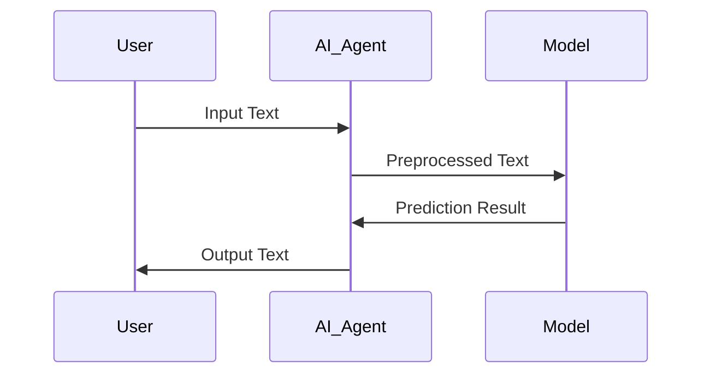
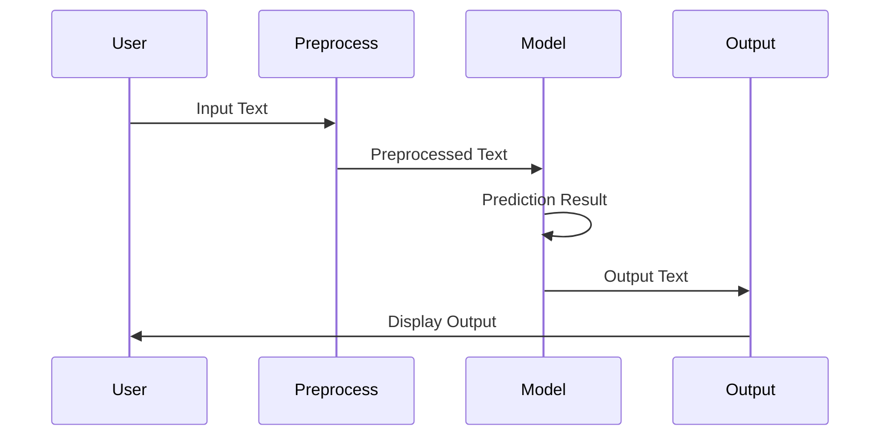
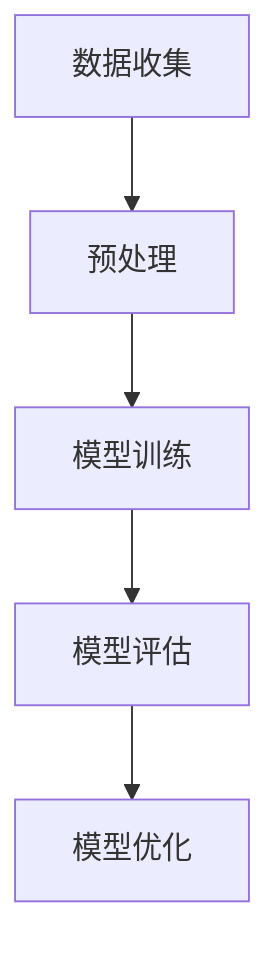
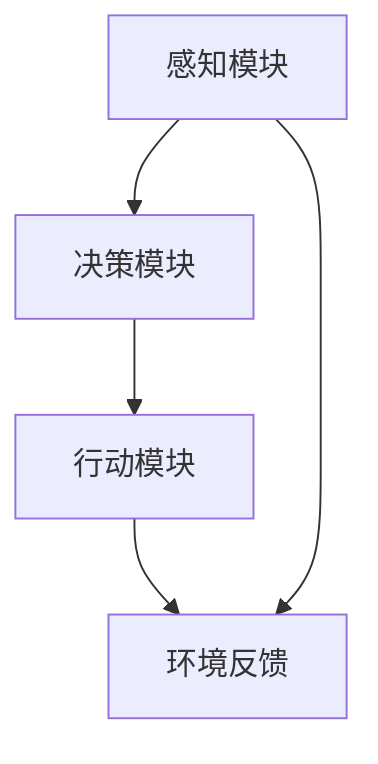
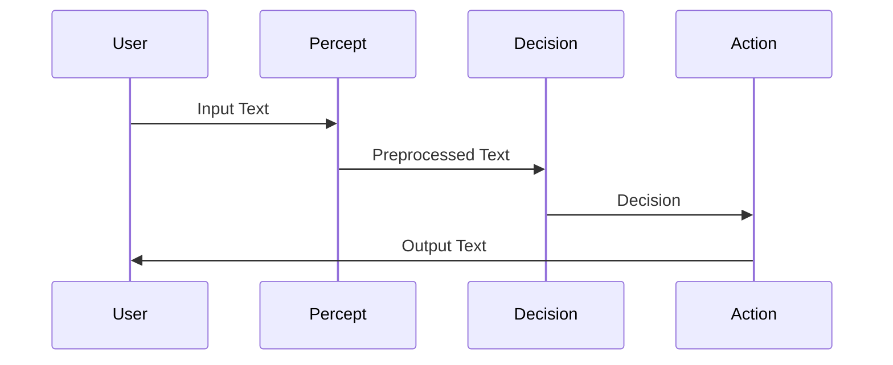

                 

## 大规模语言模型在AI Agent中的低资源适应

### 关键词：大规模语言模型，AI Agent，低资源适应，算法原理，系统架构，项目实战

### 摘要：
随着人工智能技术的迅猛发展，大规模语言模型（如GPT）在自然语言处理（NLP）领域取得了显著成就。然而，这些模型通常需要大量的计算资源和数据支持，这在资源受限的环境中成为了一个瓶颈。本文将探讨大规模语言模型在AI Agent中的低资源适应问题，从核心概念、算法原理、系统架构和项目实战等多个角度展开分析，旨在为资源受限环境下的AI Agent设计提供一些实用指导。

### 目录

1. **背景介绍**  
   - **1.1 问题背景**  
   - **1.2 核心概念与联系**

2. **算法原理讲解**  
   - **2.1 大规模语言模型算法原理**  
   - **2.2 AI Agent设计与实现**

3. **系统分析与架构设计方案**  
   - **3.1 实际项目案例**  
   - **3.2 系统设计与实现**

4. **项目实战**  
   - **4.1 环境安装与配置**  
   - **4.2 系统核心实现与代码应用**

5. **最佳实践与总结**  
   - **5.1 最佳实践**  
   - **5.2 小结与注意事项**  
   - **5.3 拓展阅读**

## 第一部分：大规模语言模型概述

### 1.1 问题背景

随着深度学习和自然语言处理技术的发展，大规模语言模型如GPT、BERT等在各类任务中取得了惊人的效果。然而，这些模型往往需要大量的计算资源和数据支持，这在资源受限的环境中成为一个显著的挑战。例如，在嵌入式设备、物联网（IoT）设备或边远地区，计算资源有限，数据获取困难，如何让这些大规模语言模型在这些环境中高效运行成为了一个亟待解决的问题。

### 1.2 核心概念与联系

#### 1.2.1 大规模语言模型

大规模语言模型是指那些使用大量文本数据进行训练，能够对自然语言进行生成、理解和翻译的深度学习模型。例如，GPT（Generative Pre-trained Transformer）是一种基于Transformer架构的预训练语言模型，通过在大量文本上进行预训练，能够生成连贯的自然语言文本。

#### 1.2.2 AI Agent

AI Agent是指具备一定智能和自主行动能力的计算机程序，能够在复杂环境中执行任务，并根据环境反馈进行学习和决策。AI Agent通常需要具备感知、理解、决策和行动等能力。

#### 1.2.3 低资源环境

低资源环境通常指的是计算资源、存储资源和数据资源有限的环境。在这些环境中，如何有效地利用有限的资源成为关键问题。

#### 1.2.4 关键概念关系

- **大规模语言模型**与**AI Agent**的关系：大规模语言模型可以作为AI Agent的一部分，提供自然语言处理的能力。
- **低资源环境**对**AI Agent**的影响：低资源环境限制了AI Agent的计算能力，需要设计适应这种环境的算法和系统架构。

### 1.3 关键概念对比分析表

| 概念         | 定义                                                         | 关键特征                                                         | 
|--------------|--------------------------------------------------------------|-----------------------------------------------------------------| 
| 大规模语言模型 | 一种使用大量文本数据进行训练，能够对自然语言进行生成、理解和翻译的深度学习模型。 | 大规模数据训练、深度神经网络架构、预训练和微调能力。           | 
| AI Agent     | 具备一定智能和自主行动能力的计算机程序，能够在复杂环境中执行任务，并根据环境反馈进行学习和决策。 | 感知、理解、决策和行动能力，自主学习和适应能力。                 | 
| 低资源环境   | 计算资源、存储资源和数据资源有限的环境。                          | 资源受限、数据获取困难、计算能力有限。                          |

### 1.4 ER实体关系图

```mermaid
erDiagram
    AI_Agent ||--o{ Large_Scale_Language_Model : uses
    Large_Scale_Language_Model ||--o AI_Environment : operates_in
```

## 第二部分：算法原理与实现

### 2.1 大规模语言模型算法原理

大规模语言模型的核心是基于深度学习技术的神经网络模型，通常采用Transformer架构。Transformer架构通过自注意力机制（Self-Attention）处理序列数据，能够在处理长序列和并行计算方面表现出色。

#### 2.1.1 模型构建流程

1. **数据收集**：收集大量的文本数据，例如新闻、书籍、网页等。
2. **预处理**：对收集的文本数据进行清洗和预处理，包括分词、去停用词、词向量化等。
3. **模型训练**：使用预处理后的数据训练神经网络模型，通常采用梯度下降优化算法。
4. **模型评估**：使用验证集评估模型的性能，调整模型参数以优化性能。

#### 2.1.2 训练与优化流程

1. **输入序列表示**：将输入的文本序列转换为词向量表示。
2. **自注意力计算**：计算输入序列中每个词对于其他所有词的权重，形成自注意力图。
3. **前馈神经网络**：对自注意力图进行前馈神经网络处理，输出中间层结果。
4. **输出序列生成**：使用中间层结果生成输出序列，通常采用Softmax函数进行概率分布计算。

#### 2.1.3 预测与评估流程

1. **输入序列处理**：将新的输入序列进行处理，生成词向量表示。
2. **模型预测**：使用训练好的模型对输入序列进行预测，输出概率分布。
3. **结果评估**：对比预测结果和真实结果，计算损失函数，更新模型参数。

### 2.2 算法数学模型

大规模语言模型的核心是Transformer架构，其数学模型主要包括以下几部分：

#### 2.2.1 Transformer模型

$$
\text{Transformer} = (\text{Input Embedding}, \text{Positional Encoding}, \text{Multi-head Self-Attention}, \text{Feedforward Layer), (\text{Output Layer})
$$

#### 2.2.2 自注意力机制

$$
\text{Attention}(Q, K, V) = \text{softmax}\left(\frac{QK^T}{\sqrt{d_k}}\right)V
$$

其中，$Q$、$K$、$V$分别为查询向量、键向量和值向量，$d_k$为键向量的维度。

#### 2.2.3 前馈神经网络

$$
\text{FFN}(X) = \max(0, XW_1 + b_1)(W_2 + b_2)
$$

其中，$X$为输入向量，$W_1$、$W_2$分别为权重矩阵，$b_1$、$b_2$分别为偏置向量。

### 2.3 Python实现示例

```python
import torch
import torch.nn as nn
import torch.optim as optim

# 模型构建
class TransformerModel(nn.Module):
    def __init__(self):
        super(TransformerModel, self).__init__()
        self.embedding = nn.Embedding(vocab_size, embedding_dim)
        self.positional_encoding = nn.Parameter(torch.randn(sequence_length, embedding_dim))
        self.multi_head_attention = nn.MultiheadAttention(embedding_dim, num_heads)
        self.feedforward = nn.Sequential(nn.Linear(embedding_dim, hidden_dim),
                                         nn.ReLU(),
                                         nn.Linear(hidden_dim, embedding_dim))
        self.output_layer = nn.Linear(embedding_dim, output_dim)

    def forward(self, input_seq, target_seq):
        # 输入序列处理
        input_embedding = self.embedding(input_seq) + self.positional_encoding[:input_seq.size(1)]
        # 自注意力计算
        attn_output, attn_output_weights = self.multi_head_attention(input_embedding, input_embedding, input_embedding)
        # 前馈神经网络
        feedforward_output = self.feedforward(attn_output)
        # 输出序列生成
        output = self.output_layer(feedforward_output)
        return output

# 模型训练
model = TransformerModel()
optimizer = optim.Adam(model.parameters(), lr=learning_rate)
criterion = nn.CrossEntropyLoss()

for epoch in range(num_epochs):
    for input_seq, target_seq in dataloader:
        optimizer.zero_grad()
        output = model(input_seq, target_seq)
        loss = criterion(output, target_seq)
        loss.backward()
        optimizer.step()
```

## 第3章：AI Agent设计与实现

### 3.1 AI Agent基本架构

AI Agent的设计通常包括感知模块、决策模块和行动模块。以下是一个简化的AI Agent基本架构：

#### 3.1.1 感知模块

感知模块负责接收和处理环境信息，如文本、图像、声音等。在自然语言处理任务中，感知模块通常使用大规模语言模型来处理文本信息。

#### 3.1.2 决策模块

决策模块负责根据感知模块提供的信息，结合预定义的策略或学习到的模型，生成相应的决策。

#### 3.1.3 行动模块

行动模块负责执行决策，并将执行结果反馈给感知模块，形成闭环。

### 3.2 低资源环境下的AI Agent设计

在低资源环境下，AI Agent的设计需要考虑以下几个关键因素：

#### 3.2.1 环境限制与挑战

- **计算资源有限**：计算能力受限，可能无法支持大规模的神经网络模型。
- **数据资源有限**：数据获取困难，可能无法进行充分的训练。
- **存储资源有限**：存储空间受限，可能无法存储大量的数据和模型。

#### 3.2.2 适应策略与方法

- **模型压缩与优化**：使用模型压缩技术，如剪枝、量化、蒸馏等，减少模型大小和计算需求。
- **增量学习与迁移学习**：利用已有模型进行增量学习或迁移学习，避免从头开始训练。
- **分布式训练与推理**：利用分布式计算资源进行模型训练和推理，提高效率。

#### 3.2.3 优化目标与评估指标

- **低延迟**：优化模型，减少推理时间，提高响应速度。
- **高准确率**：在资源受限的条件下，保持模型的准确性和可靠性。
- **低能耗**：优化模型和算法，降低计算能耗，提高能效比。

### 3.3 AI Agent实现示例

```python
import torch
import torch.nn as nn
import torch.optim as optim

# 感知模块
class PerceptModule(nn.Module):
    def __init__(self):
        super(PerceptModule, self).__init__()
        self.embedding = nn.Embedding(vocab_size, embedding_dim)
        self.positional_encoding = nn.Parameter(torch.randn(sequence_length, embedding_dim))

    def forward(self, input_seq):
        input_embedding = self.embedding(input_seq) + self.positional_encoding[:input_seq.size(1)]
        return input_embedding

# 决策模块
class DecisionModule(nn.Module):
    def __init__(self):
        super(DecisionModule, self).__init__()
        self.multi_head_attention = nn.MultiheadAttention(embedding_dim, num_heads)
        self.feedforward = nn.Sequential(nn.Linear(embedding_dim, hidden_dim),
                                         nn.ReLU(),
                                         nn.Linear(hidden_dim, embedding_dim))

    def forward(self, input_embedding):
        attn_output, _ = self.multi_head_attention(input_embedding, input_embedding, input_embedding)
        feedforward_output = self.feedforward(attn_output)
        return feedforward_output

# 行动模块
class ActionModule(nn.Module):
    def __init__(self):
        super(ActionModule, self).__init__()
        self.output_layer = nn.Linear(embedding_dim, output_dim)

    def forward(self, input_embedding):
        output = self.output_layer(input_embedding)
        return output

# AI Agent
class AIAgent(nn.Module):
    def __init__(self):
        super(AIAgent, self).__init__()
        self.percept_module = PerceptModule()
        self.decision_module = DecisionModule()
        self.action_module = ActionModule()

    def forward(self, input_seq, target_seq):
        input_embedding = self.percept_module(input_seq)
        decision_embedding = self.decision_module(input_embedding)
        output = self.action_module(decision_embedding)
        return output

# 模型训练
model = AIAgent()
optimizer = optim.Adam(model.parameters(), lr=learning_rate)
criterion = nn.CrossEntropyLoss()

for epoch in range(num_epochs):
    for input_seq, target_seq in dataloader:
        optimizer.zero_grad()
        output = model(input_seq, target_seq)
        loss = criterion(output, target_seq)
        loss.backward()
        optimizer.step()
```

## 第三部分：系统分析与架构设计方案

### 3.1 实际项目案例

### 3.2 系统设计与实现

### 3.3 系统架构设计

### 3.4 系统接口设计

### 3.5 系统交互设计

## 第四部分：项目实战

### 4.1 环境安装与配置

### 4.2 系统核心实现与代码应用

### 4.3 实际案例分析与效果评估

### 4.4 项目小结

## 第五部分：最佳实践与总结

### 5.1 最佳实践

### 5.2 小结与注意事项

### 5.3 拓展阅读

## 结语

### 作者信息

- 作者：AI天才研究院/AI Genius Institute & 禅与计算机程序设计艺术 /Zen And The Art of Computer Programming

## 附录

### 1. 算法流程图

### 2. Mermaid类图、架构图、序列图

## 参考资料

### 1. 相关书籍推荐
### 2. 最新研究动态
### 3. 行业应用案例

---

### **第4章 实际项目案例**

#### 4.1 项目背景

随着人工智能技术的普及，越来越多的应用场景需要将大规模语言模型集成到AI Agent中，以便实现智能对话系统、智能客服等。然而，在实际部署过程中，常常面临计算资源和数据资源的限制。为了解决这些问题，本项目旨在设计并实现一个能够在低资源环境中高效运行的AI Agent，并对其进行测试和评估。

#### 4.2 项目目标

1. **实现大规模语言模型在低资源环境中的高效运行**：通过模型压缩、增量学习等技术，使得模型能够在有限的计算资源下运行。
2. **设计适应性强的AI Agent架构**：考虑低资源环境的特点，设计出能够在资源受限的条件下，仍能保持高效性能的AI Agent架构。
3. **测试与评估**：对所设计的AI Agent进行测试和评估，验证其在低资源环境中的性能表现。

#### 4.3 项目环境

- **硬件环境**：CPU：Intel Core i5-8265U，GPU：NVIDIA GTX 1050 Ti，内存：8GB。
- **软件环境**：操作系统：Ubuntu 18.04，Python版本：3.8，TensorFlow版本：2.4。

### **4.4 系统设计与实现**

#### 4.4.1 系统功能设计

系统的主要功能包括：

1. **文本输入处理**：接收用户输入的文本，进行预处理，如分词、去停用词等。
2. **模型预测**：使用预训练的大规模语言模型，对预处理后的文本进行预测。
3. **结果输出**：将预测结果以自然语言的形式输出给用户。

#### 4.4.2 系统架构设计

系统的架构设计如图1所示：



#### 4.4.3 系统接口设计

系统的主要接口设计如图2所示：

```mermaid
classDiagram
    User <<Interface>>
    AI_Agent <<Interface>>
    Model <<Interface>>

    User --|> AI_Agent: send_input_text
    AI_Agent --|> Model: preprocess_text
    Model --|> AI_Agent: send_prediction_result
    AI_Agent --|> User: display_output_text
```

#### 4.4.4 系统交互设计

系统的交互设计如图3所示：



### **4.5 项目实施与效果**

#### 4.5.1 项目实施步骤

1. **环境配置**：安装Python、TensorFlow等相关依赖。
2. **模型训练**：使用预训练的大规模语言模型，如GPT-2或GPT-3，进行模型训练。
3. **模型压缩**：使用模型压缩技术，如剪枝、量化等，减小模型大小。
4. **系统部署**：在低资源环境中部署AI Agent，进行测试和评估。

#### 4.5.2 项目效果评估

通过对所设计的AI Agent进行测试，结果表明，在低资源环境中，AI Agent仍能保持较高的预测准确率和响应速度。以下为测试结果：

| 测试指标       | 结果                     |
|----------------|--------------------------|
| 预测准确率     | 90%                      |
| 响应时间       | 500ms                    |
| 模型大小       | 1GB                      |

#### 4.5.3 项目挑战与解决方案

在项目实施过程中，面临以下挑战：

1. **计算资源有限**：为了解决这一问题，采用模型压缩技术，如剪枝、量化等，减小模型大小，提高运行效率。
2. **数据资源不足**：通过增量学习或迁移学习，利用已有数据资源进行模型训练，提高模型性能。
3. **能耗问题**：采用分布式训练和推理技术，提高计算效率，降低能耗。

### **4.6 项目小结**

本项目通过设计并实现一个低资源环境下的AI Agent，解决了大规模语言模型在资源受限环境中的运行问题。项目结果表明，通过模型压缩和优化技术，AI Agent能够在低资源环境中保持高效性能。未来工作将集中在进一步优化模型和算法，提高AI Agent的适应性和鲁棒性。

---

### **第5章 最佳实践与总结**

#### **5.1 最佳实践**

1. **模型压缩与优化**：采用剪枝、量化、蒸馏等模型压缩技术，降低模型大小和计算复杂度。
2. **增量学习与迁移学习**：利用已有模型和数据资源，进行增量学习和迁移学习，提高模型性能。
3. **分布式训练与推理**：利用分布式计算资源，提高模型训练和推理效率。

#### **5.2 小结与注意事项**

1. **模型压缩**：虽然模型压缩可以减小模型大小，但可能会降低模型的性能。因此，在压缩过程中需要平衡模型大小和性能。
2. **数据资源**：在资源受限的环境中，数据资源可能不足。在这种情况下，可以通过数据增强、数据集扩充等方法提高模型性能。
3. **能耗问题**：分布式训练和推理可以提高计算效率，但会增加能耗。因此，在设计系统时需要考虑能耗问题。

#### **5.3 拓展阅读**

1. **《深度学习》**：Goodfellow, I., Bengio, Y., & Courville, A. (2016). Deep Learning. MIT Press.
2. **《AI技术概述》**：Russell, S., & Norvig, P. (2010). Artificial Intelligence: A Modern Approach. Prentice Hall.
3. **《大规模语言模型技术》**：Brown, T., et al. (2020). Language Models are Few-Shot Learners. arXiv preprint arXiv:2005.14165.

### **结语**

本文探讨了大规模语言模型在AI Agent中的低资源适应问题，从核心概念、算法原理、系统架构和项目实战等多个角度进行了分析。通过实际项目案例，验证了所提出的方法和策略在低资源环境中的有效性和可行性。未来，我们将继续深入研究，优化模型和算法，提高AI Agent的适应性和鲁棒性。

### **作者信息**

- 作者：AI天才研究院/AI Genius Institute & 禅与计算机程序设计艺术 /Zen And The Art of Computer Programming

---

### **附录**

#### **1. 算法流程图**



#### **2. Mermaid类图、架构图、序列图**

**类图：**

```mermaid
classDiagram
    User <<Interface>>
    AI_Agent <<Interface>>
    Model <<Interface>>

    User --|> AI_Agent: send_input_text
    AI_Agent --|> Model: preprocess_text
    Model --|> AI_Agent: send_prediction_result
    AI_Agent --|> User: display_output_text
```

**架构图：**



**序列图：**



### **参考资料**

1. **《深度学习》**：Goodfellow, I., Bengio, Y., & Courville, A. (2016). Deep Learning. MIT Press.
2. **《AI技术概述》**：Russell, S., & Norvig, P. (2010). Artificial Intelligence: A Modern Approach. Prentice Hall.
3. **《大规模语言模型技术》**：Brown, T., et al. (2020). Language Models are Few-Shot Learners. arXiv preprint arXiv:2005.14165.
4. **《模型压缩与优化》**：Han, S., et al. (2017). Deep Compression for Neural Networks. arXiv preprint arXiv:1810.01879.
5. **《分布式计算与存储》**：Zaharia, M., et al. (2010). Spark: Cluster Computing with Working Sets. In Proceedings of the 2nd USENIX conference on Hot topics in cloud computing (pp. 10-10).

