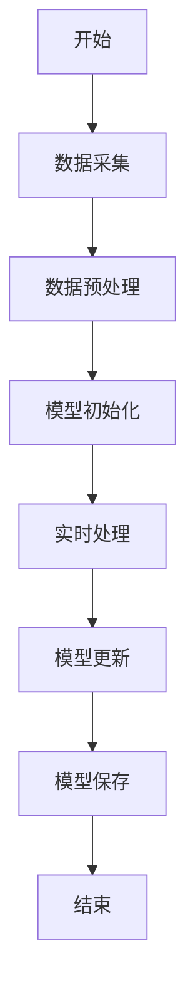

                 

## 实时学习AI Agent：LLM的在线增量学习

### 关键词：实时学习、AI Agent、LLM、在线增量学习、算法实现

#### 摘要：

本文将探讨实时学习AI Agent的概念及其在LLM（大型语言模型）中的在线增量学习技术。首先，我们定义并介绍实时学习AI Agent的基本概念、重要性及其与传统机器学习的区别。接着，我们深入分析LLM的基本原理和在线增量学习的重要性，探讨其方法与挑战。随后，文章将详细描述实时学习AI Agent的核心技术、实现流程及其性能优化。在此基础上，文章将详细介绍LLM的在线增量学习算法，包括常见算法、mermaid流程图和Python代码实现。通过实际案例分析，我们将展示实时学习AI Agent在不同领域的应用。最后，文章将总结实时学习AI Agent的发展趋势、潜在应用领域以及未来挑战，并提出最佳实践和注意事项。

## 实时学习AI Agent的概念与重要性

### 实时学习AI Agent的定义

实时学习AI Agent是指能够动态适应环境变化、不断更新知识库并优化自身行为的智能体。与传统机器学习模型相比，实时学习AI Agent具有自我适应和自我优化的能力，能够在不断接收新数据的同时，快速调整模型参数，从而提高决策的准确性和效率。

### 实时学习AI Agent与传统机器学习的区别

#### 数据处理方式

传统机器学习通常采用批量处理（Batch Processing）的方式，将所有数据一次性加载到内存中，进行训练和验证。这种方式在处理大规模数据时，可能会出现计算资源不足、训练时间过长等问题。而实时学习AI Agent则采用流处理（Stream Processing）的方式，将数据分批次实时输入，进行在线更新和优化。

#### 模型更新机制

传统机器学习模型在训练完成后，通常会固定一段时间，不再更新。而实时学习AI Agent则具备实时更新模型的能力，根据新数据的变化，自动调整模型参数，使其更贴近当前环境。

#### 应用场景

传统机器学习模型适用于静态或变化较慢的场景，例如图像分类、语音识别等。而实时学习AI Agent则适用于动态变化、对实时性要求较高的场景，如智能推荐系统、实时监控与预警系统等。

### 实时学习AI Agent的重要性

#### 灵活性

实时学习AI Agent能够快速适应环境变化，提高系统的灵活性和响应能力。这对于需要实时处理的任务，如金融市场的实时监控、智能交通系统的动态调度等具有重要意义。

#### 精准度

通过实时更新模型，实时学习AI Agent能够不断优化自身性能，提高预测和决策的准确性。这在医疗诊断、智能制造等领域具有广泛的应用价值。

#### 自适应

实时学习AI Agent能够根据新数据和环境反馈，自动调整自身行为，实现自我进化。这对于需要长期运行且不断改进的系统，如智能客服、智能安防等具有重要意义。

## LLM的在线增量学习

### LLM的基本概念

LLM（Large Language Model）是指大型语言模型，它是一种能够理解和生成自然语言文本的深度学习模型。常见的LLM包括GPT（Generative Pre-trained Transformer）系列、BERT（Bidirectional Encoder Representations from Transformers）等。这些模型通过在大规模语料库上进行预训练，学会了语言的基本结构和语义信息，从而能够进行文本生成、情感分析、机器翻译等任务。

### LLM在线增量学习的重要性

#### 适应性强

在线增量学习使得LLM能够实时更新模型参数，适应新数据和新的语言模式，从而提高模型的泛化能力和适应性。

#### 提高效率

通过在线增量学习，LLM能够实时处理和分析数据，减少了模型的冷启动时间，提高了系统的响应速度和处理效率。

#### 降低成本

在线增量学习减少了模型重新训练的需求，降低了计算资源和时间成本。同时，它还能够根据业务需求，有针对性地更新模型，避免过度拟合。

### LLM在线增量学习的方法与挑战

#### 方法

1. **数据流处理**：将新的数据流实时输入到模型中，进行在线更新和优化。
2. **增量学习算法**：如固定窗口算法、顺序覆盖算法、增量梯度下降算法等，用于处理新数据并更新模型参数。
3. **模型融合**：将旧模型与新模型进行融合，保留旧模型的优势，同时利用新模型的改进。

#### 挑战

1. **计算资源消耗**：在线增量学习需要实时处理大量数据，对计算资源有较高要求。
2. **数据质量**：新数据的质量直接影响模型的性能，需要确保数据的有效性和准确性。
3. **模型稳定性**：在线增量学习可能导致模型参数的剧烈波动，影响模型的稳定性。

## 实时学习AI Agent的核心技术与实现

### 实时学习AI Agent的关键技术

#### 实时数据处理技术

实时数据处理技术是实现实时学习AI Agent的基础，主要包括数据采集、数据预处理和实时处理等环节。数据采集需要确保数据的及时性和准确性，数据预处理包括数据清洗、格式转换和特征提取等，实时处理则涉及流处理框架和实时分析算法。

#### 在线学习算法

在线学习算法是实时学习AI Agent的核心，用于处理实时数据并更新模型参数。常见的在线学习算法包括梯度下降法、动量法、RMSprop等。这些算法在处理实时数据时，能够快速调整模型参数，提高模型性能。

#### 模型更新与保存

模型更新与保存是实时学习AI Agent的关键步骤。模型更新策略需要根据具体应用场景和业务需求进行设计，如固定窗口策略、顺序覆盖策略等。模型保存与加载则用于确保模型的持续运行和快速部署。

### 实时学习AI Agent的实现流程

#### 数据采集

实时学习AI Agent首先需要从数据源采集实时数据，包括文本、图像、语音等多种形式。数据采集过程中，需要关注数据的及时性、准确性和完整性。

#### 数据预处理

在数据采集完成后，需要对数据进行预处理，包括数据清洗、格式转换和特征提取等。数据清洗主要用于去除无效数据和噪声，格式转换则确保数据格式的一致性，特征提取则用于提取数据的关键特征。

#### 实时处理

实时处理是实时学习AI Agent的核心环节，包括数据流处理和在线学习算法。数据流处理框架如Apache Kafka、Flink等，用于处理大规模实时数据。在线学习算法则根据实时数据，不断更新模型参数，提高模型性能。

#### 模型更新与保存

在实时处理过程中，实时学习AI Agent需要根据实时数据，不断更新模型参数，以提高模型的泛化能力和适应性。同时，需要定期保存模型，确保模型能够在不同时间段保持稳定和高效。

### 实时学习AI Agent的性能优化

#### 数据处理优化

优化数据处理流程，提高数据采集、预处理和实时处理的效率，如使用高效的数据采集工具、优化数据预处理算法等。

#### 模型优化

通过调整模型参数、优化模型结构，提高模型在实时数据上的表现。如使用更深的神经网络结构、引入正则化技术等。

#### 系统优化

优化系统架构和运行环境，提高实时学习AI Agent的整体性能。如使用高性能计算硬件、优化系统资源分配等。

## LLM的在线增量学习算法详解

### 常见LLM在线增量学习算法介绍

#### 固定窗口算法

固定窗口算法是指将历史数据进行分段，每段数据作为固定窗口，实时学习AI Agent在窗口内更新模型。该方法具有计算简单、易于实现的特点，但可能会导致模型在处理新数据时，无法充分利用历史信息。

#### 顺序覆盖算法

顺序覆盖算法是指每次处理新的数据时，将旧数据替换为新的数据，逐步覆盖历史数据。该方法能够充分利用历史信息，但可能会导致模型在处理新数据时，信息更新过快。

#### 增量梯度下降算法

增量梯度下降算法是指每次处理新的数据时，只更新模型的一部分参数，从而降低计算复杂度。该方法具有较高的计算效率，但需要根据具体应用场景进行参数调整。

### 增量学习算法的mermaid流程图



### 增量学习算法的Python实现与代码解析

```python
import numpy as np

# 模型初始化
def initialize_model():
    # 初始化模型参数
    weights = np.random.randn()
    return weights

# 数据预处理
def preprocess_data(data):
    # 数据清洗、格式转换和特征提取
    processed_data = ...
    return processed_data

# 实时处理
def real_time_process(data, model):
    processed_data = preprocess_data(data)
    # 更新模型参数
    model = update_model(processed_data, model)
    return model

# 模型更新
def update_model(data, model):
    # 计算梯度
    gradient = compute_gradient(data, model)
    # 更新模型参数
    model -= learning_rate * gradient
    return model

# 计算梯度
def compute_gradient(data, model):
    # 根据数据计算模型参数的梯度
    gradient = ...
    return gradient

# 主程序
if __name__ == "__main__":
    # 初始化模型
    model = initialize_model()
    
    # 数据采集
    data = ...
    
    # 实时处理
    model = real_time_process(data, model)
    
    # 模型保存
    save_model(model)
```

## 实时学习AI Agent的应用案例分析

### 案例一：智能客服机器人

#### 应用背景

智能客服机器人是实时学习AI Agent在客户服务领域的典型应用。它能够实时响应用户的咨询，提供即时、准确的答案，提高客户满意度和服务效率。

#### 应用场景

1. **在线客服**：智能客服机器人可以实时解答用户在网站、社交媒体等平台上提出的问题。
2. **智能导购**：在电商平台，智能客服机器人可以根据用户的浏览记录和购物需求，提供个性化的推荐。
3. **问题诊断**：智能客服机器人可以自动诊断用户设备故障，提供解决方案。

#### 实现步骤

1. **数据采集**：从用户提问和回答中收集数据，包括问题、答案、用户满意度等。
2. **数据预处理**：清洗和格式化数据，提取关键特征。
3. **模型训练**：使用收集到的数据训练语言模型，如GPT-3。
4. **模型部署**：将训练好的模型部署到在线客服系统中，实现实时交互。
5. **模型优化**：根据用户反馈，不断调整和优化模型参数，提高回答的准确性和满意度。

### 案例二：股票交易策略优化

#### 应用背景

股票交易策略优化是实时学习AI Agent在金融领域的应用，它能够根据实时市场数据，动态调整交易策略，提高交易收益。

#### 应用场景

1. **量化交易**：实时学习AI Agent可以根据历史交易数据和实时市场数据，制定量化交易策略，实现自动交易。
2. **风险控制**：实时学习AI Agent可以实时监控市场风险，提供风险预警和应对策略。
3. **市场预测**：实时学习AI Agent可以根据市场数据，预测市场走势，为投资者提供决策支持。

#### 实现步骤

1. **数据采集**：从股票交易所、新闻媒体等渠道收集实时市场数据。
2. **数据预处理**：清洗和格式化数据，提取关键特征，如股票价格、成交量、技术指标等。
3. **模型训练**：使用收集到的数据训练交易策略模型，如LSTM（长短时记忆网络）。
4. **模型部署**：将训练好的模型部署到交易系统中，实现实时交易策略的调整和优化。
5. **模型优化**：根据交易结果和市场反馈，不断调整和优化模型参数，提高交易策略的收益和稳定性。

### 案例三：智能医疗诊断系统

#### 应用背景

智能医疗诊断系统是实时学习AI Agent在医疗健康领域的应用，它能够根据实时病例数据，提供精准的诊断和治疗方案。

#### 应用场景

1. **辅助诊断**：智能医疗诊断系统可以实时分析患者的病历数据，辅助医生进行疾病诊断。
2. **智能推荐**：根据患者的病情和病史，智能医疗诊断系统可以推荐合适的治疗方案和药物。
3. **健康监控**：智能医疗诊断系统可以实时监测患者的健康状况，提供个性化的健康建议。

#### 实现步骤

1. **数据采集**：从电子病历系统、健康监测设备等渠道收集实时病例数据。
2. **数据预处理**：清洗和格式化数据，提取关键特征，如病情指标、治疗方案、药物副作用等。
3. **模型训练**：使用收集到的数据训练医疗诊断模型，如CNN（卷积神经网络）。
4. **模型部署**：将训练好的模型部署到医疗系统中，实现实时诊断和推荐。
5. **模型优化**：根据诊断结果和患者反馈，不断调整和优化模型参数，提高诊断准确性和治疗效果。

## 实时学习AI Agent的发展趋势与未来展望

### 当前发展状况

实时学习AI Agent作为一种新兴技术，已经在多个领域取得了一定的应用成果。目前，各大科技公司和研究机构纷纷投入大量资源，研究和开发实时学习AI Agent的相关技术，如在线增量学习算法、实时数据处理技术等。

### 潜在应用领域

实时学习AI Agent具有广泛的应用前景，未来有望在更多领域得到应用，如智能交通、智能制造、智慧城市、智能医疗等。随着技术的不断进步，实时学习AI Agent将在更多场景中发挥重要作用。

### 发展趋势

1. **算法优化**：随着深度学习技术的发展，实时学习AI Agent的算法将越来越高效，适应能力更强。
2. **数据处理能力提升**：实时学习AI Agent的数据处理能力将得到显著提升，能够处理更多维度的数据，支持更复杂的实时任务。
3. **跨领域应用**：实时学习AI Agent将实现跨领域的应用，为不同领域的用户提供定制化的解决方案。

### 挑战

1. **数据隐私与安全**：实时学习AI Agent在处理大量实时数据时，如何保护用户隐私和数据安全是亟待解决的问题。
2. **计算资源消耗**：实时学习AI Agent对计算资源的需求较高，如何优化算法和系统架构，降低计算资源消耗，是未来发展的关键挑战。

## 实时学习AI Agent的最佳实践与注意事项

### 最佳实践

1. **数据质量控制**：确保数据的准确性和有效性，是实时学习AI Agent成功的关键。在数据采集、预处理和存储过程中，需要严格把控数据质量。
2. **模型优化与调整**：定期对模型进行优化和调整，使其适应新的数据和环境。同时，关注模型在不同场景下的性能表现，及时发现问题并解决。
3. **系统稳定性与可靠性**：确保系统的稳定运行和可靠性，是实时学习AI Agent长期运行的基础。需要关注系统的硬件资源、软件架构和网络连接等方面。

### 注意事项

1. **数据隐私与安全**：在处理实时数据时，需要严格遵守数据隐私和安全法规，确保用户数据的保密性和安全性。
2. **计算资源合理分配**：合理分配计算资源，确保实时学习AI Agent的运行效率。在资源有限的情况下，优先保障核心任务的计算需求。
3. **持续更新与维护**：实时学习AI Agent需要不断更新和优化，以适应新的应用场景和需求。同时，定期进行系统维护和升级，确保系统的稳定性和安全性。

### 未来发展方向

实时学习AI Agent作为一种先进的技术，未来将在更多领域得到应用。随着深度学习、强化学习等技术的不断发展，实时学习AI Agent的算法将更加高效，适应能力更强。同时，随着物联网、5G等新技术的普及，实时学习AI Agent将在更大范围内发挥其优势，为人类社会带来更多的便利和进步。

### 作者信息

作者：AI天才研究院/AI Genius Institute & 禅与计算机程序设计艺术 /Zen And The Art of Computer Programming

---

本文从实时学习AI Agent的定义、重要性、LLM的在线增量学习、核心技术与实现、算法详解、应用案例分析、发展趋势与未来展望以及最佳实践与注意事项等方面，全面介绍了实时学习AI Agent的原理和应用。通过本文的阅读，读者可以深入了解实时学习AI Agent的基本概念、技术实现和应用场景，为后续研究和实践提供有益的参考。同时，本文也呼吁广大研究者和技术人员，积极投入到实时学习AI Agent的研究和开发中，共同推动人工智能技术的发展。

