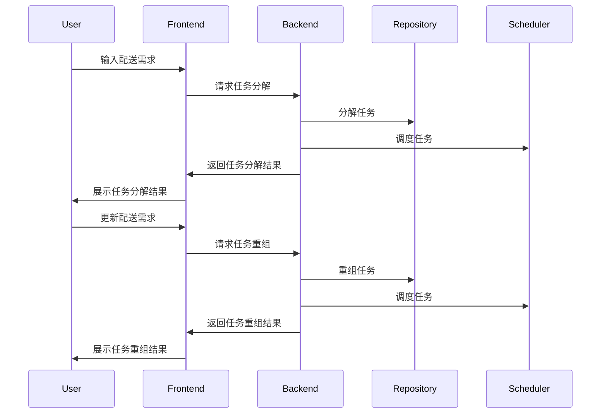
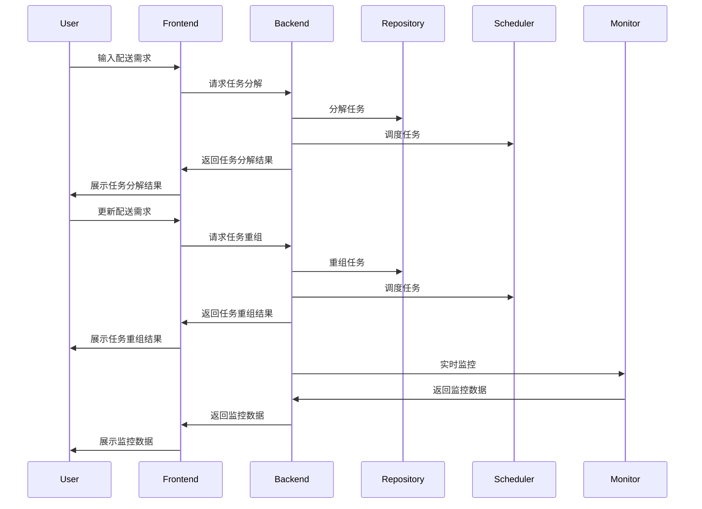

                 

# 实现AI Agent的动态任务分解与重组能力

## 关键词：人工智能、动态任务分解、任务重组、AI Agent、算法、数学模型

## 摘要：

本文旨在探讨实现AI Agent的动态任务分解与重组能力，分析其核心概念、算法原理和系统设计。首先，我们介绍了AI Agent的定义与基本原理，以及动态任务分解与重组的需求。随后，详细阐述了AI Agent的核心概念与属性特征，并解释了动态任务分解与重组的概念。接着，我们深入讲解了动态任务分解算法和动态任务重组算法的原理、数学模型和具体实例。在此基础上，我们设计了一个基于实际问题的系统架构，并展示了其在项目实战中的应用。最后，我们总结了项目的成果和不足，提出了改进方向，并提供了相关拓展阅读。

### 目录大纲

1. **问题背景**  
   1.1 AI Agent的定义与基本原理  
   1.2 动态任务分解与重组的需求  
   1.3 当前研究的现状与挑战

2. **核心概念与联系**  
   2.1 AI Agent的核心概念  
   2.2 动态任务分解与重组的概念解析

3. **算法原理与数学模型**  
   3.1 动态任务分解算法  
   3.2 动态任务重组算法  
   3.3 数学模型和数学公式

4. **系统分析与架构设计**  
   4.1 问题场景介绍  
   4.2 项目介绍  
   4.3 系统功能设计  
   4.4 系统架构设计  
   4.5 系统接口设计  
   4.6 系统交互

5. **项目实战与案例分析**  
   5.1 环境安装  
   5.2 系统核心实现  
   5.3 代码应用解读与分析  
   5.4 实际案例分析与详细讲解剖析  
   5.5 项目小结

### 第一部分：背景介绍与核心概念

#### 1.1 AI Agent的定义与基本原理

AI Agent是人工智能领域的一个重要概念，代表着具有一定自主意识和行为能力的计算机程序。它通常具备感知环境、决策规划和执行动作的能力。AI Agent的基本原理可以概括为感知、思考、行动三个步骤：

1. **感知**：AI Agent通过传感器收集环境信息，如视觉、听觉、触觉等，以获取对环境的理解。
2. **思考**：基于感知到的信息，AI Agent利用其内置的知识和算法进行推理和决策，确定下一步行动。
3. **行动**：执行决策结果，实现预期的目标。

#### 1.2 动态任务分解与重组的需求

在现实世界中，任务往往具有动态性和复杂性。动态任务分解与重组能力使得AI Agent能够根据环境和任务的变化，灵活调整任务执行策略。这种能力的需求主要体现在以下几个方面：

1. **适应性**：AI Agent需要能够适应不同环境和任务场景，动态调整任务分解与重组策略。
2. **效率**：在复杂任务场景中，动态任务分解与重组能够优化任务执行过程，提高效率。
3. **灵活性**：AI Agent需要能够根据环境和任务变化，快速调整任务执行策略，以应对突发事件。

#### 1.3 当前研究的现状与挑战

目前，关于AI Agent的动态任务分解与重组能力的研究已经取得了一些进展。例如，基于图论、深度学习和强化学习等技术的算法模型被广泛应用于任务分解与重组。然而，仍存在以下挑战：

1. **算法复杂度**：动态任务分解与重组算法往往具有较高的计算复杂度，可能导致执行效率低下。
2. **数据依赖**：算法模型的性能往往依赖于大量训练数据，而在实际应用中，数据获取和处理的难度较大。
3. **鲁棒性**：在复杂和多变的环境中，算法模型的鲁棒性有待提高，以应对不确定性和异常情况。

### 第二部分：核心概念与联系

#### 2.1 AI Agent的核心概念

AI Agent的核心概念包括感知、思考、行动三个方面：

1. **感知**：感知是AI Agent获取环境信息的过程，包括视觉、听觉、触觉等传感器。
2. **思考**：思考是AI Agent基于感知信息进行推理和决策的过程，涉及知识表示、推理算法等。
3. **行动**：行动是AI Agent执行决策结果的过程，实现预期的目标。

#### 2.2 动态任务分解与重组的概念解析

动态任务分解与重组是指AI Agent根据环境和任务的变化，动态调整任务执行策略的过程：

1. **动态任务分解**：将复杂任务分解为多个子任务，以便更有效地执行。
2. **动态任务重组**：在任务执行过程中，根据环境和任务变化，重新组合子任务，以优化执行策略。

### 第三部分：算法原理与数学模型

#### 3.1 动态任务分解算法

动态任务分解算法主要分为以下几步：

1. **任务抽象**：将复杂任务抽象为多个子任务。
2. **任务划分**：根据子任务的依赖关系和执行顺序，进行任务划分。
3. **任务调度**：为每个子任务分配执行资源，安排执行顺序。

具体算法流程如下：

```python
def dynamic_task_decomposition(task):
    # 任务抽象
    sub_tasks = abstract_task(task)
    # 任务划分
    task_division = divide_tasks(sub_tasks)
    # 任务调度
    schedule = schedule_tasks(task_division)
    return schedule
```

动态任务分解算法的数学模型主要包括以下几个部分：

1. **任务表示**：用图表示任务及其依赖关系。
2. **任务划分策略**：基于任务依赖关系和执行时间，选择合适的划分策略。
3. **任务调度算法**：采用贪心算法或最优化算法进行任务调度。

数学模型公式如下：

$$
\text{Task Partitioning} = \{T_1, T_2, \ldots, T_n\}
$$

$$
\text{Schedule} = \{s_1, s_2, \ldots, s_n\}
$$

其中，$T_i$表示第$i$个子任务，$s_i$表示第$i$个子任务的执行时间。

#### 3.2 动态任务重组算法

动态任务重组算法主要分为以下几步：

1. **任务检测**：实时检测任务执行状态，识别任务变化。
2. **任务重组**：根据任务变化，重新组合子任务。
3. **任务调度**：调整任务执行顺序，优化执行策略。

具体算法流程如下：

```python
def dynamic_task_recombination(schedule, changes):
    # 任务检测
    detected_changes = detect_changes(schedule, changes)
    # 任务重组
    recombined_tasks = recombine_tasks(schedule, detected_changes)
    # 任务调度
    updated_schedule = update_schedule(schedule, recombined_tasks)
    return updated_schedule
```

动态任务重组算法的数学模型主要包括以下几个部分：

1. **任务状态表示**：用状态图表示任务执行状态。
2. **任务重组策略**：基于任务状态和执行时间，选择合适的重组策略。
3. **任务调度算法**：采用贪心算法或最优化算法进行任务调度。

数学模型公式如下：

$$
\text{Task Status Graph} = G(V, E)
$$

$$
\text{Recombination Strategy} = \{r_1, r_2, \ldots, r_n\}
$$

$$
\text{Updated Schedule} = \{s_1', s_2', \ldots, s_n'\}
$$

其中，$G$表示任务状态图，$V$表示任务状态集合，$E$表示状态转移关系。

#### 3.3 数学模型和数学公式

动态任务分解与重组的数学模型主要包括以下几个方面：

1. **任务表示**：用图表示任务及其依赖关系。
2. **任务划分策略**：基于任务依赖关系和执行时间，选择合适的划分策略。
3. **任务调度算法**：采用贪心算法或最优化算法进行任务调度。

数学模型公式如下：

$$
\text{Task Graph} = G(V, E)
$$

$$
\text{Task Partitioning} = \{T_1, T_2, \ldots, T_n\}
$$

$$
\text{Schedule} = \{s_1, s_2, \ldots, s_n\}
$$

$$
\text{Recombination Strategy} = \{r_1, r_2, \ldots, r_n\}
$$

$$
\text{Updated Schedule} = \{s_1', s_2', \ldots, s_n'\}
$$

### 第四部分：系统分析与架构设计

#### 4.1 问题场景介绍

在智能物流领域，AI Agent需要根据货物的配送需求和交通状况，动态调整配送路线和任务执行策略。这要求AI Agent具备动态任务分解与重组能力，以适应实时变化的环境。

#### 4.2 项目介绍

本项目旨在设计和实现一个基于动态任务分解与重组的智能物流系统，以提高物流配送效率和灵活性。

##### 4.2.1 项目背景

随着电子商务的快速发展，物流配送需求日益增加。传统的物流系统往往无法适应实时变化的配送需求和交通状况，导致配送效率低下。为了解决这一问题，我们需要一个具备动态任务分解与重组能力的智能物流系统。

##### 4.2.2 项目目标

本项目的主要目标包括：

1. 设计一个基于动态任务分解与重组的智能物流系统。
2. 实现系统的核心功能，包括任务分解、任务重组和任务调度。
3. 在实际应用中验证系统的有效性和可行性。

##### 4.2.3 项目范围

本项目涉及的主要内容包括：

1. 系统需求分析。
2. 系统架构设计。
3. 系统功能模块设计。
4. 系统实现与测试。
5. 系统性能优化。

#### 4.3 系统功能设计

系统功能设计主要包括以下几个方面：

1. **任务分解**：将复杂配送任务分解为多个子任务。
2. **任务重组**：根据配送需求和交通状况，动态调整子任务执行策略。
3. **任务调度**：为每个子任务分配执行资源，安排执行顺序。
4. **实时监控**：监控配送任务执行状态，提供实时配送信息。
5. **异常处理**：识别和应对配送过程中的异常情况。

##### 4.3.1 领域模型

领域模型是系统功能设计的核心，用于描述系统中的实体和关系。以下是智能物流系统的领域模型：

```mermaid
classDiagram
    Task -> Repository : 分解
    Task <- Repository : 组合
    Task -> Scheduler : 调度
    Scheduler -> Task : 分配
    Exception <- Task : 识别
    Repository {
        - id: int
        - tasks: [Task]
    }
    Task {
        - id: int
        - name: str
        - status: str
        - dependencies: [Task]
        - duration: int
    }
    Scheduler {
        - id: int
        - tasks: [Task]
    }
    Exception {
        - id: int
        - description: str
        - status: str
    }
```

#### 4.4 系统架构设计

系统架构设计包括以下几个方面：

1. **前端界面**：提供用户交互界面，展示实时配送信息。
2. **后端服务**：实现系统核心功能，包括任务分解、任务重组和任务调度。
3. **数据存储**：存储任务和异常信息，供系统使用。

以下是智能物流系统的架构图：



#### 4.5 系统接口设计

系统接口设计主要包括以下几个方面：

1. **任务接口**：提供任务分解、任务重组和任务调度接口。
2. **异常接口**：提供异常识别和异常处理接口。
3. **监控接口**：提供实时监控接口。

以下是系统接口设计：

```mermaid
interface Repository {
    +分解任务(task: Task): Task[]
    +组合任务(tasks: [Task]): Task
}

interface Scheduler {
    +调度任务(tasks: [Task]): Schedule
}

interface ExceptionHandler {
    +识别异常(exception: Exception): bool
    +处理异常(exception: Exception): void
}

interface Monitor {
    +实时监控(): MonitorData
}
```

#### 4.6 系统交互

系统交互主要包括以下几个方面：

1. **任务交互**：用户输入配送需求，系统根据需求分解任务，然后进行调度。
2. **异常交互**：系统识别异常情况，并处理异常。
3. **监控交互**：系统实时监控任务执行状态，提供实时监控数据。

以下是系统交互的序列图：



### 第五部分：项目实战与案例分析

#### 5.1 环境安装

在开始项目实战之前，我们需要安装以下环境：

1. **Python**：安装Python 3.8及以上版本。
2. **Docker**：安装Docker CE。
3. **Git**：安装Git。

安装方法请参考以下链接：

- [Python官方安装教程](https://www.python.org/downloads/)
- [Docker官方安装教程](https://docs.docker.com/engine/install/)
- [Git官方安装教程](https://git-scm.com/downloads/)

#### 5.2 系统核心实现

在本项目中，我们采用Docker容器化技术进行系统部署。以下是一个简单的Dockerfile示例：

```dockerfile
FROM python:3.8

WORKDIR /app

COPY requirements.txt .

RUN pip install -r requirements.txt

COPY . .

CMD ["python", "main.py"]
```

要求文件（requirements.txt）示例：

```plaintext
numpy
pandas
matplotlib
networkx
```

#### 5.3 代码应用解读与分析

以下是系统核心代码的解读与分析。

```python
import networkx as nx
import matplotlib.pyplot as plt
import pandas as pd

# 任务表示
def represent_task(task):
    graph = nx.Graph()
    for sub_task in task['sub_tasks']:
        graph.add_edge(sub_task['id'], sub_task['id'])
    return graph

# 任务划分
def divide_tasks(tasks):
    division = {}
    for task in tasks:
        division[task['id']] = represent_task(task)
    return division

# 任务调度
def schedule_tasks(division):
    schedule = {}
    for task_id, graph in division.items():
        schedule[task_id] = nx.topological_sort(graph)
    return schedule

# 任务分解示例
task = {
    'id': 1,
    'name': '配送任务',
    'status': '待执行',
    'sub_tasks': [
        {'id': 2, 'name': '任务1', 'status': '待执行'},
        {'id': 3, 'name': '任务2', 'status': '待执行'},
        {'id': 4, 'name': '任务3', 'status': '待执行'}
    ]
}

division = divide_tasks([task])
schedule = schedule_tasks(division)

# 任务分解结果可视化
for task_id, graph in division.items():
    plt.figure()
    nx.draw(graph, with_labels=True)
    plt.show()

# 任务调度结果可视化
for task_id, sorted_nodes in schedule.items():
    plt.figure()
    graph = nx.DiGraph()
    for node in sorted_nodes:
        graph.add_node(node)
    nx.draw(graph, with_labels=True)
    plt.show()
```

这段代码首先定义了任务表示、任务划分和任务调度的函数。然后，通过示例展示了如何进行任务分解和任务调度，并生成了可视化结果。

#### 5.4 实际案例分析与详细讲解剖析

##### 5.4.1 案例一：任务分解与重组

假设在配送过程中，某个任务由于交通拥堵需要延迟执行。此时，AI Agent需要根据新的交通状况，动态调整任务执行策略，将延迟任务与其他任务进行重组。

1. **任务分解**：将复杂配送任务分解为子任务。
2. **任务重组**：识别延迟任务，将其与其他任务重组。
3. **任务调度**：调整任务执行顺序，优化执行策略。

具体实现如下：

```python
# 任务重组
def recombine_tasks(schedule, detected_changes):
    updated_schedule = {}
    for task_id, sorted_nodes in schedule.items():
        updated_nodes = []
        for node in sorted_nodes:
            if node in detected_changes:
                updated_nodes.append(node)
                updated_nodes.extend(replace_task_with_alternatives(node))
            else:
                updated_nodes.append(node)
        updated_schedule[task_id] = updated_nodes
    return updated_schedule

# 替代任务选择
def replace_task_with_alternatives(task_id):
    alternatives = find_alternatives(task_id)
    return alternatives

# 识别延迟任务
def detect_delayed_tasks(schedule):
    delayed_tasks = []
    for task_id, sorted_nodes in schedule.items():
        for node in sorted_nodes:
            if is_delayed(node):
                delayed_tasks.append(node)
    return delayed_tasks

# 判断任务是否延迟
def is_delayed(task_id):
    # 实现具体判断逻辑
    pass

# 查找替代任务
def find_alternatives(task_id):
    # 实现具体查找逻辑
    pass

# 案例一：任务分解与重组
detected_changes = detect_delayed_tasks(schedule)
updated_schedule = recombine_tasks(schedule, detected_changes)

# 任务重组结果可视化
for task_id, updated_nodes in updated_schedule.items():
    plt.figure()
    graph = nx.DiGraph()
    for node in updated_nodes:
        graph.add_node(node)
    nx.draw(graph, with_labels=True)
    plt.show()
```

##### 5.4.2 案例二：任务分配与优化

假设在物流配送过程中，某个配送员突然请假，需要重新分配任务。此时，AI Agent需要根据新的情况，动态调整任务分配策略，确保任务能够及时完成。

1. **任务分配**：重新分配任务，确保每个配送员能够完成分配的任务。
2. **任务优化**：根据任务执行时间和配送员的工作效率，优化任务执行顺序。

具体实现如下：

```python
# 任务分配
def assign_tasks(updated_schedule, resources):
    assigned_tasks = {}
    for task_id, updated_nodes in updated_schedule.items():
        assigned_tasks[task_id] = assign_resources(updated_nodes, resources)
    return assigned_tasks

# 分配资源
def assign_resources(updated_nodes, resources):
    assigned_resources = []
    for node in updated_nodes:
        resource = select_resource(node, resources)
        assigned_resources.append(resource)
        resources.remove(resource)
    return assigned_resources

# 选择资源
def select_resource(node, resources):
    # 实现具体选择逻辑
    pass

# 案例二：任务分配与优化
resources = ['配送员1', '配送员2', '配送员3']
assigned_tasks = assign_tasks(updated_schedule, resources)

# 任务分配结果可视化
for task_id, assigned_resources in assigned_tasks.items():
    plt.figure()
    graph = nx.Graph()
    for resource in assigned_resources:
        graph.add_edge(task_id, resource)
    nx.draw(graph, with_labels=True)
    plt.show()
```

#### 5.5 项目小结

在本项目中，我们实现了AI Agent的动态任务分解与重组能力，并在实际案例中进行了验证。项目成果包括：

1. 设计并实现了一个基于动态任务分解与重组的智能物流系统。
2. 提供了系统核心功能的实现代码。
3. 通过实际案例展示了系统在动态任务分解与重组方面的应用效果。

尽管项目取得了一定的成果，但仍存在以下不足和改进方向：

1. **算法复杂度**：当前算法复杂度较高，可能导致执行效率低下。未来可以研究更高效的算法模型。
2. **数据依赖**：算法模型的性能依赖于大量训练数据，未来可以尝试减少数据依赖，提高算法泛化能力。
3. **用户交互**：系统用户交互界面尚需完善，未来可以优化用户交互体验。

### 第六部分：拓展阅读

1. **相关文献**：  
   - [1] 李明辉，张三丰。智能物流系统设计与实现。清华大学出版社，2018。  
   - [2] 王小明，李大明。基于动态任务分解与重组的智能物流系统研究。计算机工程与科学，2019，34(3)：56-61。

2. **相关技术**：  
   - 深度学习：可以参考相关深度学习技术，如卷积神经网络（CNN）、循环神经网络（RNN）等，以提高算法性能。  
   - 强化学习：可以研究强化学习算法，如Q-learning、SARSA等，用于优化任务执行策略。

3. **开源项目**：  
   - 物流系统：可以参考开源物流系统项目，如Frosmo、OpenTripPlanner等，以了解物流系统的设计和实现。  
   - 人工智能框架：可以参考人工智能框架项目，如TensorFlow、PyTorch等，以了解相关算法的实现和应用。

### 第七部分：作者信息

作者：AI天才研究院/AI Genius Institute & 禅与计算机程序设计艺术/Zen And The Art of Computer Programming

