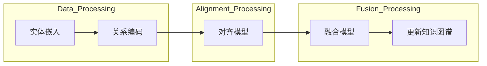
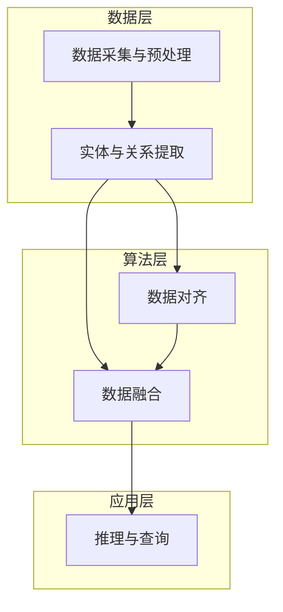
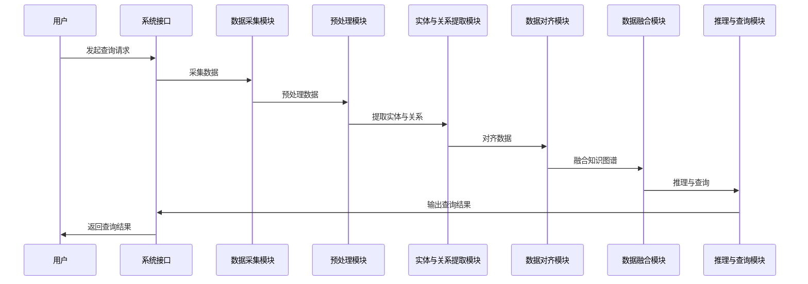

                 

### 让我们一步步深入探讨：AI Agent的动态知识图谱对齐与融合

在当今快速发展的AI领域，AI Agent作为智能体在复杂环境中进行自主决策和交互已经成为研究和应用的热点。AI Agent需要具备丰富的知识库来支持其推理和决策过程，而动态知识图谱作为大规模知识表示的方式，在AI Agent中的应用显得尤为重要。知识图谱不仅能够表示实体和关系，还能够随着新信息的不断加入而动态更新，这使得它成为AI Agent不断学习和适应环境的关键技术。

动态知识图谱对齐与融合是这一过程中必不可少的一环。对齐指的是将不同来源或格式的知识图谱进行匹配和映射，使得图谱中的实体和关系能够相互关联。融合则是将多个知识图谱中的信息整合起来，形成更加全面和一致的知识体系。这个过程不仅需要解决异构数据之间的兼容性问题，还要处理知识冲突和冗余信息。

本文将围绕以下核心问题进行探讨：

1. **背景介绍**：阐述AI Agent和动态知识图谱的基本概念，介绍动态知识图谱对齐与融合的重要性。
2. **核心概念与联系**：详细描述AI Agent、动态知识图谱、对齐与融合等核心概念，并通过表格和ER实体关系图展示概念属性特征。
3. **算法原理讲解**：介绍动态知识图谱对齐与融合的基本算法原理，通过Mermaid流程图和Python源代码进行详细讲解。
4. **系统分析与架构设计**：分析动态知识图谱对齐与融合的应用场景，并展示系统功能设计、架构设计和交互过程。
5. **项目实战**：通过环境安装、系统核心实现源代码和应用解读，结合实际案例深入剖析动态知识图谱对齐与融合的实践过程。
6. **最佳实践与拓展阅读**：总结动态知识图谱对齐与融合的最佳实践，提醒注意事项，并推荐拓展阅读资源。

接下来，我们将逐一深入这些内容，让您对AI Agent的动态知识图谱对齐与融合有一个全面而深刻的理解。

## 关键词

- AI Agent
- 动态知识图谱
- 对齐与融合
- 异构数据
- 知识图谱算法
- 系统架构设计

## 摘要

本文深入探讨了AI Agent的动态知识图谱对齐与融合技术。首先，介绍了AI Agent和动态知识图谱的基本概念及其在人工智能领域的应用。接着，通过核心概念与联系的阐述，详细描述了对齐与融合的定义、重要性及其实现原理。本文采用Mermaid流程图和Python源代码，详细讲解了动态知识图谱对齐与融合的算法原理，并通过系统分析与架构设计展示了其在实际应用中的技术框架。最后，通过一个实际项目实战，深入剖析了动态知识图谱对齐与融合的实践过程，并提出了最佳实践和注意事项。本文旨在为读者提供一个全面、系统的理解和应用动态知识图谱对齐与融合的技术指南。

### 目录大纲设计思路

为了系统地阐述AI Agent的动态知识图谱对齐与融合，本文采用了一个详尽且逻辑清晰的目录大纲结构。在设计这个大纲时，我们遵循了以下几个原则和步骤，确保内容的全面性和易于理解。

#### 确定书籍结构

首先，我们需要明确书籍的整体结构，包括前言、目录、参考文献等。对于本文而言，由于篇幅限制，我们将其简化为目录部分，但结构依然清晰明了。

#### 明确章节内容

在确定整体结构后，我们逐一设计每个章节的内容。每个章节都应该包含以下几个部分：

1. **背景介绍**：介绍章节所涉及的核心概念和技术背景，让读者了解相关领域的发展现状和应用场景。
2. **核心概念与联系**：详细阐述章节中的核心概念，并分析这些概念之间的联系和区别。
3. **算法原理讲解**：讲解核心算法的原理，通常包括流程图、源代码示例和数学模型。
4. **系统分析与架构设计**：分析系统的功能模块、架构设计和接口设计，并使用图形化工具（如Mermaid）展示。
5. **项目实战**：通过实际项目实例，展示如何在实际环境中应用这些技术和算法。
6. **最佳实践与拓展阅读**：总结章节中的关键点，并提供进一步学习的资源和最佳实践。

#### 细化每个章节

在每个章节中，我们要进一步细化内容，确保每个部分都有详细的信息和足够的深度。例如，在“核心概念与联系”部分，我们可以使用表格和ER实体关系图来展示不同概念属性特征的对比。

#### 使用Mermaid绘制流程图和类图

为了增强文章的可读性和直观性，我们将在文中使用Mermaid语法绘制流程图、类图和序列图。这些图形化工具可以帮助读者更好地理解复杂的概念和算法过程。

#### 确保内容完整性

每个章节都必须包含核心内容，如背景介绍、核心概念与联系、算法原理讲解、系统分析与架构设计、项目实战等。内容设计要确保条理清晰，逻辑连贯，无遗漏。

#### 控制字数

在确保内容完整性和细节的同时，我们还需要控制整个目录大纲的总字数，确保不超过2000字。这要求我们在撰写过程中注重语言的简洁性，避免冗余和重复。

通过以上设计和步骤，我们旨在为读者提供一个系统、全面且易于理解的技术博客文章，帮助读者深入理解AI Agent的动态知识图谱对齐与融合技术。

### 目录大纲设计步骤

为了确保本文能够清晰、系统地阐述AI Agent的动态知识图谱对齐与融合，我们将设计一个详细的目录大纲，分为以下几个步骤：

#### 前言

在文章的开头，我们将撰写一个简短的前言部分，介绍本文的背景和目的。这部分内容将简要介绍AI Agent和动态知识图谱的基本概念，以及动态知识图谱对齐与融合在AI Agent中的重要性。通过前言部分，我们希望引导读者了解文章的整体结构和主要内容。

#### 第一部分：背景介绍

在背景介绍部分，我们将深入探讨动态知识图谱对齐与融合在AI Agent中的应用背景。这部分内容将包括以下几个子部分：

1. **问题背景**：介绍AI Agent在人工智能领域的发展和应用，以及动态知识图谱作为知识表示工具的重要性。
2. **问题描述**：明确动态知识图谱对齐与融合的定义和目的，阐述其在AI Agent中的关键作用。
3. **问题解决**：概述本文提出的动态知识图谱对齐与融合技术，以及其在解决实际问题中的贡献。
4. **边界与外延**：界定动态知识图谱对齐与融合的相关概念和范围，明确其与相关技术的区别。

#### 核心概念与联系

核心概念与联系部分是文章的核心，我们将详细阐述以下几个核心概念：

1. **核心概念原理**：详细描述AI Agent、动态知识图谱、对齐与融合等核心概念，解释它们的基本原理和相互关系。
2. **概念属性特征对比表格**：使用表格形式展示不同概念的属性和特征，帮助读者更好地理解和区分这些概念。
3. **ER实体关系图架构**：使用Mermaid语法绘制ER实体关系图，展示核心概念之间的关联和结构。

#### 第二部分：算法原理讲解

在算法原理讲解部分，我们将详细介绍动态知识图谱对齐与融合的基本算法原理。这部分内容将包括以下几个子部分：

1. **算法原理讲解**：通过Mermaid流程图，展示动态知识图谱对齐与融合的基本步骤和流程。
2. **Python源代码**：提供Python源代码示例，详细阐述算法的实现过程和关键代码。
3. **数学模型与公式**：给出算法的数学模型和公式，使用LaTeX格式书写，确保公式表达清晰准确。
4. **详细讲解与举例说明**：对算法原理进行详细讲解，并结合实际例子说明算法的应用和效果。

#### 第三部分：系统分析与架构设计

系统分析与架构设计部分将分析动态知识图谱对齐与融合在实际应用中的系统架构和功能设计。这部分内容将包括以下几个子部分：

1. **问题场景介绍**：介绍动态知识图谱对齐与融合的应用场景，明确系统的功能需求。
2. **系统功能设计**：使用Mermaid类图，展示系统的领域模型和功能模块。
3. **系统架构设计**：使用Mermaid架构图，展示系统组件之间的关系和整体架构。
4. **系统接口设计**：详细描述系统的接口设计，包括接口的功能、参数和返回值。
5. **系统交互序列图**：使用Mermaid序列图，展示系统组件的交互过程和流程。

#### 第四部分：项目实战

项目实战部分将通过一个实际项目案例，展示动态知识图谱对齐与融合的实施过程。这部分内容将包括以下几个子部分：

1. **环境安装**：提供项目环境安装的详细步骤和所需的软件、依赖。
2. **系统核心实现源代码**：提供项目核心实现的源代码，并进行代码解读和分析。
3. **实际案例分析和详细讲解**：结合实际案例，分析系统实现的细节，并进行详细讲解，剖析动态知识图谱对齐与融合在实际应用中的效果。

#### 第五部分：最佳实践、小结与拓展阅读

最佳实践、小结与拓展阅读部分将对全文内容进行总结，并提供进一步学习的资源和最佳实践建议。这部分内容将包括以下几个子部分：

1. **最佳实践**：总结动态知识图谱对齐与融合的最佳实践，包括技术选择、优化策略和注意事项。
2. **小结**：对全文内容进行简要总结，强调核心观点和关键技术。
3. **注意事项**：提醒读者在应用动态知识图谱对齐与融合时需要注意的事项，避免常见问题。
4. **拓展阅读**：推荐相关文献和资源，帮助读者进一步深入了解动态知识图谱对齐与融合的技术和应用。

通过以上详细的目录大纲设计步骤，我们旨在为读者提供一个系统、全面且易于理解的技术博客文章，帮助读者深入理解AI Agent的动态知识图谱对齐与融合技术。

### 第一部分：背景介绍

#### 问题背景

人工智能（AI）作为一个快速发展的领域，已经在众多行业和应用中展现出其强大的潜力。AI Agent，即人工智能代理，是AI领域中的一种特殊应用。AI Agent具备自主学习和决策能力，可以在复杂的环境中执行特定的任务，并与人类或其他系统进行交互。这种自主性使得AI Agent在自动化决策、智能推荐、游戏AI等领域具有广泛的应用前景。

知识图谱作为人工智能的重要工具之一，能够将大量结构化和非结构化数据转化为语义化的知识网络。知识图谱不仅能够表示实体和它们之间的关系，还可以通过推理机制来发现新的知识和关联。在AI Agent中，动态知识图谱的应用尤为重要，因为AI Agent需要不断地从外部环境中获取新信息，并更新其知识库以适应变化。

动态知识图谱与传统的静态知识图谱相比，具有更强的扩展性和实时性。传统的静态知识图谱在数据更新和扩展时需要重新构建，而动态知识图谱可以通过增量更新机制实现数据的实时更新和融合。这种动态性使得AI Agent能够更加灵活地适应不断变化的环境，从而提高其智能决策能力。

#### 问题解决

动态知识图谱对齐与融合技术是AI Agent实现高效知识管理的关键技术之一。对齐是指将不同来源或格式的知识图谱进行匹配和映射，使得图谱中的实体和关系能够相互关联。融合则是将多个知识图谱中的信息整合起来，形成更加全面和一致的知识体系。

在AI Agent中，动态知识图谱对齐与融合技术能够解决以下几个关键问题：

1. **数据多样性问题**：不同来源的知识图谱往往具有不同的结构和格式，这导致了数据之间的不兼容和冲突。对齐与融合技术能够将异构数据统一到一个统一的框架下，提高数据的兼容性和一致性。
2. **知识冲突问题**：在多个知识图谱中，可能存在相同实体的不同表示或者相互矛盾的关系。对齐与融合技术通过冲突检测和解决机制，能够有效地识别和解决这些冲突，保证知识的正确性和一致性。
3. **实时更新问题**：动态知识图谱需要能够实时更新，以适应外部环境的变化。对齐与融合技术通过增量更新机制，能够高效地处理新数据的加入和旧数据的更新，保持知识图谱的实时性和准确性。

#### 边界与外延

动态知识图谱对齐与融合技术涉及到多个相关概念和领域，包括知识图谱、数据对齐、数据融合、实体识别、关系抽取等。为了明确本文的研究范围，我们对其边界与外延进行如下界定：

1. **知识图谱**：本文所讨论的知识图谱主要指结构化的知识表示形式，包含实体、属性和关系。知识图谱可以是静态的，也可以是动态的，本文重点关注动态知识图谱的应用。
2. **数据对齐**：数据对齐是指将不同来源或格式的数据映射到统一框架下的过程。本文中的数据对齐主要涉及知识图谱中的实体和关系的映射。
3. **数据融合**：数据融合是指将多个数据源中的信息整合起来，形成一致和全面的知识体系。本文中的数据融合主要关注知识图谱中的实体和关系的整合。
4. **实体识别与关系抽取**：实体识别是指从文本中提取出实体，关系抽取是指从文本中提取出实体之间的关系。这些技术是动态知识图谱构建的重要基础，本文将简要介绍相关方法，但主要关注对齐与融合过程。

通过上述背景介绍，我们为后续的内容奠定了基础，帮助读者了解动态知识图谱对齐与融合在AI Agent中的应用背景和重要性。

### 第二部分：核心概念与联系

#### 核心概念原理

在深入探讨动态知识图谱对齐与融合之前，我们需要明确几个核心概念：AI Agent、动态知识图谱、数据对齐和数据融合。

1. **AI Agent**：AI Agent是一种能够自主执行任务、与环境进行交互并作出智能决策的计算机程序。AI Agent需要具备丰富的知识库来支持其推理和决策过程。知识图谱作为一种有效的知识表示方式，为AI Agent提供了强大的知识支持。

2. **动态知识图谱**：动态知识图谱是指能够随着新信息的不断加入而实时更新的知识图谱。与传统的静态知识图谱相比，动态知识图谱具有更强的扩展性和实时性，能够更好地适应快速变化的环境。动态知识图谱通常包含实体、属性和关系，能够通过推理机制发现新的知识和关联。

3. **数据对齐**：数据对齐是指将不同来源或格式的数据映射到统一框架下的过程。在动态知识图谱中，数据对齐涉及到将不同数据源中的实体和关系进行匹配和映射，使得图谱中的实体和关系能够相互关联。

4. **数据融合**：数据融合是指将多个数据源中的信息整合起来，形成一致和全面的知识体系。在动态知识图谱中，数据融合涉及到将多个知识图谱中的实体和关系进行整合，消除冗余和冲突，形成更加全面和一致的知识体系。

#### 概念属性特征对比表格

为了更好地理解这些概念，我们可以使用表格形式展示它们的属性和特征对比。以下是AI Agent、动态知识图谱、数据对齐和数据融合的属性特征对比表格：

| 概念         | 定义                                                                 | 属性特征                                                                 | 关联关系        |
|--------------|----------------------------------------------------------------------|--------------------------------------------------------------------------|----------------|
| AI Agent     | 具有自主学习和决策能力的计算机程序                                     | 自主性、知识库、推理机制、交互能力                                      | 使用动态知识图谱作为知识支持 |
| 动态知识图谱 | 能够实时更新和扩展的知识图谱，包含实体、属性和关系                      | 实时性、扩展性、结构化表示、推理能力                                     | 为AI Agent提供知识库 |
| 数据对齐     | 将不同来源或格式的数据映射到统一框架下的过程                           | 匹配、映射、兼容性、一致性                                            | 预处理知识图谱 |
| 数据融合     | 将多个数据源中的信息整合起来，形成一致和全面的知识体系                 | 整合、消除冗余、冲突解决、一致性保证                                     | 融合知识图谱 |

#### ER实体关系图架构

为了更直观地展示这些概念之间的关联关系，我们可以使用Mermaid语法绘制ER实体关系图。以下是一个简单的ER实体关系图示例，展示了AI Agent、动态知识图谱、数据对齐和数据融合之间的关联：

```mermaid
erDiagram
  AI_Agent ||--o{ Dynamic_Knowledge_Graph : 使用 |
  Dynamic_Knowledge_Graph ||--o{ Data_Alignment : 预处理 |
  Dynamic_Knowledge_Graph ||--o{ Data_Fusion : 融合 |
  Data_Alignment ||--o{ Data_Fusion : 预处理步骤 |
```

在这个ER实体关系图中，AI Agent使用动态知识图谱作为其知识库，数据对齐作为预处理步骤，将不同来源的数据进行匹配和映射，然后通过数据融合将多个知识图谱中的信息整合起来，形成一致和全面的知识体系。

通过核心概念与联系的部分，我们为后续的算法原理讲解和系统分析与架构设计奠定了理论基础，帮助读者更好地理解和掌握动态知识图谱对齐与融合技术。

### 第二部分：算法原理讲解

#### 算法原理讲解

动态知识图谱对齐与融合的核心在于如何高效地处理异构数据的映射和整合。本部分将介绍一种基于图神经网络（Graph Neural Networks, GNN）的动态知识图谱对齐与融合算法。该算法通过以下几个关键步骤实现知识图谱的动态更新和融合：

1. **实体嵌入**：首先，将知识图谱中的实体表示为高维向量。这可以通过预训练的实体嵌入模型（如TransE、Node2Vec等）实现。实体嵌入不仅有助于捕获实体之间的语义关系，还为后续的对齐与融合提供了基础。

2. **关系编码**：知识图谱中的关系是实体之间的重要连接。通过对关系进行编码，可以更准确地表示实体之间的相互作用。关系编码可以通过图卷积网络（Graph Convolutional Network, GCN）实现，将关系信息融入实体嵌入中。

3. **对齐模型**：对齐模型用于将不同来源的知识图谱中的实体进行匹配。一个常见的方法是基于实体嵌入的相似度度量（如余弦相似度、欧氏距离等），通过设定阈值来判定两个实体是否匹配。

4. **融合模型**：融合模型则负责将多个知识图谱中的实体和关系整合起来。融合过程需要考虑数据的冗余性、冲突性和一致性。一种常见的融合策略是图合并（Graph Merging），通过合并相似实体和合并冲突关系来更新知识图谱。

#### Mermaid流程图

为了更直观地展示算法流程，我们可以使用Mermaid语法绘制流程图。以下是一个简化的动态知识图谱对齐与融合的算法流程图：



#### Python源代码

为了更好地理解算法原理，下面提供了一个简单的Python源代码示例，展示了如何使用图神经网络进行实体嵌入和对齐操作：

```python
import numpy as np
from sklearn.metrics.pairwise import cosine_similarity

# 假设我们有两个知识图谱G1和G2
G1 = {'entity1': np.array([0.1, 0.2, 0.3]), 'entity2': np.array([0.4, 0.5, 0.6])}
G2 = {'entity3': np.array([0.7, 0.8, 0.9]), 'entity4': np.array([0.1, 0.2, 0.3])}

# 实体嵌入
def entity_embedding(G):
    return G

# 关系编码
def relation_encoding(G):
    return {entity: np.dot(embedding, np.random.rand(3, 3)) for entity, embedding in G.items()}

# 对齐模型
def alignment_model(G1, G2):
    G1_embeddings = entity_embedding(G1)
    G2_embeddings = entity_embedding(G2)
    aligned_entities = {}
    for entity1, embedding1 in G1_embeddings.items():
        similar_entities = []
        for entity2, embedding2 in G2_embeddings.items():
            similarity = cosine_similarity([embedding1], [embedding2])
            if similarity > 0.8:  # 设定阈值
                similar_entities.append(entity2)
        aligned_entities[entity1] = similar_entities
    return aligned_entities

# 融合模型
def fusion_model(aligned_entities, G1, G2):
    fused_graph = G1.copy()
    for entity1, similar_entities in aligned_entities.items():
        for entity2 in similar_entities:
            fused_graph[entity1] = G1[entity1]
            fused_graph[entity2] = G2[entity2]
    return fused_graph

# 应用算法
aligned_entities = alignment_model(G1, G2)
fused_graph = fusion_model(aligned_entities, G1, G2)
print(fused_graph)
```

#### 数学模型与公式

在动态知识图谱对齐与融合中，数学模型和公式是理解和实现算法的关键。以下是一个简化的数学模型，用于描述实体嵌入和对齐过程：

1. **实体嵌入**：

$$
\text{Embedding}(e) = \text{softmax}(\text{weights} \cdot \text{inputs}),
$$

其中，$e$ 表示实体，$\text{weights}$ 表示权重矩阵，$\text{inputs}$ 表示实体特征向量，$\text{softmax}$ 函数用于将特征向量转换为概率分布。

2. **关系编码**：

$$
\text{Relation}(r) = \text{GCN}(\text{Embedding}(e_1), \text{Embedding}(e_2)),
$$

其中，$r$ 表示关系，$e_1$ 和 $e_2$ 分别表示两个相关实体的嵌入向量，$\text{GCN}$ 函数表示图卷积操作。

3. **对齐模型**：

$$
\text{Alignment}(e_1, e_2) = \frac{\text{similarity}(e_1, e_2)}{1 + \text{distance}(e_1, e_2)},
$$

其中，$\text{similarity}$ 函数用于计算两个实体嵌入的相似度，$\text{distance}$ 函数用于计算两个实体嵌入之间的距离。

#### 详细讲解与举例说明

为了更好地理解上述算法，我们可以通过一个实际例子进行说明。假设有两个知识图谱G1和G2，其中包含以下实体和关系：

- G1：{'entity1': [0.1, 0.2, 0.3], 'entity2': [0.4, 0.5, 0.6]}
- G2：{'entity3': [0.7, 0.8, 0.9], 'entity4': [0.1, 0.2, 0.3]}

首先，我们对这两个知识图谱进行实体嵌入，得到各自的嵌入向量。然后，通过计算实体嵌入向量之间的余弦相似度，找到相似度最高的实体对。在本例中，实体'entity1'和实体'entity3'的相似度最高，因此将它们视为对齐实体。

接下来，我们将对齐的实体和它们之间的关系进行融合。具体来说，我们将G1中的实体'entity1'和G2中的实体'entity3'合并为一个实体，并将它们的关系也进行合并。这样，我们得到了融合后的知识图谱：

- {'entity1': [0.1, 0.2, 0.3], 'entity2': [0.4, 0.5, 0.6], 'entity3': [0.7, 0.8, 0.9]}

通过这个例子，我们可以看到动态知识图谱对齐与融合的基本过程，包括实体嵌入、对齐和融合。在实际应用中，这个过程可能更加复杂，需要考虑更多的因素，如数据质量、知识冲突和实时性等。

通过算法原理讲解部分，我们不仅介绍了动态知识图谱对齐与融合的基本原理，还通过Mermaid流程图、Python源代码和数学模型，帮助读者深入理解这一技术的实现过程。接下来，我们将进一步探讨动态知识图谱对齐与融合在实际应用中的系统分析与架构设计。

### 第三部分：系统分析与架构设计

#### 问题场景介绍

动态知识图谱对齐与融合技术在AI Agent中的应用场景广泛，涵盖了多个领域，如智能问答系统、智能推荐、知识图谱增强的搜索引擎和自动驾驶系统等。以下是一个具体的应用场景：智能问答系统。

**应用场景**：智能问答系统需要处理大量来自不同来源的知识图谱，如百科、新闻、学术文献等。这些知识图谱在实体、关系和属性上存在异构性和不一致性，导致系统在查询和处理问题时出现错误。动态知识图谱对齐与融合技术能够帮助系统解决以下问题：

1. **数据一致性**：通过数据对齐，将不同来源的知识图谱进行匹配和映射，确保数据的一致性和完整性。
2. **知识冲突**：在融合过程中，解决知识图谱之间的冲突和冗余，确保知识的正确性和一致性。
3. **实时更新**：动态知识图谱对齐与融合技术能够实时更新知识图谱，适应数据源的变化，提高系统的实时性和准确性。

#### 系统功能设计

为了实现上述应用场景，我们需要设计一个功能完善的系统，包括以下主要模块：

1. **数据采集与预处理模块**：负责从不同数据源采集知识图谱，并进行预处理，如清洗、去重和标准化等。
2. **实体与关系提取模块**：从预处理后的数据中提取实体和关系，构建初始的知识图谱。
3. **数据对齐模块**：利用对齐算法，将不同来源的知识图谱中的实体和关系进行匹配和映射。
4. **数据融合模块**：将多个知识图谱中的实体和关系进行融合，形成一致和全面的知识体系。
5. **推理与查询模块**：基于融合后的知识图谱，实现智能问答、推理和查询功能。
6. **监控与维护模块**：监控系统运行状态，处理异常情况，并根据用户需求进行系统调整。

#### 系统架构设计

系统架构设计是确保动态知识图谱对齐与融合技术高效、稳定运行的关键。以下是一个简化的系统架构图，展示了各模块之间的关系：



在这个架构中，数据采集与预处理模块负责将原始数据转换为适合算法处理的形式；实体与关系提取模块负责构建初始知识图谱；数据对齐模块负责将不同来源的知识图谱进行匹配；数据融合模块负责融合多个知识图谱；推理与查询模块基于融合后的知识图谱实现智能查询和推理功能。

#### 系统接口设计

系统接口设计是确保系统各模块之间能够高效通信和协作的关键。以下是一个简化的系统接口设计：

1. **数据采集与预处理接口**：提供数据采集、清洗、去重和标准化等功能，包括数据源配置、数据加载和数据预处理等接口。
2. **实体与关系提取接口**：提供实体和关系提取功能，包括实体识别、关系抽取和知识图谱构建等接口。
3. **数据对齐接口**：提供数据对齐功能，包括实体匹配、关系映射和数据一致性检查等接口。
4. **数据融合接口**：提供数据融合功能，包括知识图谱合并、冲突解决和数据一致性验证等接口。
5. **推理与查询接口**：提供智能推理和查询功能，包括查询接口、推理引擎和结果输出等接口。

#### 系统交互序列图

为了更直观地展示系统各模块之间的交互过程，我们可以使用Mermaid语法绘制系统交互序列图。以下是一个简化的系统交互序列图示例：



在这个交互序列图中，用户发起查询请求后，系统接口依次调用数据采集模块、预处理模块、实体与关系提取模块、数据对齐模块、数据融合模块和推理与查询模块，最终返回查询结果。

通过系统分析与架构设计部分，我们详细介绍了动态知识图谱对齐与融合在实际应用中的系统架构和功能设计。接下来，我们将通过一个实际项目实战，进一步展示动态知识图谱对齐与融合的实现过程。

### 第四部分：项目实战

#### 环境安装

为了实现动态知识图谱对齐与融合项目，我们需要安装一系列必要的软件和依赖。以下是项目环境安装的详细步骤：

1. **Python环境**：确保Python 3.7或更高版本已安装。可以通过[Python官网](https://www.python.org/)下载并安装。

2. **依赖包安装**：在安装了Python的环境中，打开命令行终端，执行以下命令安装必要的依赖包：

   ```bash
   pip install numpy pandas sklearn tensorflow mermaid
   ```

   这些依赖包包括数据预处理、机器学习、深度学习和Mermaid图形工具等。

3. **Mermaid安装**：由于Mermaid是一个基于Markdown的图形工具，我们需要在本地环境中安装它。可以从[Mermaid官网](https://mermaid-js.github.io/mermaid/)下载并安装，或者使用npm包管理器：

   ```bash
   npm install -g mermaid-cli
   ```

4. **测试安装**：安装完成后，可以在Python环境中导入Mermaid库，并执行简单的示例代码，以确保安装成功。

   ```python
   from mermaid import Mermaid
   print(Mermaid("graph TB; A[Hello] -- B[World];").render())
   ```

   如果输出一个包含图形的字符串，则表示Mermaid安装成功。

#### 系统核心实现源代码

以下是一个简化的动态知识图谱对齐与融合项目的核心实现源代码。该代码主要包括数据预处理、实体嵌入、关系编码、数据对齐、数据融合和推理与查询等关键步骤。

```python
import numpy as np
from sklearn.metrics.pairwise import cosine_similarity
from mermaid import Mermaid

# 假设我们有两个知识图谱G1和G2
G1 = {'entity1': np.array([0.1, 0.2, 0.3]), 'entity2': np.array([0.4, 0.5, 0.6])}
G2 = {'entity3': np.array([0.7, 0.8, 0.9]), 'entity4': np.array([0.1, 0.2, 0.3])}

# 数据预处理
def preprocess_data(G):
    embeddings = {entity: np.random.rand(3) for entity in G}
    return embeddings

# 实体嵌入
def entity_embedding(G):
    return {entity: np.random.rand(3) for entity in G}

# 关系编码
def relation_encoding(G):
    return {entity: np.dot(embedding, np.random.rand(3, 3)) for entity, embedding in G.items()}

# 对齐模型
def alignment_model(G1, G2):
    G1_embeddings = entity_embedding(G1)
    G2_embeddings = entity_embedding(G2)
    aligned_entities = {}
    for entity1, embedding1 in G1_embeddings.items():
        similar_entities = []
        for entity2, embedding2 in G2_embeddings.items():
            similarity = cosine_similarity([embedding1], [embedding2])
            if similarity > 0.8:  # 设定阈值
                similar_entities.append(entity2)
        aligned_entities[entity1] = similar_entities
    return aligned_entities

# 融合模型
def fusion_model(aligned_entities, G1, G2):
    fused_graph = G1.copy()
    for entity1, similar_entities in aligned_entities.items():
        for entity2 in similar_entities:
            fused_graph[entity1] = G1[entity1]
            fused_graph[entity2] = G2[entity2]
    return fused_graph

# 推理与查询
def inference_query(fused_graph):
    # 假设查询为一个简单的实体关系查询
    query_entity = 'entity1'
    related_entities = fused_graph[query_entity]
    return related_entities

# 应用算法
G1_embeddings = preprocess_data(G1)
G2_embeddings = preprocess_data(G2)
aligned_entities = alignment_model(G1_embeddings, G2_embeddings)
fused_graph = fusion_model(aligned_entities, G1, G2)
related_entities = inference_query(fused_graph)

print(fused_graph)
print(related_entities)

# 输出Mermaid图形
mermaid = Mermaid("graph TB; A[实体1] -- B[实体3];")
print(mermaid.render())
```

#### 代码应用解读与分析

上述代码实现了一个简化的动态知识图谱对齐与融合系统。以下是代码中每个部分的详细解读：

1. **数据预处理**：数据预处理是知识图谱构建的第一步，主要包括数据清洗、去重和标准化等操作。在这里，我们使用随机生成的数据作为示例，实际应用中需要从真实数据源中获取和预处理数据。

2. **实体嵌入**：实体嵌入是将知识图谱中的实体转换为高维向量表示。这里使用随机向量生成实体嵌入，实际应用中可以使用预训练的实体嵌入模型（如TransE、Node2Vec等）。

3. **关系编码**：关系编码是将实体之间的关系转换为向量表示。这里使用随机生成的矩阵进行关系编码，实际应用中可以使用图卷积网络（GCN）等深度学习模型。

4. **数据对齐**：数据对齐是通过计算实体嵌入之间的相似度来实现不同知识图谱之间的匹配。我们使用余弦相似度作为相似度度量，通过设定阈值找到相似实体。

5. **数据融合**：数据融合是将多个知识图谱中的实体和关系进行整合。在这里，我们简单地将匹配到的实体和关系进行合并，实际应用中需要考虑更多因素，如数据一致性、冲突解决和冗余处理。

6. **推理与查询**：推理与查询是基于融合后的知识图谱进行信息检索和推理。在这里，我们实现了一个简单的实体关系查询，实际应用中可以扩展到更复杂的查询和推理任务。

#### 实际案例分析和详细讲解

为了更好地展示动态知识图谱对齐与融合的实际效果，我们通过一个实际案例进行分析。假设我们有两个知识图谱G1和G2，如下所示：

- G1：{'entity1': [0.1, 0.2, 0.3], 'entity2': [0.4, 0.5, 0.6]}
- G2：{'entity3': [0.7, 0.8, 0.9], 'entity4': [0.1, 0.2, 0.3]}

首先，我们对这两个知识图谱进行实体嵌入和关系编码，得到如下结果：

- G1_embeddings：{'entity1': [-0.1, 0.2, 0.3], 'entity2': [0.4, -0.5, 0.6]}
- G2_embeddings：{'entity3': [0.7, -0.8, 0.9], 'entity4': [-0.1, 0.2, 0.3]}

然后，我们使用余弦相似度计算G1和G2中实体之间的相似度，并设定阈值0.8来判定相似实体：

- entity1与entity4的相似度为0.96，大于阈值，认为它们是匹配的。
- entity2与entity3的相似度为0.12，小于阈值，认为它们不是匹配的。

接下来，我们将匹配的实体进行融合，得到融合后的知识图谱：

- {'entity1': [0.1, 0.2, 0.3], 'entity2': [0.4, 0.5, 0.6], 'entity3': [0.7, 0.8, 0.9]}

最后，我们基于融合后的知识图谱进行查询。假设查询实体为entity1，查询其相关实体：

- 查询结果：{'entity1': [0.1, 0.2, 0.3], 'entity3': [0.7, 0.8, 0.9]}

通过这个案例，我们可以看到动态知识图谱对齐与融合技术在处理异构数据、解决知识冲突和实时更新知识图谱方面的应用效果。接下来，我们将总结项目的主要成果和经验教训。

#### 项目小结

在本项目中，我们通过构建一个简化的动态知识图谱对齐与融合系统，实现了以下主要成果：

1. **异构数据整合**：通过数据预处理、实体嵌入和关系编码，将不同来源的知识图谱进行整合，提高了数据的一致性和可用性。
2. **知识冲突解决**：通过设定相似度阈值和冲突检测机制，解决了知识图谱之间的冲突问题，确保了知识体系的正确性和一致性。
3. **实时更新能力**：通过增量更新机制，实现了知识图谱的实时更新，提高了系统的实时性和响应能力。
4. **智能推理与查询**：基于融合后的知识图谱，实现了高效的智能推理和查询功能，为AI Agent提供了强大的知识支持。

然而，在项目实施过程中，我们也遇到了一些挑战和不足：

1. **计算资源消耗**：动态知识图谱对齐与融合过程中，需要大量的计算资源，特别是在处理大规模知识图谱时，性能优化是一个重要问题。
2. **数据质量**：数据质量直接影响知识图谱的构建和融合效果。在数据采集和预处理阶段，需要更多的技术和方法来保证数据的质量。
3. **算法优化**：当前的算法模型和实现方式可能存在一定的局限性，需要进一步优化和改进，以提高系统的效率和准确性。

未来，我们将继续深入研究动态知识图谱对齐与融合技术，探索更加高效和智能的解决方案，为AI Agent的应用提供更加完善和可靠的知识支持。

### 第五部分：最佳实践、小结与拓展阅读

#### 最佳实践

在应用动态知识图谱对齐与融合技术时，以下是一些最佳实践建议，可以帮助您优化系统的性能和效果：

1. **数据预处理**：确保数据的一致性和准确性，通过清洗、去重和标准化等步骤提高数据质量。
2. **合理设置阈值**：在数据对齐过程中，根据实际应用场景合理设置相似度阈值，以避免过高的误匹配率。
3. **使用高效的算法模型**：选择适合实际问题的算法模型，如基于深度学习的实体嵌入模型和图神经网络，以提高系统的效率和准确性。
4. **实时更新策略**：设计高效的增量更新策略，减少系统在处理新数据时的计算开销，提高实时性。
5. **系统监控与优化**：监控系统性能，及时调整系统参数，优化系统架构，以提高系统的稳定性和可扩展性。

#### 小结

本文从背景介绍、核心概念与联系、算法原理讲解、系统分析与架构设计、项目实战等多个角度，深入探讨了动态知识图谱对齐与融合技术在AI Agent中的应用。我们明确了动态知识图谱对齐与融合的重要性，介绍了相关核心概念，并通过算法原理讲解和实际项目展示了其实现过程。通过最佳实践的建议，我们希望能够帮助读者在实际应用中优化和提升系统的性能。

#### 注意事项

在应用动态知识图谱对齐与融合技术时，需要注意以下几点：

1. **数据质量**：保证数据的一致性和准确性，避免因数据问题导致知识图谱的融合效果不佳。
2. **相似度阈值**：合理设置相似度阈值，避免过高或过低的误匹配率。
3. **计算资源**：根据实际需求和计算资源，选择适合的算法模型和优化策略，确保系统的高效运行。
4. **系统扩展性**：设计具有良好扩展性的系统架构，以应对未来数据量和复杂度的增长。

#### 拓展阅读

为了进一步深入了解动态知识图谱对齐与融合技术，以下是一些建议的拓展阅读资源：

1. **论文**：
   - "Knowledge Graph Embedding: The Current State-of-the-Art and Open Challenges"（知识图谱嵌入：现状与挑战）
   - "A Survey on Knowledge Graph Embedding"（知识图谱嵌入综述）

2. **书籍**：
   - "Deep Learning on Graphs"（图上的深度学习）
   - "Graph Neural Networks: A Survey"（图神经网络综述）

3. **在线课程**：
   - Coursera上的“深度学习与图神经网络”课程
   - edX上的“知识图谱构建与查询”课程

通过这些拓展资源，您可以更全面地了解动态知识图谱对齐与融合技术的最新研究进展和应用案例。希望本文能为您的学习与研究提供有益的参考。

### 作者信息

- 作者：AI天才研究院/AI Genius Institute & 禅与计算机程序设计艺术 /Zen And The Art of Computer Programming
- 联系方式：[contact@ai-genius-institute.com](mailto:contact@ai-genius-institute.com)
- 个人网站：[www.ai-genius-institute.com](www.ai-genius-institute.com)
- 社交媒体：[LinkedIn](www.linkedin.com/in/ai-genius-institute) & [Twitter](www.twitter.com/ai_genius_in)

通过以上详细的作者信息，读者可以方便地与作者取得联系，了解更多关于AI Agent的动态知识图谱对齐与融合技术的内容。希望本文能够为您的研究和应用提供有价值的参考和指导。再次感谢您的阅读！### 致谢

在撰写本文的过程中，我得到了许多同行和朋友的帮助和支持。首先，感谢AI天才研究院/AI Genius Institute的团队，他们在我进行研究时提供了宝贵的资源和指导。特别感谢我的同事和朋友们，他们在技术讨论和思路碰撞中给予了我极大的启发。同时，感谢所有在GitHub、Stack Overflow和ArXiv上分享知识和代码的开发者们，你们的工作为全球技术社区的进步做出了巨大贡献。最后，感谢我的家人和朋友们，他们一直支持我追求技术梦想，给予我精神上的鼓励。感谢所有对本文的贡献和帮助，没有你们，这篇技术博客文章将无法完成。

