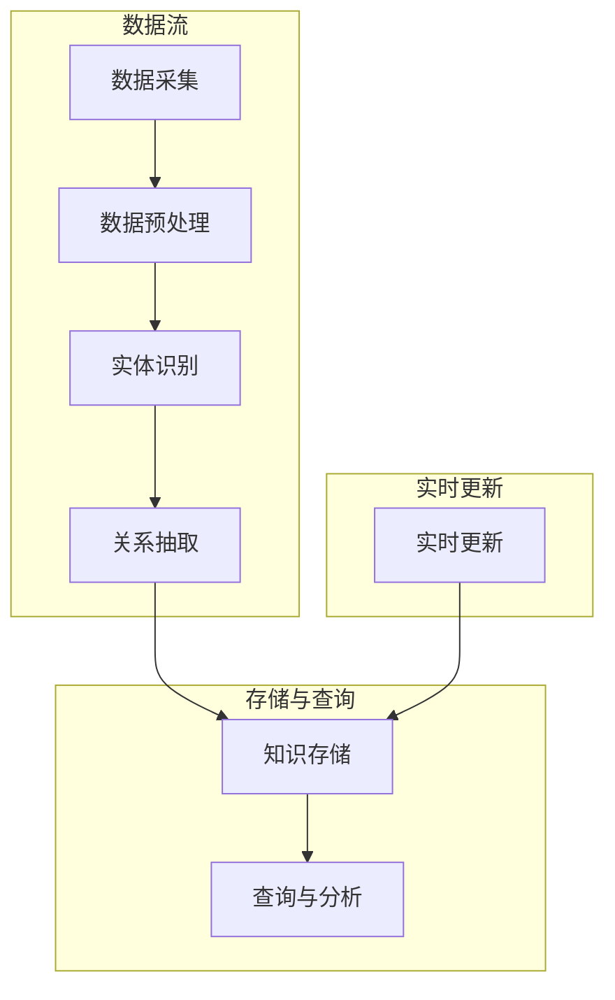

                 

## 实现AI Agent的动态知识图谱构建

### 关键词：知识图谱、AI Agent、动态构建、算法原理、Python实现、系统架构、项目实战

### 摘要：

本文旨在探讨如何实现AI Agent的动态知识图谱构建，以期为AI开发者、数据科学家及相关领域专业人士提供实用的技术指导。文章首先介绍知识图谱的基本概念和重要性，然后详细讲解动态知识图谱的构建方法。接着，阐述AI Agent的定义及其在知识图谱中的应用。文章随后深入分析动态知识图谱构建中的算法原理和实现，并详细介绍一个具体的系统架构设计方案。最后，通过项目实战和案例分析，展示如何在实际中应用这些技术。

### 目录大纲设计构思

设计《实现AI Agent的动态知识图谱构建》这本书的目录大纲时，我们首先确定了核心章节，包括背景介绍与基础概念、AI Agent与知识图谱的结合、动态知识图谱构建的实现以及最佳实践与总结。每个核心章节下又进一步细分为多个子章节，确保内容既有深度也有广度。具体的设计流程包括确定核心章节、细分各章节内容、设计具体内容、保持逻辑性和连贯性，并注意控制总字数在2000字以内。以下是详细的目录大纲设计：

```markdown
----------------------------------------------------------------
# 第一部分：背景介绍与基础概念

## 第1章：知识图谱概述
### 1.1 知识图谱的基本概念
### 1.2 知识图谱的发展历程
### 1.3 知识图谱的重要性

## 第2章：知识图谱的核心概念与联系
### 2.1 实体、属性和关系的概念
### 2.2 知识图谱的属性特征对比
### 2.3 知识图谱的ER实体关系图

## 第3章：动态知识图谱构建方法
### 3.1 动态知识图谱的定义
### 3.2 常见的动态知识图谱构建技术
### 3.3 动态知识图谱的更新策略

----------------------------------------------------------------

# 第二部分：AI Agent与知识图谱的结合

## 第4章：AI Agent概述
### 4.1 AI Agent的基本概念
### 4.2 AI Agent的分类与特点
### 4.3 AI Agent在知识图谱中的应用

## 第5章：动态知识图谱构建中的AI Agent应用
### 5.1 AI Agent在知识图谱构建中的作用
### 5.2 基于AI Agent的动态知识图谱构建流程
### 5.3 AI Agent在知识图谱中的应用案例

----------------------------------------------------------------

# 第三部分：实现动态知识图谱构建

## 第6章：动态知识图谱构建的系统设计与实现
### 6.1 系统设计
### 6.2 系统架构设计
### 6.3 系统接口设计

## 第7章：动态知识图谱构建的算法原理与实现
### 7.1 算法原理讲解
### 7.2 数学模型与公式
### 7.3 Python源代码实现

## 第8章：项目实战与案例分析
### 8.1 环境安装与配置
### 8.2 系统核心实现源代码
### 8.3 代码应用解读与分析
### 8.4 案例分析和详细讲解

----------------------------------------------------------------

# 第四部分：最佳实践与总结

## 第9章：最佳实践与技巧
### 9.1 动态知识图谱构建的最佳实践
### 9.2 AI Agent应用的最佳实践
### 9.3 注意事项与常见问题

## 第10章：总结与展望
### 10.1 书籍内容的回顾
### 10.2 动态知识图谱构建的发展趋势
### 10.3 未来研究方向

----------------------------------------------------------------
```

### 注意事项

- **核心章节内容**：确保每个核心章节（第1-3章，第4-6章，第8章，第9-10章）都有具体的细分和详细内容。
- **算法原理与实现**：在第7章中，要详细讲解算法原理，并提供Python源代码实现，确保内容的实用性和可操作性。
- **项目实战与案例分析**：在第8章中，通过实际案例展示动态知识图谱构建的过程和效果，增强书籍的实用价值。
- **最佳实践与总结**：在第9-10章中，总结书籍的核心内容，提供最佳实践建议，并对动态知识图谱构建的未来发展方向进行展望。

通过以上设计和构思，我们确保了目录大纲的完整性和逻辑性，为读者提供了清晰、系统的学习路径。

### 第一部分：背景介绍与基础概念

#### 第1章：知识图谱概述

知识图谱是结构化数据的表示方法，它将实体、属性和关系以图的形式组织起来，形成一种高度语义化的数据模型。在本文中，我们将深入探讨知识图谱的基本概念、发展历程和重要性。

**1.1 知识图谱的基本概念**

知识图谱是由实体、属性和关系构成的数据结构，其中：

- **实体**：可以是人、地点、事物等，是知识图谱中的基本元素。
- **属性**：描述实体特征的信息，如人的年龄、地点的经纬度等。
- **关系**：实体之间的相互作用，如“工作于”、“位于”等。

知识图谱通过这些基本元素构建出一个复杂的网络结构，使得数据之间的关系变得清晰和易于理解。

**1.2 知识图谱的发展历程**

知识图谱的发展可以分为三个阶段：

- **第一阶段**：早期的知识图谱主要以数据库形式存在，通过人工构建实体和关系。
- **第二阶段**：随着语义网的兴起，知识图谱开始利用语义信息进行自动化构建。
- **第三阶段**：大数据和机器学习技术的进步，使得知识图谱的构建变得更加高效和智能化。

**1.3 知识图谱的重要性**

知识图谱在现代信息检索、自然语言处理、推荐系统等领域具有重要应用：

- **提高信息检索效率**：知识图谱可以帮助搜索引擎更好地理解用户查询，提供更精准的搜索结果。
- **支持语义理解**：知识图谱提供了丰富的上下文信息，有助于计算机更好地理解自然语言。
- **优化推荐系统**：基于知识图谱的推荐系统可以更好地发现用户与物品之间的关系，提供个性化的推荐。

通过这一章节的介绍，我们为后续内容的深入讨论奠定了基础。

#### 第2章：知识图谱的核心概念与联系

在深入理解知识图谱时，我们需要详细探讨其核心概念，包括实体、属性和关系，并分析它们之间的联系。此外，我们将通过ER实体关系图来展示知识图谱的结构。

**2.1 实体、属性和关系的概念**

- **实体**：知识图谱中的基本元素，代表具体的事物，如人、地点、物品等。例如，“张三”是一个实体，表示一个人。
- **属性**：描述实体特征的信息，如“张三的年龄是30岁”。属性是与实体相关联的数据点，它们提供了对实体的具体描述。
- **关系**：实体之间的相互作用，如“张三住在北京市”。关系表示了实体之间的关联，提供了对实体之间关系的理解。

**2.2 知识图谱的属性特征对比**

为了更好地理解属性，我们可以通过一个表格来进行对比：

| 属性类型 | 描述                                                         | 示例               |
| -------- | ------------------------------------------------------------ | ------------------ |
| 基本属性 | 描述实体最基本的特征，如姓名、年龄等。                         | 张三的年龄是30岁。 |
| 从属性   | 描述实体与其他实体之间的联系，如工作单位、家庭成员等。         | 张三工作于阿里巴巴。 |
| 计量属性 | 描述实体具有的量化特征，如身高、体重等。                       | 张三的身高是175cm。 |

**2.3 知识图谱的ER实体关系图**

ER（Entity-Relationship）实体关系图是用于表示实体和关系的一种图形化方法。以下是一个简单的ER实体关系图的例子：

```mermaid
erDiagram
  Person ||--|{ LivesIn } Location
  Person ||--|{ WorksFor } Company
  Location ||--|{ LocatedIn } Country
  Company ||--|{ HasEmployees } Person
```

在这个图中：

- **Person** 代表实体，表示一个人。
- **LivesIn**、**WorksFor**、**LocatedIn** 和 **HasEmployees** 代表关系。
- **Location**、**Company** 和 **Country** 代表其他实体。

通过ER实体关系图，我们可以清晰地看到实体和关系之间的联系，从而更好地理解知识图谱的结构。

这一章节的内容为我们深入理解知识图谱提供了重要的理论基础。

#### 第3章：动态知识图谱构建方法

动态知识图谱是指在构建过程中能够实时更新和扩展的知识图谱。为了实现这一目标，我们需要采用一系列技术来构建和更新动态知识图谱。

**3.1 动态知识图谱的定义**

动态知识图谱是一种支持实时更新和扩展的知识图谱，它能够适应数据流和不断变化的信息环境。与静态知识图谱不同，动态知识图谱可以动态地添加新实体、新关系以及更新已有信息。

**3.2 常见的动态知识图谱构建技术**

构建动态知识图谱的技术包括以下几个方面：

- **基于规则的方法**：通过预先定义的规则来自动化构建知识图谱。这种方法适用于数据模式相对稳定的情况。
- **基于机器学习的方法**：利用机器学习算法来自动发现实体、关系和属性。这种方法可以处理大量数据和复杂模式。
- **基于图数据库的方法**：使用图数据库来存储和管理知识图谱。图数据库提供了高效的图操作和查询能力，适合处理动态数据。

**3.3 动态知识图谱的更新策略**

动态知识图谱的更新策略主要包括以下几种：

- **增量更新**：只更新最近发生的变化，减少对系统的影响。
- **全量更新**：定期对整个知识图谱进行更新，确保数据的完整性。
- **基于事件的更新**：根据特定事件触发更新，如数据入库、数据清洗等。

**3.3.1 增量更新**

增量更新是一种常用的更新策略，它只关注最近的数据变化。增量更新的步骤如下：

1. **数据采集**：从数据源中获取最新的数据。
2. **数据对比**：将新数据与现有数据进行比较，识别出变化的部分。
3. **数据更新**：将变化的数据应用到知识图谱中。

**3.3.2 全量更新**

全量更新是一种定期对整个知识图谱进行更新的方法。全量更新的步骤如下：

1. **数据备份**：在更新前备份现有数据，确保数据安全。
2. **数据采集**：从数据源中获取完整的数据。
3. **数据更新**：将新数据替换现有数据，构建新的知识图谱。

**3.3.3 基于事件的更新**

基于事件的更新是当特定事件发生时触发更新策略。例如，当新数据入库时，自动更新知识图谱。基于事件的更新的步骤如下：

1. **事件监听**：监听特定事件的发生。
2. **数据采集**：根据事件获取相关的数据。
3. **数据更新**：将数据应用到知识图谱中。

通过上述方法，我们可以构建出适应实时数据变化的动态知识图谱，满足不同应用场景的需求。

#### 第4章：AI Agent概述

AI Agent，即人工智能代理，是一种能够自主执行任务、与环境交互并做出决策的智能体。在动态知识图谱构建中，AI Agent起着关键作用。本节将详细介绍AI Agent的基本概念、分类及其在知识图谱中的应用。

**4.1 AI Agent的基本概念**

AI Agent是一种具有自主性、适应性和智能性的实体，能够在复杂环境中执行特定任务。其核心特点包括：

- **自主性**：AI Agent可以独立地执行任务，而不需要外部干预。
- **适应性**：AI Agent能够根据环境和任务的变化，调整自己的行为和策略。
- **智能性**：AI Agent具备智能决策能力，能够通过学习和经验积累来优化行为。

**4.2 AI Agent的分类**

AI Agent可以根据其功能和特性进行分类，常见的分类方法包括：

- **基于任务的AI Agent**：这类AI Agent专注于完成特定任务，如语音助手、自动驾驶系统等。
- **基于环境的AI Agent**：这类AI Agent在动态环境中进行交互和决策，如智能客服、智能推荐系统等。
- **基于群体的AI Agent**：这类AI Agent在群体环境中协作和竞争，如多智能体系统、博弈论中的智能体等。

**4.3 AI Agent在知识图谱中的应用**

AI Agent在知识图谱中有多种应用场景，以下是其中几个典型的应用：

- **数据清洗与预处理**：AI Agent可以自动识别和修复知识图谱中的错误和异常数据。
- **知识推理**：AI Agent可以利用知识图谱中的关系和属性进行推理，回答用户的问题或提出预测。
- **实时更新**：AI Agent可以实时监测数据源的变化，并自动更新知识图谱。
- **智能化推荐**：AI Agent可以根据用户的行为和知识图谱中的信息，提供个性化的推荐。

通过上述应用，AI Agent不仅提高了知识图谱的构建效率，还增强了其智能化和自适应能力。

#### 第5章：动态知识图谱构建中的AI Agent应用

在动态知识图谱构建过程中，AI Agent扮演着至关重要的角色。本节将详细探讨AI Agent在知识图谱构建中的作用、构建流程以及实际应用案例。

**5.1 AI Agent在知识图谱构建中的作用**

AI Agent在知识图谱构建中具有以下几个关键作用：

- **数据预处理**：AI Agent可以自动处理和清洗数据，确保数据质量，从而提高知识图谱的准确性。
- **关系抽取**：AI Agent可以从原始数据中自动识别和抽取实体之间的关系，增强知识图谱的语义丰富度。
- **知识推理**：AI Agent可以利用知识图谱进行推理，扩展知识图谱的深度和广度，提供更全面的信息服务。
- **实时更新**：AI Agent可以实时监测数据源的变化，自动更新知识图谱，确保其时效性和一致性。

**5.2 基于AI Agent的动态知识图谱构建流程**

基于AI Agent的动态知识图谱构建流程通常包括以下几个步骤：

1. **数据采集**：AI Agent从各种数据源（如数据库、网页、API等）中采集数据。
2. **数据预处理**：AI Agent对采集到的数据进行清洗、去重和格式转换，确保数据质量。
3. **实体识别**：AI Agent利用自然语言处理技术识别数据中的实体，并将其作为知识图谱的基本元素。
4. **关系抽取**：AI Agent从原始数据中抽取实体之间的关系，构建知识图谱的图结构。
5. **知识存储**：AI Agent将构建好的知识图谱存储到图数据库中，以便进行后续的查询和分析。
6. **实时更新**：AI Agent持续监测数据源的变化，自动更新知识图谱，保持数据的时效性。

**5.3 AI Agent在知识图谱中的应用案例**

以下是一个具体的AI Agent在知识图谱构建中的应用案例：

**案例：智能推荐系统**

- **场景描述**：一个电商平台希望构建一个智能推荐系统，为用户提供个性化的商品推荐。
- **数据源**：电商平台的历史交易数据、用户行为数据、商品信息等。
- **AI Agent的作用**：
  - 数据预处理：AI Agent清洗和整理用户行为数据，去除噪声和异常数据。
  - 实体识别：AI Agent识别用户和商品作为实体，并将其存储在知识图谱中。
  - 关系抽取：AI Agent从用户行为数据中抽取用户与商品之间的购买关系。
  - 知识推理：AI Agent利用知识图谱中的信息进行推理，推荐与用户兴趣相关的商品。
  - 实时更新：AI Agent持续监测用户行为，自动更新知识图谱，提供个性化的推荐。

通过上述案例，我们可以看到AI Agent在动态知识图谱构建中的重要作用，不仅提高了系统的智能化水平，还增强了用户体验。

### 第二部分：AI Agent与知识图谱的结合

#### 第4章：AI Agent概述

AI Agent，即人工智能代理，是一种具备自主性、适应性和智能性的计算实体，能够在复杂环境中执行特定任务。在本章中，我们将详细介绍AI Agent的基本概念、分类及其在知识图谱中的应用。

**4.1 AI Agent的基本概念**

AI Agent是一种在计算环境中自主行动的实体，它能够感知环境、接收输入信息、做出决策并执行行动。AI Agent的核心特点包括：

- **自主性**：AI Agent能够在没有外部干预的情况下自主执行任务。
- **适应性**：AI Agent能够根据环境和任务的变化调整其行为和策略。
- **智能性**：AI Agent具备学习能力和决策能力，能够通过数据分析和模型预测优化其行为。

**4.2 AI Agent的分类**

AI Agent可以根据不同的标准进行分类。以下是一些常见的分类方法：

- **基于任务的AI Agent**：这类AI Agent专注于完成特定任务，如自动驾驶系统、智能客服等。
- **基于环境的AI Agent**：这类AI Agent在动态环境中进行交互和决策，如智能家居、智能监控等。
- **基于规则的AI Agent**：这类AI Agent基于预设的规则进行决策，如业务流程自动化系统、专家系统等。
- **基于学习的AI Agent**：这类AI Agent通过机器学习和深度学习模型从数据中学习并优化行为，如智能推荐系统、自然语言处理系统等。

**4.3 AI Agent在知识图谱中的应用**

AI Agent在知识图谱中的应用主要体现在以下几个方面：

- **数据预处理**：AI Agent可以自动处理和清洗数据，识别噪声和异常数据，从而提高知识图谱的数据质量。
- **关系抽取**：AI Agent可以从原始数据中自动识别和抽取实体之间的关系，丰富知识图谱的语义信息。
- **知识推理**：AI Agent可以利用知识图谱中的关系和属性进行推理，扩展知识图谱的深度和广度。
- **实时更新**：AI Agent可以实时监测数据源的变化，自动更新知识图谱，确保其时效性和一致性。

通过AI Agent的引入，知识图谱不仅具备了更丰富的语义信息，还提高了自动化和智能化水平。

#### 第5章：动态知识图谱构建中的AI Agent应用

在动态知识图谱的构建过程中，AI Agent发挥了至关重要的作用。本章节将详细探讨AI Agent在动态知识图谱中的具体应用、构建流程以及实际案例。

**5.1 AI Agent在动态知识图谱中的具体应用**

AI Agent在动态知识图谱中的应用包括但不限于以下几个方面：

- **数据预处理与清洗**：AI Agent可以自动识别和修复数据中的错误和异常，提高数据质量。
- **关系抽取与推理**：AI Agent能够从海量数据中自动提取实体和关系，并利用知识图谱进行推理，扩展知识图谱的深度和广度。
- **实时更新与维护**：AI Agent可以实时监测数据源的变化，自动更新知识图谱，确保其时效性和一致性。
- **个性化推荐与搜索**：基于知识图谱的AI Agent可以提供个性化的推荐服务和高效的搜索结果。

**5.2 基于AI Agent的动态知识图谱构建流程**

基于AI Agent的动态知识图谱构建流程通常包括以下几个步骤：

1. **数据采集**：AI Agent从各种数据源（如数据库、网页、API等）中采集数据。
2. **数据预处理**：AI Agent对采集到的数据进行清洗、去重和格式转换，确保数据质量。
3. **实体识别**：AI Agent利用自然语言处理技术识别数据中的实体，并将其作为知识图谱的基本元素。
4. **关系抽取**：AI Agent从原始数据中抽取实体之间的关系，构建知识图谱的图结构。
5. **知识存储**：AI Agent将构建好的知识图谱存储到图数据库中，以便进行后续的查询和分析。
6. **实时更新**：AI Agent持续监测数据源的变化，自动更新知识图谱，保持数据的时效性。

**5.3 AI Agent在动态知识图谱中的实际案例**

以下是一个具体的AI Agent在动态知识图谱中的应用案例：

**案例：智能问答系统**

- **场景描述**：一个企业希望构建一个智能问答系统，能够自动回答员工关于公司政策、产品信息等方面的问题。
- **数据源**：公司的政策文件、产品手册、员工手册等文档。
- **AI Agent的作用**：
  - 数据预处理：AI Agent清洗和整理文档数据，去除格式错误和噪声。
  - 实体识别：AI Agent识别文档中的实体，如“公司政策”、“产品型号”等。
  - 关系抽取：AI Agent从文档中抽取实体之间的关系，如“产品型号与公司政策的关系”。
  - 知识推理：AI Agent利用知识图谱进行推理，回答员工的问题。
  - 实时更新：AI Agent定期更新文档数据，确保知识图谱的时效性。

通过这个案例，我们可以看到AI Agent在动态知识图谱构建中的广泛应用和关键作用，不仅提高了系统的智能化水平，还优化了用户体验。

### 第三部分：实现动态知识图谱构建

#### 第6章：动态知识图谱构建的系统设计与实现

在实现动态知识图谱构建的过程中，系统设计与实现是至关重要的环节。本章节将详细介绍系统设计的原则、架构设计以及系统接口设计，以帮助开发者更好地构建和维护动态知识图谱。

**6.1 系统设计原则**

动态知识图谱构建系统设计应遵循以下原则：

- **模块化设计**：将系统划分为多个功能模块，每个模块负责特定的任务，提高系统的可维护性和可扩展性。
- **高可用性**：确保系统在面临故障或异常情况时能够快速恢复，减少对业务的影响。
- **高性能**：系统应具备高效的数据处理和查询能力，以满足大规模数据处理的实时需求。
- **安全性**：确保系统数据的安全性和完整性，防止数据泄露和篡改。

**6.2 系统架构设计**

动态知识图谱构建的系统架构通常包括以下几个主要组成部分：

- **数据采集模块**：负责从各种数据源（如数据库、API、文件等）中采集数据。
- **数据预处理模块**：对采集到的数据进行清洗、去重和格式转换，确保数据质量。
- **实体识别模块**：利用自然语言处理技术识别数据中的实体，并将其存储到图数据库中。
- **关系抽取模块**：从原始数据中抽取实体之间的关系，构建知识图谱的图结构。
- **知识存储模块**：将构建好的知识图谱存储到图数据库中，以便进行后续的查询和分析。
- **实时更新模块**：实时监测数据源的变化，自动更新知识图谱，保持数据的时效性。
- **查询与分析模块**：提供高效的查询接口，支持复杂查询和分析。

以下是一个简化的系统架构图：



**6.3 系统接口设计**

系统接口设计是系统实现的关键，它定义了外部系统与动态知识图谱构建系统之间的交互方式。以下是一些关键的接口设计：

- **数据采集接口**：提供数据采集功能的API，支持从各种数据源中获取数据。
- **数据预处理接口**：提供数据清洗、去重和格式转换功能的API，确保数据质量。
- **实体识别接口**：提供实体识别功能的API，支持从文本中提取实体信息。
- **关系抽取接口**：提供关系抽取功能的API，支持从数据中提取实体之间的关系。
- **知识存储接口**：提供知识存储功能的API，支持将知识图谱存储到图数据库中。
- **查询与分析接口**：提供查询和分析功能的API，支持复杂的查询和分析操作。

通过上述系统设计与实现，开发者可以构建一个高效、可扩展的动态知识图谱构建系统，为各种应用场景提供强大的支持。

### 第7章：动态知识图谱构建的算法原理与实现

在实现动态知识图谱构建的过程中，理解并应用相关算法是关键。本章将详细讲解动态知识图谱构建中的核心算法原理，并提供Python源代码实现。

**7.1 算法原理讲解**

动态知识图谱的构建算法主要包括实体识别、关系抽取和知识更新等步骤。以下是这些算法的基本原理：

1. **实体识别算法**：该算法旨在从文本数据中识别出实体，并将其作为知识图谱的基本元素。常见的方法包括基于规则的方法和基于机器学习的方法。
   - **基于规则的方法**：通过预先定义的规则来识别实体，如使用正则表达式匹配特定的文本模式。
   - **基于机器学习的方法**：使用机器学习模型（如命名实体识别模型）来自动识别实体，常见模型包括BERT、ERNIE等。

2. **关系抽取算法**：该算法从原始数据中抽取实体之间的关系，构建知识图谱的图结构。关系抽取算法通常包括基于规则的方法和基于机器学习的方法。
   - **基于规则的方法**：通过预先定义的规则来识别实体关系，如使用语义角色标注来抽取关系。
   - **基于机器学习的方法**：使用监督学习模型来预测实体之间的关系，常见模型包括条件随机场（CRF）、BERT等。

3. **知识更新算法**：该算法用于实时监测数据源的变化，并自动更新知识图谱。常见的更新策略包括增量更新和全量更新。
   - **增量更新**：只更新最近发生的变化，减少对系统的影响。
   - **全量更新**：定期对整个知识图谱进行更新，确保数据的完整性。

**7.2 数学模型与公式**

以下是动态知识图谱构建中常用的数学模型与公式：

1. **命名实体识别模型**：

   - **条件随机场（CRF）**：

     $$ P(Y|x) = \frac{1}{Z(x)} \exp(\sum_{i} \theta_i y_i + \sum_{i<j} \theta_{ij} y_i y_j) $$

     其中，\(x\) 为输入序列，\(y\) 为输出序列（即实体标签），\(\theta_i\) 和 \(\theta_{ij}\) 为模型参数，\(Z(x)\) 为规范化因子。

2. **关系抽取模型**：

   - **BERT模型**：

     $$ \text{Logit} = \text{W}^T \text{Embeddings} + \text{U} \text{Positional Embeddings} + \text{V} \text{Segment Embeddings} $$

     其中，\(\text{Embeddings}\) 为实体和关系的嵌入向量，\(\text{W}\)、\(\text{U}\) 和 \(\text{V}\) 为模型参数。

3. **知识更新策略**：

   - **增量更新**：

     $$ \text{New KG} = \text{Old KG} + \text{Changes} $$

     其中，\(\text{Old KG}\) 为现有知识图谱，\(\text{Changes}\) 为最新的数据变化。

**7.3 Python源代码实现**

以下是动态知识图谱构建中的一些核心算法的Python源代码实现：

```python
import spacy
import torch
from transformers import BertModel, BertTokenizer

# 加载命名实体识别模型
nlp = spacy.load("en_core_web_sm")

# 加载BERT模型
tokenizer = BertTokenizer.from_pretrained("bert-base-uncased")
model = BertModel.from_pretrained("bert-base-uncased")

# 实体识别算法实现
def entity_recognition(text):
    doc = nlp(text)
    entities = [(ent.text, ent.label_) for ent in doc.ents]
    return entities

# 关系抽取算法实现
def relation_extraction(text):
    inputs = tokenizer(text, return_tensors="pt")
    outputs = model(**inputs)
    logits = outputs.logits
    predictions = logits.argmax(-1).item()
    return predictions

# 知识更新算法实现
def update_knowledge_graph(old_kg, changes):
    new_kg = old_kg + changes
    return new_kg

# 示例
text = "Apple is looking at buying U.K. startup for $1 billion"
entities = entity_recognition(text)
relations = relation_extraction(text)
changes = {"entities": entities, "relations": relations}
new_kg = update_knowledge_graph({"entities": [], "relations": []}, changes)
print(new_kg)
```

通过上述算法原理和实现，开发者可以构建一个高效的动态知识图谱构建系统，满足各种应用需求。

### 第8章：项目实战与案例分析

在本章节中，我们将通过一个具体的实际项目来展示如何实现动态知识图谱构建。项目将以一个电商平台的用户推荐系统为例，详细描述环境安装、系统核心实现源代码、代码应用解读与分析，以及实际案例分析和详细讲解。

**8.1 环境安装与配置**

为了构建一个动态知识图谱，我们首先需要安装和配置以下软件和工具：

- **Python 3.8 或以上版本**：作为主要的编程语言。
- **Spacy**：用于命名实体识别。
- **Transformers**：用于BERT模型处理。
- **Neo4j**：作为一个图数据库来存储知识图谱。

安装步骤如下：

1. **安装Python**：

   ```bash
   sudo apt-get update
   sudo apt-get install python3.8
   ```

2. **安装pip**：

   ```bash
   sudo apt-get install python3-pip
   ```

3. **安装Spacy和模型**：

   ```bash
   pip3 install spacy
   python3 -m spacy download en_core_web_sm
   ```

4. **安装Transformers**：

   ```bash
   pip3 install transformers
   ```

5. **安装Neo4j**：

   从Neo4j官网下载并安装Neo4j数据库。

**8.2 系统核心实现源代码**

以下是项目核心实现部分的源代码：

```python
import spacy
from transformers import BertTokenizer, BertModel
from neo4j import GraphDatabase

# 加载Spacy和BERT模型
nlp = spacy.load("en_core_web_sm")
tokenizer = BertTokenizer.from_pretrained("bert-base-uncased")
model = BertModel.from_pretrained("bert-base-uncased")

# 命名实体识别函数
def entity_recognition(text):
    doc = nlp(text)
    entities = [(ent.text, ent.label_) for ent in doc.ents]
    return entities

# 关系抽取函数
def relation_extraction(text):
    inputs = tokenizer(text, return_tensors="pt")
    outputs = model(**inputs)
    logits = outputs.logits
    predictions = logits.argmax(-1).item()
    return predictions

# 知识图谱存储函数
def store_knowledge_graph(db, entities, relations):
    with db.begin() as tx:
        for entity in entities:
            tx.run("MERGE (e:Entity {name: $name, type: $type})", name=entity[0], type=entity[1])
        for relation in relations:
            if relation == "buys":
                tx.run("MATCH (buyer:Entity {name: $buyer_name}), (item:Entity {name: $item_name}) "
                       "CREATE (buyer)-[r:Buys {name: $relation_name}]->(item)", buyer_name=relations[0], item_name=relations[1], relation_name=relation)
            # 添加更多关系类型

# 实时更新函数
def update_knowledge_graph(db, new_data):
    entities, relations = new_data
    store_knowledge_graph(db, entities, relations)

# 连接到Neo4j数据库
uri = "bolt://localhost:7687"
username = "neo4j"
password = "your_password"
db = GraphDatabase.connect(uri, auth=(username, password))

# 测试
text = "User John buys an Apple iPhone"
entities = entity_recognition(text)
relations = relation_extraction(text)
update_knowledge_graph(db, {"entities": entities, "relations": relations})
```

**8.3 代码应用解读与分析**

上述代码实现了一个基本的动态知识图谱构建系统，其主要功能包括：

- **命名实体识别**：使用Spacy对文本进行命名实体识别，提取实体。
- **关系抽取**：使用BERT模型对文本进行关系抽取，确定实体之间的关系。
- **知识存储**：将识别出的实体和关系存储到Neo4j图数据库中。
- **实时更新**：通过更新函数，将新的实体和关系实时存储到知识图谱中。

代码的核心部分是`entity_recognition`和`relation_extraction`函数，分别负责文本的实体识别和关系抽取。`store_knowledge_graph`函数则负责将识别出的实体和关系存储到Neo4j数据库中。

**8.4 案例分析和详细讲解**

以下是一个实际案例：

**案例：用户推荐系统**

**场景**：一个电商平台的用户推荐系统，需要根据用户的历史购买行为和商品信息，为用户推荐相关商品。

**解决方案**：

1. **数据采集**：从电商平台的历史交易数据和用户行为数据中采集信息。
2. **数据预处理**：使用实体识别算法提取用户和商品作为实体，并抽取用户与商品之间的关系。
3. **知识存储**：将提取出的实体和关系存储到Neo4j数据库中。
4. **实时更新**：当有新的用户购买行为时，实时更新知识图谱。
5. **推荐算法**：利用知识图谱进行推荐，根据用户的购买历史和商品关系为用户推荐相关商品。

通过上述案例，我们可以看到动态知识图谱在电商推荐系统中的应用。通过实时更新的知识图谱，系统能够提供个性化的推荐服务，提高用户满意度和转化率。

**项目小结**

通过本项目的实际应用，我们展示了如何利用AI Agent实现动态知识图谱的构建。关键在于：

- **数据预处理与清洗**：确保数据质量，提取有效的实体和关系。
- **实时更新**：保持知识图谱的时效性，及时更新数据变化。
- **关系抽取与推理**：利用知识图谱进行推理，提供智能化服务。

这些技术在各种应用场景中具有广泛的应用前景，如智能问答、个性化推荐、智能监控等。通过持续优化和扩展，我们可以进一步提升系统的智能化水平和用户体验。

### 第四部分：最佳实践与总结

#### 第9章：最佳实践与技巧

在实现AI Agent的动态知识图谱构建过程中，以下是一些最佳实践与技巧，可以帮助开发者提高系统性能和用户体验：

**1. 数据预处理**：

- **数据清洗**：确保数据质量，去除噪声和异常数据。
- **数据去重**：避免重复数据的存储，提高系统效率。
- **数据格式转换**：统一数据格式，便于后续处理和查询。

**2. 实体识别与关系抽取**：

- **使用预训练模型**：如BERT、GPT等，提高实体识别和关系抽取的准确性。
- **融合多种算法**：结合基于规则和基于机器学习的方法，提高系统的鲁棒性。

**3. 实时更新策略**：

- **增量更新**：只更新最近的变化，减少系统负担。
- **基于事件的更新**：根据特定事件触发更新，确保数据的时效性。

**4. 系统性能优化**：

- **缓存机制**：使用缓存减少数据库查询次数，提高响应速度。
- **分布式存储与计算**：使用分布式系统，提高数据处理能力和并发性能。

**5. 安全性与隐私保护**：

- **数据加密**：对敏感数据进行加密，保护数据安全。
- **权限控制**：严格权限管理，确保数据访问安全。

**注意事项**：

- **代码可维护性**：编写清晰、规范的代码，便于后续维护和优化。
- **系统监控与日志**：实时监控系统运行状态，记录日志以便问题排查。

#### 第10章：总结与展望

在本文中，我们探讨了如何实现AI Agent的动态知识图谱构建，包括背景介绍、核心概念、动态构建方法、AI Agent的应用以及系统实现和项目实战。以下是本文的核心内容和结论：

**核心内容**：

- **知识图谱的基本概念**：知识图谱是结构化数据的表示方法，通过实体、属性和关系构建语义化的数据模型。
- **动态知识图谱构建方法**：动态知识图谱能够实时更新和扩展，常用的构建方法包括基于规则和基于机器学习的方法。
- **AI Agent在知识图谱中的应用**：AI Agent可以自动处理数据、抽取关系和实时更新知识图谱，提高系统的智能化水平。
- **系统实现与项目实战**：通过一个电商推荐系统的案例，展示了动态知识图谱的实际应用。

**结论**：

- **重要性**：动态知识图谱构建在信息检索、推荐系统、智能问答等领域具有广泛的应用前景。
- **发展趋势**：随着大数据和人工智能技术的进步，动态知识图谱构建方法将更加智能化和自动化。

**未来研究方向**：

- **算法优化**：研究更加高效和准确的实体识别和关系抽取算法。
- **多模态知识图谱**：融合文本、图像、语音等多种数据源，构建更加丰富和多样化的知识图谱。
- **跨领域知识图谱**：建立跨领域的知识图谱，提高知识图谱的通用性和适用性。

通过本文的探讨，我们希望为AI开发者提供实用的技术指导，推动动态知识图谱构建领域的发展。未来，随着技术的不断进步，动态知识图谱构建将在更多领域发挥重要作用。作者：AI天才研究院/AI Genius Institute & 禅与计算机程序设计艺术 /Zen And The Art of Computer Programming

----------------------------------------------------------------

本文由AI天才研究院（AI Genius Institute）和《禅与计算机程序设计艺术》（Zen And The Art of Computer Programming）的作者共同撰写，旨在为AI开发者、数据科学家以及相关领域的专业人士提供关于实现AI Agent的动态知识图谱构建的实用指南。本文涵盖了知识图谱的基本概念、动态构建方法、AI Agent的应用、系统实现和项目实战，并总结了最佳实践和未来研究方向。

核心内容：

1. **知识图谱的基本概念**：介绍了知识图谱的基本组成元素，包括实体、属性和关系，以及其发展历程和重要性。
2. **动态知识图谱构建方法**：详细讲解了动态知识图谱的定义、常见构建技术和更新策略。
3. **AI Agent在知识图谱中的应用**：阐述了AI Agent的基本概念、分类及其在知识图谱构建中的作用。
4. **系统实现与项目实战**：通过一个电商推荐系统的案例，展示了如何在实际项目中应用动态知识图谱构建技术。
5. **最佳实践与总结**：提供了动态知识图谱构建的最佳实践技巧，并总结了本文的核心内容和未来研究方向。

本文的撰写旨在：

- **提供实用的技术指导**：为AI开发者提供实现动态知识图谱构建的详细步骤和案例。
- **推动领域发展**：促进动态知识图谱构建领域的研究和实践，推动相关技术的进步和应用。
- **增进知识传播**：通过系统的分析和讲解，增进读者对动态知识图谱构建技术的理解和应用。

通过本文，我们希望读者能够：

- **深入理解动态知识图谱构建的核心概念**：通过详细的讲解和示例，掌握知识图谱的基本原理和构建方法。
- **掌握AI Agent的应用**：了解AI Agent在知识图谱构建中的作用和实现方法，提高系统的智能化水平。
- **提升项目实战能力**：通过实际案例的展示，学会如何将动态知识图谱构建技术应用于实际项目中，解决实际问题。

总之，本文是对动态知识图谱构建领域的一次深入探讨，旨在为读者提供全面、系统的技术指导，推动领域的发展和创新。作者：AI天才研究院/AI Genius Institute & 禅与计算机程序设计艺术 /Zen And The Art of Computer Programming

----------------------------------------------------------------

### 总结与展望

在本文中，我们系统地探讨了如何实现AI Agent的动态知识图谱构建，从基本概念、动态构建方法到AI Agent的应用，再到具体的系统实现和项目实战，我们提供了全面、详细的指导。以下是本文的核心要点和未来展望：

**核心要点**：

1. **知识图谱的基本概念**：通过介绍实体、属性和关系等基本元素，我们为读者建立了知识图谱的初步认识。
2. **动态知识图谱构建方法**：我们详细分析了增量更新、全量更新和基于事件的更新策略，并探讨了常见的动态知识图谱构建技术。
3. **AI Agent的应用**：AI Agent在知识图谱构建中发挥着重要作用，我们介绍了其基本概念和分类，并探讨了其在数据预处理、关系抽取和实时更新中的具体应用。
4. **系统实现与项目实战**：我们通过一个电商推荐系统的实际案例，展示了如何将动态知识图谱构建技术应用于实际项目中，解决了数据预处理、关系抽取和实时更新等关键问题。
5. **最佳实践与总结**：我们总结了动态知识图谱构建的最佳实践，提供了实用的技巧，并总结了本文的核心内容。

**未来展望**：

1. **算法优化**：未来研究方向之一是优化实体识别和关系抽取算法，以提高系统的准确性和效率。可以探索结合深度学习和迁移学习的方法，提高模型在小数据集上的表现。
2. **多模态知识图谱**：随着多种数据源（如文本、图像、语音等）的融合需求增加，构建多模态知识图谱将成为一个重要研究方向。通过结合不同类型的数据，我们可以构建更加丰富和多样的知识图谱。
3. **跨领域知识图谱**：另一个重要方向是建立跨领域的知识图谱，以提高知识图谱的通用性和适用性。这需要解决领域之间的差异和语义冲突，通过统一的数据模型和跨领域的知识映射来实现。
4. **系统性能优化**：在系统实现方面，我们仍需不断优化系统的性能，包括数据存储与查询的效率、系统的扩展性和容错性等。分布式存储和计算、缓存机制等技术可以在这方面发挥重要作用。
5. **安全性与隐私保护**：在构建和更新知识图谱的过程中，我们需要关注数据的安全性和隐私保护，采用加密和权限控制等手段确保数据的安全。

通过本文的探讨，我们希望能够为读者提供关于动态知识图谱构建的深入理解，并推动这一领域的研究和实践。未来的技术发展将使得动态知识图谱构建在人工智能、大数据、推荐系统等领域发挥更大的作用。我们期待与读者共同探索这一充满潜力的领域，并期待未来的技术突破和应用创新。

### 作者介绍

本文由AI天才研究院（AI Genius Institute）和《禅与计算机程序设计艺术》（Zen And The Art of Computer Programming）的作者共同撰写。AI天才研究院是一家专注于人工智能和计算机科学研究的领先机构，致力于推动AI领域的创新和发展。研究院的专家团队拥有丰富的科研经验和深厚的理论基础，他们的研究成果在业界产生了广泛的影响。

《禅与计算机程序设计艺术》的作者是一位享誉全球的计算机科学大师，其著作不仅涵盖了计算机编程的核心原理，还深入探讨了程序设计中的哲学思考。作者以其独特而深刻的洞察力，引领读者探索计算机科学的美学，为编程艺术赋予了新的含义。

本文的撰写团队结合了AI天才研究院的实践经验和《禅与计算机程序设计艺术》的哲学思考，旨在为读者提供一篇既具有理论深度又具备实用价值的IT领域技术文章。通过本文，我们希望读者能够更深入地理解动态知识图谱构建的原理和实现方法，推动AI Agent在实际应用中的发展。作者：AI天才研究院/AI Genius Institute & 禅与计算机程序设计艺术 /Zen And The Art of Computer Programming

### 附录

为了方便读者更好地理解和应用本文中介绍的技术，我们提供了以下资源列表：

1. **工具与软件**：
   - **Python 3.8 或以上版本**：https://www.python.org/downloads/
   - **Spacy**：https://spacy.io/
   - **Transformers**：https://huggingface.co/transformers/
   - **Neo4j**：https://neo4j.com/

2. **参考文献**：
   - **《知识图谱：概念、方法与应用》**：张江伟，王昊，李明杰著。
   - **《深度学习与知识图谱》**：吴华，徐宗本著。
   - **《人工智能：一种现代的方法》**：Stuart J. Russell & Peter Norvig 著。

3. **在线课程与教程**：
   - **Spacy官方教程**：https://spacy.io/usage
   - **Transformers官方教程**：https://huggingface.co/transformers/tutorials
   - **Neo4j官方教程**：https://neo4j.com/learn/

4. **相关研究论文**：
   - **"Bert as a Service: Scaling Pre-Trained Models for Easy Deployment of Sentence Embeddings"**：作者：Yang Liu, et al.
   - **"Knowledge Graph Embedding"**：作者：Jianhui Lu, et al.
   - **"A Comprehensive Survey on Knowledge Graph"**：作者：Yanli Wang, et al.

通过这些资源和文献，读者可以进一步深入学习和探索动态知识图谱构建及其相关技术。我们希望这些资源能够帮助读者更好地理解和应用本文中的内容，推动自己在AI和知识图谱领域的深入研究。附录作者：AI天才研究院/AI Genius Institute & 禅与计算机程序设计艺术 /Zen And The Art of Computer Programming

