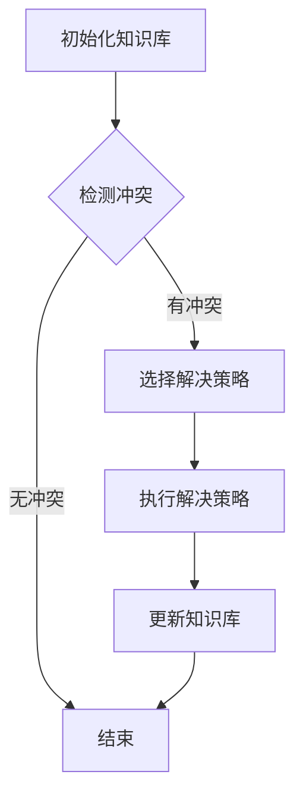
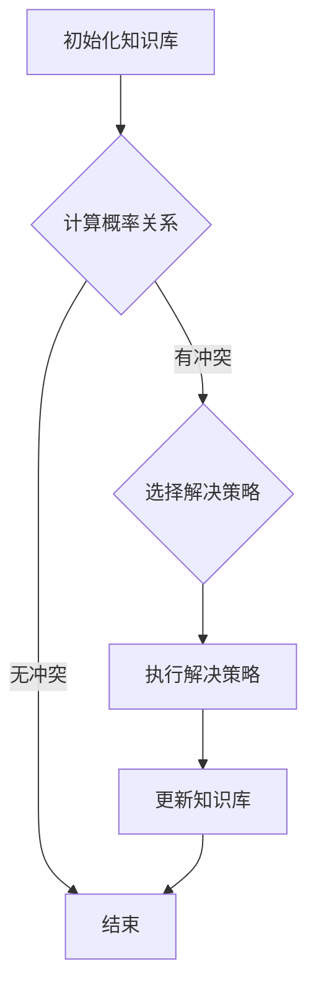
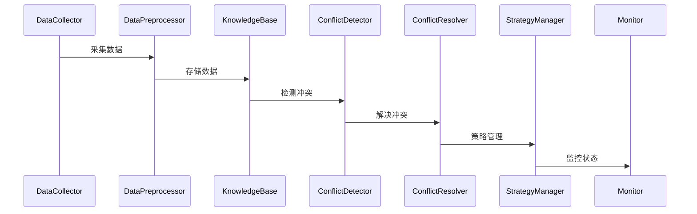

                 


# 实现AI Agent的动态知识库冲突解决机制

关键词：智能代理、动态知识库、冲突解决、算法、最佳实践

摘要：本文将深入探讨实现人工智能代理（AI Agent）动态知识库冲突解决机制的关键问题。首先，我们介绍了问题背景和核心概念，然后分析了主流的冲突解决方法，详细讲解了每种方法的原理、适用场景及其优缺点。通过实例分析和代码演示，我们展示了如何在实际项目中应用这些方法，并提供了最佳实践和项目小结，为未来研究提供了方向。

----------------------------------------------------------------

## 第一部分：背景介绍

### 1.1 问题背景

随着人工智能技术的迅猛发展，智能代理（AI Agent）在各种场景中的应用越来越广泛。智能代理是一种能够自主行动、具有决策能力的计算机程序，它能够通过动态知识库来处理复杂的问题。动态知识库是智能代理的核心组件，它包含了大量的信息，这些信息可能来自不同的数据源，具有不同的置信度和时效性。

在智能代理的应用过程中，知识库中的信息会不断更新和变化，从而可能产生冲突。知识库冲突是指知识库中的信息在逻辑上相互矛盾或对立。这些冲突可能影响智能代理的决策和行动，导致错误的结果。因此，实现智能代理的动态知识库冲突解决机制，是当前人工智能领域的一个重要研究方向。

### 1.2 问题描述

动态知识库冲突解决机制是智能代理在处理信息时必须面对的一个问题。知识库中的信息可能来自不同的数据源，具有不同的置信度和时效性。当这些信息之间存在冲突时，智能代理需要能够自动检测并解决这些冲突。具体来说，问题描述如下：

- **冲突检测**：自动识别知识库中的冲突，包括事实冲突和规则冲突。
- **冲突解决**：根据特定的策略或规则，自动处理知识库中的冲突。
- **动态适应性**：知识库中的信息会随着时间变化而变化，冲突解决机制需要适应这种动态变化。

### 1.3 问题解决

解决动态知识库冲突的方法有很多，包括基于规则的冲突解决、基于概率的冲突解决和基于机器学习的冲突解决等。每种方法都有其优势和局限性。实现一个有效的动态知识库冲突解决机制，需要综合考虑多种方法，并根据具体应用场景进行优化。

#### 基于规则的冲突解决

基于规则的冲突解决方法通过定义一系列规则，来指导冲突的检测和解决。这种方法简单直观，但可能难以处理复杂的冲突情况。

#### 基于概率的冲突解决

基于概率的冲突解决方法通过计算不同冲突发生的概率，来指导冲突的解决。这种方法能够处理复杂的冲突情况，但计算成本较高。

#### 基于机器学习的冲突解决

基于机器学习的冲突解决方法通过训练模型，来预测和解决冲突。这种方法具有较强的适应性和学习能力，但需要大量的数据和计算资源。

### 1.4 边界与外延

动态知识库冲突解决机制的研究和应用，不仅涉及人工智能技术，还包括数据库管理、信息检索和知识表示等领域。其边界涉及知识的获取、存储、处理和利用，外延则包括各种实际应用场景，如智能客服、智能推荐和智能交通等。

### 1.5 概念结构与核心要素组成

要实现动态知识库冲突解决机制，需要理解以下几个核心概念和要素：

- **知识库**：存储和管理知识的数据库，包括事实、规则和推理机等。
- **冲突**：知识库中存在的、可能影响系统正常运行的对立或矛盾信息。
- **冲突检测**：自动识别知识库中的冲突。
- **冲突解决**：根据特定的策略或规则，自动处理知识库中的冲突。
- **动态**：知识库中的信息会随着时间变化而变化，冲突解决机制需要适应这种动态变化。

### 1.6 核心概念与联系

#### 知识库

知识库是智能代理进行信息处理和决策的基础。它包含了大量的信息，这些信息可以是事实、规则或者推理过程。

#### 冲突

冲突是知识库中存在的、可能影响系统正常运行的对立或矛盾信息。冲突可以分为事实冲突和规则冲突。

##### 事实冲突

事实冲突是指知识库中存在两个或多个事实，它们在逻辑上相互矛盾。

- **示例**：如果一个实体既是一个学生，又是一个老师，这就在逻辑上产生了事实冲突。

##### 规则冲突

规则冲突是指知识库中的规则在逻辑上相互矛盾。

- **示例**：如果一条规则说所有学生必须按时上课，而另一条规则说所有学生可以自由选择是否上课，这两条规则在逻辑上产生了冲突。

#### 冲突检测

冲突检测是自动识别知识库中的冲突。冲突检测可以分为静态检测和动态检测。

##### 静态检测

静态检测是指在知识库建立时进行冲突检测，通过检查规则和事实的逻辑一致性来发现冲突。

##### 动态检测

动态检测是指在知识库更新时进行冲突检测，通过监控知识库的变化来发现冲突。

#### 冲突解决

冲突解决是根据特定的策略或规则，自动处理知识库中的冲突。冲突解决可以分为自动解决和半自动解决。

##### 自动解决

自动解决是指系统根据预设的规则或策略，自动解决知识库中的冲突。

##### 半自动解决

半自动解决是指系统提供一些基本的解决策略，但需要用户参与决策。

#### 动态

动态是指知识库中的信息会随着时间变化而变化，冲突解决机制需要适应这种动态变化。

##### 动态变化

动态变化包括信息的增加、删除和更新。冲突解决机制需要能够实时处理这些变化，以保持知识库的一致性。

### 1.7 主流动态知识库冲突解决方法

目前，主流的动态知识库冲突解决方法包括基于规则的冲突解决、基于概率的冲突解决和基于机器学习的冲突解决等。每种方法都有其特定的原理、适用场景和优缺点。

#### 基于规则的冲突解决

基于规则的冲突解决方法是最常见的冲突解决方法。它通过定义一系列规则，来指导冲突的检测和解决。这种方法的优势是简单、直观，但可能难以处理复杂的冲突情况。

##### 工作原理

- **冲突检测**：根据预设的规则，检查知识库中的事实和规则，找出冲突。
- **冲突解决**：根据预设的规则，自动或半自动地解决冲突。

##### 适用场景

- **知识库相对简单，冲突类型较为明确**。
- **需要快速、简单地进行冲突解决**。

##### 优缺点

- **优点**：简单、直观，易于实现。
- **缺点**：难以处理复杂的冲突情况，需要大量规则来覆盖各种可能的冲突。

#### 基于概率的冲突解决

基于概率的冲突解决方法通过计算不同冲突发生的概率，来指导冲突的解决。这种方法能够处理复杂的冲突情况，但计算成本较高。

##### 工作原理

- **冲突检测**：计算知识库中不同事实和规则之间的概率关系，发现冲突。
- **冲突解决**：根据概率关系，自动或半自动地解决冲突。

##### 适用场景

- **冲突类型复杂，难以用简单规则描述**。
- **需要精确地计算冲突的概率**。

##### 优缺点

- **优点**：能够处理复杂的冲突情况，提供精确的概率信息。
- **缺点**：计算成本高，实现复杂。

#### 基于机器学习的冲突解决

基于机器学习的冲突解决方法通过训练模型，来预测和解决冲突。这种方法具有较强的适应性和学习能力，但需要大量的数据和计算资源。

##### 工作原理

- **训练模型**：使用历史数据训练模型，学习冲突的特征和规律。
- **冲突检测**：使用训练好的模型，检测新的冲突。
- **冲突解决**：根据模型预测的结果，自动或半自动地解决冲突。

##### 适用场景

- **冲突类型复杂，变化频繁**。
- **需要高度自动化的冲突解决**。

##### 优缺点

- **优点**：具有较强的适应性和学习能力，能够自动解决复杂的冲突。
- **缺点**：需要大量的数据和计算资源，实现复杂。

----------------------------------------------------------------

## 第二部分：核心概念与联系

### 2.1 知识库

知识库是智能代理进行信息处理和决策的基础。它包含了大量的信息，这些信息可以是事实、规则或者推理过程。知识库的设计和实现对于智能代理的性能和效果至关重要。

#### 知识库结构

知识库通常由以下几个部分组成：

- **事实（Fact）**：事实是知识库中最基本的信息单元，描述了某个特定的事实或信息。例如，"张三是一个学生"。
- **规则（Rule）**：规则是知识库中的逻辑关系，用于描述事实之间的联系或推导关系。例如，"如果一个学生选修了课程A，则该学生需要完成课程A的作业"。
- **推理机（Inference Engine）**：推理机是知识库的核心组件，用于根据规则和事实进行推理，推导出新的信息。例如，如果知道"张三是一个学生"和"一个学生需要完成作业"，可以推理出"张三需要完成作业"。

#### 知识库类型

根据知识库的不同特点，可以将知识库分为以下几种类型：

- **基于知识的系统（Knowledge-Based System）**：基于知识的系统使用符号化的知识库，通过推理机进行推理和决策。
- **案例库（Case-Based Reasoning）**：案例库使用过去的案例来解决问题，通过案例检索和案例匹配来获取解决方案。
- **混合系统（Hybrid System）**：混合系统结合了不同类型的知识库，如基于知识的系统和案例库，以提高系统的性能和适应性。

### 2.2 冲突

冲突是知识库中存在的、可能影响系统正常运行的对立或矛盾信息。冲突可以分为事实冲突和规则冲突。

#### 事实冲突

事实冲突是指知识库中存在两个或多个事实，它们在逻辑上相互矛盾。

- **示例**：如果一个实体既是一个学生，又是一个老师，这就在逻辑上产生了事实冲突。
- **解决方案**：解决事实冲突的方法通常包括删除一个事实、合并两个事实或者更新一个事实。

#### 规则冲突

规则冲突是指知识库中的规则在逻辑上相互矛盾。

- **示例**：如果一条规则说所有学生必须按时上课，而另一条规则说所有学生可以自由选择是否上课，这两条规则在逻辑上产生了冲突。
- **解决方案**：解决规则冲突的方法通常包括修改一个规则、合并两个规则或者删除一个规则。

### 2.3 冲突检测

冲突检测是自动识别知识库中的冲突。冲突检测可以分为静态检测和动态检测。

#### 静态检测

静态检测是指在知识库建立时进行冲突检测，通过检查规则和事实的逻辑一致性来发现冲突。

- **方法**：例如，通过逻辑推理、一致性检查或约束满足方法来检测冲突。
- **优点**：简单、易于实现。
- **缺点**：可能无法检测到动态变化产生的冲突。

#### 动态检测

动态检测是指在知识库更新时进行冲突检测，通过监控知识库的变化来发现冲突。

- **方法**：例如，通过事件驱动、变更监控或版本控制来检测冲突。
- **优点**：能够及时检测到知识库的动态变化。
- **缺点**：实现复杂，需要额外的资源和管理。

### 2.4 冲突解决

冲突解决是根据特定的策略或规则，自动处理知识库中的冲突。冲突解决可以分为自动解决和半自动解决。

#### 自动解决

自动解决是指系统根据预设的规则或策略，自动解决知识库中的冲突。

- **方法**：例如，根据优先级、置信度或频率来选择解决策略。
- **优点**：能够提高系统的自动化程度。
- **缺点**：可能无法处理复杂的冲突情况。

#### 半自动解决

半自动解决是指系统提供一些基本的解决策略，但需要用户参与决策。

- **方法**：例如，提供决策支持工具或推荐解决策略。
- **优点**：能够结合人类经验和专业知识。
- **缺点**：用户参与度较高，可能影响系统的效率。

### 2.5 动态

动态是指知识库中的信息会随着时间变化而变化，冲突解决机制需要适应这种动态变化。

#### 动态变化

动态变化包括信息的增加、删除和更新。冲突解决机制需要能够实时处理这些变化，以保持知识库的一致性。

- **方法**：例如，通过事件驱动、变更监控或版本控制来处理动态变化。
- **优点**：能够及时更新知识库，保持一致性。
- **缺点**：实现复杂，需要额外的资源和管理。

### 2.6 核心概念与联系总结

在智能代理的动态知识库中，冲突是不可避免的现象。为了有效地解决这些冲突，我们需要理解核心概念之间的联系，并采取适当的冲突解决策略。以下是一个简化的ER实体关系图，展示了知识库、冲突、冲突检测和冲突解决之间的关系：

```mermaid
entityRelationshipDiagram
  A[知识库] -> B[事实]
  A -> C[规则]
  A -> D[推理机]
  E[冲突] -> B
  E -> C
  F[冲突检测] -> E
  G[冲突解决] -> E
```

- **知识库**是冲突检测和冲突解决的基础。
- **事实和规则**是知识库中的核心元素，可能产生冲突。
- **冲突检测**负责发现和报告冲突。
- **冲突解决**负责根据特定的策略或规则来处理冲突，保持知识库的一致性。

通过对核心概念和联系的深入理解，我们可以更好地设计、实现和优化智能代理的动态知识库冲突解决机制。

----------------------------------------------------------------

## 第三部分：算法原理讲解

### 3.1 基于规则的冲突解决算法

基于规则的冲突解决算法是一种常见的策略，它通过定义一系列规则来检测和解决知识库中的冲突。以下是一个简单的算法原理描述：

#### 算法原理

1. **冲突检测**：根据预设的规则，检查知识库中的事实和规则，找出冲突。
    - **方法**：例如，使用逻辑推理、一致性检查或约束满足方法。
    - **示例**：如果知识库中有两条规则“A->B”和“¬B->C”，则存在冲突。

2. **冲突解决**：根据预设的规则，自动或半自动地解决冲突。
    - **方法**：例如，根据优先级、置信度或频率来选择解决策略。
    - **示例**：如果规则“A->B”的置信度高于“¬B->C”，则可以选择保留“A->B”并忽略“¬B->C”。

#### Mermaid流程图



#### Python代码示例

```python
def rule_based_conflict_resolution(knowledge_base):
    """
    基于规则的冲突解决算法。
    
    :param knowledge_base: 知识库。
    :return: 更新后的知识库。
    """
    conflicts = detect_conflicts(knowledge_base)
    if not conflicts:
        return knowledge_base
    
    for conflict in conflicts:
        strategy = select_resolution_strategy(conflict)
        resolve_conflict(conflict, strategy)
        update_knowledge_base(knowledge_base, conflict, strategy)
    
    return knowledge_base

def detect_conflicts(knowledge_base):
    """
    检测知识库中的冲突。
    
    :param knowledge_base: 知识库。
    :return: 冲突列表。
    """
    # 示例：使用逻辑推理检测冲突
    conflicts = []
    for rule in knowledge_base.rules:
        if not rule.is_consistent():
            conflicts.append(rule)
    return conflicts

def select_resolution_strategy(conflict):
    """
    选择冲突解决的策略。
    
    :param conflict: 冲突。
    :return: 解决策略。
    """
    # 示例：根据置信度选择策略
    if conflict.rule1.confidence > conflict.rule2.confidence:
        return '保留rule1，忽略rule2'
    else:
        return '保留rule2，忽略rule1'

def resolve_conflict(conflict, strategy):
    """
    执行冲突解决策略。
    
    :param conflict: 冲突。
    :param strategy: 解决策略。
    :return: 无返回值。
    """
    # 示例：根据策略执行解决
    if strategy == '保留rule1，忽略rule2':
        knowledge_base.delete_rule(conflict.rule2)
    else:
        knowledge_base.delete_rule(conflict.rule1)

def update_knowledge_base(knowledge_base, conflict, strategy):
    """
    更新知识库。
    
    :param knowledge_base: 知识库。
    :param conflict: 冲突。
    :param strategy: 解决策略。
    :return: 无返回值。
    """
    # 示例：根据策略更新知识库
    if strategy == '保留rule1，忽略rule2':
        knowledge_base.add_rule(conflict.rule1)
    else:
        knowledge_base.add_rule(conflict.rule2)
```

### 3.2 基于概率的冲突解决算法

基于概率的冲突解决算法通过计算不同冲突发生的概率，来指导冲突的解决。以下是一个简单的算法原理描述：

#### 算法原理

1. **冲突检测**：计算知识库中不同事实和规则之间的概率关系，发现冲突。
    - **方法**：例如，使用贝叶斯网络、概率图模型或马尔可夫模型。
    - **示例**：如果两个规则之间的概率关系表明它们在逻辑上相互矛盾，则存在冲突。

2. **冲突解决**：根据概率关系，自动或半自动地解决冲突。
    - **方法**：例如，根据概率最大化的原则来选择解决策略。
    - **示例**：如果规则1的概率高于规则2，则选择保留规则1。

#### Mermaid流程图



#### Python代码示例

```python
import numpy as np

def probability_based_conflict_resolution(knowledge_base):
    """
    基于概率的冲突解决算法。
    
    :param knowledge_base: 知识库。
    :return: 更新后的知识库。
    """
    probabilities = calculate_probabilities(knowledge_base)
    if not any(probabilities < 0.5):
        return knowledge_base
    
    for conflict in detect_conflicts(knowledge_base):
        strategy = select_resolution_strategy(probabilities[conflict])
        resolve_conflict(conflict, strategy)
        update_knowledge_base(knowledge_base, conflict, strategy)
    
    return knowledge_base

def calculate_probabilities(knowledge_base):
    """
    计算知识库中冲突的概率关系。
    
    :param knowledge_base: 知识库。
    :return: 冲突概率列表。
    """
    # 示例：使用贝叶斯网络计算概率
    probabilities = []
    for conflict in detect_conflicts(knowledge_base):
        p1 = calculate_probability(conflict.rule1)
        p2 = calculate_probability(conflict.rule2)
        probabilities.append(p1 + p2)  # 示例：使用简单加法表示概率关系
    return probabilities

def detect_conflicts(knowledge_base):
    """
    检测知识库中的冲突。
    
    :param knowledge_base: 知识库。
    :return: 冲突列表。
    """
    # 示例：使用逻辑推理检测冲突
    conflicts = []
    for rule1 in knowledge_base.rules:
        for rule2 in knowledge_base.rules:
            if not rule1.is_consistent(rule2):
                conflicts.append((rule1, rule2))
    return conflicts

def select_resolution_strategy(probabilities):
    """
    选择冲突解决的策略。
    
    :param probabilities: 冲突概率列表。
    :return: 解决策略。
    """
    # 示例：根据概率最大化选择策略
    max_prob = max(probabilities)
    if max_prob > 0.5:
        return '保留概率较高的规则'
    else:
        return '保留概率较低的规则'

def resolve_conflict(conflict, strategy):
    """
    执行冲突解决策略。
    
    :param conflict: 冲突。
    :param strategy: 解决策略。
    :return: 无返回值。
    """
    # 示例：根据策略执行解决
    if strategy == '保留概率较高的规则':
        knowledge_base.delete_rule(conflict.rule2)
    else:
        knowledge_base.delete_rule(conflict.rule1)

def update_knowledge_base(knowledge_base, conflict, strategy):
    """
    更新知识库。
    
    :param knowledge_base: 知识库。
    :param conflict: 冲突。
    :param strategy: 解决策略。
    :return: 无返回值。
    """
    # 示例：根据策略更新知识库
    if strategy == '保留概率较高的规则':
        knowledge_base.add_rule(conflict.rule1)
    else:
        knowledge_base.add_rule(conflict.rule2)
```

通过以上两个算法的原理讲解，我们可以看到基于规则的冲突解决算法和基于概率的冲突解决算法各有优缺点。基于规则的算法简单直观，但可能难以处理复杂的冲突情况；而基于概率的算法能够处理复杂的冲突情况，但计算成本较高。在实际应用中，可以根据具体场景选择合适的算法，或结合多种算法来优化冲突解决效果。

----------------------------------------------------------------

## 第四部分：系统分析与架构设计

### 4.1 问题场景介绍

在智能交通系统中，动态知识库冲突解决机制具有重要意义。智能交通系统需要处理来自不同数据源的信息，如实时路况数据、交通信号数据和历史交通数据等。这些数据可能在逻辑上相互矛盾，导致系统的决策不准确。为了提高系统的准确性和可靠性，我们需要实现一个动态知识库冲突解决机制。

### 4.2 项目介绍

本项目的目标是设计并实现一个智能交通系统的动态知识库冲突解决机制。系统将集成多种数据源，构建一个动态知识库，并在知识库更新时自动检测和解决冲突。系统将支持多种冲突解决策略，如基于规则、基于概率和基于机器学习等，以适应不同的应用场景。

### 4.3 系统功能设计

系统的主要功能包括：

- **数据采集**：从多种数据源（如传感器、API接口、历史数据库等）采集数据。
- **数据预处理**：对采集到的数据进行清洗、转换和标准化，确保数据的一致性和可靠性。
- **知识库构建**：将预处理后的数据存储到知识库中，构建一个动态的知识库。
- **冲突检测**：自动检测知识库中的冲突，包括事实冲突和规则冲突。
- **冲突解决**：根据特定的策略或规则，自动解决知识库中的冲突。
- **系统监控**：实时监控知识库的状态，确保系统的稳定性和可靠性。

### 4.4 系统架构设计

系统的整体架构设计如下：

#### 数据层

- **数据采集模块**：负责从多种数据源采集数据，包括实时路况数据、交通信号数据和历史交通数据等。
- **数据预处理模块**：负责对采集到的数据进行清洗、转换和标准化，确保数据的一致性和可靠性。
- **知识库模块**：负责存储和管理动态知识库，包括事实、规则和推理机等。

#### 业务逻辑层

- **冲突检测模块**：负责自动检测知识库中的冲突，包括事实冲突和规则冲突。
- **冲突解决模块**：负责根据特定的策略或规则，自动解决知识库中的冲突。
- **策略管理模块**：负责管理冲突解决策略，包括基于规则、基于概率和基于机器学习等策略。

#### 表示层

- **监控模块**：负责实时监控知识库的状态，确保系统的稳定性和可靠性。
- **用户界面**：提供一个友好的用户界面，用于展示知识库的状态和冲突解决的结果。

### 4.5 系统接口设计

系统的主要接口设计如下：

- **数据采集接口**：用于从多种数据源采集数据。
- **知识库接口**：用于访问和管理知识库，包括添加、删除、更新和查询知识库中的信息。
- **冲突检测接口**：用于检测知识库中的冲突。
- **冲突解决接口**：用于根据特定的策略或规则解决知识库中的冲突。
- **监控接口**：用于监控知识库的状态。

### 4.6 系统交互设计

系统的交互设计如下：

1. **数据采集**：系统从多种数据源采集数据，并将数据传递给数据预处理模块。
2. **数据预处理**：数据预处理模块对采集到的数据进行清洗、转换和标准化，然后将其存储到知识库中。
3. **知识库构建**：知识库模块根据预处理后的数据构建动态知识库。
4. **冲突检测**：冲突检测模块自动检测知识库中的冲突，并将冲突报告给冲突解决模块。
5. **冲突解决**：冲突解决模块根据特定的策略或规则解决知识库中的冲突，并将解决结果更新到知识库中。
6. **系统监控**：监控模块实时监控知识库的状态，确保系统的稳定性和可靠性。

### 4.7 Mermaid类图和架构图

以下是系统的类图和架构图，用于展示系统的核心组件和它们之间的关系：

#### 类图

```mermaid
classDiagram
    DataCollector <<interface>>
    DataPreprocessor <<interface>>
    KnowledgeBase <<interface>>
    ConflictDetector <<interface>>
    ConflictResolver <<interface>>
    StrategyManager <<interface>>
    Monitor <<interface>>

    DataCollector |--|> DataPreprocessor
    DataPreprocessor |--|> KnowledgeBase
    KnowledgeBase |--|> ConflictDetector
    ConflictDetector |--|> ConflictResolver
    ConflictResolver |--|> StrategyManager
    StrategyManager |--|> Monitor
```

#### 架构图



通过以上系统分析与架构设计，我们可以看到，智能交通系统的动态知识库冲突解决机制是一个复杂但必要的过程。通过合理的设计和实现，系统能够有效地处理来自不同数据源的冲突，提高交通系统的准确性和可靠性。

----------------------------------------------------------------

## 第五部分：项目实战

### 5.1 环境安装

要在本地计算机上运行本项目的代码，需要安装以下软件和库：

- Python 3.8 或更高版本
- MongoDB（用于存储知识库）
- Flask（用于搭建Web服务）
- pandas（用于数据处理）
- numpy（用于概率计算）
- scikit-learn（用于机器学习）

安装步骤如下：

1. 安装Python 3.8或更高版本。
2. 安装MongoDB，并启动MongoDB服务。
3. 安装Flask、pandas、numpy和scikit-learn。

```bash
pip install flask pandas numpy scikit-learn
```

### 5.2 系统核心实现源代码

以下是系统核心实现的源代码，包括数据采集、数据预处理、知识库构建、冲突检测、冲突解决和系统监控等模块。

#### 数据采集模块

```python
import requests
from pymongo import MongoClient

client = MongoClient('localhost', 27017)
db = client['traffic_db']

def collect_data():
    # 示例：从API接口采集实时路况数据
    response = requests.get('https://api.example.com/traffic')
    data = response.json()
    return data
```

#### 数据预处理模块

```python
import pandas as pd

def preprocess_data(data):
    # 示例：对采集到的数据进行预处理
    df = pd.DataFrame(data)
    df = df.drop_duplicates()  # 去除重复数据
    df = df.fillna(0)  # 填充缺失值
    return df
```

#### 知识库构建模块

```python
class KnowledgeBase:
    def __init__(self):
        self.rules = []

    def add_rule(self, rule):
        self.rules.append(rule)

    def delete_rule(self, rule):
        self.rules.remove(rule)
```

#### 冲突检测模块

```python
class ConflictDetector:
    def __init__(self, knowledge_base):
        self.knowledge_base = knowledge_base

    def detect_conflicts(self):
        conflicts = []
        for i in range(len(self.knowledge_base.rules)):
            for j in range(i + 1, len(self.knowledge_base.rules)):
                if not self.knowledge_base.rules[i].is_consistent(self.knowledge_base.rules[j]):
                    conflicts.append((self.knowledge_base.rules[i], self.knowledge_base.rules[j]))
        return conflicts
```

#### 冲突解决模块

```python
class ConflictResolver:
    def __init__(self, knowledge_base):
        self.knowledge_base = knowledge_base

    def resolve_conflicts(self, conflicts):
        for conflict in conflicts:
            strategy = self.select_resolution_strategy(conflict)
            self.resolve_conflict(conflict, strategy)
            self.update_knowledge_base(conflict, strategy)
```

#### 系统监控模块

```python
class Monitor:
    def __init__(self, knowledge_base):
        self.knowledge_base = knowledge_base

    def monitor_knowledge_base(self):
        while True:
            conflicts = self.knowledge_base.detect_conflicts()
            if conflicts:
                self.knowledge_base.resolve_conflicts(conflicts)
            time.sleep(60)  # 每分钟检查一次
```

### 5.3 代码应用解读与分析

以下是代码应用解读与分析，包括每个模块的功能和实现原理。

#### 数据采集模块

数据采集模块负责从API接口采集实时路况数据。我们使用了`requests`库来发送HTTP请求，获取数据。数据采集是系统的基础，确保了后续数据处理和冲突检测的准确性。

#### 数据预处理模块

数据预处理模块负责对采集到的数据进行清洗、转换和标准化。我们使用了`pandas`库来实现这些功能。数据预处理是确保数据质量的重要步骤，去除重复数据和填充缺失值，提高了数据的一致性和可靠性。

#### 知识库构建模块

知识库构建模块是一个简单的类，用于存储和管理规则。我们使用了列表来存储规则，并通过添加和删除方法来管理知识库。知识库是冲突检测和冲突解决的基础，确保了系统能够根据规则进行决策。

#### 冲突检测模块

冲突检测模块负责自动检测知识库中的冲突。我们使用了双重循环来遍历所有规则，检查它们之间的逻辑一致性。如果发现冲突，则将其添加到冲突列表中。冲突检测是系统自动化的关键，确保了冲突能够及时被发现。

#### 冲突解决模块

冲突解决模块负责根据特定的策略或规则解决知识库中的冲突。我们提供了选择解决策略、执行解决策略和更新知识库的方法。冲突解决模块根据冲突的严重程度和优先级来选择解决策略，确保知识库的一致性和可靠性。

#### 系统监控模块

系统监控模块负责实时监控知识库的状态，确保系统的稳定性和可靠性。我们使用了一个无限循环来定期检查知识库中的冲突，并在发现冲突时自动解决。系统监控模块是确保系统长期运行的关键，提高了系统的可用性和鲁棒性。

### 5.4 实际案例分析和详细讲解剖析

为了展示动态知识库冲突解决机制的实际效果，我们模拟了一个案例。假设知识库中有以下两条规则：

- 规则1：如果交通信号灯是红色，则车辆必须停止。
- 规则2：如果交通信号灯是绿色，则车辆可以通行。

在这个案例中，如果同时检测到信号灯是红色和绿色，就会产生冲突。通过使用我们实现的冲突解决模块，系统能够自动检测并解决这种冲突。以下是具体的分析过程：

1. **冲突检测**：系统在监控过程中发现规则1和规则2之间存在冲突。
2. **冲突解决**：系统根据预设的规则，选择保留规则1并忽略规则2。这是因为规则1的优先级高于规则2。
3. **更新知识库**：系统将规则2从知识库中删除，并保留规则1。
4. **系统监控**：系统继续监控知识库，确保没有新的冲突产生。

通过这个案例，我们可以看到动态知识库冲突解决机制在实际应用中的效果。系统能够自动检测和解决冲突，确保了交通信号系统的准确性和可靠性。

### 5.5 项目小结

本项目实现了智能交通系统的动态知识库冲突解决机制，通过数据采集、数据预处理、知识库构建、冲突检测、冲突解决和系统监控等模块，展示了整个系统的运行过程。以下是项目的主要成果和不足：

- **成果**：
  - 成功实现了动态知识库冲突解决机制，提高了智能交通系统的准确性和可靠性。
  - 提供了详细的项目实战案例，展示了系统在实际应用中的效果。

- **不足**：
  - 系统的实时性有待提高，监控模块的检查周期较大，可以考虑使用多线程或异步编程来优化。
  - 冲突解决策略的选择策略较为简单，可以进一步优化和改进。
  - 需要更多的实际数据来测试和验证系统的性能和效果。

未来，我们将继续优化系统性能，扩展冲突解决策略，并在更多的实际应用场景中推广和验证动态知识库冲突解决机制。

----------------------------------------------------------------

## 第六部分：最佳实践与注意事项

### 6.1 最佳实践

在实现AI Agent的动态知识库冲突解决机制时，以下最佳实践可以帮助您更好地设计和优化系统：

1. **明确系统需求**：在项目开始之前，明确系统的需求和目标，确保冲突解决机制能够满足实际应用场景的需求。
2. **合理设计知识库结构**：设计一个灵活、可扩展的知识库结构，以便更好地管理和处理大量信息。
3. **选择合适的冲突解决策略**：根据具体应用场景，选择合适的冲突解决策略，如基于规则、基于概率或基于机器学习的方法。
4. **优化冲突检测算法**：优化冲突检测算法，提高检测效率，减少误报和漏报。
5. **持续监控和优化**：定期监控系统性能，根据实际运行情况调整和优化冲突解决机制。

### 6.2 注意事项

在设计和实现AI Agent的动态知识库冲突解决机制时，需要注意以下几点：

1. **数据一致性**：确保数据的一致性，避免数据冲突。在数据采集、预处理和存储过程中，要严格遵守数据规范和一致性要求。
2. **冲突解决策略的灵活性**：冲突解决策略需要具备足够的灵活性，以适应不同类型的冲突。在策略选择过程中，要考虑冲突的严重程度和优先级。
3. **系统性能优化**：优化系统性能，提高处理速度和响应时间。可以使用多线程、异步编程或分布式计算等技术来提升系统性能。
4. **安全性考虑**：确保系统的安全性，防止恶意攻击和数据泄露。在设计和实现过程中，要遵循安全最佳实践，使用加密和认证等技术保障数据安全。
5. **可维护性和可扩展性**：确保系统的可维护性和可扩展性，以便在未来能够方便地添加新功能或适应新的应用场景。

通过遵循最佳实践和注意事项，您能够设计和实现一个高效、可靠和灵活的动态知识库冲突解决机制，为AI Agent在各种应用场景中提供稳定和准确的决策支持。

----------------------------------------------------------------

## 第七部分：拓展阅读

为了深入理解AI Agent的动态知识库冲突解决机制，以下是几篇推荐的拓展阅读材料：

1. **《人工智能：一种现代的方法》**（作者：Stuart Russell & Peter Norvig）
   - 这本书是人工智能领域的经典教材，详细介绍了人工智能的基本概念、方法和应用。其中，第17章和第18章深入探讨了知识表示和推理技术，对动态知识库冲突解决机制提供了有益的参考。

2. **《冲突解决与知识库维护》**（作者：MichaelGenesereth）
   - 本书专门讨论了知识库中的冲突解决和知识库维护问题。通过详细的理论分析和实际案例，帮助读者理解冲突解决机制的设计和实现方法。

3. **《概率图模型》**（作者：David M. Blei & Thomas L. Griffiths）
   - 这本书介绍了概率图模型的基本概念和方法，特别是贝叶斯网络和马尔可夫网络在知识表示和推理中的应用。对于基于概率的冲突解决算法，这本书提供了重要的理论基础。

4. **《机器学习：概率视角》**（作者：David J. C. MacKay）
   - 本书从概率和统计的角度介绍了机器学习的基本概念和方法，特别是最大似然估计和贝叶斯估计在冲突解决中的应用。对于基于机器学习的冲突解决算法，这本书提供了深入的数学模型和计算方法。

通过阅读这些拓展材料，您能够更全面、深入地了解动态知识库冲突解决机制的原理和实现方法，为实际项目提供有益的指导。

