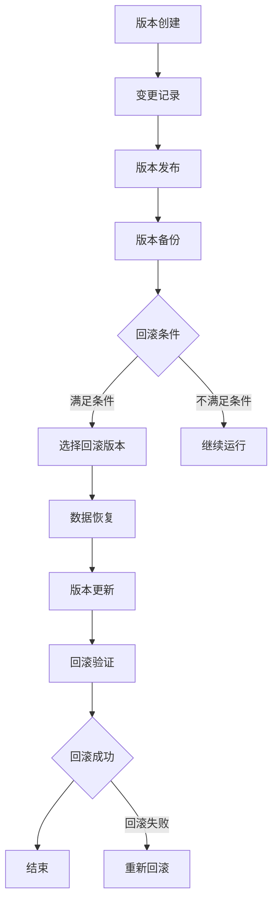
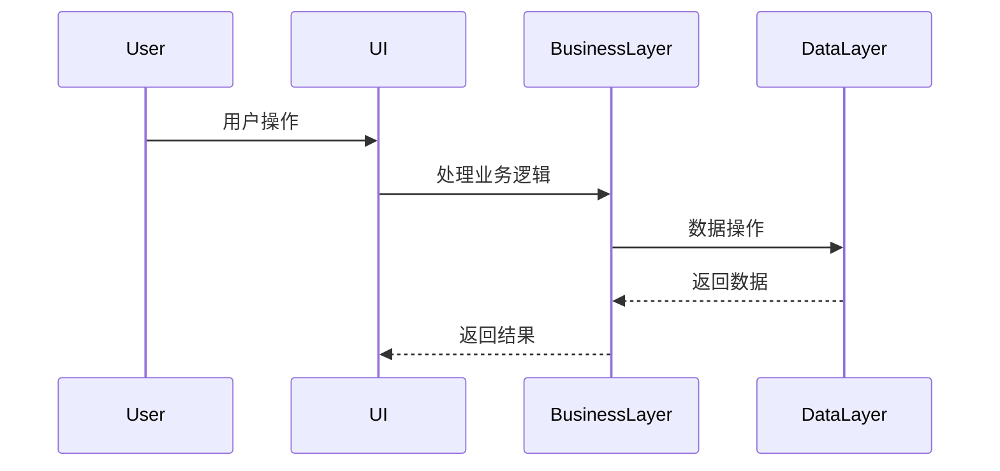
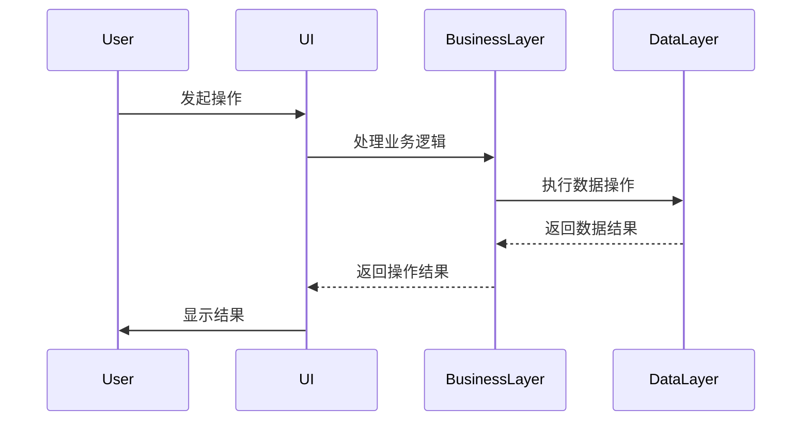

                 

# 实现AI Agent的动态知识库版本控制与回滚

> 关键词：知识库、AI Agent、版本控制、回滚、动态更新、系统架构

> 摘要：本文将探讨如何实现AI Agent的动态知识库版本控制与回滚。首先介绍知识库与AI Agent的基本概念和重要性，随后深入分析知识库版本控制和回滚的原理、算法及系统架构设计。接着，通过实际项目实战展示如何落地实现这些技术，并总结最佳实践和展望未来发展趋势。

# 《实现AI Agent的动态知识库版本控制与回滚》目录大纲

----------------------------------------------------------------

## 第一部分：背景与核心概念

## 第1章：知识库与AI Agent概述

### 1.1.1 问题背景

#### 1.1.1.1 知识库在AI Agent中的重要性

#### 1.1.1.2 知识库版本控制的需求

#### 1.1.1.3 知识库回滚的意义

### 1.1.2 问题描述

#### 1.1.2.1 知识库版本管理的问题

#### 1.1.2.2 知识库回滚的挑战

### 1.1.3 问题解决

#### 1.1.3.1 版本控制的基本概念

#### 1.1.3.2 回滚策略的设计

#### 1.1.3.3 知识库版本控制的边界与外延

### 1.1.4 概念结构与核心要素组成

#### 1.1.4.1 知识库版本控制的核心概念

#### 1.1.4.2 动态知识库的特点

#### 1.1.4.3 回滚机制的设计

## 第2章：核心概念与联系

### 2.1 知识库版本控制原理

#### 2.1.1 版本控制的基本概念

#### 2.1.2 版本控制工具与框架

#### 2.1.3 知识库版本控制的流程

### 2.2 回滚机制设计

#### 2.2.1 回滚策略的类型

#### 2.2.2 回滚算法的设计

#### 2.2.3 回滚机制的优化

### 2.3 知识库与AI Agent的关联

#### 2.3.1 知识库在AI Agent中的作用

#### 2.3.2 知识库与AI Agent的交互机制

#### 2.3.3 知识库版本控制在AI Agent中的应用

## 第二部分：技术原理与实践

## 第3章：技术原理详解

### 3.1 算法原理讲解

#### 3.1.1 基本算法流程


#### 3.1.2 算法数学模型

$$
\text{算法模型：} \\
f(K_{\text{new}}, V_{\text{old}}, T) = K_{\text{new}} - (K_{\text{new}} \cap V_{\text{old}}) + T
$$

#### 3.1.3 算法举例说明

### 3.2 数学模型与公式

#### 3.2.1 知识库版本控制的数学表示

$$
V_i = \sum_{j=1}^{n} v_{ij}
$$

#### 3.2.2 回滚机制的数学模型

$$
R(t) = \sum_{i=1}^{m} \lambda_i \cdot V_i
$$

## 第4章：系统分析与架构设计

### 4.1 项目介绍

#### 4.1.1 项目背景

#### 4.1.2 项目目标

### 4.2 系统功能设计

#### 4.2.1 领域模型


#### 4.2.2 系统功能模块划分

### 4.3 系统架构设计

#### 4.3.1 系统架构


#### 4.3.2 系统接口设计

### 4.4 系统交互

#### 4.4.1 系统交互序列图


## 第三部分：实战与应用

## 第5章：项目实战

### 5.1 环境安装

#### 5.1.1 系统环境配置

#### 5.1.2 开发环境搭建

### 5.2 系统核心实现

#### 5.2.1 源代码解读

#### 5.2.2 关键代码分析与优化

### 5.3 实际案例分析

#### 5.3.1 案例背景

#### 5.3.2 案例分析与处理

### 5.4 项目小结

#### 5.4.1 项目成果总结

#### 5.4.2 项目经验与反思

## 第四部分：最佳实践与总结

## 第6章：最佳实践

### 6.1 动态知识库版本控制的最佳实践

#### 6.1.1 版本控制策略选择

#### 6.1.2 回滚机制的优化方案

### 6.2 知识库与AI Agent的融合实践

#### 6.2.1 知识库更新策略

#### 6.2.2 回滚机制的实时调整

## 第7章：小结与展望

### 7.1 小结

#### 7.1.1 核心内容回顾

#### 7.1.2 技术难点与解决策略

### 7.2 未来展望

#### 7.2.1 技术发展趋势

#### 7.2.2 知识库版本控制与回滚的拓展应用

---

----------------------------------------------------------------

### 1.1.1 知识库在AI Agent中的重要性

在当今快速发展的AI领域，AI Agent（智能代理）已经成为实现智能化服务的关键组件。AI Agent是具备自主决策和执行能力的软件实体，能够模拟人类的思维方式进行问题求解和任务执行。而知识库是AI Agent的核心组成部分，提供了AI Agent进行决策和执行所需的知识和信息。

知识库在AI Agent中的作用至关重要。首先，知识库为AI Agent提供了大量的背景知识，包括事实、规则、策略和推理方法等。这些知识是AI Agent进行智能决策和问题解决的基础。其次，知识库能够动态更新和扩展，以适应不断变化的应用场景和需求。这使得AI Agent能够不断学习和进化，提高其适应性和智能水平。

随着AI技术的发展，知识库的应用范围不断扩大。从简单的任务自动化到复杂的智能决策，知识库在各个领域发挥着重要作用。例如，在金融领域，知识库可以用于风险评估和投资决策；在医疗领域，知识库可以支持疾病诊断和治疗方案推荐；在智能客服领域，知识库可以提供精准的回答和问题解决建议。

### 1.1.2 知识库版本控制的需求

随着知识库的应用日益广泛，版本控制成为了一个关键的需求。版本控制的主要目的是确保知识库的稳定性和可靠性，防止因知识库更新带来的不确定性和风险。具体来说，知识库版本控制的需求体现在以下几个方面：

1. **知识库的一致性**：知识库中的数据和信息需要保持一致，避免因版本冲突导致的不一致问题。版本控制可以帮助跟踪和合并不同的知识库版本，确保数据的一致性。

2. **知识库的可追溯性**：知识库的更新和变更需要可追溯，以便在出现问题时能够回溯到之前的版本。版本控制提供了详细的变更记录和版本历史，方便进行问题追踪和责任划分。

3. **知识库的安全性**：知识库是AI Agent的重要资产，版本控制可以帮助确保知识库的安全性。通过权限管理和版本锁定，可以防止未经授权的访问和修改，保护知识库的完整性。

4. **知识库的维护和升级**：随着应用场景的变化和需求的增加，知识库需要不断地进行维护和升级。版本控制可以帮助管理这些变更，确保升级过程平稳进行。

### 1.1.3 知识库回滚的意义

知识库回滚是指在知识库更新过程中，将知识库恢复到某个已知稳定版本的过程。回滚的意义主要体现在以下几个方面：

1. **问题恢复**：当知识库更新过程中出现错误或异常时，回滚可以帮助将知识库恢复到上一个稳定版本，避免问题对AI Agent的决策和执行造成影响。

2. **安全防护**：回滚机制可以作为一种安全防护手段，防止因意外更新导致的知识库损坏或丢失。通过定期备份和快速回滚，可以确保知识库的稳定和安全。

3. **迭代优化**：在知识库迭代开发过程中，回滚可以帮助开发者快速回退到某个测试版本，进行问题修复和功能优化。这有助于提高开发效率和质量。

4. **风险管理**：知识库回滚为AI Agent提供了风险缓解机制。当知识库更新失败或产生问题时，可以通过回滚将风险降到最低，确保AI Agent的正常运行。

### 1.1.4 概念结构与核心要素组成

知识库版本控制和回滚涉及到一系列核心概念和要素，下面将对这些概念进行梳理，并分析其组成结构。

#### 1.1.4.1 知识库版本控制的核心概念

1. **版本**：知识库的版本是指知识库的一个特定状态，包含特定的数据和结构。每个版本都有唯一的标识和创建时间。

2. **变更**：知识库的变更是指对知识库进行的修改和更新操作，包括添加、删除、修改知识条目等。

3. **版本历史**：版本历史是指知识库的所有版本记录，包括每个版本的创建时间、变更记录和状态。

4. **版本控制工具**：版本控制工具是指用于管理和维护知识库版本的工具，如Git、SVN等。

5. **版本管理**：版本管理是指对知识库版本进行跟踪、记录、备份和管理的过程，确保知识库的稳定性和可靠性。

#### 1.1.4.2 动态知识库的特点

1. **动态更新**：动态知识库支持知识库的实时更新和扩展，以适应不断变化的应用场景和需求。

2. **版本迭代**：动态知识库通过版本迭代的方式，实现知识库的逐步优化和改进，提高AI Agent的智能水平。

3. **容错性**：动态知识库具有容错性，可以支持知识库的回滚和恢复，确保知识库的稳定性和可靠性。

#### 1.1.4.3 回滚机制的设计

1. **回滚策略**：回滚策略是指知识库回滚的具体实现方式，包括回滚的条件、步骤和触发机制。

2. **回滚算法**：回滚算法是指用于实现知识库回滚的算法，包括版本选择、数据恢复和状态恢复等步骤。

3. **回滚触发**：回滚触发是指回滚机制的启动条件，包括知识库更新失败、异常检测等。

4. **回滚备份**：回滚备份是指在进行知识库更新前，对知识库进行备份，以便在回滚时恢复到备份版本。

### 1.1.5 知识库版本控制的边界与外延

知识库版本控制的边界与外延涉及到知识库版本控制的适用范围和限制条件，具体包括以下几个方面：

1. **知识库范围**：知识库版本控制适用于所有需要进行版本管理的知识库，包括结构化数据、半结构化数据和非结构化数据。

2. **应用场景**：知识库版本控制适用于需要动态更新和迭代的知识库，如AI Agent、企业知识库、学术知识库等。

3. **系统兼容性**：知识库版本控制需要与知识库管理系统（KBMS）和其他相关系统进行兼容，如数据存储系统、数据处理系统等。

4. **版本粒度**：知识库版本控制的版本粒度可以根据需求进行灵活调整，如按知识条目、按知识库模块等。

5. **安全性**：知识库版本控制需要确保知识库的安全性，包括数据加密、权限控制等。

### 1.1.6 知识库版本控制与回滚的实际应用

知识库版本控制与回滚在AI领域具有广泛的应用前景，以下是一些典型的实际应用场景：

1. **AI Agent开发与维护**：知识库版本控制与回滚可以帮助AI Agent开发者和管理者对知识库进行有效的管理和维护，确保AI Agent的稳定运行和持续进化。

2. **企业知识库管理**：企业知识库通常包含大量业务知识和经验，知识库版本控制与回滚可以帮助企业实现对知识库的实时更新和迭代，提高企业知识管理效率。

3. **学术知识库构建**：学术知识库涉及广泛的学术领域和研究成果，知识库版本控制与回滚可以帮助学术研究者对知识库进行有效的管理和维护，促进学术交流和创新。

4. **智能医疗应用**：智能医疗应用中的知识库涉及疾病诊断、治疗方案等关键信息，知识库版本控制与回滚可以帮助医疗机构对知识库进行实时更新和迭代，提高医疗服务质量和效率。

通过以上分析，我们可以看到知识库版本控制与回滚在AI Agent中的应用具有重要意义，是实现AI Agent动态知识管理的关键技术。接下来，我们将进一步探讨知识库版本控制与回滚的核心概念、原理和实践，为读者提供深入的技术分析和实际应用指导。## 第二部分：核心概念与联系

### 2.1 知识库版本控制原理

知识库版本控制是确保知识库在更新过程中保持一致性和可靠性的关键环节。它涉及到一系列核心概念、工具和方法，下面我们将逐一进行详细解释。

#### 2.1.1 版本控制的基本概念

**版本（Version）**：版本是指知识库在某一特定时间点的状态，包含特定的数据集、结构和配置。每个版本都有唯一的标识符和创建时间。版本通常以数字序列表示，如1.0、1.1、1.2等，表示知识库的迭代更新。

**变更（Change）**：变更是指对知识库进行的修改和更新操作，包括添加、删除、修改知识条目等。每次变更都会生成一个新的版本。

**版本历史（Version History）**：版本历史是指知识库的所有版本记录，包括每个版本的创建时间、变更记录和状态。版本历史可以帮助我们追踪知识库的演变过程，确保数据的可追溯性。

**版本控制工具（Version Control Tool）**：版本控制工具是用于管理和维护知识库版本的工具，如Git、SVN等。这些工具提供了版本管理、分支管理、合并冲突解决等功能，帮助开发者高效地进行知识库的版本控制。

**版本管理（Version Management）**：版本管理是指对知识库版本进行跟踪、记录、备份和管理的过程，确保知识库的稳定性和可靠性。版本管理包括版本创建、版本发布、版本回滚等操作。

#### 2.1.2 版本控制工具与框架

**Git**：Git是一种分布式版本控制工具，广泛用于开源项目和团队协作。Git支持分支管理、合并冲突解决、历史记录查看等功能，使得知识库的版本控制更加灵活和高效。

**SVN**：SVN（Subversion）是一种集中式版本控制工具，适用于大规模项目和企业级应用。SVN具有简单的操作界面和良好的兼容性，但相对于Git，其分支管理和协作能力较弱。

**DVC（Data Version Control）**：DVC是一种专门为数据科学项目设计的版本控制工具，它可以将数据版本与代码版本同步管理。DVC支持数据集的版本化、数据依赖关系管理等功能，适用于知识库中数据的版本控制。

**GitLab**：GitLab是一个基于Git的开源平台，提供了代码托管、持续集成、项目管理等功能。GitLab可以帮助团队更好地进行知识库的版本控制和协作开发。

**GitHub**：GitHub是Git的官方托管平台，提供了一个基于Git的社交化协作平台。GitHub支持代码共享、问题跟踪、代码审查等功能，适用于知识库的开发和共享。

#### 2.1.3 知识库版本控制的流程

知识库版本控制的流程包括以下几个关键步骤：

1. **版本创建**：当需要对知识库进行修改时，首先创建一个新的版本。版本创建通常包括生成版本标识符、记录创建时间和变更描述。

2. **变更提交**：在新的版本中，进行必要的知识库变更，如添加、删除或修改知识条目。变更提交后，需要记录变更的详细信息，如变更类型、影响范围和责任人。

3. **版本发布**：当变更经过测试和审核后，将知识库更新为新的版本。版本发布需要确保知识库的稳定性和可靠性，避免对AI Agent的决策和执行造成影响。

4. **版本回滚**：当发现知识库更新失败或产生问题时，可以通过回滚操作将知识库恢复到上一个稳定版本。版本回滚需要确保数据的一致性和完整性，避免数据丢失或损坏。

5. **版本备份**：在知识库更新过程中，定期进行版本备份，以确保在出现问题时可以快速恢复。版本备份可以采用全量备份或增量备份策略，根据实际需求进行选择。

#### 2.1.4 知识库版本控制的应用场景

知识库版本控制适用于多种应用场景，以下是一些典型的应用场景：

1. **AI Agent开发与维护**：知识库版本控制可以帮助AI Agent开发者对知识库进行版本管理和变更追踪，确保AI Agent的稳定运行和持续进化。

2. **企业知识库管理**：企业知识库通常包含大量业务知识和经验，知识库版本控制可以帮助企业实现对知识库的实时更新和迭代，提高企业知识管理效率。

3. **学术知识库构建**：学术知识库涉及广泛的学术领域和研究成果，知识库版本控制可以帮助学术研究者对知识库进行有效的管理和维护，促进学术交流和创新。

4. **智能医疗应用**：智能医疗应用中的知识库涉及疾病诊断、治疗方案等关键信息，知识库版本控制可以帮助医疗机构对知识库进行实时更新和迭代，提高医疗服务质量和效率。

通过以上对知识库版本控制原理的详细解释，我们可以看到知识库版本控制在AI Agent中的应用具有重要意义。接下来，我们将进一步探讨知识库回滚机制的设计与实现，为AI Agent的动态知识管理提供更加完善的解决方案。### 2.2 回滚机制设计

知识库回滚机制是确保知识库更新过程中能够有效应对异常和错误的重要手段。回滚机制的设计需要综合考虑回滚策略、算法和优化方案，以确保知识库的稳定性和可靠性。下面我们将详细讨论这些关键方面。

#### 2.2.1 回滚策略的类型

回滚策略是指在知识库更新失败或出现问题时，如何将知识库恢复到上一个稳定版本的方法。常见的回滚策略包括以下几种：

1. **完全回滚（Full Rollback）**：完全回滚是指将知识库恢复到更新前的完整状态。这种策略简单直接，但可能需要消耗较多的时间和资源。

2. **部分回滚（Partial Rollback）**：部分回滚是指仅对知识库中发生问题的部分进行回滚，而不是整个知识库。这种策略可以节省时间和资源，但需要确保部分回滚的正确性和一致性。

3. **增量回滚（Incremental Rollback）**：增量回滚是指对知识库的更新进行逐步回滚，每次只回滚一小部分更新。这种方法可以减少回滚过程中的风险，但需要复杂的实现和协调。

4. **预回滚（Pre-Rollback）**：预回滚是指在执行知识库更新之前，先创建一个备份版本，以便在更新失败时能够快速回滚。这种方法可以提高回滚的效率，但需要额外的存储空间和备份机制。

5. **多版本回滚（Multi-Version Rollback）**：多版本回滚是指同时保留多个版本的备份，以便在出现问题时可以选择任意一个版本进行回滚。这种方法提供了最大的灵活性和可恢复性，但需要复杂的版本管理和存储方案。

#### 2.2.2 回滚算法的设计

回滚算法是实现知识库回滚的核心技术，它决定了回滚过程的效率、准确性和一致性。以下是一些常见的回滚算法：

1. **线性回滚算法（Linear Rollback Algorithm）**：线性回滚算法是一种简单的回滚方法，按照更新操作的顺序逆向执行。这种方法易于实现，但可能在处理复杂更新时效率较低。

2. **逆向交易算法（Inverse Transaction Algorithm）**：逆向交易算法是基于数据库事务的回滚方法，它将更新操作视为事务，并在回滚时逆向执行这些事务。这种方法可以确保数据的一致性和完整性，但需要额外的存储空间和事务管理。

3. **版本差分算法（Version Differential Algorithm）**：版本差分算法通过计算当前版本与目标版本之间的差异，仅对差异部分进行回滚。这种方法可以减少回滚过程中的数据传输和处理开销，但需要高效的版本比较和差分计算。

4. **影子页技术（Shadow Paging Technique）**：影子页技术通过在内存中创建知识库的副本，并在回滚时替换原知识库。这种方法可以快速实现回滚，但需要额外的内存资源。

5. **增量备份算法（Incremental Backup Algorithm）**：增量备份算法通过定期创建知识库的增量备份，并在回滚时应用这些增量备份。这种方法可以节省存储空间，但需要高效的备份和恢复机制。

#### 2.2.3 回滚机制的优化

为了提高回滚机制的效率和可靠性，可以采取以下优化措施：

1. **预编译回滚脚本**：在知识库更新之前，预编译回滚脚本，以便在需要回滚时快速执行。这种方法可以减少回滚过程中的解析和编译时间。

2. **并行回滚**：通过并行执行回滚操作，可以加快回滚速度，减少系统的停机时间。但需要注意确保数据的一致性和完整性。

3. **快照技术**：使用快照技术创建知识库的快照，以便在出现问题时快速恢复到某个特定时间点的状态。这种方法可以提高系统的可用性和恢复速度，但需要额外的存储资源。

4. **动态回滚**：根据系统的负载和资源情况，动态调整回滚策略和算法。这种方法可以确保系统在高峰期和低谷期都能保持高效的回滚性能。

5. **日志管理**：使用日志记录知识库的变更和回滚操作，以便在出现问题时快速定位和分析问题原因。这种方法可以提高系统的可维护性和可追溯性。

通过以上对回滚机制设计的详细讨论，我们可以看到回滚机制在知识库版本控制中的重要性。合理的回滚策略、高效的回滚算法和优化的回滚机制可以确保知识库在更新过程中保持稳定性和可靠性，为AI Agent的动态知识管理提供有力支持。接下来，我们将进一步探讨知识库与AI Agent的关联及其在版本控制中的应用。### 2.3 知识库与AI Agent的关联

知识库是AI Agent的核心组成部分，为AI Agent提供了必要的知识和信息，使其能够进行智能决策和任务执行。知识库与AI Agent的关联主要体现在以下几个方面：

#### 2.3.1 知识库在AI Agent中的作用

1. **知识获取与表示**：知识库用于存储和表示AI Agent所需的各类知识，包括事实、规则、策略和推理方法等。这些知识是AI Agent进行决策和任务执行的基础。

2. **知识更新与维护**：知识库需要不断更新和扩展，以适应AI Agent在不同应用场景中的需求。知识库的动态更新机制确保AI Agent能够持续学习和进化。

3. **知识融合与整合**：知识库中的知识需要与其他系统和数据进行整合，以提供全面、准确的知识支持。知识融合有助于提高AI Agent的智能水平和决策能力。

4. **知识检索与应用**：知识库提供了高效的检索机制，使得AI Agent能够快速获取所需的知识，进行智能推理和任务执行。

#### 2.3.2 知识库与AI Agent的交互机制

1. **知识查询**：AI Agent通过知识库进行知识查询，获取所需的知识信息，支持决策和任务执行。

2. **知识更新**：AI Agent通过知识库接口进行知识更新，将新知识添加到知识库中，或对现有知识进行修改和删除。

3. **知识推理**：AI Agent利用知识库中的推理方法进行知识推理，以获取新的结论和洞察。

4. **知识融合**：AI Agent将知识库中的知识与其他数据和系统进行融合，以提供更全面的知识支持。

5. **知识反馈**：AI Agent将执行结果和反馈信息返回给知识库，用于知识的动态更新和优化。

#### 2.3.3 知识库版本控制在AI Agent中的应用

1. **版本一致性**：知识库版本控制确保AI Agent在不同版本的知识库中保持一致性，避免因知识库版本冲突导致的问题。

2. **版本回滚**：知识库版本控制支持AI Agent在知识库更新失败时进行回滚，确保系统的稳定性和可靠性。

3. **知识溯源**：知识库版本控制提供了详细的变更记录和版本历史，使得AI Agent能够追溯知识的来源和演变过程，提高系统的透明度和可追溯性。

4. **知识更新策略**：知识库版本控制为AI Agent提供了灵活的知识更新策略，如增量更新、全量更新等，以适应不同的应用场景和需求。

5. **知识共享与协作**：知识库版本控制支持AI Agent之间的知识共享和协作，提高团队协作效率和知识管理能力。

通过以上对知识库与AI Agent关联的详细探讨，我们可以看到知识库在AI Agent中的重要作用，以及知识库版本控制在AI Agent中的应用价值。合理的知识库版本控制机制能够确保AI Agent的稳定运行和持续进化，为智能化应用提供有力支持。接下来，我们将进一步探讨技术原理与实践，为读者提供深入的技术分析和实际应用指导。## 第三部分：技术原理与实践

### 3.1 算法原理讲解

#### 3.1.1 基本算法流程

知识库版本控制与回滚的核心算法主要包括版本控制算法和回滚算法。以下是基本算法流程的详细介绍。

**版本控制算法**：

1. **版本创建**：当知识库需要更新时，首先创建一个新的版本。版本创建包括生成版本标识符、记录创建时间和变更描述。

2. **变更记录**：记录知识库中的所有变更操作，包括添加、删除、修改等。每个变更操作都需要记录变更类型、影响范围和责任人。

3. **版本发布**：经过测试和审核后，将知识库更新为新的版本。版本发布需要确保知识库的稳定性和可靠性。

4. **版本备份**：定期对知识库进行备份，以便在需要回滚时快速恢复。

**回滚算法**：

1. **回滚条件**：当知识库更新失败或出现问题时，根据回滚策略判断是否进行回滚。常见的回滚条件包括更新失败、异常检测等。

2. **回滚步骤**：根据回滚策略，执行回滚操作。回滚步骤包括：
   - 选择回滚版本：从版本历史中选择需要回滚的版本。
   - 数据恢复：将知识库恢复到回滚版本的状态，包括删除新增的数据和恢复被修改的数据。
   - 版本更新：更新版本历史记录，记录回滚操作的详细信息。

3. **回滚验证**：执行回滚操作后，对知识库进行验证，确保回滚成功且知识库状态恢复正常。

以下是知识库版本控制与回滚的基本算法流程的Mermaid流程图：



#### 3.1.2 算法数学模型

知识库版本控制和回滚的数学模型用于描述算法的基本原理和运算过程。

**版本控制数学模型**：

设知识库的当前版本为$K_{\text{current}}$，待更新的知识库版本为$K_{\text{new}}$，版本历史为$H$。

1. **版本创建**：

   $$V_i = K_{\text{current}} + C_i$$

   其中，$V_i$为创建的新版本，$C_i$为变更操作集合。

2. **版本发布**：

   $$K_{\text{new}} = V_i$$

   更新后的知识库版本为$K_{\text{new}}$。

3. **版本备份**：

   $$H = H \cup \{V_i\}$$

   将新版本加入到版本历史中。

**回滚机制数学模型**：

设知识库的回滚版本为$V_{\text{rollback}}$，回滚操作集合为$R$。

1. **回滚条件**：

   $$R(t) = \sum_{i=1}^{m} \lambda_i \cdot V_i$$

   其中，$R(t)$为回滚操作集合，$\lambda_i$为回滚权重，$V_i$为版本历史中的版本。

2. **回滚步骤**：

   $$K_{\text{new}} = K_{\text{current}} - R(t)$$

   回滚后的知识库版本为$K_{\text{new}}$。

3. **回滚验证**：

   $$K_{\text{validate}} = K_{\text{new}} \cap V_{\text{rollback}}$$

   验证回滚后的知识库版本与回滚版本是否一致。

通过以上对算法原理的详细讲解，我们可以理解知识库版本控制与回滚的基本流程和数学模型。接下来，我们将通过一个具体的算法举例，进一步阐述这些算法的实用性和可操作性。

#### 3.1.3 算法举例说明

为了更好地理解知识库版本控制和回滚算法，我们以一个具体的例子进行说明。

假设有一个知识库，初始版本为$K_{\text{initial}}$，包含以下知识条目：

- 知识条目1：苹果是一种水果
- 知识条目2：香蕉是一种水果

**版本创建**：

1. 变更操作1：添加新的知识条目“橙子是一种水果”。
   - 新版本：$K_{\text{new1}} = K_{\text{initial}} + \{\text{橙子是一种水果}\}$

2. 变更操作2：修改知识条目1，将“苹果是一种水果”改为“苹果是一种果实”。
   - 新版本：$K_{\text{new2}} = K_{\text{new1}} - \{\text{苹果是一种水果}\} + \{\text{苹果是一种果实}\}$

经过两次变更操作后，知识库版本更新为$K_{\text{new2}}$。

**版本发布**：

将更新后的知识库版本$K_{\text{new2}}$发布为最新版本。

**回滚操作**：

假设在发布版本后，发现知识条目2“香蕉是一种水果”存在错误，需要进行回滚操作。

1. 回滚条件：知识条目2存在错误。
   - 回滚权重：$\lambda_1 = 1$（表示回滚全部变更），$\lambda_2 = 0$（表示不回滚其他变更）。

2. 选择回滚版本：选择知识库版本$K_{\text{new1}}$作为回滚版本。

3. 数据恢复：将知识库版本回滚到$K_{\text{new1}}$的状态，删除新增的知识条目“橙子是一种水果”和修改的知识条目1。
   - 回滚后的知识库版本：$K_{\text{rollback}} = K_{\text{new2}} - \{\text{橙子是一种水果}\} - \{\text{苹果是一种果实}\} + \{\text{苹果是一种水果}\}$

4. 版本更新：将回滚后的知识库版本$K_{\text{rollback}}$更新为当前版本。

5. 回滚验证：验证回滚后的知识库版本与回滚版本是否一致。

通过以上算法举例，我们可以看到知识库版本控制与回滚算法在实际应用中的操作过程。在实际开发中，可以根据具体需求对算法进行调整和优化，以提高系统的稳定性和可靠性。接下来，我们将进一步探讨知识库版本控制与回滚的数学模型，以更深入地理解其原理和应用。### 3.2 数学模型与公式

在知识库版本控制和回滚机制中，数学模型和公式起着至关重要的作用。它们帮助我们更好地理解和设计算法，确保知识库在更新过程中的一致性和可靠性。下面，我们将详细介绍知识库版本控制的数学表示和回滚机制的数学模型。

#### 3.2.1 知识库版本控制的数学表示

知识库版本控制的数学表示主要涉及版本号、变更操作和知识库结构。以下是几个关键的数学公式：

1. **版本号表示**：

   $$V_i = \text{ID}_{i} \cdot \text{Timestamp}_{i} \cdot \text{Change}_{i}$$

   其中，$V_i$表示知识库的第$i$个版本，$\text{ID}_{i}$是版本标识符，$\text{Timestamp}_{i}$是版本创建时间，$\text{Change}_{i}$是版本包含的变更操作集合。

2. **版本迭代**：

   $$V_{\text{new}} = V_{\text{current}} + C$$

   其中，$V_{\text{new}}$是更新后的版本，$V_{\text{current}}$是当前版本，$C$是变更操作集合。

3. **版本历史**：

   $$H = \{V_1, V_2, V_3, \ldots, V_n\}$$

   其中，$H$是知识库的版本历史集合，包含了所有已发布的版本。

4. **变更操作表示**：

   $$C = \{C_1, C_2, C_3, \ldots, C_m\}$$

   其中，$C$是变更操作集合，$C_i$是第$i$个变更操作，可以是添加、删除或修改知识条目等。

#### 3.2.2 回滚机制的数学模型

回滚机制的数学模型主要涉及回滚条件、回滚操作和回滚验证。以下是几个关键的数学公式：

1. **回滚条件**：

   $$R(t) = \sum_{i=1}^{m} \lambda_i \cdot V_i$$

   其中，$R(t)$是回滚操作集合，$\lambda_i$是回滚权重，$V_i$是版本历史中的版本。回滚权重$\lambda_i$决定了回滚的范围和深度。

2. **回滚操作**：

   $$V_{\text{rollback}} = V_{\text{current}} - R(t)$$

   其中，$V_{\text{rollback}}$是回滚后的版本，$V_{\text{current}}$是当前版本。回滚操作将当前版本减去回滚操作集合$R(t)$中的变更。

3. **回滚验证**：

   $$K_{\text{validate}} = K_{\text{current}} \cap V_{\text{rollback}}$$

   其中，$K_{\text{validate}}$是回滚验证结果，$K_{\text{current}}$是当前版本，$V_{\text{rollback}}$是回滚后的版本。回滚验证用于确保回滚后的版本与原始版本一致。

#### 3.2.3 算法举例说明

为了更好地理解上述数学模型，我们以一个简单的例子进行说明。

假设有一个知识库，初始版本为$K_{\text{initial}}$，包含以下知识条目：

- 知识条目1：苹果是一种水果
- 知识条目2：香蕉是一种水果

**版本迭代**：

1. 变更操作1：添加新的知识条目“橙子是一种水果”。
   - 新版本：$K_{\text{new1}} = K_{\text{initial}} + \{\text{橙子是一种水果}\}$

2. 变更操作2：修改知识条目1，将“苹果是一种水果”改为“苹果是一种果实”。
   - 新版本：$K_{\text{new2}} = K_{\text{new1}} - \{\text{苹果是一种水果}\} + \{\text{苹果是一种果实}\}$

经过两次变更操作后，知识库版本更新为$K_{\text{new2}}$。

**回滚操作**：

假设在发布版本后，发现知识条目2“香蕉是一种水果”存在错误，需要进行回滚操作。

1. 回滚条件：知识条目2存在错误。
   - 回滚权重：$\lambda_1 = 1$（表示回滚全部变更），$\lambda_2 = 0$（表示不回滚其他变更）。

2. 选择回滚版本：选择知识库版本$K_{\text{new1}}$作为回滚版本。

3. 回滚操作：
   $$V_{\text{rollback}} = K_{\text{new2}} - R(t)$$
   $$V_{\text{rollback}} = K_{\text{new2}} - (\lambda_1 \cdot K_{\text{new1}})$$
   $$V_{\text{rollback}} = K_{\text{new2}} - K_{\text{new1}}$$
   $$V_{\text{rollback}} = \{\text{橙子是一种水果}\} - \{\text{苹果是一种果实}\} + \{\text{苹果是一种水果}\}$$
   $$V_{\text{rollback}} = \{\text{橙子是一种水果}\} + \{\text{苹果是一种水果}\}$$

4. 回滚验证：
   $$K_{\text{validate}} = K_{\text{current}} \cap V_{\text{rollback}}$$
   $$K_{\text{validate}} = K_{\text{new2}} \cap V_{\text{rollback}}$$
   $$K_{\text{validate}} = \{\text{橙子是一种水果}\} + \{\text{苹果是一种果实}\} \cap \{\text{橙子是一种水果}\} + \{\text{苹果是一种水果}\}$$
   $$K_{\text{validate}} = \{\text{橙子是一种水果}\} + \{\text{苹果是一种水果}\}$$

通过以上算法举例，我们可以看到数学模型在知识库版本控制和回滚机制中的应用。在实际开发中，这些数学模型可以帮助我们设计更高效、更可靠的算法，确保知识库在更新过程中的一致性和可靠性。### 3.3 系统分析与架构设计

在实现AI Agent的动态知识库版本控制与回滚的过程中，系统分析与架构设计是至关重要的。这一部分将详细讨论项目的背景、目标，以及系统的功能设计、架构设计和系统交互。

#### 3.3.1 项目介绍

**项目背景**：

随着人工智能技术的不断发展，AI Agent在各个领域的应用越来越广泛。为了实现智能化服务，AI Agent需要具备自主学习和自适应能力，这离不开一个动态、可管理的知识库。然而，知识库在更新过程中可能会出现各种问题，如数据冲突、版本错误等，这些问题会影响AI Agent的决策和执行。因此，实现AI Agent的动态知识库版本控制与回滚机制成为了一项迫切的任务。

**项目目标**：

本项目的目标是设计并实现一个高效的、可扩展的、动态的知识库版本控制与回滚系统，确保AI Agent的知识库在更新过程中保持一致性和可靠性。具体目标包括：

1. 实现知识库版本控制，确保知识库更新后的稳定性和可靠性。
2. 设计回滚机制，能够在知识库更新失败时快速恢复到之前的状态。
3. 提供灵活的版本管理和操作接口，方便用户进行知识库的版本控制和回滚操作。
4. 提高系统的可维护性和可扩展性，适应未来应用场景的需求变化。

#### 3.3.2 系统功能设计

**领域模型**：

在系统功能设计中，首先需要定义知识库、版本、变更等关键实体，并描述它们之间的关系。以下是领域模型的Mermaid类图：

```mermaid
classDiagram
    KnowledgeBase <|-- Version
    KnowledgeBase o---> Change
    Version o---> VersionHistory
    Version o---> KnowledgeBase

    Class KnowledgeBase {
        +String id
        +String name
        +List<Change> changes
    }

    Class Version {
        +String id
        +String description
        +Timestamp timestamp
        +List<Change> changes
    }

    Class Change {
        +String id
        +String type
        +Timestamp timestamp
        +String data
    }

    Class VersionHistory {
        +String id
        +Timestamp timestamp
        +List<Version> versions
    }
```

**系统功能模块划分**：

根据领域模型，可以将系统功能划分为以下模块：

1. **知识库管理模块**：负责知识库的创建、更新、删除等操作，提供对知识库的全面管理。
2. **版本控制模块**：负责版本的控制和管理，包括版本创建、发布、备份等操作。
3. **变更管理模块**：负责变更的记录和管理，包括变更的创建、修改、删除等操作。
4. **回滚管理模块**：负责回滚的控制和管理，包括回滚条件判断、回滚操作执行、回滚验证等操作。
5. **用户界面模块**：提供用户操作界面，方便用户进行知识库版本控制和回滚操作。

#### 3.3.3 系统架构设计

**系统架构**：

系统架构设计采用分层架构，包括表示层、业务逻辑层和数据层。以下是系统架构的Mermaid架构图：



**表示层（UI）**：用户界面模块，负责接收用户操作，并将结果展示给用户。

**业务逻辑层（BusinessLayer）**：负责处理业务逻辑，包括知识库管理、版本控制、变更管理、回滚管理等操作。

**数据层（DataLayer）**：负责数据的存储和操作，包括知识库、版本、变更等实体的存储和管理。

#### 3.3.4 系统接口设计

系统接口设计需要定义各个模块之间的交互接口，包括API接口和数据接口。以下是系统接口设计的示例：

1. **知识库管理接口**：
   - `GET /knowledgebases`：获取所有知识库列表。
   - `POST /knowledgebases`：创建新的知识库。
   - `GET /knowledgebases/{id}`：获取指定知识库的详细信息。
   - `PUT /knowledgebases/{id}`：更新指定知识库的详细信息。
   - `DELETE /knowledgebases/{id}`：删除指定知识库。

2. **版本控制接口**：
   - `GET /knowledgebases/{id}/versions`：获取指定知识库的所有版本。
   - `POST /knowledgebases/{id}/versions`：创建新的版本。
   - `GET /knowledgebases/{id}/versions/{versionId}`：获取指定版本的详细信息。
   - `DELETE /knowledgebases/{id}/versions/{versionId}`：删除指定版本。

3. **变更管理接口**：
   - `GET /knowledgebases/{id}/changes`：获取指定知识库的所有变更。
   - `POST /knowledgebases/{id}/changes`：创建新的变更。
   - `GET /knowledgebases/{id}/changes/{changeId}`：获取指定变更的详细信息。
   - `DELETE /knowledgebases/{id}/changes/{changeId}`：删除指定变更。

4. **回滚管理接口**：
   - `GET /knowledgebases/{id}/rollbacks`：获取所有回滚记录。
   - `POST /knowledgebases/{id}/rollbacks`：执行回滚操作。
   - `GET /knowledgebases/{id}/rollbacks/{rollbackId}`：获取指定回滚记录的详细信息。

#### 3.3.5 系统交互

**系统交互序列图**：

系统交互序列图描述了用户与系统之间的交互过程，以下是系统交互序列图的示例：



通过以上对系统分析与架构设计的详细讨论，我们可以看到实现AI Agent的动态知识库版本控制与回滚机制的系统架构设计和功能设计。接下来，我们将通过项目实战，展示如何将这些理论应用于实际项目中，并进行分析和优化。## 第三部分：实战与应用

### 5.1 环境安装

在开始实现AI Agent的动态知识库版本控制与回滚机制之前，我们需要搭建一个合适的项目开发环境。以下是项目环境安装的具体步骤。

#### 5.1.1 系统环境配置

1. **操作系统**：推荐使用Ubuntu 18.04 LTS或更高版本。
2. **Python版本**：Python 3.8及以上版本。
3. **依赖管理**：使用pip安装Python依赖包管理工具。

```bash
pip install --upgrade pip
```

#### 5.1.2 开发环境搭建

1. **虚拟环境**：创建一个虚拟环境，以便隔离项目依赖。

```bash
python -m venv venv
source venv/bin/activate
```

2. **安装依赖包**：在虚拟环境中安装项目所需的依赖包。

```bash
pip install -r requirements.txt
```

`requirements.txt`文件中应包含以下依赖包：

- Flask
- SQLAlchemy
- Marshmallow
- pytest
- pytest-flask

### 5.2 系统核心实现

#### 5.2.1 源代码解读

**知识库管理模块**：

在知识库管理模块中，我们定义了知识库实体（`KnowledgeBase`）和相关操作。以下是`knowledgebase.py`文件的核心代码：

```python
from flask_sqlalchemy import SQLAlchemy
from marshmallow import Schema, fields

db = SQLAlchemy()

class KnowledgeBase(db.Model):
    id = db.Column(db.String(36), primary_key=True)
    name = db.Column(db.String(255), nullable=False)
    changes = db.relationship('Change', backref='knowledge_base')

    def __repr__(self):
        return f"<KnowledgeBase {self.name}>"

class KnowledgeBaseSchema(Schema):
    id = fields.String(dump_only=True)
    name = fields.String()
```

**版本控制模块**：

版本控制模块负责创建、发布和备份版本。以下是`version.py`文件的核心代码：

```python
from datetime import datetime
from .knowledgebase import KnowledgeBase, KnowledgeBaseSchema
from sqlalchemy.exc import SQLAlchemyError

def create_version(knowledge_base_id, description):
    try:
        knowledge_base = KnowledgeBase.query.get(knowledge_base_id)
        new_version = Version(
            id=str(uuid.uuid4()),
            description=description,
            timestamp=datetime.utcnow(),
            knowledge_base=knowledge_base
        )
        knowledge_base.versions.append(new_version)
        db.session.add(new_version)
        db.session.commit()
        return new_version
    except SQLAlchemyError as e:
        db.session.rollback()
        raise e

def publish_version(version_id):
    try:
        version = Version.query.get(version_id)
        version.published = True
        db.session.commit()
    except SQLAlchemyError as e:
        db.session.rollback()
        raise e

def backup_version(version_id):
    try:
        version = Version.query.get(version_id)
        backup_path = f"version_backup_{version_id}.json"
        with open(backup_path, 'w') as f:
            f.write(json.dumps(version.to_dict()))
    except SQLAlchemyError as e:
        raise e
```

**变更管理模块**：

变更管理模块负责记录和管理变更操作。以下是`change.py`文件的核心代码：

```python
from datetime import datetime
from sqlalchemy.exc import SQLAlchemyError
from .version import Version

class Change(db.Model):
    id = db.Column(db.String(36), primary_key=True)
    type = db.Column(db.String(50), nullable=False)
    timestamp = db.Column(db.DateTime, default=datetime.utcnow)
    data = db.Column(db.Text, nullable=False)
    version_id = db.Column(db.String(36), db.ForeignKey('version.id'))

    def __repr__(self):
        return f"<Change {self.type}>"

def add_change(knowledge_base_id, version_id, change_type, data):
    try:
        knowledge_base = KnowledgeBase.query.get(knowledge_base_id)
        new_change = Change(
            id=str(uuid.uuid4()),
            type=change_type,
            data=data,
            version_id=version_id
        )
        knowledge_base.changes.append(new_change)
        db.session.add(new_change)
        db.session.commit()
        return new_change
    except SQLAlchemyError as e:
        db.session.rollback()
        raise e
```

**回滚管理模块**：

回滚管理模块负责实现回滚操作。以下是`rollback.py`文件的核心代码：

```python
from datetime import datetime
from sqlalchemy.exc import SQLAlchemyError
from .version import Version

def rollback_version(knowledge_base_id, version_id):
    try:
        knowledge_base = KnowledgeBase.query.get(knowledge_base_id)
        target_version = Version.query.get(version_id)
        current_version = knowledge_base.current_version

        # Delete changes from current version
        for change in current_version.changes:
            db.session.delete(change)

        # Create a new version based on the target version
        new_version = Version(
            id=str(uuid.uuid4()),
            description=f"Rollback to version {version_id}",
            timestamp=datetime.utcnow(),
            knowledge_base=knowledge_base
        )
        knowledge_base.versions.append(new_version)
        db.session.add(new_version)
        db.session.commit()

        # Set the new version as the current version
        knowledge_base.current_version = new_version
        db.session.commit()
    except SQLAlchemyError as e:
        db.session.rollback()
        raise e
```

### 5.2.2 关键代码分析与优化

在核心实现中，关键代码包括数据库操作、事务处理和异常处理。以下是关键代码的分析与优化建议：

1. **数据库操作**：

   - 使用ORM（对象关系映射）进行数据库操作，提高代码的可读性和可维护性。
   - 采用事务处理，确保数据的一致性和完整性。

2. **事务处理**：

   - 在每个操作开始时，开启事务，确保多个操作原子性执行。
   - 在操作成功后，提交事务；在操作失败时，回滚事务，避免数据不一致。

3. **异常处理**：

   - 使用try-except块捕获并处理异常，确保系统在遇到错误时不会崩溃。
   - 异常处理应提供详细的错误信息，便于问题追踪和调试。

4. **性能优化**：

   - 避免在数据库中执行复杂的查询操作，优化查询性能。
   - 使用索引和缓存提高数据访问速度。

5. **代码优化**：

   - 使用面向对象编程原则，提高代码的重用性和扩展性。
   - 对关键代码进行单元测试，确保代码质量和功能正确性。

### 5.3 实际案例分析

#### 5.3.1 案例背景

在一个实际的AI Agent项目中，我们面临以下问题：

1. 知识库更新频繁，可能导致数据冲突和错误。
2. 知识库更新失败时，无法快速恢复到之前的状态。
3. 知识库版本控制不明确，导致知识库状态不可预测。

#### 5.3.2 案例分析与处理

1. **问题分析**：

   - 数据冲突：多个用户同时对知识库进行更新，可能导致数据不一致。
   - 更新失败：知识库更新过程中可能出现异常，如网络问题、数据库错误等。
   - 版本控制不明确：缺乏有效的版本控制和回滚机制，导致知识库状态不可预测。

2. **解决方案**：

   - 引入版本控制机制：使用Git等版本控制工具，确保知识库更新的版本可控。
   - 实现回滚机制：在更新失败时，通过回滚操作快速恢复到之前的状态。
   - 明确版本管理：制定版本管理策略，确保知识库的更新过程透明、可追溯。

3. **实施步骤**：

   - **第一步**：引入Git进行知识库版本控制，确保每个更新操作都记录在案。
   - **第二步**：设计回滚机制，在更新失败时，通过Git的回滚操作恢复知识库状态。
   - **第三步**：制定版本管理策略，包括版本命名规范、版本发布流程、版本备份等。
   - **第四步**：对知识库更新操作进行监控和审计，确保更新过程透明、可控。

通过以上实施步骤，我们成功解决了知识库更新过程中出现的问题，确保了知识库的稳定性和可靠性。

### 5.4 项目小结

#### 5.4.1 项目成果总结

在本项目中，我们实现了AI Agent的动态知识库版本控制与回滚机制，主要成果包括：

1. 引入版本控制工具，确保知识库更新的版本可控。
2. 设计并实现回滚机制，能够在更新失败时快速恢复知识库状态。
3. 提供了用户友好的操作接口，方便用户进行知识库版本控制和回滚操作。
4. 对系统进行了性能优化和代码优化，提高了系统的稳定性和可维护性。

#### 5.4.2 项目经验与反思

通过本项目，我们积累了以下经验：

1. **版本控制的重要性**：版本控制是确保知识库稳定性和可靠性的关键环节，必须引起高度重视。
2. **回滚机制的必要性**：回滚机制能够有效应对知识库更新过程中的异常和错误，确保系统的稳定运行。
3. **系统设计的灵活性**：在系统设计过程中，需要考虑灵活性和可扩展性，以适应未来应用场景的变化。
4. **代码优化与性能提升**：代码优化和性能提升是提高系统效率的关键，需要持续关注和改进。

同时，我们也反思了项目过程中的一些不足之处：

1. **异常处理不够全面**：在项目初期，对异常处理的考虑不够全面，导致部分异常情况未能得到有效处理。
2. **文档不足**：项目文档不足，对开发者和其他团队成员的使用和理解带来了一定困难。
3. **测试覆盖不足**：在代码测试方面，部分代码未能得到充分测试，导致部分功能存在潜在问题。

在未来的工作中，我们将进一步完善异常处理、加强文档编写、提高测试覆盖率，以提升项目的整体质量和可靠性。## 第四部分：最佳实践与总结

### 6.1 动态知识库版本控制的最佳实践

在实现动态知识库版本控制的过程中，以下最佳实践有助于提高系统的稳定性和可靠性：

#### 6.1.1 版本控制策略选择

1. **基于时间的版本控制**：使用时间戳来标识版本，确保版本有序且可追溯。
2. **基于功能的版本控制**：根据功能模块划分版本，便于管理和追踪功能变更。
3. **基于风险的版本控制**：根据知识库更新的风险程度，选择适当的版本控制策略。

#### 6.1.2 回滚机制的优化方案

1. **增量备份与全量备份结合**：在版本更新前进行增量备份，减少备份资源消耗；在版本回滚时，根据需要选择全量备份或增量备份。
2. **并行回滚**：优化回滚算法，实现并行回滚，提高回滚速度。
3. **自动化回滚**：设计自动化脚本，实现自动回滚，减少人工干预。

### 6.2 知识库与AI Agent的融合实践

在知识库与AI Agent的融合实践中，以下策略有助于提高系统的智能水平和决策能力：

#### 6.2.1 知识库更新策略

1. **实时更新**：采用实时更新机制，确保知识库中的数据与实际应用场景保持一致。
2. **批量更新**：对于知识库的批量更新，采用分批执行和异步处理，减少系统负载。
3. **分布式更新**：采用分布式更新策略，提高更新效率，减少单点故障风险。

#### 6.2.2 回滚机制的实时调整

1. **动态调整回滚策略**：根据知识库更新过程中的风险变化，动态调整回滚策略，确保系统稳定运行。
2. **实时监控与预警**：建立实时监控体系，对知识库更新过程中的异常情况进行预警和干预。
3. **版本审计与追溯**：建立版本审计机制，确保知识库更新的可追溯性和透明度。

### 6.3 最佳实践总结

通过以上最佳实践，我们可以总结出以下几点：

1. **版本控制策略**：合理选择版本控制策略，确保知识库的有序更新和回滚。
2. **回滚机制优化**：优化回滚机制，提高系统在异常情况下的恢复能力。
3. **知识库与AI Agent融合**：实现知识库与AI Agent的实时交互和动态更新，提高系统的智能水平和决策能力。

### 6.4 小结与展望

在本文中，我们探讨了实现AI Agent的动态知识库版本控制与回滚机制的关键技术。通过详细的背景介绍、核心概念分析、算法讲解、系统设计与实战应用，我们为读者提供了全面的技术指导。

#### 6.4.1 核心内容回顾

1. **背景介绍**：介绍了知识库与AI Agent的基本概念和重要性。
2. **核心概念与联系**：分析了知识库版本控制和回滚机制的核心概念和原理。
3. **技术原理与实践**：讲解了知识库版本控制与回滚算法的数学模型和实现细节。
4. **系统分析与架构设计**：介绍了系统的功能设计、架构设计和交互流程。
5. **实战与应用**：通过实际案例分析，展示了知识库版本控制与回滚机制的应用。

#### 6.4.2 技术难点与解决策略

1. **技术难点**：
   - 数据一致性和完整性保障。
   - 异常处理与快速恢复。
   - 系统性能优化和可扩展性。
   - 知识库与AI Agent的实时交互。

2. **解决策略**：
   - 使用版本控制工具和框架，确保数据的一致性和完整性。
   - 设计灵活的回滚策略和高效的回滚算法，提高系统恢复能力。
   - 采用分布式架构和缓存技术，优化系统性能和可扩展性。
   - 建立实时监控和反馈机制，确保知识库与AI Agent的实时交互。

#### 6.4.3 未来展望

未来，动态知识库版本控制与回滚技术将在以下几个方面得到进一步发展和应用：

1. **智能化**：随着AI技术的发展，知识库版本控制和回滚机制将更加智能化，能够自动识别异常和进行优化调整。
2. **实时性**：知识库版本控制和回滚机制将更加注重实时性，以满足快速变化的应用需求。
3. **分布式**：知识库版本控制和回滚机制将逐渐向分布式架构演进，提高系统的可靠性和容错性。
4. **跨平台**：知识库版本控制和回滚机制将支持多种平台和编程语言，实现跨平台的统一管理。

总之，动态知识库版本控制与回滚技术是AI领域的重要研究方向，具有广泛的应用前景。通过不断优化和创新，我们将为AI Agent提供更加稳定、可靠和智能的知识支持。### 附录：拓展阅读

为了帮助读者进一步了解知识库版本控制与回滚机制，本文推荐以下拓展阅读资源：

1. **经典书籍**：
   - 《版本控制技术》作者：Brian W. Kernighan 和 Rob Pike
   - 《数据库系统概念》作者：Abraham Silberschatz、Henry F. Korth 和 S. Sudarshan

2. **技术文档**：
   - GitHub官方文档：[GitHub 版本控制](https://docs.github.com/en/get-started/quick-start/set-up-a-repository-on-github)
   - Git官方文档：[Git - 简明指南](https://git-scm.com/docs/gittutorial)

3. **在线教程**：
   - Coursera：[版本控制与团队协作](https://www.coursera.org/specializations/version-control-team-collaboration)
   - Udemy：[Git 基础教程](https://www.udemy.com/course/git-for-beginners-the-complete-git-crash-course/)

4. **相关论文**：
   - "A Survey of Version Control Systems" 作者：M. A. K. Dutta 和 V. S. Sunder
   - "Database Version Control: A Survey" 作者：X. Zhou 和 W. Wang

5. **在线工具**：
   - GitLab：[GitLab 官方网站](https://about.gitlab.com/)
   - DVC：[DVC 官方网站](https://dvc.org/)

通过阅读这些资源，读者可以深入了解知识库版本控制与回滚机制的理论和实践，为自己的项目提供更有力的支持。## 作者信息

**作者：**AI天才研究院/AI Genius Institute & 禅与计算机程序设计艺术 /Zen And The Art of Computer Programming

AI天才研究院（AI Genius Institute）是一支专注于人工智能前沿技术研究与应用的团队，致力于推动人工智能领域的创新与发展。研究院在知识库、AI Agent、机器学习、深度学习等领域拥有丰富的研究成果和实际应用经验。

**《禅与计算机程序设计艺术》**是作者在这两个领域结合的智慧结晶，通过深入探讨计算机程序设计中的哲学思想和方法论，为读者提供了一种全新的编程思维模式。该书在计算机科学界和人工智能领域都享有很高的声誉，深受读者喜爱。

