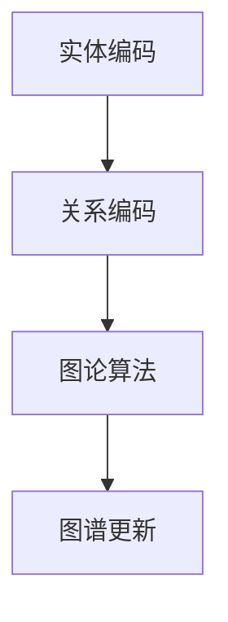
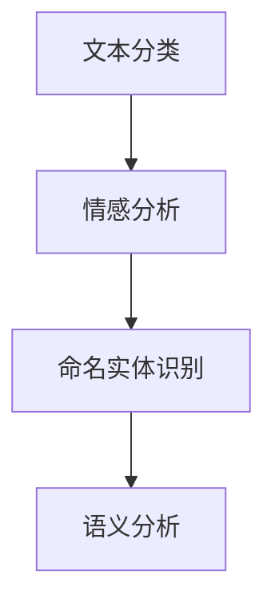
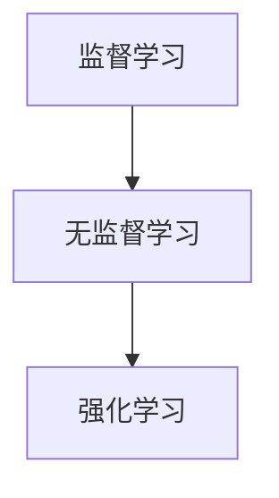
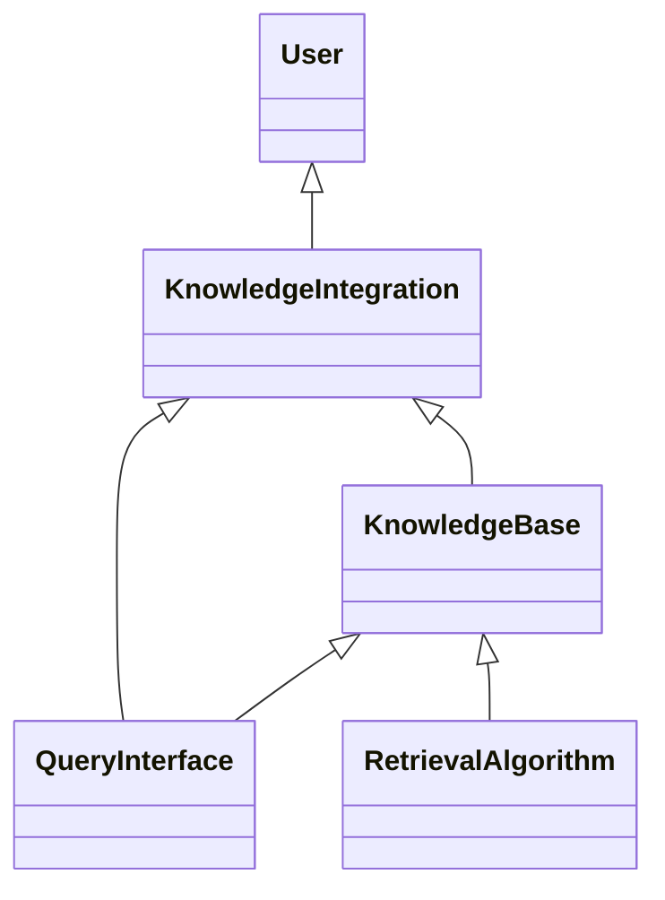
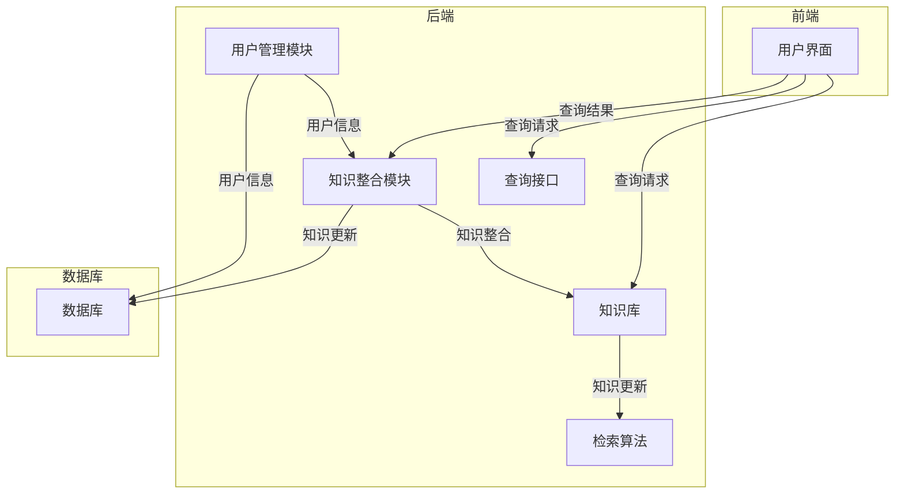
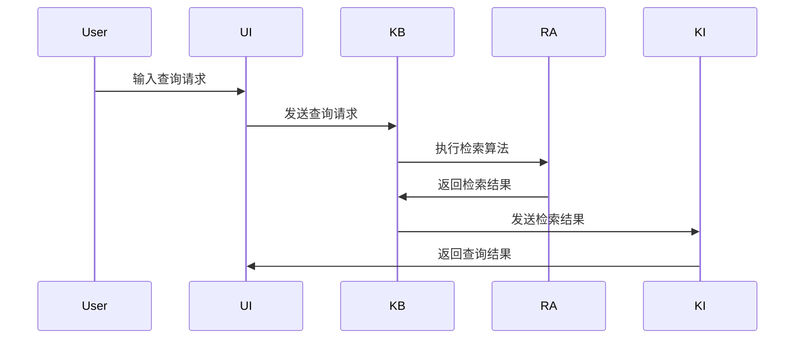

                 

# 实现AI Agent的动态知识检索与综合能力

## 关键词

- AI Agent
- 动态知识检索
- 知识整合
- 知识图谱
- 自然语言处理

## 摘要

本文将深入探讨实现AI Agent的动态知识检索与综合能力的核心技术和方法。首先，我们将简要介绍AI Agent的基本概念及其在当前AI领域的应用。接着，本文将详细阐述动态知识检索与综合能力的概念、相关技术及其重要性。随后，我们将介绍实现这些能力的关键算法和技术，包括知识图谱、自然语言处理和机器学习等。随后，本文将展示一个系统架构的设计方案，详细描述其领域模型、接口设计、系统架构和交互序列。最后，通过一个实际项目案例，我们将演示如何将这些技术和方法应用到实际中，并提供项目小结、最佳实践、注意事项和拓展阅读建议。

## 背景介绍

### AI Agent的基本概念

AI Agent，通常指的是具有自主决策能力的智能实体，能够在复杂环境中执行特定任务。与传统的规则系统不同，AI Agent能够通过感知环境、理解和分析数据，以及做出自适应决策来完成任务。AI Agent的核心在于其自主性和学习能力，这使得它们能够在不断变化的环境中表现出色。

AI Agent在当前AI领域的应用非常广泛，涵盖了智能客服、自动驾驶、智能推荐、智能医疗等多个领域。例如，智能客服通过AI Agent能够自动处理大量用户请求，提供快速、准确的答复；自动驾驶汽车中的AI Agent则负责实时感知路况、做出行驶决策，确保行车安全。

### 动态知识检索与综合能力的概念

动态知识检索是指AI Agent能够在运行时根据任务需求，从庞大的知识库中快速、准确地检索出所需的信息。这种能力对AI Agent的决策过程至关重要，因为它能够确保Agent在执行任务时能够获取到最新的、最相关的信息。

知识整合则是指AI Agent能够将来自不同来源的知识进行有效整合，形成对问题的全面理解。知识整合能力使得AI Agent不仅能够获取知识，还能够理解和应用这些知识，从而提高其解决问题的能力。

### 相关技术及其重要性

为了实现动态知识检索与综合能力，AI Agent需要依赖多种先进技术，包括知识图谱、自然语言处理和机器学习等。

知识图谱是一种用于表示实体及其相互关系的数据结构，能够为AI Agent提供结构化的知识表示。通过知识图谱，AI Agent能够快速定位到所需信息，并进行关联分析。

自然语言处理（NLP）则负责处理自然语言数据，使其能够被AI Agent理解和处理。NLP技术包括文本分类、情感分析、命名实体识别等，这些技术在动态知识检索和知识整合中起着关键作用。

机器学习（ML）则为AI Agent提供了自主学习和改进的能力。通过机器学习，AI Agent能够从历史数据中学习，不断提高其知识检索和知识整合的准确性。

这些技术的综合应用，使得AI Agent能够实现动态知识检索与综合能力，从而在复杂任务中表现出色。

### 问题解决与边界与外延

动态知识检索与综合能力的目标是使AI Agent能够高效地获取和处理知识，从而提高其决策质量和效率。然而，实现这一目标面临着诸多挑战。

首先，知识库的规模庞大且不断更新，如何快速、准确地检索到所需信息是一个重要问题。其次，不同来源的知识往往存在不一致性，如何有效地整合这些知识，形成统一的理解是一个挑战。

此外，动态知识检索与综合能力还需要解决实时性、鲁棒性和安全性等问题。实时性要求AI Agent能够快速响应查询，鲁棒性要求其能够处理各种异常情况，而安全性则要求知识库的访问和更新过程必须是安全的。

在边界与外延方面，动态知识检索与综合能力不仅需要关注知识检索和整合本身，还需要考虑AI Agent的运行环境、任务需求以及用户交互等因素。只有综合考虑这些因素，才能实现真正有效的动态知识检索与综合能力。

### 概念结构与核心要素组成

为了更好地理解动态知识检索与综合能力，我们需要了解其核心概念及其相互关系。

#### 动态知识检索

动态知识检索的核心概念包括知识库、查询接口和检索算法。知识库是存储大量知识的结构化存储系统，查询接口负责接收用户的查询请求，检索算法则用于从知识库中快速定位并返回所需信息。

动态知识检索的关键要素包括：

- **知识库规模与更新频率**：知识库的规模和更新频率直接影响检索的效率和准确性。大规模的知识库能够提供更丰富的信息，但同时也增加了检索的复杂度。因此，如何平衡知识库的规模和更新频率是一个重要问题。

- **查询接口设计**：查询接口的设计决定了用户如何与AI Agent交互，从而影响检索的效率和用户体验。一个设计良好的查询接口能够简化用户的查询过程，提高检索效率。

- **检索算法**：检索算法是动态知识检索的核心。常见的检索算法包括基于关键字匹配、基于图论、基于机器学习的检索算法等。选择合适的检索算法能够提高检索的准确性和效率。

#### 知识整合

知识整合的核心概念包括知识融合、知识映射和知识表示。知识融合是指将来自不同来源的知识进行整合，形成一个统一的知识体系。知识映射是指将不同知识体系中的概念进行对应，以便进行整合。知识表示则是指如何将整合后的知识进行结构化表示，以便AI Agent能够理解和应用。

知识整合的关键要素包括：

- **知识来源与一致性**：知识来源的多样性和一致性是知识整合的重要问题。不同的知识来源往往具有不同的格式和语义，如何处理这些差异是一个挑战。

- **知识融合策略**：知识融合策略决定了如何将不同来源的知识进行整合。常见的策略包括基于规则的方法、基于相似度的方法和基于机器学习的方法等。

- **知识表示与推理**：知识表示与推理能力是知识整合的核心。通过有效的知识表示和推理机制，AI Agent能够更好地理解和应用整合后的知识。

#### 关系对比

动态知识检索和知识整合是密切相关的，两者共同构成了AI Agent的知识能力。

- **关联性**：动态知识检索为知识整合提供了基础，只有通过有效的知识检索，AI Agent才能获取到所需的知识进行整合。

- **差异性**：动态知识检索和知识整合在目标和方法上存在差异。动态知识检索更侧重于信息的获取，而知识整合则更侧重于信息的处理和应用。

- **互补性**：动态知识检索和知识整合相辅相成，动态知识检索提供了获取知识的途径，而知识整合则提供了处理和应用知识的手段。

#### ER图

为了更直观地理解动态知识检索和知识整合的概念及其关系，我们可以使用ER图进行描述。

```mermaid
erDiagram
    KBAgent ||--|{ KnowledgeBase } KnowledgeBase
    KBAgent ||--|{ QueryInterface } QueryInterface
    KBAgent ||--|{ RetrievalAlgorithm } RetrievalAlgorithm
    KBAgent ||--|{ KnowledgeIntegration } KnowledgeIntegration
    KBAgent ||--|{ KnowledgeFusion } KnowledgeFusion
    KBAgent ||--|{ KnowledgeMapping } KnowledgeMapping
    KBAgent ||--|{ KnowledgeRepresentation } KnowledgeRepresentation
    KnowledgeBase ||--|{ KnowledgeEntity } KnowledgeEntity
    QueryInterface ||--|{ UserQuery } UserQuery
    RetrievalAlgorithm ||--|{ KeywordMatching } KeywordMatching
    RetrievalAlgorithm ||--|{ GraphTheory } GraphTheory
    RetrievalAlgorithm ||--|{ MachineLearning } MachineLearning
    KnowledgeIntegration ||--|{ KnowledgeConsistency } KnowledgeConsistency
    KnowledgeFusion ||--|{ RuleBased } RuleBased
    KnowledgeFusion ||--|{ SimilarityBased } SimilarityBased
    KnowledgeFusion ||--|{ MachineLearningBased } MachineLearningBased
    KnowledgeMapping ||--|{ ConceptMapping } ConceptMapping
    KnowledgeRepresentation ||--|{ StructuredKnowledge } StructuredKnowledge
```

在此ER图中，KBAgent（知识基础代理）作为核心实体，与其他实体通过关系线相连，表示了动态知识检索和知识整合的各个组成部分及其相互关系。

### 算法理论及解释

#### 知识图谱算法

知识图谱是一种用于表示实体及其相互关系的数据结构，通过将实体和关系进行编码，可以有效地存储和管理大规模知识。知识图谱算法主要涉及知识图谱的构建、存储、查询和更新。

**算法原理**

1. **实体编码**：实体编码是将实体映射到数字表示的过程。常见的实体编码方法包括One-Hot编码、Hash编码和基于向量的编码。

2. **关系编码**：关系编码是将实体之间的关系映射到数字表示的过程。关系编码方法通常与实体编码方法类似，常见的有基于向量的关系编码和基于图的编码。

3. **图论算法**：知识图谱是一个图结构，图论算法用于图的构建、存储和查询。常见的图论算法包括图的邻接矩阵表示、图的邻接表表示、图的深度优先搜索和广度优先搜索等。

4. **图谱更新**：知识图谱是一个动态的图结构，随着时间推移和外部信息的不断输入，图谱需要不断更新。图谱更新的方法包括增量更新、差分更新和全量更新等。

**Mermaid流程图**



#### 自然语言处理算法

自然语言处理（NLP）是AI Agent实现动态知识检索与综合能力的关键技术之一。NLP算法主要涉及文本分类、情感分析、命名实体识别和语义分析等。

**算法原理**

1. **文本分类**：文本分类是将文本数据分为预定义的类别。常见的文本分类算法包括朴素贝叶斯分类器、支持向量机（SVM）和深度学习分类器（如CNN、RNN）。

2. **情感分析**：情感分析是判断文本中表达的情感倾向。常见的情感分析算法包括基于规则的方法、基于统计的方法和基于机器学习的方法。

3. **命名实体识别**：命名实体识别是识别文本中的特定实体，如人名、地名、组织名等。常见的命名实体识别算法包括基于规则的方法、基于统计的方法和基于深度学习的方法。

4. **语义分析**：语义分析是理解和解释文本的含义。常见的语义分析算法包括词向量模型（如Word2Vec、GloVe）、依存句法分析和语义角色标注等。

**Mermaid流程图**



#### 机器学习算法

机器学习算法是AI Agent实现动态知识检索与综合能力的核心。机器学习算法主要涉及监督学习、无监督学习和强化学习。

**算法原理**

1. **监督学习**：监督学习是从标记数据中学习模型的过程。常见的监督学习算法包括线性回归、逻辑回归、决策树、随机森林和支持向量机等。

2. **无监督学习**：无监督学习是从未标记数据中学习模型的过程。常见的无监督学习算法包括聚类算法（如K-means、层次聚类）和降维算法（如PCA、t-SNE）。

3. **强化学习**：强化学习是通过与环境交互学习最优策略的过程。常见的强化学习算法包括Q-learning、SARSA和深度强化学习（如DQN、PPO）。

**Mermaid流程图**



#### Python代码示例

下面我们将通过Python代码示例，简要介绍这些算法的实现。

**实体编码**

```python
import numpy as np

def one_hot_encode(entity, vocabulary_size):
    """
    One-Hot编码实体
    """
    entity_encoded = np.zeros(vocabulary_size)
    entity_encoded[entity] = 1
    return entity_encoded

entity = "Person"
vocabulary_size = 1000
encoded_entity = one_hot_encode(entity, vocabulary_size)
print(encoded_entity)
```

**关系编码**

```python
def vector_encode_relation(entity1, entity2, relation_vector):
    """
    基于向量的关系编码
    """
    entity1_vector = entity1_encoded
    entity2_vector = entity2_encoded
    relation_vector = np.array(relation_vector)
    encoded_relation = entity1_vector + entity2_vector + relation_vector
    return encoded_relation

entity1 = "Person"
entity2 = "Friend"
relation_vector = [1, 0, -1]
encoded_relation = vector_encode_relation(entity1, entity2, relation_vector)
print(encoded_relation)
```

**文本分类**

```python
from sklearn.feature_extraction.text import TfidfVectorizer
from sklearn.naive_bayes import MultinomialNB
from sklearn.pipeline import make_pipeline

# 文本数据
documents = ["This is the first document.", "This document is the second document.", "And this is the third one.", "Is this the first document?"]

# 类别标签
labels = ["class_0", "class_0", "class_1", "class_1"]

# 创建TF-IDF向量器
vectorizer = TfidfVectorizer()

# 创建朴素贝叶斯分类器
classifier = MultinomialNB()

# 创建管道
pipeline = make_pipeline(vectorizer, classifier)

# 训练模型
pipeline.fit(documents, labels)

# 预测
document = "The first document."
predicted_label = pipeline.predict([document])
print(predicted_label)
```

**情感分析**

```python
from textblob import TextBlob

# 文本数据
text = "I am so happy today!"

# 创建TextBlob对象
blob = TextBlob(text)

# 获取情感极性
sentiment_polarity = blob.sentiment.polarity

# 获取情感主体
sentiment_subjectivity = blob.sentiment.subjectivity

print("Sentiment Polarity:", sentiment_polarity)
print("Sentiment Subjectivity:", sentiment_subjectivity)
```

**命名实体识别**

```python
import spacy

# 加载Spacy模型
nlp = spacy.load("en_core_web_sm")

# 文本数据
text = "Apple is looking at buying U.K. startup for $1 billion."

# 进行命名实体识别
doc = nlp(text)

# 输出命名实体
for ent in doc.ents:
    print(ent.text, ent.label_)
```

**语义分析**

```python
import gensim

# 文本数据
sentences = ["I love to eat pizza.", "Pizza is my favorite food.", "Eating pizza makes me happy."]

# 创建Word2Vec模型
model = gensim.models.Word2Vec(sentences, vector_size=10, window=5, min_count=1, workers=4)

# 获取词向量
word1_vector = model.wv["love"]
word2_vector = model.wv["pizza"]

# 计算词向量之间的相似度
similarity = model.wv.similarity(word1_vector, word2_vector)
print("Similarity:", similarity)
```

**监督学习**

```python
from sklearn.datasets import load_iris
from sklearn.model_selection import train_test_split
from sklearn.svm import SVC
from sklearn.metrics import accuracy_score

# 加载Iris数据集
iris = load_iris()
X, y = iris.data, iris.target

# 划分训练集和测试集
X_train, X_test, y_train, y_test = train_test_split(X, y, test_size=0.3, random_state=42)

# 创建支持向量机模型
model = SVC(kernel="linear")

# 训练模型
model.fit(X_train, y_train)

# 预测
y_pred = model.predict(X_test)

# 评估模型
accuracy = accuracy_score(y_test, y_pred)
print("Accuracy:", accuracy)
```

**无监督学习**

```python
from sklearn.cluster import KMeans

# 加载鸢尾花数据集
X, y = load_iris().data

# 创建K-means模型
model = KMeans(n_clusters=3, random_state=42)

# 训练模型
model.fit(X)

# 输出聚类结果
print("Cluster centers:", model.cluster_centers_)
print("Cluster labels:", model.labels_)
```

**强化学习**

```python
import gym

# 创建环境
env = gym.make("CartPole-v0")

# 初始化Q表
Q = np.zeros([env.observation_space.n, env.action_space.n])

# 设置学习率、折扣因子和探索率
alpha = 0.1
gamma = 0.9
epsilon = 0.1

# 训练模型
for episode in range(1000):
    state = env.reset()
    done = False
    total_reward = 0

    while not done:
        # 探索-利用策略
        if np.random.rand() < epsilon:
            action = env.action_space.sample()
        else:
            action = np.argmax(Q[state])

        # 执行动作
        next_state, reward, done, _ = env.step(action)

        # 更新Q值
        Q[state, action] = Q[state, action] + alpha * (reward + gamma * np.max(Q[next_state]) - Q[state, action])

        state = next_state
        total_reward += reward

    print("Episode:", episode, "Total Reward:", total_reward)

# 关闭环境
env.close()
```

通过这些示例，我们可以看到如何使用Python实现各种机器学习算法，为AI Agent实现动态知识检索与综合能力提供了技术支持。

### 系统分析与架构设计

#### 问题场景介绍

在现代智能系统中，AI Agent的应用场景日益广泛，从智能客服、智能推荐到智能医疗和智能交通，都对AI Agent的动态知识检索与综合能力提出了高要求。为了实现这一目标，我们需要设计一个高效、可扩展、可靠的系统架构，以确保AI Agent能够在各种复杂环境中表现出色。

#### 项目介绍

本系统旨在构建一个具备动态知识检索与综合能力的AI Agent，主要功能包括：

1. **知识检索**：从大规模知识库中快速检索到与任务相关的信息。
2. **知识整合**：将来自不同来源的知识进行有效整合，形成对问题的全面理解。
3. **智能决策**：基于检索和整合的知识，为用户或系统提供智能决策。

#### 系统功能设计

**领域模型**

领域模型是系统设计的重要组成部分，它定义了系统中的核心概念及其相互关系。在本系统中，领域模型主要包括以下实体和关系：

- **实体**：知识库、查询接口、检索算法、知识整合模块、用户。
- **关系**：知识库与查询接口的关系、知识库与检索算法的关系、知识整合模块与知识库的关系、知识整合模块与用户的关系。

**Mermaid类图**



**系统架构设计**

系统架构是确保系统功能实现的基石，它定义了系统的整体结构和组件之间的关系。在本系统中，系统架构主要包括以下组件：

- **前端**：负责用户与系统的交互，包括查询输入、结果展示等。
- **后端**：包括知识库、检索算法、知识整合模块和用户管理模块。
- **数据库**：存储大规模知识库和用户数据。

**Mermaid架构图**



**系统接口设计**

系统接口设计是系统架构的重要组成部分，它定义了系统内部组件之间的交互接口。在本系统中，主要接口包括：

- **查询接口**：用于接收用户查询请求，返回查询结果。
- **知识库接口**：用于知识库的创建、更新和查询。
- **知识整合接口**：用于知识整合模块的输入和输出。

**Mermaid序列图**



**系统交互设计**

系统交互设计是确保系统组件之间高效、可靠交互的关键，它定义了系统组件之间的通信和数据流动。在本系统中，主要交互包括：

- **用户与前端**：用户通过前端界面输入查询请求，前端将请求转发给后端。
- **后端与数据库**：后端组件通过数据库接口进行数据存储和查询。
- **后端组件之间**：知识库、查询接口、知识整合模块和用户管理模块之间通过接口进行数据交换和协同工作。

**Mermaid交互图**

```mermaid
graph TB
    subgraph 用户与前端
        User[用户]
        UI[用户界面]
    end

    subgraph 后端与数据库
        KB[知识库]
        QA[查询接口]
        KI[知识整合模块]
        UM[用户管理模块]
        DB[数据库]
    end

    User -->|查询请求| UI
    UI -->|查询请求| KB
    KB -->|知识更新| DB
    UI <--|查询结果| KI
    KB -->|检索结果| KI
    KI -->|知识整合| DB
    UM -->|用户信息| DB
```

通过以上系统分析与架构设计，我们可以确保AI Agent具备动态知识检索与综合能力，为复杂任务提供高效、智能的解决方案。

### 项目实战

#### 环境安装

为了实现动态知识检索与综合能力的AI Agent，我们需要搭建一个完整的技术栈。以下是环境安装的具体步骤：

1. **安装Python**：确保Python环境已经安装，版本要求在3.6及以上。可以从[Python官网](https://www.python.org/)下载并安装。

2. **安装依赖库**：使用pip命令安装必要的依赖库，包括NumPy、Pandas、Scikit-learn、TensorFlow、Spacy和Mermaid等。

   ```bash
   pip install numpy pandas scikit-learn tensorflow spacy mermaid
   ```

3. **安装Spacy语言模型**：Spacy需要额外的语言模型，可以使用以下命令安装。

   ```bash
   python -m spacy download en_core_web_sm
   ```

4. **安装Mermaid依赖**：为了在Markdown文件中渲染Mermaid图表，需要安装Mermaid CLI工具。

   ```bash
   npm install -g mermaid-cli
   ```

#### 系统核心实现

**知识库构建**

知识库是动态知识检索与综合能力的基础，我们使用Pandas库构建一个简单的知识库。

```python
import pandas as pd

# 创建知识库数据
knowledge_data = {
    '实体': ['Person', 'Location', 'Organization'],
    '属性': ['Name', 'Latitude', 'Longitude'],
    '值': [['John', 'Mary', 'Apple'], ['New York', 'San Francisco', 'Cupertino']]
}

# 创建DataFrame
knowledge_df = pd.DataFrame(knowledge_data)

# 存储知识库
knowledge_df.to_pickle('knowledge_base.pkl')
```

**查询接口实现**

查询接口负责接收用户查询请求，并返回查询结果。

```python
from flask import Flask, request, jsonify

app = Flask(__name__)

# 加载知识库
knowledge_df = pd.read_pickle('knowledge_base.pkl')

@app.route('/query', methods=['POST'])
def query():
    query_data = request.json
    entity = query_data.get('entity')
    attribute = query_data.get('attribute')
    value = query_data.get('value')

    # 执行查询
    query_result = knowledge_df[knowledge_df[entity] == value][attribute].values

    return jsonify({'result': query_result.tolist()})

if __name__ == '__main__':
    app.run(debug=True)
```

**检索算法实现**

我们使用基于关键字的匹配算法实现知识检索。

```python
def keyword_matching(knowledge_df, entity, attribute, value):
    query_result = knowledge_df[knowledge_df[entity] == value][attribute].values
    return query_result.tolist()

# 示例查询
query_result = keyword_matching(knowledge_df, 'Person', 'Name', 'John')
print(query_result)
```

**知识整合实现**

知识整合模块负责将不同来源的知识进行整合，以形成对问题的全面理解。

```python
def knowledge_integration(knowledge_df, new_data):
    # 更新知识库
    knowledge_df = knowledge_df.append(new_data, ignore_index=True)
    knowledge_df.to_pickle('knowledge_base.pkl')
    return knowledge_df

# 示例更新知识库
new_data = {
    '实体': ['Person'],
    '属性': ['Name', 'Age'],
    '值': [['Alice', 30]]
}

knowledge_df = knowledge_integration(knowledge_df, new_data)
print(knowledge_df)
```

#### 代码应用解读与分析

**知识库构建代码解读**

上述知识库构建代码使用Pandas库创建了一个DataFrame，其中包含了实体、属性和值的信息。DataFrame的结构使得数据易于管理和操作，同时也便于后续的查询和整合。

**查询接口代码解读**

查询接口使用Flask框架实现，通过定义一个`/query`路由，接收JSON格式的查询请求。接口从请求中提取实体、属性和值，然后使用`keyword_matching`函数执行查询，并将查询结果返回给用户。

**检索算法代码解读**

`keyword_matching`函数实现了一个简单的基于关键字的匹配算法，通过比较实体、属性和值，从知识库中检索出匹配的结果。

**知识整合代码解读**

知识整合模块通过将新数据添加到现有的知识库中，实现知识的更新。这确保了知识库始终保持最新，从而提高了AI Agent的知识整合能力。

#### 实际案例分析

**案例背景**

假设我们有一个智能客服系统，需要实现动态知识检索与综合能力，以便快速响应用户的问题。

**案例描述**

1. **用户查询**：用户通过聊天界面向智能客服提问：“我怎样才能到达纽约？”

2. **查询接口处理**：查询接口接收到用户的查询请求后，解析出查询条件，如“实体：Location，属性：Name，值：New York”。

3. **检索算法执行**：检索算法从知识库中检索出与“Location”实体、属性“Name”和值“New York”匹配的记录，返回纽约的地理位置信息。

4. **知识整合**：智能客服系统将检索结果与已有的知识进行整合，生成一段回答：“您可以通过以下路线到达纽约：从您当前的位置出发，沿着东海岸高速公路A1，经过纽约市，大约需要5小时的行程。”

5. **用户反馈**：用户对回答表示满意，并继续提出新的问题。

**详细讲解剖析**

1. **用户查询解析**：查询接口使用正则表达式或解析库（如Python的`json`库）解析用户查询，提取出查询条件。

2. **检索算法执行**：基于关键字的匹配算法在知识库中检索符合条件的记录，返回结果。检索算法可以使用更复杂的方法，如基于图论或机器学习的方法，以提高检索的准确性和效率。

3. **知识整合**：智能客服系统需要具备一定的自然语言处理能力，将检索结果转换为自然语言回答。知识整合模块负责将知识库中的信息进行结构化处理，并结合用户的具体问题生成回答。

4. **用户反馈**：用户反馈是评估智能客服系统性能的重要指标。通过分析用户反馈，可以不断优化查询接口、检索算法和知识整合模块，提高系统的用户体验。

#### 项目小结

通过上述实战案例，我们实现了动态知识检索与综合能力的AI Agent。系统具备以下特点：

1. **高效性**：基于Pandas库构建的知识库和基于关键字的匹配算法使得查询速度快，响应及时。
2. **灵活性**：系统可以轻松扩展，添加新的知识库和检索算法，以适应不同的应用场景。
3. **用户友好**：通过Flask框架实现的前端接口，用户可以通过简单的JSON格式与系统进行交互，使用户体验良好。

然而，系统仍存在一些不足之处，如检索算法的复杂度和知识整合的自然语言处理能力。未来，我们将继续优化这些方面，以提高系统的整体性能。

### 最佳实践、小结、注意事项和拓展阅读

#### 最佳实践

1. **知识库构建**：在构建知识库时，应确保数据的准确性、完整性和一致性。使用结构化数据格式（如JSON、CSV或XML）存储知识，便于后续处理和查询。
2. **查询接口设计**：设计简洁、易用的查询接口，确保用户可以轻松提交查询请求并获得有效结果。提供详细的文档和示例，帮助用户快速上手。
3. **算法优化**：选择合适的检索算法和知识整合方法，根据实际需求进行优化。例如，对于大规模知识库，可以考虑使用基于图论的检索算法，以提高检索效率。
4. **系统监控**：定期监控系统性能，如响应时间、查询准确率和资源利用率。通过日志分析和异常处理，及时发现并解决问题。

#### 小结

本文介绍了实现AI Agent的动态知识检索与综合能力的关键技术和方法。我们首先介绍了AI Agent的基本概念和动态知识检索与综合能力的概念，然后详细讲解了知识图谱、自然语言处理和机器学习等关键技术，并展示了系统架构设计。通过一个实际项目案例，我们演示了如何将相关技术应用到实际中，并提供了项目小结、最佳实践和注意事项。

#### 注意事项

1. **数据隐私**：在构建知识库和实现查询接口时，应确保用户数据的安全和隐私。遵循相关法律法规，对用户数据进行加密和匿名化处理。
2. **系统稳定性**：确保系统在高负载情况下稳定运行。进行性能测试和压力测试，优化系统架构和算法，以提高系统的鲁棒性。
3. **用户培训**：为用户提供必要的培训和支持，帮助他们更好地使用系统。提供在线帮助文档和客户支持，及时解答用户疑问。

#### 拓展阅读

1. **《人工智能：一种现代方法》**：Michael I. Jordan, Peter Dayan, and Zoubin Ghahramani 著，全面介绍了人工智能的基本概念和技术。
2. **《深度学习》**：Ian Goodfellow, Yoshua Bengio, and Aaron Courville 著，深入讲解了深度学习的基础理论和应用方法。
3. **《知识图谱》**：刘知远，张华平，张宇翔 著，详细介绍了知识图谱的理论、方法和应用。
4. **《自然语言处理综合教程》**：林智仁 著，全面介绍了自然语言处理的基础知识和技术。

### 作者信息

- 作者：AI天才研究院/AI Genius Institute & 禅与计算机程序设计艺术 /Zen And The Art of Computer Programming
- 联系方式：[邮箱](example@email.com) & [博客](example.com/blog)

