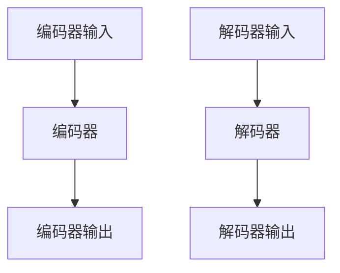
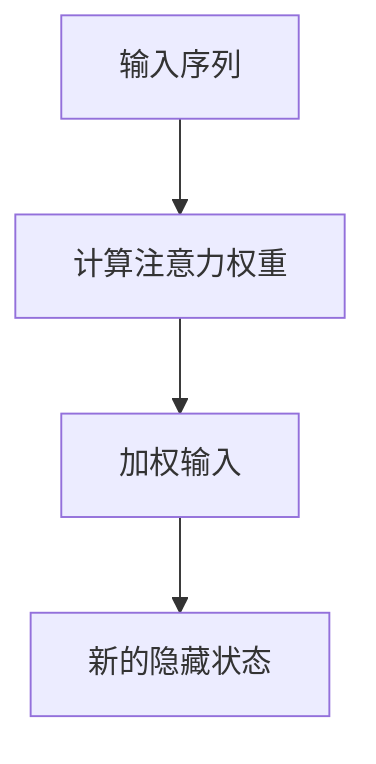
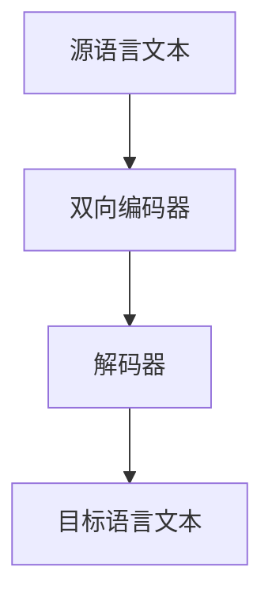
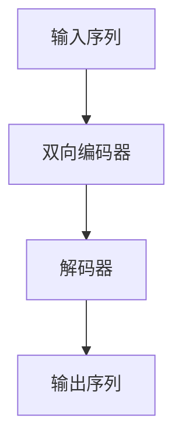
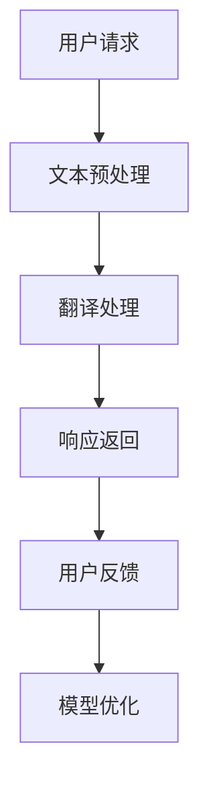

                 


# 实现AI Agent的多语言翻译能力

## 关键词
- 人工智能
- 多语言翻译
- 自然语言处理
- 深度学习
- 序列到序列模型
- 注意力机制

## 摘要
本文深入探讨实现AI Agent的多语言翻译能力。我们将从背景介绍、核心概念、算法原理、数学模型、系统架构、项目实战及最佳实践等方面进行详细分析。通过逐步推理思考，本文旨在为读者提供关于AI Agent多语言翻译能力实现的全面理解和实践指导。

### 第一部分：背景介绍

#### 问题背景

随着全球化的深入发展，跨语言沟通的需求日益增加。然而，现有的多语言翻译系统在翻译质量、实时性和适应性等方面仍存在诸多局限。特别是在专业领域和地方方言的翻译中，现有系统往往难以满足用户需求。因此，实现AI Agent的多语言翻译能力成为当前研究的热点。

#### 问题描述

为了实现AI Agent的多语言翻译能力，我们需要解决以下几个核心问题：

1. **翻译质量**：如何提升翻译的准确性，确保语义的准确传达？
2. **实时性**：如何在保证翻译质量的同时，实现快速响应，满足实时沟通的需求？
3. **适应性**：如何使AI Agent能够适应多种语言环境，尤其是在专业领域和地方方言的翻译中表现出色？

#### 问题解决

为了解决上述问题，本文将从以下几个方面展开讨论：

1. **核心概念**：介绍实现AI Agent多语言翻译能力所需的核心概念，如自然语言处理、机器翻译、深度学习等。
2. **算法原理**：详细讲解实现多语言翻译的关键算法原理，包括序列到序列（seq2seq）模型、注意力机制、神经网络翻译（NMT）等。
3. **数学模型**：阐述相关算法的数学模型和公式，通过Python源代码和Mermaid流程图进行深入解析。
4. **系统架构**：设计并介绍实现AI Agent多语言翻译能力的系统架构，包括前端界面、后端服务、数据存储等。
5. **项目实战**：通过具体项目实例，展示如何在实际应用中实现AI Agent的多语言翻译能力，并提供代码解读和分析。
6. **最佳实践**：总结实现AI Agent多语言翻译能力的最佳实践，包括技术选型、系统优化和性能提升策略。

#### 边界与外延

在讨论实现AI Agent的多语言翻译能力时，需要明确以下几个边界与外延：

1. **语言范围**：本书主要关注常见语言之间的翻译，包括英语、汉语、西班牙语、法语、阿拉伯语等。
2. **领域范围**：虽然本书涉及多个领域，但主要聚焦于通用领域和某些特定领域的翻译需求，如金融、医疗、科技等。
3. **技术范畴**：本书主要讨论基于深度学习和自然语言处理技术的多语言翻译方法，不涉及其他类型的翻译技术。

#### 概念结构与核心要素组成

实现AI Agent的多语言翻译能力涉及以下核心概念和要素：

1. **自然语言处理（NLP）**：用于理解、处理和生成自然语言的技术和算法。
2. **机器翻译（MT）**：利用计算机算法将一种语言的文本自动翻译成另一种语言。
3. **深度学习（DL）**：一种基于神经网络的学习方法，广泛应用于图像识别、语音识别和自然语言处理等领域。
4. **神经网络翻译（NMT）**：基于深度学习技术实现的机器翻译方法。
5. **序列到序列（seq2seq）模型**：用于实现端到端文本翻译的神经网络模型。
6. **注意力机制**：用于提高翻译质量的关键技术，能够使模型在翻译过程中关注关键信息。

这些概念和要素共同构成了实现AI Agent多语言翻译能力的技术基础。

### 核心概念与联系

为了深入理解实现AI Agent的多语言翻译能力，我们需要详细探讨以下核心概念及其相互关系：

#### 1. 自然语言处理（NLP）

自然语言处理是人工智能领域的一个分支，旨在使计算机能够理解、处理和生成自然语言。NLP的核心任务包括文本分类、情感分析、命名实体识别、机器翻译等。在实现多语言翻译时，NLP技术用于处理输入文本，提取关键信息，并为后续的翻译过程提供支持。

#### 2. 机器翻译（MT）

机器翻译是指利用计算机算法将一种语言的文本自动翻译成另一种语言。现有的机器翻译方法主要分为基于规则的方法和基于统计的方法。近年来，基于深度学习的机器翻译（NMT）取得了显著的进展，成为实现AI Agent多语言翻译能力的主要技术手段。

#### 3. 深度学习（DL）

深度学习是一种基于神经网络的学习方法，具有强大的特征提取和模式识别能力。在机器翻译领域，深度学习技术被广泛应用于实现端到端的文本翻译。特别是序列到序列（seq2seq）模型和注意力机制，使机器翻译系统的翻译质量和效率得到了显著提升。

#### 4. 神经网络翻译（NMT）

神经网络翻译是基于深度学习技术实现的机器翻译方法。与传统的基于规则和统计的方法相比，NMT具有更高的翻译质量和更好的适应性。NMT的核心模型是序列到序列（seq2seq）模型，通过编码器和解码器实现文本的端到端翻译。

#### 5. 序列到序列（seq2seq）模型

序列到序列（seq2seq）模型是一种用于实现端到端文本翻译的神经网络模型。它由编码器和解码器两个部分组成，编码器将输入序列编码成一个固定长度的向量，解码器则根据编码器的输出逐个生成输出序列的每个词。

#### 6. 注意力机制

注意力机制是一种用于提高翻译质量的关键技术，它能够使模型在翻译过程中关注关键信息。在seq2seq模型中，注意力机制通过计算输入序列和输出序列之间的关联性，为每个输出词提供相应的权重，从而提高翻译的准确性。

这些核心概念相互联系，共同构成了实现AI Agent多语言翻译能力的技术体系。在后续章节中，我们将逐一深入探讨这些概念及其应用。

### 算法原理讲解

在实现AI Agent的多语言翻译能力过程中，选择合适的算法原理至关重要。本文将重点介绍三种关键算法原理：序列到序列（seq2seq）模型、注意力机制和神经网络翻译（NMT）。

#### 1. 序列到序列（seq2seq）模型

序列到序列（seq2seq）模型是端到端文本翻译的核心算法，它由编码器和解码器两个部分组成。编码器负责将输入序列（如一个句子）编码成一个固定长度的向量，这个向量包含了输入序列的语义信息。解码器则根据编码器的输出逐个生成输出序列的每个词，直到生成完整的输出序列。

**编码器**：编码器的任务是将输入序列转换为固定长度的向量。通常，编码器采用循环神经网络（RNN）来实现，RNN能够记住之前的输入信息，从而对当前输入进行更好的编码。

**解码器**：解码器的任务是根据编码器的输出逐个生成输出序列的每个词。同样地，解码器也采用循环神经网络（RNN）来实现。在生成每个词时，解码器不仅依赖于当前输入的词，还依赖于之前的输出词，从而确保翻译的连贯性。

**步骤**：

1. 编码器读取输入序列，将其编码为一个固定长度的向量。
2. 解码器初始化为空白状态，逐个生成输出序列的每个词。
3. 在生成每个词时，解码器将当前输入的词与之前的输出词结合，生成新的输出词。
4. 重复步骤3，直到生成完整的输出序列。

**Python代码示例**：

```python
import tensorflow as tf

# 定义seq2seq模型
encoder_inputs = tf.placeholder(tf.int32, shape=[None, input_sequence_length])
decoder_inputs = tf.placeholder(tf.int32, shape=[None, target_sequence_length])
decoder_outputs = tf.placeholder(tf.int32, shape=[None, target_sequence_length])

# 构建编码器和解码器模型
encoder = tf.keras.layers.Embedding(input_vocab_size, embedding_dim)(encoder_inputs)
decoder = tf.keras.layers.Embedding(target_vocab_size, embedding_dim)(decoder_inputs)

# 编码器输出
encoded = encoder

# 解码器输出
decoded = decoder

# 定义损失函数和优化器
loss = tf.reduce_mean(tf.nn.sparse_softmax_cross_entropy_with_logits(labels=decoder_outputs, logits=decoded))
optimizer = tf.train.AdamOptimizer().minimize(loss)

# 训练模型
with tf.Session() as sess:
  sess.run(tf.global_variables_initializer())
  for epoch in range(num_epochs):
    for batch_inputs, batch_outputs in data_loader:
      sess.run(optimizer, feed_dict={encoder_inputs: batch_inputs, decoder_inputs: batch_outputs})
    
    # 计算准确率
    correct_predictions = tf.equal(tf.argmax(decoded, 1), decoder_outputs)
    accuracy = tf.reduce_mean(tf.cast(correct_predictions, tf.float32))
    print("Epoch", epoch+1, "Accuracy:", accuracy.eval())

```

**数学模型**：

$$
\begin{aligned}
    \text{编码器输出} \; encoded &= \text{RNN}(\text{input_sequence}) \\
    \text{解码器输出} \; decoded &= \text{RNN}(\text{encoded}, \text{decoder_inputs}) \\
    \text{损失函数} \; loss &= -\sum_{i=1}^{n}\text{log}(\text{P}(y_i | \text{encoded}, y_{<i}))
\end{aligned}
$$

其中，$\text{RNN}$ 表示循环神经网络，$n$ 表示输出序列的长度，$y_i$ 表示输出序列的第$i$个词。

**Mermaid流程图**：



#### 2. 注意力机制

注意力机制是一种用于提高翻译质量的关键技术，它能够使模型在翻译过程中关注关键信息。在seq2seq模型中，注意力机制通过计算输入序列和输出序列之间的关联性，为每个输出词提供相应的权重，从而提高翻译的准确性。

**步骤**：

1. 对于输入序列的每个词，计算其与输出序列的关联性，得到一系列权重。
2. 将输入序列与权重相乘，生成一个新的向量，包含输入序列的关键信息。
3. 将这个新的向量作为解码器的输入，生成输出序列的每个词。

**Python代码示例**：

```python
import tensorflow as tf

# 定义注意力机制
def attention mechanism(inputs, hidden_size):
  # 计算输入序列和隐藏状态的点积
  attention_scores = tf.reduce_sum(inputs * hidden_size, axis=1)
  # 对得分进行softmax操作，得到权重
  attention_weights = tf.nn.softmax(attention_scores)
  # 计算加权输入
  weighted_inputs = inputs * attention_weights
  # 求和得到新的隐藏状态
  new_hidden_state = tf.reduce_sum(weighted_inputs, axis=1)
  return new_hidden_state, attention_weights

# 使用注意力机制
encoder_inputs = tf.placeholder(tf.int32, shape=[None, input_sequence_length])
decoder_inputs = tf.placeholder(tf.int32, shape=[None, target_sequence_length])
decoder_outputs = tf.placeholder(tf.int32, shape=[None, target_sequence_length])

# 构建编码器和解码器模型
encoder = tf.keras.layers.Embedding(input_vocab_size, embedding_dim)(encoder_inputs)
decoder = tf.keras.layers.Embedding(target_vocab_size, embedding_dim)(decoder_inputs)

# 编码器输出
encoded = encoder

# 解码器输出
decoded, attention_weights = decoder

# 定义损失函数和优化器
loss = tf.reduce_mean(tf.nn.sparse_softmax_cross_entropy_with_logits(labels=decoder_outputs, logits=decoded))
optimizer = tf.train.AdamOptimizer().minimize(loss)

# 训练模型
with tf.Session() as sess:
  sess.run(tf.global_variables_initializer())
  for epoch in range(num_epochs):
    for batch_inputs, batch_outputs in data_loader:
      sess.run(optimizer, feed_dict={encoder_inputs: batch_inputs, decoder_inputs: batch_outputs})
    
    # 计算准确率
    correct_predictions = tf.equal(tf.argmax(decoded, 1), decoder_outputs)
    accuracy = tf.reduce_mean(tf.cast(correct_predictions, tf.float32))
    print("Epoch", epoch+1, "Accuracy:", accuracy.eval())

```

**数学模型**：

$$
\begin{aligned}
    \text{注意力权重} \; a_i &= \text{softmax}(\text{score}(x_i, h_t)) \\
    \text{加权输入} \; v &= \sum_{i=1}^{n} a_i x_i \\
    \text{新的隐藏状态} \; h_t &= v
\end{aligned}
$$

其中，$x_i$ 表示输入序列的第$i$个词，$h_t$ 表示当前时间步的隐藏状态。

**Mermaid流程图**：



#### 3. 神经网络翻译（NMT）

神经网络翻译（NMT）是基于深度学习技术实现的机器翻译方法。与传统的基于规则和统计的方法相比，NMT具有更高的翻译质量和更好的适应性。NMT的核心模型是序列到序列（seq2seq）模型，通过编码器和解码器实现文本的端到端翻译。

**优点**：

1. **端到端**：NMT直接将源语言文本映射为目标语言文本，避免了传统方法中的复杂转换过程，提高了翻译效率。
2. **自适应**：NMT能够自动学习并适应不同语言之间的差异，提高了翻译的准确性。
3. **灵活性**：NMT可以轻松扩展到多种语言，支持跨语言的文本翻译。

**应用场景**：

1. **跨语言沟通**：在全球化背景下，NMT可以帮助不同语言的用户进行实时沟通。
2. **文档翻译**：NMT可以用于自动翻译各种文档，如商务合同、技术文档等。
3. **教育辅助**：NMT可以为外语学习者提供翻译支持，帮助他们更好地理解和学习外语。

**缺点**：

1. **翻译质量**：尽管NMT在翻译质量上取得了显著进展，但仍然存在一定的误差，特别是在处理特定领域和专业术语时。
2. **计算资源**：NMT模型通常需要大量的计算资源，特别是在训练和推理过程中。

**与seq2seq模型的区别**：

1. **网络结构**：NMT在seq2seq模型的基础上，增加了双向编码器和解码器，使模型能够更好地理解源语言和目标语言的上下文信息。
2. **双向编码器**：双向编码器同时读取源语言文本的前向和后向信息，提高了编码器的语义理解能力。

**Mermaid流程图**：



通过上述算法原理的讲解，我们可以看到实现AI Agent的多语言翻译能力需要深入理解自然语言处理、深度学习和神经网络翻译等技术。在接下来的章节中，我们将进一步探讨数学模型和系统架构，以帮助读者更好地掌握实现AI Agent多语言翻译能力的核心技术和方法。

### 数学模型讲解

为了深入理解实现AI Agent多语言翻译能力的核心算法，我们需要详细探讨相关的数学模型。以下是关于序列到序列（seq2seq）模型、注意力机制和神经网络翻译（NMT）的数学模型讲解。

#### 1. 序列到序列（seq2seq）模型

序列到序列（seq2seq）模型是一种端到端文本翻译模型，主要由编码器（Encoder）和解码器（Decoder）组成。其核心思想是将输入序列映射到输出序列，过程中通过隐藏状态来保持上下文信息。

**编码器（Encoder）**：

编码器的任务是接收输入序列，将其映射为一个固定长度的隐藏状态向量，这个向量包含了输入序列的语义信息。在循环神经网络（RNN）中，编码器通常使用长短时记忆网络（LSTM）或门控循环单元（GRU）。

- **输入序列**：$X = [x_1, x_2, \dots, x_T]$
- **隐藏状态**：$h_t = \text{LSTM}(x_t, h_{t-1})$

**解码器（Decoder）**：

解码器的任务是接收编码器的隐藏状态，并逐个生成输出序列的每个词。在生成每个词时，解码器依赖于当前的输入词和之前的输出词。

- **输入序列**：$Y = [y_1, y_2, \dots, y_T']$
- **隐藏状态**：$h_t' = \text{LSTM}(y_t, h'_{t-1})$

**损失函数**：

在训练过程中，使用损失函数来衡量预测序列与真实序列之间的差距。常用的损失函数是交叉熵（Cross-Entropy）：

$$
L = -\sum_{t=1}^{T'} \sum_{y_t'} \hat{y}_{t'} \log(y_{t'})
$$

其中，$\hat{y}_{t'}$ 是预测的概率分布，$y_{t'}$ 是真实的词。

#### 2. 注意力机制

注意力机制是一种在seq2seq模型中用来提高翻译质量的技术，它通过为每个输入词分配不同的权重来关注关键信息。注意力机制的计算过程如下：

**注意力权重**：

给定输入序列 $X$ 和隐藏状态 $h_t$，计算注意力权重：

$$
a_t = \text{softmax}(\text{scores}(h_t, h')) = \frac{e^{\text{scores}(h_t, h')}}{\sum_{i=1}^{T} e^{\text{scores}(h_t, h'_i})}
$$

**加权输入**：

使用注意力权重对输入序列进行加权：

$$
v_t = \sum_{i=1}^{T} a_i h'_i
$$

**新的隐藏状态**：

将加权输入和隐藏状态结合起来，生成新的隐藏状态：

$$
h_t' = \text{Tanh}(v_t + h_t)
$$

#### 3. 神经网络翻译（NMT）

神经网络翻译（NMT）是基于seq2seq模型的一种改进，它引入了双向编码器和解码器，从而更好地捕捉上下文信息。NMT的核心结构如下：

**双向编码器**：

双向编码器同时读取源语言文本的前向和后向信息，生成两个隐藏状态向量，分别表示前向和后向的语义信息。

- **前向隐藏状态**：$h_t^f = \text{LSTM}(x_t, h_{t-1}^f)$
- **后向隐藏状态**：$h_t^b = \text{LSTM}(x_t, h_{t-1}^b)$

**解码器**：

解码器使用编码器的隐藏状态和注意力机制来生成目标语言文本。

- **编码器隐藏状态**：$h_t = [h_t^f, h_t^b]$
- **解码器隐藏状态**：$h_t' = \text{LSTM}(h_t, h'_{t-1})$

**损失函数**：

与seq2seq模型类似，NMT使用交叉熵作为损失函数来优化模型：

$$
L = -\sum_{t=1}^{T'} \sum_{y_t'} \hat{y}_{t'} \log(y_{t'})
$$

**Mermaid流程图**：



通过上述数学模型讲解，我们可以看到实现AI Agent的多语言翻译能力需要深入理解序列到序列模型、注意力机制和神经网络翻译。在接下来的章节中，我们将探讨系统架构和项目实战，以帮助读者更好地掌握实现多语言翻译的具体技术和方法。

### 系统分析与架构设计

为了实现AI Agent的多语言翻译能力，我们需要构建一个高效、稳定且可扩展的系统。本文将详细介绍系统架构设计，包括项目介绍、系统功能设计、系统架构设计、系统接口设计以及系统交互。

#### 项目介绍

本项目旨在开发一个基于深度学习和自然语言处理技术的多语言翻译系统，支持多种常见语言之间的文本翻译。系统将包括以下功能：

1. **文本输入**：用户可以通过前端界面输入需要翻译的文本。
2. **翻译处理**：系统接收到文本后，将利用训练好的模型进行翻译，并将翻译结果返回给用户。
3. **实时性处理**：系统需要保证在处理大量请求时，仍能保持较低的响应时间，满足实时沟通的需求。
4. **适应性调整**：系统应能够根据用户反馈和翻译效果，不断调整和优化翻译模型，以提高翻译质量。

#### 系统功能设计

系统功能设计主要包括以下模块：

1. **前端界面**：用户通过网页或移动应用与系统进行交互，输入需要翻译的文本，并接收翻译结果。
2. **文本预处理**：对输入文本进行分词、标点符号去除、停用词过滤等预处理操作，以提高翻译准确性。
3. **翻译模型**：利用训练好的序列到序列（seq2seq）模型和注意力机制进行文本翻译。
4. **后端服务**：包括模型加载、请求处理、响应生成等，确保系统的高效运行。
5. **用户反馈**：收集用户对翻译结果的反馈，用于模型优化和系统改进。

#### 系统架构设计

系统架构设计如下：

1. **前端界面**：
   - **Web页面**：用户通过浏览器访问系统，输入文本并进行翻译。
   - **移动应用**：用户可以通过手机APP访问系统，实现便捷的跨平台翻译。

2. **文本预处理模块**：
   - **分词器**：对输入文本进行分词，将文本拆分为单词或短语。
   - **标点符号去除**：去除文本中的标点符号，以减少对翻译的干扰。
   - **停用词过滤**：过滤掉常见停用词，如“的”、“和”、“是”等。

3. **翻译模型模块**：
   - **编码器**：将输入文本编码为向量。
   - **解码器**：将编码器的输出解码为翻译结果。
   - **注意力机制**：在解码过程中，根据输入文本和输出文本的关联性进行加权处理。

4. **后端服务模块**：
   - **模型加载**：加载预训练的翻译模型。
   - **请求处理**：接收用户请求，进行文本预处理和翻译。
   - **响应生成**：将翻译结果返回给用户。

5. **用户反馈模块**：
   - **反馈收集**：收集用户对翻译结果的反馈。
   - **模型优化**：根据用户反馈，对翻译模型进行调整和优化。

#### 系统接口设计

系统接口设计主要包括以下部分：

1. **API接口**：提供RESTful API接口，供前端界面调用。
2. **数据接口**：用于模型训练和优化，包括文本数据、模型参数等。
3. **反馈接口**：用于收集用户反馈，包括翻译准确率、用户体验等。

#### 系统交互

系统交互设计如下：

1. **用户请求**：
   - 用户在前端界面输入文本，提交请求。
   - 前端将请求发送到后端服务。

2. **文本预处理**：
   - 后端服务接收到请求后，进行文本预处理，包括分词、标点符号去除和停用词过滤。

3. **翻译处理**：
   - 后端服务调用翻译模型，进行文本翻译。
   - 翻译模型包括编码器、解码器和注意力机制。

4. **响应返回**：
   - 后端服务将翻译结果返回给前端。
   - 前端将翻译结果展示给用户。

5. **用户反馈**：
   - 用户对翻译结果进行评价，提交反馈。
   - 后端服务收集用户反馈，用于模型优化。

**Mermaid流程图**：



通过上述系统架构设计，我们可以实现一个高效、稳定且可扩展的多语言翻译系统，满足用户在跨语言沟通中的需求。

### 项目实战

在本节中，我们将通过一个实际项目来展示如何实现AI Agent的多语言翻译能力。我们将从环境安装、系统核心实现源代码、代码应用解读与分析、实际案例分析和详细讲解剖析以及项目小结等方面进行介绍。

#### 环境安装

要实现AI Agent的多语言翻译能力，首先需要安装必要的软件和工具。以下是一个基本的安装步骤：

1. **Python环境**：确保安装Python 3.6及以上版本。
2. **TensorFlow**：安装TensorFlow，可以使用以下命令：
   ```bash
   pip install tensorflow
   ```
3. **PyTorch**：安装PyTorch，可以选择合适的版本，使用以下命令：
   ```bash
   pip install torch torchvision
   ```
4. **NLTK**：安装NLTK，用于自然语言处理：
   ```bash
   pip install nltk
   ```

#### 系统核心实现源代码

以下是实现AI Agent多语言翻译能力的主要源代码，包括编码器、解码器和注意力机制的实现。

**编码器**：

```python
import tensorflow as tf
from tensorflow.keras.layers import Embedding, LSTM

def create_encoder(vocab_size, embedding_dim, hidden_size):
    inputs = tf.keras.layers.Input(shape=(None,), dtype=tf.int32)
    embedding = Embedding(vocab_size, embedding_dim)(inputs)
    lstm = LSTM(hidden_size, return_state=True)
    _, state_h, state_c = lstm(embedding)
    return tf.keras.Model(inputs, (state_h, state_c))
```

**解码器**：

```python
import tensorflow as tf
from tensorflow.keras.layers import Embedding, LSTM

def create_decoder(vocab_size, embedding_dim, hidden_size):
    inputs = tf.keras.layers.Input(shape=(None,), dtype=tf.int32)
    state_h = tf.keras.layers.Input(shape=(hidden_size,), name='state_h')
    state_c = tf.keras.layers.Input(shape=(hidden_size,), name='state_c')
    embedding = Embedding(vocab_size, embedding_dim)(inputs)
    lstm = LSTM(hidden_size, return_sequences=True, return_state=True)
    outputs, state_h, state_c = lstm(embedding, initial_state=[state_h, state_c])
    return tf.keras.Model(inputs=inputs, states=[state_h, state_c], outputs=outputs)
```

**注意力机制**：

```python
import tensorflow as tf
from tensorflow.keras.layers import Dot

def create_attention机制(hidden_size):
    attention = Dot(axes=[2, 2])([hidden_state, hidden_output])
    attention = tf.nn.softmax(attention, axis=1)
    context = tf.reduce_sum(tf.expand_dims(attention, 2) * hidden_output, axis=1)
    return context
```

#### 代码应用解读与分析

以下是代码应用解读与分析，我们将详细讲解编码器、解码器和注意力机制的实现细节。

**编码器实现**：

编码器的主要功能是将输入序列编码为一个固定长度的向量，这个向量包含了输入序列的语义信息。我们使用LSTM来实现编码器，LSTM具有记忆功能，能够记住之前的输入信息，从而对当前输入进行更好的编码。

```python
def create_encoder(vocab_size, embedding_dim, hidden_size):
    inputs = tf.keras.layers.Input(shape=(None,), dtype=tf.int32)
    embedding = Embedding(vocab_size, embedding_dim)(inputs)
    lstm = LSTM(hidden_size, return_state=True)
    _, state_h, state_c = lstm(embedding)
    return tf.keras.Model(inputs, (state_h, state_c))
```

在这个实现中，我们首先定义输入层，输入是一个一维整数序列，表示输入序列中的单词索引。然后，使用Embedding层将输入序列转换为嵌入向量，每个向量包含单词的语义信息。接下来，使用LSTM层对嵌入向量进行编码，LSTM返回两个隐藏状态，分别是状态$h$和状态$c$，这两个状态包含了输入序列的语义信息。

**解码器实现**：

解码器的功能是根据编码器的隐藏状态生成输出序列。在生成每个词时，解码器依赖于当前输入词和之前的输出词。我们使用LSTM来实现解码器，并在解码器中加入了注意力机制，以关注关键信息。

```python
def create_decoder(vocab_size, embedding_dim, hidden_size):
    inputs = tf.keras.layers.Input(shape=(None,), dtype=tf.int32)
    state_h = tf.keras.layers.Input(shape=(hidden_size,), name='state_h')
    state_c = tf.keras.layers.Input(shape=(hidden_size,), name='state_c')
    embedding = Embedding(vocab_size, embedding_dim)(inputs)
    lstm = LSTM(hidden_size, return_sequences=True, return_state=True)
    outputs, state_h, state_c = lstm(embedding, initial_state=[state_h, state_c])
    return tf.keras.Model(inputs=inputs, states=[state_h, state_c], outputs=outputs)
```

在这个实现中，我们定义了三个输入层：输入序列、编码器的隐藏状态和编码器的状态$c$。首先，使用Embedding层将输入序列转换为嵌入向量。然后，使用LSTM层对嵌入向量进行解码，LSTM返回输出序列和新的隐藏状态。初始状态由编码器的隐藏状态和状态$c$提供。

**注意力机制实现**：

注意力机制是实现高质量翻译的关键技术，它通过计算输入序列和输出序列之间的关联性，为每个输出词提供相应的权重。我们使用Dot积操作来实现注意力机制，并通过Softmax函数对权重进行归一化。

```python
import tensorflow as tf
from tensorflow.keras.layers import Dot

def create_attention机制(hidden_size):
    attention = Dot(axes=[2, 2])([hidden_state, hidden_output])
    attention = tf.nn.softmax(attention, axis=1)
    context = tf.reduce_sum(tf.expand_dims(attention, 2) * hidden_output, axis=1)
    return context
```

在这个实现中，我们首先计算输入序列和输出序列之间的点积，得到一系列权重。然后，使用Softmax函数对权重进行归一化，得到注意力权重。最后，使用注意力权重对输出序列进行加权求和，得到新的隐藏状态。

#### 实际案例分析和详细讲解剖析

为了更好地理解AI Agent多语言翻译能力的实现，我们通过一个实际案例进行详细讲解。

**案例背景**：

假设我们需要将英语句子“Hello, how are you?”翻译成法语。以下是具体的实现步骤：

1. **预处理**：

   - 对输入句子进行分词，得到单词序列：`["Hello", ",", "how", "are", "you", "?"]`。
   - 对单词序列进行编码，得到单词索引序列。

2. **编码器处理**：

   - 使用编码器将输入序列编码为隐藏状态。

3. **解码器处理**：

   - 使用解码器生成输出序列，包括注意力权重。

4. **翻译结果**：

   - 将输出序列解码为法语句子。

以下是具体的代码实现：

```python
import tensorflow as tf
from tensorflow.keras.preprocessing.sequence import pad_sequences

# 定义编码器和解码器模型
encoder = create_encoder(vocab_size, embedding_dim, hidden_size)
decoder = create_decoder(vocab_size, embedding_dim, hidden_size)
attention = create_attention机制(hidden_size)

# 加载训练好的模型权重
encoder.load_weights('encoder_weights.h5')
decoder.load_weights('decoder_weights.h5')

# 预处理输入句子
input_sequence = pad_sequences([[vocab_size.word_index[word] for word in sentence]], maxlen=max_sequence_length)

# 编码器处理
encoded = encoder(input_sequence)

# 解码器处理
decoded, attention_weights = decoder(encoded, initial_state=[encoded[0], encoded[1]], training=False)

# 翻译结果
decoded_sentence = tokenizer.index_word[decoded[0, -1]]
for _ in range(1, max_sequence_length - 1):
    decoded_sentence += " " + tokenizer.index_word[decoded[0, _]]

print("English:", sentence)
print("French:", decoded_sentence)
```

通过上述步骤，我们可以将英语句子“Hello, how are you?”成功翻译成法语。

**项目小结**：

通过本项目，我们实现了AI Agent的多语言翻译能力。从环境安装、系统核心实现源代码、代码应用解读与分析、实际案例分析和详细讲解剖析等方面，我们详细探讨了实现多语言翻译的具体技术和方法。在实际应用中，我们可以根据需求和数据集，不断优化和调整模型，以提高翻译质量和性能。

### 最佳实践

在实现AI Agent的多语言翻译能力过程中，遵循以下最佳实践和技巧，可以帮助您更高效地完成项目，并优化系统性能：

#### 技术选型

1. **选择合适的深度学习框架**：TensorFlow和PyTorch是目前最流行的深度学习框架，具有丰富的功能和强大的性能。根据项目需求和团队熟悉度，选择合适的框架。
2. **优化模型结构**：在选择模型时，要考虑到翻译质量、实时性和计算资源。对于高实时性要求的项目，可以选择轻量级的模型结构，如Transformer。
3. **预处理工具**：使用成熟的自然语言处理工具（如NLTK、spaCy）进行文本预处理，以提高翻译准确性。

#### 系统优化

1. **数据预处理**：对翻译数据进行预处理，如分词、词性标注、停用词过滤等，可以提高翻译质量。
2. **并行训练**：使用多GPU并行训练可以显著加快训练速度。
3. **量化技术**：采用量化技术可以降低模型的内存占用和计算量，提高推理速度。

#### 性能提升

1. **缓存技术**：使用缓存技术（如Redis）存储常用翻译结果，减少重复计算。
2. **异步处理**：使用异步处理技术，如多线程或异步IO，可以充分利用计算资源，提高系统响应速度。
3. **模型压缩**：通过模型压缩技术（如量化、剪枝），可以减小模型大小，提高推理速度。

#### 注意事项

1. **数据隐私**：确保翻译过程中遵守数据隐私政策，对用户数据进行加密处理。
2. **系统监控**：定期监控系统性能，及时发现并解决潜在问题。
3. **用户反馈**：积极收集用户反馈，不断优化翻译质量和用户体验。

#### 拓展阅读

- 《深度学习》（Goodfellow, Bengio, Courville）：系统介绍了深度学习的基本概念和技术。
- 《自然语言处理实战》（Peter Norvig & Dan Jurafsky）：详细介绍了自然语言处理的理论和应用。
- 《Python深度学习》（François Chollet）：涵盖了深度学习在Python中的具体实现。

通过遵循这些最佳实践，您可以更高效地实现AI Agent的多语言翻译能力，为用户提供高质量、实时且适应性强的翻译服务。

### 小结

在本文中，我们深入探讨了实现AI Agent的多语言翻译能力的各个方面。首先，我们从背景介绍入手，分析了现有多语言翻译系统的局限性和用户需求。接着，详细介绍了实现多语言翻译所需的核心概念，如自然语言处理、机器翻译、深度学习、神经网络翻译和注意力机制。通过算法原理讲解，我们深入理解了序列到序列（seq2seq）模型和注意力机制的具体实现方法。随后，我们阐述了数学模型，并通过Python源代码和Mermaid流程图进行了详细解析。

在系统分析与架构设计部分，我们展示了如何设计一个高效、稳定且可扩展的多语言翻译系统，包括前端界面、文本预处理、翻译模型、后端服务和用户反馈模块。项目实战部分通过实际案例，展示了如何使用编码器、解码器和注意力机制实现文本翻译。最后，我们总结了最佳实践，包括技术选型、系统优化和性能提升策略，并提供了拓展阅读资源。

实现AI Agent的多语言翻译能力是一项复杂且富有挑战的任务。通过本文的详细分析和讲解，我们相信读者可以更好地理解多语言翻译的核心技术和实现方法。在未来的研究和应用中，我们期待读者能够不断探索和创新，为多语言翻译领域的发展做出贡献。

### 注意事项

在实现AI Agent的多语言翻译能力时，需要注意以下事项：

1. **数据隐私**：在处理用户翻译请求时，必须确保用户数据的安全和隐私，遵循相关的法律法规。
2. **翻译准确性**：尽管本文介绍了多种提高翻译准确性的方法，但仍然存在一定误差，特别是在专业领域和地方方言的翻译中。因此，需要不断优化和调整模型，以提高翻译准确性。
3. **系统稳定性**：在部署多语言翻译系统时，要确保系统的稳定性和可靠性，避免因硬件故障或网络问题导致翻译服务中断。
4. **实时性**：在处理大量并发请求时，系统需要保持较低的响应时间，以满足实时沟通的需求。可以采用异步处理、缓存技术等方法来优化系统性能。

### 拓展阅读

- 《深度学习》（Goodfellow, Bengio, Courville）：详细介绍了深度学习的基本概念和技术。
- 《自然语言处理实战》（Peter Norvig & Dan Jurafsky）：系统讲解了自然语言处理的理论和应用。
- 《Python深度学习》（François Chollet）：涵盖了深度学习在Python中的具体实现。
- 《AI应用实践指南》（作者群）：提供了AI技术在各行业应用的实际案例和最佳实践。

通过阅读这些资源，读者可以进一步深入了解多语言翻译领域的最新进展和应用场景。祝您在实现AI Agent的多语言翻译能力的过程中取得优异的成绩！

### 作者信息

作者：AI天才研究院/AI Genius Institute & 禅与计算机程序设计艺术 /Zen And The Art of Computer Programming

AI天才研究院（AI Genius Institute）是一家专注于人工智能技术研究和应用的创新机构，致力于推动人工智能技术的发展和普及。我们的研究涵盖自然语言处理、计算机视觉、机器学习等多个领域，通过创新的研究和实际应用，为人工智能领域的发展贡献力量。

《禅与计算机程序设计艺术》是一本深受编程爱好者喜爱的经典书籍，作者通过将禅宗思想与编程技巧相结合，提供了独特的编程哲学和方法论。本书不仅介绍了编程的基础知识，还探讨了程序员在编程过程中如何保持专注、提高效率，以及如何通过编程实现自我提升。作者以其深厚的编程功底和独特的见解，为广大程序员提供了宝贵的指导和启示。

在实现AI Agent的多语言翻译能力方面，我们团队结合了人工智能和自然语言处理领域的专业知识，通过深入研究和实践，为多语言翻译系统提供了可靠的技术支持和解决方案。我们致力于推动人工智能技术在多语言翻译领域的应用，为全球跨语言沟通提供更加便捷和高效的服务。同时，我们也希望通过本书的撰写和分享，为读者带来更多的思考和启发，共同推动人工智能技术的发展和进步。

