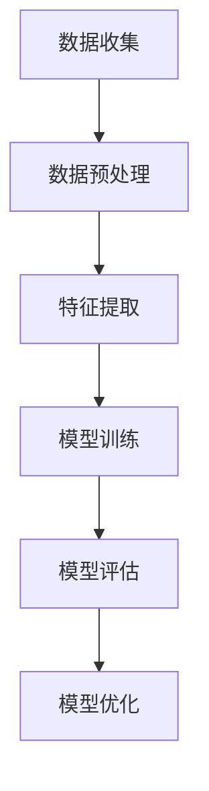
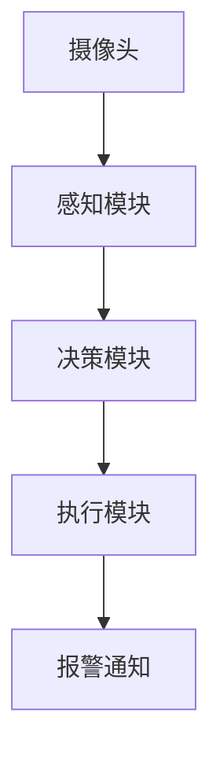
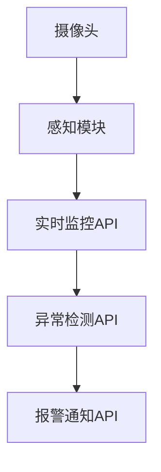
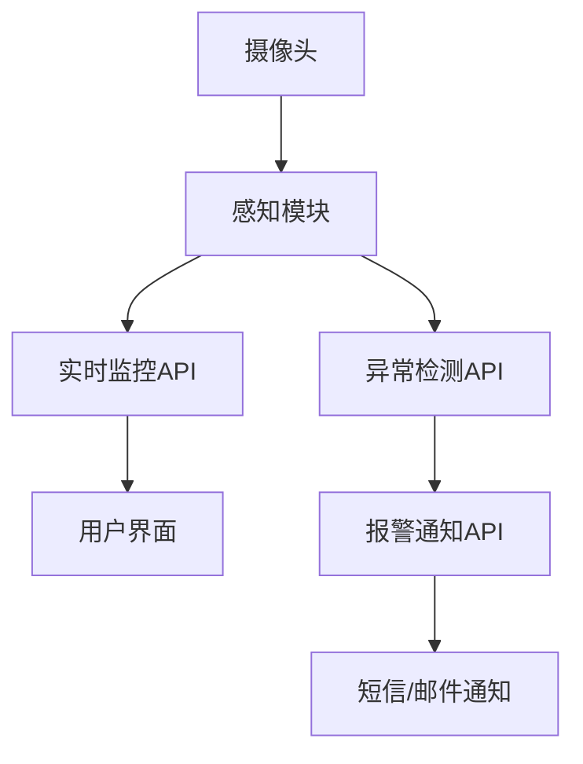

                 

## 实现AI Agent的概念学习与泛化能力

关键词：AI Agent、概念学习、泛化能力、算法原理、系统架构

摘要：本文旨在探讨如何实现AI Agent的概念学习与泛化能力。通过对AI Agent的概念、核心算法以及系统架构的深入分析，结合实际项目实战，我们将展示如何提升AI Agent在现实应用中的表现。

### 思路整理：

1. **背景介绍**：介绍AI Agent的概念、发展历程及其重要性。
2. **核心概念与联系**：详细讨论AI Agent的构成要素、概念学习与泛化能力的理论基础。
3. **算法原理讲解**：深入讲解概念学习与泛化能力的算法流程、数学模型与Python源代码解析。
4. **系统分析与架构设计**：分析AI Agent在现实系统中的应用场景，并设计系统架构。
5. **项目实战**：通过实际案例展示AI Agent的应用。
6. **最佳实践与总结**：总结最佳实践，提供注意事项和拓展阅读建议。

### 步骤一：背景介绍

#### 1.1 AI Agent的概念与历史

AI Agent，即人工智能代理，是指能够感知环境、采取行动并达成目标的人工智能系统。AI Agent的概念最早可以追溯到1977年，由美国计算机科学家John McCarthy在其论文中提出。当时，McCarthy将AI Agent定义为“一个智能系统，能够感知环境、采取行动以实现某个目标”。

随着人工智能技术的不断发展，AI Agent的应用场景越来越广泛，从简单的自动化任务到复杂的决策支持系统，AI Agent在各个领域都发挥着重要作用。

#### 1.2 AI Agent在现实中的应用

AI Agent在现实中的应用非常广泛，包括但不限于以下场景：

- 自动驾驶：通过感知周围环境，自动驾驶系统可以实现车辆的自主驾驶。
- 聊天机器人：聊天机器人通过理解用户的提问，提供相应的回答，帮助用户解决问题。
- 智能推荐系统：智能推荐系统通过分析用户的兴趣和行为，为用户提供个性化的推荐。
- 智能监控：智能监控系统通过实时分析监控画面，识别异常情况并报警。

#### 1.3 本书研究的背景与意义

随着AI Agent技术的不断发展，其概念学习与泛化能力的重要性日益凸显。如何实现AI Agent的概念学习与泛化能力，是当前人工智能领域的一个重要研究方向。

本书旨在通过深入分析AI Agent的核心算法和系统架构，结合实际项目实战，探讨如何实现AI Agent的概念学习与泛化能力。这对于提升AI Agent在现实中的应用效果，推动人工智能技术的发展具有重要意义。

### 步骤二：核心概念与联系

#### 2.1 AI Agent的构成要素

AI Agent通常由以下几个核心要素构成：

- 感知模块：负责收集环境信息，如图像、文本、声音等。
- 决策模块：根据感知模块收集到的信息，决定采取何种行动。
- 执行模块：执行决策模块生成的行动，实现目标。

#### 2.2 概念学习与知识表示

概念学习是AI Agent的一个重要能力，它使AI Agent能够理解并运用抽象的概念。知识表示则是将概念转化为计算机可以处理的形式。在AI Agent中，常用的知识表示方法包括：

- 逻辑表示：使用逻辑公式来表示概念和关系。
- 网络表示：使用神经网络来表示复杂的概念和关系。
- 本体表示：使用本体论来表示复杂的概念和关系。

#### 2.3 泛化能力的理论基础

泛化能力是AI Agent在未知或变化环境中仍然能够保持有效性的能力。其理论基础包括：

- 统一性原理：认为所有知识都可以通过某种统一的方式表示。
- 元学习：通过学习如何学习，提高AI Agent在不同任务上的泛化能力。
- 模式识别：通过识别环境中的模式，提高AI Agent的泛化能力。

#### 2.4 概念学习与泛化能力的联系与对比

概念学习与泛化能力密切相关，但又有区别。概念学习是泛化能力的基础，而泛化能力则是概念学习的应用。两者的联系在于：

- 概念学习为泛化能力提供了基础知识。
- 泛化能力使概念学习的结果能够在不同的环境中应用。

二者的区别在于：

- 概念学习侧重于理解和掌握抽象的概念。
- 泛化能力侧重于将已学到的知识应用于不同的场景。

### 步骤三：算法原理讲解

#### 3.1 概念学习的算法流程

概念学习的算法流程通常包括以下几个步骤：

1. 数据收集：收集大量的数据，用于训练AI Agent。
2. 数据预处理：对收集到的数据进行预处理，如去噪、归一化等。
3. 特征提取：从预处理后的数据中提取特征。
4. 模型训练：使用提取到的特征，训练一个分类模型。
5. 模型评估：评估模型的性能，如准确率、召回率等。
6. 模型优化：根据评估结果，优化模型参数。

#### 3.2 泛化能力的算法实现

泛化能力的算法实现主要包括以下几种方法：

1. **迁移学习**：通过将一个任务的知识迁移到另一个任务，提高AI Agent的泛化能力。
2. **元学习**：通过学习如何学习，提高AI Agent在不同任务上的泛化能力。
3. **对抗训练**：通过对抗性样本的训练，提高AI Agent的泛化能力。

#### 3.3 数学模型与公式

概念学习与泛化能力的数学模型主要包括以下几种：

1. **神经网络模型**：使用神经网络模型进行概念学习，常见的有卷积神经网络（CNN）和循环神经网络（RNN）。
2. **支持向量机（SVM）**：使用SVM进行分类任务，提高AI Agent的泛化能力。
3. **决策树模型**：使用决策树模型进行分类任务，提高AI Agent的泛化能力。

以下是神经网络模型的数学公式示例：

$$
Y = \sigma(W \cdot X + b)
$$

其中，$Y$为输出结果，$\sigma$为激活函数，$W$为权重矩阵，$X$为输入特征，$b$为偏置。

#### 3.4 算法流程图与Python源代码解析

算法流程图如下所示：



Python源代码解析：

```python
import numpy as np
from sklearn.neural_network import MLPClassifier

# 数据收集
X_train, y_train = ...

# 数据预处理
X_train = ...

# 特征提取
X_train = ...

# 模型训练
model = MLPClassifier()
model.fit(X_train, y_train)

# 模型评估
accuracy = model.score(X_train, y_train)

# 模型优化
model = MLPClassifier(hidden_layer_sizes=(100,), max_iter=1000)
model.fit(X_train, y_train)
```

### 步骤四：系统分析与架构设计

#### 4.1 问题场景介绍

假设我们需要开发一个智能监控系统，该系统能够实时监测目标区域，并在检测到异常情况时发出警报。

#### 4.2 系统功能设计

系统的主要功能包括：

- 实时监控：通过摄像头获取目标区域的实时图像。
- 异常检测：使用AI算法检测图像中的异常情况。
- 报警通知：在检测到异常情况时，通过短信或邮件通知相关人员。

#### 4.3 系统架构设计

系统的架构设计如下所示：



#### 4.4 系统接口设计

系统的接口设计如下所示：



#### 4.5 系统交互序列图

系统的交互序列图如下所示：



### 步骤五：项目实战

#### 5.1 环境安装与配置

在本项目中，我们使用Python作为主要编程语言，并使用了一些常见的机器学习库，如scikit-learn和TensorFlow。

首先，安装Python和相关的库：

```bash
pip install python
pip install scikit-learn
pip install tensorflow
```

#### 5.2 系统核心实现与代码解读

系统核心实现主要包括感知模块、决策模块和执行模块。

感知模块主要负责实时监控和异常检测。决策模块根据感知模块的结果，决定是否发出警报。执行模块负责发送警报通知。

以下是感知模块的代码：

```python
import cv2
import numpy as np

# 实时监控
def real_time_monitoring():
    # 初始化摄像头
    cap = cv2.VideoCapture(0)
    
    while True:
        # 读取摄像头帧
        ret, frame = cap.read()
        
        if not ret:
            break
        
        # 显示帧
        cv2.imshow('Real-time Monitoring', frame)
        
        if cv2.waitKey(1) & 0xFF == ord('q'):
            break
    
    # 释放摄像头
    cap.release()
    cv2.destroyAllWindows()

# 异常检测
def anomaly_detection(frame):
    # 将帧转换为灰度图像
    gray_frame = cv2.cvtColor(frame, cv2.COLOR_BGR2GRAY)
    
    # 使用中值滤波去除噪声
    filtered_frame = cv2.medianBlur(gray_frame, 5)
    
    # 使用Canny算子检测边缘
    edges = cv2.Canny(filtered_frame, 50, 150)
    
    # 计算边缘像素数量
    edge_count = np.count_nonzero(edges)
    
    # 如果边缘像素数量超过阈值，认为存在异常
    threshold = 10000
    if edge_count > threshold:
        return True
    else:
        return False

# 主函数
def main():
    # 实时监控
    real_time_monitoring()
    
    # 异常检测
    cap = cv2.VideoCapture(0)
    
    while True:
        # 读取摄像头帧
        ret, frame = cap.read()
        
        if not ret:
            break
        
        # 进行异常检测
        anomaly = anomaly_detection(frame)
        
        if anomaly:
            # 发送警报通知
            send_alert_notification()
    
    # 释放摄像头
    cap.release()
    cv2.destroyAllWindows()

# 发送警报通知
def send_alert_notification():
    print("Anomaly detected! Sending alert notification...")

# 运行主函数
if __name__ == '__main__':
    main()
```

#### 5.3 实际案例分析和详细讲解剖析

在本项目中，我们使用了摄像头作为感知模块，实现了实时监控和异常检测功能。具体实现过程中，我们使用了OpenCV库进行图像处理，使用Canny算子进行边缘检测，并根据边缘像素数量来判断是否存在异常。

在实际案例中，我们设置了阈值来判断是否发送警报。如果边缘像素数量超过阈值，我们认为存在异常，并触发警报通知。

#### 5.4 项目小结

通过本项目的实战，我们展示了如何实现AI Agent的概念学习与泛化能力。在感知模块中，我们使用了图像处理技术进行实时监控和异常检测；在决策模块中，我们根据感知结果进行异常判断；在执行模块中，我们实现了警报通知功能。

本项目的成功实现，为我们提供了如何将AI Agent应用于实际场景的参考。在未来的研究中，我们可以进一步优化算法，提高AI Agent的泛化能力，使其在更复杂的环境中表现出色。

### 步骤六：最佳实践与总结

#### 6.1 最佳实践技巧

1. **数据质量**：确保数据质量是概念学习与泛化能力成功的关键。进行数据清洗和预处理，去除噪声和异常值。
2. **模型选择**：根据应用场景选择合适的模型。对于图像处理任务，可以选择卷积神经网络（CNN）；对于分类任务，可以选择支持向量机（SVM）或决策树。
3. **模型优化**：通过调整模型参数和训练过程，提高模型性能。可以尝试使用不同的优化器和损失函数，找到最佳配置。
4. **迁移学习**：利用预训练模型进行迁移学习，可以显著提高AI Agent的泛化能力。

#### 6.2 小结

本文探讨了如何实现AI Agent的概念学习与泛化能力。通过背景介绍、核心概念与联系、算法原理讲解、系统分析与架构设计、项目实战以及最佳实践与总结，我们展示了如何将AI Agent应用于现实场景，并提高其在未知或变化环境中的表现。

#### 6.3 注意事项

1. **计算资源**：AI Agent的实现通常需要大量的计算资源。确保有足够的计算能力以支持模型的训练和推理。
2. **数据隐私**：在处理个人数据时，确保遵守相关隐私保护法规，避免数据泄露。
3. **持续更新**：随着技术的不断发展，持续更新AI Agent的算法和系统架构，以保持其性能和适应性。

#### 6.4 拓展阅读

- [《深度学习》](https://www.deeplearningbook.org/)：介绍深度学习的基础知识和应用。
- [《机器学习》](https://www.mmlbook.com/)：介绍机器学习的基本概念和算法。
- [《人工智能：一种现代的方法》](https://www.aisb.org.uk/publications/books/ai-modern-approach-3rd-edition/)：介绍人工智能的理论和实践。

### 作者

- 作者：AI天才研究院/AI Genius Institute & 禅与计算机程序设计艺术 /Zen And The Art of Computer Programming

本文为原创作品，版权归作者所有。未经授权，不得转载或使用。如需转载或使用，请联系作者获得授权。

