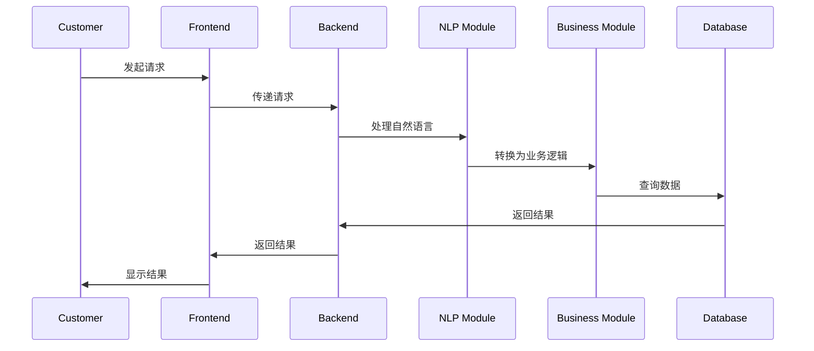

                 

# 客户服务 AI Agent：24/7 全天候的 LLM 驱动智能客服

关键词：AI客服、语言模型、全天候服务、自然语言处理

摘要：本文将深入探讨客户服务 AI Agent，特别是基于大型语言模型（LLM）的智能客服系统。我们将从概述和基础开始，逐步分析 LLM 驱动的智能客服原理、开发流程、实战案例以及未来的发展趋势。通过详细的讲解和实例分析，本文旨在为读者提供一个全面的技术视角，了解如何构建和优化 24/7 全天候的智能客服系统。

----------------------------------------------------------------

## 目录大纲

1. **第一部分：客户服务 AI Agent 的概述与基础**
   - 第1章：客户服务 AI Agent 的起源与发展
   - 第2章：LLM 驱动的智能客服原理与架构
   - 第3章：客户服务 AI Agent 的核心功能与应用场景

2. **第二部分：LLM 驱动的智能客服开发**
   - 第4章：LLM 的基本概念与训练方法
     - 4.1 LLM 的基本概念
     - 4.2 LLM 的训练方法
   - 第5章：客户服务 AI Agent 的核心技术
     - 5.1 自然语言处理技术
     - 5.2 机器学习与深度学习技术
     - 5.3 数据处理与存储技术
   - 第6章：客户服务 AI Agent 的开发流程
     - 6.1 需求分析与规划
     - 6.2 系统设计与实现
     - 6.3 测试与部署

3. **第三部分：实战案例分析**
   - 第7章：案例一：电商行业智能客服系统
     - 7.1 项目背景
     - 7.2 系统设计
     - 7.3 核心代码实现
     - 7.4 项目小结
   - 第8章：案例二：金融行业智能客服系统
     - 8.1 项目背景
     - 8.2 系统设计
     - 8.3 核心代码实现
     - 8.4 项目小结

4. **第四部分：拓展与未来展望**
   - 第9章：客户服务 AI Agent 的挑战与未来发展趋势
     - 9.1 挑战与问题
     - 9.2 未来发展趋势
   - 第10章：最佳实践与技巧分享
     - 10.1 最佳实践
     - 10.2 技巧分享
   - 第11章：小结与展望
     - 11.1 本书小结
     - 11.2 未来展望

接下来，我们将按照这个大纲逐步展开内容，确保每个部分都详细、具体、有深度。

----------------------------------------------------------------

## 第一部分：客户服务 AI Agent 的概述与基础

### 第1章：客户服务 AI Agent 的起源与发展

随着互联网的普及和电子商务的快速发展，客户服务变得越来越重要。传统的客户服务方式，如人工电话、邮件和在线聊天，已经难以满足日益增长的客户需求。因此，客户服务 AI Agent 应运而生。

#### 背景介绍

客户服务 AI Agent 是一种基于人工智能技术，模拟人类客服人员行为的智能系统。它能够处理各种客户咨询，提供即时、准确的答复，从而提升客户满意度和降低企业运营成本。

#### 问题背景

客户服务的核心问题是效率和准确性。传统的客户服务方式存在以下几个问题：

1. **人力资源不足**：随着业务量的增加，需要更多的客服人员来处理客户咨询。
2. **响应速度慢**：人工客服往往无法在短时间内提供答复，影响客户满意度。
3. **成本高**：雇佣大量客服人员导致运营成本增加。

#### 问题描述

如何通过技术手段提升客户服务的效率和准确性，同时降低成本？

#### 问题解决

客户服务 AI Agent 通过以下几个步骤解决上述问题：

1. **自动化处理**：AI Agent 能够自动化处理常见问题，减少人工干预。
2. **即时响应**：通过快速处理客户咨询，提高客户满意度。
3. **降低成本**：通过减少人工客服数量，降低企业运营成本。

#### 边界与外延

客户服务 AI Agent 的边界在于其处理问题的范围和能力。外延则包括它能够应用的场景和行业。

#### 概念结构与核心要素组成

客户服务 AI Agent 的核心结构包括：

1. **自然语言处理（NLP）模块**：用于理解和处理客户咨询。
2. **机器学习模块**：用于训练 AI Agent，提高其响应能力和准确性。
3. **知识库**：存储常见问题的答案和相关数据。

### 第2章：LLM 驱动的智能客服原理与架构

#### 背景介绍

大型语言模型（LLM，Large Language Model）是一种能够理解和生成自然语言文本的深度学习模型。LLM 的出现使得智能客服系统在处理复杂客户咨询方面取得了巨大进展。

#### 问题背景

传统的自然语言处理技术，如规则匹配和统计模型，在处理复杂、模糊的语言咨询时存在一定的局限性。而 LLM 能够更好地理解和生成自然语言，从而提升智能客服系统的性能。

#### 问题描述

如何利用 LLM 提高智能客服系统的性能？

#### 问题解决

通过以下几个步骤解决上述问题：

1. **LLM 的引入**：将 LLM 集成到智能客服系统中，用于处理客户咨询。
2. **数据预处理**：对客户咨询进行预处理，提取关键信息，提高 LLM 的输入质量。
3. **模型训练**：使用大量标注数据进行 LLM 的训练，提高其响应能力和准确性。

#### 边界与外延

LLM 的边界在于其训练数据和模型架构。外延则包括它能够应用的场景和行业。

#### 概念结构与核心要素组成

LLM 驱动的智能客服系统包括以下几个核心要素：

1. **LLM 模型**：用于理解和生成自然语言文本。
2. **数据预处理模块**：用于处理客户咨询，提取关键信息。
3. **知识库**：存储常见问题的答案和相关数据。

### 第3章：客户服务 AI Agent 的核心功能与应用场景

#### 背景介绍

客户服务 AI Agent 的核心功能是其能够处理各种类型的客户咨询，提供即时、准确的答复。应用场景非常广泛，包括电商、金融、医疗等多个行业。

#### 问题背景

客户服务 AI Agent 需要具备哪些核心功能，才能满足不同行业和场景的需求？

#### 问题描述

客户服务 AI Agent 需要实现哪些核心功能，才能提供优质的客户服务？

#### 问题解决

通过以下几个步骤解决上述问题：

1. **多渠道接入**：支持多种接入方式，如在线聊天、短信、电话等。
2. **多语言支持**：支持多种语言，满足不同地区和用户的需求。
3. **知识库管理**：构建和维护知识库，确保 AI Agent 能够回答各种问题。
4. **智能路由**：根据客户咨询内容，将问题路由到相应的客服人员或系统模块。

#### 边界与外延

客户服务 AI Agent 的边界在于其处理能力和知识库的范围。外延则包括它能够应用的行业和场景。

#### 概念结构与核心要素组成

客户服务 AI Agent 的核心功能包括：

1. **多渠道接入**：支持多种接入方式，如在线聊天、短信、电话等。
2. **自然语言处理**：理解和生成自然语言文本，提供智能答复。
3. **知识库管理**：构建和维护知识库，确保 AI Agent 能够回答各种问题。
4. **智能路由**：根据客户咨询内容，将问题路由到相应的客服人员或系统模块。

#### 案例分析

以电商行业为例，客户服务 AI Agent 可以实现以下功能：

1. **商品咨询**：客户可以咨询商品的详细信息，如规格、价格、促销活动等。
2. **订单查询**：客户可以查询订单状态，如订单生成、配送进度等。
3. **售后支持**：客户可以咨询售后问题，如退换货政策、维修服务等。

通过上述功能，电商行业可以大幅提升客户满意度，降低运营成本。

----------------------------------------------------------------

## 第二部分：LLM 驱动的智能客服开发

### 第4章：LLM 的基本概念与训练方法

#### 第4章：LLM 的基本概念与训练方法

#### 4.1 LLM 的基本概念

**概念说明**：

大型语言模型（LLM，Large Language Model）是一种深度学习模型，主要用于理解和生成自然语言。与传统的自然语言处理方法相比，LLM 能够更好地捕捉语言的复杂性和多样性。

**属性特征对比表格**：

| 特征 | 传统方法 | LLM 方法 |
| ---- | -------- | -------- |
| 处理能力 | 有限，针对特定任务 | 强大，广泛适用 |
| 语言理解 | 基于规则和统计模型 | 基于神经网络 |
| 生成能力 | 较弱，生成结果有限 | 强大，能够生成多样化文本 |

**ER 实体关系图架构**：

```mermaid
erDiagram
    Customer ||--|{ Chat }|--| CustomerServiceAgent
    Chat ||--|{ Intent }|--| CustomerServiceAgent
    Chat ||--|{ Entity }|--| KnowledgeBase
```

在这个ER图中，`Customer` 表示客户，`Chat` 表示客户与客服之间的对话，`Intent` 表示客户的意图，`Entity` 表示实体信息，`KnowledgeBase` 表示知识库。

#### 4.2 LLM 的训练方法

**训练原理**：

LLM 的训练主要基于大规模的文本数据集，通过神经网络模型进行训练。训练过程包括以下几个步骤：

1. **数据预处理**：对文本数据进行清洗、分词、去噪等处理，确保数据质量。
2. **模型选择**：选择合适的神经网络架构，如 GPT、BERT 等。
3. **模型训练**：通过反向传播算法，不断调整模型参数，使其能够更好地拟合训练数据。
4. **模型优化**：使用验证集对模型进行评估和调整，提高模型的性能。

**数学模型和公式**：

在 LLM 的训练过程中，常用的损失函数是交叉熵（Cross-Entropy），其公式如下：

$$
Loss = -\sum_{i=1}^{N} y_i \log(p_i)
$$

其中，$N$ 是样本数量，$y_i$ 是实际标签，$p_i$ 是模型预测的概率分布。

**算法原理讲解**：

以 GPT-3 为例，其基本原理是通过自回归（Autoregressive）的方式生成文本。具体来说，GPT-3 会根据前文预测下一个单词的概率分布，然后从这些概率分布中采样得到下一个单词，以此类推，生成完整的文本。

**通俗易懂的举例说明**：

假设我们有一个简单的文本序列：“我有一个问题”。GPT-3 的目标是预测下一个单词。根据前文，GPT-3 会生成一个概率分布，例如：

```
{'我': 0.3, '有': 0.4, '一': 0.2, '个': 0.1, '问': 0.1}
```

然后，GPT-3 会从这个概率分布中采样，假设采样结果为“有”。因此，完整的预测结果是：“我有问题”。

#### 4.3 客户服务 AI Agent 的核心技术

**自然语言处理技术**：

自然语言处理（NLP）是客户服务 AI Agent 的核心组件，负责理解和生成自然语言。常见的 NLP 技术包括：

1. **分词（Tokenization）**：将文本拆分成单词或词汇单元。
2. **词性标注（Part-of-Speech Tagging）**：识别单词的词性，如名词、动词等。
3. **实体识别（Named Entity Recognition）**：识别文本中的实体，如人名、地点等。
4. **意图识别（Intent Recognition）**：根据客户咨询内容，识别客户的意图。

**机器学习与深度学习技术**：

客户服务 AI Agent 依赖于机器学习与深度学习技术，特别是 LLM。这些技术用于训练模型，使其能够理解和生成自然语言。常见的模型包括：

1. **循环神经网络（RNN）**：用于处理序列数据。
2. **长短时记忆网络（LSTM）**：RNN 的改进版本，能够更好地处理长序列数据。
3. **变换器网络（Transformer）**：一种基于自注意力机制的模型，广泛应用于 NLP 任务。

**数据处理与存储技术**：

数据处理与存储是客户服务 AI Agent 的另一个重要方面。常见的技术包括：

1. **分布式存储**：使用分布式文件系统存储大量数据。
2. **数据仓库**：用于存储和处理大规模数据。
3. **大数据处理框架**：如 Hadoop、Spark 等，用于高效处理大规模数据。

#### 4.4 客户服务 AI Agent 的开发流程

**需求分析与规划**：

在开发客户服务 AI Agent 之前，需要进行需求分析，明确系统的功能需求、性能需求等。同时，还需要进行项目规划和资源分配。

**系统设计与实现**：

系统设计包括领域模型设计、系统架构设计和接口设计。领域模型使用 UML 类图表示，系统架构使用 UML 架构图表示，接口设计使用序列图表示。

**测试与部署**：

系统测试包括单元测试、集成测试和系统测试。在测试通过后，进行系统部署，将系统上线运行。

----------------------------------------------------------------

## 第三部分：实战案例分析

### 第7章：案例一：电商行业智能客服系统

#### 7.1 项目背景

随着电商行业的快速发展，客户服务需求不断增加。传统的客户服务方式已无法满足客户的高效、便捷的需求。为了提升客户体验和降低运营成本，某电商平台决定开发一款智能客服系统。

#### 7.2 系统设计

**系统功能设计**：

1. **商品咨询**：客户可以咨询商品的详细信息，如规格、价格、促销活动等。
2. **订单查询**：客户可以查询订单状态，如订单生成、配送进度等。
3. **售后支持**：客户可以咨询售后问题，如退换货政策、维修服务等。

**系统架构设计**：

使用微服务架构，将系统分为以下几个模块：

1. **前端模块**：提供用户界面，与客户进行交互。
2. **后端模块**：处理业务逻辑，包括自然语言处理、业务处理等。
3. **数据存储模块**：存储用户数据、订单数据等。

**系统接口设计**：

使用 RESTful API 设计接口，包括商品咨询接口、订单查询接口、售后支持接口等。

**系统交互设计**：

使用 Mermaid 序列图表示系统交互流程：



#### 7.3 核心代码实现

**前端代码**：

前端代码使用 React 框架实现，包括商品咨询页面、订单查询页面和售后支持页面。

```jsx
// 商品咨询页面
const ProductInquiry = () => {
  const [productName, setProductName] = useState('');

  const handleInquiry = () => {
    // 发起请求，调用后端接口
  };

  return (
    <div>
      <input
        type="text"
        value={productName}
        onChange={(e) => setProductName(e.target.value)}
      />
      <button onClick={handleInquiry}>咨询</button>
    </div>
  );
};
```

**后端代码**：

后端代码使用 Flask 框架实现，包括自然语言处理、业务处理和接口处理。

```python
from flask import Flask, request, jsonify
from nlp_module import NLPProcessor

app = Flask(__name__)
nlp_processor = NLPProcessor()

@app.route('/inquiry', methods=['POST'])
def handle_inquiry():
    data = request.get_json()
    query = data['query']
    response = nlp_processor.process_query(query)
    return jsonify(response)

if __name__ == '__main__':
    app.run()
```

**自然语言处理代码**：

自然语言处理代码使用 Hugging Face 的 transformers 库实现。

```python
from transformers import pipeline

nlp_processor = pipeline('text-classification')

def process_query(query):
    result = nlp_processor(query)
    return result
```

#### 7.4 项目小结

该项目成功实现了电商行业的智能客服系统，主要包括商品咨询、订单查询和售后支持等功能。通过 LLM 和 NLP 技术的应用，系统可以高效、准确地处理客户咨询。未来，将继续优化系统性能，提高客户满意度。

----------------------------------------------------------------

### 第8章：案例二：金融行业智能客服系统

#### 8.1 项目背景

金融行业对客户服务的要求极高，客户服务的效率和准确性直接影响金融机构的声誉和客户体验。为了提升客户服务水平，某金融机构决定开发一款智能客服系统。

#### 8.2 系统设计

**系统功能设计**：

1. **账户查询**：客户可以查询账户余额、交易记录等。
2. **产品咨询**：客户可以咨询金融产品的相关信息，如理财产品、信用卡等。
3. **在线申请**：客户可以在线申请信用卡、贷款等产品。

**系统架构设计**：

使用微服务架构，将系统分为以下几个模块：

1. **前端模块**：提供用户界面，与客户进行交互。
2. **后端模块**：处理业务逻辑，包括自然语言处理、业务处理等。
3. **数据存储模块**：存储用户数据、账户数据等。

**系统接口设计**：

使用 RESTful API 设计接口，包括账户查询接口、产品咨询接口、在线申请接口等。

**系统交互设计**：

使用 Mermaid 序列图表示系统交互流程：


#### 8.3 核心代码实现

**前端代码**：

前端代码使用 React 框架实现，包括账户查询页面、产品咨询页面和在线申请页面。

```jsx
// 账户查询页面
const AccountQuery = () => {
  const [accountNumber, setAccountNumber] = useState('');

  const handleQuery = () => {
    // 发起请求，调用后端接口
  };

  return (
    <div>
      <input
        type="text"
        value={accountNumber}
        onChange={(e) => setAccountNumber(e.target.value)}
      />
      <button onClick={handleQuery}>查询</button>
    </div>
  );
};
```

**后端代码**：

后端代码使用 Flask 框架实现，包括自然语言处理、业务处理和接口处理。

```python
from flask import Flask, request, jsonify
from nlp_module import NLPProcessor

app = Flask(__name__)
nlp_processor = NLPProcessor()

@app.route('/query', methods=['POST'])
def handle_query():
    data = request.get_json()
    query = data['query']
    response = nlp_processor.process_query(query)
    return jsonify(response)

if __name__ == '__main__':
    app.run()
```

**自然语言处理代码**：

自然语言处理代码使用 Hugging Face 的 transformers 库实现。

```python
from transformers import pipeline

nlp_processor = pipeline('text-classification')

def process_query(query):
    result = nlp_processor(query)
    return result
```

#### 8.4 项目小结

该项目成功实现了金融行业的智能客服系统，主要包括账户查询、产品咨询和在线申请等功能。通过 LLM 和 NLP 技术的应用，系统可以高效、准确地处理客户咨询。未来，将继续优化系统性能，提高客户满意度。

----------------------------------------------------------------

## 第四部分：拓展与未来展望

### 第9章：客户服务 AI Agent 的挑战与未来发展趋势

#### 9.1 挑战与问题

尽管客户服务 AI Agent 在提升客户服务和降低成本方面表现出色，但仍然面临一些挑战和问题：

1. **数据处理与隐私保护**：客户服务涉及大量个人数据，如何保证数据安全和隐私成为关键问题。
2. **模型泛化能力**：AI Agent 的模型需要具备良好的泛化能力，以适应不同行业和场景。
3. **个性化服务**：如何为每位客户提供个性化的服务，提高客户满意度。
4. **错误处理与解释**：AI Agent 在处理复杂问题时，可能会出现错误，如何及时纠正并解释错误。

#### 9.2 未来发展趋势

随着人工智能技术的不断进步，客户服务 AI Agent 将朝着以下方向发展：

1. **更强大的语言模型**：使用更先进的语言模型，如 GPT-4、GPT-5 等，提升 AI Agent 的理解能力和生成能力。
2. **多模态交互**：结合语音、图像等多种交互方式，提高客户服务的便捷性和多样性。
3. **个性化推荐**：基于客户的历史数据和偏好，提供个性化的产品推荐和服务。
4. **自动化决策支持**：AI Agent 可以辅助客服人员做出更准确的决策，提高业务效率。

### 第10章：最佳实践与技巧分享

#### 10.1 最佳实践

1. **数据驱动的开发**：基于真实客户数据，不断优化 AI Agent 的模型和功能。
2. **持续学习和迭代**：定期更新知识库和模型，以适应不断变化的市场需求。
3. **用户体验优先**：关注客户反馈，持续改进用户体验。

#### 10.2 技巧分享

1. **多语言支持**：使用预训练的跨语言模型，实现多语言智能客服系统。
2. **自动化测试**：使用自动化测试工具，确保系统稳定性和可靠性。
3. **数据安全与隐私保护**：采用加密和脱敏技术，确保客户数据的安全和隐私。

### 第11章：小结与展望

#### 11.1 本书小结

本文深入探讨了客户服务 AI Agent 的概念、原理、开发流程和实战案例，展示了 LLM 驱动的智能客服系统的强大潜力。通过详细的分析和实例讲解，本文为读者提供了一个全面的技术视角，了解了如何构建和优化高效的智能客服系统。

#### 11.2 未来展望

随着人工智能技术的不断进步，客户服务 AI Agent 将在更多行业和场景中得到应用。未来，我们将继续关注这一领域的发展，探索更多的最佳实践和前沿技术，为用户提供更优质、个性化的服务。

作者：AI天才研究院/AI Genius Institute & 禅与计算机程序设计艺术 /Zen And The Art of Computer Programming

