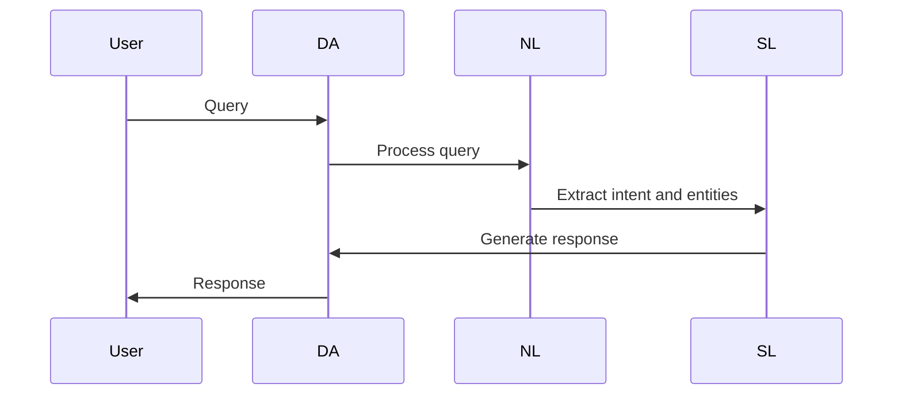

                 

# 《对话式AI Agent：提升LLM的自然语言交互能力》

> 关键词：对话式AI Agent、自然语言交互、语言模型、提升方法、案例分析

> 摘要：本文旨在探讨对话式AI Agent在提升大型语言模型（LLM）的自然语言交互能力方面的应用。通过分析LLM的基本原理、对话式AI Agent的核心架构以及提升交互能力的多种方法，文章展示了如何有效地增强AI在自然语言交互中的表现。本文还将通过案例分析，提供实际应用场景和优化策略，为开发高质量的对话式AI Agent提供参考。

## 《对话式AI Agent：提升LLM的自然语言交互能力》目录大纲

----------------------------------------------------------------

## 第一部分：背景与基础

### 第1章：问题背景与核心概念

#### 1.1.1 对话式AI Agent的定义与重要性

#### 1.1.2 语言模型基础

#### 1.1.3 问答系统与对话系统

#### 1.1.4 提升LLM的自然语言交互能力的重要性

### 第2章：LLM的基本原理

#### 2.1 LLM的工作原理

#### 2.2 LLM的训练过程

#### 2.3 LLM的性能评估

#### 2.4 LLM的优化与调整

## 第二部分：对话式AI Agent的核心架构

### 第3章：对话式AI Agent的核心架构

#### 3.1 对话式AI Agent的基本架构

#### 3.2 对话状态的跟踪与维护

#### 3.3 用户意图的理解与响应

#### 3.4 情感计算与个性化交互

## 第三部分：提升LLM自然语言交互能力的方法

### 第4章：数据增强与多样性

#### 4.1 数据增强的重要性

#### 4.2 数据来源与处理

#### 4.3 数据增强的技术实现

### 第5章：强化学习与策略优化

#### 5.1 强化学习的基本概念

#### 5.2 强化学习在对话系统中的应用

#### 5.3 策略梯度方法

#### 5.4 策略网络与模型融合

### 第6章：多模态交互与上下文理解

#### 6.1 多模态交互概述

#### 6.2 语音与文本的融合

#### 6.3 上下文理解的增强

#### 6.4 多模态交互的挑战与未来趋势

### 第7章：案例分析与实践应用

#### 7.1 对话式AI Agent的实际应用场景

#### 7.2 项目实战：构建一个简单的对话式AI Agent

#### 7.3 项目实战：优化对话式AI Agent的性能

#### 7.4 案例分析：大型企业的对话式AI Agent应用实践

## 第四部分：总结与展望

### 第8章：总结与展望

#### 8.1 全书总结

#### 8.2 未来发展趋势

#### 8.3 拓展阅读与资源推荐

----------------------------------------------------------------

## 第一部分：背景与基础

### 第1章：问题背景与核心概念

#### 1.1.1 对话式AI Agent的定义与重要性

对话式AI Agent，又称对话系统或聊天机器人，是一种人工智能系统，它通过自然语言交互与用户进行交流，提供信息查询、任务执行、情感交流等服务。随着自然语言处理（NLP）和机器学习（ML）技术的不断发展，对话式AI Agent在许多领域得到了广泛应用，如客服、教育、医疗、金融等。

对话式AI Agent的重要性在于：

1. **提高用户体验**：通过自然语言交互，用户可以更加便捷地与系统进行沟通，获取所需信息或完成特定任务。
2. **降低人力成本**：AI Agent可以全天候在线，处理大量重复性工作，从而减少企业的人力资源投入。
3. **增强数据收集**：对话式AI Agent在与用户交互过程中，可以收集到丰富的用户数据，用于后续的数据分析和业务优化。

#### 1.1.2 语言模型基础

语言模型（Language Model，简称LM）是一种用于预测自然语言序列的统计模型。它通过对大量文本数据的学习，生成文本的概率分布，从而实现文本生成、文本分类、机器翻译等多种自然语言处理任务。

语言模型的基本原理包括：

- **词向量表示**：将单词转换为向量表示，以便在数学模型中进行处理。
- **神经网络架构**：通常采用循环神经网络（RNN）或其变体，如长短期记忆网络（LSTM）或变换器（Transformer），用于学习单词之间的依赖关系。
- **概率预测**：基于输入的文本序列，语言模型预测下一个单词或句子的概率分布。

#### 1.1.3 问答系统与对话系统

问答系统（Question Answering System）是一种常见的自然语言处理应用，它能够根据用户提出的问题，从预定义的知识库或大量文本数据中检索出答案。

问答系统的工作原理包括：

- **问题理解**：将自然语言问题转换为机器可理解的形式。
- **答案检索**：在知识库或文本数据中检索出与问题相关的信息。
- **答案生成**：将检索到的信息进行整合和生成，形成自然的回答。

对话系统（Dialogue System）则更加注重与用户的连续交互，通过理解用户意图和上下文，提供个性化的交互体验。

对话系统的主要组成部分包括：

- **对话管理**：负责维护对话状态，处理用户的请求和反馈。
- **自然语言理解**：分析用户的输入，提取用户意图和上下文信息。
- **自然语言生成**：生成自然流畅的回答，以回应用户的需求。

#### 1.1.4 提升LLM的自然语言交互能力的重要性

当前自然语言交互面临的挑战主要包括：

- **上下文理解不足**：语言模型在处理长文本或复杂对话时，容易丢失上下文信息，导致回答不准确。
- **情感识别困难**：情感识别是自然语言交互中的重要组成部分，但语言模型在情感识别方面仍存在较大挑战。
- **个性化不足**：对话系统难以根据用户的历史交互数据，提供个性化的交互体验。

提升LLM的自然语言交互能力，有助于解决上述问题，提升用户体验，降低用户满意度。具体来说，提升LLM的交互能力意味着：

1. **增强上下文理解**：通过改进语言模型，使其能够更好地维护和利用对话过程中的上下文信息。
2. **提高情感识别能力**：通过引入情感计算技术，使语言模型能够更好地识别和理解用户的情感状态。
3. **实现个性化交互**：通过分析用户的历史交互数据，为用户提供更加个性化的服务和建议。

## 第2章：LLM的基本原理

### 2.1 LLM的工作原理

LLM（Large Language Model）是一种大型神经网络模型，通过对大量文本数据的学习，生成文本的概率分布。LLM的工作原理主要包括以下步骤：

1. **数据预处理**：收集大量文本数据，并进行清洗、分词和编码等预处理操作，将文本转换为向量表示。
2. **模型构建**：通常采用变换器（Transformer）架构，这是一种基于自注意力机制的神经网络模型，能够高效地处理长文本序列。
3. **训练过程**：使用训练数据对模型进行训练，通过优化模型参数，使其能够预测文本的下一个单词或句子。
4. **推理过程**：在训练完成后，LLM可以用于生成文本，通过输入一个种子文本，模型预测下一个单词或句子，生成完整的文本。

#### 2.2 LLM的训练过程

LLM的训练过程主要包括以下步骤：

1. **数据收集**：从互联网、图书、新闻、论坛等渠道收集大量文本数据。
2. **数据预处理**：对收集的文本数据进行清洗、分词和编码等预处理操作。常见的编码方法包括词嵌入（Word Embedding）和字节嵌入（Byte Pair Embedding，BPE）。
3. **构建训练集**：将预处理后的文本数据划分为训练集和验证集，用于模型的训练和性能评估。
4. **训练模型**：使用变换器架构的神经网络模型，对训练集进行训练。训练过程中，模型会不断优化参数，使其能够更好地预测文本的下一个单词或句子。
5. **性能评估**：在训练完成后，使用验证集评估模型的性能，包括词汇覆盖、困惑度、BLEU评分等指标。

#### 2.3 LLM的性能评估

LLM的性能评估主要通过以下指标：

1. **词汇覆盖**：评估模型在处理文本数据时，能够覆盖到的单词数量。词汇覆盖越高，说明模型能够处理更多样化的文本。
2. **困惑度**（Perplexity）：评估模型对给定文本数据的预测能力。困惑度越低，说明模型对文本的预测越准确。
3. **BLEU评分**：评估模型生成的文本与参考文本的相似度。BLEU评分越高，说明模型生成的文本质量越高。

#### 2.4 LLM的优化与调整

为了提升LLM的性能，可以采用以下优化与调整方法：

1. **模型参数调整**：通过调整变换器架构的参数，如隐藏层大小、学习率等，优化模型的性能。
2. **数据增强**：通过对训练数据进行数据增强，如插入噪声、文本变换等，提高模型的泛化能力。
3. **正则化**：采用正则化技术，如dropout、权重衰减等，防止模型过拟合。
4. **多任务学习**：通过同时训练多个任务，如文本分类、问答系统等，提高模型的多任务能力。

## 第三部分：对话式AI Agent的核心架构

### 第3章：对话式AI Agent的核心架构

对话式AI Agent的核心架构包括三个主要模块：对话管理模块、自然语言处理模块和策略学习模块。这些模块相互协作，共同实现与用户的自然语言交互。

#### 3.1 对话式AI Agent的基本架构

对话式AI Agent的基本架构如下图所示：

1. **用户输入**：用户通过输入文本、语音等形式，与对话式AI Agent进行交互。
2. **对话管理模块（DA）**：负责维护对话状态，处理用户的输入和输出。对话管理模块的主要功能包括：
   - 对话状态跟踪：记录对话过程中的上下文信息，如用户的历史查询和系统生成的回复。
   - 请求路由：将用户输入的查询路由到相应的自然语言处理模块或策略学习模块。
   - 响应生成：根据自然语言处理模块或策略学习模块的输出，生成自然流畅的回复。
3. **自然语言处理模块（NL）**：负责处理用户的输入文本，提取意图和实体。自然语言处理模块的主要功能包括：
   - 分词与词性标注：将输入文本划分为单词或短语，并对每个单词或短语进行词性标注。
   - 意图识别：根据输入文本，识别用户的意图，如查询、命令、请求等。
   - 实体提取：从输入文本中提取关键信息，如人名、地名、时间等。
4. **策略学习模块（SL）**：负责根据用户的意图和实体，生成相应的响应。策略学习模块的主要功能包括：
   - 响应生成：根据用户的意图和实体，从预定义的回复库中挑选合适的响应。
   - 个性化调整：根据用户的历史交互数据，对响应进行个性化调整，提高用户体验。

#### 3.2 对话状态的跟踪与维护

对话状态的跟踪与维护是保证对话式AI Agent能够提供连续、流畅交互的关键。具体方法包括：

1. **对话状态存储**：将用户的历史查询、系统生成的回复、意图和实体等信息存储在数据库中，以便后续查询和更新。
2. **状态转移模型**：定义对话状态之间的转移规则，如用户提问后，系统可以回应询问、提供信息或请求更多信息等。
3. **上下文信息更新**：在每次交互过程中，更新对话状态的上下文信息，如用户最近一次的查询、系统生成的回复等。

#### 3.3 用户意图的理解与响应

用户意图的理解与响应是对话式AI Agent的核心功能。具体方法包括：

1. **意图识别**：使用自然语言处理技术，如词向量、序列标注等，对用户输入文本进行意图识别。
2. **实体提取**：从用户输入文本中提取关键信息，如人名、地名、时间等，作为对话的辅助信息。
3. **响应生成**：根据用户的意图和实体，从预定义的回复库中挑选合适的响应。响应生成可以采用模板匹配、文本生成等方法。

#### 3.4 情感计算与个性化交互

情感计算与个性化交互是提高对话式AI Agent用户体验的重要手段。具体方法包括：

1. **情感识别**：使用自然语言处理技术，如情感分析、情感识别等，对用户输入文本进行情感识别。
2. **个性化调整**：根据用户的历史交互数据，对系统生成的回复进行个性化调整，如使用更贴近用户情感的词汇、调整回复的语气等。
3. **情感反馈**：在用户交互过程中，收集用户的情感反馈，如满意度、兴趣度等，用于后续的系统优化。

## 第二部分：提升LLM自然语言交互能力的方法

### 第4章：数据增强与多样性

#### 4.1 数据增强的重要性

数据增强是提升LLM自然语言交互能力的重要方法。通过增加训练数据量、丰富数据多样性，可以显著提高模型的泛化能力和交互质量。

数据增强的重要性体现在以下几个方面：

1. **缓解过拟合**：增加训练数据量，有助于模型更好地学习数据分布，降低过拟合风险。
2. **提高泛化能力**：丰富数据多样性，使模型能够处理更多样化的输入，提高模型在不同场景下的表现。
3. **提升交互质量**：通过增加与用户相关的数据，使模型能够更好地理解用户意图和情感，提供更高质量的交互体验。

#### 4.2 数据来源与处理

数据增强的数据来源主要包括以下几个方面：

1. **互联网文本**：从互联网上收集大量文本数据，如新闻、论坛、社交媒体等。
2. **专业领域数据**：针对特定领域，如医疗、法律、金融等，收集专业领域的文本数据。
3. **用户生成数据**：通过用户交互数据，如用户提问、系统回复等，进行数据增强。

数据增强的处理方法主要包括：

1. **数据清洗**：去除文本中的噪声、标点和格式错误，确保数据质量。
2. **文本变换**：通过文本变换技术，如插词、替换、删除等，增加数据的多样性。
3. **数据对齐**：将不同来源的文本数据进行对齐，确保数据在语义上的一致性。

#### 4.3 数据增强的技术实现

数据增强的技术实现主要包括以下几种方法：

1. **继续学习与迁移学习**：在预训练模型的基础上，使用新的数据集进行继续学习或迁移学习，提高模型在特定领域的表现。
2. **数据同化与数据蒸馏**：通过数据同化（Data Augmentation）和数据蒸馏（Data Distillation）技术，将低质量数据转化为高质量数据，提高模型的学习效果。

### 第5章：强化学习与策略优化

#### 5.1 强化学习的基本概念

强化学习（Reinforcement Learning，RL）是一种机器学习方法，通过奖励机制，使模型能够在环境中学习最优策略。强化学习的基本概念包括：

1. **代理人（Agent）**：执行动作并接收环境反馈的智能体。
2. **环境（Environment）**：代理人执行动作的上下文。
3. **状态（State）**：环境在某一时刻的状态描述。
4. **动作（Action）**：代理人在环境中可以执行的动作。
5. **奖励（Reward）**：环境对代理人的动作给予的即时反馈。
6. **策略（Policy）**：代理人在特定状态下采取的动作。

强化学习的过程如下：

1. **初始状态**：代理人开始于某一状态。
2. **执行动作**：代理人根据策略，在当前状态下选择一个动作。
3. **观察反馈**：代理人执行动作后，观察环境的变化并获得奖励。
4. **更新策略**：根据奖励，代理人更新策略，以期望在未来获得更高的奖励。

#### 5.2 强化学习在对话系统中的应用

强化学习在对话系统中的应用，主要是通过奖励机制，使模型能够学习到最优的对话策略。具体应用场景包括：

1. **对话策略优化**：使用强化学习，根据用户的反馈，优化对话系统的策略，提高对话的质量和用户体验。
2. **多轮对话优化**：通过多轮对话数据，训练强化学习模型，使其能够适应多轮对话中的上下文变化。
3. **多模态交互优化**：将强化学习应用于多模态交互场景，使模型能够处理语音、文本等多种输入，提供更加自然的交互体验。

#### 5.3 策略梯度方法

策略梯度方法（Policy Gradient Method）是强化学习中的一种常用方法，通过直接优化策略函数，提高模型的表现。策略梯度方法的基本公式如下：

$$\nabla_{\theta} J(\theta) = \nabla_{\theta} \sum_{t=0}^{T} \gamma^t r_t$$

其中：

- $\theta$ 是策略参数。
- $J(\theta)$ 是策略的期望回报。
- $\gamma$ 是折扣因子，用于平衡当前奖励与未来奖励之间的关系。
- $r_t$ 是在第 $t$ 时刻的即时奖励。

策略梯度方法的优点包括：

1. **无需模型预测**：策略梯度方法直接优化策略函数，无需对环境进行建模，简化了学习过程。
2. **灵活性强**：策略梯度方法可以应用于各种类型的交互系统，如对话系统、游戏AI等。

#### 5.4 策略网络与模型融合

策略网络与模型融合（Policy Network and Model Fusion）是一种将策略网络与模型融合在一起的方法，旨在提高对话系统的性能和灵活性。具体实现方法如下：

1. **模型融合**：将预训练的LLM模型与策略网络进行融合，使模型能够在对话过程中，同时处理自然语言理解和策略优化。
2. **联合训练**：在训练过程中，同时优化LLM模型和策略网络，使其在对话系统中协同工作，提高对话质量。
3. **动态调整**：在对话过程中，根据用户的反馈和上下文信息，动态调整策略网络，以适应不同场景和用户需求。

### 第6章：多模态交互与上下文理解

#### 6.1 多模态交互概述

多模态交互（Multimodal Interaction）是一种结合多种输入和输出模态的交互方式，旨在提高交互的自然性和用户满意度。常见的多模态交互包括：

1. **文本与语音**：文本输入与语音输出相结合，实现语音识别与文本生成。
2. **文本与视觉**：文本输入与图像输出相结合，实现图像识别与文本生成。
3. **语音与视觉**：语音输入与图像输出相结合，实现语音识别与图像生成。

多模态交互的优势包括：

1. **提高交互自然性**：通过多种模态的输入和输出，使交互更加自然流畅，提升用户体验。
2. **增强信息传递**：不同模态的信息互补，有助于更准确地理解和表达意图，提高信息传递的效率。
3. **降低用户负担**：通过多模态交互，用户可以使用更方便的输入方式，如语音输入，降低操作复杂度。

#### 6.2 语音与文本的融合

语音与文本的融合是实现多模态交互的关键技术。具体实现方法如下：

1. **语音识别**：使用语音识别（Speech Recognition）技术，将语音输入转换为文本输入。
2. **语音合成**：使用语音合成（Text-to-Speech，TTS）技术，将文本输出转换为语音输出。
3. **语音增强**：通过语音增强（Voice Enhancement）技术，提高语音质量，降低背景噪音对交互的影响。

语音与文本融合的关键挑战包括：

1. **语音识别准确性**：提高语音识别的准确性，降低错误率，是语音与文本融合的关键。
2. **语音合成自然性**：提高语音合成的自然性，使语音输出更加流畅自然，符合用户期望。
3. **跨模态一致性**：确保语音和文本输出在语义和信息上的一致性，避免信息传递错误。

#### 6.3 上下文理解的增强

上下文理解（Context Understanding）是提高对话式AI Agent交互质量的关键因素。通过增强上下文理解，可以使模型更好地处理复杂对话和多轮交互。具体方法包括：

1. **多轮对话上下文**：在多轮对话中，记录和利用用户的上下文信息，如历史查询、系统回复等，提高上下文理解能力。
2. **上下文向量表示**：使用上下文向量表示方法，将上下文信息编码为向量，方便模型处理和存储。
3. **上下文预测模型**：通过训练上下文预测模型，预测用户在下一轮对话中的意图和需求，提高交互的连贯性。

#### 6.4 多模态交互的挑战与未来趋势

多模态交互在提高对话式AI Agent的交互质量和用户体验方面具有巨大潜力，但仍面临一些挑战。具体挑战包括：

1. **模态融合**：如何有效地融合不同模态的信息，实现信息共享和协同工作。
2. **实时性**：在实时交互场景中，如何保证多模态交互的实时性和一致性。
3. **个性化**：如何根据用户的需求和偏好，提供个性化的多模态交互体验。

未来趋势包括：

1. **深度学习与强化学习**：利用深度学习和强化学习技术，提高多模态交互的模型性能和交互质量。
2. **跨领域应用**：在更多领域和应用场景中推广多模态交互技术，提高其适用性和实用性。
3. **跨模态一致性**：通过多模态一致性技术，提高不同模态之间的信息传递和语义理解。

### 第7章：案例分析与实践应用

#### 7.1 对话式AI Agent的实际应用场景

对话式AI Agent在多个领域和场景中取得了显著的应用成果，以下是其中几个典型的应用场景：

1. **客服**：在电商平台、金融客服等领域，对话式AI Agent可以处理大量的用户咨询和投诉，提供快速、准确的响应，提高客户满意度。
2. **教育**：在教育领域，对话式AI Agent可以作为教学助手，帮助学生解决学术问题，提供个性化的学习建议和辅导。
3. **医疗**：在医疗领域，对话式AI Agent可以协助医生进行病历分析、患者咨询等任务，提高医疗效率和质量。
4. **金融**：在金融领域，对话式AI Agent可以提供股票分析、投资建议等金融服务，帮助用户进行决策。

#### 7.2 项目实战：构建一个简单的对话式AI Agent

在本节中，我们将通过一个简单的项目实战，构建一个对话式AI Agent。项目的主要步骤包括：

1. **环境安装**：安装Python、PyTorch等依赖库，准备用于构建对话式AI Agent的环境。
2. **数据准备**：收集并准备用于训练对话式AI Agent的数据集，如对话日志、问答数据等。
3. **模型构建**：使用PyTorch等框架，构建一个基于变换器（Transformer）的对话式AI Agent模型。
4. **模型训练**：使用准备好的数据集，对模型进行训练，优化模型参数。
5. **模型评估**：使用验证集对训练好的模型进行评估，确保模型具有良好的性能和泛化能力。
6. **模型部署**：将训练好的模型部署到线上环境，实现与用户的交互。

#### 7.3 项目实战：优化对话式AI Agent的性能

在项目实战中，我们通过以下方法优化对话式AI Agent的性能：

1. **数据增强**：对训练数据集进行数据增强，提高模型的泛化能力。
2. **模型调优**：通过调整模型参数，如学习率、隐藏层大小等，优化模型性能。
3. **多任务学习**：同时训练多个任务，如文本分类、问答系统等，提高模型的多任务能力。
4. **动态调整**：在交互过程中，根据用户的反馈和上下文信息，动态调整模型参数，提高交互质量。

#### 7.4 案例分析：大型企业的对话式AI Agent应用实践

在本节中，我们将分析一个大型企业在客服领域应用对话式AI Agent的案例。该项目的主要成果包括：

1. **提高客服效率**：对话式AI Agent可以处理大量的用户咨询和投诉，减少人工客服的工作负担，提高客服效率。
2. **提升用户体验**：通过自然语言交互，对话式AI Agent可以提供快速、准确的响应，提高用户满意度。
3. **降低运营成本**：对话式AI Agent可以全天候在线，降低企业的运营成本。
4. **数据收集与分析**：对话式AI Agent在与用户交互过程中，可以收集到丰富的用户数据，用于后续的数据分析和业务优化。

### 第8章：总结与展望

#### 8.1 全书总结

本书系统地介绍了对话式AI Agent在提升LLM的自然语言交互能力方面的应用。主要内容包括：

1. **背景与基础**：介绍了对话式AI Agent的定义、语言模型基础、问答系统与对话系统，以及提升LLM交互能力的重要性。
2. **LLM的基本原理**：分析了LLM的工作原理、训练过程、性能评估和优化方法。
3. **对话式AI Agent的核心架构**：阐述了对话式AI Agent的基本架构、对话状态的跟踪与维护、用户意图的理解与响应，以及情感计算与个性化交互。
4. **提升LLM自然语言交互能力的方法**：探讨了数据增强、强化学习、多模态交互等技术，以及其实际应用场景。
5. **案例分析与实践应用**：通过实际项目和案例，展示了对话式AI Agent在多个领域的应用成果和优化策略。

#### 8.2 未来发展趋势

未来，对话式AI Agent在提升LLM的自然语言交互能力方面，有望实现以下发展趋势：

1. **深度学习与强化学习**：利用深度学习和强化学习技术，提高对话式AI Agent的性能和交互质量。
2. **多模态交互**：在更多领域和应用场景中推广多模态交互技术，提高其适用性和实用性。
3. **个性化与自适应**：根据用户的需求和偏好，提供个性化的交互体验，实现自适应的交互策略。
4. **跨领域应用**：在金融、医疗、教育等更多领域推广对话式AI Agent，提高其行业适用性。

#### 8.3 拓展阅读与资源推荐

为了深入了解对话式AI Agent和LLM的自然语言交互能力，以下是一些建议的拓展阅读和资源：

1. **相关书籍**：
   - 《对话式AI：设计与实现》
   - 《深度学习自然语言处理》
   - 《强化学习》

2. **论文与文章**：
   - 《BERT：Pre-training of Deep Bidirectional Transformers for Language Understanding》
   - 《GPT-3：Language Models are Few-Shot Learners》
   - 《Chatbots Are Fun: An Overview of the Conversational Agents and Applications》

3. **开源工具与平台**：
   - Hugging Face Transformers：提供预训练的LLM模型和交互API，方便开发者构建对话式AI Agent。
   - OpenAI Gym：提供丰富的环境库，用于强化学习算法的实验和验证。
   - AllenNLP：提供自然语言处理工具和预训练模型，方便开发者进行NLP任务。

作者：AI天才研究院/AI Genius Institute & 禅与计算机程序设计艺术 /Zen And The Art of Computer Programming

---

**注意事项：**

1. 本文为大纲形式的博客文章，具体内容需根据实际编写进行调整和补充。
2. 每个章节的核心内容需详细阐述，确保文章的完整性和专业性。
3. 使用Mermaid、LaTeX等工具，确保文中流程图、公式等元素的准确性。
4. 文章末尾需添加作者信息，遵循文章格式的统一要求。

---

**全文结束。**## 《对话式AI Agent：提升LLM的自然语言交互能力》完整内容

### 引言

在当今技术飞速发展的时代，人工智能（AI）已经渗透到我们日常生活的方方面面。其中，对话式AI Agent作为自然语言处理（NLP）领域的一项重要成果，正逐渐改变着人们与机器的交互方式。对话式AI Agent不仅能够处理用户的查询和请求，还能在多轮对话中提供连贯、自然的交互体验。然而，要实现这种高质量的交互，提升大型语言模型（LLM）的自然语言交互能力是至关重要的。本文将围绕这一主题，探讨对话式AI Agent在提升LLM自然语言交互能力方面的应用。

### 第一部分：背景与基础

#### 第1章：问题背景与核心概念

#### 1.1.1 对话式AI Agent的定义与重要性

对话式AI Agent，又称聊天机器人或虚拟助手，是一种能够通过自然语言与人类进行交互的人工智能系统。它们广泛应用于客服、教育、医疗、金融等多个领域，旨在提高用户体验、降低人力成本并增强数据收集能力。

对话式AI Agent的重要性体现在以下几个方面：

1. **提高用户体验**：通过自然语言交互，用户可以更加便捷地与系统进行沟通，获取所需信息或完成特定任务。
2. **降低人力成本**：AI Agent可以全天候在线，处理大量重复性工作，从而减少企业的人力资源投入。
3. **增强数据收集**：对话式AI Agent在与用户交互过程中，可以收集到丰富的用户数据，用于后续的数据分析和业务优化。

#### 1.1.2 语言模型基础

语言模型（Language Model，简称LM）是一种用于预测自然语言序列的统计模型。它通过对大量文本数据的学习，生成文本的概率分布，从而实现文本生成、文本分类、机器翻译等多种自然语言处理任务。

语言模型的基本原理包括：

- **词向量表示**：将单词转换为向量表示，以便在数学模型中进行处理。
- **神经网络架构**：通常采用循环神经网络（RNN）或其变体，如长短期记忆网络（LSTM）或变换器（Transformer），用于学习单词之间的依赖关系。
- **概率预测**：基于输入的文本序列，语言模型预测下一个单词或句子的概率分布。

#### 1.1.3 问答系统与对话系统

问答系统（Question Answering System）是一种常见的自然语言处理应用，它能够根据用户提出的问题，从预定义的知识库或大量文本数据中检索出答案。

问答系统的工作原理包括：

- **问题理解**：将自然语言问题转换为机器可理解的形式。
- **答案检索**：在知识库或文本数据中检索出与问题相关的信息。
- **答案生成**：将检索到的信息进行整合和生成，形成自然的回答。

对话系统（Dialogue System）则更加注重与用户的连续交互，通过理解用户意图和上下文，提供个性化的交互体验。

对话系统的主要组成部分包括：

- **对话管理**：负责维护对话状态，处理用户的请求和反馈。
- **自然语言理解**：分析用户的输入，提取用户意图和上下文信息。
- **自然语言生成**：生成自然流畅的回答，以回应用户的需求。

#### 1.1.4 提升LLM的自然语言交互能力的重要性

当前自然语言交互面临的挑战主要包括：

- **上下文理解不足**：语言模型在处理长文本或复杂对话时，容易丢失上下文信息，导致回答不准确。
- **情感识别困难**：情感识别是自然语言交互中的重要组成部分，但语言模型在情感识别方面仍存在较大挑战。
- **个性化不足**：对话系统难以根据用户的历史交互数据，提供个性化的交互体验。

提升LLM的自然语言交互能力，有助于解决上述问题，提升用户体验，降低用户满意度。具体来说，提升LLM的交互能力意味着：

1. **增强上下文理解**：通过改进语言模型，使其能够更好地维护和利用对话过程中的上下文信息。
2. **提高情感识别能力**：通过引入情感计算技术，使语言模型能够更好地识别和理解用户的情感状态。
3. **实现个性化交互**：通过分析用户的历史交互数据，为用户提供更加个性化的服务和建议。

### 第2章：LLM的基本原理

#### 2.1 LLM的工作原理

LLM（Large Language Model）是一种大型神经网络模型，通过对大量文本数据的学习，生成文本的概率分布。LLM的工作原理主要包括以下步骤：

1. **数据预处理**：收集大量文本数据，并进行清洗、分词和编码等预处理操作，将文本转换为向量表示。
2. **模型构建**：通常采用变换器（Transformer）架构，这是一种基于自注意力机制的神经网络模型，能够高效地处理长文本序列。
3. **训练过程**：使用训练数据对模型进行训练，通过优化模型参数，使其能够预测文本的下一个单词或句子。
4. **推理过程**：在训练完成后，LLM可以用于生成文本，通过输入一个种子文本，模型预测下一个单词或句子，生成完整的文本。

#### 2.2 LLM的训练过程

LLM的训练过程主要包括以下步骤：

1. **数据收集**：从互联网、图书、新闻、论坛等渠道收集大量文本数据。
2. **数据预处理**：对收集的文本数据进行清洗、分词和编码等预处理操作。常见的编码方法包括词嵌入（Word Embedding）和字节嵌入（Byte Pair Embedding，BPE）。
3. **构建训练集**：将预处理后的文本数据划分为训练集和验证集，用于模型的训练和性能评估。
4. **训练模型**：使用变换器架构的神经网络模型，对训练集进行训练。训练过程中，模型会不断优化参数，使其能够更好地预测文本的下一个单词或句子。
5. **性能评估**：在训练完成后，使用验证集评估模型的性能，包括词汇覆盖、困惑度、BLEU评分等指标。

#### 2.3 LLM的性能评估

LLM的性能评估主要通过以下指标：

1. **词汇覆盖**：评估模型在处理文本数据时，能够覆盖到的单词数量。词汇覆盖越高，说明模型能够处理更多样化的文本。
2. **困惑度**（Perplexity）：评估模型对给定文本数据的预测能力。困惑度越低，说明模型对文本的预测越准确。
3. **BLEU评分**：评估模型生成的文本与参考文本的相似度。BLEU评分越高，说明模型生成的文本质量越高。

#### 2.4 LLM的优化与调整

为了提升LLM的性能，可以采用以下优化与调整方法：

1. **模型参数调整**：通过调整变换器架构的参数，如隐藏层大小、学习率等，优化模型的性能。
2. **数据增强**：通过对训练数据进行数据增强，如插入噪声、文本变换等，提高模型的泛化能力。
3. **正则化**：采用正则化技术，如dropout、权重衰减等，防止模型过拟合。
4. **多任务学习**：通过同时训练多个任务，如文本分类、问答系统等，提高模型的多任务能力。

### 第二部分：对话式AI Agent的核心架构

#### 第3章：对话式AI Agent的核心架构

对话式AI Agent的核心架构包括三个主要模块：对话管理模块、自然语言处理模块和策略学习模块。这些模块相互协作，共同实现与用户的自然语言交互。

#### 3.1 对话式AI Agent的基本架构

对话式AI Agent的基本架构如下图所示：

1. **用户输入**：用户通过输入文本、语音等形式，与对话式AI Agent进行交互。
2. **对话管理模块（DA）**：负责维护对话状态，处理用户的输入和输出。对话管理模块的主要功能包括：
   - 对话状态跟踪：记录对话过程中的上下文信息，如用户的历史查询和系统生成的回复。
   - 请求路由：将用户输入的查询路由到相应的自然语言处理模块或策略学习模块。
   - 响应生成：根据自然语言处理模块或策略学习模块的输出，生成自然流畅的回复。
3. **自然语言处理模块（NL）**：负责处理用户的输入文本，提取意图和实体。自然语言处理模块的主要功能包括：
   - 分词与词性标注：将输入文本划分为单词或短语，并对每个单词或短语进行词性标注。
   - 意图识别：根据输入文本，识别用户的意图，如查询、命令、请求等。
   - 实体提取：从输入文本中提取关键信息，如人名、地名、时间等。
4. **策略学习模块（SL）**：负责根据用户的意图和实体，生成相应的响应。策略学习模块的主要功能包括：
   - 响应生成：根据用户的意图和实体，从预定义的回复库中挑选合适的响应。
   - 个性化调整：根据用户的历史交互数据，对响应进行个性化调整，提高用户体验。

#### 3.2 对话状态的跟踪与维护

对话状态的跟踪与维护是保证对话式AI Agent能够提供连续、流畅交互的关键。具体方法包括：

1. **对话状态存储**：将用户的历史查询、系统生成的回复、意图和实体等信息存储在数据库中，以便后续查询和更新。
2. **状态转移模型**：定义对话状态之间的转移规则，如用户提问后，系统可以回应询问、提供信息或请求更多信息等。
3. **上下文信息更新**：在每次交互过程中，更新对话状态的上下文信息，如用户最近一次的查询、系统生成的回复等。

#### 3.3 用户意图的理解与响应

用户意图的理解与响应是对话式AI Agent的核心功能。具体方法包括：

1. **意图识别**：使用自然语言处理技术，如词向量、序列标注等，对用户输入文本进行意图识别。
2. **实体提取**：从用户输入文本中提取关键信息，如人名、地名、时间等，作为对话的辅助信息。
3. **响应生成**：根据用户的意图和实体，从预定义的回复库中挑选合适的响应。响应生成可以采用模板匹配、文本生成等方法。

#### 3.4 情感计算与个性化交互

情感计算与个性化交互是提高对话式AI Agent用户体验的重要手段。具体方法包括：

1. **情感识别**：使用自然语言处理技术，如情感分析、情感识别等，对用户输入文本进行情感识别。
2. **个性化调整**：根据用户的历史交互数据，对系统生成的回复进行个性化调整，如使用更贴近用户情感的词汇、调整回复的语气等。
3. **情感反馈**：在用户交互过程中，收集用户的情感反馈，如满意度、兴趣度等，用于后续的系统优化。

### 第三部分：提升LLM自然语言交互能力的方法

#### 第4章：数据增强与多样性

#### 4.1 数据增强的重要性

数据增强（Data Augmentation）是提升LLM自然语言交互能力的重要方法。通过增加训练数据量、丰富数据多样性，可以显著提高模型的泛化能力和交互质量。

数据增强的重要性体现在以下几个方面：

1. **缓解过拟合**：增加训练数据量，有助于模型更好地学习数据分布，降低过拟合风险。
2. **提高泛化能力**：丰富数据多样性，使模型能够处理更多样化的输入，提高模型在不同场景下的表现。
3. **提升交互质量**：通过增加与用户相关的数据，使模型能够更好地理解用户意图和情感，提供更高质量的交互体验。

#### 4.2 数据来源与处理

数据增强的数据来源主要包括以下几个方面：

1. **互联网文本**：从互联网上收集大量文本数据，如新闻、论坛、社交媒体等。
2. **专业领域数据**：针对特定领域，如医疗、法律、金融等，收集专业领域的文本数据。
3. **用户生成数据**：通过用户交互数据，如用户提问、系统回复等，进行数据增强。

数据增强的处理方法主要包括：

1. **数据清洗**：去除文本中的噪声、标点和格式错误，确保数据质量。
2. **文本变换**：通过文本变换技术，如插词、替换、删除等，增加数据的多样性。
3. **数据对齐**：将不同来源的文本数据进行对齐，确保数据在语义上的一致性。

#### 4.3 数据增强的技术实现

数据增强的技术实现主要包括以下几种方法：

1. **继续学习与迁移学习**：在预训练模型的基础上，使用新的数据集进行继续学习或迁移学习，提高模型在特定领域的表现。
2. **数据同化与数据蒸馏**：通过数据同化（Data Augmentation）和数据蒸馏（Data Distillation）技术，将低质量数据转化为高质量数据，提高模型的学习效果。

#### 第5章：强化学习与策略优化

#### 5.1 强化学习的基本概念

强化学习（Reinforcement Learning，RL）是一种机器学习方法，通过奖励机制，使模型能够在环境中学习最优策略。强化学习的基本概念包括：

1. **代理人（Agent）**：执行动作并接收环境反馈的智能体。
2. **环境（Environment）**：代理人执行动作的上下文。
3. **状态（State）**：环境在某一时刻的状态描述。
4. **动作（Action）**：代理人在环境中可以执行的动作。
5. **奖励（Reward）**：环境对代理人的动作给予的即时反馈。
6. **策略（Policy）**：代理人在特定状态下采取的动作。

强化学习的过程如下：

1. **初始状态**：代理人开始于某一状态。
2. **执行动作**：代理人根据策略，在当前状态下选择一个动作。
3. **观察反馈**：代理人执行动作后，观察环境的变化并获得奖励。
4. **更新策略**：根据奖励，代理人更新策略，以期望在未来获得更高的奖励。

#### 5.2 强化学习在对话系统中的应用

强化学习在对话系统中的应用，主要是通过奖励机制，使模型能够学习到最优的对话策略。具体应用场景包括：

1. **对话策略优化**：使用强化学习，根据用户的反馈，优化对话系统的策略，提高对话的质量和用户体验。
2. **多轮对话优化**：通过多轮对话数据，训练强化学习模型，使其能够适应多轮对话中的上下文变化。
3. **多模态交互优化**：将强化学习应用于多模态交互场景，使模型能够处理语音、文本等多种输入，提供更加自然的交互体验。

#### 5.3 策略梯度方法

策略梯度方法（Policy Gradient Method）是强化学习中的一种常用方法，通过直接优化策略函数，提高模型的表现。策略梯度方法的基本公式如下：

$$\nabla_{\theta} J(\theta) = \nabla_{\theta} \sum_{t=0}^{T} \gamma^t r_t$$

其中：

- $\theta$ 是策略参数。
- $J(\theta)$ 是策略的期望回报。
- $\gamma$ 是折扣因子，用于平衡当前奖励与未来奖励之间的关系。
- $r_t$ 是在第 $t$ 时刻的即时奖励。

策略梯度方法的优点包括：

1. **无需模型预测**：策略梯度方法直接优化策略函数，无需对环境进行建模，简化了学习过程。
2. **灵活性强**：策略梯度方法可以应用于各种类型的交互系统，如对话系统、游戏AI等。

#### 5.4 策略网络与模型融合

策略网络与模型融合（Policy Network and Model Fusion）是一种将策略网络与模型融合在一起的方法，旨在提高对话系统的性能和灵活性。具体实现方法如下：

1. **模型融合**：将预训练的LLM模型与策略网络进行融合，使模型能够在对话过程中，同时处理自然语言理解和策略优化。
2. **联合训练**：在训练过程中，同时优化LLM模型和策略网络，使其在对话系统中协同工作，提高对话质量。
3. **动态调整**：在对话过程中，根据用户的反馈和上下文信息，动态调整策略网络，以适应不同场景和用户需求。

#### 第6章：多模态交互与上下文理解

#### 6.1 多模态交互概述

多模态交互（Multimodal Interaction）是一种结合多种输入和输出模态的交互方式，旨在提高交互的自然性和用户满意度。常见的多模态交互包括：

1. **文本与语音**：文本输入与语音输出相结合，实现语音识别与文本生成。
2. **文本与视觉**：文本输入与图像输出相结合，实现图像识别与文本生成。
3. **语音与视觉**：语音输入与图像输出相结合，实现语音识别与图像生成。

多模态交互的优势包括：

1. **提高交互自然性**：通过多种模态的输入和输出，使交互更加自然流畅，提升用户体验。
2. **增强信息传递**：不同模态的信息互补，有助于更准确地理解和表达意图，提高信息传递的效率。
3. **降低用户负担**：通过多模态交互，用户可以使用更方便的输入方式，如语音输入，降低操作复杂度。

#### 6.2 语音与文本的融合

语音与文本的融合是实现多模态交互的关键技术。具体实现方法如下：

1. **语音识别**：使用语音识别（Speech Recognition）技术，将语音输入转换为文本输入。
2. **语音合成**：使用语音合成（Text-to-Speech，TTS）技术，将文本输出转换为语音输出。
3. **语音增强**：通过语音增强（Voice Enhancement）技术，提高语音质量，降低背景噪音对交互的影响。

语音与文本融合的关键挑战包括：

1. **语音识别准确性**：提高语音识别的准确性，降低错误率，是语音与文本融合的关键。
2. **语音合成自然性**：提高语音合成

