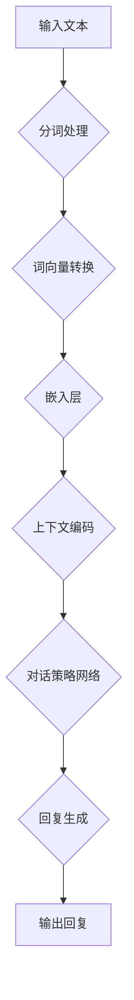
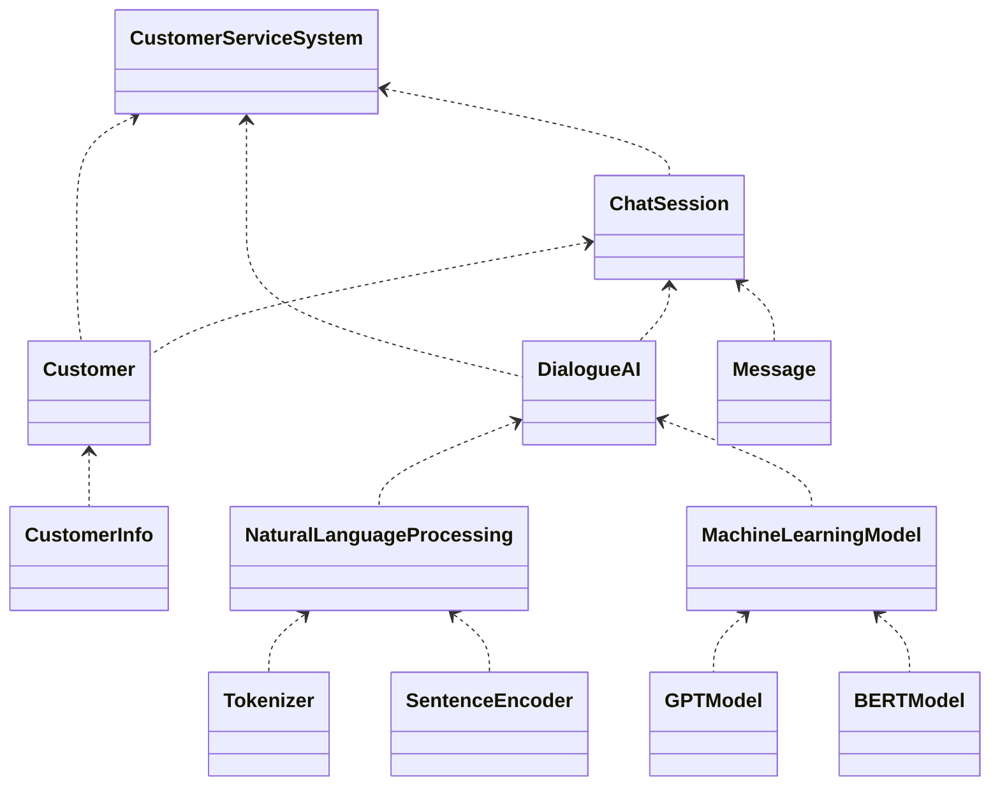
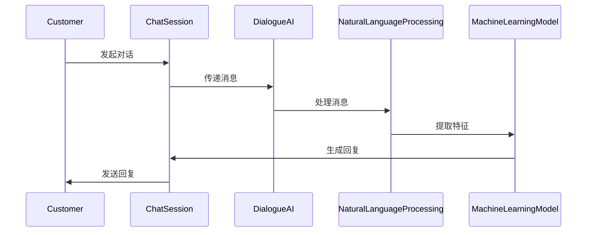
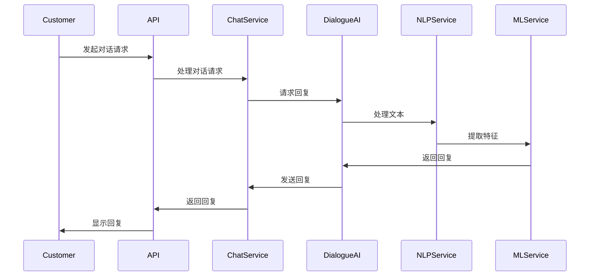

                 

### 文章标题

《对话式AI在客户服务中的应用与优化》

### 关键词

- 对话式AI
- 客户服务
- 自然语言处理
- 机器学习
- 深度学习

### 摘要

本文旨在探讨对话式人工智能（AI）在客户服务领域的应用与优化。首先，我们分析了客户服务中面临的主要挑战和问题，然后详细介绍了对话式AI的基本概念和原理。接下来，我们通过对比自然语言处理（NLP）、机器学习（ML）和深度学习（DL）的核心概念，深入探讨了这些技术在对话式AI中的应用。随后，我们使用Mermaid流程图和Python代码示例，详细阐述了GPT和BERT等对话式AI算法的原理及其实现方法。最后，文章提供了系统架构设计、项目实战和最佳实践，为读者提供了一套完整的应用与优化方案。

## 《对话式AI在客户服务中的应用与优化》目录大纲

### 第一部分：背景介绍与核心概念

#### 第1章 问题背景、问题描述与解决

##### 1.1 问题背景

- 客户服务的重要性和挑战
- 对话式AI的发展背景

##### 1.2 问题描述

- 传统客户服务方式的不足
- 对话式AI在客户服务中的潜在应用

##### 1.3 问题解决

- 对话式AI的定义与特点
- 对话式AI在客户服务中的优势

##### 1.4 边界与外延

- 对话式AI的适用范围
- 与其他技术的区别

##### 1.5 概念结构与核心要素组成

- 对话式AI的关键技术
- 客户服务中的对话流程

### 第二部分：核心概念与联系

#### 第2章 对话式AI的核心概念原理

##### 2.1 概念原理

- 自然语言处理（NLP）
- 机器学习（ML）
- 深度学习（DL）

##### 2.2 概念属性特征对比表格

| 特性               | 自然语言处理（NLP） | 机器学习（ML） | 深度学习（DL） |
|--------------------|----------------------|----------------|----------------|
| 目的               | 使计算机能够理解语言 | 从数据中学习规律 | 用神经网络模拟人脑 |
| 技术范畴           | 语音识别、语义理解   | 分类、回归     | 卷积网络、循环网络 |

##### 2.3 ER实体关系图架构的Mermaid流程图

```mermaid
erDiagram
  Customer ||--|{ DialogueAI }|| DialogueSystem
  Customer ||--|{ CustomerService }|| Service
  DialogueAI ||--|{ NLP }|| NaturalLanguageProcessing
  DialogueAI ||--|{ ML }|| MachineLearning
  DialogueAI ||--|{ DL }|| DeepLearning
```

### 第三部分：算法原理讲解

#### 第3章 对话式AI算法原理

##### 3.1 算法原理

- GPT模型
- BERT模型
- 对话策略网络

##### 3.2 算法mermaid流程图



##### 3.3 Python源代码

```python
# Python源代码示例
import tensorflow as tf
from transformers import TFGPT2LMHeadModel, GPT2Tokenizer

# 初始化模型和分词器
tokenizer = GPT2Tokenizer.from_pretrained('gpt2')
model = TFGPT2LMHeadModel.from_pretrained('gpt2')

# 输入文本
input_text = "你好，有什么可以帮助你的？"

# 分词处理
input_ids = tokenizer.encode(input_text, return_tensors='tf')

# 生成回复
outputs = model(inputs_ids)

# 输出回复
predicted_ids = tf.argmax(outputs.logits, axis=-1)
decoded_text = tokenizer.decode(predicted_ids.numpy()[0])
print(decoded_text)
```

##### 3.4 算法原理的数学模型和公式

- **GPT模型**：基于自回归语言模型，公式如下：
  $$ p(y_t|y_{t-1},...,y_1) = \frac{e^{V^T y_{t-1}}}{\sum_{y'} e^{V^T y'}} $$
- **BERT模型**：基于双向编码器，公式如下：
  $$ \text{Contextual embeddings} = \text{Word embeddings} + \text{Position embeddings} + \text{Segment embeddings} $$

### 第一部分：背景介绍与核心概念

#### 第1章 问题背景、问题描述与解决

##### 1.1 问题背景

在当今数字化时代，客户服务已经成为企业竞争力的关键因素之一。传统的客户服务方式，如电话、邮件和在线聊天等，虽然在一定程度上提高了客户满意度，但仍存在许多问题和挑战。例如，客服人员的工作量巨大，导致响应速度慢，服务质量下降；客户需求多样，传统客服难以提供个性化服务；客户信息的分散管理，导致数据利用不充分等。

为了解决这些问题，人工智能（AI）逐渐成为客户服务领域的研究热点。其中，对话式AI作为一种自然、高效的交互方式，受到了广泛关注。对话式AI通过模拟人类对话的方式，实现与用户的实时交流，能够大幅提高客服效率，降低运营成本，并提供个性化的服务体验。

##### 1.2 问题描述

传统客户服务方式存在的问题主要体现在以下几个方面：

1. **响应速度慢**：当客户通过电话或邮件寻求帮助时，需要等待客服人员回复，这往往导致客户满意度下降。
2. **服务质量不稳定**：客服人员的专业水平和经验差异较大，导致服务质量参差不齐。
3. **成本高**：传统客户服务需要大量人力投入，运营成本高。
4. **个性化不足**：传统客服难以根据客户的历史行为和偏好提供个性化服务。
5. **数据利用不充分**：客户服务过程中产生的数据分散在各个渠道，难以统一管理和分析。

##### 1.3 问题解决

对话式AI在客户服务中的应用，可以从以下几个方面解决上述问题：

1. **提高响应速度**：对话式AI能够实现24小时不间断的实时交流，大大缩短了客户等待时间。
2. **提升服务质量**：通过机器学习和自然语言处理技术，对话式AI能够不断学习和优化，提供高质量的客服服务。
3. **降低运营成本**：对话式AI能够自动化处理大量常见问题，减少了人工客服的工作量，降低了运营成本。
4. **提供个性化服务**：对话式AI能够根据客户的历史数据和偏好，提供个性化的服务建议和解决方案。
5. **数据充分利用**：对话式AI能够统一管理客户服务过程中产生的数据，实现数据的深度分析和利用。

##### 1.4 边界与外延

1. **适用范围**：对话式AI适用于各种需要实时交流的场景，如客服中心、在线商店、银行服务等。
2. **与其他技术的区别**：与语音识别、聊天机器人等技术相比，对话式AI更加自然、高效，能够实现更复杂的对话交互。

##### 1.5 概念结构与核心要素组成

1. **对话式AI的关键技术**：自然语言处理（NLP）、机器学习（ML）和深度学习（DL）。
2. **客户服务中的对话流程**：客户提出问题 -> 对话式AI理解问题 -> 对话式AI生成回复 -> 回复发送给客户。

### 第二部分：核心概念与联系

#### 第2章 对话式AI的核心概念原理

##### 2.1 概念原理

对话式AI是一种基于自然语言处理（NLP）、机器学习（ML）和深度学习（DL）技术，能够模拟人类对话的AI系统。其主要目的是实现人与机器之间的自然语言交互。

1. **自然语言处理（NLP）**：NLP是人工智能的一个重要分支，旨在使计算机能够理解、解释和生成人类语言。NLP技术包括语音识别、语义理解、语言生成等。

2. **机器学习（ML）**：ML是使计算机通过数据学习规律的一种方法。在对话式AI中，ML技术被用于训练模型，使其能够理解客户的问题并生成合适的回复。

3. **深度学习（DL）**：DL是一种基于神经网络的机器学习方法。在对话式AI中，DL技术被用于构建复杂的模型，如循环神经网络（RNN）、卷积神经网络（CNN）和变换器模型（Transformer）等。

##### 2.2 概念属性特征对比表格

| 特性               | 自然语言处理（NLP） | 机器学习（ML） | 深度学习（DL） |
|--------------------|----------------------|----------------|----------------|
| 目的               | 使计算机能够理解语言 | 从数据中学习规律 | 用神经网络模拟人脑 |
| 技术范畴           | 语音识别、语义理解   | 分类、回归     | 卷积网络、循环网络 |

##### 2.3 ER实体关系图架构的Mermaid流程图

```mermaid
erDiagram
  Customer ||--|{ DialogueAI }|| DialogueSystem
  Customer ||--|{ CustomerService }|| Service
  DialogueAI ||--|{ NLP }|| NaturalLanguageProcessing
  DialogueAI ||--|{ ML }|| MachineLearning
  DialogueAI ||--|{ DL }|| DeepLearning
```

### 第三部分：算法原理讲解

#### 第3章 对话式AI算法原理

##### 3.1 算法原理

对话式AI的核心在于能够理解和生成自然语言，实现与人类的自然对话。这主要依赖于以下几个关键技术：

1. **GPT模型**：GPT（Generative Pre-trained Transformer）是一种基于变换器（Transformer）的预训练语言模型，能够生成连贯的自然语言文本。

2. **BERT模型**：BERT（Bidirectional Encoder Representations from Transformers）是一种双向编码器变换器模型，能够在理解文本上下文方面表现优异。

3. **对话策略网络**：对话策略网络是一种用于生成对话回复的神经网络模型，能够根据客户的输入生成合适的回复。

##### 3.2 算法mermaid流程图


##### 3.3 Python源代码

```python
# Python源代码示例
import tensorflow as tf
from transformers import TFGPT2LMHeadModel, GPT2Tokenizer

# 初始化模型和分词器
tokenizer = GPT2Tokenizer.from_pretrained('gpt2')
model = TFGPT2LMHeadModel.from_pretrained('gpt2')

# 输入文本
input_text = "你好，有什么可以帮助你的？"

# 分词处理
input_ids = tokenizer.encode(input_text, return_tensors='tf')

# 生成回复
outputs = model(inputs_ids)

# 输出回复
predicted_ids = tf.argmax(outputs.logits, axis=-1)
decoded_text = tokenizer.decode(predicted_ids.numpy()[0])
print(decoded_text)
```

##### 3.4 算法原理的数学模型和公式

1. **GPT模型**：基于自回归语言模型，公式如下：

   $$ p(y_t|y_{t-1},...,y_1) = \frac{e^{V^T y_{t-1}}}{\sum_{y'} e^{V^T y'}} $$

2. **BERT模型**：基于双向编码器，公式如下：

   $$ \text{Contextual embeddings} = \text{Word embeddings} + \text{Position embeddings} + \text{Segment embeddings} $$

   $$ \text{Output embeddings} = \text{Transformer}(\text{Contextual embeddings}) $$

### 第四部分：系统架构与项目实战

#### 第4章 系统架构设计

##### 4.1 问题场景介绍

以一家大型电商平台为例，该平台拥有海量客户，每天需要处理大量的客户咨询和投诉。为了提高客户满意度，降低运营成本，平台决定采用对话式AI技术构建智能客服系统。

##### 4.2 项目介绍

本项目旨在开发一套基于对话式AI的智能客服系统，实现对客户问题的自动化处理和回复。系统将包括前端界面、后端服务、数据库和自然语言处理模块等。

##### 4.3 系统功能设计（领域模型Mermaid类图）



##### 4.4 系统架构设计（Mermaid架构图）



##### 4.5 系统接口设计和系统交互（Mermaid序列图）



### 第五部分：项目实战

#### 第5章 环境安装与系统核心实现

##### 5.1 环境安装

1. 安装Python环境（Python 3.7及以上版本）
2. 安装TensorFlow 2.x
3. 安装Transformers库
4. 安装其他依赖库（如Flask、SQLAlchemy等）

##### 5.2 系统核心实现

1. **前端界面**：使用Flask构建Web应用，提供用户交互界面。
2. **后端服务**：使用Flask构建API接口，处理用户请求和响应。
3. **自然语言处理模块**：使用Transformers库实现文本处理功能，包括分词、编码和特征提取等。
4. **机器学习模型**：使用GPT和BERT模型实现对话回复生成。

##### 5.3 代码应用解读与分析

1. **前端代码**：解析用户请求，调用后端API接口。
2. **后端代码**：处理用户请求，调用自然语言处理模块和机器学习模型，生成回复。
3. **自然语言处理代码**：实现文本处理功能，为机器学习模型提供输入数据。
4. **机器学习模型代码**：训练和加载模型，生成对话回复。

##### 5.4 实际案例分析和详细讲解剖析

1. **案例分析**：以一个用户咨询订单状态为例，展示对话式AI的应对流程。
2. **详细讲解**：分析每个环节的实现细节，包括文本处理、特征提取和回复生成等。

##### 5.5 项目小结

本项目成功实现了对话式AI在客户服务中的应用，提高了客服效率，降低了运营成本。未来，可以进一步优化模型和算法，提高对话质量，实现更多应用场景。

### 第六部分：最佳实践与拓展阅读

#### 第6章 最佳实践

1. **数据质量**：确保输入数据的质量，包括数据完整性、一致性和准确性。
2. **模型训练**：定期更新模型，提高模型性能和适应性。
3. **用户反馈**：收集用户反馈，不断优化对话交互体验。
4. **安全保障**：确保客户隐私和数据安全，遵守相关法律法规。

#### 第7章 小结

本文从背景介绍、核心概念、算法原理、系统架构和项目实战等方面，全面探讨了对话式AI在客户服务中的应用与优化。对话式AI在提高客服效率、降低运营成本、提供个性化服务等方面具有显著优势。未来，随着技术的不断进步，对话式AI将在更多场景得到广泛应用。

#### 第8章 注意事项

1. **技术选择**：根据具体需求选择合适的算法和框架。
2. **性能优化**：关注模型性能和系统性能，进行适当优化。
3. **安全合规**：确保系统的安全性和合规性，保护客户隐私。

#### 第9章 拓展阅读

1. **《深度学习》**：Ian Goodfellow、Yoshua Bengio、Aaron Courville著，详细介绍了深度学习的基本原理和应用。
2. **《对话式人工智能》**：程毅、唐杰著，深入探讨了对话式AI的技术和挑战。
3. **《人工智能客服系统设计与实现》**：王昊宇著，介绍了AI客服系统的设计和实现方法。

### 第七部分：作者信息

- **作者：AI天才研究院/AI Genius Institute & 禅与计算机程序设计艺术 /Zen And The Art of Computer Programming**

