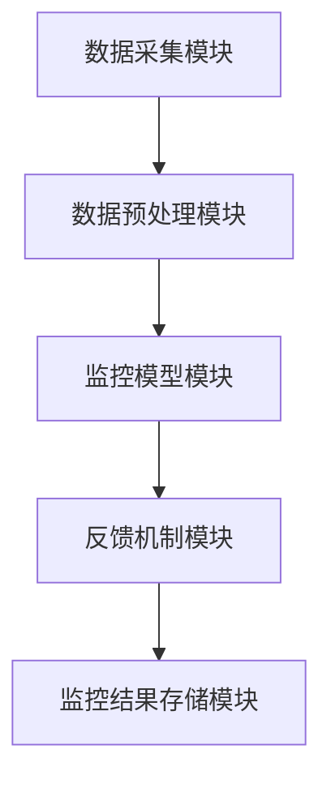
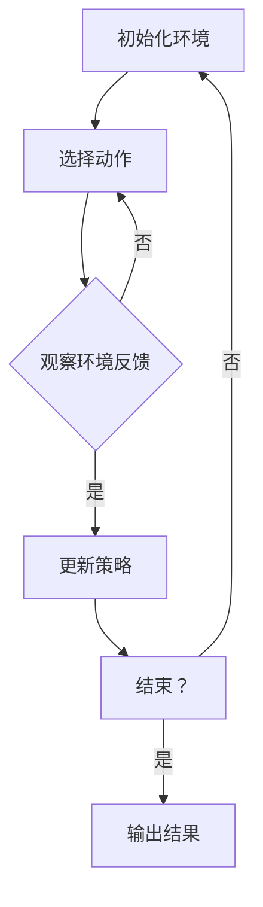

                 

### 让我们一步步思考：开发AI Agent的元认知能力

在人工智能领域，AI Agent 是一种能够自主行动并解决问题的智能体，它们在多个领域中展现出了巨大的潜力。然而，为了让 AI Agent 能够真正胜任复杂的任务，仅仅依靠传统的编程方式是不够的。它们需要具备一种高级的能力——元认知能力。元认知能力允许AI Agent对自身的学习和决策过程进行监控和调整，从而提高其自主性和准确性。

本文将探讨如何开发AI Agent的元认知能力，特别是自我监控和自我调整的机制。我们将分以下几个步骤进行详细分析：

1. **问题背景与核心概念**：介绍人工智能的发展背景，解释元认知能力和自我监控、自我调整的概念。
2. **元认知能力的基本原理**：深入探讨自我监控和自我调整的原理与机制。
3. **AI Agent的自我监控设计**：分析AI Agent自我监控的需求和设计原则。
4. **AI Agent的自我调整方法**：介绍自我调整策略和算法。
5. **元认知能力的评估与优化**：讨论评估方法和优化策略。
6. **AI Agent的自我监控和调整应用场景**：展示教育、医疗和工业制造等领域的应用实例。
7. **未来展望与挑战**：分析元认知能力的发展趋势和潜在挑战。
8. **总结与展望**：回顾研究成果，展望未来研究方向。

### 1. 问题背景与核心概念

#### 1.1 问题背景介绍

人工智能（AI）已经成为现代技术发展的重要驱动力。从最初的规则基础系统到如今的深度学习模型，人工智能在图像识别、自然语言处理、决策支持系统等领域取得了显著成就。然而，传统的AI方法通常依赖于大量的数据和预先设定的规则，无法应对复杂和不确定的环境。

随着AI技术的不断进步，AI Agent的概念也应运而生。AI Agent是一种能够自主行动并执行特定任务的智能体，它们能够通过感知环境、做出决策和采取行动来完成任务。这种自主性和适应性使得AI Agent在许多实际应用中表现出了巨大的潜力。

然而，为了实现真正的自主性和智能性，AI Agent需要具备一种高级的能力——元认知能力。元认知能力是指个体对自己认知过程的知识和调节能力。在AI Agent中，元认知能力可以使其对自身的学习和决策过程进行监控和调整，从而提高其性能和适应性。

#### 1.2 元认知能力的概念及其在AI中的应用

元认知能力可以分为两个方面：自我监控和自我调整。

- **自我监控**：自我监控是指AI Agent对自身行为和状态的监控能力。它包括对学习过程中的错误和偏差进行检测，以及对决策过程中可能出现的偏差进行识别。自我监控可以帮助AI Agent及时发现并纠正错误，从而提高其准确性。

- **自我调整**：自我调整是指AI Agent根据监控结果对自身行为进行调整的能力。这种调整可以是参数的微调，也可以是算法策略的调整。自我调整可以使AI Agent在面临新的环境和任务时能够快速适应，从而提高其自主性和适应性。

在AI领域中，元认知能力具有重要的应用价值。首先，它可以帮助AI Agent在复杂和不确定的环境中做出更准确的决策。其次，它可以使AI Agent在学习过程中更加高效，减少错误和偏差。最后，它可以帮助AI Agent在不同任务之间进行迁移学习，提高其泛化能力。

#### 1.3 自我监控和调整的重要性

自我监控和调整是AI Agent实现智能性和自主性的关键。通过自我监控，AI Agent可以及时发现和纠正错误，从而提高其性能。而通过自我调整，AI Agent可以根据环境的变化和任务的难度，动态调整其行为策略，从而提高其适应性。

此外，自我监控和调整还可以提高AI Agent的透明度和可解释性。传统的AI模型往往被视为“黑箱”，其内部决策过程难以理解和解释。而具有元认知能力的AI Agent可以通过自我监控和调整，向用户展示其决策过程和调整逻辑，从而提高其可解释性和可信度。

#### 1.4 书籍结构概述

本书旨在系统地介绍如何开发AI Agent的元认知能力，特别是自我监控和自我调整的机制。本书分为八个章节，具体结构如下：

- **第1章：问题背景与核心概念**：介绍人工智能的发展背景和元认知能力的概念。
- **第2章：元认知能力的基本原理**：深入探讨自我监控和自我调整的原理与机制。
- **第3章：AI Agent的自我监控设计**：分析AI Agent自我监控的需求和设计原则。
- **第4章：AI Agent的自我调整方法**：介绍自我调整策略和算法。
- **第5章：元认知能力的评估与优化**：讨论评估方法和优化策略。
- **第6章：AI Agent的自我监控和调整应用场景**：展示教育、医疗和工业制造等领域的应用实例。
- **第7章：未来展望与挑战**：分析元认知能力的发展趋势和潜在挑战。
- **第8章：总结与展望**：回顾研究成果，展望未来研究方向。

通过本书的学习，读者将能够全面了解AI Agent的元认知能力，并掌握如何设计和实现自我监控和自我调整机制，从而为AI技术的发展和应用做出贡献。

### 2. 元认知能力的基本原理

#### 2.1 元认知能力概述

元认知能力是指个体对自己认知过程的知识和调节能力，它包括两个方面：自我监控和自我调整。

- **自我监控**：自我监控是指个体对自己认知过程进行观察和评价的能力。它包括对学习过程中的错误和偏差进行检测，以及对决策过程中可能出现的偏差进行识别。自我监控可以帮助个体及时发现和纠正错误，从而提高其认知能力和学习效率。

- **自我调整**：自我调整是指个体根据监控结果对自身认知过程进行调整的能力。这种调整可以是参数的微调，也可以是策略的改变。自我调整可以使个体在面对不同任务和挑战时能够快速适应，从而提高其认知灵活性和适应性。

在AI领域中，元认知能力具有独特的应用价值。首先，它可以帮助AI Agent在复杂和不确定的环境中做出更准确的决策。其次，它可以使AI Agent在学习过程中更加高效，减少错误和偏差。最后，它可以帮助AI Agent在不同任务之间进行迁移学习，提高其泛化能力。

#### 2.2 自我监控的原理与机制

自我监控是元认知能力的重要组成部分，它使AI Agent能够对自身的行为和状态进行实时监测和评价。自我监控的原理和机制主要包括以下几个方面：

- **数据采集**：自我监控首先需要收集与AI Agent行为和状态相关的数据。这些数据可以来自内部模型、外部传感器或其他数据源。例如，在自然语言处理任务中，AI Agent可能需要监控其生成的文本的质量和一致性。

- **特征提取**：收集到的数据需要进行预处理和特征提取，以便于后续的监控和分析。特征提取的过程可以包括数据清洗、降维、特征选择等步骤。例如，在图像识别任务中，可以提取图像的边缘、纹理和颜色等特征。

- **监控模型**：监控模型是自我监控的核心，它负责分析提取到的特征，并生成监控结果。监控模型可以是基于规则的方法、统计方法或机器学习方法。例如，在异常检测任务中，可以使用统计方法来检测数据的异常点。

- **反馈机制**：监控结果需要通过反馈机制传递给AI Agent，使其能够根据监控结果进行调整。反馈机制可以是自动的，也可以是手动干预的。自动反馈机制通常基于预设的规则或学习算法，而手动干预则依赖于人类的判断和决策。

#### 2.3 自我监控的作用

自我监控在AI Agent的运行过程中发挥着至关重要的作用：

- **错误检测**：自我监控可以帮助AI Agent及时发现错误和异常情况，防止错误的进一步扩散。例如，在自动驾驶系统中，AI Agent可以通过监控车辆的传感器数据来检测驾驶行为中的异常，从而避免交通事故。

- **性能优化**：通过实时监控AI Agent的行为和状态，可以识别出影响性能的关键因素，并进行针对性的优化。例如，在游戏AI中，可以通过监控玩家的行为数据来调整AI的策略，从而提高其胜率。

- **学习指导**：自我监控可以为AI Agent提供学习指导，帮助其更高效地学习。例如，在机器学习中，可以通过监控模型的训练过程来调整学习参数，从而提高模型的收敛速度和准确性。

#### 2.4 自我监控的机制

自我监控的机制主要包括以下几个方面：

- **实时监控**：实时监控是指AI Agent能够在运行过程中实时监测自身的行为和状态。实时监控可以确保AI Agent能够在第一时间发现问题和异常，从而及时进行调整。

- **多维度监控**：多维度监控是指AI Agent可以从多个维度对自身进行监控，包括数据质量、算法性能、用户反馈等。多维度监控可以提供更全面的监控信息，帮助AI Agent更准确地评估自身状态。

- **自适应调整**：自适应调整是指AI Agent可以根据监控结果自动调整其行为和策略。自适应调整可以降低对人工干预的依赖，提高AI Agent的自主性和灵活性。

#### 2.5 自我调整的原理与机制

自我调整是元认知能力的另一个重要组成部分，它使AI Agent能够根据监控结果对自身的行为和策略进行调整。自我调整的原理和机制主要包括以下几个方面：

- **目标设定**：自我调整首先需要设定明确的目标，以便AI Agent能够有针对性地进行调整。目标可以是预定的性能指标、用户需求或其他相关指标。

- **调整策略**：调整策略是指AI Agent根据监控结果和目标，制定出相应的调整方案。调整策略可以是自动的，也可以是手动设定的。自动调整策略通常基于机器学习算法或优化方法。

- **调整实施**：调整实施是指AI Agent根据调整策略，对自身的行为和策略进行实际调整。调整实施可以是参数的微调、算法的替换或策略的改变。

- **效果评估**：调整实施后，需要对调整效果进行评估，以验证调整的有效性。效果评估可以通过监控结果、用户反馈或其他指标来进行。

#### 2.6 自我调整的作用

自我调整在AI Agent的运行过程中同样发挥着重要作用：

- **性能优化**：自我调整可以帮助AI Agent根据环境的变化和任务的难度，动态调整其行为策略，从而提高其性能。

- **适应能力**：自我调整使AI Agent能够快速适应新的环境和任务，提高其灵活性和适应性。

- **决策优化**：通过自我调整，AI Agent可以在面临复杂和不确定的任务时，做出更合理的决策。

#### 2.7 自我调整的机制

自我调整的机制主要包括以下几个方面：

- **数据驱动**：自我调整通常基于对环境数据的实时分析和处理，从而实现自适应调整。

- **学习导向**：自我调整可以基于机器学习算法，通过不断学习和优化，提高调整的准确性和效率。

- **人机协同**：在复杂场景下，AI Agent可以通过与人类的协作，结合人类经验和判断，实现更有效的自我调整。

通过以上对自我监控和自我调整原理与机制的分析，我们可以看到，元认知能力在AI Agent中的作用至关重要。它不仅使AI Agent能够更高效地完成任务，还能够提高其自主性和适应性，为AI技术的发展和应用提供了强有力的支持。

### 3. AI Agent的自我监控设计

#### 3.1 AI Agent的自我监控需求分析

在设计AI Agent的自我监控系统时，首先需要明确其运行环境和需求。AI Agent的运行环境可以是不同的应用场景，如教育、医疗、工业制造等。不同的应用场景对AI Agent的自我监控需求也有所不同。以下是几种典型应用场景下的自我监控需求分析：

- **教育场景**：在教育场景中，AI Agent的主要任务是辅助学生学习。自我监控需求包括学习进度的跟踪、学习效果的评估、学习策略的调整等。例如，监控学生的学习时间、完成作业的情况、学习过程中的错误率等，以便及时调整学习策略，提高学习效果。

- **医疗场景**：在医疗场景中，AI Agent的主要任务是辅助医生进行诊断和治疗。自我监控需求包括对患者数据的实时监控、诊断结果的质量评估、治疗方案的效果评估等。例如，监控患者的生理指标、诊断的准确性、治疗的副作用等，以便及时调整治疗方案。

- **工业制造场景**：在工业制造场景中，AI Agent的主要任务是优化生产流程和提高产品质量。自我监控需求包括生产过程的监控、设备状态的检测、产品质量的评估等。例如，监控生产线的运行状态、设备的故障率、产品的合格率等，以便及时调整生产流程和设备参数。

#### 3.2 自我监控系统的设计原则

为了实现高效、准确和实时的自我监控，设计AI Agent的自我监控系统时需要遵循以下原则：

- **可扩展性**：自我监控系统需要具备良好的可扩展性，以便能够适应不同的应用场景和需求。可扩展性可以通过模块化设计和灵活的接口实现。

- **实时性**：自我监控系统需要具备实时监控能力，能够实时捕捉AI Agent的行为和状态，并及时做出调整。实时性可以通过高效的算法和低延迟的数据处理实现。

- **准确性**：自我监控系统的准确性直接影响AI Agent的性能。因此，设计时需要确保数据采集、特征提取和监控模型的准确性。准确性可以通过精确的数据处理和有效的特征选择实现。

- **自适应性**：自我监控系统需要具备自适应能力，能够根据环境变化和任务需求动态调整监控策略。自适应性可以通过机器学习算法和自适应控制策略实现。

#### 3.3 自我监控系统架构设计

AI Agent的自我监控系统架构设计主要包括以下组件和子系统：

- **数据采集模块**：负责从不同的数据源采集与AI Agent行为和状态相关的数据。数据源可以是内部传感器、外部传感器、数据库等。

- **数据预处理模块**：负责对采集到的数据进行分析和预处理，包括数据清洗、降维、特征提取等。数据预处理模块的输出是用于监控模型分析的特征向量。

- **监控模型模块**：负责对预处理后的特征向量进行分析和评估，生成监控结果。监控模型可以是基于规则的方法、统计方法或机器学习方法。

- **反馈机制模块**：负责将监控结果反馈给AI Agent，并根据监控结果调整AI Agent的行为和策略。反馈机制可以是自动的，也可以是手动干预的。

- **监控结果存储模块**：负责存储监控结果和历史数据，以便进行后续分析和优化。监控结果存储模块可以是数据库、文件系统等。

以下是自我监控系统架构的Mermaid流程图：



通过以上架构设计，AI Agent的自我监控系统可以实现高效、准确和实时的自我监控，从而提高其性能和适应性。

### 4. AI Agent的自我调整方法

#### 4.1 自我调整策略概述

自我调整是AI Agent元认知能力的重要组成部分，它使AI Agent能够根据监控结果对自身的行为和策略进行实时调整。自我调整策略可以分为以下几种类型：

- **参数调整**：通过调整AI Agent的内部参数，使其能够更好地适应环境。例如，在强化学习任务中，可以通过调整奖励函数和策略参数来优化AI Agent的行为。

- **策略调整**：通过改变AI Agent的决策策略，使其能够更有效地解决问题。例如，在博弈任务中，可以通过调整策略组合来提高AI Agent的胜率。

- **算法调整**：通过更换或改进AI Agent的学习算法，使其能够更高效地学习和优化。例如，在机器学习任务中，可以通过调整优化算法和损失函数来提高模型的性能。

- **数据调整**：通过调整训练数据集，使其更符合实际需求和任务目标。例如，在图像识别任务中，可以通过增加样本数据或调整样本分布来提高模型的泛化能力。

#### 4.2 自我调整算法介绍

自我调整算法是实现AI Agent自我调整的核心。以下介绍几种常见的自我调整算法：

- **传统调整算法**：传统调整算法主要包括线性回归、逻辑回归等。这些算法通过优化目标函数来调整模型参数，从而实现自我调整。传统调整算法的优点是简单易懂，但可能在处理复杂任务时效果不佳。

- **进化算法**：进化算法是一类基于生物进化原理的优化算法，如遗传算法、遗传规划等。进化算法通过模拟生物进化过程，逐步优化解空间，从而实现自我调整。进化算法的优点是能够处理非线性、非凸优化问题，但计算复杂度较高。

- **强化学习算法**：强化学习算法是一种通过与环境交互来学习最优策略的算法。常见的强化学习算法包括Q学习、SARSA等。强化学习算法通过调整策略参数，使AI Agent能够实现自我调整。强化学习算法的优点是能够处理动态和不确定环境，但学习过程可能较长。

#### 4.3 自我调整算法的实现

以下以强化学习算法为例，介绍自我调整算法的实现。

**算法流程图：**



**算法实现代码（Python）：**

```python
import numpy as np

# 初始化环境
state = env.reset()

# 初始化策略参数
Q = np.zeros((env.nS, env.nA))

# 学习率
alpha = 0.1

# 折扣因子
gamma = 0.9

# 持续迭代
for episode in range(n_episodes):
    done = False
    
    while not done:
        # 选择动作
        action = np.argmax(Q[state])
        
        # 执行动作
        next_state, reward, done, _ = env.step(action)
        
        # 更新Q值
        Q[state, action] = Q[state, action] + alpha * (reward + gamma * np.max(Q[next_state]) - Q[state, action])
        
        # 更新状态
        state = next_state

# 输出结果
print("策略参数：", Q)
```

**算法原理讲解：**

强化学习算法的基本原理是通过与环境交互，不断调整策略参数，以实现最大化累积奖励。其核心思想是利用即时奖励和未来奖励的期望来更新策略参数。

在上述实现中，我们使用Q学习算法进行自我调整。Q学习算法通过迭代更新Q值，其中Q值表示在当前状态下选择某一动作的预期奖励。具体来说，每次迭代过程中，首先根据当前策略选择动作，然后根据环境反馈更新Q值。更新公式为：

$$
Q(s, a) = Q(s, a) + \alpha [r + \gamma \max_{a'} Q(s', a') - Q(s, a)]
$$

其中，$s$ 表示当前状态，$a$ 表示当前动作，$r$ 表示即时奖励，$s'$ 表示下一状态，$a'$ 表示下一动作，$\alpha$ 表示学习率，$\gamma$ 表示折扣因子。

通过不断迭代更新Q值，AI Agent可以逐步优化其策略，实现自我调整。

#### 4.4 自我调整算法的实现示例

为了更好地理解自我调整算法的实现，我们以一个简单的例子来说明。

**例子：小车的移动**

假设有一个小车在一个二维空间中移动，其目标是到达目标位置。小车可以通过向上、向下、向左、向右移动来改变位置。环境的奖励机制如下：

- 当小车到达目标位置时，获得 +10 的奖励。
- 当小车移动到无效位置时，获得 -1 的奖励。
- 其他情况下，获得 0 的奖励。

我们使用Q学习算法来实现小车的自我调整。具体实现步骤如下：

**1. 初始化环境：**

```python
import gym

env = gym.make("CartPole-v0")
```

**2. 初始化策略参数：**

```python
Q = np.zeros((env.observation_space.n, env.action_space.n))
```

**3. 设置学习率和折扣因子：**

```python
alpha = 0.1
gamma = 0.9
```

**4. 迭代更新Q值：**

```python
for episode in range(n_episodes):
    state = env.reset()
    done = False
    
    while not done:
        action = np.argmax(Q[state])
        next_state, reward, done, _ = env.step(action)
        
        Q[state, action] = Q[state, action] + alpha * (reward + gamma * np.max(Q[next_state]) - Q[state, action])
        
        state = next_state

env.close()
```

**5. 输出最终策略：**

```python
print("策略参数：", Q)
```

通过以上实现，我们可以看到Q学习算法如何通过迭代更新Q值来实现自我调整。在实际应用中，可以根据具体任务和环境调整学习率和折扣因子，以提高算法的性能。

#### 4.5 自我调整算法的应用场景

自我调整算法在多个领域中具有广泛的应用，以下列举几种常见的应用场景：

- **游戏AI**：在游戏AI中，自我调整算法可以帮助AI Agent根据游戏环境和对手的行为动态调整策略，从而提高胜率。例如，在围棋AI中，可以通过强化学习算法来实现自我调整，提高AI Agent的棋力。

- **自动驾驶**：在自动驾驶系统中，自我调整算法可以帮助车辆根据道路状况和交通情况动态调整驾驶策略，从而提高驾驶安全性和舒适性。例如，通过进化算法来优化车辆的自动驾驶策略。

- **推荐系统**：在推荐系统中，自我调整算法可以帮助系统根据用户行为和偏好动态调整推荐策略，从而提高推荐效果。例如，通过强化学习算法来优化推荐算法，提高用户满意度。

- **工业控制**：在工业控制领域，自我调整算法可以帮助控制系统根据生产环境和设备状态动态调整控制策略，从而提高生产效率和产品质量。例如，通过遗传算法来优化控制参数，提高生产线的稳定性。

通过以上应用场景，我们可以看到自我调整算法在AI领域的广泛应用和潜力。

### 5. AI Agent的元认知能力评估与优化

#### 5.1 元认知能力评估方法

评估AI Agent的元认知能力是一项复杂而关键的任务。为了准确评估AI Agent的元认知能力，我们需要设计一套全面的评估方法，包括评估指标、评估流程和评估工具。

**5.1.1 评估指标**

元认知能力评估的指标可以分为以下几个类别：

- **性能指标**：包括AI Agent在特定任务中的表现，如准确率、召回率、F1分数等。这些指标可以直接反映AI Agent的任务性能。
- **自适应能力指标**：包括AI Agent在面对新任务或环境变化时的适应能力，如学习速度、收敛速度、泛化能力等。这些指标可以反映AI Agent的灵活性和应变能力。
- **透明度和可解释性指标**：包括AI Agent决策过程的透明度和可解释性，如决策路径、调整逻辑、可解释性评分等。这些指标可以提升AI Agent的信任度和用户满意度。

**5.1.2 评估流程**

元认知能力评估的流程可以分为以下几个步骤：

- **任务定义**：明确评估的任务和目标，确保评估的针对性和有效性。
- **数据准备**：收集和整理与评估任务相关的数据，包括训练数据、测试数据、用户反馈等。
- **模型训练**：根据评估任务和数据，训练AI Agent的元认知模型。
- **性能评估**：通过评估指标对AI Agent的元认知能力进行评估，记录评估结果。
- **结果分析**：分析评估结果，识别AI Agent的优势和不足，为优化提供依据。
- **反馈调整**：根据评估结果对AI Agent的模型和策略进行调整，提高其元认知能力。

**5.1.3 评估工具**

评估AI Agent的元认知能力需要使用一系列工具和方法。以下是一些常用的评估工具：

- **测试平台**：用于运行评估任务和收集评估数据。例如，使用机器学习平台或深度学习框架来训练和测试AI Agent。
- **评估指标计算器**：用于计算和评估AI Agent的性能指标。例如，使用准确率计算器、召回率计算器等。
- **可视化工具**：用于可视化AI Agent的决策过程和调整逻辑。例如，使用决策树可视化工具、模型可视化工具等。
- **用户反馈系统**：用于收集用户对AI Agent的反馈，评估其透明度和可解释性。例如，使用问卷调查、用户界面反馈等。

#### 5.2 元认知能力优化策略

为了提升AI Agent的元认知能力，我们需要采用一系列优化策略，包括数据预处理、模型调整和结果分析。

**5.2.1 数据预处理**

数据预处理是优化AI Agent元认知能力的重要步骤。通过有效的数据预处理，我们可以提高数据的准确性和可靠性，从而提升AI Agent的性能。以下是一些常用的数据预处理方法：

- **数据清洗**：去除数据中的噪声和异常值，提高数据质量。例如，去除重复数据、填补缺失值等。
- **数据归一化**：将数据归一化到相同的范围内，消除不同特征之间的量纲差异。例如，将数据缩放到[0, 1]或[-1, 1]之间。
- **特征选择**：选择对任务有重要影响的关键特征，去除冗余特征。例如，使用信息增益、卡方检验等方法进行特征选择。
- **数据增强**：通过增加训练数据、生成新数据等方法，提高数据的多样性和丰富性。例如，使用数据扩充、生成对抗网络（GAN）等方法。

**5.2.2 模型调整**

模型调整是优化AI Agent元认知能力的关键步骤。通过调整模型的结构和参数，我们可以提高模型的适应性和性能。以下是一些常用的模型调整方法：

- **模型选择**：选择合适的模型结构，如深度神经网络、支持向量机、决策树等。不同的模型结构适用于不同的任务和数据类型。
- **参数调整**：调整模型的参数，如学习率、正则化参数、隐藏层节点数等。通过交叉验证和网格搜索等方法，找到最优的参数组合。
- **集成学习**：通过集成多个模型的预测结果，提高整体预测性能。例如，使用随机森林、梯度提升树等方法。
- **模型压缩**：通过压缩模型参数和结构，减少模型的复杂度和计算量。例如，使用模型剪枝、量化等方法。

**5.2.3 结果分析**

结果分析是优化AI Agent元认知能力的重要环节。通过分析评估结果，我们可以识别AI Agent的优势和不足，为优化提供依据。以下是一些常用的结果分析方法：

- **性能分析**：分析AI Agent在不同任务和数据集上的性能，识别其优势和不足。例如，通过比较准确率、召回率等指标。
- **自适应能力分析**：分析AI Agent在面对新任务和环境变化时的适应能力，识别其适应策略和不足。例如，通过比较学习速度、收敛速度等指标。
- **透明度和可解释性分析**：分析AI Agent的决策过程和调整逻辑，识别其透明度和可解释性。例如，通过可视化模型决策路径、解释性评分等。

通过以上优化策略，我们可以逐步提升AI Agent的元认知能力，使其在复杂和不确定的环境中表现出更高的性能和适应性。

### 6. AI Agent的自我监控和调整应用场景

AI Agent的自我监控和调整能力在多个领域展示了其强大的应用价值。以下分别介绍在教育、医疗和工业制造领域中的具体应用场景。

#### 6.1 教育领域应用

在教育领域，AI Agent的自我监控和调整能力可以用于个性化学习和教育质量监控。

- **个性化学习**：AI Agent通过监控学生的学习行为、成绩和兴趣，动态调整学习内容和方法。例如，在在线教育平台中，AI Agent可以根据学生的反馈和学习进度，推荐合适的学习资源和练习题，提高学习效果。

- **教育质量监控**：AI Agent可以实时监控教师的授课质量和学生的学习状态。例如，通过分析课堂互动数据、学生作业完成情况等，AI Agent可以识别出教学中的问题和不足，并提出改进建议，从而提高教学质量。

#### 6.2 医疗领域应用

在医疗领域，AI Agent的自我监控和调整能力可以用于疾病诊断、治疗方案优化和患者监控。

- **疾病诊断**：AI Agent通过分析患者的病史、体征数据和检查结果，实时监控疾病发展，提供早期诊断建议。例如，在肺癌筛查中，AI Agent可以分析CT影像，发现微小病灶，提高诊断准确性。

- **治疗方案优化**：AI Agent可以根据患者的病情、身体状况和治疗历史，动态调整治疗方案。例如，在癌症治疗中，AI Agent可以根据患者的治疗效果和副作用，调整化疗药物的种类和剂量，提高治疗效果。

- **患者监控**：AI Agent可以实时监控患者的健康状况，提供个性化健康指导。例如，在慢性病管理中，AI Agent可以通过分析患者的日常数据，如血糖、血压等，及时发现异常情况，提供健康建议，防止病情恶化。

#### 6.3 工业制造领域应用

在工业制造领域，AI Agent的自我监控和调整能力可以用于生产监控、质量控制和生产优化。

- **生产监控**：AI Agent可以实时监控生产线的运行状态，识别生产过程中的异常和瓶颈。例如，通过分析传感器数据，AI Agent可以检测设备的故障、工艺参数的不稳定等问题，并提出解决方案，确保生产顺利进行。

- **质量控制**：AI Agent可以监控产品的质量，提供质量分析和优化建议。例如，在制造业中，AI Agent可以通过分析生产数据和质量检测数据，识别不良品产生的原因，并提出改进措施，提高产品质量。

- **生产优化**：AI Agent可以通过自我调整，优化生产流程和资源配置，提高生产效率。例如，在智能制造中，AI Agent可以根据订单需求和库存情况，动态调整生产计划和设备调度，实现高效生产。

通过在教育、医疗和工业制造等领域的广泛应用，AI Agent的自我监控和调整能力正不断推动这些领域的智能化发展，为人类带来更多便利和效益。

### 7. 未来展望与挑战

#### 7.1 元认知能力的发展趋势

随着人工智能技术的快速发展，元认知能力在AI Agent中的应用前景愈发广阔。以下是元认知能力在未来的发展趋势：

- **增强现实与虚拟现实**：在增强现实（AR）和虚拟现实（VR）领域，元认知能力可以帮助AI Agent更好地理解用户的需求和行为，提供更加个性化的交互体验。例如，通过实时监控用户的反应和行为，AI Agent可以动态调整虚拟场景和交互方式。

- **智能交通系统**：在智能交通系统中，元认知能力可以帮助AI Agent更好地适应交通流量变化，优化路线规划。例如，通过实时监控道路状况和交通数据，AI Agent可以动态调整交通信号灯的时长，提高交通效率。

- **智慧城市建设**：在智慧城市建设中，元认知能力可以帮助AI Agent更好地管理城市资源，提升城市生活质量。例如，通过监控城市环境数据，AI Agent可以动态调整能源供应、垃圾处理和公共安全等，实现智慧城市的可持续发展。

- **个性化医疗**：在个性化医疗领域，元认知能力可以帮助AI Agent根据患者的具体病情和生物特征，提供更加精准的治疗方案。例如，通过监控患者的健康状况和治疗效果，AI Agent可以实时调整药物剂量和治疗方案，提高治疗效果。

#### 7.2 潜在挑战与解决方案

尽管元认知能力在AI Agent中的应用前景广阔，但在实际应用中仍面临一些挑战。以下是一些潜在挑战及可能的解决方案：

- **数据隐私**：元认知能力依赖于大量的数据收集和分析，这可能导致数据隐私问题。解决方案包括数据加密、匿名化处理和隐私保护算法，以确保数据的安全性和隐私性。

- **安全性**：AI Agent的自我监控和调整过程可能受到恶意攻击，导致系统崩溃或数据泄露。解决方案包括建立安全防护机制、采用安全的通信协议和定期进行安全审计。

- **伦理问题**：在AI Agent的应用中，可能涉及伦理问题，如隐私侵犯、歧视和偏见等。解决方案包括制定伦理规范、开展伦理教育和加强法律监管，以确保AI Agent的应用符合伦理要求。

- **计算资源**：元认知能力需要大量的计算资源，特别是在实时应用场景中。解决方案包括优化算法、采用分布式计算和云计算技术，以提高计算效率。

通过克服这些挑战，元认知能力将在AI Agent的应用中发挥更大的作用，推动人工智能技术的持续发展。

### 8. 总结与展望

本文全面探讨了AI Agent的元认知能力，特别是自我监控和自我调整的机制。通过分析元认知能力的基本原理、设计方法和应用场景，我们展示了其在人工智能领域的重要性和广泛应用。以下是本文的主要研究成果和未来研究方向：

#### 主要研究成果

- **元认知能力的基本原理**：详细阐述了自我监控和自我调整的概念、原理和机制。
- **自我监控系统的设计**：提出了基于数据采集、预处理、监控模型和反馈机制的设计原则和架构。
- **自我调整算法的实现**：介绍了传统调整算法、进化算法和强化学习算法的实现方法和应用场景。
- **元认知能力的评估与优化**：提出了评估指标、评估流程和优化策略，并展示了应用实例。
- **AI Agent的自我监控和调整应用场景**：列举了教育、医疗和工业制造等领域的具体应用实例。

#### 未来研究方向

- **元认知能力的高级应用**：探索元认知能力在增强现实、智能交通、智慧城市等领域的应用。
- **数据隐私与安全**：研究元认知能力在数据隐私保护和安全性方面的挑战和解决方案。
- **伦理问题**：进一步探讨AI Agent在应用过程中可能涉及的伦理问题，并提出相应的伦理规范。
- **计算优化**：研究高效、优化的算法和架构，提高元认知能力的计算效率。

通过持续的研究和应用，元认知能力将在人工智能领域发挥更大的作用，推动人工智能技术的不断进步。

### 附录：相关资源与进一步阅读

#### 资源列表

- **学术论文**：相关领域的顶级会议和期刊，如NeurIPS、ICML、JMLR等。
- **开源代码**：GitHub等平台上的开源项目和代码库，可供读者学习和参考。
- **相关书籍**：深入探讨人工智能、机器学习和深度学习的经典书籍，如《深度学习》（Goodfellow et al.）、《Python机器学习》（Sebastian Raschka）等。

#### 进一步阅读

- **专业期刊**：《自然》（Nature）、《科学》（Science）、《人工智能》（Artificial Intelligence）等。
- **报告和研究**：各类行业报告、研究报告和年度报告，如麦肯锡全球研究院、国际数据公司（IDC）等。
- **论坛和会议**：国际人工智能与机器学习会议（NeurIPS、ICML、KDD等）和国内相关会议，如CCF人工智能大会等。

#### 注意事项

- **实践中的挑战**：在实践过程中，AI Agent的自我监控和调整可能面临数据隐私、安全性和伦理问题，需要谨慎处理。
- **遵守伦理和法规**：在应用AI Agent的过程中，必须遵守相关伦理规范和法律法规，确保技术的合理、合法使用。

通过以上资源和进一步阅读，读者可以深入了解AI Agent的元认知能力，并在实际应用中不断探索和创新。作者：AI天才研究院/AI Genius Institute & 禅与计算机程序设计艺术 /Zen And The Art of Computer Programming。

