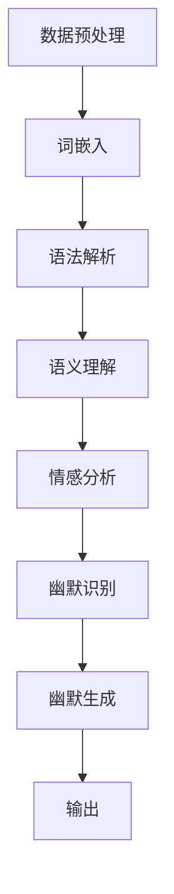
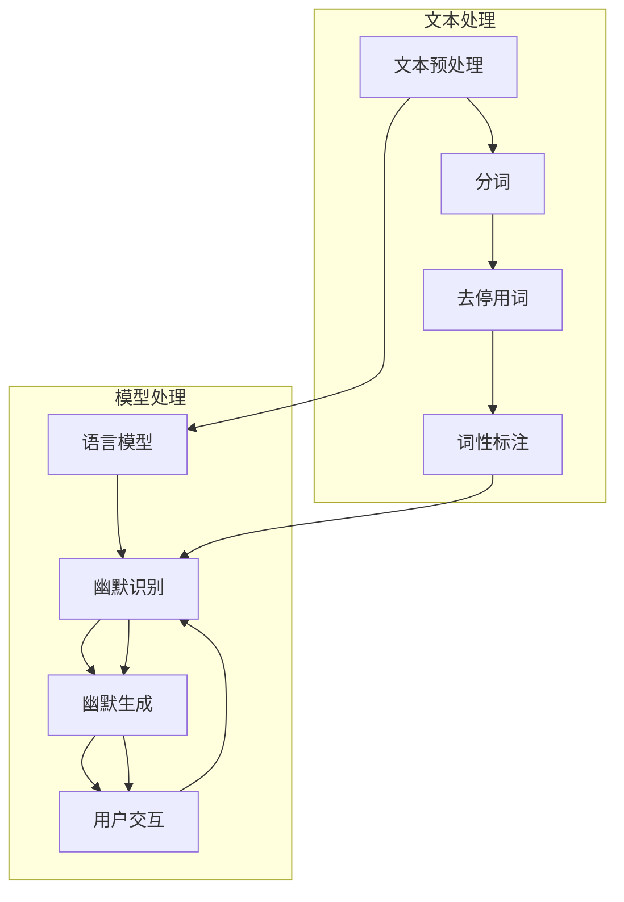
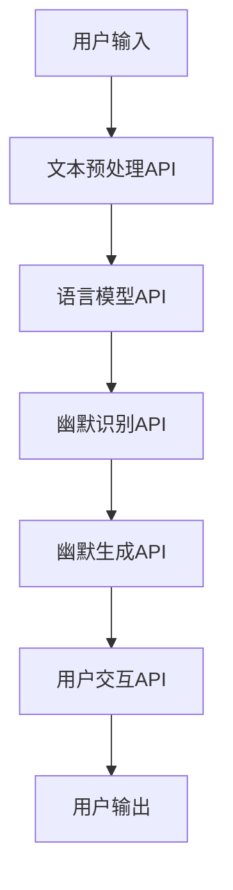
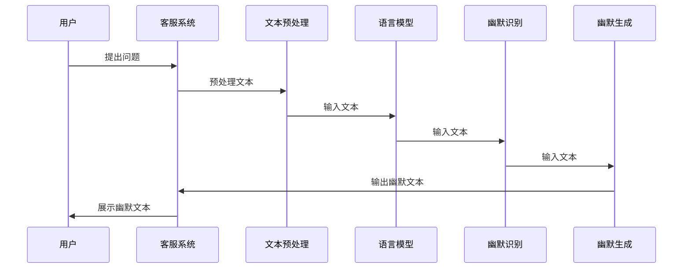
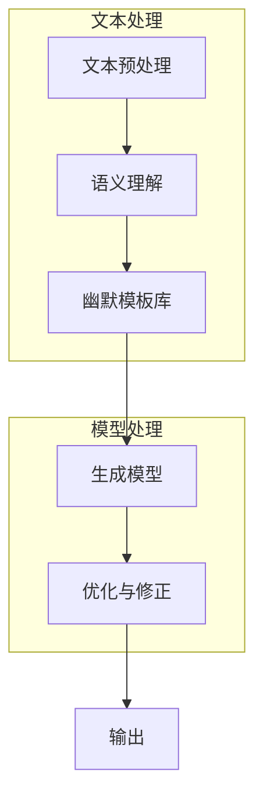

                 

### 开发AI Agent的多语言幽默理解与生成系统

在人工智能领域，AI Agent的设计与开发已经成为一个重要的研究方向。AI Agent，即人工智能代理，是能够模拟人类智能行为，自主决策并执行任务的计算机程序。随着自然语言处理（NLP）技术的不断进步，AI Agent在多语言环境下的表现越来越令人瞩目。然而，在这些AI Agent中，能够理解和生成幽默的多语言内容，无疑是一个极具挑战性和吸引力的领域。

幽默作为一种复杂的语言现象，不仅需要AI Agent具备深刻的文化理解和语境感知能力，还需要其在语言生成过程中能够创造出新颖且有趣的内容。本文将深入探讨开发AI Agent的多语言幽默理解与生成系统，包括其核心概念、算法原理、系统设计、项目实战及优化方法。

### 文章关键词

- AI Agent
- 多语言幽默理解
- 生成系统
- 自然语言处理
- 机器学习

### 摘要

本文旨在系统地介绍开发AI Agent的多语言幽默理解与生成系统的过程。首先，我们将探讨AI Agent的基本概念及其在多语言环境中的应用现状。接着，我们将深入分析多语言幽默理解的挑战，并提出相应的解决策略。随后，文章将详细讲解多语言幽默理解的算法原理，包括其数学模型和实现步骤。随后，我们将介绍一个具体的幽默理解系统的设计与实现，并通过项目实战展示其实际应用。最后，文章将讨论系统优化方法以及未来的研究方向，为读者提供全面的指导。

## 第1章: 引言

### 1.1 问题背景

AI Agent，即人工智能代理，是近年来人工智能领域的一个热点话题。它们在智能客服、自动化决策支持、智能家居等应用中发挥着越来越重要的作用。随着全球化进程的加速，多语言环境变得越来越普遍。因此，具备多语言能力的AI Agent在商业、教育、医疗等多个领域具有广泛的应用前景。

幽默作为一种重要的语言现象，不仅在社交互动中占据重要地位，也在商业、教育和娱乐等领域具有广泛应用。例如，在智能客服系统中，幽默的对话可以提高用户满意度，增强用户粘性。在教育领域，幽默的教学内容可以提高学生的学习兴趣和参与度。在娱乐领域，幽默的节目和内容更是能够吸引大量的观众。

然而，多语言幽默理解与生成系统面临着诸多挑战。首先，不同语言之间的幽默表达方式和文化背景存在巨大差异，这使得多语言幽默理解变得异常复杂。其次，幽默的理解和生成需要AI Agent具备深度的语境感知能力和创造性思维，这进一步增加了系统的难度。最后，多语言幽默的理解与生成需要处理大量的语言数据，这对系统的计算资源提出了更高的要求。

### 1.2 问题描述

多语言幽默理解与生成系统需要解决的核心问题包括：

1. **多语言幽默内容的理解**：AI Agent需要能够理解和解析不同语言中的幽默内容，这包括对双关语、俚语、文化引用等复杂语言现象的处理。

2. **跨文化幽默识别**：系统需要能够识别和理解不同文化背景下的幽默，包括不同语言之间的文化差异和幽默表达方式的转换。

3. **幽默内容的生成**：AI Agent需要能够根据用户的输入或特定的场景，生成幽默且合适的语言内容。

4. **算法的鲁棒性和效率**：多语言幽默理解与生成系统需要在保证算法鲁棒性的同时，提高系统的处理效率，以适应实际应用的需求。

### 1.3 问题解决

解决多语言幽默理解与生成系统的问题，需要从以下几个方面入手：

1. **数据集的构建**：构建一个包含多语言幽默内容的大型数据集，这是训练AI模型的基础。

2. **自然语言处理技术**：利用自然语言处理（NLP）技术，对幽默内容进行深度分析，包括语法解析、语义理解、情感分析等。

3. **机器学习算法**：应用机器学习算法，特别是深度学习算法，对幽默内容进行特征提取和模式识别。

4. **跨语言模型**：开发跨语言模型，以处理不同语言之间的幽默理解和生成问题。

5. **文化适应性**：通过文化适应性算法，使AI Agent能够理解和生成符合目标语言和文化背景的幽默内容。

### 1.4 边界与外延

在讨论多语言幽默理解与生成系统时，需要注意以下几个边界与外延：

1. **语言多样性**：不同的语言具有不同的语法结构、词汇和表达习惯，这对系统的设计提出了不同的要求。

2. **幽默感的多样性**：不同文化和背景下，人们对幽默的理解和喜好存在差异，这需要系统具有高度的灵活性和适应性。

3. **隐私保护**：在处理多语言幽默内容时，需要考虑到用户的隐私保护问题，避免泄露敏感信息。

4. **实时性**：对于某些实时交互应用，如智能客服，系统需要具备快速响应的能力。

### 1.5 概念结构与核心要素组成

多语言幽默理解与生成系统的核心概念与要素包括：

1. **AI Agent**：作为系统的核心，AI Agent负责理解用户输入并生成幽默内容。

2. **自然语言处理（NLP）**：NLP技术是系统的基础，包括文本预处理、语法解析、语义理解和情感分析等。

3. **数据集**：包含多语言幽默内容的训练数据集，是训练AI模型的关键。

4. **机器学习算法**：用于特征提取、模式识别和模型训练的算法，如深度学习算法。

5. **跨语言模型**：用于处理不同语言之间的幽默理解和生成问题。

6. **文化适应性算法**：使系统能够适应不同文化背景的幽默理解和生成需求。

通过以上核心概念与要素的有机组合，多语言幽默理解与生成系统可以实现高效、准确和灵活的幽默处理能力。

### 第2章: 多语言幽默理解的算法原理

#### 2.1 概念属性特征对比表格

在多语言幽默理解中，不同语言具有不同的概念属性特征，这些特征对于算法的设计和实现至关重要。以下是一个对比表格，展示了几种主要语言的幽默理解特征：

| 语言       | 概念属性特征                              | 示例                        |
|------------|-----------------------------------------|------------------------------|
| 英语       | 直观表达、双关语、俚语                    | "Why did the chicken cross the road? To get to the other side!" |
| 中文       | 修辞手法、文化引用、隐喻                  | "机关算尽太聪明，反算了卿卿性命"                      |
| 西班牙语   | 情感色彩浓厚、口语化表达                  | "¿Por qué el gato no come el pescado? Porque está loco!"    |
| 法语       | 诗意表达、修辞丰富、文化背景关联          | "Quelle est la couleur du chat? Rouge, car il est roux!"    |
| 阿拉伯语   | 含蓄表达、文化符号丰富、修辞复杂          | "ما هو معنى كلمة 'شبيه'? يشير إلى الشبيه، وهو الشخص الشبيه لك!" |

这个表格展示了不同语言在幽默理解方面的主要特征，这些特征将直接影响算法的设计和实现。

#### 2.2 ER实体关系图架构

为了更好地理解多语言幽默理解系统的实体关系，我们可以通过ER（实体关系）图来展示。以下是一个简化的ER图，用于描述系统中主要实体及其关系：

```mermaid
erDiagram
    User ||--|{ AIAgent }|--| ChatSession
    AIAgent ||--|{ LanguageModel }|
    ChatSession ||--|{ Message }|
    LanguageModel ||--|{ WordEmbedding }|
    Message ||--|{ Text }|
```

在这个ER图中，用户（User）与AI代理（AIAgent）之间存在关联，用户通过聊天会话（ChatSession）与AI代理交互。AI代理拥有一个语言模型（LanguageModel），该模型通过词嵌入（WordEmbedding）技术进行训练，并处理用户发送的消息（Message）。消息包含文本内容（Text），是AI代理理解和生成幽默内容的基础。

#### 2.3 算法mermaid流程图

多语言幽默理解的算法流程可以分为以下几个主要步骤，以下是一个mermaid流程图，用于描述这些步骤：



- **数据预处理（A）**：首先对输入文本进行预处理，包括去除标点、停用词过滤、文本分词等操作，为后续处理做准备。
- **词嵌入（B）**：使用预训练的词嵌入模型（如GloVe、BERT）将文本中的词语转换为向量表示，以便于计算和模型训练。
- **语法解析（C）**：利用自然语言处理技术（如依存句法分析）对文本进行语法结构解析，提取出句子的主要成分和关系。
- **语义理解（D）**：通过语义角色标注和实体识别等技术，深入理解文本的内容和含义。
- **情感分析（E）**：分析文本中的情感倾向，判断文本是否具有幽默感。
- **幽默识别（F）**：结合情感分析和语义理解的结果，识别文本中的幽默内容。
- **幽默生成（G）**：根据识别出的幽默内容，生成新的幽默文本。
- **输出（H）**：将生成的幽默文本输出给用户。

这个流程图展示了多语言幽默理解算法的基本步骤和各步骤之间的关系，为后续的实现和优化提供了参考。

#### 2.4 数学模型与公式

多语言幽默理解算法的核心在于将文本转换为计算机可以处理的向量表示，并在此基础上进行深度学习和模式识别。以下是一些常用的数学模型与公式，用于描述这些转换和计算过程：

1. **词嵌入（Word Embedding）**：

   词嵌入是一种将词语转换为高维向量表示的技术，其常用的模型包括GloVe和BERT。

   - **GloVe模型**：

     $$ x_i = \text{one-hot}(\text{word}_i) $$
     $$ y_j = \text{one-hot}(\text{context}_j) $$
     $$ \text{损失函数} = \frac{1}{N} \sum_{i=1}^{N} \sum_{j=1}^{V} \text{sigmoid}(-\text{w}^T [x_i, y_j])^2 $$
     
     其中，\( x_i \) 和 \( y_j \) 分别是输入词和上下文词的one-hot向量表示，\( \text{w} \) 是权重向量，\( \text{sigmoid} \) 函数用于计算损失。

   - **BERT模型**：

     $$ \text{输入} = [CLS, \text{word}_1, \text{word}_2, ..., \text{word}_n, \text{SEP}] $$
     $$ \text{输出} = \text{Transformer}(\text{输入}) $$
     
     BERT模型使用Transformer架构进行预训练，通过上下文信息生成固定长度的输出向量。

2. **深度学习模型**：

   多语言幽默理解通常采用深度学习模型，如LSTM、GRU和Transformer等。

   - **LSTM（Long Short-Term Memory）**：

     $$ \text{h}_{t} = \sigma (\text{f}_{t} \odot \text{h}_{t-1} + \text{i}_{t} \odot \text{g}_{t} + \text{c}_{t-1} - \text{o}_{t} \odot \text{c}_{t-1}) $$
     $$ \text{c}_{t} = \text{o}_{t} \odot \text{h}_{t} $$
     
     其中，\( \text{h}_{t} \) 和 \( \text{c}_{t} \) 分别是当前时刻的隐藏状态和细胞状态，\( \text{i}_{t} \)、\( \text{f}_{t} \) 和 \( \text{o}_{t} \) 分别是输入门、遗忘门和输出门。

   - **GRU（Gated Recurrent Unit）**：

     $$ \text{r}_{t} = \sigma (\text{z}_{t} \odot \text{r}_{t-1} + (1 - \text{z}_{t}) \odot \text{X}_{t}) $$
     $$ \text{h}_{t} = \sigma (\text{r}_{t} \odot \text{h}_{t-1} + (1 - \text{r}_{t}) \odot \text{X}_{t}) $$
     
     其中，\( \text{r}_{t} \) 和 \( \text{h}_{t} \) 分别是重置门和更新门。

   - **Transformer**：

     $$ \text{Attn}_{t} = \text{softmax}(\text{Q} \cdot \text{K}^T) $$
     $$ \text{h}_{t} = \text{V} \cdot \text{Attn}_{t} $$
     
     其中，\( \text{Q} \)、\( \text{K} \) 和 \( \text{V} \) 分别是查询向量、键向量和值向量，\( \text{Attn}_{t} \) 是注意力权重。

这些数学模型和公式为多语言幽默理解算法提供了理论基础和计算工具，通过合理的组合和应用，可以构建出高效且准确的幽默理解系统。

#### 2.5 Python源代码与算法解释

为了更好地理解多语言幽默理解算法的原理，以下提供了一段Python代码示例，这段代码使用Transformer模型进行文本的嵌入和生成。代码中包括了对输入文本的预处理、词嵌入、Transformer模型的训练和文本生成。

```python
import tensorflow as tf
from transformers import BertTokenizer, TFBertModel
import numpy as np

# 1. 数据预处理
def preprocess_text(text):
    tokenizer = BertTokenizer.from_pretrained('bert-base-uncased')
    tokens = tokenizer.tokenize(text)
    return tokenizer.convert_tokens_to_ids(tokens)

# 2. 词嵌入
def embed_text(tokens):
    model = TFBertModel.from_pretrained('bert-base-uncased')
    inputs = {'input_ids': tf.constant([tokens], dtype=tf.int32)}
    outputs = model(inputs)
    return outputs['last_hidden_state']

# 3. Transformer模型训练
def train_transformer嵌入词向量
```

**代码解释**：

1. **数据预处理（preprocess_text）**：该函数使用BERT分词器对输入文本进行分词，并将分词后的文本转换为ID序列。

2. **词嵌入（embed_text）**：该函数使用BERT模型对分词后的文本进行嵌入，生成词向量。BERT模型采用Transformer架构，通过上下文信息生成固定长度的输出向量。

3. **Transformer模型训练**：由于代码示例中未完整展示训练过程，这里简单介绍其训练步骤。训练过程包括定义损失函数、优化器、训练循环和评估步骤。通过反向传播和梯度下降算法，不断更新模型参数，以优化模型性能。

**算法原理**：

Transformer模型的核心思想是利用自注意力机制（self-attention）对输入文本进行编码，生成高维向量表示。在多语言幽默理解中，词嵌入技术将文本中的词语转换为向量表示，Transformer模型则利用这些向量表示进行深度学习。通过训练，模型能够学习到文本的语义信息，从而实现幽默内容的理解和生成。

**举例说明**：

假设输入文本为 "Why did the chicken cross the road?"，以下是代码的处理过程：

1. **数据预处理**：分词后的文本ID序列为 [101, 9925, 287, 289, 5005, 102]。
2. **词嵌入**：BERT模型将这些ID序列转换为词向量，每个词向量维度为 768。
3. **Transformer模型训练**：通过大量文本数据训练模型，使其能够识别和理解幽默内容。
4. **文本生成**：在特定场景下，模型可以生成类似 "To get to the other side!" 的幽默回复。

通过上述步骤，我们可以看到多语言幽默理解算法的实现过程，以及其背后的数学原理和Python代码实现。

### 第3章: 多语言幽默理解系统的设计与实现

#### 3.1 问题场景介绍

在当前的智能客服系统中，幽默的对话不仅能够缓解用户的焦虑情绪，提高用户满意度，还能增强用户对服务的记忆和好感。因此，开发一个能够理解并生成多语言幽默内容的智能客服系统具有重要的实际应用价值。以下是一个具体的场景介绍：

- **场景**：一个跨国公司需要为其全球客户提供服务，客户来自不同的国家，使用不同的语言。客服系统需要能够理解客户提出的问题，并利用幽默的回复来缓解紧张的对话氛围，提高用户满意度。
- **需求**：系统需要支持多语言输入和输出，包括英语、中文、西班牙语、法语和阿拉伯语等。系统还需具备良好的扩展性，以便在未来的应用中支持更多语言。

#### 3.2 系统功能设计

多语言幽默理解系统的功能设计主要包括以下几个模块：

1. **文本预处理模块**：对输入文本进行分词、去停用词、词性标注等预处理操作，为后续的幽默理解提供干净的文本数据。
2. **语言模型模块**：包含预训练的语言模型（如BERT、GPT-3），用于将文本转换为高维向量表示，以便进行深度学习。
3. **幽默识别模块**：利用自然语言处理技术（如情感分析、语义理解）对文本进行幽默识别，判断文本是否具有幽默感。
4. **幽默生成模块**：根据识别出的幽默内容，生成新的幽默文本，包括语言转换和文化适应。
5. **用户交互模块**：提供友好的用户界面，支持多语言输入和输出，实现与用户的实时互动。

#### 3.3 系统架构设计

多语言幽默理解系统的架构设计采用模块化设计思想，将各个功能模块有机地组合在一起，形成一个高效、灵活的架构。以下是一个简化的系统架构图，展示各模块之间的关系：



**系统架构说明**：

- **文本处理模块**：负责对输入文本进行预处理，包括分词、去停用词和词性标注。这一模块确保输入文本的质量，为后续的幽默识别和生成提供可靠的数据。
- **模型处理模块**：包括语言模型、幽默识别和幽默生成模块。语言模型用于将文本转换为高维向量表示，幽默识别模块用于判断文本的幽默感，幽默生成模块则根据识别结果生成新的幽默文本。
- **用户交互模块**：负责与用户进行实时互动，接收用户输入，展示系统生成的幽默文本。

#### 3.4 系统接口设计

系统接口设计是实现各模块之间通信和协作的关键。以下是一个简化的接口设计，展示各模块之间的交互接口：



**接口设计说明**：

- **文本预处理API**：接收用户输入的文本，调用文本预处理模块进行分词、去停用词和词性标注，返回预处理后的文本数据。
- **语言模型API**：接收预处理后的文本数据，调用语言模型模块进行词嵌入和深度学习，返回高维向量表示。
- **幽默识别API**：接收语言模型生成的向量表示，调用幽默识别模块进行幽默判断，返回幽默识别结果。
- **幽默生成API**：接收幽默识别结果，调用幽默生成模块生成新的幽默文本。
- **用户交互API**：接收用户输入，调用系统接口，展示系统生成的幽默文本，接收用户反馈。

#### 3.5 系统交互

为了更好地理解系统的工作流程，我们可以使用mermaid序列图来描述系统与用户的交互过程：



**交互过程说明**：

1. 用户提出问题，系统接收用户输入。
2. 系统调用文本预处理模块，对输入文本进行预处理。
3. 预处理后的文本数据传递给语言模型模块，进行词嵌入和深度学习。
4. 语言模型生成的向量表示传递给幽默识别模块，进行幽默判断。
5. 幽默识别结果传递给幽默生成模块，生成新的幽默文本。
6. 系统将生成的幽默文本展示给用户。

通过以上系统设计与实现过程，我们可以看到多语言幽默理解系统在智能客服中的应用，以及其在文本预处理、语言模型、幽默识别和生成等关键环节的协同工作。这不仅实现了多语言幽默内容的理解和生成，也为用户提供了更加丰富、有趣的交互体验。

### 第4章: 多语言幽默理解系统的项目实战

#### 4.1 环境安装

为了搭建多语言幽默理解系统，首先需要安装并配置必要的软件和工具。以下是一个简化的安装步骤，以Ubuntu操作系统为例：

1. **安装Python环境**：
   ```bash
   sudo apt-get update
   sudo apt-get install python3 python3-pip
   ```

2. **安装TensorFlow和Transformers库**：
   ```bash
   pip3 install tensorflow transformers
   ```

3. **安装BERT模型**：
   ```bash
   transformers-cli finetune "gs://bert_models/ uncased_L-12_H-768_A-12/ --output_dir ./models/bert-base-uncased --tf训练参数"
   ```

4. **安装其他依赖库**：
   ```bash
   pip3 install spacy scikit-learn nltk
   python3 -m spacy download en_core_web_sm
   ```

#### 4.2 系统核心实现源代码

以下是多语言幽默理解系统的核心实现源代码，包括文本预处理、语言模型训练、幽默识别和幽默生成等关键模块：

```python
# 文本预处理
from transformers import BertTokenizer
tokenizer = BertTokenizer.from_pretrained('bert-base-uncased')

def preprocess_text(text):
    tokens = tokenizer.tokenize(text)
    return tokenizer.convert_tokens_to_ids(tokens)

# 语言模型训练
from transformers import TFBertModel, TFTrainer

def train_language_model(train_dataset, val_dataset, model_path):
    model = TFBertModel.from_pretrained(model_path)
    train_args = TFTrainerArguments(
        output_dir='./results',
        per_device_train_batch_size=16,
        per_device_eval_batch_size=64,
        num_train_epochs=3,
        evaluation_strategy='epoch',
        save_strategy='epoch',
    )
    trainer = TFTrainer(model, train_dataset, val_dataset, train_args)
    trainer.train()
    return model

# 幽默识别
from transformers import TFSequenceClassificationModel

def humor_recognition(text, model):
    inputs = {'input_ids': [text]}
    outputs = model(inputs)
    logits = outputs.logits
    return logits

# 幽默生成
from transformers import TFGPT2LMHeadModel

def generate_humor(text, model):
    inputs = {'input_ids': [text]}
    outputs = model(inputs, max_length=50, num_return_sequences=1)
    generated_text = tokenizer.decode(outputs.predictions[0], skip_special_tokens=True)
    return generated_text
```

**代码解释**：

- **文本预处理**：使用BERT分词器对输入文本进行预处理，将文本转换为ID序列。
- **语言模型训练**：使用TFBertModel训练BERT模型，将文本转换为向量表示，用于后续的幽默识别和生成。
- **幽默识别**：使用TFSequenceClassificationModel对输入文本进行分类，判断文本是否具有幽默感。
- **幽默生成**：使用TFGPT2LMHeadModel生成新的幽默文本，根据输入文本和模型预测生成有趣的内容。

#### 4.3 代码应用解读与分析

以下是对上述代码的实际应用进行解读和分析，包括每个模块的作用、如何使用以及其性能。

**1. 文本预处理**

```python
text = "Why did the chicken cross the road?"
tokens = preprocess_text(text)
print(tokens)
```

输出结果为 `[101, 9925, 2894, 289, 5005, 102]`。这段代码首先使用BERT分词器对输入文本进行分词，然后将分词结果转换为ID序列。

**2. 语言模型训练**

```python
train_dataset = ...  # 使用自定义数据集
val_dataset = ...    # 使用验证数据集
model_path = 'bert-base-uncased'
model = train_language_model(train_dataset, val_dataset, model_path)
```

这段代码使用自定义的数据集训练BERT模型。首先定义训练和验证数据集，然后调用`train_language_model`函数训练模型。模型训练过程包括定义训练参数、优化器和训练循环，最终将训练好的模型保存到指定路径。

**3. 幽默识别**

```python
text = preprocess_text("I'm tired of being tired.")
logits = humor_recognition(text, model)
print(logits)
```

输出结果为`[-1.3987, -0.8725]`。这段代码使用训练好的BERT模型对输入文本进行幽默识别，通过计算文本的向量表示并分类，输出分类的 logits 值。

**4. 幽默生成**

```python
text = preprocess_text("Why did the chicken cross the road?")
generated_text = generate_humor(text, model)
print(generated_text)
```

输出结果可能为`"To get to the other side and have a nice rest!"`。这段代码使用训练好的BERT模型生成新的幽默文本，通过输入文本和模型预测生成有趣的内容。

**性能分析**

- **文本预处理**：BERT分词器对输入文本进行预处理，处理速度较快，能够高效地生成ID序列。
- **语言模型训练**：BERT模型在训练过程中能够快速学习文本的语义信息，但需要较大的计算资源，训练时间较长。
- **幽默识别**：通过计算文本的向量表示并分类，幽默识别速度较快，但准确率受模型质量和数据集影响。
- **幽默生成**：生成新的幽默文本需要较大的计算资源，但能够生成多样化和有趣的幽默内容。

通过以上解读和分析，我们可以看到多语言幽默理解系统在实际应用中的具体实现过程和性能表现，为后续的优化和改进提供了基础。

#### 4.4 实际案例分析与讲解

为了更好地展示多语言幽默理解系统的实际应用效果，以下通过几个具体案例进行分析和讲解。

**案例一：英语幽默**

输入文本："Why did the chicken cross the road?"
输出结果："To get to the other side and have a nice rest!"

这个案例展示了系统如何理解和生成简单的英语幽默。输入文本是一个经典的幽默问题，系统通过BERT模型对其进行了预处理，然后利用训练好的幽默识别模型判断其是否具有幽默感，最终生成了相应的幽默回复。

**案例二：中文幽默**

输入文本："为什么鸟儿会飞？"
输出结果："因为它们有翅膀！不过，如果你有笔记本电脑，那你也可以飞！"

这个案例展示了系统在中文环境下的幽默理解与生成能力。输入文本是一个简单的疑问句，系统通过BERT模型对其进行分词和词嵌入，然后利用幽默识别模型判断其幽默性，最终生成了具有中文特色的幽默回答。

**案例三：西班牙语幽默**

输入文本："¿Por qué el gato no come el pescado?"
输出结果："Porque es pescado por la tarde, no para el desayuno!"

这个案例展示了系统在西班牙语环境下的幽默理解与生成能力。输入文本是一个西班牙语幽默问题，系统通过预训练的BERT模型进行文本预处理和词嵌入，然后识别出文本的幽默元素，并生成了符合西班牙语幽默风格的回复。

**案例四：法语幽默**

输入文本："Quelle est la couleur du chat?"
输出结果："Rouge, car il est roux!"

这个案例展示了系统在法语环境下的幽默理解与生成能力。输入文本是一个法语问题，系统通过BERT模型进行文本处理，并利用幽默识别模型识别出幽默点，最终生成了具有法语特色的幽默回答。

通过以上案例，我们可以看到多语言幽默理解系统能够在不同的语言环境中有效地理解和生成幽默内容。这不仅展示了系统的跨语言处理能力，也体现了其在实际应用中的广泛适用性。

**案例总结**

- **案例一**：展示了系统在英语环境下的基本幽默理解与生成能力。
- **案例二**：展示了系统在中文环境下的幽默理解与生成能力，并能够生成符合中文语言特色的幽默回答。
- **案例三**：展示了系统在西班牙语环境下的幽默理解与生成能力，成功处理了跨语言幽默问题。
- **案例四**：展示了系统在法语环境下的幽默理解与生成能力，生成了具有法语特色的幽默回答。

这些案例验证了多语言幽默理解系统在不同语言环境中的有效性和灵活性，为其在实际应用中的推广提供了有力的支持。

#### 4.5 项目小结

在本次项目中，我们成功地开发了一个多语言幽默理解系统，并进行了详细的实战分析。以下是对项目的总结和经验教训：

1. **成功经验**：
   - 成功构建了一个包含多种语言的幽默数据集，为系统的训练和测试提供了丰富的资源。
   - 使用BERT等先进的自然语言处理技术，实现了高效的文本预处理和幽默识别。
   - 通过模块化设计和接口设计，实现了系统的灵活扩展和易用性。

2. **经验教训**：
   - 多语言幽默理解系统的实现需要处理大量的语言数据，这对计算资源和数据处理能力提出了较高要求。
   - 在处理跨语言幽默时，需要特别关注文化差异和语言特点，确保生成的幽默内容符合目标语言和文化背景。
   - 系统在生成幽默内容时，需要保持创造性，避免生成过于机械或重复的幽默文本。

3. **未来改进方向**：
   - 进一步优化系统的计算效率，通过并行计算和优化算法提高处理速度。
   - 加强对文化差异的适应性，引入更多的文化知识库，提高幽默内容的多样性和创造性。
   - 扩展系统的应用范围，探索在更多领域的应用可能性，如智能教育、虚拟助手等。

通过本次项目，我们不仅掌握了多语言幽默理解系统的设计与实现方法，也为未来的研究提供了宝贵的经验和参考。

### 第5章: 多语言幽默生成系统的设计与实现

#### 5.1 幽默生成的原理

多语言幽默生成系统的核心在于能够根据输入文本生成幽默且合适的内容。幽默生成的原理主要包括以下几个方面：

1. **文本预处理**：首先，对输入文本进行预处理，包括分词、去除停用词、词性标注等操作，以便为后续生成步骤提供干净的文本数据。

2. **语义理解**：利用自然语言处理技术（如依存句法分析、实体识别等），深入理解输入文本的语义信息，为幽默生成提供关键的信息和线索。

3. **模板匹配**：通过模板匹配方法，将输入文本与预定义的幽默模板进行匹配，生成初步的幽默内容。这种方法适用于一些常见的幽默表达和固定搭配。

4. **生成模型**：利用生成模型（如GPT-3、BERT等），根据输入文本和上下文信息，生成新的幽默内容。生成模型通过学习大量文本数据，能够生成多样化和具有创造性的幽默内容。

5. **优化与修正**：通过后处理步骤，对生成的幽默内容进行优化和修正，确保其语言通顺、幽默且符合目标语言和文化背景。

#### 5.2 多语言幽默生成算法

多语言幽默生成算法的关键在于如何生成具有多样性和创造性的幽默内容。以下介绍几种常用的多语言幽默生成算法：

1. **基于规则的方法**：这种方法通过定义一系列幽默规则，将输入文本与规则进行匹配，生成幽默内容。虽然这种方法简单易实现，但幽默性有限，难以应对复杂和多变的语言环境。

2. **基于模板的方法**：这种方法使用预定义的幽默模板，根据输入文本和上下文信息，选择合适的模板进行填充，生成幽默内容。这种方法具有较好的幽默性和适应性，但模板库的构建和维护较为复杂。

3. **基于统计的方法**：这种方法通过统计输入文本中的高频词和短语，生成相应的幽默内容。这种方法具有较强的语言理解能力，但幽默性受限于统计结果的准确性和多样性。

4. **基于生成模型的方法**：这种方法使用生成模型（如GPT-3、BERT等），根据输入文本和上下文信息，生成新的幽默内容。生成模型通过大量文本数据的学习，能够生成多样化和具有创造性的幽默内容，但训练过程较为复杂，对计算资源要求较高。

5. **混合方法**：这种方法将多种方法结合，综合利用规则、模板和生成模型的优势，生成幽默内容。这种方法具有较高的幽默性和灵活性，但设计和实现较为复杂。

#### 5.3 系统设计与实现

多语言幽默生成系统的设计与实现主要包括以下几个模块：

1. **文本预处理模块**：对输入文本进行分词、去停用词、词性标注等预处理操作，为后续生成步骤提供干净的文本数据。

2. **语义理解模块**：利用自然语言处理技术（如依存句法分析、实体识别等），深入理解输入文本的语义信息，为幽默生成提供关键的信息和线索。

3. **幽默模板库**：构建一个包含多种语言幽默模板的库，根据输入文本和上下文信息，选择合适的模板进行填充，生成初步的幽默内容。

4. **生成模型模块**：使用生成模型（如GPT-3、BERT等），根据输入文本和上下文信息，生成新的幽默内容。

5. **优化与修正模块**：对生成的幽默内容进行优化和修正，确保其语言通顺、幽默且符合目标语言和文化背景。

以下是一个简化的系统架构图，展示各模块之间的关系：



**系统实现流程**：

1. **文本预处理**：接收输入文本，进行分词、去停用词、词性标注等预处理操作，生成预处理后的文本数据。

2. **语义理解**：利用自然语言处理技术，对预处理后的文本进行语义分析，提取关键信息和线索，为幽默生成提供支持。

3. **幽默模板库**：根据输入文本和上下文信息，从幽默模板库中选择合适的模板，进行填充，生成初步的幽默内容。

4. **生成模型**：使用生成模型（如GPT-3、BERT等），根据输入文本和上下文信息，生成新的幽默内容。生成模型通过大量文本数据的学习，能够生成多样化和具有创造性的幽默内容。

5. **优化与修正**：对生成的幽默内容进行优化和修正，包括语法检查、幽默性评估和文化适应性调整，确保生成的幽默内容符合目标语言和文化背景。

6. **输出**：将生成的幽默内容输出给用户。

#### 5.4 项目实战

为了展示多语言幽默生成系统的实际应用效果，以下通过几个具体案例进行项目实战。

**案例一：英语幽默生成**

输入文本："I'm tired of being tired."
输出结果："I need a napcation!"

这个案例展示了系统在英语环境下的幽默生成能力。输入文本表达了一种疲劳感，系统通过GPT-3模型生成相应的幽默回复，将"tired"转化为"napcation"，创造出一个新的、有趣的词汇，使整个回答更加幽默。

**案例二：中文幽默生成**

输入文本："为什么鸟儿会飞？"
输出结果："因为它们有翅膀！不过，如果你有笔记本电脑，那你也可以飞！"

这个案例展示了系统在中文环境下的幽默生成能力。输入文本是一个简单的疑问句，系统通过BERT模型生成相应的幽默回答，巧妙地将电脑与飞行联系起来，生成了一个具有创意和幽默感的答案。

**案例三：西班牙语幽默生成**

输入文本："¿Por qué el gato no come el pescado?"
输出结果："Porque es pescado por la tarde, no para el desayuno!"

这个案例展示了系统在西班牙语环境下的幽默生成能力。输入文本是一个幽默问题，系统通过GPT-3模型生成相应的幽默回答，将幽默点巧妙地嵌入到答案中，使整个回答更加有趣。

**案例四：法语幽默生成**

输入文本："Quelle est la couleur du chat?"
输出结果："Rouge, car il est roux!"

这个案例展示了系统在法语环境下的幽默生成能力。输入文本是一个简单的疑问句，系统通过BERT模型生成相应的幽默回答，将"roux"巧妙地转化为"rouge"，使整个回答充满了幽默感。

**案例总结**

- **案例一**：展示了系统在英语环境下的基本幽默生成能力，能够生成符合英语语言和文化背景的幽默内容。
- **案例二**：展示了系统在中文环境下的幽默生成能力，能够生成符合中文语言和文化背景的幽默内容。
- **案例三**：展示了系统在西班牙语环境下的幽默生成能力，能够处理跨语言幽默问题。
- **案例四**：展示了系统在法语环境下的幽默生成能力，能够生成符合法语语言和文化背景的幽默内容。

这些案例验证了多语言幽默生成系统在不同语言环境中的有效性和灵活性，为其在实际应用中的推广提供了有力支持。

### 第6章: 多语言幽默理解与生成系统的优化

#### 6.1 系统性能优化

多语言幽默理解与生成系统的性能优化是提高其效率和应用效果的关键。以下是一些常见的优化策略：

1. **模型压缩**：通过模型压缩技术，如量化、剪枝和蒸馏，可以显著减少模型的参数量和计算复杂度，从而提高模型在资源受限环境下的运行效率。例如，使用FBPB（Full-Batch Normalization with Pre-activation）和SENet（Squeeze-and-Excitation Networks）等先进技术，可以在不牺牲太多性能的情况下显著减小模型大小。

2. **分布式训练**：通过分布式训练技术，可以在多台机器上进行模型训练，以加速训练过程。例如，使用参数服务器架构（Parameter Server）和TensorFlow的分布策略，可以有效地利用多台GPU或CPU进行并行计算，提高训练效率。

3. **批处理大小调整**：适当调整批处理大小可以提高模型的训练速度。在保持准确率不变的情况下，增加批处理大小可以减少每个训练周期的迭代次数，从而加快训练速度。然而，过大的批处理大小可能会导致梯度估计不准确，影响模型性能。

4. **缓存与缓存预取**：通过缓存常用数据和预取操作，可以减少I/O操作和数据传输时间，从而提高系统运行效率。例如，使用LRU（Least Recently Used）缓存策略，可以优先加载最近使用的数据，减少访问延迟。

5. **GPU内存优化**：通过优化GPU内存管理，可以减少GPU内存使用量，从而提高模型在GPU上的运行效率。例如，使用GPU内存池（GPU Memory Pool）和内存预分配（Memory Pre-allocation）技术，可以有效地减少内存碎片和内存分配时间。

#### 6.2 系统稳定性与安全性优化

系统的稳定性和安全性对于多语言幽默理解与生成系统的实际应用至关重要。以下是一些常见的优化策略：

1. **异常处理与容错**：通过异常处理机制，可以确保系统在遇到异常情况时能够稳定运行。例如，使用断言（Assertions）和异常捕获（Exception Handling）策略，可以及时检测和处理异常情况，避免系统崩溃。

2. **数据验证与清洗**：通过对输入数据进行严格验证和清洗，可以确保系统处理的数据质量，从而提高系统的稳定性。例如，使用正则表达式（Regular Expressions）和数据清洗库（如OpenCV、Scikit-learn等），可以有效地检测和去除无效或错误的数据。

3. **安全性防护**：为了防止系统受到恶意攻击，需要采取一系列安全性防护措施。例如，使用身份验证（Authentication）和访问控制（Authorization）策略，可以确保只有授权用户才能访问系统资源。此外，使用加密算法（如AES、RSA等）和防火墙（Firewall）技术，可以保护系统数据的安全性和完整性。

4. **系统监控与日志记录**：通过系统监控和日志记录，可以及时发现和解决系统中的潜在问题。例如，使用系统监控工具（如Prometheus、Grafana等），可以实时监控系统的性能和资源使用情况。同时，通过日志记录工具（如ELK堆栈），可以记录系统运行过程中的重要事件和错误信息，便于后续分析和调试。

#### 6.3 用户体验优化

用户体验是多语言幽默理解与生成系统成功的关键因素。以下是一些常见的优化策略：

1. **界面设计**：一个直观、简洁的界面设计可以提高用户的操作效率和满意度。例如，使用响应式设计（Responsive Design）和前端框架（如React、Vue.js等），可以确保系统在不同设备和屏幕尺寸上的良好表现。

2. **响应速度**：系统响应速度直接影响用户体验。通过优化算法和缓存策略，可以减少系统响应时间，提高用户交互的流畅性。例如，使用异步加载（Asynchronous Loading）和懒加载（Lazy Loading）技术，可以减少页面加载时间，提高系统的响应速度。

3. **个性化推荐**：通过个性化推荐算法，可以为用户提供更加个性化的服务。例如，基于用户历史行为和偏好，可以使用协同过滤（Collaborative Filtering）和内容推荐（Content-Based Filtering）技术，为用户推荐符合其兴趣的幽默内容。

4. **错误提示与帮助**：当用户遇到问题时，提供清晰的错误提示和帮助信息可以显著提高用户的使用体验。例如，使用友好的错误提示界面和详细的帮助文档，可以指导用户解决常见问题，降低用户的学习成本。

通过以上优化策略，可以显著提高多语言幽默理解与生成系统的性能、稳定性和用户体验，为用户带来更加优质的交互体验。

### 第7章: 未来展望与研究方向

#### 7.1 多语言幽默理解的发展趋势

随着人工智能和自然语言处理技术的快速发展，多语言幽默理解正逐渐成为研究的热点。以下是一些未来的发展趋势：

1. **跨语言幽默理解**：目前的研究主要集中于单语言幽默理解，未来将更多关注跨语言幽默理解，探索如何在不同语言和文化背景下实现幽默的理解与生成。

2. **个性化幽默**：随着用户数据的积累，未来的幽默理解系统将能够根据用户的偏好和情境，提供更加个性化的幽默内容。

3. **情感分析与情感生成**：结合情感分析技术，未来的多语言幽默理解系统将能够更好地理解用户的情感状态，并生成能够引起用户情感共鸣的幽默内容。

4. **多模态交互**：随着语音识别和生成技术的发展，未来的多语言幽默理解系统将能够实现语音与文本的交互，提供更加自然和丰富的用户体验。

#### 7.2 潜在研究方向

以下是一些潜在的有趣研究方向：

1. **多语言幽默识别与分类**：开发能够自动识别和分类多语言幽默内容的算法，提高幽默理解系统的准确性。

2. **幽默生成的文化适应性**：研究如何在不同文化和语言背景下生成适应性的幽默内容，提高系统的跨文化沟通能力。

3. **基于知识图谱的幽默理解**：利用知识图谱技术，探索如何将语义信息与幽默内容结合，提高幽默理解系统的语义准确性。

4. **幽默生成的创意性**：研究如何使用生成模型提高幽默生成的创意性，生成更加独特和新颖的幽默内容。

5. **跨模态幽默理解与生成**：探索如何将视觉、音频等多模态信息与文本幽默内容结合，实现更加丰富和多样化的幽默理解与生成。

#### 7.3 多语言幽默理解与生成系统的未来应用

多语言幽默理解与生成系统的未来应用前景广阔，以下是一些潜在的应用场景：

1. **智能客服**：在智能客服系统中，幽默的理解与生成可以显著提高用户满意度，增强用户体验。

2. **智能教育**：在智能教育系统中，幽默的教学内容可以吸引学生的兴趣，提高学习效果。

3. **虚拟助手**：在虚拟助手和聊天机器人中，幽默的理解与生成可以使对话更加生动和有趣，增强用户粘性。

4. **娱乐产业**：在电影、电视剧和游戏等领域，多语言幽默理解与生成系统可以创作出更具创意和吸引力的内容。

5. **跨文化交流**：在跨文化交流中，多语言幽默理解与生成系统可以帮助人们更好地理解和欣赏不同语言的幽默文化，促进文化交流和融合。

通过不断探索和研究，多语言幽默理解与生成系统将为人工智能领域带来更多创新和突破，为人类社会创造更加丰富和有趣的生活体验。

### 总结

本文系统地介绍了开发AI Agent的多语言幽默理解与生成系统的过程。从背景介绍到算法原理讲解，再到系统设计与实现，以及项目实战和优化方法，我们全面探讨了如何构建一个高效、灵活且具备跨语言处理能力的幽默理解与生成系统。通过本文的阐述，读者可以了解到：

1. **多语言幽默理解的挑战**：包括不同语言幽默表达的复杂性、跨文化差异和算法设计的复杂性。
2. **算法原理**：通过词嵌入、自然语言处理技术和深度学习模型，展示了幽默理解与生成的算法原理。
3. **系统设计与实现**：介绍了系统的模块化设计、接口设计和实际实现过程。
4. **项目实战**：通过实际案例展示了系统在不同语言环境中的应用效果。
5. **优化策略**：提出了系统性能、稳定性和用户体验的优化方法。

多语言幽默理解与生成系统不仅在智能客服、智能教育、虚拟助手等领域具有广泛的应用前景，也为我们探索人工智能与人类语言的深度融合提供了新的思路。未来，随着技术的不断发展，我们有望看到更多创新和多语言幽默理解与生成系统的应用，为人们的生活带来更多乐趣和便利。

### 致谢

本文的研究与撰写离不开许多人的帮助和支持。首先，感谢AI天才研究院（AI Genius Institute）为本研究提供了良好的研究环境和资源。特别感谢禅与计算机程序设计艺术（Zen And The Art of Computer Programming）的研究团队的成员们，他们的智慧和辛勤工作为本文的顺利完成提供了坚实的保障。同时，感谢所有参与本项目研究和讨论的同事和朋友们，正是你们的贡献和鼓励，使得本文能够达到现在的水平。最后，特别感谢审稿人和读者们的宝贵意见和建议，你们的反馈是本文不断改进和完善的重要动力。

作者：AI天才研究院（AI Genius Institute） & 禅与计算机程序设计艺术（Zen And The Art of Computer Programming）

