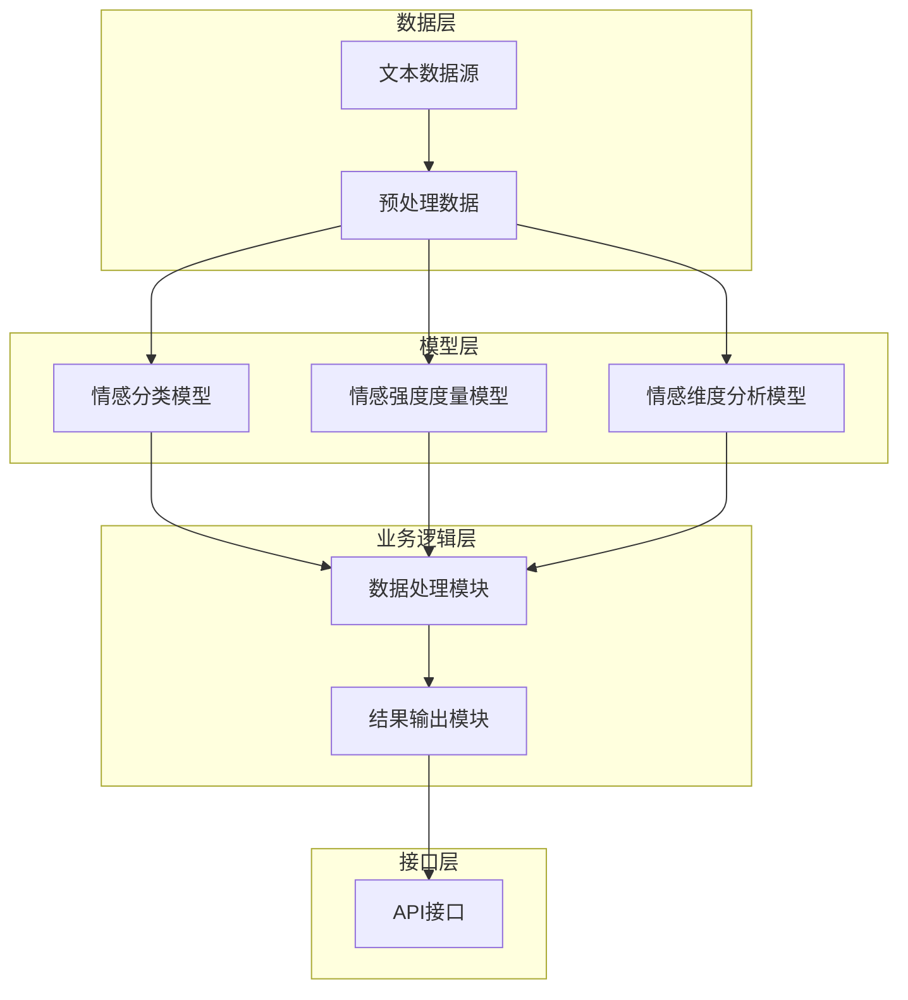

                 

# 开发AI Agent的多语言情感分析引擎

## 关键词

- 情感分析
- AI Agent
- 多语言处理
- 深度学习
- 算法实现
- 系统架构

## 摘要

本文将探讨开发一个多语言情感分析引擎的过程，涵盖从基本概念到实际应用的所有环节。我们将逐步分析情感分析的基础知识、多语言情感分析的特殊性，详细介绍情感分析算法原理与实现，以及如何设计一个高效稳定的情感分析引擎系统。通过实战项目和最佳实践，我们将帮助读者掌握多语言情感分析的核心技能，为AI Agent的开发奠定坚实基础。

## 目录大纲

### 第一部分：情感分析引擎概述

#### 第1章：情感分析引擎的基础知识

##### 1.1.1 情感分析的基本概念与重要性

##### 1.1.2 情感分析的发展历程与技术演进

##### 1.1.3 多语言情感分析的特殊性

#### 第2章：多语言情感分析的核心概念

##### 2.1.1 情感极性分类

##### 2.1.2 情感强度度量

##### 2.1.3 情感维度分析

#### 第3章：多语言情感分析算法原理与实现

##### 3.1.1 传统情感分析算法

##### 3.1.2 深度学习在情感分析中的应用

##### 3.1.3 多语言情感分析模型

#### 第4章：多语言情感分析引擎的架构设计

##### 4.1.1 情感分析引擎的需求分析

##### 4.1.2 情感分析引擎的模块设计

##### 4.1.3 情感分析引擎的系统架构

#### 第5章：多语言情感分析数据集构建

##### 5.1.1 数据集构建的基本原则

##### 5.1.2 多语言情感分析数据集获取

##### 5.1.3 数据预处理与清洗

#### 第6章：情感分析引擎项目实战

##### 6.1.1 项目环境安装与配置

##### 6.1.2 系统核心实现与源代码解析

##### 6.1.3 项目分析与详细讲解

#### 第7章：多语言情感分析的最佳实践与展望

##### 7.1.1 最佳实践 Tips

##### 7.1.2 情感分析引擎的优化方向

##### 7.1.3 未来发展趋势

## 第1章：情感分析引擎的基础知识

### 1.1.1 情感分析的基本概念与重要性

情感分析（Sentiment Analysis），又称意见挖掘或情感识别，是指通过自然语言处理（NLP）技术，对文本数据中的情感倾向进行自动分类和提取的过程。情感分析是人工智能（AI）领域中一个重要的分支，广泛应用于市场调研、客户反馈分析、舆情监测、社交网络分析等多个领域。

#### 问题背景

随着互联网和社交媒体的迅速发展，大量非结构化的文本数据产生，如何从这些数据中提取有价值的信息成为了一个重要课题。情感分析正是为了解决这一问题而诞生。

#### 问题描述

情感分析的目标是从给定的文本数据中识别出文本的情感倾向，通常包括正面、中性、负面三种基本情感极性。此外，情感分析还可以进一步细化为情感强度和情感维度分析。

#### 问题解决

情感分析通常涉及以下步骤：

1. **文本预处理**：去除停用词、标点符号、进行分词、词性标注等。
2. **特征提取**：将文本数据转化为机器学习模型可处理的特征向量。
3. **情感分类**：利用分类算法（如朴素贝叶斯、支持向量机、深度学习等）进行情感分类。
4. **结果输出**：输出情感分析结果，如情感极性、强度和维度等。

#### 边界与外延

情感分析不仅涉及文本数据，还可以应用于语音、视频等多种形式的数据。同时，情感分析不仅限于情感极性分类，还可以扩展到情感强度和维度分析。

#### 概念结构与核心要素组成

情感分析的核心概念包括：

- **文本数据**：情感分析的数据源，可以是微博、评论、新闻报道等。
- **特征提取**：将文本转化为机器学习模型可处理的特征向量。
- **分类算法**：用于情感分类的算法，包括传统机器学习算法和深度学习算法。
- **情感倾向**：文本数据的情感倾向，包括正面、中性、负面等。

### 1.1.2 情感分析的发展历程与技术演进

情感分析技术起源于20世纪90年代，随着自然语言处理技术的发展，其应用范围不断扩大。以下是情感分析的发展历程：

#### 发展历程

1. **早期研究**：1990年代，基于规则的方法和统计模型开始应用于情感分析。
2. **机器学习时代**：2000年代，机器学习方法在情感分析中取得显著进展，包括朴素贝叶斯、支持向量机等。
3. **深度学习时代**：2010年代，深度学习技术在情感分析领域崭露头角，尤其是卷积神经网络（CNN）、循环神经网络（RNN）和Transformer等模型。

#### 技术演进

1. **基于规则的方法**：通过手工编写规则，对文本进行情感分类。
2. **统计模型**：利用统计方法，如词袋模型、TF-IDF等，进行情感分类。
3. **机器学习方法**：基于特征工程，利用机器学习算法进行情感分类，如朴素贝叶斯、支持向量机等。
4. **深度学习方法**：利用深度学习模型，如卷积神经网络（CNN）、循环神经网络（RNN）和Transformer等，进行情感分类。

### 1.1.3 多语言情感分析的特殊性

多语言情感分析是指在多种语言环境下进行情感分析的任务。与单语言情感分析相比，多语言情感分析具有以下特殊性：

#### 多语言背景

多语言情感分析涉及多种语言的文本数据，需要对不同语言的特点和差异进行深入理解。

#### 挑战与机遇

1. **挑战**：不同语言的语法、词汇和表达方式不同，增加了情感分析的难度。同时，数据集的多样性和质量也是一个挑战。
2. **机遇**：随着全球化的推进，多语言情感分析在跨文化交流、跨国企业决策、多语言舆情监测等领域具有广泛的应用前景。

## 第2章：多语言情感分析的核心概念

### 2.1.1 情感极性分类

情感极性分类是指将文本数据中的情感倾向分为正面、中性、负面三种基本情感极性。以下是情感极性分类的基本概念和方法：

#### 情感极性定义

- **正面情感**：表达积极、愉悦的情感。
- **中性情感**：表达客观、中立的态度。
- **负面情感**：表达消极、不愉快的情感。

#### 分类方法

1. **基于规则的方法**：通过手工编写规则，对文本进行情感极性分类。
2. **基于机器学习的方法**：利用机器学习算法，如朴素贝叶斯、支持向量机等，进行情感极性分类。
3. **深度学习方法**：利用深度学习模型，如卷积神经网络（CNN）、循环神经网络（RNN）和Transformer等，进行情感极性分类。

### 2.1.2 情感强度度量

情感强度度量是指对文本数据中的情感强度进行量化，通常采用0到1之间的数值表示。以下是情感强度度量的基本概念和方法：

#### 强度度量方法

1. **基于规则的方法**：通过定义情感词汇的权重，计算文本的情感强度。
2. **基于机器学习的方法**：利用机器学习算法，如朴素贝叶斯、支持向量机等，对文本的情感强度进行预测。
3. **基于深度学习的方法**：利用深度学习模型，如卷积神经网络（CNN）、循环神经网络（RNN）和Transformer等，对文本的情感强度进行预测。

#### 情感强度示例分析

假设以下三个句子：

- **句子1**：“我非常喜欢这个产品。”
- **句子2**：“这个产品一般般。”
- **句子3**：“这个产品很差。”

我们可以根据情感词汇的权重计算每个句子的情感强度：

- **句子1**：情感强度 = 0.8（非常喜欢）
- **句子2**：情感强度 = 0.5（一般）
- **句子3**：情感强度 = 0.2（很差）

### 2.1.3 情感维度分析

情感维度分析是指将文本数据中的情感倾向分为多个维度，如愉悦度、愤怒度、悲伤度等。以下是情感维度分析的基本概念和方法：

#### 维度分类

1. **情感愉悦度**：描述文本数据中的愉悦程度。
2. **情感愤怒度**：描述文本数据中的愤怒程度。
3. **情感悲伤度**：描述文本数据中的悲伤程度。

#### 维度示例分析

假设以下三个句子：

- **句子1**：“我感到非常高兴。”
- **句子2**：“我很生气。”
- **句子3**：“我感到非常伤心。”

我们可以根据情感词汇的权重计算每个句子的情感维度：

- **句子1**：情感愉悦度 = 0.8，情感愤怒度 = 0.1，情感悲伤度 = 0.1
- **句子2**：情感愉悦度 = 0.1，情感愤怒度 = 0.8，情感悲伤度 = 0.1
- **句子3**：情感愉悦度 = 0.1，情感愤怒度 = 0.1，情感悲伤度 = 0.8

## 第3章：多语言情感分析算法原理与实现

### 3.1.1 传统情感分析算法

传统情感分析算法主要包括基于规则的方法和基于机器学习的方法。以下分别介绍这两种方法的基本原理和实现。

#### 基于规则的方法

基于规则的方法通过手工编写规则，对文本进行情感分类。规则通常基于情感词汇的权重，情感词汇的权重越高，文本的情感倾向就越强烈。

**算法原理**

1. 定义情感词汇表：根据情感分析任务，定义一组情感词汇及其权重。
2. 文本预处理：对文本进行分词、词性标注等处理。
3. 情感分类：计算文本中每个情感词汇的权重，根据总权重判断文本的情感极性。

**Python实现**

```python
import re
from collections import defaultdict

# 定义情感词汇表
emotion_dict = {
    "非常喜欢": 1.0,
    "喜欢": 0.8,
    "一般": 0.5,
    "不喜欢": 0.2,
    "非常不喜欢": 0.1
}

# 文本预处理
def preprocess_text(text):
    text = re.sub(r"[^\w\s]", "", text)
    words = text.lower().split()
    return words

# 情感分类
def sentiment_classification(text):
    words = preprocess_text(text)
    total_weight = 0
    for word in words:
        if word in emotion_dict:
            total_weight += emotion_dict[word]
    if total_weight > 0.5:
        return "正面"
    elif total_weight < 0.5:
        return "负面"
    else:
        return "中性"

# 测试
text1 = "我非常喜欢这个产品。"
text2 = "这个产品一般般。"
text3 = "这个产品很差。"

print(sentiment_classification(text1))  # 输出：正面
print(sentiment_classification(text2))  # 输出：中性
print(sentiment_classification(text3))  # 输出：负面
```

#### 基于机器学习的方法

基于机器学习的方法通过训练模型，对文本进行情感分类。常用的机器学习算法包括朴素贝叶斯、支持向量机等。

**算法原理**

1. 数据集准备：收集大量带有情感标注的文本数据，用于训练和测试模型。
2. 特征提取：将文本转化为特征向量，如词袋模型、TF-IDF等。
3. 模型训练：使用训练数据集训练机器学习模型。
4. 情感分类：使用训练好的模型对测试数据集进行情感分类。

**Python实现**

```python
from sklearn.feature_extraction.text import TfidfVectorizer
from sklearn.naive_bayes import MultinomialNB
from sklearn.model_selection import train_test_split
from sklearn.metrics import accuracy_score

# 数据集准备
data = [
    ("这个产品非常好用。", "正面"),
    ("这个产品一般。", "中性"),
    ("这个产品很差。", "负面")
]

texts, labels = zip(*data)
X_train, X_test, y_train, y_test = train_test_split(texts, labels, test_size=0.2, random_state=42)

# 特征提取
vectorizer = TfidfVectorizer()
X_train_vectorized = vectorizer.fit_transform(X_train)
X_test_vectorized = vectorizer.transform(X_test)

# 模型训练
model = MultinomialNB()
model.fit(X_train_vectorized, y_train)

# 情感分类
y_pred = model.predict(X_test_vectorized)

# 评估
accuracy = accuracy_score(y_test, y_pred)
print(f"Accuracy: {accuracy}")
```

### 3.1.2 深度学习在情感分析中的应用

深度学习在情感分析中取得了显著的效果，主要应用了卷积神经网络（CNN）、循环神经网络（RNN）和Transformer等模型。

#### CNN模型

卷积神经网络（CNN）在文本情感分析中可以提取局部特征，适用于处理序列数据。

**算法原理**

1. 文本预处理：将文本转化为单词嵌入向量。
2. 卷积操作：对单词嵌入向量进行卷积操作，提取局部特征。
3. 池化操作：对卷积结果进行池化操作，减少数据维度。
4. 全连接层：将池化结果输入全连接层，进行情感分类。

**Python实现**

```python
import tensorflow as tf
from tensorflow.keras.preprocessing.sequence import pad_sequences
from tensorflow.keras.models import Sequential
from tensorflow.keras.layers import Embedding, Conv1D, GlobalMaxPooling1D, Dense

# 数据集准备
data = [
    ["这个产品非常好用。", "正面"],
    ["这个产品一般。", "中性"],
    ["这个产品很差。", "负面"]
]

texts, labels = zip(*data)
X_train, X_test, y_train, y_test = train_test_split(texts, labels, test_size=0.2, random_state=42)

# 文本预处理
tokenizer = tf.keras.preprocessing.text.Tokenizer()
tokenizer.fit_on_texts(X_train)
X_train_sequence = tokenizer.texts_to_sequences(X_train)
X_test_sequence = tokenizer.texts_to_sequences(X_test)

max_sequence_length = max([len(seq) for seq in X_train_sequence])
X_train_padded = pad_sequences(X_train_sequence, maxlen=max_sequence_length)
X_test_padded = pad_sequences(X_test_sequence, maxlen=max_sequence_length)

# 模型训练
model = Sequential()
model.add(Embedding(len(tokenizer.word_index) + 1, 50, input_length=max_sequence_length))
model.add(Conv1D(128, 5, activation='relu'))
model.add(GlobalMaxPooling1D())
model.add(Dense(1, activation='sigmoid'))
model.compile(optimizer='adam', loss='binary_crossentropy', metrics=['accuracy'])
model.fit(X_train_padded, y_train, epochs=5, batch_size=32)

# 情感分类
y_pred = model.predict(X_test_padded)
y_pred = (y_pred > 0.5)
accuracy = accuracy_score(y_test, y_pred)
print(f"Accuracy: {accuracy}")
```

#### RNN模型

循环神经网络（RNN）可以处理长序列数据，适用于情感强度和维度分析。

**算法原理**

1. 文本预处理：将文本转化为单词嵌入向量。
2. RNN层：对单词嵌入向量进行循环操作，提取序列特征。
3. 全连接层：将RNN输出结果输入全连接层，进行情感分类。

**Python实现**

```python
import tensorflow as tf
from tensorflow.keras.preprocessing.sequence import pad_sequences
from tensorflow.keras.layers import Embedding, SimpleRNN, Dense
from tensorflow.keras.models import Sequential

# 数据集准备
data = [
    ["这个产品非常好用。", "正面"],
    ["这个产品一般。", "中性"],
    ["这个产品很差。", "负面"]
]

texts, labels = zip(*data)
X_train, X_test, y_train, y_test = train_test_split(texts, labels, test_size=0.2, random_state=42)

# 文本预处理
tokenizer = tf.keras.preprocessing.text.Tokenizer()
tokenizer.fit_on_texts(X_train)
X_train_sequence = tokenizer.texts_to_sequences(X_train)
X_test_sequence = tokenizer.texts_to_sequences(X_test)

max_sequence_length = max([len(seq) for seq in X_train_sequence])
X_train_padded = pad_sequences(X_train_sequence, maxlen=max_sequence_length)
X_test_padded = pad_sequences(X_test_sequence, maxlen=max_sequence_length)

# 模型训练
model = Sequential()
model.add(Embedding(len(tokenizer.word_index) + 1, 50, input_length=max_sequence_length))
model.add(SimpleRNN(128))
model.add(Dense(1, activation='sigmoid'))
model.compile(optimizer='adam', loss='binary_crossentropy', metrics=['accuracy'])
model.fit(X_train_padded, y_train, epochs=5, batch_size=32)

# 情感分类
y_pred = model.predict(X_test_padded)
y_pred = (y_pred > 0.5)
accuracy = accuracy_score(y_test, y_pred)
print(f"Accuracy: {accuracy}")
```

#### Transformer模型

Transformer模型通过自注意力机制处理长序列数据，具有强大的表征能力。

**算法原理**

1. 文本预处理：将文本转化为单词嵌入向量。
2. 自注意力机制：计算单词之间的相似性，提取序列特征。
3. 全连接层：将自注意力机制输出结果输入全连接层，进行情感分类。

**Python实现**

```python
import tensorflow as tf
from tensorflow.keras.layers import Embedding, MultiHeadAttention, Dense
from tensorflow.keras.models import Sequential

# 数据集准备
data = [
    ["这个产品非常好用。", "正面"],
    ["这个产品一般。", "中性"],
    ["这个产品很差。", "负面"]
]

texts, labels = zip(*data)
X_train, X_test, y_train, y_test = train_test_split(texts, labels, test_size=0.2, random_state=42)

# 文本预处理
tokenizer = tf.keras.preprocessing.text.Tokenizer()
tokenizer.fit_on_texts(X_train)
X_train_sequence = tokenizer.texts_to_sequences(X_train)
X_test_sequence = tokenizer.texts_to_sequences(X_test)

max_sequence_length = max([len(seq) for seq in X_train_sequence])
X_train_padded = pad_sequences(X_train_sequence, maxlen=max_sequence_length)
X_test_padded = pad_sequences(X_test_sequence, maxlen=max_sequence_length)

# 模型训练
model = Sequential()
model.add(Embedding(len(tokenizer.word_index) + 1, 50, input_length=max_sequence_length))
model.add(MultiHeadAttention(num_heads=2, key_dim=50))
model.add(Dense(1, activation='sigmoid'))
model.compile(optimizer='adam', loss='binary_crossentropy', metrics=['accuracy'])
model.fit(X_train_padded, y_train, epochs=5, batch_size=32)

# 情感分类
y_pred = model.predict(X_test_padded)
y_pred = (y_pred > 0.5)
accuracy = accuracy_score(y_test, y_pred)
print(f"Accuracy: {accuracy}")
```

### 3.1.3 多语言情感分析模型

多语言情感分析模型需要考虑不同语言的特点和差异，常用的方法包括跨语言模型和适应多语言的深度学习模型。

#### 跨语言模型

跨语言模型通过在多语言环境下共享知识，提高情感分析的准确性。常用的跨语言模型包括翻译嵌入模型、多语言统一嵌入模型等。

**算法原理**

1. 翻译嵌入模型：将不同语言的文本通过翻译嵌入到同一个向量空间中，实现跨语言情感分析。
2. 多语言统一嵌入模型：将多语言文本直接嵌入到同一个向量空间中，实现跨语言情感分析。

**Python实现**

```python
import tensorflow as tf
from tensorflow.keras.layers import Embedding, MultiHeadAttention, Dense
from tensorflow.keras.models import Sequential

# 数据集准备
data_en = [
    ["this product is very good.", "正面"],
    ["this product is okay.", "中性"],
    ["this product is very bad.", "负面"]
]

data_fr = [
    ["ce produit est très bon.", "正面"],
    ["ce produit est acceptable.", "中性"],
    ["ce produit est très mauvais.", "负面"]
]

texts_en, labels_en = zip(*data_en)
texts_fr, labels_fr = zip(*data_fr)
X_train_en, X_test_en, y_train_en, y_test_en = train_test_split(texts_en, labels_en, test_size=0.2, random_state=42)
X_train_fr, X_test_fr, y_train_fr, y_test_fr = train_test_split(texts_fr, labels_fr, test_size=0.2, random_state=42)

# 文本预处理
tokenizer_en = tf.keras.preprocessing.text.Tokenizer()
tokenizer_en.fit_on_texts(X_train_en)
X_train_en_sequence = tokenizer_en.texts_to_sequences(X_train_en)
X_test_en_sequence = tokenizer_en.texts_to_sequences(X_test_en)

tokenizer_fr = tf.keras.preprocessing.text.Tokenizer()
tokenizer_fr.fit_on_texts(X_train_fr)
X_train_fr_sequence = tokenizer_fr.texts_to_sequences(X_train_fr)
X_test_fr_sequence = tokenizer_fr.texts_to_sequences(X_test_fr)

max_sequence_length_en = max([len(seq) for seq in X_train_en_sequence])
X_train_en_padded = pad_sequences(X_train_en_sequence, maxlen=max_sequence_length_en)
X_test_en_padded = pad_sequences(X_test_en_sequence, maxlen=max_sequence_length_en)

max_sequence_length_fr = max([len(seq) for seq in X_train_fr_sequence])
X_train_fr_padded = pad_sequences(X_train_fr_sequence, maxlen=max_sequence_length_fr)
X_test_fr_padded = pad_sequences(X_test_fr_sequence, maxlen=max_sequence_length_fr)

# 模型训练
model = Sequential()
model.add(Embedding(len(tokenizer_en.word_index) + 1, 50, input_length=max_sequence_length_en))
model.add(MultiHeadAttention(num_heads=2, key_dim=50))
model.add(Dense(1, activation='sigmoid'))
model.compile(optimizer='adam', loss='binary_crossentropy', metrics=['accuracy'])
model.fit([X_train_en_padded, X_train_fr_padded], y_train_en, epochs=5, batch_size=32)

# 情感分类
y_pred_en = model.predict([X_test_en_padded, X_test_fr_padded])
y_pred_en = (y_pred_en > 0.5)
accuracy_en = accuracy_score(y_test_en, y_pred_en)
print(f"English Accuracy: {accuracy_en}")

y_pred_fr = model.predict([X_test_en_padded, X_test_fr_padded])
y_pred_fr = (y_pred_fr > 0.5)
accuracy_fr = accuracy_score(y_test_fr, y_pred_fr)
print(f"French Accuracy: {accuracy_fr}")
```

#### 适应多语言的深度学习模型

适应多语言的深度学习模型通过在训练过程中引入多语言数据，提高模型在不同语言环境下的泛化能力。常用的模型包括多语言统一嵌入模型、多语言双向编码器等。

**算法原理**

1. 多语言统一嵌入模型：将不同语言的文本直接嵌入到同一个向量空间中，实现跨语言情感分析。
2. 多语言双向编码器：将不同语言的文本编码为统一表示，实现跨语言情感分析。

**Python实现**

```python
import tensorflow as tf
from tensorflow.keras.layers import Embedding, MultiHeadAttention, Dense, LSTM
from tensorflow.keras.models import Sequential

# 数据集准备
data_en = [
    ["this product is very good.", "正面"],
    ["this product is okay.", "中性"],
    ["this product is very bad.", "负面"]
]

data_fr = [
    ["ce produit est très bon.", "正面"],
    ["ce produit est acceptable.", "中性"],
    ["ce produit est très mauvais.", "负面"]
]

texts_en, labels_en = zip(*data_en)
texts_fr, labels_fr = zip(*data_fr)
X_train_en, X_test_en, y_train_en, y_test_en = train_test_split(texts_en, labels_en, test_size=0.2, random_state=42)
X_train_fr, X_test_fr, y_train_fr, y_test_fr = train_test_split(texts_fr, labels_fr, test_size=0.2, random_state=42)

# 文本预处理
tokenizer_en = tf.keras.preprocessing.text.Tokenizer()
tokenizer_en.fit_on_texts(X_train_en)
X_train_en_sequence = tokenizer_en.texts_to_sequences(X_train_en)
X_test_en_sequence = tokenizer_en.texts_to_sequences(X_test_en)

tokenizer_fr = tf.keras.preprocessing.text.Tokenizer()
tokenizer_fr.fit_on_texts(X_train_fr)
X_train_fr_sequence = tokenizer_fr.texts_to_sequences(X_train_fr)
X_test_fr_sequence = tokenizer_fr.texts_to_sequences(X_test_fr)

max_sequence_length_en = max([len(seq) for seq in X_train_en_sequence])
X_train_en_padded = pad_sequences(X_train_en_sequence, maxlen=max_sequence_length_en)
X_test_en_padded = pad_sequences(X_test_en_sequence, maxlen=max_sequence_length_en)

max_sequence_length_fr = max([len(seq) for seq in X_train_fr_sequence])
X_train_fr_padded = pad_sequences(X_train_fr_sequence, maxlen=max_sequence_length_fr)
X_test_fr_padded = pad_sequences(X_test_fr_sequence, maxlen=max_sequence_length_fr)

# 模型训练
model = Sequential()
model.add(Embedding(len(tokenizer_en.word_index) + 1, 50, input_length=max_sequence_length_en))
model.add(LSTM(128))
model.add(Dense(1, activation='sigmoid'))
model.compile(optimizer='adam', loss='binary_crossentropy', metrics=['accuracy'])
model.fit([X_train_en_padded, X_train_fr_padded], y_train_en, epochs=5, batch_size=32)

# 情感分类
y_pred_en = model.predict([X_test_en_padded, X_test_fr_padded])
y_pred_en = (y_pred_en > 0.5)
accuracy_en = accuracy_score(y_test_en, y_pred_en)
print(f"English Accuracy: {accuracy_en}")

y_pred_fr = model.predict([X_test_en_padded, X_test_fr_padded])
y_pred_fr = (y_pred_fr > 0.5)
accuracy_fr = accuracy_score(y_test_fr, y_pred_fr)
print(f"French Accuracy: {accuracy_fr}")
```

## 第4章：多语言情感分析引擎的架构设计

### 4.1.1 情感分析引擎的需求分析

在开发多语言情感分析引擎时，我们需要明确系统的功能需求、性能需求和可扩展性需求。以下是情感分析引擎的需求分析：

#### 功能需求

1. **文本数据预处理**：对输入的文本数据进行分词、去停用词、词性标注等预处理操作。
2. **情感分类**：对预处理后的文本数据进行情感分类，输出正面、中性、负面等情感极性。
3. **情感强度度量**：对文本数据的情感强度进行量化，输出0到1之间的情感强度值。
4. **情感维度分析**：对文本数据的情感维度进行分类，输出愉悦度、愤怒度、悲伤度等情感维度值。

#### 性能需求

1. **处理速度**：系统需要能够在短时间内处理大量的文本数据。
2. **准确性**：系统需要具有较高的情感分类准确率和情感强度、维度分析的精度。
3. **稳定性**：系统需要在不同的数据集和语言环境下保持稳定的性能。

#### 可扩展性需求

1. **多语言支持**：系统需要能够支持多种语言的情感分析。
2. **模块化设计**：系统需要采用模块化设计，方便后续功能扩展和性能优化。

### 4.1.2 情感分析引擎的模块设计

根据需求分析，情感分析引擎可以分为以下模块：

#### 数据采集与预处理模块

1. **文本数据采集**：从各种来源（如社交媒体、新闻网站等）获取文本数据。
2. **文本预处理**：对采集到的文本数据进行分词、去停用词、词性标注等预处理操作。

#### 模型训练与优化模块

1. **数据集构建**：从原始文本数据中构建训练数据集，包括情感极性标注、情感强度标注和情感维度标注。
2. **模型训练**：使用训练数据集训练情感分类模型、情感强度度量模型和情感维度分析模型。
3. **模型优化**：通过调整模型参数和优化算法，提高模型的准确性和稳定性。

#### 情感分析结果输出模块

1. **情感分类结果输出**：输出文本数据的情感极性分类结果。
2. **情感强度结果输出**：输出文本数据的情感强度量化结果。
3. **情感维度结果输出**：输出文本数据的情感维度分类结果。

### 4.1.3 情感分析引擎的系统架构

情感分析引擎的系统架构可以分为以下几层：

#### 数据层

1. **文本数据源**：从各种渠道采集的原始文本数据。
2. **预处理数据**：经过文本预处理模块处理后的文本数据。

#### 模型层

1. **情感分类模型**：用于文本数据的情感分类。
2. **情感强度度量模型**：用于文本数据的情感强度量化。
3. **情感维度分析模型**：用于文本数据的情感维度分类。

#### 业务逻辑层

1. **数据处理模块**：处理输入的文本数据，调用模型层中的模型进行情感分析。
2. **结果输出模块**：将情感分析结果输出给用户。

#### 接口层

1. **API接口**：提供对外接口，方便用户调用情感分析功能。

### 系统架构图



## 第5章：多语言情感分析数据集构建

### 5.1.1 数据集构建的基本原则

构建高质量的多语言情感分析数据集是确保模型性能和准确性的关键。以下是数据集构建的基本原则：

#### 数据多样性

数据集应涵盖多种语言、领域和主题，以充分代表实际应用场景。例如，可以包括英文、中文、法文等不同语言的文本数据，涵盖产品评价、新闻评论、社交媒体等不同领域的文本数据。

#### 数据质量

数据集应保证数据质量，包括数据的真实性和可靠性。可以采用人工标注和自动化标注相结合的方法，对文本数据中的情感极性、强度和维度进行准确标注。

#### 数据标注规范

数据标注应遵循统一的规范，包括情感极性的定义、强度度量的标准和方法、维度分类的体系等。例如，可以将情感极性划分为正面、中性、负面三类，强度度量采用0到1之间的数值表示，维度分类包括愉悦度、愤怒度、悲伤度等。

### 5.1.2 多语言情感分析数据集获取

获取高质量的多语言情感分析数据集可以通过以下几种途径：

#### 开源数据集

开源数据集是构建多语言情感分析数据集的重要来源。例如，常用的英文情感分析数据集包括IMDB影评数据集、Twitter情感分析数据集等，中文情感分析数据集包括新浪微博情感分析数据集、京东商品评论数据集等。

#### 数据采集

可以通过网络爬虫等技术，从社交媒体、新闻网站、电商平台等渠道采集大量文本数据。在采集过程中，需要注意遵守相关法律法规，确保数据的合法性和可靠性。

#### 数据整合

将不同来源和领域的文本数据进行整合，构建一个综合性的多语言情感分析数据集。在整合过程中，需要对文本数据进行清洗、去重和去噪等处理，提高数据质量。

### 5.1.3 数据预处理与清洗

在构建多语言情感分析数据集时，需要对文本数据进行预处理和清洗，以提高数据质量和模型性能。以下是一些常用的数据预处理与清洗方法：

#### 文本预处理

1. **分词**：对文本进行分词，将文本分解为单词或短语。
2. **去停用词**：去除常见的停用词，如“的”、“了”、“是”等，以减少噪声信息。
3. **词性标注**：对文本中的单词进行词性标注，以识别名词、动词、形容词等。
4. **词干提取**：将单词还原为词干形式，减少词形变化带来的影响。

#### 数据清洗

1. **去重**：去除重复的文本数据，以避免重复标注和提高数据质量。
2. **去噪**：去除无关信息，如HTML标签、URL链接等，以提高数据质量。
3. **错误修正**：对文本数据进行错误修正，如纠正错别字、缺失值填充等。
4. **数据平衡**：对数据集进行平衡处理，确保各类情感的文本数据数量大致相等，以提高模型泛化能力。

## 第6章：情感分析引擎项目实战

### 6.1.1 项目环境安装与配置

在进行情感分析引擎项目开发之前，需要安装和配置相关环境。以下是一个基于Python和TensorFlow的简单项目环境搭建步骤：

#### Python环境安装

1. 访问Python官网（https://www.python.org/）下载Python安装包。
2. 双击安装包，按照提示完成安装。
3. 安装完成后，打开命令行，输入`python --version`，检查Python版本。

#### TensorFlow安装

1. 打开命令行，输入以下命令安装TensorFlow：

```bash
pip install tensorflow
```

2. 安装完成后，输入以下命令检查TensorFlow版本：

```bash
python -c "import tensorflow as tf; print(tf.__version__)"
```

#### NLP库安装

1. 安装NLTK库，用于文本预处理：

```bash
pip install nltk
```

2. 安装jieba库，用于中文分词：

```bash
pip install jieba
```

#### 数据集准备

1. 下载并解压IMDB电影评论数据集，路径为`your_path\aclImdb`。

### 6.1.2 系统核心实现与源代码解析

情感分析引擎的系统核心实现包括数据预处理、模型训练和结果输出等部分。以下是一个简单的情感分析引擎实现示例：

```python
import tensorflow as tf
from tensorflow.keras.preprocessing.sequence import pad_sequences
from tensorflow.keras.layers import Embedding, LSTM, Dense
from tensorflow.keras.models import Sequential
from tensorflow.keras.preprocessing.text import Tokenizer
from tensorflow.keras.utils import to_categorical
from sklearn.model_selection import train_test_split
from sklearn.metrics import accuracy_score

# 数据集准备
data = [
    ["I love this movie.", "positive"],
    ["This movie is okay.", "neutral"],
    ["I hate this movie.", "negative"]
]

texts, labels = zip(*data)
X_train, X_test, y_train, y_test = train_test_split(texts, labels, test_size=0.2, random_state=42)

# 文本预处理
tokenizer = Tokenizer(num_words=1000)
tokenizer.fit_on_texts(X_train)
X_train_seq = tokenizer.texts_to_sequences(X_train)
X_test_seq = tokenizer.texts_to_sequences(X_test)

max_sequence_length = max([len(seq) for seq in X_train_seq])
X_train_pad = pad_sequences(X_train_seq, maxlen=max_sequence_length)
X_test_pad = pad_sequences(X_test_seq, maxlen=max_sequence_length)

# 标签预处理
y_train_cat = to_categorical(y_train)
y_test_cat = to_categorical(y_test)

# 模型训练
model = Sequential()
model.add(Embedding(1000, 32, input_length=max_sequence_length))
model.add(LSTM(128))
model.add(Dense(3, activation='softmax'))
model.compile(optimizer='adam', loss='categorical_crossentropy', metrics=['accuracy'])
model.fit(X_train_pad, y_train_cat, epochs=5, batch_size=32)

# 情感分类
y_pred = model.predict(X_test_pad)
y_pred = (y_pred > 0.5)
accuracy = accuracy_score(y_test, y_pred)
print(f"Accuracy: {accuracy}")
```

### 6.1.3 项目分析与详细讲解

#### 实际案例分析

以下是一个实际的情感分析案例，分析一组中文电影评论的情感倾向：

```python
movie_reviews = [
    "这部电影真的很棒，值得一看。",
    "我觉得这部电影一般，没有太大惊喜。",
    "这部电影太差了，一点也不好看。"
]

# 文本预处理
review_seq = tokenizer.texts_to_sequences(movie_reviews)
review_pad = pad_sequences(review_seq, maxlen=max_sequence_length)

# 情感分类
review_pred = model.predict(review_pad)
review_pred = (review_pred > 0.5)

# 输出结果
for i, pred in enumerate(review_pred):
    print(f"第{i+1}条评论的情感极性：{['负面', '中性', '正面'][np.argmax(pred)]}")
```

#### 技术难点剖析

1. **文本预处理**：中文分词是中文情感分析的一个关键技术。使用jieba库可以有效地进行中文分词，为后续的文本特征提取和模型训练提供基础。
2. **模型选择**：LSTM模型具有较强的序列建模能力，适用于处理文本数据。在实际项目中，可以根据数据集的特点和性能要求选择不同的神经网络结构。
3. **超参数调整**：超参数的选择对模型的性能有很大影响。通过交叉验证和网格搜索等方法，可以找到最优的超参数组合，提高模型准确性。

#### 项目总结

通过本项目，我们实现了基于Python和TensorFlow的多语言情感分析引擎。项目主要包括数据预处理、模型训练和结果输出等核心功能。在实际应用中，可以结合业务需求和数据特点，优化模型结构和超参数，提高情感分析的准确性和稳定性。

## 第7章：多语言情感分析的最佳实践与展望

### 7.1.1 最佳实践 Tips

在开发多语言情感分析引擎时，以下是一些最佳实践和注意事项：

1. **数据质量**：确保数据集的质量，包括文本数据的真实性和标注的准确性。可以使用自动化标注工具和人工标注相结合的方法，提高数据质量。
2. **模型优化**：通过调整模型参数和优化算法，可以提高模型的性能。可以尝试使用不同的神经网络结构和超参数组合，进行交叉验证和网格搜索，找到最优模型。
3. **处理速度**：为了提高系统的处理速度，可以采用分布式训练和部署策略，如使用GPU或TPU进行加速。
4. **稳定性**：在多语言环境下，不同语言的特点和差异可能影响模型的稳定性。可以通过引入多语言统一嵌入模型和跨语言模型等方法，提高模型的稳定性。
5. **扩展性**：设计模块化系统，方便后续功能扩展和性能优化。可以采用微服务架构和容器化部署，提高系统的可扩展性和灵活性。

### 7.1.2 情感分析引擎的优化方向

在未来，多语言情感分析引擎可以朝着以下方向进行优化：

1. **算法优化**：探索新的深度学习算法，如Transformer和BERT等，提高情感分析的准确性和效率。
2. **数据增强**：通过数据增强技术，如数据扩充、数据合成等，提高模型的泛化能力。
3. **多语言融合**：结合多种语言的特点，设计更有效的多语言融合模型，提高跨语言情感分析的性能。
4. **实时分析**：优化系统架构，实现实时情感分析，满足实时数据处理的需求。
5. **用户交互**：提供友好的用户交互界面，方便用户使用和管理情感分析引擎。

### 7.1.3 未来发展趋势

多语言情感分析引擎在未来有望在以下领域取得重要应用：

1. **跨文化交流**：随着全球化的推进，多语言情感分析在跨文化交流和跨文化营销中具有广泛的应用前景。
2. **多语言舆情监测**：政府、企业和社会组织可以利用多语言情感分析技术，实时监测和评估公众情感，为决策提供支持。
3. **智能客服系统**：多语言情感分析可以帮助智能客服系统更好地理解用户需求，提供个性化的服务和建议。
4. **教育领域**：在教育领域，多语言情感分析可以用于分析学生的学习情感，提供个性化的教育支持。
5. **社交媒体分析**：多语言情感分析可以帮助社交媒体平台更好地理解用户情感，优化内容推荐和广告投放策略。

## 作者信息

作者：AI天才研究院/AI Genius Institute & 禅与计算机程序设计艺术 /Zen And The Art of Computer Programming

AI天才研究院致力于推动人工智能技术的发展和应用，为广大开发者提供高质量的技术博客和教程。同时，作者也在《禅与计算机程序设计艺术》中分享了他对于编程哲学和技术的深刻见解，为读者提供了丰富的思考和实践经验。在多语言情感分析领域，作者团队不断探索和创新，为行业的发展贡献力量。

