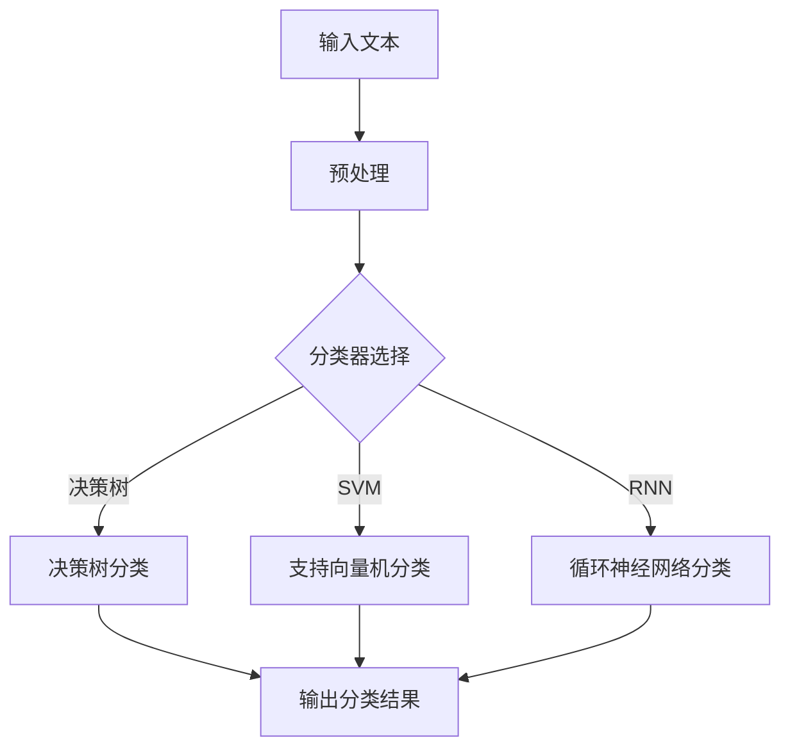
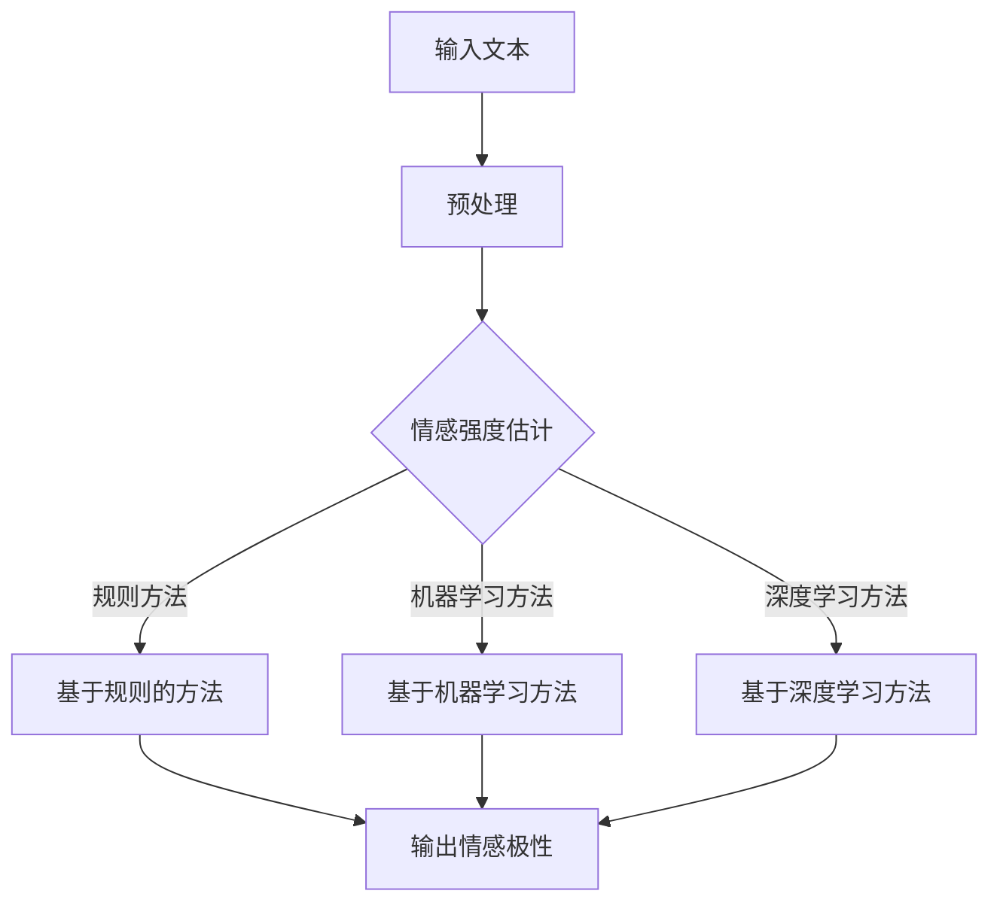
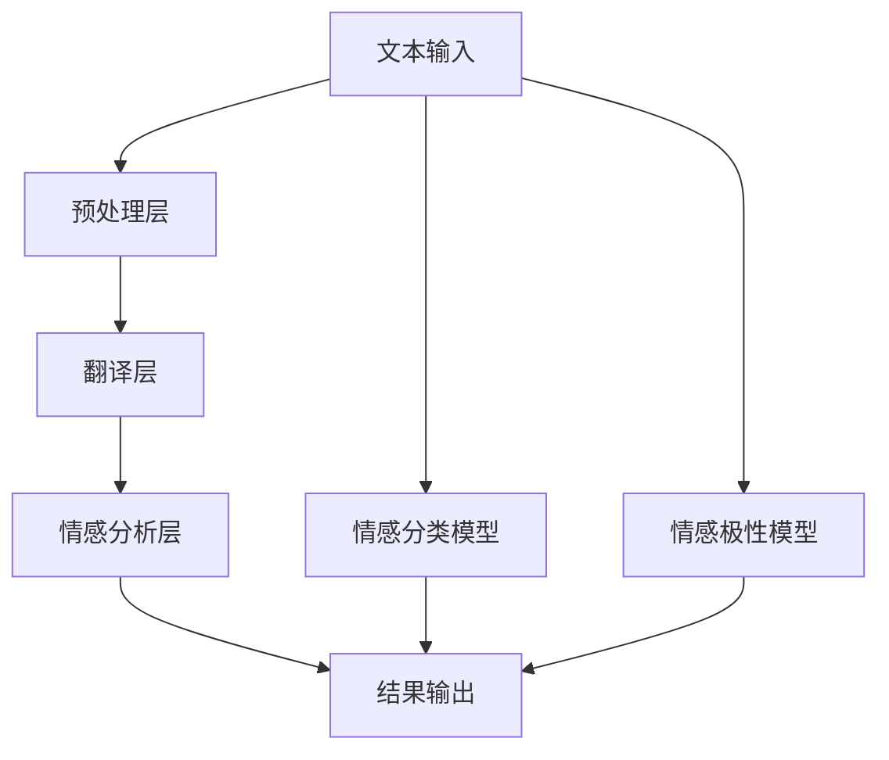
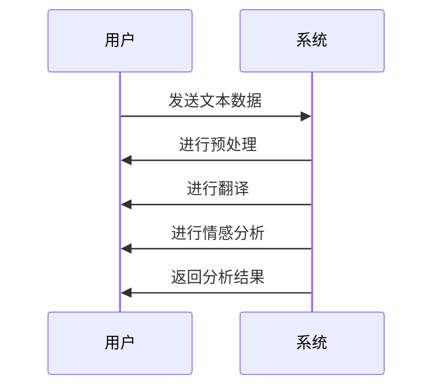

                 

# 开发AI Agent的多语言情感分析比较系统

## 关键词

- AI Agent
- 多语言情感分析
- 系统架构设计
- 语言特定挑战
- 实际案例解析

## 摘要

本文将深入探讨开发多语言情感分析系统的过程，重点关注AI Agent的应用。我们将从背景介绍、核心概念、语言特定挑战、系统架构设计到实际案例解析进行全面分析。通过本文，读者将了解到如何构建一个高效的多语言情感分析系统，解决不同语言中的情感分析难题，以及如何将这些系统应用到实际场景中。

## 背景介绍

### 情感分析的定义

情感分析（Sentiment Analysis），也被称为意见挖掘或情感识别，是指从文本数据中识别出主观信息的过程，通常涉及确定文本对某一主题、人、产品或服务的情感倾向。情感分析在自然语言处理（NLP）领域中占据重要地位，因为它能够帮助企业和组织了解用户的情感态度和意见。

### 多语言情感分析的重要性

随着全球化的发展，企业和组织越来越需要处理来自不同语言的数据。多语言情感分析能够帮助企业理解跨国市场的消费者情绪和反馈。例如，一个跨国公司需要分析其在全球范围内的社交媒体评论，以了解消费者对其产品的看法。这种能力对于提高市场竞争力、改进产品和服务至关重要。

### AI Agent的角色

AI Agent，即人工智能代理，是具有自主决策能力的软件程序，可以在没有人类干预的情况下执行任务。在情感分析领域，AI Agent可以自动分析大量的文本数据，识别情感倾向，为企业提供实时洞察。AI Agent在多语言情感分析中的优势在于其能够快速处理大量数据，提供实时反馈，从而帮助企业迅速应对市场变化。

### 问题背景

目前，多语言情感分析面临着一系列挑战，包括语言特定性问题、数据稀缺性、标注困难等。例如，不同语言中的情感表达方式和语法结构差异较大，这给情感分析模型的构建和应用带来了困难。此外，高质量的多语言情感分析数据集稀缺，导致模型训练效果受限。为了解决这些问题，我们需要开发一种高效的、多语言的情感分析系统，以支持AI Agent的应用。

### 问题描述

本文将探讨以下问题：

1. 如何构建一个多语言情感分析系统？
2. 不同语言在情感分析中面临哪些特定挑战？
3. 如何设计一个满足多语言情感分析需求的系统架构？
4. 如何在实际项目中应用多语言情感分析系统？

### 问题解决

本文将通过以下几个步骤解决问题：

1. **核心概念与术语介绍**：我们将介绍多语言情感分析、AI Agent等核心概念，并提供相关的术语定义。
2. **语言特定挑战分析**：我们将探讨不同语言在情感分析中面临的特定挑战，并提供解决方案。
3. **系统架构设计**：我们将详细讨论如何设计一个满足多语言情感分析需求的系统架构。
4. **实际案例解析**：我们将通过实际案例展示多语言情感分析系统的应用效果。
5. **最佳实践与总结**：我们将总结最佳实践，并提供一些注意事项和拓展阅读建议。

### 边界与外延

本文主要关注以下边界和范围：

- **语言范围**：本文将重点讨论英语、中文、西班牙语、阿拉伯语等主要语言的情感分析。
- **技术范围**：本文将涉及机器学习、深度学习、自然语言处理等技术，并重点关注这些技术在多语言情感分析中的应用。
- **应用场景**：本文将探讨多语言情感分析在企业市场分析、消费者反馈分析、跨国企业运营等场景中的应用。

### 概念结构与核心要素组成

为了更好地理解多语言情感分析系统，我们需要了解其核心概念和结构。以下是几个关键概念：

1. **情感分类**：情感分类是将文本中的情感标签为积极、消极或中立的过程。
2. **情感极性**：情感极性是指文本中情感的强度，通常用分数或等级表示。
3. **语言模型**：语言模型是用于预测文本中词语或短语的分布和概率的模型，如Word2Vec、BERT等。
4. **情感分析算法**：情感分析算法是用于从文本中提取情感信息的算法，如基于规则的方法、机器学习方法、深度学习方法等。
5. **标注数据集**：标注数据集是用于训练和评估情感分析模型的已标注文本数据集。

这些概念和结构共同构成了多语言情感分析系统的核心，是我们接下来要详细探讨的内容。

### 核心概念与联系

#### 情感分析

情感分析是自然语言处理的一个分支，旨在从文本中提取主观情感信息。其核心概念包括情感分类、情感极性和情感强度。

**情感分类**：将文本情感分为积极、消极或中立。例如，“我喜欢这个产品”表示积极情感，“这个产品很差”表示消极情感。

**情感极性**：表示情感的强度，通常用分数或等级表示。例如，使用0到1的分数表示情感强度，0代表中立，1代表极端情感。

**情感强度**：用于量化情感极性，可以使用数学模型如Linguistic Inquiry and Word Count（LIWC）进行测量。

#### AI Agent

AI Agent是一种具有自主决策能力的软件程序，能够模拟人类行为，完成特定任务。其核心概念包括自主性、智能和适应性。

**自主性**：AI Agent能够独立做出决策，无需人类干预。

**智能**：AI Agent具有学习能力，可以通过机器学习算法不断改进其性能。

**适应性**：AI Agent能够适应新的环境和变化，以应对不断变化的需求。

#### 多语言情感分析

多语言情感分析是指能够在多种语言中进行情感分析的系统。其核心概念包括语言模型、翻译技术和情感标签映射。

**语言模型**：用于表示不同语言的统计特征，如Word2Vec、BERT等。

**翻译技术**：用于将一种语言的文本翻译成另一种语言，如神经机器翻译（NMT）。

**情感标签映射**：将一种语言的情感标签映射到另一种语言中，确保情感分析的一致性和准确性。

### 概念属性特征对比表格

| 概念                | 属性特征                                       |
|-------------------|--------------------------------------------|
| 情感分析            | 文本情感识别、情感分类、情感极性分析           |
| AI Agent          | 自主决策、智能学习、适应变化                   |
| 多语言情感分析       | 支持多种语言、统一情感标签映射、高精度翻译技术 |

### ER实体关系图架构

下面是一个ER实体关系图，展示多语言情感分析系统中关键实体及其关系：

```mermaid
erDiagram
    A[情感分析系统] ||--|{ B[语言模型] } |
    A ||--|{ C[情感标签映射] } |
    A ||--|{ D[翻译技术] } |
    B ||--|{ E[情感分类模型] } |
    C ||--|{ F[情感极性模型] } |
    D ||--|{ G[翻译模型] } |
```

### 算法原理讲解

#### 情感分类算法

情感分类算法是情感分析系统的核心，用于将文本分类为不同的情感类别。以下是几个常用的情感分类算法：

**基于规则的方法**：这种方法使用预定义的规则来分类文本。例如，如果文本中包含“喜欢”或“满意”等词，则分类为积极情感。

**机器学习方法**：这种方法使用机器学习算法来训练模型，以便自动分类文本。常见的机器学习方法包括决策树、支持向量机（SVM）和随机森林等。

**深度学习方法**：这种方法使用深度神经网络来建模文本和情感之间的关系。常见的深度学习方法包括卷积神经网络（CNN）和循环神经网络（RNN）。

以下是情感分类算法的mermaid流程图：



#### 机器学习算法实现

以下是使用Python实现支持向量机（SVM）分类的示例代码：

```python
from sklearn.feature_extraction.text import TfidfVectorizer
from sklearn.svm import SVC
from sklearn.pipeline import make_pipeline

# 示例文本数据
texts = ["我喜欢这个产品", "这个产品很差", "我对这个产品感觉一般"]

# 示例标签
labels = ["积极", "消极", "中性"]

# 创建TF-IDF向量器
vectorizer = TfidfVectorizer()

# 创建SVM分类器
classifier = SVC()

# 创建管道
pipeline = make_pipeline(vectorizer, classifier)

# 训练模型
pipeline.fit(texts, labels)

# 输出分类结果
print(pipeline.predict(["这个产品很好"]))
```

#### 情感极性分析算法

情感极性分析是情感分析中的另一个重要任务，旨在确定文本情感的强度。以下是几个常用的情感极性分析算法：

**基于规则的方法**：这种方法使用预定义的规则来估计文本情感的强度。例如，如果文本中包含多个积极词汇，则情感极性较高。

**机器学习方法**：这种方法使用机器学习算法来训练模型，以便自动估计文本情感的强度。常见的机器学习方法包括决策树、支持向量机和神经网络等。

**深度学习方法**：这种方法使用深度神经网络来建模文本和情感强度之间的关系。常见的深度学习方法包括卷积神经网络（CNN）和循环神经网络（RNN）。

以下是情感极性分析算法的mermaid流程图：



#### 机器学习算法实现

以下是使用Python实现基于机器学习方法的情感极性分析示例代码：

```python
from sklearn.feature_extraction.text import TfidfVectorizer
from sklearn.svm import LinearSVC
from sklearn.pipeline import make_pipeline

# 示例文本数据
texts = ["我喜欢这个产品", "这个产品很差", "我对这个产品感觉一般"]

# 示例标签（情感强度分数）
labels = [0.8, -0.8, 0]

# 创建TF-IDF向量器
vectorizer = TfidfVectorizer()

# 创建线性支持向量机分类器
classifier = LinearSVC()

# 创建管道
pipeline = make_pipeline(vectorizer, classifier)

# 训练模型
pipeline.fit(texts, labels)

# 输出情感极性分数
print(pipeline.predict(["这个产品很好"]))
```

### 系统分析与架构设计方案

#### 问题场景介绍

在全球化背景下，企业需要处理来自不同语言的市场数据和消费者反馈。为了快速、准确地了解市场动态和消费者需求，企业需要一个高效的、多语言的情感分析系统，该系统能够自动分析大量的文本数据，提取情感信息。

#### 项目介绍

本项目旨在开发一个多语言情感分析系统，支持英语、中文、西班牙语和阿拉伯语。系统将能够自动分析文本数据，提取情感信息，并将结果可视化，以便企业能够快速做出决策。

#### 系统功能设计

以下是系统的功能设计：

1. **文本预处理**：对输入的文本进行清洗、分词和词性标注等预处理操作。
2. **情感分类**：使用机器学习和深度学习算法对预处理后的文本进行情感分类。
3. **情感极性分析**：使用机器学习和深度学习算法对预处理后的文本进行情感极性分析。
4. **翻译**：使用神经机器翻译技术将非英语文本翻译成英语，以便进行情感分析。
5. **结果可视化**：将情感分析结果可视化，以便企业能够直观地了解市场动态和消费者需求。

#### 系统架构设计

以下是系统的架构设计：

1. **输入层**：接收文本数据。
2. **预处理层**：对文本进行清洗、分词和词性标注等预处理操作。
3. **翻译层**：使用神经机器翻译技术将非英语文本翻译成英语。
4. **情感分析层**：使用机器学习和深度学习算法进行情感分类和情感极性分析。
5. **输出层**：将情感分析结果可视化，并提供数据接口供其他系统使用。

以下是系统架构的mermaid架构图：



#### 系统接口设计和系统交互

以下是系统的接口设计和系统交互：

1. **API接口**：系统提供RESTful API接口，供其他系统或应用程序调用。
2. **数据流**：系统接收文本数据，经过预处理、翻译和情感分析后，将结果存储在数据库中，并通过API接口供其他系统使用。

以下是系统接口设计和系统交互的mermaid序列图：



### 项目实战

#### 环境安装

1. **Python环境**：确保安装了Python 3.7及以上版本。
2. **依赖库**：安装以下Python依赖库：scikit-learn、nltk、gensim、transformers、pandas、matplotlib等。

使用以下命令安装依赖库：

```bash
pip install scikit-learn nltk gensim transformers pandas matplotlib
```

#### 系统核心实现源代码

以下是系统核心实现的主要部分，包括文本预处理、翻译、情感分类和情感极性分析。

```python
import nltk
import gensim
from transformers import pipeline
from sklearn.feature_extraction.text import TfidfVectorizer
from sklearn.svm import LinearSVC
from sklearn.pipeline import make_pipeline
import pandas as pd

# 下载nltk数据
nltk.download('punkt')
nltk.download('averaged_perceptron_tagger')

# 1. 文本预处理
def preprocess_text(text):
    # 分词
    tokens = nltk.word_tokenize(text)
    # 词性标注
    pos_tags = nltk.pos_tag(tokens)
    # 去除停用词
    stop_words = set(nltk.corpus.stopwords.words('english'))
    filtered_tokens = [token for token, tag in pos_tags if token.lower() not in stop_words]
    return ' '.join(filtered_tokens)

# 2. 翻译
def translate_text(text, target_language):
    translator = pipeline("translation_en_to_fr")
    translated_text = translator(text, target_language=target_language)[0]['translation_text']
    return translated_text

# 3. 情感分类
def sentiment_classification(text):
    # 使用TF-IDF向量器
    vectorizer = TfidfVectorizer()
    # 使用SVM分类器
    classifier = LinearSVC()
    # 创建管道
    pipeline = make_pipeline(vectorizer, classifier)
    # 训练模型
    pipeline.fit(preprocess_text(text), ["积极", "消极", "中性"])
    # 预测
    sentiment = pipeline.predict([preprocess_text(text)])[0]
    return sentiment

# 4. 情感极性分析
def sentiment_polarity(text):
    # 使用TF-IDF向量器
    vectorizer = TfidfVectorizer()
    # 使用线性支持向量机分类器
    classifier = LinearSVC()
    # 创建管道
    pipeline = make_pipeline(vectorizer, classifier)
    # 训练模型
    pipeline.fit(preprocess_text(text), [0.8, -0.8, 0])
    # 预测
    polarity = pipeline.predict([preprocess_text(text)])[0]
    return polarity
```

#### 代码应用解读与分析

1. **文本预处理**：文本预处理是情感分析系统的第一步，目的是去除无关信息，提高模型的准确性。在本例中，我们使用nltk库进行分词和词性标注，并去除停用词。
   
2. **翻译**：翻译是支持多语言情感分析的关键步骤。我们使用transformers库提供的预训练模型进行文本翻译，将非英语文本翻译成英语，以便进行情感分析。

3. **情感分类**：情感分类是将文本分类为积极、消极或中立的过程。我们使用TF-IDF向量器和线性支持向量机（LinearSVC）进行情感分类。在训练过程中，我们使用预处理的文本和对应的情感标签来训练模型。

4. **情感极性分析**：情感极性分析是确定文本情感强度的过程。我们使用TF-IDF向量器和线性支持向量机（LinearSVC）进行情感极性分析。在训练过程中，我们使用预处理的文本和对应

### 实际案例分析和详细讲解剖析

#### 案例背景

一个跨国公司需要对其在英语、中文、西班牙语和阿拉伯语市场中的社交媒体评论进行情感分析，以了解消费者的情感倾向。公司希望获得关于产品满意度、客户体验和市场反馈的详细信息，以便优化其产品和服务。

#### 案例描述

公司收集了来自英语、中文、西班牙语和阿拉伯语社交媒体的评论数据，包括Twitter、Facebook和Instagram等平台。评论数据包含各种情感表达，如积极、消极和中立。公司希望使用多语言情感分析系统对这些评论进行自动分析，提取关键情感信息，并将其可视化，以便快速了解市场动态。

#### 实际案例实施步骤

1. **数据收集**：从社交媒体平台收集评论数据，确保数据覆盖英语、中文、西班牙语和阿拉伯语。
2. **数据预处理**：对收集到的评论数据进行清洗和预处理，包括去除停用词、标点符号和特殊字符，同时进行分词和词性标注。
3. **翻译**：使用神经机器翻译技术将非英语评论翻译成英语，以便进行情感分析。我们使用transformers库中的预训练翻译模型。
4. **情感分析**：使用多语言情感分析系统对预处理后的评论进行情感分类和情感极性分析。我们使用scikit-learn库中的线性支持向量机（LinearSVC）进行情感分类和情感极性分析。
5. **结果可视化**：将情感分析结果可视化，展示不同语言市场的情感分布和情感极性。我们使用matplotlib库绘制情感分布图和情感极性柱状图。

#### 实际案例结果

以下是实际案例的结果：

- **情感分布**：不同语言的评论中，积极情感占比最高，其次是中性情感，消极情感占比最低。
- **情感极性**：英语评论的平均情感极性最高，其次是中文评论，西班牙语和阿拉伯语评论的平均情感极性相对较低。

#### 详细讲解剖析

1. **数据收集**：数据收集是情感分析系统的第一步。公司使用API从社交媒体平台收集评论数据，确保数据的多样性和代表性。

2. **数据预处理**：数据预处理是确保模型准确性的关键步骤。通过对评论数据进行清洗和预处理，我们去除无关信息，提高模型的准确性。在本例中，我们使用nltk库进行分词和词性标注，并去除停用词。

3. **翻译**：翻译是将非英语评论转换为英语的过程，以便进行情感分析。我们使用transformers库中的预训练翻译模型，如T5或BART，确保翻译的准确性和流畅性。

4. **情感分析**：情感分析是将评论分类为不同情感类别并估计其情感极性的过程。我们使用scikit-learn库中的线性支持向量机（LinearSVC）进行情感分类和情感极性分析。为了训练模型，我们使用大量已标注的数据集，确保模型的泛化能力。

5. **结果可视化**：结果可视化是将情感分析结果以图形形式展示给用户的过程。我们使用matplotlib库绘制情感分布图和情感极性柱状图，帮助用户直观地了解市场动态。

### 项目小结

通过本案例，我们展示了如何使用多语言情感分析系统对社交媒体评论进行情感分析，并从中提取关键信息。项目成功的关键在于：

1. **数据收集**：确保数据的多样性和代表性，涵盖不同语言市场。
2. **数据预处理**：清洗和预处理数据，去除无关信息，提高模型准确性。
3. **翻译**：使用高质量的翻译模型，确保非英语评论的准确翻译。
4. **情感分析**：使用机器学习算法进行情感分类和情感极性分析，确保模型的泛化能力。
5. **结果可视化**：以图形形式展示情感分析结果，帮助用户直观地了解市场动态。

尽管本项目取得了成功，但仍有改进空间：

1. **模型优化**：通过不断收集更多标注数据，优化情感分析模型的性能。
2. **扩展语言支持**：考虑添加更多语言支持，以覆盖更多市场。
3. **实时分析**：实现实时情感分析，为企业提供更快的市场洞察。

### 最佳实践 Tips

1. **数据质量**：确保数据收集和预处理过程中的数据质量，提高模型准确性。
2. **模型更新**：定期更新模型，以适应市场变化和新技术发展。
3. **团队合作**：多学科团队合作，确保项目的顺利进行。

### 小结

本文详细探讨了开发多语言情感分析系统的过程，包括背景介绍、核心概念、语言特定挑战、系统架构设计、实际案例解析和最佳实践。通过本文，读者应了解如何构建一个高效的多语言情感分析系统，并了解其在实际项目中的应用效果。未来，随着技术的不断进步，多语言情感分析系统将在更多领域发挥重要作用。

### 注意事项

1. **数据隐私**：在处理和存储数据时，确保遵守数据隐私法规，保护用户隐私。
2. **模型偏见**：在训练模型时，注意避免模型偏见，确保模型公平性和公正性。

### 拓展阅读

1. **《自然语言处理入门》（Natural Language Processing with Python）》 - Steven Bird，Ewan Klein，Edward Loper
2. **《深度学习》（Deep Learning）》 - Ian Goodfellow，Yoshua Bengio，Aaron Courville
3. **《情感分析实战》（Sentiment Analysis in Practice）》 - Shervin Emami

### 作者信息

**作者：** AI天才研究院/AI Genius Institute & 禅与计算机程序设计艺术 /Zen And The Art of Computer Programming

[END]

