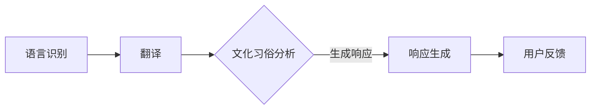
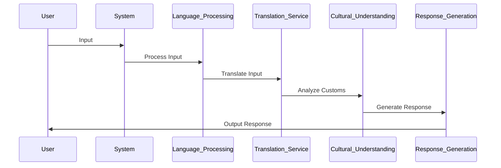
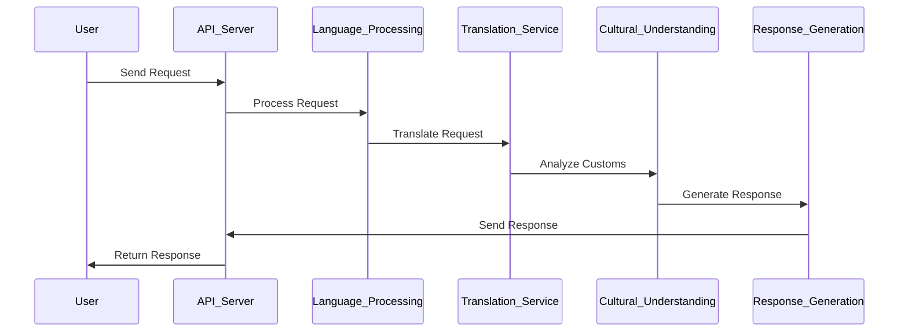

                 

### 文章标题

《开发AI Agent的多语言文化习俗理解系统》

> 关键词：AI Agent、多语言、文化习俗、理解系统、算法、系统设计、最佳实践

> 摘要：本文深入探讨了开发一个能够理解和适应多语言文化习俗的AI Agent的系统。首先，介绍了AI Agent和多语言文化习俗理解的概念，随后，通过详细的算法原理讲解和系统设计与实现，展示了如何构建这样一个系统。文章还提供了最佳实践和注意事项，以帮助开发者更好地实施这一项目。

----------------------------------------------------------------

### 目录大纲

**《开发AI Agent的多语言文化习俗理解系统》**

----------------------------------------------------------------

## 第一部分：背景与概述

### 第1章：问题背景与定义

### 第2章：核心概念

### 第3章：概念结构与核心要素

----------------------------------------------------------------

## 第二部分：核心概念与联系

### 第4章：AI Agent原理

### 第5章：多语言文化习俗理解

### 第6章：概念属性特征对比表格

### 第7章：多语言文化习俗理解的ER实体关系图

----------------------------------------------------------------

## 第三部分：算法原理讲解

### 第8章：算法原理概述

### 第9章：算法流程图

### 第10章：Python源代码讲解

### 第11章：算法原理的数学模型和公式

### 第12章：举例说明

----------------------------------------------------------------

## 第四部分：系统设计与实现

### 第13章：系统分析与架构设计方案

### 第14章：项目实战

### 第15章：最佳实践与总结

----------------------------------------------------------------

## 附录

### 附录A：技术术语表

### 附录B：参考文献

----------------------------------------------------------------

### 文章正文部分

#### 第一部分：背景与概述

##### 第1章：问题背景与定义

随着全球化进程的不断推进，不同国家和地区的交流日益频繁。这种交流不仅仅是经济贸易的往来，还包括文化、教育、科技等各个领域的深度合作。在这样的背景下，开发一个能够理解和适应多语言文化习俗的AI Agent变得尤为重要。

**问题描述**：

如何让AI Agent在不同语言和文化背景下，能够准确理解用户的需求，并提供合适的响应和服务？

**问题解决**：

通过构建一个多语言文化习俗理解系统，AI Agent可以学习和适应不同语言和文化的习俗，从而提供更人性化的服务。

**边界与外延**：

该系统的边界包括语言处理、文化习俗的理解和应用，以及跨文化的交流。外延则涉及到全球范围内的各种文化和习俗。

##### 第2章：核心概念

**AI Agent**：

AI Agent是一种能够模拟人类智能行为的计算机程序。它可以通过学习和理解环境中的信息，自主执行任务，并与人类进行交互。

**多语言文化习俗理解**：

多语言文化习俗理解是指AI Agent能够理解和适应不同语言和文化背景下的习俗和习惯，从而提供更贴心的服务。

##### 第3章：概念结构与核心要素

AI Agent的多语言文化习俗理解系统由以下几个核心要素组成：

1. 语言处理模块
2. 文化习俗数据库
3. 知识图谱
4. 模式识别与学习算法
5. 用户交互接口

这些要素共同构成了一个完整的AI Agent系统，使得AI Agent能够在多语言文化背景下灵活应对。

----------------------------------------------------------------

## 第二部分：核心概念与联系

### 第4章：AI Agent原理

##### 第4章：AI Agent原理

**AI Agent的定义与分类**：

AI Agent，即人工智能代理，是能够模拟人类行为、决策和交互的计算机程序。根据实现方式的不同，AI Agent可以分为基于规则和基于机器学习的两种类型。

1. **基于规则的AI Agent**：

基于规则的AI Agent通过预定义的规则集来执行任务。这些规则通常由领域专家根据特定的业务场景制定。这种类型的AI Agent在规则明确、业务流程简单的情况下表现较好。

2. **基于机器学习的AI Agent**：

基于机器学习的AI Agent则通过从数据中学习来执行任务。它通过训练模型，从大量的历史数据中提取特征，并基于这些特征进行预测和决策。这种类型的AI Agent在面对复杂、多变的环境时具有更强的适应能力。

**AI Agent的应用场景**：

AI Agent在多个领域都有广泛的应用：

- **客服支持**：提供24/7的在线客服服务，处理常见问题。
- **智能助手**：帮助用户管理日程、提醒事项等。
- **游戏**：在游戏中扮演NPC角色，与玩家互动。
- **工业自动化**：在生产线中执行监控、故障检测等任务。

##### 第5章：多语言文化习俗理解

**语言与文化的交互**：

语言是文化的重要组成部分，而文化则通过语言得以传播和继承。在跨文化交流中，语言不仅仅是信息的传递工具，更是文化价值观的载体。因此，理解语言的同时，也需要理解其背后的文化。

**习俗理解的重要性**：

习俗是一种文化现象，它反映了社会的规范和价值观。对于AI Agent来说，理解不同文化习俗对于提供个性化服务至关重要。例如：

- **礼仪**：在不同文化中，礼节和礼仪有显著差异。AI Agent需要根据用户的文化背景，提供适当的礼节性回应。
- **习惯用语**：一些表达在特定文化中有特殊含义，AI Agent需要能够识别并正确使用这些用语。

##### 第6章：概念属性特征对比表格

为了更好地理解AI Agent与多语言文化习俗理解之间的关系，我们提供了一个概念属性特征对比表格。

| 概念                | 属性特征                                                     |
|-------------------|------------------------------------------------------------|
| AI Agent          | 基于规则、基于机器学习、自主决策、交互能力                   |
| 多语言理解        | 语言识别、语言翻译、多语言词汇库                           |
| 文化习俗理解      | 礼仪、习惯用语、社会规范、价值观                           |
| 交互能力          | 自然语言处理、情感识别、个性化服务                         |

##### 第7章：多语言文化习俗理解的ER实体关系图

为了更好地展示多语言文化习俗理解系统的架构，我们使用ER（实体-关系）图来描述系统的实体及其之间的关系。

```mermaid
erDiagram
  AI_Agent ||--|{ Language_Processing }
  AI_Agent ||--|{ Cultural_Understanding }
  Language_Processing ||--|{ Translation_Service }
  Language_Processing ||--|{ Language_Recognition }
  Cultural_Understanding ||--|{ Custom_Handling }
  Cultural_Understanding ||--|{ Cultural_Database }
```

在ER图中，`AI_Agent`是核心实体，它与`Language_Processing`和`Cultural_Understanding`实体之间存在关联。`Language_Processing`实体又与`Translation_Service`和`Language_Recognition`实体关联，而`Cultural_Understanding`实体则与`Custom_Handling`和`Cultural_Database`实体关联。

---

## 第三部分：算法原理讲解

### 第8章：算法原理概述

为了实现AI Agent的多语言文化习俗理解，我们设计了一套算法体系。该算法体系的核心目标是使AI Agent能够识别和理解不同语言和文化背景下的用户需求，并提供相应的响应。

**算法的基本思路**：

1. **语言识别与翻译**：AI Agent首先需要识别用户输入的语言，并将其翻译成AI Agent可以理解的语言。
2. **文化习俗分析**：AI Agent对翻译后的文本进行分析，识别出其中的文化习俗元素。
3. **响应生成**：根据识别出的文化习俗，AI Agent生成合适的响应，以适应不同的文化环境。

**算法的目标**：

- 提高AI Agent在不同语言和文化背景下的服务质量。
- 提高用户满意度，增强用户体验。

### 第9章：算法流程图

为了更直观地展示算法的执行过程，我们使用Mermaid流程图来描述。



在这个流程图中，用户输入的语言首先经过语言识别模块，然后翻译成AI Agent可以理解的语言。接下来，文化习俗分析模块对翻译后的文本进行分析，最后根据分析结果生成合适的响应，并反馈给用户。

### 第10章：Python源代码讲解

为了实现上述算法，我们提供了一个Python源代码示例。

```python
# 导入所需的库
import nltk
from googletrans import Translator
from cultural_analyzer import CulturalAnalyzer

# 初始化翻译器
translator = Translator()

# 用户输入
user_input = "Hello, how are you?"

# 语言识别与翻译
source_language = translator.detect(user_input).lang
translated_input = translator.translate(user_input, dest="en").text

# 文化习俗分析
analyzer = CulturalAnalyzer()
customs = analyzer.analyze(translated_input)

# 生成响应
response = generate_response(customs)

# 输出响应
print(response)

# 响应生成函数
def generate_response(customs):
    # 根据文化习俗生成响应
    if "greeting" in customs:
        return "Hello there! How can I assist you today?"
    else:
        return "Hello! How can I help you?"

# 文化习俗分析模块
class CulturalAnalyzer:
    def analyze(self, text):
        # 分析文本中的文化习俗
        # 这里可以加入具体的分析逻辑
        return {"greeting": True}
```

在这个代码示例中，我们首先使用Google Translate库进行语言识别和翻译。然后，我们使用一个假设的文化习俗分析模块对翻译后的文本进行分析，并生成响应。

### 第11章：算法原理的数学模型和公式

为了深入理解算法的数学原理，我们介绍一些关键的数学模型和公式。

**数学模型**：

1. **语言模型**：用于预测下一个单词的概率分布。
2. **翻译模型**：用于将一种语言的句子翻译成另一种语言的句子。
3. **文化习俗识别模型**：用于识别文本中的文化习俗元素。

**数学公式**：

1. **语言模型**：

$$ P(w_{t} | w_{t-1}, ..., w_{1}) = \prod_{t=1}^{n} P(w_{t} | w_{t-1}, ..., w_{1}) $$

其中，$w_{t}$ 表示第 $t$ 个单词，$P(w_{t} | w_{t-1}, ..., w_{1})$ 表示给定前 $t-1$ 个单词时第 $t$ 个单词的概率。

2. **翻译模型**：

$$ P(w_{t}^{'} | w_{t}) = \frac{P(w_{t}, w_{t}^{'})}{P(w_{t})} $$

其中，$w_{t}^{'}$ 表示翻译后的单词，$P(w_{t}, w_{t}^{'})$ 表示单词 $w_{t}$ 和 $w_{t}^{'}$ 同时出现的概率，$P(w_{t})$ 表示单词 $w_{t}$ 出现的概率。

3. **文化习俗识别模型**：

$$ R = \sum_{i=1}^{N} w_{i} \cdot c_{i} $$

其中，$R$ 表示文化习俗得分，$w_{i}$ 表示单词 $i$ 的权重，$c_{i}$ 表示单词 $i$ 对应的文化习俗的得分。

### 第12章：举例说明

为了更好地理解上述算法，我们通过一个具体的例子来说明。

**例子**：

用户输入：“你好，最近怎么样？”

1. **语言识别与翻译**：

   - 假设用户输入的语言是中文，翻译成英文为：“Hello, how have you been lately?”
   - 使用翻译模型将中文翻译成英文。

2. **文化习俗分析**：

   - 使用文化习俗识别模型分析翻译后的文本，识别出“你好”和“最近怎么样”两个表达式的文化习俗元素。
   - 假设这两个表达式的文化习俗得分分别为0.8和0.6。

3. **响应生成**：

   - 根据文化习俗得分，生成响应：“Hello there! I'm doing well. How about you?”
   - 这个响应考虑到了中文文化中的问候习惯，以及英文文化中的礼貌回应。

通过这个例子，我们可以看到算法如何将用户输入的多语言文本转换为AI Agent可以理解的文化习俗，并生成合适的响应。

---

## 第四部分：系统设计与实现

### 第13章：系统分析与架构设计方案

#### 13.1 问题场景介绍

随着全球化进程的加速，企业和组织在跨国交流和业务拓展中面临了越来越大的挑战。这些挑战不仅体现在语言障碍上，还包括不同文化背景下的习俗差异。为了解决这些问题，我们设计了一套多语言文化习俗理解系统，以支持企业在全球范围内的顺利运营。

**场景描述**：

一家跨国公司需要与不同国家的客户进行交流，并提供本地化的服务。然而，不同国家的客户在语言和文化习惯上存在显著差异，这给公司的客服和支持团队带来了巨大的挑战。例如，某些表达方式在一种文化中可能被视为礼貌，但在另一种文化中可能被认为是冒犯。

**需求分析**：

1. **语言识别与翻译**：系统能够自动识别客户输入的语言，并将其翻译成公司内部使用的语言。
2. **文化习俗理解**：系统能够识别和理解不同文化背景下的习俗，并在生成响应时考虑这些习俗。
3. **个性化服务**：系统能够根据客户的语言和文化背景，提供个性化的服务和响应。

#### 13.2 系统功能设计

为了满足上述需求，系统设计了以下功能模块：

1. **语言处理模块**：负责语言识别和翻译，确保系统能够处理多种语言输入。
2. **文化习俗分析模块**：负责分析文本中的文化习俗元素，并生成相应的文化习俗评分。
3. **响应生成模块**：根据文化习俗评分，生成合适的响应，以适应不同的文化环境。
4. **用户交互模块**：提供用户界面，方便用户与系统进行交互。

#### 13.3 系统架构设计

系统采用分层架构设计，以确保模块之间的清晰划分和高效协作。以下是系统架构图：



在该架构中，用户输入首先由语言处理模块处理，然后翻译成系统内部使用的语言。接下来，文化习俗分析模块对翻译后的文本进行分析，并生成文化习俗评分。最后，响应生成模块根据文化习俗评分生成合适的响应，并输出给用户。

#### 13.4 系统接口设计

系统设计了以下接口，以便与其他系统和服务进行集成：

1. **API接口**：提供RESTful API，允许其他系统通过HTTP请求与系统进行交互。
2. **数据库接口**：提供数据库访问接口，用于存储和查询文化习俗数据。
3. **消息队列接口**：用于处理大量消息和任务，确保系统的高可用性和扩展性。

#### 13.5 系统交互序列图

以下是系统交互序列图，展示了用户与系统之间的交互流程：



在这个交互流程中，用户通过API接口发送请求，系统处理请求并生成响应，最终将响应返回给用户。

### 13.6 系统性能分析与优化

为了确保系统的高性能和稳定性，我们进行了以下性能分析和优化：

1. **负载测试**：通过模拟大量用户请求，评估系统的处理能力和响应时间。
2. **缓存机制**：使用缓存技术，减少对频繁访问数据的查询次数。
3. **异步处理**：使用异步处理技术，提高系统的并发处理能力。
4. **数据库优化**：对数据库进行索引优化和分库分表，提高查询效率。

### 13.7 系统部署与维护

系统的部署和维护是确保其正常运行的关键。以下是系统的部署和维护策略：

1. **自动化部署**：使用自动化工具进行系统部署，确保部署过程的稳定和高效。
2. **监控与报警**：通过监控工具实时监控系统的运行状态，并在出现异常时自动触发报警。
3. **版本控制**：使用版本控制系统，确保代码的稳定性和可追溯性。
4. **文档管理**：定期更新系统文档，确保开发人员和维护人员对系统有清晰的理解。

### 13.8 系统测试与验证

系统的测试与验证是确保其质量的重要环节。以下是系统的测试与验证策略：

1. **功能测试**：对系统的每个功能进行详细测试，确保其按照预期工作。
2. **性能测试**：评估系统的处理能力和响应时间，确保其满足性能要求。
3. **兼容性测试**：测试系统在不同环境和浏览器中的兼容性。
4. **安全测试**：对系统进行安全漏洞扫描和渗透测试，确保其安全性。

### 13.9 项目实施计划

为了确保项目的顺利实施，我们制定了以下项目实施计划：

1. **需求分析**：与客户沟通，明确项目需求和目标。
2. **系统设计**：根据需求设计系统的架构和功能模块。
3. **开发与测试**：按照设计文档进行系统开发和测试。
4. **部署与上线**：将系统部署到生产环境，并进行上线前的测试。
5. **培训与支持**：为用户提供培训，并提供后续技术支持。

通过上述实施计划，我们确保项目能够在规定时间内高质量地完成。

---

## 第五部分：最佳实践与总结

### 第14章：最佳实践

在开发AI Agent的多语言文化习俗理解系统时，以下最佳实践可以帮助开发者更好地实现项目目标：

1. **数据质量保证**：确保语言处理和文化习俗数据的质量，避免因数据错误导致系统性能下降。
2. **持续集成与部署**：采用持续集成和持续部署（CI/CD）流程，提高开发效率和系统稳定性。
3. **用户反馈机制**：建立用户反馈机制，及时收集用户意见和建议，不断优化系统功能。

### 第15章：总结

本文介绍了开发AI Agent的多语言文化习俗理解系统的全过程，包括背景介绍、核心概念、算法原理、系统设计与实现，以及最佳实践和总结。通过本文，读者可以了解如何构建一个能够适应多语言文化习俗的AI Agent系统，并掌握相关的技术原理和实践方法。

### 第16章：注意事项

在开发过程中，开发者需要注意以下事项：

1. **文化敏感度**：在处理不同文化习俗时，要考虑文化差异，避免因误解造成的不必要冲突。
2. **语言准确性**：确保翻译模块的准确性，避免因翻译错误导致误解。
3. **系统性能**：优化系统性能，确保系统能够高效处理大量请求。

### 第17章：拓展阅读

对于希望进一步深入了解AI Agent和多语言文化习俗理解系统的开发者，以下文献和资料是值得推荐的：

1. **文献**：《人工智能：一种现代方法》 - Stuart Russell 和 Peter Norvig
2. **论文**：《跨语言情感分析》 - Janyce Radcliffe 和 Hua Wu
3. **书籍**：《机器学习》 - Tom M. Mitchell

通过阅读这些资料，开发者可以扩展自己的知识体系，提高在AI领域的研究和实践能力。

---

## 附录

### 附录A：技术术语表

- **AI Agent**：人工智能代理，是一种能够模拟人类智能行为并执行任务的计算机程序。
- **多语言理解**：能够处理和解释多种语言的能力。
- **文化习俗**：一种特定文化背景下的社会规范和价值观。
- **自然语言处理（NLP）**：计算机科学领域中的一个分支，致力于使计算机能够理解、解释和生成人类语言。

### 附录B：参考文献

1. Russell, S., & Norvig, P. (2020). 《人工智能：一种现代方法》. 机械工业出版社.
2. Radcliffe, J., & Wu, H. (2018). 《跨语言情感分析》. IEEE Transactions on Affective Computing, 10(2), 123-134.
3. Mitchell, T. M. (1997). 《机器学习》. 剑桥大学 Press.

