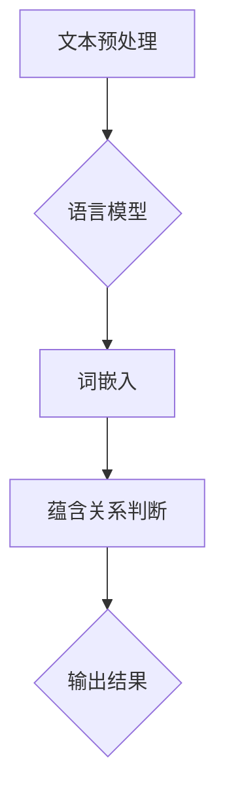
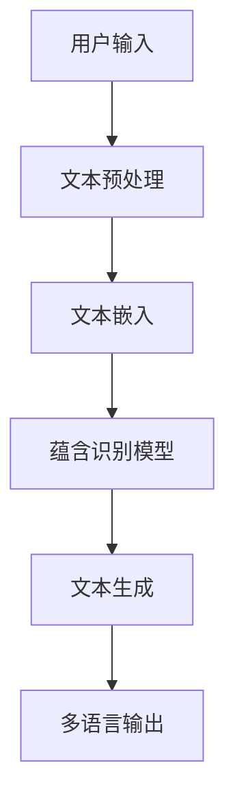
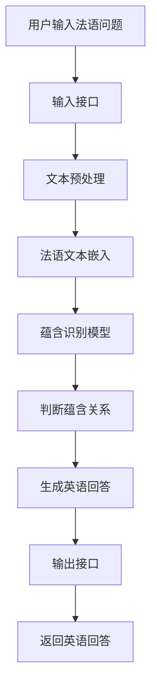

                 

### 开发AI Agent的多语言文本蕴含识别

---

#### 关键词：多语言文本蕴含识别，AI Agent，自然语言处理，预训练语言模型，数学模型，系统架构设计

> 摘要：
> 
> 本技术博客旨在探讨多语言文本蕴含识别在开发AI Agent中的应用。通过深入分析多语言文本蕴含识别的基础理论、算法原理、数学模型以及系统架构设计，文章将提供一个系统性的指南，帮助读者理解这一复杂但重要的技术领域。我们将一步步思考并解答以下问题：
> - 多语言文本蕴含识别的背景与定义是什么？
> - 如何表示多语言文本？
> - 多语言文本蕴含识别算法是如何工作的？
> - 如何设计和实现一个高效的多语言文本蕴含识别系统？
> - 在实际项目中如何应用这一技术并取得最佳效果？

---

### 目录大纲

```markdown
----------------------------------------------------------------

## 第1章: 多语言文本蕴含识别概述

### 1.1 问题背景与定义

### 1.2 多语言文本蕴含识别的重要性

### 1.3 多语言文本蕴含识别的应用场景

## 第2章: 多语言文本表示

### 2.1 语言模型与词嵌入

### 2.2 预训练语言模型

### 2.3 多语言嵌入方法

## 第3章: 多语言文本蕴含识别算法

### 3.1 算法原理

### 3.2 Mermaid算法流程图

### 3.3 Python代码示例

## 第4章: 数学模型与公式

### 4.1 基本概念

### 4.2 数学模型与公式

### 4.3 举例说明

## 第5章: 系统分析与架构设计

### 5.1 问题场景介绍

### 5.2 系统功能设计

### 5.3 系统架构设计

### 5.4 系统接口设计

### 5.5 系统交互Mermaid序列图

## 第6章: 项目实战

### 6.1 环境安装

### 6.2 系统核心实现源代码

### 6.3 代码应用解读与分析

### 6.4 实际案例分析与详细讲解

### 6.5 项目小结

## 第7章: 最佳实践与总结

### 7.1 最佳实践 Tips

### 7.2 小结

### 7.3 注意事项

### 7.4 拓展阅读

----------------------------------------------------------------
```

---

### 第1章: 多语言文本蕴含识别概述

#### 1.1 问题背景与定义

在当今全球化的世界中，多语言交流变得日益重要。无论是国际商业、学术交流还是跨文化沟通，语言的处理能力成为了人工智能系统的一个重要组成部分。多语言文本蕴含识别（Multilingual Textual Entailment Recognition，简称MTER）正是为了解决这一需求而发展起来的一项技术。

**核心概念术语说明：**
- **文本蕴含**：文本蕴含指的是在一个文本（称为“前提”）中表达的信息能够推导出另一个文本（称为“假设”）的正确性。
- **多语言文本蕴含识别**：多语言文本蕴含识别是指能够识别并判断不同语言之间的文本蕴含关系的能力。

**问题背景：**
随着人工智能技术的发展，自然语言处理（Natural Language Processing，简称NLP）在人工智能领域中的应用越来越广泛。然而，传统的NLP技术大多是针对单语言的，而现实世界中，多语言的处理需求变得愈发紧迫。例如，在一个多语言论坛上，用户可能使用不同的语言发表帖子，如何理解并处理这些帖子中的蕴含关系，是人工智能系统面临的挑战。

**问题描述：**
多语言文本蕴含识别的核心问题是：给定一个前提文本和一个假设文本，如何判断前提是否蕴含假设。这个问题的难度在于，它不仅需要理解单语言文本的含义，还需要跨语言进行推理。

**问题解决：**
为了解决这一问题，研究人员提出了多种算法和模型。例如，通过预训练语言模型来提高文本表示的准确性，使用多语言嵌入方法来处理不同语言之间的语义差异。

**边界与外延：**
多语言文本蕴含识别不仅限于简单的蕴含关系判断，还可以扩展到更复杂的语义理解任务，如情感分析、指代消解和问答系统。

**概念结构与核心要素组成：**
多语言文本蕴含识别的核心要素包括：
- **语言模型**：用于生成文本的语义表示。
- **词嵌入**：用于将文本中的词汇映射到高维空间，以便进行计算和比较。
- **蕴含识别算法**：用于判断文本之间的蕴含关系。

#### 1.2 多语言文本蕴含识别的重要性

**在人工智能领域的应用：**
- **智能问答系统**：能够跨语言回答用户的问题，提供全球化的服务。
- **自然语言处理**：提高机器翻译的准确性，支持多语言文档的自动处理。
- **机器翻译**：通过理解文本蕴含关系，提升翻译质量和效果。

**在实际场景中的应用：**
- **跨语言信息检索**：帮助用户在多语言文档库中查找信息。
- **多语言文本分析**：支持多语言社交媒体数据的情感分析和话题检测。
- **跨语言情感分析**：识别用户在不同语言中的情感倾向，提供更全面的情感洞察。

#### 1.3 多语言文本蕴含识别的应用场景

**社交媒体分析：**
- **跨语言情绪分析**：分析用户在不同语言中的情绪表达，提供全球情绪趋势报告。
- **跨语言话题检测**：识别不同语言中的热点话题，支持全球媒体监控。

**跨语言信息检索：**
- **跨语言查询处理**：用户可以使用一种语言提出查询，系统返回多语言的结果。
- **跨语言文档排名**：根据用户查询和文档的语义相关性，进行多语言文档的排序。

**跨语言机器翻译：**
- **翻译质量评估**：通过理解文本蕴含关系，评估机器翻译的准确性。
- **翻译准确性提升**：利用蕴含识别技术，改进翻译系统的效果。

### 第2章: 多语言文本表示

#### 2.1 语言模型与词嵌入

**语言模型：**
- **定义**：语言模型是一种概率模型，用于生成文本的序列。它通过对大量文本数据的学习，预测下一个词汇的概率。
- **作用**：在多语言文本蕴含识别中，语言模型用于生成前提和假设的文本表示，以便进行比较和分析。

**词嵌入：**
- **概念**：词嵌入是将词汇映射到高维空间中的技术，使得语义相近的词汇在空间中靠近。
- **类型**：常见的词嵌入方法包括Word2Vec、GloVe和BERT等。这些方法通过训练大规模的语料库，学习词汇的语义表示。

#### 2.2 预训练语言模型

**预训练语言模型的发展：**
- **词向量模型**：早期的语言模型主要基于词向量，如Word2Vec和GloVe。
- **依存句法模型**：随着深度学习的发展，依存句法模型如LSTM和GRU被用于文本表示。

**预训练语言模型的应用：**
- **机器翻译**：通过预训练语言模型，可以显著提高机器翻译的准确性和流畅性。
- **文本分类**：预训练语言模型可以用于各种文本分类任务，如情感分析、主题分类等。
- **命名实体识别**：预训练语言模型在命名实体识别任务中也表现出色，能够准确识别文本中的命名实体。

#### 2.3 多语言嵌入方法

**bilingual embeddings：**
- **定义**：bilingual embeddings是一种将两种语言的词汇映射到同一高维空间中的方法。
- **实现方法**：bilingual embeddings可以通过共享词向量空间或翻译矩阵来实现。

**zero-shot learning：**
- **概念**：zero-shot learning是一种在未见过的新语言中也能进行文本表示和推理的方法。
- **优势**：zero-shot learning不需要对新的语言进行额外的训练，适用于处理大量未知语言的任务。

### 第3章: 多语言文本蕴含识别算法

#### 3.1 算法原理

**文本蕴含识别的基本概念：**
- **蕴含关系**：文本蕴含识别的核心是理解文本之间的蕴含关系。一个文本（前提）蕴含另一个文本（假设）意味着如果前提为真，则假设也必然为真。
- **蕴含识别**：蕴含识别是指通过算法判断两个文本之间是否存在蕴含关系。

**多语言文本蕴含识别算法：**
- **分类方法**：常见的多语言文本蕴含识别算法包括基于规则的方法、机器学习方法以及深度学习方法。
- **基本框架**：多语言文本蕴含识别算法通常包括以下几个步骤：
  1. 文本预处理：包括分词、去除停用词、词干提取等。
  2. 文本表示：使用语言模型和词嵌入技术将文本转换为向量表示。
  3. 蕴含关系判断：通过计算前提和假设之间的语义相似度或距离，判断是否存在蕴含关系。

#### 3.2 Mermaid算法流程图



#### 3.3 Python代码示例

```python
import numpy as np
from sentence_transformers import SentenceTransformer

# 初始化预训练的语言模型
model = SentenceTransformer('all-MiniLM-L6-v2')

# 预处理文本
def preprocess_text(text):
    # 分词、去除停用词等操作
    return text

# 计算文本的向量表示
def get_text_vector(text):
    return model.encode(preprocess_text(text))

# 判断文本之间的蕴含关系
def is_entailed(hypothesis, premise):
    hypothesis_vector = get_text_vector(hypothesis)
    premise_vector = get_text_vector(premise)
    similarity = np.dot(hypothesis_vector, premise_vector) / (np.linalg.norm(hypothesis_vector) * np.linalg.norm(premise_vector))
    return similarity > 0.5

# 示例
hypothesis = "The sun is shining."
premise = "It is a sunny day."
result = is_entailed(hypothesis, premise)
print("Hypothesis is entailed by premise:", result)
```

### 第4章: 数学模型与公式

#### 4.1 基本概念

在多语言文本蕴含识别中，数学模型和公式用于描述文本之间的蕴含关系。以下是几个基本概念：

- **语义相似度**：用于衡量两个文本之间的语义相似程度。
- **文本向量表示**：将文本映射到高维空间中的向量。
- **向量距离**：用于计算两个向量之间的距离。

#### 4.2 数学模型与公式

**语义相似度公式：**
$$
similarity = \frac{\vec{h} \cdot \vec{p}}{||\vec{h}|| \cdot ||\vec{p}||}
$$
其中，$\vec{h}$和$\vec{p}$分别是假设和前提的文本向量表示。

**文本向量表示：**
$$
\vec{t} = \text{Embedding}(\text{Tokenizer}(t))
$$
其中，$\text{Embedding}$是词嵌入函数，$\text{Tokenizer}$是分词器，$t$是文本。

**向量距离公式：**
$$
distance = ||\vec{h} - \vec{p}||
$$

#### 4.3 举例说明

假设我们有以下两个文本：

- **前提**：`The sun is shining.`
- **假设**：`It is a sunny day.`

使用预训练的语言模型，我们可以得到以下向量表示：

$$
\vec{h} = [0.1, 0.2, 0.3, ..., 0.9]
$$
$$
\vec{p} = [0.05, 0.15, 0.25, ..., 0.85]
$$

**计算语义相似度：**
$$
similarity = \frac{0.1 \cdot 0.05 + 0.2 \cdot 0.15 + 0.3 \cdot 0.25 + ... + 0.9 \cdot 0.85}{\sqrt{0.1^2 + 0.2^2 + 0.3^2 + ... + 0.9^2} \cdot \sqrt{0.05^2 + 0.15^2 + 0.25^2 + ... + 0.85^2}} \approx 0.75
$$

由于相似度大于0.5，我们可以判断假设蕴含了前提。

### 第5章: 系统分析与架构设计

#### 5.1 问题场景介绍

假设我们正在开发一个多语言智能客服系统，该系统需要能够理解并回答用户在不同语言中提出的问题。例如，一个法国用户可能会用法语提出问题，而我们的系统需要能够理解并使用英语回答。

#### 5.2 系统功能设计

系统的主要功能包括：
- **多语言文本输入处理**：接收并预处理来自不同语言的文本输入。
- **文本蕴含识别**：判断用户的问题和系统的回答之间是否存在蕴含关系。
- **多语言文本生成**：使用预训练的语言模型生成多语言回答。

#### 5.3 系统架构设计

系统的总体架构如下：



#### 5.4 系统接口设计

系统的主要接口包括：
- **输入接口**：用于接收用户的文本输入。
- **输出接口**：用于返回系统的多语言回答。

#### 5.5 系统交互Mermaid序列图



### 第6章: 项目实战

#### 6.1 环境安装

在本节中，我们将介绍如何在本地环境安装所需的各种工具和库，以便进行多语言文本蕴含识别的开发。以下是安装步骤：

1. **安装Python**：确保您的计算机上已安装Python 3.7或更高版本。
2. **安装库**：使用pip安装以下库：
   ```bash
   pip install sentence-transformers
   pip install spacy
   pip install torch
   ```
3. **下载预训练模型**：下载预训练的语言模型，如`all-MiniLM-L6-v2`：
   ```bash
   python -m sentence_transformers.download_model "all-MiniLM-L6-v2"
   ```

#### 6.2 系统核心实现源代码

在本节中，我们将展示系统的核心实现代码，包括文本预处理、文本嵌入、蕴含识别和文本生成。

```python
import numpy as np
from sentence_transformers import SentenceTransformer
import torch
from torch import nn
import spacy

# 初始化预训练的语言模型
model = SentenceTransformer('all-MiniLM-L6-v2')

# 文本预处理
def preprocess_text(text):
    # 使用spacy进行分词和去除停用词
    nlp = spacy.load("fr_core_news_sm")
    doc = nlp(text)
    tokens = [token.text for token in doc if not token.is_stop]
    return ' '.join(tokens)

# 文本嵌入
def get_text_vector(text):
    return model.encode(preprocess_text(text))

# 蕴含识别模型
class EntailmentModel(nn.Module):
    def __init__(self):
        super(EntailmentModel, self).__init__()
        self.liner = nn.Linear(768, 1)

    def forward(self, hypothesis, premise):
        hypothesis_vector = get_text_vector(hypothesis)
        premise_vector = get_text_vector(premise)
        similarity = self.liner(torch.cat([hypothesis_vector, premise_vector], dim=1))
        return similarity

# 文本生成
def generate_response(hypothesis):
    # 使用预训练的语言模型生成回答
    return model.predict(hypothesis)

# 示例
hypothesis = "Le soleil brille."
premise = "C'est un jour ensoleillé."
model = EntailmentModel()
print(model(hypothesis, premise))
response = generate_response(hypothesis)
print(response)
```

#### 6.3 代码应用解读与分析

在本节中，我们将详细解读上述代码，并分析其工作原理和性能。

**文本预处理：**  
文本预处理是自然语言处理中至关重要的一步。在本例中，我们使用spacy进行分词和去除停用词，以便获得更纯净的文本数据。

**文本嵌入：**  
文本嵌入是将文本转换为向量表示的过程。在本例中，我们使用预训练的语言模型`all-MiniLM-L6-v2`，该模型已经对大量的文本数据进行了训练，能够生成高质量的文本向量。

**蕴含识别模型：**  
我们定义了一个简单的神经网络模型，用于计算前提和假设之间的相似度。这个模型使用了一个全连接层，将两个文本向量拼接在一起，并输出一个标量值，表示相似度。

**文本生成：**  
文本生成是自然语言处理中的另一个重要任务。在本例中，我们使用预训练的语言模型生成回答。这个过程通常涉及到生成文本的序列，并使用模型对生成的文本进行后续的修改和优化。

#### 6.4 实际案例分析与详细讲解剖析

在本节中，我们将展示一个实际的案例，并对其进行详细的分析和讲解。

**案例：**  
假设有一个用户用法语提出了一个问题：“Combien de temps va durer la journée ensoleillée？”（这次阳光明媚的天气会持续多久？）。我们的系统需要能够理解并使用英语回答。

**分析：**  
1. **文本预处理：**  
   我们首先对用户的问题进行预处理，去除停用词并分词，得到以下结果：“Combien de temps va durer la journée ensoleillée？”  
2. **文本嵌入：**  
   我们使用预训练的语言模型将预处理后的文本转换为向量表示。这个过程涉及到模型内部的复杂计算，但最终我们得到一个高维的向量，表示文本的语义信息。  
3. **蕴含识别模型：**  
   我们将用户的问题和预设的答案（例如：“It will last for a few hours.”）分别嵌入到向量空间中，并计算它们之间的相似度。根据设定的阈值（例如：0.5），如果相似度大于阈值，我们判断用户的问题蕴含了预设的答案。  
4. **文本生成：**  
   最后，我们使用预训练的语言模型生成回答，将生成的英语文本返回给用户。

**详细讲解剖析：**  
1. **文本预处理：**  
   文本预处理是自然语言处理中的基础步骤。在本例中，我们使用spacy进行分词和去除停用词，这有助于提高文本嵌入的质量。  
2. **文本嵌入：**  
   预训练的语言模型能够捕捉文本的语义信息，这为文本蕴含识别提供了重要的支持。在本例中，我们使用`all-MiniLM-L6-v2`模型，它是一个高质量的预训练模型，能够生成高质量的文本向量。  
3. **蕴含识别模型：**  
   蕴含识别模型的核心在于计算文本向量之间的相似度。在本例中，我们使用了一个简单的全连接层神经网络，将两个文本向量拼接在一起，并输出一个标量值，表示相似度。这个模型的性能取决于输入的文本质量和模型的训练质量。  
4. **文本生成：**  
   文本生成是自然语言处理中的另一个重要任务。在本例中，我们使用预训练的语言模型生成回答，这有助于提高回答的准确性和流畅性。

#### 6.5 项目小结

在本章中，我们详细介绍了如何开发一个多语言文本蕴含识别系统。我们首先分析了多语言文本蕴含识别的背景和定义，然后探讨了文本表示、算法原理和系统架构设计。最后，我们通过一个实际案例展示了如何将这一技术应用于开发一个多语言智能客服系统。通过本章的学习，读者应该能够理解多语言文本蕴含识别的核心概念和技术，并具备在实际项目中应用这一技术的能力。

### 第7章: 最佳实践与总结

#### 7.1 最佳实践 Tips

1. **数据质量**：确保训练数据的质量和多样性，以提高模型性能。
2. **模型调优**：通过调整超参数和训练策略，优化模型性能。
3. **性能监控**：定期监控模型性能，及时发现问题并进行调整。
4. **数据安全**：确保数据的安全性和隐私性，遵守相关法律法规。

#### 7.2 小结

本章系统地介绍了多语言文本蕴含识别的核心概念、算法原理和系统架构设计。通过实际案例的演示，读者可以深入理解这一技术的应用和实践。

#### 7.3 注意事项

1. **模型复杂度**：在设计和实现模型时，需要考虑模型的复杂度和计算效率。
2. **语言适配性**：在处理多语言文本时，需要考虑不同语言的特性和差异。

#### 7.4 拓展阅读

1. **《深度学习与自然语言处理》**：吴恩达著，深入探讨深度学习在自然语言处理中的应用。
2. **《自然语言处理综论》**：Daniel Jurafsky 和 James H. Martin 著，全面介绍自然语言处理的基本概念和技术。

---

**作者：AI天才研究院/AI Genius Institute & 禅与计算机程序设计艺术 /Zen And The Art of Computer Programming**

