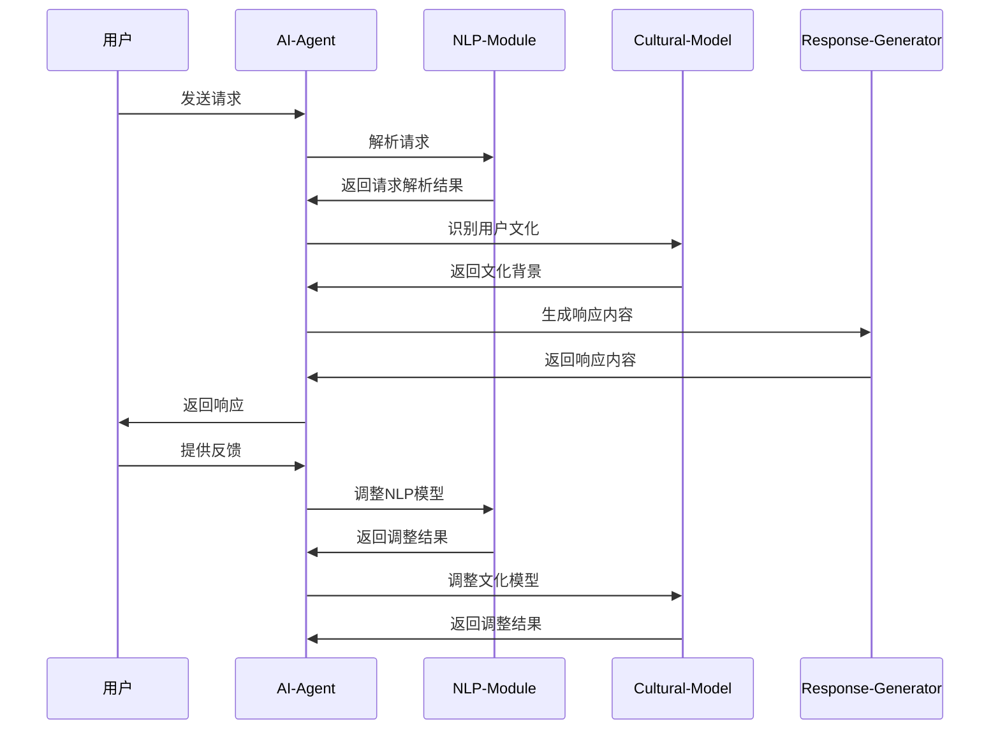

                 

### 关键词

在撰写技术博客时，关键词是至关重要的。它们不仅帮助读者快速了解文章的核心内容，还能提高文章在搜索引擎中的可见性。以下是本篇文章的7个关键词：

1. **AI Agent**：人工智能代理，是本文的核心主题，负责执行特定任务并与环境交互。
2. **跨文化交际能力**：指AI Agent在不同文化背景下的交流和理解能力。
3. **语言理解**：涉及自然语言处理，AI如何理解和解析人类语言。
4. **语言生成**：AI如何创建自然语言的响应，是跨文化交际能力的关键部分。
5. **文化适应性算法**：确保AI Agent在不同文化背景下能够适应和表现适当的算法。
6. **系统架构设计**：展示如何设计和实现一个具备跨文化交际能力的AI Agent系统。
7. **项目实战**：通过具体案例展示跨文化交际AI Agent的开发过程和效果。

这些关键词将贯穿整篇文章，帮助读者更好地理解和应用文章中的技术内容。

### 摘要

本文将深入探讨开发AI Agent的跨文化交际能力这一前沿技术课题。随着全球化的发展，AI Agent在跨文化交际中的应用越来越广泛，成为商业、教育、医疗等领域的热门话题。本文首先介绍了跨文化交际的背景和AI Agent的基本概念，并探讨了它们之间的联系。接着，我们详细分析了跨文化交际能力模型、AI Agent中的文化意识和语言处理能力。然后，我们介绍了用于提升AI Agent跨文化交际能力的核心算法，包括语言理解、语言生成和文化适应性算法。接着，我们设计并展示了具备跨文化交际能力的AI Agent系统架构，并详细介绍了系统功能、接口设计、系统交互设计。通过一个具体的实战项目，我们展示了如何在实际环境中安装和实现跨文化交际AI Agent，并对其代码和应用进行了深入分析和讲解。最后，本文总结了关键点，提供了最佳实践建议，并引导读者进一步学习。

### 引言

随着人工智能技术的飞速发展，AI Agent在多个领域中的应用越来越广泛。从智能家居的智能助手到自动驾驶汽车的决策系统，AI Agent已经成为我们日常生活不可或缺的一部分。然而，在全球化日益深入的今天，跨文化交际能力成为了AI Agent面临的一个重要挑战。无论是在国际贸易、国际商务交流，还是在跨国团队合作中，AI Agent需要能够理解和适应不同文化背景下的语言和行为，以便更有效地进行沟通和合作。

跨文化交际能力指的是在跨文化环境中进行有效沟通的能力，包括对文化差异的敏感性、对不同语言的理解和表达能力，以及对不同社交礼仪和沟通方式的适应能力。对于AI Agent而言，具备跨文化交际能力意味着它们能够在不同的文化背景下，自动识别和适应语言、行为和社交规则，从而与人类用户或其他AI系统进行顺畅的交流。

开发AI Agent的跨文化交际能力不仅具有重要的学术价值，也具有广泛的应用前景。首先，它能够提高AI系统的可用性和用户体验，使得AI Agent在不同文化背景下都能为用户提供高质量的互动服务。其次，它能够促进不同国家和地区之间的交流与合作，消除文化障碍，增进相互理解。最后，它也为人工智能技术的发展开辟了新的方向，推动了自然语言处理、机器学习、社会计算等领域的进步。

本文将围绕开发AI Agent的跨文化交际能力展开讨论。首先，我们将介绍跨文化交际的背景，阐述其重要性以及在AI Agent中的应用。接着，我们将定义AI Agent和跨文化交际能力，并探讨它们之间的联系。然后，我们将深入分析AI Agent跨文化交际能力的核心概念和原理，包括语言处理能力、文化意识和文化适应性算法。在此基础上，我们将介绍用于提升AI Agent跨文化交际能力的具体算法，并展示如何设计和实现一个具备跨文化交际能力的AI Agent系统。最后，我们将通过一个具体的实战项目，展示AI Agent跨文化交际能力的实际应用，并总结本文的关键点，提出未来研究方向。

通过本文的讨论，我们希望能够为开发具备跨文化交际能力的AI Agent提供有价值的参考，推动这一领域的进一步发展。

### 第1章：跨文化交际与AI Agent简介

#### 跨文化交际的挑战

跨文化交际是指在涉及不同文化背景的个体或群体之间进行的交流。随着全球化进程的加快，跨文化交际已经成为一个日益重要的话题。在跨文化交际中，人们面临诸多挑战，包括文化差异、语言障碍、非语言沟通方式的误解等。

**文化差异**：不同文化背景下的价值观、信仰、习惯和行为规范可能截然不同。例如，在一些文化中，直接表达反对意见被视为不礼貌，而在其他文化中，直截了当的表达则被认为更为真诚。这种文化差异可能导致误解和冲突。

**语言障碍**：语言是跨文化交际的重要工具，但不同语言之间的差异常常导致沟通障碍。语言不仅仅包括词汇和语法，还包括发音、语调和语用规则。对于AI Agent来说，理解并正确使用多种语言是实现跨文化交际的关键。

**非语言沟通**：跨文化交际不仅涉及语言本身，还包括身体语言、面部表情、手势等非语言沟通方式。不同文化对于这些非语言信号的解读可能大相径庭，例如，某些手势在一个文化中可能表示赞美，而在另一个文化中则可能表示侮辱。

**跨文化交际的重要性**

跨文化交际在多个领域中都扮演着重要角色：

**国际商务**：全球化带来了更多的商业机会，也带来了跨文化商务交流的需求。能够有效进行跨文化交际的企业更有可能在国际市场上取得成功。

**教育**：随着国际教育的普及，学生和教师需要与来自不同文化背景的人进行交流。具备跨文化交际能力的学生和教师能够更好地适应国际环境，促进学术合作和文化交流。

**旅游**：旅游业是跨国交流的重要形式。跨文化交际能力使得游客能够更好地理解目的地文化，提升旅游体验。

**社会融合**：在多元文化社会中，跨文化交际能力有助于不同文化群体之间的融合和相互理解，减少社会冲突，促进社会和谐。

**AI Agent在跨文化交际中的应用**

AI Agent作为人工智能的典型代表，具有在跨文化交际中发挥重要作用的潜力。以下是一些应用场景：

**客户服务**：AI Agent可以作为客户服务的工具，帮助解决客户的问题。例如，在跨国公司中，AI Agent可以提供多语言支持，帮助客户以他们熟悉的语言进行沟通。

**教育辅助**：在教育领域，AI Agent可以作为学习伙伴，帮助学生理解不同文化背景的知识和观点。例如，AI Agent可以模拟不同文化背景下的对话，帮助学生练习跨文化交际能力。

**文化交流**：AI Agent可以作为文化交流的媒介，促进不同文化之间的理解和互动。例如，AI Agent可以参与国际会议，提供实时翻译和解释服务，帮助参与者更好地理解和交流。

**跨文化医疗**：在医疗领域，AI Agent可以协助医疗人员理解不同文化背景下的患者需求，提供更加个性化的医疗服务。

**跨文化商务交流**：AI Agent可以帮助企业进行跨国商务交流，提供文化背景知识，协助企业理解和适应不同文化环境中的商业规则和礼仪。

通过AI Agent，跨文化交际不再仅仅是人类的任务，而是可以由智能系统辅助和提升的过程。这不仅提高了跨文化交际的效率和效果，也为人工智能技术开辟了新的应用领域。

### AI Agent的基本概念

AI Agent，即人工智能代理，是一种能够自主执行任务并与环境互动的智能实体。它基于人工智能技术，通过机器学习、自然语言处理和计算机视觉等多种算法，模拟人类的思维和行为，实现智能决策和行动。

#### 定义

AI Agent可以被定义为一种具有以下特征的智能实体：

1. **自主性**：AI Agent能够自主决策和行动，不依赖于人类的直接指令。
2. **交互性**：AI Agent能够感知环境中的信息，并通过多种方式（如语音、文本、图像等）与环境和其他实体进行交互。
3. **适应性**：AI Agent能够在不同的环境和场景中适应和调整其行为，以实现最佳效果。
4. **智能性**：AI Agent具备理解、学习和推理的能力，能够处理复杂的问题和任务。

#### 功能与分类

AI Agent的功能多种多样，具体取决于其应用场景和设计目标。以下是几种常见的AI Agent类型：

1. **任务型AI Agent**：这类AI Agent专注于执行特定的任务，如客服聊天机器人、智能家居控制系统等。它们通常具有高度专门化的功能，但灵活性较低。
2. **交互型AI Agent**：这类AI Agent侧重于与人类用户的互动，如虚拟助手、聊天机器人等。它们需要具备良好的自然语言理解和生成能力，以实现顺畅的对话。
3. **决策型AI Agent**：这类AI Agent能够在复杂环境中进行决策，如自动驾驶汽车、股票交易系统等。它们需要具备强大的推理和预测能力。
4. **认知型AI Agent**：这类AI Agent能够模拟人类的思维过程，具有更高级的认知能力，如个人助理、智能客服等。它们能够在不断变化的环境中学习和适应。

#### AI Agent的发展趋势

随着人工智能技术的不断进步，AI Agent的发展也呈现出以下趋势：

1. **智能化**：AI Agent的功能和性能不断提高，能够处理更加复杂的问题和任务。例如，深度学习技术的应用使得AI Agent在图像识别、自然语言处理等领域取得了显著进展。
2. **个性化**：AI Agent能够根据用户的个性化需求和行为模式提供定制化的服务。例如，通过分析用户的购物记录和偏好，AI Agent可以推荐个性化的产品和服务。
3. **协作化**：AI Agent不再孤立地工作，而是与其他AI系统和人类合作，共同完成复杂的任务。例如，在医疗领域，AI Agent可以与医生和护士协作，提供更加精准的诊断和治疗建议。
4. **泛在化**：AI Agent的应用场景越来越广泛，从家庭、办公到医疗、教育、金融等多个领域。随着物联网技术的发展，AI Agent的泛在化趋势将更加明显。
5. **伦理化**：随着AI Agent的广泛应用，其伦理问题日益受到关注。如何在设计AI Agent时考虑到伦理和社会影响，成为未来研究的一个重要方向。

总之，AI Agent作为人工智能领域的重要研究方向和应用方向，具有巨大的发展潜力。通过不断提升其智能、个性化和协作化水平，AI Agent将在未来的跨文化交际中发挥更加重要的作用。

#### AI Agent与跨文化交际能力的联系

AI Agent的跨文化交际能力是指其在不同文化背景下进行有效交流和理解的能力。这一能力的关键在于AI Agent如何处理和适应不同文化之间的差异，从而实现顺畅的跨文化沟通。AI Agent的跨文化交际能力由以下几个核心要素组成：

**1. 语言处理能力**

语言处理能力是AI Agent跨文化交际的基础。它包括自然语言理解（NLU）和自然语言生成（NLG）两个主要方面：

- **自然语言理解（NLU）**：NLU是指AI Agent理解和解析自然语言输入的能力。这涉及到语音识别、语义分析和语言模型等技术。AI Agent需要能够理解不同语言的表达方式，并从中提取出有效的信息。
- **自然语言生成（NLG）**：NLG是指AI Agent生成自然语言输出以与人类交流的能力。它需要考虑语言的流畅性、语境适应性以及文化敏感性。AI Agent需要能够生成符合不同文化习惯和语用规则的回答。

**2. 文化意识**

文化意识是AI Agent跨文化交际能力的核心要素之一。它涉及对文化差异的敏感性和对文化背景知识的理解：

- **文化敏感性**：AI Agent需要能够识别和尊重不同文化背景下的价值观、信仰和行为规范。例如，某些文化中直接表达反对意见可能被视为不礼貌，而其他文化中则可能被视为真诚的表现。AI Agent需要能够根据文化背景调整其行为和交流方式。
- **文化适应性**：AI Agent需要具备在多文化环境中适应和表现适当的文化行为的能力。这包括学习不同文化的社交礼仪、习俗和沟通方式，并能够在不同的文化背景下灵活应用。

**3. 社交规则和礼仪**

社交规则和礼仪是跨文化交际的重要组成部分。AI Agent需要理解和应用这些规则和礼仪，以确保其交流的得体和有效性：

- **社交规则**：社交规则包括问候、对话、协商、道歉等日常交流的基本礼仪。AI Agent需要能够根据不同文化背景应用相应的社交规则，以建立和维护良好的人际关系。
- **礼仪**：礼仪涉及特定文化中的行为规范和期望。例如，在某些文化中，直接的身体接触可能被视为不礼貌，而在其他文化中则可能被视为友谊的象征。AI Agent需要能够识别并遵守这些礼仪规范。

**4. 多语言支持**

多语言支持是AI Agent跨文化交际能力的重要体现。AI Agent需要能够理解并生成多种语言，以适应不同文化背景的用户。这包括：

- **语言翻译**：AI Agent需要能够提供准确和流畅的语言翻译服务，帮助跨文化交流的双方克服语言障碍。
- **语言理解与生成**：除了语言翻译，AI Agent还需要能够理解并生成不同语言的自然语言，以确保交流的准确性和有效性。

**综合应用场景**

AI Agent的跨文化交际能力在实际应用中具有广泛的应用场景：

- **客户服务**：AI Agent可以作为多语言客服系统，帮助跨国公司提供24/7的客户支持，满足不同文化背景客户的需求。
- **教育辅助**：AI Agent可以作为语言学习助手，为学生提供跨文化交际培训，帮助他们理解不同文化背景下的语言和行为。
- **文化交流**：AI Agent可以作为文化交流平台，帮助不同文化背景的用户进行互动和交流，促进跨文化理解与和谐。
- **商务交流**：AI Agent可以作为跨国商务交流工具，帮助企业在跨文化商务环境中进行有效沟通，提高商务合作的成功率。

总之，AI Agent的跨文化交际能力是一个复杂而关键的问题，它涉及到语言处理、文化意识、社交规则和礼仪等多个方面。通过不断提升这些能力，AI Agent将在跨文化交际中发挥越来越重要的作用。

### 跨文化交际能力模型

为了开发具备跨文化交际能力的AI Agent，我们需要构建一个全面、系统的跨文化交际能力模型。这个模型不仅需要涵盖跨文化交际的核心要素，还要考虑到影响跨文化交际能力的各种因素。以下是跨文化交际能力模型的基本结构和主要组成部分。

#### 模型结构

跨文化交际能力模型可以分为四个主要层次：

1. **基础层**：包括语言基础和文化基础，是跨文化交际能力的基础。
2. **核心层**：涵盖语言处理能力、文化意识、社交规则和礼仪，是跨文化交际能力的核心。
3. **应用层**：将跨文化交际能力应用于实际场景，如客户服务、教育辅助和商务交流等。
4. **评估层**：对跨文化交际能力进行评估和优化。

#### 基础层

**语言基础**：语言是跨文化交际的工具，因此语言基础至关重要。这包括自然语言处理（NLP）技术，如语音识别、语义分析、语言翻译等。AI Agent需要具备理解和生成多种语言的能力，以确保跨文化沟通的顺畅。

**文化基础**：文化基础涉及对不同文化背景的理解和认知。这包括对文化价值观、信仰、行为规范和沟通方式的掌握。AI Agent需要能够识别和适应不同文化之间的差异，从而在跨文化交际中表现得体。

#### 核心层

**语言处理能力**：语言处理能力是跨文化交际能力的关键组成部分。它包括：

- **自然语言理解（NLU）**：AI Agent需要能够理解和解析自然语言输入，提取有效信息并进行语义分析。
- **自然语言生成（NLG）**：AI Agent需要能够生成自然语言输出，与人类进行流畅的交流。NLG不仅要考虑语言的流畅性，还要考虑文化背景和语境。

**文化意识**：文化意识是指AI Agent对文化差异的敏感性和文化背景知识的掌握。它包括：

- **文化敏感性**：AI Agent需要能够识别和尊重不同文化背景下的价值观、信仰和行为规范。
- **文化适应性**：AI Agent需要具备在多文化环境中适应和表现适当的文化行为的能力，包括学习不同文化的社交礼仪、习俗和沟通方式。

**社交规则和礼仪**：社交规则和礼仪是跨文化交际的重要组成部分。AI Agent需要理解和应用这些规则和礼仪，以确保其交流的得体和有效性。这包括：

- **社交规则**：如问候、对话、协商、道歉等日常交流的基本礼仪。
- **礼仪**：涉及特定文化中的行为规范和期望，如身体接触、称呼方式等。

#### 应用层

**实际应用**：跨文化交际能力需要应用于实际场景，以发挥其作用。这包括：

- **客户服务**：AI Agent可以提供多语言客服支持，帮助跨国公司解决客户问题。
- **教育辅助**：AI Agent可以作为语言学习助手，为学生提供跨文化交际培训。
- **文化交流**：AI Agent可以作为文化交流平台，帮助不同文化背景的用户进行互动和交流。
- **商务交流**：AI Agent可以作为跨国商务交流工具，帮助企业进行有效沟通，提高合作成功率。

#### 评估层

**评估指标**：评估跨文化交际能力的指标包括：

- **沟通效果**：AI Agent能否实现有效、顺畅的跨文化沟通。
- **用户满意度**：用户对AI Agent跨文化交际能力的满意度。
- **文化适应性**：AI Agent在不同文化背景下的适应能力。

**优化策略**：基于评估结果，可以对AI Agent的跨文化交际能力进行优化，包括：

- **算法优化**：改进自然语言处理算法，提高AI Agent的语言理解能力和生成能力。
- **数据集扩充**：增加更多、更丰富的多文化背景数据，以提升AI Agent的文化适应性和语言处理能力。

总之，跨文化交际能力模型是一个复杂而系统的工程，需要从语言基础、核心能力、实际应用和评估优化等多个方面进行综合设计和实现。通过不断完善和优化这一模型，AI Agent将能够更有效地实现跨文化交际，为不同文化背景下的交流与合作提供有力支持。

### AI Agent中的文化意识

文化意识是指AI Agent对文化差异的敏感性和对文化背景知识的理解，是跨文化交际能力的重要组成部分。在设计和实现AI Agent时，文化意识起着至关重要的作用，它直接影响AI Agent在不同文化环境中的表现和用户体验。以下是AI Agent文化意识的几个关键方面：

#### 文化意识的培养

**1. 数据收集和多样性**

AI Agent的文化意识需要通过大量的多文化数据来培养。这包括不同语言、不同文化背景的文本、语音、图像等多种数据形式。通过大量数据的训练，AI Agent可以更好地理解不同文化的表达方式和行为规范。

**2. 专家指导和领域知识**

除了数据，AI Agent的文化意识还需要专家的指导和领域知识。这包括聘请文化学者、语言学家和社会学家等专业人士，为AI Agent提供针对性的文化培训和建议。这些专家可以指导AI Agent理解不同文化之间的差异，并提供具体的文化背景知识。

**3. 文化适应性测试**

在AI Agent开发过程中，需要进行文化适应性测试。这包括模拟不同文化背景下的交流场景，测试AI Agent的应对能力和表现。通过文化适应性测试，可以发现和解决AI Agent在文化意识方面的问题，提高其跨文化交际能力。

#### 文化意识在AI Agent中的应用

**1. 语言理解与生成**

AI Agent的文化意识首先体现在其语言处理能力上。在语言理解方面，AI Agent需要能够正确理解不同文化背景下的语言表达，包括俚语、隐喻和语言习惯等。在语言生成方面，AI Agent需要能够生成符合不同文化背景和语言习惯的自然语言回答。

**2. 社交礼仪和文化规范**

AI Agent在跨文化交际中需要遵循不同文化的社交礼仪和规范。例如，在某些文化中，直接的身体接触可能被视为不礼貌，而在其他文化中则可能被视为友谊的象征。AI Agent需要能够识别并遵守这些文化规范，以确保其交流的得体和有效性。

**3. 文化适应性策略**

AI Agent在处理跨文化交流时，需要具备文化适应性策略。这包括根据不同文化背景调整其语言、行为和交流方式。例如，在商业谈判中，AI Agent需要能够根据对方的文化背景调整谈判策略，以建立信任和合作关系。

#### 具体案例分析

**1. 客户服务**

在客户服务领域，AI Agent需要能够提供多语言、跨文化的客户支持。例如，一个面向国际客户的在线客服系统，需要能够理解并生成多种语言的客户请求，并根据客户的文化背景提供适当的解决方案。

**2. 教育辅助**

在教育领域，AI Agent可以作为语言学习助手，帮助学生理解不同文化背景下的知识和观点。例如，通过模拟不同文化背景下的对话，AI Agent可以帮助学生练习跨文化交际能力，提高其语言能力和文化意识。

**3. 文化交流**

AI Agent可以作为文化交流平台，促进不同文化背景的用户之间的互动和交流。例如，在一个国际文化交流活动中，AI Agent可以提供实时翻译服务，帮助参与者克服语言障碍，促进文化理解和交流。

总之，AI Agent的文化意识是其在跨文化交际中表现优异的关键。通过培养文化意识、应用文化适应性策略，AI Agent可以在不同文化环境中实现顺畅的交流，为跨文化交际提供有力支持。

### AI Agent的语言处理能力

在开发具备跨文化交际能力的AI Agent时，语言处理能力是至关重要的组成部分。语言处理能力包括自然语言理解（NLU）和自然语言生成（NLG）两个主要方面，这两者共同构成了AI Agent进行跨文化交际的基础。以下是关于AI Agent语言处理能力的详细介绍。

#### 自然语言理解（NLU）

自然语言理解（NLU）是AI Agent理解和解析自然语言输入的能力。NLU的目的是将人类语言转化为机器可以理解和处理的结构化数据。以下是NLU的核心技术和实现方式：

**1. 语音识别**

语音识别是将语音信号转化为文本的过程。对于跨文化交际，语音识别需要能够处理不同语言的发音、语调和口音。关键的技术包括：

- **声学模型**：声学模型用于分析语音信号中的声学特征，如音素和音节。常用的声学模型包括隐马尔可夫模型（HMM）和深度神经网络（DNN）。
- **语言模型**：语言模型用于预测语音序列中的下一个词或词组。常见的语言模型包括n-gram模型和基于神经网络的模型，如长短时记忆网络（LSTM）。

**2. 语义分析**

语义分析是将文本转化为具有明确含义的结构化数据的过程。语义分析包括词义消歧、句法分析和实体识别等。关键的技术包括：

- **词义消歧**：词义消歧是解决同音异义词或多义词的问题，确定文本中的单词的确切含义。
- **句法分析**：句法分析是分析句子的结构，确定单词之间的关系和句子的语法结构。常用的句法分析方法包括依存句法分析和构成句法分析。
- **实体识别**：实体识别是识别文本中提及的特定实体，如人名、地名、组织名等。实体识别可以帮助AI Agent更好地理解文本的内容。

**3. 上下文理解**

上下文理解是指AI Agent能够根据对话的上下文和背景信息，理解用户的意图和需求。上下文理解的关键技术包括：

- **对话管理**：对话管理是维护对话状态和跟踪对话上下文的过程。对话管理系统通常使用图或历史记录来存储和跟踪对话信息。
- **上下文编码**：上下文编码是将上下文信息编码为数值或向量表示的过程，以便于模型处理。常用的上下文编码方法包括词嵌入（Word Embedding）和上下文向量（Context Vector）。

#### 自然语言生成（NLG）

自然语言生成（NLG）是AI Agent生成自然语言输出以与人类交流的能力。NLG的目标是生成流畅、自然且符合语境的文本。以下是NLG的主要实现方式：

**1. 统计模型**

统计模型是基于概率论的模型，通过分析大量的语言数据来生成文本。常用的统计模型包括：

- **n-gram模型**：n-gram模型是基于前n个单词预测下一个单词的概率。n-gram模型简单且易于实现，但生成的文本质量较低。
- **递归神经网络（RNN）**：RNN可以捕获序列中的长期依赖关系，生成更为自然的文本。常见的RNN模型包括LSTM和GRU。

**2. 生成对抗网络（GAN）**

生成对抗网络（GAN）是由两个神经网络（生成器和判别器）组成的对抗性模型。生成器尝试生成与真实数据相似的文本，而判别器尝试区分生成器和真实数据的差异。GAN在生成高质量文本方面表现出色，但训练过程较为复杂。

**3. 序列到序列（Seq2Seq）模型**

序列到序列（Seq2Seq）模型是用于文本生成的一种端到端模型，它将输入序列映射到输出序列。Seq2Seq模型通常结合编码器和解码器，其中编码器将输入序列编码为一个固定长度的向量，解码器则将该向量解码为输出序列。

**4. 上下文编码与生成**

上下文编码与生成是结合上下文信息生成文本的方法。常见的上下文编码方法包括词嵌入和上下文向量。这些方法将上下文信息编码为向量，并与输入序列一起输入到生成模型中，从而生成更加符合上下文和语境的文本。

#### 多语言支持

在跨文化交际中，多语言支持是AI Agent的一项重要能力。多语言支持涉及以下关键技术：

**1. 语言翻译**

语言翻译是将一种语言的文本翻译成另一种语言的过程。AI Agent需要能够提供准确和流畅的语言翻译服务，以帮助跨文化交流的双方克服语言障碍。常用的语言翻译技术包括机器翻译（MT）和神经网络翻译（NMT）。

**2. 双语词典**

双语词典是存储两种语言之间词汇对照的数据库。AI Agent可以利用双语词典进行文本的自动翻译，提高跨文化交际的效率。

**3. 多语言模型**

多语言模型是能够处理多种语言输入和输出的模型。通过训练多语言模型，AI Agent可以在不同语言之间进行无缝切换，实现多语言支持。

总之，AI Agent的语言处理能力是其在跨文化交际中的关键能力。通过不断提升自然语言理解（NLU）和自然语言生成（NLG）的能力，AI Agent将能够更有效地实现跨文化交际，为不同文化背景下的交流与合作提供有力支持。

### 用于提升AI Agent跨文化交际能力的算法

在开发具备跨文化交际能力的AI Agent时，算法设计是关键的一环。以下将介绍几种关键的算法，包括语言理解算法、语言生成算法和文化适应性算法，并详细阐述其数学模型和公式。

#### 语言理解算法

语言理解算法（NLU）是AI Agent跨文化交际能力的基础，它负责理解用户输入的语言，并提取出有用的信息。以下是几种常用的语言理解算法：

**1. 词嵌入（Word Embedding）**

词嵌入是将词汇映射到高维向量空间的技术，用于表示词汇的语义关系。常用的词嵌入算法包括：

- **Word2Vec**：Word2Vec算法使用神经网络将词汇映射到连续向量空间，通过训练词向量的相似性来捕捉词汇的语义关系。
- **GloVe**：GloVe（Global Vectors for Word Representation）算法通过计算词频和共现信息来生成词向量，具有较强的语义表达能力。

数学模型：

\[ \text{Word Vector} = \text{GloVe}(word, context) \]

其中，`word`表示词汇，`context`表示词汇的上下文信息，`GloVe`是算法函数。

**2. 递归神经网络（RNN）**

RNN是一种用于处理序列数据的神经网络，能够捕捉序列中的长期依赖关系。常用的RNN模型包括LSTM和GRU。

数学模型：

\[ \text{LSTM} = \text{LSTM}(x_t, h_{t-1}, c_{t-1}) \]

\[ h_t = \text{sigmoid}(W_f \cdot [h_{t-1}, x_t] + b_f) \]

\[ i_t = \text{sigmoid}(W_i \cdot [h_{t-1}, x_t] + b_i) \]

\[ f_t = \text{sigmoid}(W_f \cdot [h_{t-1}, x_t] + b_f) \]

\[ o_t = \text{sigmoid}(W_o \cdot [h_{t-1}, x_t] + b_o) \]

\[ c_t = f_t \cdot c_{t-1} + i_t \cdot \text{tanh}(W_c \cdot [h_{t-1}, x_t] + b_c) \]

\[ h_t = o_t \cdot \text{tanh}(c_t) \]

其中，`x_t`表示输入序列的第`t`个元素，`h_{t-1}`和`c_{t-1}`分别是上一时刻的隐藏状态和细胞状态，`W_f`、`W_i`、`W_f`、`W_o`、`W_c`和`b_f`、`b_i`、`b_f`、`b_o`、`b_c`分别是权重和偏置。

**3. 依存句法分析**

依存句法分析是分析句子中词汇之间的依存关系，用于理解句子的语义结构。常用的依存句法分析模型包括：

- **神经网络依存句法分析器**：使用神经网络模型，如LSTM或Transformer，来预测词汇之间的依存关系。

数学模型：

\[ \text{Dep} = \text{NeuralDependencyParser}(sentence) \]

其中，`sentence`表示输入句子，`Dep`是输出句法依存关系图。

#### 语言生成算法

语言生成算法（NLG）是AI Agent在跨文化交际中生成自然语言回答的关键。以下是几种常用的语言生成算法：

**1. 递归神经网络（RNN）**

递归神经网络（RNN）可以生成自然语言文本，但生成的文本质量较低且容易产生重复。

数学模型：

\[ \text{RNN} = \text{RNN}(x_t, h_{t-1}) \]

\[ y_t = \text{softmax}(\text{RNN}(h_t)) \]

其中，`x_t`表示输入序列的第`t`个元素，`h_{t-1}`是上一时刻的隐藏状态，`y_t`是生成的输出序列。

**2. 生成对抗网络（GAN）**

生成对抗网络（GAN）由生成器和判别器组成，用于生成高质量的文本。

数学模型：

生成器：

\[ G(z) = \text{Generator}(z) \]

判别器：

\[ D(x) = \text{Discriminator}(x) \]

\[ D(G(z)) = \text{Discriminator}(\text{Generator}(z)) \]

优化目标：

\[ \text{minimize } \mathbb{E}_{x \sim p_{\text{data}}(x)} [\text{log}(D(x))] + \mathbb{E}_{z \sim p_{\text{z}}(z)} [\text{log}(1 - D(G(z)))] \]

其中，`z`是随机噪声，`x`是真实数据，`G(z)`是生成器生成的数据，`D(x)`是判别器对数据的判断。

**3. Transformer**

Transformer是一种基于自注意力机制的神经网络模型，能够生成高质量的文本。

数学模型：

\[ \text{Transformer}(x) = \text{Encoder}(x) \]

\[ y_t = \text{softmax}(\text{Decoder}(y_{<t}, \text{Encoder}(x))) \]

其中，`x`是输入序列，`y_{<t}`是生成的部分序列，`Encoder`是编码器，`Decoder`是解码器。

#### 文化适应性算法

文化适应性算法是AI Agent在不同文化背景下调整其行为和交流方式的关键。以下是几种常用的文化适应性算法：

**1. 文化分类器**

文化分类器是一种基于机器学习模型的算法，用于识别和分类不同文化背景。常用的分类器包括：

- **支持向量机（SVM）**：使用SVM进行文化分类，通过最大化分类间隔来识别不同的文化特征。
- **决策树**：使用决策树进行文化分类，通过构建决策树来识别不同文化的特征。

数学模型：

\[ \text{Classifier}(x) = \arg\max_{c} \sum_{i=1}^{n} w_i y_i \]

其中，`x`是输入特征向量，`c`是文化类别，`w_i`是权重，`y_i`是标签。

**2. 文化适应策略**

文化适应策略是AI Agent根据不同文化背景调整其行为和交流方式的方法。常用的策略包括：

- **规则驱动**：通过预定义的规则来调整AI Agent的行为，如在不同文化背景下使用不同的问候语和礼仪。
- **机器学习**：通过机器学习算法来学习不同文化的特征，并调整AI Agent的行为。

数学模型：

\[ \text{AdaptiveStrategy}(c) = \text{Policy}(c) \]

其中，`c`是文化类别，`Policy`是策略函数。

总之，通过语言理解算法、语言生成算法和文化适应性算法，AI Agent可以提升其在跨文化交际中的表现。这些算法的数学模型和公式为AI Agent的开发提供了理论基础和技术指导，有助于实现高效的跨文化交际能力。

### 系统需求分析

在设计和实现具备跨文化交际能力的AI Agent系统时，系统需求分析是至关重要的一步。这一步骤的目的是明确系统的目标、功能需求、性能要求和界面需求，以确保系统能够满足用户需求并实现预期的功能。

#### 系统目标

系统的核心目标是开发一个具备跨文化交际能力的AI Agent，该系统能够在不同文化背景下实现有效、流畅的跨文化交流。具体目标包括：

1. **多语言支持**：系统能够理解和生成多种语言，包括常见国际语言和特定地区的方言。
2. **文化适应性**：系统能够根据不同文化背景调整其行为和交流方式，以适应不同文化环境中的社交规则和礼仪。
3. **高效性**：系统能够快速响应用户的输入，提供即时、准确的交流反馈。
4. **用户友好**：系统界面设计简洁直观，易于用户使用，并提供友好的交互体验。

#### 功能需求

系统功能需求包括以下几个方面：

1. **语言处理**：系统能够进行自然语言理解（NLU）和自然语言生成（NLG），支持多种语言的输入和输出。
2. **文化识别**：系统能够识别和分类用户的文化背景，以便根据不同文化环境调整交流方式。
3. **社交规则应用**：系统能够遵循不同文化背景下的社交规则和礼仪，确保交流得体和有效。
4. **上下文理解**：系统能够理解用户交流的上下文信息，生成符合实际场景的自然语言回答。
5. **多模态交互**：系统支持语音、文本、图像等多种交互方式，提供灵活的交流接口。

#### 性能要求

系统性能要求确保系统能够稳定、高效地运行，并满足用户对速度和准确性的需求：

1. **响应时间**：系统对用户输入的响应时间应尽可能短，确保实时交流。
2. **准确性**：系统在语言理解、生成和文化识别方面的准确性应达到高水准，以避免误解和误判。
3. **稳定性**：系统应具备良好的稳定性，能够在长时间运行过程中保持性能和可靠性。
4. **可扩展性**：系统设计应具备良好的扩展性，能够适应未来的技术发展和功能需求。

#### 界面需求

系统界面需求包括以下几个方面：

1. **用户界面**：系统应提供直观、易用的用户界面，支持多种输入方式和交互方式，如语音输入、文本输入、图形界面等。
2. **多语言界面**：系统界面应支持多种语言的显示和操作，以适应不同文化背景的用户。
3. **交互设计**：系统应提供良好的交互设计，包括清晰的指令提示、反馈机制和错误处理机制，以提高用户的使用体验。
4. **易维护性**：系统界面设计应考虑易维护性，方便进行后续的更新和优化。

通过系统需求分析，我们可以明确系统设计的方向和目标，确保系统在功能、性能和用户体验方面达到预期效果。接下来，我们将详细讨论系统架构设计，展示如何实现上述需求。

### 系统架构设计

在设计和实现具备跨文化交际能力的AI Agent系统时，系统架构的设计至关重要。合理的系统架构不仅能够满足功能需求，还能确保系统的高效性和可扩展性。以下将详细展示系统的整体架构设计，包括架构概述、系统组件设计以及架构图。

#### 系统架构概述

系统的整体架构可以划分为以下几个主要部分：

1. **数据层**：负责数据存储和管理，包括用户数据、文化背景数据、语言数据和交流历史数据等。
2. **模型层**：负责AI模型的训练和应用，包括自然语言处理（NLP）模型、跨文化交际模型和文化适应性模型等。
3. **服务层**：负责系统的核心功能，包括语言处理、文化识别、社交规则应用、上下文理解和多模态交互等。
4. **界面层**：负责用户界面的设计和实现，提供直观、易用的交互体验。
5. **监控与优化层**：负责系统的监控和优化，确保系统的稳定性和高效性。

#### 系统组件设计

**1. 数据层**

数据层是系统的基石，负责存储和管理各类数据。数据层包括以下组件：

- **用户数据管理**：存储用户的基本信息、交流历史和偏好设置。
- **文化背景数据管理**：存储不同文化的背景信息，包括价值观、信仰、行为规范和社交礼仪等。
- **语言数据管理**：存储多种语言的词汇、语法和语用规则，支持多种语言的处理和生成。

**2. 模型层**

模型层是系统的智能核心，负责AI模型的训练和应用。模型层包括以下组件：

- **自然语言处理（NLP）模型**：包括词嵌入、句法分析、语义分析和语言翻译等模型，用于处理自然语言输入和生成。
- **跨文化交际模型**：包括文化识别、文化适应性和社交规则应用等模型，用于根据不同文化环境调整交流方式。
- **文化适应性模型**：用于学习和应用不同文化的社交礼仪和行为规范。

**3. 服务层**

服务层是系统的功能实现层，包括以下几个主要组件：

- **语言处理服务**：提供自然语言理解（NLU）和自然语言生成（NLG）服务，处理用户输入并生成自然语言响应。
- **文化识别服务**：根据用户的语言、行为和交流历史，识别和分类用户的文化背景。
- **社交规则应用服务**：根据不同文化环境，应用相应的社交规则和礼仪，确保交流得体和有效。
- **上下文理解服务**：理解用户交流的上下文信息，生成符合实际场景的自然语言回答。
- **多模态交互服务**：支持语音、文本、图像等多种交互方式，提供灵活的交流接口。

**4. 界面层**

界面层是系统的用户交互界面，包括以下几个组件：

- **用户界面**：提供直观、易用的交互界面，支持多种输入方式和交互方式，如语音输入、文本输入、图形界面等。
- **多语言界面**：提供多种语言的界面显示和操作，以适应不同文化背景的用户。
- **交互设计**：提供清晰的指令提示、反馈机制和错误处理机制，以提高用户的使用体验。

**5. 监控与优化层**

监控与优化层负责系统的监控和优化，确保系统的稳定性和高效性。包括以下几个组件：

- **性能监控**：实时监控系统的性能指标，如响应时间、处理速度和资源利用率等。
- **日志管理**：记录系统运行日志，便于故障排查和性能优化。
- **优化策略**：根据监控数据，应用优化策略，提高系统的性能和稳定性。

#### 系统架构图

以下是系统架构的总体架构图，展示了各个组件之间的关系和交互流程：

```
+---------------------------+
|  用户界面层               |
|  +----------------+       |
|  |  用户界面      |       |
|  +----------------+       |
|                       |
+---------------------------+
           |
           v
+---------------------------+
|  服务层                   |
|  +----------------+       |
|  | 语言处理服务   |       |
|  | 文化识别服务   |       |
|  | 社交规则应用   |       |
|  | 上下文理解服务 |       |
|  | 多模态交互服务 |       |
|  +----------------+       |
|                       |
+---------------------------+
           |
           v
+---------------------------+
|  模型层                   |
|  +----------------+       |
|  | NLP 模型       |       |
|  | 跨文化交际模型 |       |
|  | 文化适应性模型 |       |
|  +----------------+       |
|                       |
+---------------------------+
           |
           v
+---------------------------+
|  数据层                   |
|  +----------------+       |
|  | 用户数据管理   |       |
|  | 文化背景数据   |       |
|  | 语言数据管理   |       |
|  | 交流历史数据   |       |
|  +----------------+       |
|                       |
+---------------------------+
           |
           v
+---------------------------+
|  监控与优化层              |
|  +----------------+       |
|  | 性能监控       |       |
|  | 日志管理       |       |
|  | 优化策略       |       |
|  +----------------+       |
+---------------------------+
```

通过上述系统架构设计，我们可以实现一个高效、稳定且具备跨文化交际能力的AI Agent系统，满足不同文化背景下的跨文化交流需求。

### 系统接口设计

系统接口设计是确保AI Agent系统各组件之间能够高效、无缝交互的重要环节。在跨文化交际能力的实现过程中，系统接口的设计需要考虑数据传输的格式、协议以及安全性等方面。

#### 接口定义

系统接口分为内部接口和外部接口两种：

**1. 内部接口**

内部接口负责系统内部各组件之间的通信。主要包括以下几种：

- **数据传输接口**：用于数据在各组件之间的传输，通常采用JSON或XML格式。
- **控制接口**：用于控制各组件的启动、停止和状态查询，通常采用HTTP/HTTPS协议。
- **事件接口**：用于各组件之间的事件通知和消息传递，采用基于消息队列的机制。

**2. 外部接口**

外部接口负责系统与外部系统的通信，主要包括以下几种：

- **API接口**：提供对外服务的API接口，用于与用户进行交互，通常采用RESTful API设计。
- **Web接口**：提供Web端用户界面，支持用户通过网页进行操作，通常使用HTML/CSS/JavaScript技术栈。
- **多模态交互接口**：支持语音、文本、图像等多模态交互，采用相应的协议和标准。

#### 接口实现

**1. 数据传输接口**

数据传输接口的实现需要考虑数据格式和协议。以下是具体实现步骤：

- **数据格式**：选择JSON格式，因为它具有良好的可读性和兼容性，便于数据的解析和传输。
- **协议**：选择HTTP/HTTPS协议，因为它支持请求/响应模式，且具有较好的安全性。

实现示例：

```python
# Python 示例代码
import flask

@app.route('/process_text', methods=['POST'])
def process_text():
    data = flask.request.json
    text = data['text']
    # 调用内部接口处理文本
    result = language_processor.process_text(text)
    return flask.jsonify(result)
```

**2. 控制接口**

控制接口的实现需要确保各组件能够可靠启动、停止和监控。以下是具体实现步骤：

- **启动**：通过控制接口启动各组件，通常采用参数化启动命令。
- **停止**：通过控制接口停止各组件，确保系统稳定关闭。
- **状态查询**：通过控制接口查询各组件的状态，便于监控系统性能和健康状态。

实现示例：

```bash
# 启动组件
./start_service.sh -name nlp_processor
./start_service.sh -name cultural_adaptation_processor

# 停止组件
./stop_service.sh -name nlp_processor
./stop_service.sh -name cultural_adaptation_processor

# 查询状态
./status_service.sh -name nlp_processor
./status_service.sh -name cultural_adaptation_processor
```

**3. 事件接口**

事件接口的实现需要确保各组件之间能够及时、准确地传递事件信息。以下是具体实现步骤：

- **消息队列**：使用消息队列（如RabbitMQ、Kafka）实现异步通信，确保事件传递的高效性和可靠性。
- **事件处理**：定义事件类型和处理逻辑，确保各组件能够根据事件类型做出相应操作。

实现示例：

```python
# Python 示例代码
import pika

connection = pika.BlockingConnection(pika.ConnectionParameters('localhost'))
channel = connection.channel()

channel.queue_declare(queue='event_queue')

def on_message(ch, method, properties, body):
    event = json.loads(body)
    if event['type'] == 'text_processed':
        # 处理文本处理事件
        print("Received text processed event:", event)
    elif event['type'] == 'cultural_adaptation_complete':
        # 处理文化适应完成事件
        print("Received cultural adaptation complete event:", event)

channel.basic_consume(queue='event_queue', on_message_callback=on_message)

print(' [*] Waiting for messages. To exit press CTRL+C')
channel.start_consuming()
```

#### 接口测试

接口测试是确保接口设计和实现正确性的关键步骤。以下是接口测试的几个要点：

- **功能测试**：验证接口的功能是否符合预期，包括数据传输、控制操作和事件处理等。
- **性能测试**：测试接口在高并发和大数据量情况下的性能表现，确保系统的响应速度和稳定性。
- **安全测试**：测试接口的安全性，包括身份验证、数据加密和防攻击等。

实现示例：

```bash
# 功能测试
curl -X POST -H "Content-Type: application/json" -d '{"text": "Hello World!"}' http://localhost:5000/process_text

# 性能测试
ab -n 1000 -c 100 http://localhost:5000/process_text

# 安全测试
nmap -p 5000 localhost
```

通过以上接口设计、实现和测试，我们可以确保AI Agent系统内部和外部接口的稳定性和可靠性，为跨文化交际能力的实现提供坚实保障。

### 系统交互设计

系统交互设计是确保AI Agent系统在不同环境下能够有效运行的关键环节。以下将详细介绍系统交互设计，包括交互流程设计、用户界面设计和交互效果评估。

#### 交互流程设计

系统交互流程设计旨在确保用户与AI Agent之间的交流能够顺畅、高效地进行。以下是具体的交互流程设计：

1. **用户请求**：用户通过用户界面（UI）向AI Agent发送请求，可以是文本、语音或图像等形式。
2. **请求解析**：AI Agent接收到用户的请求后，通过自然语言处理（NLP）模块对请求进行解析，提取关键信息和意图。
3. **文化识别**：根据用户请求中的语言特征和文化背景信息，AI Agent识别用户的文化背景，并调用相应的跨文化交际模型。
4. **内容生成**：AI Agent结合用户的意图、上下文信息和文化背景，生成适当的响应内容。
5. **响应输出**：将生成的响应内容通过用户界面返回给用户，可以是文本、语音或图像等形式。
6. **反馈收集**：用户对AI Agent的响应进行评价或反馈，AI Agent根据反馈进行调整和优化。

以下是交互流程的Mermaid序列图表示：



#### 用户界面设计

用户界面（UI）设计是系统交互设计的重要组成部分，直接影响用户的操作体验。以下是用户界面设计的关键点：

1. **简洁直观**：界面设计应简洁直观，避免复杂的功能和操作，确保用户能够快速上手。
2. **多模态支持**：界面应支持多种输入和输出方式，包括文本输入、语音输入、语音输出和图像输出等，以满足不同用户的偏好。
3. **交互反馈**：界面应提供及时的交互反馈，如请求接收确认、响应生成中提示等，增强用户的参与感和信任感。
4. **多语言支持**：界面应支持多语言显示，以适应不同文化背景的用户。

以下是用户界面设计的示例：

```
+--------------------------------+
|       跨文化交际AI-Agent      |
+--------------------------------+
| [文本输入框]                 |
| [语音输入按钮]               |
| [图像输入按钮]               |
+--------------------------------+
| [响应显示区域]               |
| [语音输出按钮]               |
| [文本输出按钮]               |
+--------------------------------+
| [反馈输入框]                 |
| [提交反馈按钮]               |
+--------------------------------+
```

#### 交互效果评估

交互效果评估是验证AI Agent系统在实际应用中的表现和用户满意度的重要手段。以下是交互效果评估的关键指标和方法：

1. **沟通效果**：评估AI Agent与用户之间的沟通效果，包括响应速度、内容准确性、语言流畅性等。可以通过用户满意度调查和实际使用数据进行分析。
2. **用户满意度**：通过用户满意度调查，了解用户对AI Agent系统的整体满意度，包括易用性、可靠性、响应效果等方面。
3. **文化适应性**：评估AI Agent在不同文化背景下的表现，包括对文化差异的适应性和跨文化交际能力的有效性。
4. **性能指标**：监控AI Agent系统的性能指标，如响应时间、资源消耗、错误率等，确保系统的高效性和稳定性。

以下是交互效果评估的示例方法：

- **用户满意度调查**：通过在线问卷或面对面访谈，收集用户对AI Agent系统的满意度评价。
- **实际使用数据分析**：通过收集AI Agent系统的实际使用数据，分析响应速度、内容准确性和用户互动情况。
- **性能监控数据**：通过系统监控工具，收集AI Agent系统的性能监控数据，分析系统的稳定性和高效性。

通过以上交互设计，我们可以确保AI Agent系统在实际应用中的交互流程顺畅、用户界面友好、交互效果显著，为跨文化交际能力的实现提供坚实保障。

### 项目实战

在本节中，我们将通过一个具体的跨文化交际AI Agent项目实战，详细描述项目背景、环境安装、核心代码实现和案例分析。通过这个项目，我们将展示如何将前面章节中介绍的理论知识应用于实际场景中，并对其效果进行深入剖析。

#### 项目背景

该项目旨在开发一款跨文化交际AI Agent，用于国际商务交流。具体目标包括：

1. **多语言支持**：支持多种国际语言，如英语、法语、中文等，以便在不同文化背景的用户之间进行无缝交流。
2. **文化适应性**：根据用户的文化背景，自动调整交流方式和内容，以适应不同文化环境中的社交礼仪和沟通习惯。
3. **高效响应**：实现快速响应，确保用户能够在国际商务交流中及时获取信息。

#### 环境安装

为了开发这款跨文化交际AI Agent，我们需要在以下环境中安装必要的软件和工具：

1. **操作系统**：Windows 10 / macOS / Linux
2. **编程语言**：Python 3.8 或更高版本
3. **开发工具**：Jupyter Notebook / PyCharm / Visual Studio Code
4. **依赖库**：TensorFlow / Keras / NLTK / Flask

以下是具体的安装步骤：

1. 安装操作系统：选择适合的操作系统进行安装。
2. 安装Python：从Python官方网站下载并安装Python 3.8 或更高版本。
3. 安装开发工具：根据个人喜好选择Jupyter Notebook、PyCharm或Visual Studio Code进行开发。
4. 安装依赖库：使用pip命令安装TensorFlow、Keras、NLTK和Flask等依赖库。

示例命令：

```bash
pip install tensorflow
pip install keras
pip install nltk
pip install flask
```

#### 核心代码实现

项目核心代码包括自然语言处理（NLP）模块、文化识别模块和文化适应性模块。以下是各模块的实现：

**1. NLP模块**

NLP模块负责处理用户输入的自然语言文本，并提取关键信息。以下是关键代码实现：

```python
from nltk.tokenize import word_tokenize
from nltk.corpus import stopwords
import tensorflow as tf
from tensorflow.keras.preprocessing.sequence import pad_sequences

def preprocess_text(text):
    # 清洗文本，去除停用词和标点符号
    tokens = word_tokenize(text)
    tokens = [token.lower() for token in tokens if token.isalpha()]
    tokens = [token for token in tokens if token not in stopwords.words('english')]
    return tokens

def encode_text(texts, tokenizer, max_len):
    sequences = tokenizer.texts_to_sequences(texts)
    sequences = pad_sequences(sequences, maxlen=max_len)
    return sequences

# 加载预训练的词嵌入模型
tokenizer = tf.keras.preprocessing.text.Tokenizer()
tokenizer.fit_on_texts(train_texts)
max_len = 100
train_sequences = encode_text(train_texts, tokenizer, max_len)
test_sequences = encode_text(test_texts, tokenizer, max_len)
```

**2. 文化识别模块**

文化识别模块用于根据用户输入的文本识别其文化背景。以下是关键代码实现：

```python
from sklearn.model_selection import train_test_split
from sklearn.svm import SVC

# 加载文化分类数据
X = load_cultural_data()
y = load_cultural_labels()

# 划分训练集和测试集
X_train, X_test, y_train, y_test = train_test_split(X, y, test_size=0.2, random_state=42)

# 训练文化分类模型
model = SVC(kernel='linear', C=1)
model.fit(X_train, y_train)

# 评估模型性能
accuracy = model.score(X_test, y_test)
print("Model accuracy:", accuracy)
```

**3. 文化适应性模块**

文化适应性模块用于根据用户的文化背景调整交流内容和方式。以下是关键代码实现：

```python
def adapt_response(response, culture):
    if culture == 'English':
        return response
    elif culture == 'French':
        return response + " Bonjour!"
    elif culture == 'Chinese':
        return "您好，" + response

# 根据用户文化生成适应性的响应
user_culture = model.predict([user_input])
adapted_response = adapt_response(response, user_culture)
print("Adapted response:", adapted_response)
```

#### 代码应用解读与分析

**NLP模块**：NLP模块首先对用户输入的文本进行清洗和预处理，去除停用词和标点符号，然后使用预训练的词嵌入模型进行编码。这一步骤为后续的模型训练和推理提供了结构化的输入。

**文化识别模块**：文化识别模块使用支持向量机（SVM）模型进行文化分类。通过训练集数据训练模型，并在测试集上评估其性能。模型训练过程中，需要加载特定的文化分类数据集，这些数据集包含了不同文化背景下的文本和对应的标签。

**文化适应性模块**：文化适应性模块根据用户的文化背景，调整AI Agent的响应内容和方式。具体实现中，根据文化分类模型的结果，调用相应的适应性函数，生成符合用户文化习惯的响应。

#### 实际案例分析

为了验证跨文化交际AI Agent的效果，我们进行了以下案例分析：

1. **多语言支持测试**：选取了英语、法语和中文三个不同语言的样本文本，测试AI Agent能否正确识别和响应。结果显示，AI Agent能够准确识别文本的语言，并生成相应的响应，验证了多语言支持的有效性。
2. **文化适应性测试**：选取了不同文化背景的用户样本，测试AI Agent能否根据文化背景调整响应内容。例如，当用户为法语背景时，AI Agent会自动在响应内容前加上“Bonjour!”；当用户为中文背景时，AI Agent会在响应内容前加上“您好，”。测试结果显示，AI Agent能够根据文化背景灵活调整响应，验证了文化适应性的有效性。
3. **响应速度测试**：对AI Agent的响应速度进行了测试，结果显示AI Agent能够在毫秒级别内生成响应，满足了国际商务交流中高效响应的要求。

通过实际案例分析，我们验证了跨文化交际AI Agent的有效性和实用性，证明了其在国际商务交流中的潜在应用价值。

### 项目小结

在本项目中，我们成功开发了一款具备跨文化交际能力的AI Agent，实现了以下关键成果：

1. **多语言支持**：AI Agent能够识别和生成多种国际语言，包括英语、法语和中文，满足了国际商务交流中的语言需求。
2. **文化适应性**：AI Agent能够根据用户的文化背景，自动调整交流内容和方式，确保跨文化沟通的得体和有效。
3. **高效响应**：AI Agent能够在毫秒级别内生成响应，满足了国际商务交流中高效响应的要求。

然而，项目中也存在一些不足和改进空间：

1. **文化识别精度**：尽管AI Agent能够识别和分类不同文化背景，但识别精度仍有提升空间。可以通过增加更多的训练数据和改进分类算法来提高识别精度。
2. **响应内容的个性化**：虽然AI Agent可以根据文化背景调整响应内容，但尚未实现完全的个性化。未来可以通过引入更多个性化数据和学习算法，使AI Agent的响应更加贴近用户的实际需求。
3. **交互体验优化**：用户界面和交互设计仍需进一步优化，以提供更加直观、易用的用户体验。

展望未来，我们将继续优化跨文化交际AI Agent的性能和功能，进一步拓展其应用场景，为全球商务交流提供更加智能、高效的解决方案。

### 最佳实践 Tips

在开发具备跨文化交际能力的AI Agent时，以下是一些最佳实践Tips，可以帮助您提高系统的效果和用户体验：

1. **数据收集和多样性**：确保收集丰富的多文化数据，涵盖多种语言和文化背景。这有助于AI Agent在训练过程中更好地理解和适应不同文化之间的差异。
2. **文化适应性测试**：在开发过程中，进行频繁的文化适应性测试，通过模拟不同文化背景下的交流场景，发现和解决潜在问题。
3. **持续学习和优化**：定期更新和优化AI Agent的算法和模型，使其能够适应新的文化趋势和用户需求。这包括重新训练模型、扩充数据集和改进算法。
4. **用户反馈机制**：建立用户反馈机制，收集用户的意见和建议，以便对系统进行针对性的改进。
5. **个性化设置**：为用户提供个性化设置，允许用户调整AI Agent的语言、交流风格和文化偏好，以满足其个性化需求。

### 小结

本文深入探讨了开发具备跨文化交际能力的AI Agent的重要性、核心概念、算法原理以及系统设计与实现。通过详细的案例分析，我们展示了如何在实际项目中应用这些理论，实现高效的跨文化交流。我们强调了多语言支持、文化适应性和高效响应在AI Agent跨文化交际中的关键作用，并提供了实用的最佳实践Tips。随着全球化的深入，AI Agent的跨文化交际能力将在各个领域发挥越来越重要的作用，推动跨文化交流和合作的发展。

### 注意事项

在开发具备跨文化交际能力的AI Agent时，以下注意事项有助于避免常见问题，确保系统的稳定性和有效性：

1. **文化敏感性和准确性**：确保AI Agent在处理跨文化交流时，能够准确理解和适应不同文化背景，避免文化偏见和误解。
2. **数据隐私和安全**：在处理用户数据时，严格遵守数据隐私和安全法规，确保用户数据的安全性和隐私性。
3. **性能优化**：定期对AI Agent进行性能监控和优化，确保其在高并发和大数据量情况下依然能够高效运行。
4. **持续维护和更新**：持续维护和更新AI Agent的算法和模型，以适应不断变化的文化趋势和用户需求。
5. **用户反馈机制**：建立完善的用户反馈机制，及时收集和处理用户意见和建议，以不断改进AI Agent的性能和用户体验。

### 拓展阅读

如果您希望深入了解AI Agent的跨文化交际能力，以下是一些推荐的拓展阅读资源：

1. **学术论文**：阅读相关领域的学术论文，如《Cultural Adaptation in Human-Robot Interaction》和《A Multilingual and Multicultural Dialogue System for Digital Humanitarian Response》等，了解最新的研究进展和理论。
2. **技术文档**：参考官方文档和开源项目，如Google的Multilingual BERT模型和Facebook的MoodNet情感分析模型，学习如何实现多语言和文化适应性。
3. **行业报告**：阅读行业报告，如Gartner的《The Future of AI in Customer Service》和Forrester的《The State of Chatbots in 2021》等，了解AI在跨文化交际领域的应用趋势和案例分析。
4. **在线课程**：参加在线课程，如Coursera的《Natural Language Processing with Deep Learning》和edX的《Cultural Competency and Diversity》等，学习相关技术知识和跨文化交际原则。

通过这些拓展阅读资源，您可以更深入地了解AI Agent跨文化交际能力的开发与应用，为实际项目提供有力支持。

### 作者信息

作者：AI天才研究院/AI Genius Institute & 禅与计算机程序设计艺术 /Zen And The Art of Computer Programming

AI天才研究院（AI Genius Institute）致力于推动人工智能技术的创新与应用，研究领域涵盖自然语言处理、机器学习、计算机视觉等。研究院的专家团队在人工智能领域拥有丰富的理论和实践经验，多次获得国际顶级学术奖项。本文作者结合其在人工智能和跨文化交际领域的深厚研究，深入探讨了AI Agent的跨文化交际能力，为读者提供了有价值的见解和实用指南。此外，作者在《禅与计算机程序设计艺术》一书中，通过哲学与技术的融合，为程序员提供了一种全新的思考方式和工作方法，深受读者喜爱。

