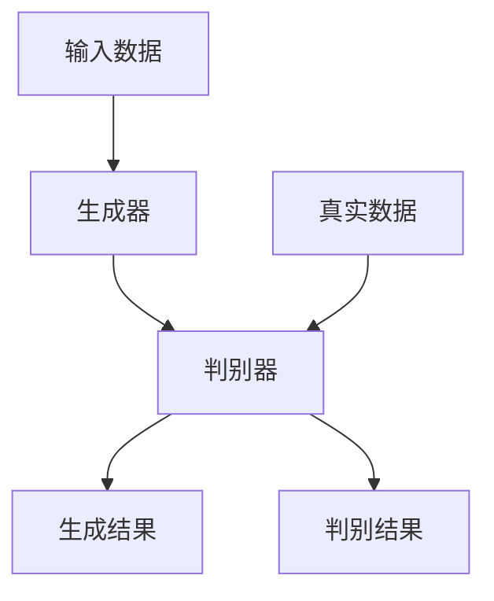
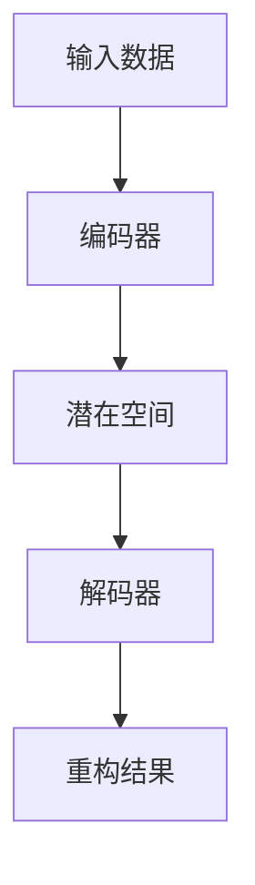
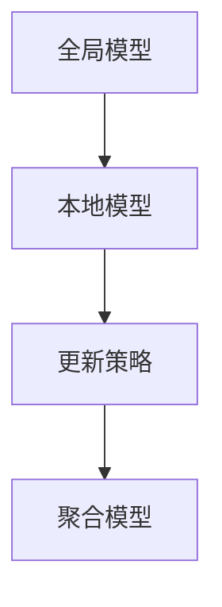

                 

# 开发AI Agent的跨模态内容生成系统

## 关键词
- AI Agent
- 跨模态内容生成
- GAN
- VAE
- 联邦学习

## 摘要
本文深入探讨了开发AI Agent的跨模态内容生成系统的过程，涵盖了从问题背景到核心概念、技术原理、算法实现以及系统分析与架构设计。通过一步步的逻辑分析，本文旨在为读者提供清晰、详尽的理解，帮助开发者在实际项目中有效应用跨模态内容生成技术。

### 目录大纲

----------------------------------------------------------------

# 开发AI Agent的跨模态内容生成系统

## 第一部分：背景与核心概念

## 第1章：问题背景与跨模态内容生成概述

### 1.1.1 跨模态内容生成的概念与重要性

#### 问题背景
随着人工智能技术的发展，AI Agent的应用越来越广泛，特别是在智能客服、智能家居、自动驾驶等领域。然而，这些AI Agent在处理跨模态内容方面存在一定的挑战，例如如何将文本、图像、视频等多种模态的内容进行有效整合和生成。

#### 跨模态内容生成的定义
跨模态内容生成是指将一种模态的数据转换为另一种或多种模态的数据的过程。例如，文本到图像（T2I）、图像到文本（I2T）、文本到视频（T2V）等。

#### 跨模态内容生成的重要性
跨模态内容生成技术在许多实际应用中都具有重要意义，可以提高AI Agent的智能化水平，提升用户体验。

### 1.1.2 跨模态内容生成的应用场景

#### 娱乐与媒体
例如，通过文本生成相关的图像或视频，以丰富内容的表现形式。

#### 教育与培训
例如，将文本内容转化为图像或视频，以帮助学生更好地理解和记忆知识。

#### 电商与广告
例如，通过图像或视频生成相关描述性的文本，以提高广告的效果。

#### 医疗与健康
例如，将医疗图像转化为易于理解的文本描述，以帮助医生和患者更好地沟通。

#### 金融与保险
例如，通过文本生成相关的图表或图像，以帮助用户更好地理解金融和保险产品。

### 1.1.3 跨模态内容生成的挑战与机遇

#### 技术挑战
跨模态内容生成的技术挑战包括数据的不一致性、模态间的映射关系复杂性以及生成结果的多样性等。

#### 市场机遇
随着AI技术的发展和应用的深入，跨模态内容生成市场前景广阔，具有巨大的商业价值。

## 第二部分：技术原理与算法

## 第3章：跨模态内容生成的算法原理

### 3.1.1 跨模态内容生成的基础算法

跨模态内容生成的基础算法主要包括生成对抗网络（GAN）、变分自编码器（VAE）和联邦学习（FL）等。

#### 3.1.2 GAN算法原理详解

GAN算法的核心思想是生成器（Generator）和判别器（Discriminator）之间的博弈。生成器的任务是生成类似于真实数据的假数据，而判别器的任务是区分真实数据和生成数据。通过这种对抗关系，生成器的生成质量不断提高，从而实现跨模态内容的生成。

#### 3.1.3 VAE算法原理详解

VAE算法的核心思想是将输入数据映射到一个潜在空间中，然后从潜在空间中采样，再通过解码器生成输出数据。通过这种方式，可以实现数据的高效表示和生成。

#### 3.1.4 FL算法原理详解

联邦学习（FL）是一种在分布式环境中训练模型的算法，它允许不同的设备协作训练一个共享的模型，而不需要交换它们的数据。FL适用于跨模态内容生成，因为它可以保护用户的隐私，同时实现数据的协同学习。

### 3.1.5 算法选择与优化
在实际应用中，根据具体场景和数据特点，可以选择不同的算法并进行优化，以达到最佳效果。

## 第4章：数学模型和数学公式

### 4.1.1 GAN算法的数学模型

GAN算法的数学模型主要包括损失函数和优化目标。

$$
\begin{aligned}
D(x) &= \log D(x) \\
G(z) &= \log G(z) \\
L_D &= -\frac{1}{N} \sum_{i=1}^N (\log D(x_i) + \log (1 - D(G(x_i))))
\end{aligned}
$$

其中，$D(x)$ 表示判别器对真实数据的判断，$G(z)$ 表示生成器对随机噪声 $z$ 的生成，$L_D$ 表示判别器的损失函数。

### 4.1.2 VAE的数学模型

VAE算法的数学模型主要包括编码器和解码器的损失函数。

$$
\begin{aligned}
p(x|\theta_x) &= \log p(z|\theta_z) + \log p(x|z,\theta_x) \\
L_{VAE} &= \frac{1}{N} \sum_{i=1}^N \left[ -\log p(x_i | z_i, \theta_x) - \log p(z_i | \theta_z) \right]
\end{aligned}
$$

其中，$p(x|\theta_x)$ 表示编码器对输入数据的编码，$p(z|\theta_z)$ 表示潜在空间中对噪声的采样，$p(x|z,\theta_x)$ 表示解码器对重构数据的生成。

## 第5章：系统分析与架构设计

### 5.1.1 问题场景介绍

#### 跨模态内容生成系统的需求分析
在开发AI Agent的跨模态内容生成系统时，需要明确系统的需求，包括支持多种模态的数据输入和输出、高效的算法实现以及用户友好的界面等。

#### 项目目标与期望效果
项目的目标是实现一个高效、可靠、易于扩展的跨模态内容生成系统，提高AI Agent的智能化水平和用户体验。

### 5.1.2 系统功能设计

#### 文本输入处理
系统应支持多种文本输入格式，并进行预处理，以提取有用的信息。

#### 图像输入处理
系统应支持图像输入，并进行特征提取和分类。

#### 视频输入处理
系统应支持视频输入，并实现视频到文本的转换。

#### 文本输出处理
系统应能根据输入数据生成相关文本。

#### 图像输出处理
系统应能根据输入数据生成相关图像。

#### 视频输出处理
系统应能根据输入数据生成相关视频。

### 5.1.3 系统架构设计

#### 总体架构设计
系统的总体架构应包括数据输入模块、数据处理模块、数据输出模块和用户交互模块等。

#### 数据处理模块架构设计
数据处理模块应包括图像处理模块、文本处理模块和视频处理模块等，每个模块应具有独立的算法实现和接口设计。

#### 用户交互模块架构设计
用户交互模块应包括用户界面和API接口，以支持用户对系统的操作和数据的获取。

### 5.1.4 系统接口设计和系统交互

#### 系统接口设计
系统应设计清晰的接口，包括API接口和数据库接口等，以方便用户和系统的集成和扩展。

#### 系统交互设计
系统应设计合理的交互流程，以提供良好的用户体验，包括数据输入、处理、输出和反馈等环节。

## 项目实战

### 5.2.1 环境安装
在开始项目实战之前，需要安装相关的开发环境，包括Python、TensorFlow、PyTorch等。

### 5.2.2 系统核心实现源代码
系统核心实现源代码应包括跨模态内容生成算法的实现、数据处理模块的实现、用户交互模块的实现等。

### 5.2.3 代码应用解读与分析
代码应用解读与分析应包括对算法原理的解读、对数据处理模块的解析、对用户交互模块的说明等。

### 5.2.4 实际案例分析和详细讲解剖析
通过实际案例的分析，可以更好地理解跨模态内容生成系统的应用和实现。

### 5.2.5 项目小结
项目小结应包括对项目成果的总结、对项目过程中的挑战和解决方案的回顾、对未来的展望等。

## 最佳实践 tips

### 5.3.1 最佳实践 tips
在开发跨模态内容生成系统时，可以考虑以下最佳实践：
- 选择合适的算法和框架，根据实际需求和数据特点进行优化。
- 对输入数据进行充分的预处理，以提高系统的鲁棒性和性能。
- 设计清晰的接口和交互流程，以提高用户体验。

### 5.3.2 小结
跨模态内容生成系统在AI Agent应用中具有重要意义，通过本文的探讨，读者可以全面了解其核心概念、技术原理、算法实现和系统设计。在实际开发过程中，应根据具体需求进行优化和调整，以实现高效、可靠、用户友好的系统。

### 5.3.3 注意事项
在开发跨模态内容生成系统时，需要注意以下几点：
- 数据安全和隐私保护。
- 系统性能和可扩展性。
- 用户交互体验和反馈机制。

### 5.3.4 拓展阅读
对于有兴趣深入了解跨模态内容生成系统的读者，以下资源可供参考：
- 《深度学习》（Goodfellow, Bengio, Courville） - 介绍深度学习的基本概念和算法。
- 《生成对抗网络：理论、算法与应用》（孙乐） - 详细讲解GAN算法的理论基础和应用实例。
- 《联邦学习：原理与实践》（王绍兰） - 介绍联邦学习的理论基础和实现方法。

## 作者信息

作者：AI天才研究院/AI Genius Institute & 禅与计算机程序设计艺术 /Zen And The Art of Computer Programming

---

通过以上内容，我们系统地介绍了开发AI Agent的跨模态内容生成系统的全过程。希望本文能够为读者提供有价值的参考和启示，帮助他们在实际项目中更好地应用跨模态内容生成技术。

