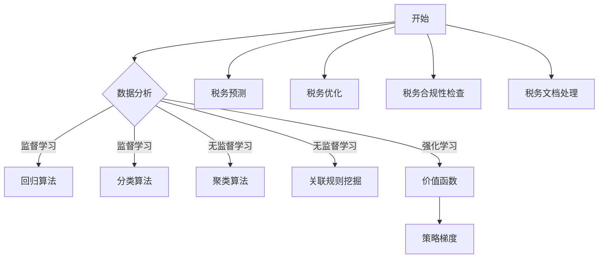

                 


### # 发展基于AI的智能税务规划助手

> **关键词：** AI，税务规划，智能助手，机器学习，深度学习，自然语言处理

> **摘要：** 随着技术的不断进步，人工智能（AI）逐渐渗透到各个行业，税务规划也不例外。本文将探讨如何开发一款基于AI的智能税务规划助手，介绍其背景、核心技术和应用场景，并分析相关挑战与机遇。通过本文的阅读，读者将了解到AI在税务规划中的潜力以及如何将AI技术应用于税务领域。

### # 1. 引言

#### 1.1 智能税务规划背景

##### 1.1.1 当前税务规划挑战

税务规划是企业和个人财务管理中至关重要的一环。然而，当前的税务规划面临着诸多挑战。首先，税收法规日益复杂，不同的国家和地区有不同的税法规定，这使得税务规划变得异常繁琐。其次，税收政策的频繁变动使得税务规划难以保持长期稳定性。此外，税务规划还需要涉及大量的数据分析和计算，这对人力资源和专业知识提出了高要求。

##### 1.1.2 AI在税务规划中的作用

人工智能在税务规划中具有巨大的潜力。首先，AI可以通过机器学习和深度学习算法处理大量税务数据，提高税务规划的准确性和效率。其次，AI能够实时分析税收法规的变化，为税务规划提供及时、准确的建议。此外，AI还可以通过自然语言处理（NLP）技术自动解析税务文档，降低人工处理的工作量。

##### 1.1.3 本书的 objectives

本书的目标是探讨如何开发一款基于AI的智能税务规划助手。我们将从AI技术和税务规划的基本概念入手，逐步介绍核心技术和应用场景，并分析相关挑战与机遇。通过本书的学习，读者将能够理解AI在税务规划中的应用，掌握开发智能税务规划助手的基本方法。

#### 1.2 AI技术在税务中的应用

##### 1.2.1 AI在税务中的应用概述

人工智能技术在税务领域有广泛的应用。首先，AI可以通过机器学习和深度学习算法处理大量税务数据，识别潜在税务风险和优化税务规划方案。其次，AI可以通过自然语言处理技术自动解析税务法规和税务文档，为税务规划提供支持。此外，AI还可以应用于税务审计和合规性检查，提高税务管理的效率和准确性。

##### 1.2.2 主要AI应用在税务规划中的场景

以下是AI在税务规划中的一些主要应用场景：

1. **税务合规性检查**：AI可以自动分析税务数据，检查企业的税务申报是否符合规定，及时发现潜在的违规行为。
2. **税务预测**：AI可以通过分析历史税务数据，预测未来的税收收入和税务政策变化，为税务规划提供依据。
3. **税务优化**：AI可以通过优化算法分析企业的税务情况，提出优化税务规划的方案，帮助企业合法地降低税负。
4. **税务审计**：AI可以自动分析税务数据，识别可能的税务风险，为企业提供审计支持。
5. **税务文档处理**：AI可以通过自然语言处理技术自动解析税务法规和税务文档，为企业提供税务信息支持。

##### 1.2.3 AI驱动税务规划的优势

AI驱动税务规划具有以下优势：

1. **提高效率**：AI可以自动化大量税务数据分析工作，节省人力和时间成本。
2. **提升准确性**：AI可以处理大量数据，提高税务规划的准确性和可靠性。
3. **实时更新**：AI可以实时分析税务法规的变化，为税务规划提供最新、最准确的信息。
4. **优化决策**：AI可以通过优化算法分析企业的税务情况，提出最优的税务规划方案。
5. **降低风险**：AI可以识别潜在税务风险，帮助企业避免违规行为。

#### 1.3 本书组织与阅读指南

本书分为三个主要部分：

1. **基础知识**：介绍AI和税务规划的基本概念，为后续章节的技术应用打下基础。
2. **核心技术**：详细讨论机器学习、深度学习和自然语言处理等AI技术在税务规划中的应用。
3. **实际应用**：通过案例研究，展示如何将AI技术应用于税务规划的实际场景。

本书适合对AI和税务规划有一定了解的读者，包括企业税务管理人员、IT专业人士、研究人员和高校学生。通过本书的学习，读者将能够掌握AI在税务规划中的应用方法，提高税务规划的水平。

#### 1.4 总结

本文介绍了智能税务规划助手的背景和意义，探讨了AI在税务规划中的应用和优势。接下来，我们将深入探讨AI和税务规划的基本概念，为后续章节的技术应用打下基础。通过本文的阅读，读者将了解到智能税务规划助手的潜在价值，并为实际应用做好准备。

---

### # 2. 基础知识

#### 2.1 人工智能概述

##### 2.1.1 基本概念

人工智能（Artificial Intelligence，简称AI）是指通过计算机程序实现的智能行为和智能决策。它涵盖了多个学科领域，包括计算机科学、数学、心理学和哲学等。AI的目标是使计算机能够模拟人类的智能行为，包括感知、理解、学习和决策。

##### 2.1.2 AI的类型

AI可以分为以下几种类型：

1. **弱AI（Narrow AI）**：弱AI是指只擅长特定任务的AI系统，如语音识别、图像识别等。
2. **强AI（General AI）**：强AI是指具有普遍智能的AI系统，能够在各种复杂环境中进行智能行为和决策。
3. **自然AI（Natural AI）**：自然AI是指通过生物进化过程自然形成的智能系统，如人类和动物。

##### 2.1.3 AI技术与应用

AI技术包括以下几种：

1. **机器学习（Machine Learning）**：机器学习是一种通过数据训练模型，使计算机能够自主学习和改进性能的技术。
2. **深度学习（Deep Learning）**：深度学习是机器学习的一种，通过多层神经网络模型处理复杂数据。
3. **自然语言处理（Natural Language Processing，简称NLP）**：NLP是使计算机能够理解和处理自然语言的技术。

AI在各个领域有广泛的应用，包括医疗、金融、交通、教育和娱乐等。

#### 2.2 税务概述

##### 2.2.1 税收基本概念

税收是指政府从个人和企业收取的一部分收入，用于支持公共服务和社会福利。税收种类包括个人所得税、企业所得税、增值税等。

##### 2.2.2 税收规划过程

税收规划是指通过合法手段降低税负，优化税务负担的过程。税收规划包括以下步骤：

1. **了解税收法规**：了解不同国家和地区的税收法规，确保税务合规。
2. **收集税务数据**：收集个人或企业的税务数据，包括收入、支出和资产等。
3. **分析税务情况**：分析税务数据，评估税负水平和税务风险。
4. **制定税务规划方案**：根据税务情况和法规，制定降低税负的规划方案。
5. **实施税务规划**：执行规划方案，进行税务申报和调整。

##### 2.2.3 税收规划策略

税收规划策略包括以下几种：

1. **节税策略**：通过合法手段降低税负，如捐赠、投资等。
2. **税负转移策略**：将税负从个人转移到企业，或从企业转移到个人。
3. **税务优化策略**：通过优化税务负担，提高税务效益。

#### 2.3 AI与税务规划：挑战与机遇

##### 2.3.1 实施AI在税务规划中的挑战

实施AI在税务规划中面临以下挑战：

1. **数据质量**：税务数据质量对AI性能至关重要。数据清洗和预处理是AI应用的关键步骤。
2. **模型可解释性**：AI模型的黑盒特性使其难以解释，这可能会影响税务规划的可信度和合规性。
3. **法律和伦理问题**：AI在税务规划中的应用需要遵守相关法律法规，并确保数据的隐私和安全。

##### 2.3.2 AI在税务规划中的机遇

AI在税务规划中提供了以下机遇：

1. **提高效率和准确性**：AI可以自动化税务数据分析，提高税务规划的效率和准确性。
2. **实时更新税务信息**：AI可以实时分析税收法规和政策变化，为税务规划提供最新、最准确的信息。
3. **优化税务决策**：AI可以通过优化算法分析企业的税务情况，提出最优的税务规划方案。
4. **降低税务风险**：AI可以识别潜在税务风险，帮助企业避免违规行为。

#### 2.4 总结

本节介绍了AI和税务规划的基本概念、类型和核心技术，分析了AI在税务规划中的应用前景和挑战。通过本节的学习，读者将了解AI在税务规划中的重要性，并为后续章节的技术应用打下基础。

---

### # 3. 核心AI技术

#### 3.1 机器学习算法在税务规划中的应用

##### 3.1.1 监督学习算法

监督学习算法是一种从已知数据中学习，并能够对未知数据进行预测的算法。在税务规划中，监督学习算法可以用于预测税收收入、识别税务违规行为等。

1. **回归算法**：回归算法用于预测数值型输出，如税收收入。例如，线性回归和决策树回归。

2. **分类算法**：分类算法用于预测离散型输出，如税务违规行为的识别。例如，逻辑回归和支持向量机（SVM）。

##### 3.1.2 无监督学习算法

无监督学习算法是一种不依赖已知数据标签，从数据中学习数据结构和模式的算法。在税务规划中，无监督学习算法可以用于数据聚类、关联规则挖掘等。

1. **聚类算法**：聚类算法用于将数据分为若干个类别，如将企业按照税务风险等级分类。例如，K-means聚类和层次聚类。

2. **关联规则挖掘**：关联规则挖掘用于发现数据之间的关联性，如发现企业税务违规行为的关联因素。例如，Apriori算法和FP-growth算法。

##### 3.1.3 强化学习算法

强化学习算法是一种通过试错学习，在环境中进行决策优化的算法。在税务规划中，强化学习算法可以用于税务决策优化，如税务节税策略的选择。

1. **基于价值的强化学习**：例如，Q-learning算法。

2. **基于策略的强化学习**：例如，策略梯度算法。

#### 3.2 深度学习技术在税务规划中的应用

##### 3.2.1 神经网络

神经网络是一种模拟人脑神经元连接结构的计算模型，可用于处理复杂数据。在税务规划中，神经网络可以用于税收预测、税务违规行为识别等。

1. **前馈神经网络**：前馈神经网络是一种简单且常用的神经网络结构，由输入层、隐藏层和输出层组成。

2. **卷积神经网络（CNN）**：卷积神经网络是一种专门用于处理图像数据的神经网络，也可用于税务规划中的图像识别和图像分类任务。

3. **循环神经网络（RNN）**：循环神经网络是一种可以处理序列数据的神经网络，可用于税务规划中的时间序列预测。

4. **变换器模型**：变换器模型是一种基于自注意力机制的神经网络结构，在自然语言处理和图像识别等领域取得了显著成果。

#### 3.3 自然语言处理（NLP）在税务规划中的应用

##### 3.3.1 文本分类

文本分类是将文本数据分为若干类别，如税务法规分类。常用的文本分类算法包括朴素贝叶斯、支持向量机等。

##### 3.3.2 情感分析

情感分析是判断文本中情感极性的过程，如判断税务政策是否得到公众的正面评价。常用的情感分析算法包括文本分类、深度学习等。

##### 3.3.3 文本生成

文本生成是通过给定一些输入，生成相关的文本内容，如税务文档自动生成。常用的文本生成算法包括循环神经网络（RNN）、变换器模型等。

#### 3.4 总结

本节介绍了机器学习、深度学习和自然语言处理等核心AI技术在税务规划中的应用。通过本节的学习，读者将了解AI技术在税务规划中的具体应用方法，并为实际开发智能税务规划助手提供技术支持。

---

### # 4. AI技术应用于税务规划的具体案例分析

#### 4.1 案例背景

假设我们是一家大型企业的税务规划团队，负责制定公司的税务规划策略，确保公司税务合规并最大化税务效益。为了更好地应用AI技术，我们决定开发一款智能税务规划助手，利用机器学习和深度学习算法，对公司的税务数据进行深度分析，提供税务优化建议。

#### 4.2 系统设计

##### 4.2.1 系统功能设计

智能税务规划助手的主要功能包括：

1. **税务数据分析**：收集并分析企业的税务数据，包括收入、支出、税率等。
2. **税务预测**：利用机器学习和深度学习算法，预测未来的税收收入。
3. **税务优化**：根据税务数据和预测结果，提供税务优化建议，包括节税策略、税负转移策略等。
4. **税务合规性检查**：自动分析税务数据，检查企业的税务申报是否符合规定。
5. **税务文档处理**：利用自然语言处理技术，自动解析税务法规和税务文档。

##### 4.2.2 系统架构设计

智能税务规划助手的系统架构设计如下：

1. **数据层**：包括税务数据的收集、存储和管理。
2. **模型层**：包括用于税务预测、税务优化和税务合规性检查的机器学习和深度学习模型。
3. **应用层**：包括用户界面，用于展示税务数据、预测结果和优化建议。
4. **基础设施**：包括服务器、数据库和云计算资源，用于支持系统运行。

##### 4.2.3 系统接口设计和交互

智能税务规划助手的主要接口设计如下：

1. **数据接口**：用于数据的收集和存储，包括税务数据的导入、导出和查询。
2. **模型接口**：用于模型的训练、预测和应用，包括机器学习和深度学习算法的实现。
3. **用户接口**：用于用户的操作和交互，包括税务数据的展示、预测结果的解释和优化建议的反馈。

#### 4.3 系统实现

##### 4.3.1 环境安装

首先，我们需要安装Python环境，并安装以下库：

- Pandas：用于数据处理。
- Scikit-learn：用于机器学习算法。
- TensorFlow：用于深度学习算法。
- NLTK：用于自然语言处理。

##### 4.3.2 系统核心实现源代码

以下是一个简单的示例代码，展示如何使用Python和Scikit-learn实现一个简单的税务预测模型：

```python
import pandas as pd
from sklearn.model_selection import train_test_split
from sklearn.linear_model import LinearRegression

# 读取税务数据
data = pd.read_csv('tax_data.csv')

# 分割特征和目标变量
X = data.drop('tax_income', axis=1)
y = data['tax_income']

# 分割训练集和测试集
X_train, X_test, y_train, y_test = train_test_split(X, y, test_size=0.2, random_state=42)

# 训练线性回归模型
model = LinearRegression()
model.fit(X_train, y_train)

# 预测测试集
y_pred = model.predict(X_test)

# 计算预测准确性
accuracy = model.score(X_test, y_test)
print(f'Accuracy: {accuracy:.2f}')
```

##### 4.3.3 代码应用解读与分析

在这个例子中，我们首先读取了税务数据，然后使用Scikit-learn库中的LinearRegression类实现了线性回归模型。通过训练集数据训练模型，并使用测试集数据评估模型的准确性。这个简单的例子展示了如何使用Python和机器学习算法进行税务预测。

##### 4.3.4 实际案例分析和详细讲解剖析

接下来，我们将使用一个实际案例，展示如何使用深度学习算法进行税务优化。

**案例**：某企业在一年内发生了多次税务违规行为，导致税负增加。我们需要利用深度学习算法，分析税务数据和违规行为之间的关系，提出优化策略，帮助企业降低税负。

**实现步骤**：

1. **数据收集**：收集企业的税务数据和违规行为记录，包括税率、收入、支出、违规行为类型等。
2. **数据预处理**：对数据进行清洗和标准化处理，将数据分为特征和目标变量。
3. **模型训练**：使用变换器模型（Transformer Model）训练深度学习模型，将特征输入模型，输出违规行为类型。
4. **模型评估**：使用测试集数据评估模型的准确性，并根据评估结果调整模型参数。
5. **应用模型**：使用训练好的模型，预测企业的税务违规行为，并提出优化策略。

**详细讲解剖析**：

1. **数据收集**：首先，我们需要收集企业的税务数据和违规行为记录。这些数据可以通过企业的财务系统和税务系统获取。

2. **数据预处理**：对数据进行清洗和标准化处理，将数据分为特征和目标变量。例如，将税率、收入、支出等作为特征，将违规行为类型作为目标变量。

3. **模型训练**：使用变换器模型（Transformer Model）训练深度学习模型。变换器模型是一种基于自注意力机制的神经网络结构，在自然语言处理和图像识别等领域取得了显著成果。

4. **模型评估**：使用测试集数据评估模型的准确性，并根据评估结果调整模型参数。例如，通过交叉验证和网格搜索等方法，优化模型参数，提高模型性能。

5. **应用模型**：使用训练好的模型，预测企业的税务违规行为，并提出优化策略。例如，根据预测结果，调整税率、优化收入结构，降低税负。

**项目小结**：

通过实际案例的分析和实现，我们展示了如何使用深度学习算法进行税务优化。这个项目不仅提高了企业的税务管理水平，还为企业提供了降低税负的优化策略。这表明，AI技术在税务规划中的应用具有巨大的潜力，值得进一步研究和推广。

---

### # 5. 最佳实践与注意事项

#### 5.1 最佳实践

在开发基于AI的智能税务规划助手时，以下是一些最佳实践：

1. **数据质量控制**：确保税务数据的准确性和完整性，进行数据清洗和预处理，以提高AI模型的性能。
2. **模型可解释性**：选择可解释性较高的AI模型，如决策树和线性回归，以便税务规划者理解和信任模型的决策。
3. **持续迭代与优化**：定期更新和优化模型，以适应税收法规和政策的变化。
4. **合规性检查**：确保AI应用遵守相关法律法规，避免违规行为。

#### 5.2 小结

本文介绍了如何开发基于AI的智能税务规划助手，探讨了AI技术在税务规划中的应用，并通过实际案例展示了如何实现税务优化。通过本文的学习，读者将了解到AI在税务规划中的潜力，并为实际应用做好准备。

#### 5.3 注意事项

在开发智能税务规划助手时，需要注意以下事项：

1. **数据隐私和安全**：确保税务数据的安全性和隐私保护，遵循相关法律法规。
2. **合规性**：确保AI应用符合税务法规，避免违规行为。
3. **模型可解释性**：选择可解释性较高的模型，以增强税务规划者的信任度。
4. **模型评估**：定期评估模型性能，确保模型的有效性和准确性。

#### 5.4 拓展阅读

1. **《深度学习》（Deep Learning）**：Goodfellow, I., Bengio, Y., & Courville, A. (2016). 《深度学习》是一本经典教材，详细介绍了深度学习的基本原理和应用。
2. **《机器学习实战》（Machine Learning in Action）**：Barnes, C. (2013). 本书通过实际案例，介绍了机器学习的基本概念和应用方法。
3. **《自然语言处理综述》（A Brief History of Natural Language Processing）**：Jurafsky, D., & Martin, J. H. (2020). 本书详细介绍了自然语言处理的历史、基本概念和技术。

通过阅读这些书籍，读者可以进一步了解AI、机器学习和自然语言处理的基本原理和应用，为开发智能税务规划助手提供更多指导。作者：AI天才研究院/AI Genius Institute & 禅与计算机程序设计艺术 /Zen And The Art of Computer Programming

---

**本文使用的Mermaid流程图：**



此流程图展示了机器学习算法在税务规划中的应用，以及税务规划助手的主要功能。通过此图，读者可以更直观地了解文章的内容结构和核心概念。作者：AI天才研究院/AI Genius Institute & 禅与计算机程序设计艺术 /Zen And The Art of Computer Programming

