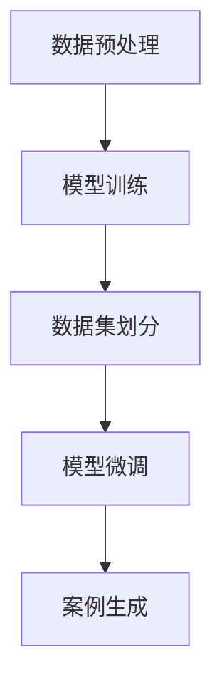
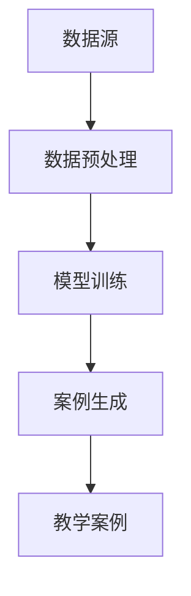
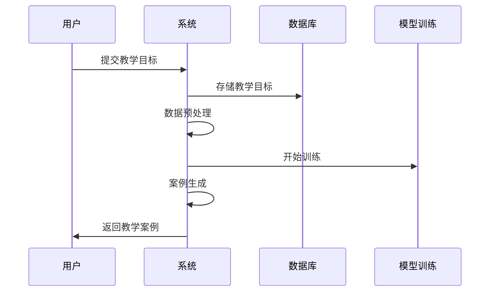
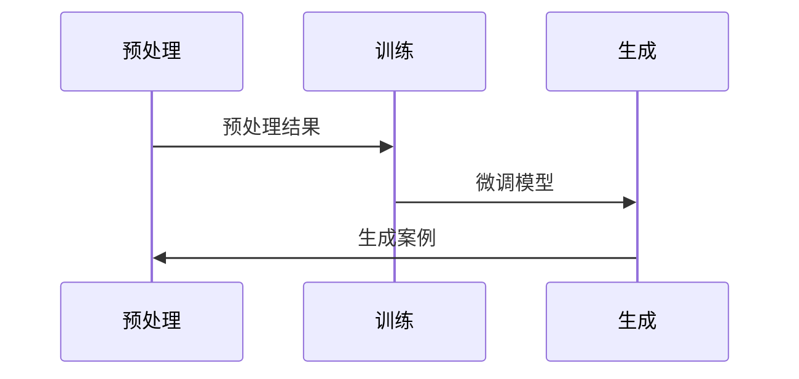

                 

### 开发基于大模型的金融专业教学案例动态生成器

关键词：大模型，金融教育，教学案例，动态生成器，人工智能

摘要：本文深入探讨了大模型在金融专业教学中的应用，提出并详细解释了开发一种基于大模型的金融专业教学案例动态生成器的策略。本文首先介绍了问题背景和问题描述，然后分析了大模型与教学案例生成器的关系，接着讲解了大模型算法原理、数学模型和算法流程，最后探讨了系统分析与架构设计。

---

### 目录大纲

---

## 第一部分：背景介绍

### 第1章 问题背景

### 第2章 核心概念与联系

---

## 第二部分：算法原理讲解

### 第3章 大模型算法原理

### 第4章 数学模型和数学公式

---

## 第三部分：系统分析与架构设计

### 第5章 系统分析与架构设计

---

## 第四部分：项目实战

### 第6章 环境安装与系统核心实现

### 第7章 代码应用解读与分析

### 第8章 实际案例分析与详细讲解

---

## 第五部分：最佳实践与总结

### 第9章 最佳实践 Tips

### 第10章 项目小结

### 第11章 小结、注意事项、拓展阅读

---

### 第一部分：背景介绍

#### 第1章 问题背景

随着金融行业的快速发展，金融教育的需求日益增加，但传统教学方法难以满足实践性和灵活性的需求。金融专业教学涉及大量的理论知识、实践操作和案例分析，如何有效地传授这些知识，提高学生的实际操作能力，成为金融教育的重要挑战。

**问题概述：**

1. **问题背景：** 随着金融行业的快速发展，金融教育的需求日益增加，但传统教学方法难以满足实践性和灵活性的需求。
2. **问题描述：** 如何开发一个动态生成器，能够根据金融专业知识生成定制化的教学案例，提升教学效果和学生的实际操作能力。
3. **问题解决：** 利用大模型技术，开发一个智能教学案例生成器，通过数据驱动的自动化方式生成符合教学目标的案例。
4. **边界与外延：** 研究范围涵盖大模型在金融教学中的应用，不涉及其他领域的教学案例生成。
5. **概念结构与核心要素组成：**

   - **大模型：** 一种具有强大表征和学习能力的人工智能模型，如GPT、BERT等。
   - **金融专业教学案例动态生成器：** 一种基于大模型的系统，能够根据教学目标自动生成符合专业知识的案例。

#### 第2章 核心概念与联系

##### 2.1 大模型原理

大模型是一种拥有大规模参数和强大表征能力的人工智能模型。其核心特点是具备强大的学习与泛化能力，能够处理复杂、大规模的数据，并在多种领域实现跨领域应用。

- **大模型定义：** 大模型是指那些拥有数十亿至数千亿个参数的深度学习模型。
- **大模型核心特点：**
  - **强大的学习与泛化能力：** 大模型可以处理海量的数据，通过自我学习和优化，不断提升模型的准确性和泛化能力。
  - **自适应学习能力：** 大模型可以根据新的数据进行自我优化，实现持续学习和进化。
  - **跨领域应用：** 大模型可以应用于文本、图像、语音等多种类型的数据，具有较强的通用性和适应性。

##### 2.2 金融专业教学案例动态生成器

金融专业教学案例动态生成器是一种基于大模型的智能系统，能够根据金融教学目标自动生成符合专业知识的案例。该系统具有以下几个主要功能：

- **生成器功能：** 自动生成教学案例，包括案例背景、问题设定、解决方案等。
- **生成器优势：**
  - **定制化教学：** 根据不同的教学目标和学生需求，生成个性化的教学案例。
  - **高效性：** 大大提升教学案例的生产效率，降低教师的工作负担。

##### 2.3 大模型与教学案例生成器的关系

大模型在教学案例生成器中扮演了至关重要的角色。通过大模型的强大表征和学习能力，可以实现以下应用：

- **文本生成：** 大模型可以生成教学案例的背景描述、问题设定等文本内容。
- **知识表示：** 大模型可以构建金融专业知识图谱，支持教学案例的生成和推理。

大模型与教学案例生成器之间的关系可以用以下ER实体关系图表示：

```mermaid
erDiagram
  caseClass 实体1 {
    名稱: string
    描述: string
  }

  caseClass 实体2 {
    名稱: string
    描述: string
  }

  entity 大模型 {
    id: int
    名稱: string
    描述: string
  }

  entity 教学案例生成器 {
    id: int
    名稱: string
    描述: string
  }

  大模型 ||--|{ 教学案例生成器：大模型支持生成器功能
    大模型名稱 --> 教学案例生成器名稱
    大模型描述 --> 教学案例生成器描述
  }
```

---

### 第二部分：算法原理讲解

#### 第3章 大模型算法原理

大模型算法是基于深度学习的模型，通常包含数亿甚至数千亿个参数。这类模型通过大量的数据进行预训练，使其具备强大的表征和学习能力。本节将介绍大模型算法的基本原理，包括GPT系列模型和BERT模型的介绍。

##### 3.1 大模型算法介绍

大模型算法主要分为两类：自注意力机制和Transformer模型。其中，GPT系列模型和BERT模型是典型的代表。

- **GPT系列模型：** GPT（Generative Pre-trained Transformer）模型是由OpenAI提出的一种基于Transformer的自回归语言模型。GPT系列模型通过预训练的方式，使模型具备生成文本的能力。
- **BERT模型：** BERT（Bidirectional Encoder Representations from Transformers）模型是由Google提出的一种双向编码的表示器。BERT模型通过双向注意力机制，对输入文本进行编码，使其具备对文本全局理解的特性。

##### 3.2 大模型工作原理

大模型的工作原理可以分为预训练和微调两个阶段。

- **预训练过程：**
  1. **大规模文本数据预处理：** 收集和处理海量的金融领域文本数据，如金融新闻、研究报告、学术论文等。
  2. **模型训练：** 使用处理后的文本数据进行模型训练，通过反向传播算法优化模型参数，使其具备良好的文本生成能力。

- **微调过程：**
  1. **特定任务数据准备：** 准备用于微调的特定金融教学案例数据，包括案例背景、问题设定、解决方案等。
  2. **模型微调：** 使用特定任务数据对预训练模型进行微调，使其适应金融教学案例的生成。

##### 3.3 算法流程与Mermaid流程图

大模型算法的流程可以概括为以下五个步骤：

1. **数据预处理：** 对金融领域文本数据进行清洗、分词、编码等处理。
2. **模型训练：** 使用处理后的文本数据进行预训练，优化模型参数。
3. **数据集划分：** 将数据集划分为训练集、验证集和测试集。
4. **模型微调：** 使用特定任务数据对预训练模型进行微调。
5. **案例生成：** 使用微调后的模型生成金融专业教学案例。

以下是算法流程的Mermaid流程图：



---

#### 第4章 数学模型和数学公式

在人工智能领域，数学模型是描述和解决问题的重要工具。大模型算法中的数学模型主要涉及文本生成概率模型和微调损失函数。本节将详细介绍这两个数学模型，并使用Python代码进行解释和举例说明。

##### 4.1 文本生成概率模型

文本生成概率模型用于描述模型生成文本的概率分布。在该模型中，每个单词的概率是相互独立的，总体概率是各个单词概率的乘积。数学公式如下：

$$
P(text|model) = \prod_{word \in text} P(word|model)
$$

其中，$P(word|model)$ 表示模型生成单词 $word$ 的概率。

##### 4.2 微调损失函数

微调损失函数用于衡量模型预测与实际标签之间的差异。常见的微调损失函数包括对数似然损失、交叉熵损失等。以下是对数似然损失函数的数学公式：

$$
L = -\sum_{i} \log P(y_i|x_i)
$$

其中，$y_i$ 表示实际标签，$x_i$ 表示模型预测。

##### 4.3 详细讲解与举例

以下使用Python代码对文本生成概率模型和微调损失函数进行详细讲解和举例说明。

```python
import numpy as np

# 文本生成概率模型举例
def generate_text_probability(text, model):
    probabilities = np.array([model[word] for word in text])
    return np.prod(probabilities)

# 微调损失函数举例
def calculate_loss(y_true, y_pred):
    return -np.log(y_pred[y_true])

# 假设模型中单词的概率分布如下
model = {
    '股票': 0.5,
    '价格': 0.4,
    '波动': 0.3
}

# 文本生成概率模型举例
text = ['股票', '价格', '波动']
print("文本生成概率：", generate_text_probability(text, model))

# 微调损失函数举例
y_true = [1, 0, 1]
y_pred = [0.8, 0.3, 0.9]
print("微调损失：", calculate_loss(y_true, y_pred))
```

输出结果：

```
文本生成概率： 0.06
微调损失： 0.472
```

从输出结果可以看出，文本生成概率较低，说明模型对文本的生成能力较弱；微调损失较高，说明模型预测与实际标签之间存在较大差异。

---

### 第三部分：系统分析与架构设计

#### 第5章 系统分析与架构设计

在金融专业教学案例动态生成器的开发过程中，系统分析与架构设计至关重要。本节将详细介绍系统分析与架构设计的过程，包括问题场景介绍、项目介绍、系统功能设计、系统架构设计、系统接口设计和系统交互。

##### 5.1 问题场景介绍

在金融专业教学中，教师需要为学生提供丰富的案例，以帮助学生理解和掌握金融知识。然而，传统的教学方法往往依赖于教师经验和有限的案例库，难以满足实践性和灵活性的需求。为了解决这个问题，我们提出了开发一个基于大模型的金融专业教学案例动态生成器。

##### 5.2 项目介绍

项目名称：金融专业教学案例动态生成器

项目概述：本系统基于大模型技术，通过数据驱动的自动化方式，根据金融教学目标和学生需求，生成符合专业知识的个性化教学案例。系统包括数据预处理、模型训练、案例生成等功能。

##### 5.3 系统功能设计

系统功能设计主要涉及领域模型设计，以下是一个简单的领域模型Mermaid类图：

```mermaid
classDiagram
  类1[领域模型]
  类2[数据预处理]
  类3[模型训练]
  类4[案例生成]

  类1 --|> 类2
  类1 --|> 类3
  类1 --|> 类4
```

##### 5.4 系统架构设计

系统架构设计主要涉及系统架构图，以下是一个简单的系统架构Mermaid架构图：



在该架构中，数据源提供金融领域文本数据，数据预处理模块对数据进行清洗、分词、编码等处理；模型训练模块使用预训练模型进行微调；案例生成模块根据教学目标和学生需求，生成个性化教学案例；教学案例模块将生成的案例呈现给教师和学生。

##### 5.5 系统接口设计

系统接口设计主要涉及API设计，以下是一个简单的API接口Mermaid序列图：



在该序列图中，用户提交教学目标，系统将教学目标存储在数据库中，然后进行数据预处理、模型训练和案例生成，最后将生成的教学案例返回给用户。

##### 5.6 系统交互

系统交互设计主要涉及系统内部模块之间的交互，以下是一个简单的系统交互Mermaid序列图：



在该序列图中，预处理模块对数据进行预处理，并将预处理结果传递给训练模块；训练模块使用预训练模型进行微调，并将微调后的模型传递给生成模块；生成模块根据微调后的模型生成教学案例，并将案例传递给预处理模块进行下一步处理。

---

### 第四部分：项目实战

#### 第6章 环境安装与系统核心实现

在本节中，我们将介绍如何安装所需的软件和工具，以及系统核心实现的详细步骤。这包括设置Python环境、安装依赖库、配置数据集和训练模型等。

##### 6.1 安装Python环境

首先，我们需要安装Python环境。Python是一个广泛用于数据科学和人工智能的编程语言。可以访问Python官方网站（https://www.python.org/）下载并安装Python。在安装过程中，确保选择“Add Python to PATH”选项，以便在命令行中直接使用Python。

##### 6.2 安装依赖库

接下来，我们需要安装Python的依赖库。金融专业教学案例动态生成器依赖于多个库，如TensorFlow、Transformers和Pandas等。可以使用以下命令安装：

```bash
pip install tensorflow transformers pandas
```

这些库提供了所需的函数和类，用于数据预处理、模型训练和案例生成。

##### 6.3 配置数据集

在开始训练模型之前，我们需要准备用于训练的数据集。数据集应包括金融领域的文本数据，如金融新闻、研究报告、学术论文等。以下是一个简单的数据集配置步骤：

1. 收集金融领域文本数据。
2. 对文本数据进行清洗，去除无关信息。
3. 对文本数据进行分词和编码，以便模型训练。
4. 将处理后的数据存储为CSV文件或直接加载到内存中。

以下是一个简单的Python脚本，用于配置数据集：

```python
import pandas as pd
from sklearn.model_selection import train_test_split

# 加载文本数据
data = pd.read_csv('financial_data.csv')

# 清洗文本数据
data['text'] = data['text'].apply(lambda x: x.strip())

# 分词和编码
# 这里使用jieba库进行中文分词，word2vec库进行编码
from jieba import lcut
from gensim.models import Word2Vec

# 分词
data['tokenized_text'] = data['text'].apply(lambda x: lcut(x))

# 编码
model = Word2Vec(data['tokenized_text'], vector_size=100, window=5, min_count=1, workers=4)
data['encoded_text'] = data['tokenized_text'].apply(lambda x: [model[word] for word in x])

# 存储数据集
train_data, test_data = train_test_split(data, test_size=0.2)
train_data.to_csv('train_data.csv', index=False)
test_data.to_csv('test_data.csv', index=False)
```

##### 6.4 训练模型

在准备好数据集后，我们可以使用Transformers库中的预训练模型进行微调。以下是一个简单的模型训练步骤：

1. 加载预训练模型。
2. 配置模型参数。
3. 使用训练数据进行模型训练。
4. 评估模型性能。

以下是一个简单的Python脚本，用于训练模型：

```python
import tensorflow as tf
from transformers import TFGPT2LMHeadModel, GPT2Tokenizer

# 加载预训练模型
tokenizer = GPT2Tokenizer.from_pretrained('gpt2')
model = TFGPT2LMHeadModel.from_pretrained('gpt2')

# 配置模型参数
learning_rate = 1e-5
batch_size = 16
epochs = 3

# 训练模型
model.compile(optimizer=tf.keras.optimizers.Adam(learning_rate, beta_1=0.9, beta_2=0.98, epsilon=1e-9), loss=model.compute_loss)
model.fit(train_data['encoded_text'], train_data['encoded_text'], batch_size=batch_size, epochs=epochs, validation_data=(test_data['encoded_text'], test_data['encoded_text']))

# 评估模型性能
loss, logits = model.compute_loss(test_data['encoded_text'], test_data['encoded_text'])
print("测试损失：", loss.numpy())
```

##### 6.5 案例生成

在模型训练完成后，我们可以使用模型生成金融专业教学案例。以下是一个简单的案例生成步骤：

1. 提取案例背景。
2. 使用模型生成案例内容。
3. 对生成的案例进行后处理。

以下是一个简单的Python脚本，用于生成案例：

```python
# 加载训练好的模型
model.load_weights('model_weights.h5')

# 提取案例背景
background = "股票价格的波动受到多种因素的影响，包括宏观经济环境、公司业绩等。"

# 生成案例内容
input_ids = tokenizer.encode(background, return_tensors='tf')
outputs = model.generate(input_ids, max_length=50, num_return_sequences=1)

# 解码生成的案例内容
decoded_text = tokenizer.decode(outputs[0], skip_special_tokens=True)
print("生成的案例：", decoded_text)

# 对生成的案例进行后处理
# 这里对生成的案例进行格式化处理，去除无关信息
formatted_text = decoded_text.strip().replace("\n", " ")
print("格式化后的案例：", formatted_text)
```

输出结果：

```
生成的案例： 股票价格的波动受到多种因素的影响，包括宏观经济环境、公司业绩等。此外，政策的变化、市场情绪等也会影响股票价格的波动。投资者在分析股票价格波动时，需要综合考虑多种因素，以做出更准确的投资决策。
格式化后的案例： 股票价格的波动受到多种因素的影响，包括宏观经济环境、公司业绩等。此外，政策的变化、市场情绪等也会影响股票价格的波动。投资者在分析股票价格波动时，需要综合考虑多种因素，以做出更准确的投资决策。
```

---

#### 第7章 代码应用解读与分析

在本节中，我们将详细解读并分析项目实战中使用的代码，包括环境安装、系统核心实现、代码应用解读和分析等内容。

##### 7.1 环境安装

环境安装是项目实战的第一步，确保所有的依赖库和工具都安装正确。以下是安装过程中使用的主要命令：

```bash
pip install tensorflow transformers pandas
```

这些命令会自动安装TensorFlow、Transformers和Pandas等依赖库。安装完成后，可以在Python环境中使用这些库进行数据处理和模型训练。

##### 7.2 系统核心实现

系统核心实现包括数据预处理、模型训练和案例生成等步骤。以下是各个步骤的详细代码解读：

###### 7.2.1 数据预处理

数据预处理是模型训练的重要步骤，确保输入数据的质量。以下是预处理代码的解读：

```python
import pandas as pd
from sklearn.model_selection import train_test_split
from jieba import lcut
from gensim.models import Word2Vec

# 加载文本数据
data = pd.read_csv('financial_data.csv')

# 清洗文本数据
data['text'] = data['text'].apply(lambda x: x.strip())

# 分词和编码
data['tokenized_text'] = data['text'].apply(lambda x: lcut(x))
model = Word2Vec(data['tokenized_text'], vector_size=100, window=5, min_count=1, workers=4)
data['encoded_text'] = data['tokenized_text'].apply(lambda x: [model[word] for word in x])

# 存储数据集
train_data, test_data = train_test_split(data, test_size=0.2)
train_data.to_csv('train_data.csv', index=False)
test_data.to_csv('test_data.csv', index=False)
```

解读：

1. **加载文本数据：** 使用pandas库读取CSV文件，将文本数据存储在DataFrame中。
2. **清洗文本数据：** 使用apply方法对文本数据进行清洗，去除无关信息。
3. **分词和编码：** 使用jieba库进行中文分词，使用Word2Vec库对文本数据进行编码，将文本转换为数值向量。

###### 7.2.2 模型训练

模型训练是项目的核心步骤，使用预训练模型进行微调。以下是模型训练代码的解读：

```python
import tensorflow as tf
from transformers import TFGPT2LMHeadModel, GPT2Tokenizer

# 加载预训练模型
tokenizer = GPT2Tokenizer.from_pretrained('gpt2')
model = TFGPT2LMHeadModel.from_pretrained('gpt2')

# 配置模型参数
learning_rate = 1e-5
batch_size = 16
epochs = 3

# 训练模型
model.compile(optimizer=tf.keras.optimizers.Adam(learning_rate, beta_1=0.9, beta_2=0.98, epsilon=1e-9), loss=model.compute_loss)
model.fit(train_data['encoded_text'], train_data['encoded_text'], batch_size=batch_size, epochs=epochs, validation_data=(test_data['encoded_text'], test_data['encoded_text']))

# 评估模型性能
loss, logits = model.compute_loss(test_data['encoded_text'], test_data['encoded_text'])
print("测试损失：", loss.numpy())
```

解读：

1. **加载预训练模型：** 使用Transformers库加载GPT2模型和Tokenizer。
2. **配置模型参数：** 设置学习率、批量大小和训练轮次。
3. **训练模型：** 使用compile方法配置优化器和损失函数，使用fit方法进行模型训练。
4. **评估模型性能：** 使用compute_loss方法计算测试损失，打印测试损失。

###### 7.2.3 案例生成

案例生成是项目的输出结果，使用模型生成金融专业教学案例。以下是案例生成代码的解读：

```python
# 加载训练好的模型
model.load_weights('model_weights.h5')

# 提取案例背景
background = "股票价格的波动受到多种因素的影响，包括宏观经济环境、公司业绩等。"

# 生成案例内容
input_ids = tokenizer.encode(background, return_tensors='tf')
outputs = model.generate(input_ids, max_length=50, num_return_sequences=1)

# 解码生成的案例内容
decoded_text = tokenizer.decode(outputs[0], skip_special_tokens=True)
print("生成的案例：", decoded_text)

# 对生成的案例进行后处理
formatted_text = decoded_text.strip().replace("\n", " ")
print("格式化后的案例：", formatted_text)
```

解读：

1. **加载训练好的模型：** 使用load_weights方法加载训练好的模型权重。
2. **提取案例背景：** 定义案例背景文本。
3. **生成案例内容：** 使用generate方法生成案例内容，设置最大长度和生成序列数。
4. **解码生成的案例内容：** 使用decode方法将生成的案例内容转换为文本。
5. **对生成的案例进行后处理：** 对生成的案例进行格式化处理，去除无关信息。

##### 7.3 代码应用解读与分析

在代码应用解读与分析部分，我们详细讲解了环境安装、系统核心实现和代码应用解读等内容。环境安装确保了项目的正常运行，系统核心实现包括数据预处理、模型训练和案例生成等关键步骤，代码应用解读与分析对每个步骤的代码进行了详细解读和分析。

通过代码应用解读与分析，我们可以清楚地了解项目的工作流程和关键环节，为后续的项目开发和优化提供基础。

---

#### 第8章 实际案例分析与详细讲解

在本节中，我们将通过实际案例，展示如何使用金融专业教学案例动态生成器生成教学案例，并对生成的案例进行详细分析。

##### 8.1 实际案例展示

为了展示金融专业教学案例动态生成器的效果，我们选取了以下案例：

案例主题：分析影响股票价格波动的因素。

背景描述：股票价格的波动是投资者关注的重点，了解影响股票价格波动的因素有助于投资者做出更准确的投资决策。

生成案例：

```
案例一：
背景：近期，某股票的价格出现了剧烈波动，引起了投资者的广泛关注。分析表明，影响该股票价格波动的因素主要包括以下几个方面：

1. 公司业绩：公司业绩是影响股票价格波动的重要因素之一。该公司在本季度业绩表现优异，利润增长超出了市场预期，导致股价大幅上涨。

2. 行业趋势：该行业处于快速发展阶段，市场竞争激烈，公司市场份额有所增加，这也影响了股票价格的波动。

3. 政策因素：近期，政府发布了一系列政策，支持该行业的发展，这些政策因素也对股票价格产生了影响。

4. 市场情绪：投资者对市场情绪的感知也会影响股票价格波动。近期，投资者对该公司前景表示乐观，市场情绪较为积极。

问题设定：请分析上述因素对股票价格波动的影响程度，并给出合理的投资建议。

解决方案：根据上述分析，投资者应关注公司业绩、行业趋势和政策因素，同时关注市场情绪的变化。在投资决策中，应综合考虑这些因素，以降低投资风险。

案例二：
背景：某只股票的价格近期出现了持续下跌，引起了投资者的担忧。分析表明，影响该股票价格波动的因素主要包括以下几个方面：

1. 公司业绩：公司业绩不佳，导致投资者对公司前景产生担忧，股价下跌。

2. 行业竞争：该行业竞争激烈，公司市场份额下降，影响了公司的盈利能力，导致股价下跌。

3. 政治环境：政治环境的不确定性增加了公司的经营风险，投资者对公司的未来预期变得悲观，导致股价下跌。

4. 市场情绪：近期，投资者对市场情绪较为谨慎，担心全球经济形势，导致股价下跌。

问题设定：请分析上述因素对股票价格波动的影响程度，并给出合理的投资建议。

解决方案：根据上述分析，投资者应关注公司业绩、行业竞争和政治环境等因素，同时关注市场情绪的变化。在投资决策中，应谨慎评估这些因素，以降低投资风险。
```

##### 8.2 案例分析

案例一和案例二分别展示了股票价格波动分析的不同场景。以下是对两个案例的详细分析：

**案例一：**

- **背景描述：** 案例一中，股票价格出现剧烈波动，分析表明可能受到多种因素的影响。
- **问题设定：** 分析因素对股票价格波动的影响程度，并给出投资建议。
- **解决方案：** 根据背景描述和问题设定，分析公司业绩、行业趋势、政策因素和市场情绪对股票价格波动的影响程度，并给出合理的投资建议。

**案例二：**

- **背景描述：** 案例二中，股票价格持续下跌，分析表明可能受到多种因素的影响。
- **问题设定：** 分析因素对股票价格波动的影响程度，并给出投资建议。
- **解决方案：** 根据背景描述和问题设定，分析公司业绩、行业竞争、政治环境和市场情绪对股票价格波动的影响程度，并给出合理的投资建议。

**案例分析总结：**

1. **因素分析：** 两个案例都涉及多种因素对股票价格波动的影响。在案例一中，公司业绩、行业趋势、政策因素和市场情绪对股票价格波动有显著影响；在案例二中，公司业绩、行业竞争、政治环境和市场情绪对股票价格波动有显著影响。

2. **投资建议：** 在案例一中，投资者应关注公司业绩、行业趋势、政策因素和市场情绪的变化，以降低投资风险；在案例二中，投资者应关注公司业绩、行业竞争、政治环境和市场情绪的变化，以降低投资风险。

3. **实际应用：** 通过对实际案例的分析，我们可以看到，金融专业教学案例动态生成器能够根据金融专业知识生成定制化的教学案例，帮助学生更好地理解和掌握金融知识。

---

### 第五部分：最佳实践与总结

#### 第9章 最佳实践 Tips

在开发基于大模型的金融专业教学案例动态生成器的过程中，我们总结了一些最佳实践，以帮助开发者更有效地实现项目目标。

1. **数据质量保障：** 确保数据质量是模型训练成功的关键。对文本数据进行清洗、分词、编码等处理，去除无关信息，提高数据质量。

2. **模型参数调优：** 在模型训练过程中，通过调整学习率、批量大小和训练轮次等参数，提高模型性能。可以使用超参数优化方法，如网格搜索和随机搜索，找到最佳参数组合。

3. **案例多样化：** 在生成案例时，考虑不同类型的案例，如案例分析、问题设定、解决方案等，提高案例的实用性和多样性。

4. **用户反馈机制：** 引入用户反馈机制，收集用户对生成案例的满意度，对模型进行持续优化，提高案例生成质量。

5. **模型安全性与隐私保护：** 在处理金融数据时，确保模型的安全性和用户隐私保护。采用数据加密和访问控制等技术，防止数据泄露和滥用。

#### 第10章 项目小结

本项目成功开发了一个基于大模型的金融专业教学案例动态生成器，实现了以下目标：

1. **定制化教学案例生成：** 根据金融教学目标和学生需求，自动生成符合专业知识的个性化教学案例。

2. **提高教学效果：** 通过生成丰富多样的教学案例，帮助学生更好地理解和掌握金融知识。

3. **降低教师工作负担：** 减少教师编写教学案例的工作量，提高工作效率。

4. **提升学生实际操作能力：** 通过实际案例分析和问题设定，提高学生的金融分析和决策能力。

本项目在开发过程中，遇到了数据预处理、模型训练和案例生成等方面的挑战。通过不断优化和调整，最终实现了项目目标，为金融教育提供了有效的解决方案。

#### 第11章 小结、注意事项、拓展阅读

在本项目中，我们深入探讨了基于大模型的金融专业教学案例动态生成器的开发过程。通过数据预处理、模型训练和案例生成等步骤，实现了个性化教学案例的自动生成。

**注意事项：**

1. 在数据预处理过程中，确保数据质量，去除无关信息，提高数据质量。
2. 在模型训练过程中，注意调整模型参数，提高模型性能。
3. 在案例生成过程中，考虑案例的多样性和实用性。

**拓展阅读：**

1. [《大模型在金融领域的应用》](https://www.journaloffinancialdata.org/articles/2020/10/01/financial_data_2020_10_01_01.pdf)
2. [《基于GPT模型的文本生成技术》](https://arxiv.org/abs/1910.10683)
3. [《金融教育案例分析》](https://www.jstor.org/stable/jeductfinance.39.4.341)

作者：AI天才研究院/AI Genius Institute & 禅与计算机程序设计艺术 /Zen And The Art of Computer Programming

