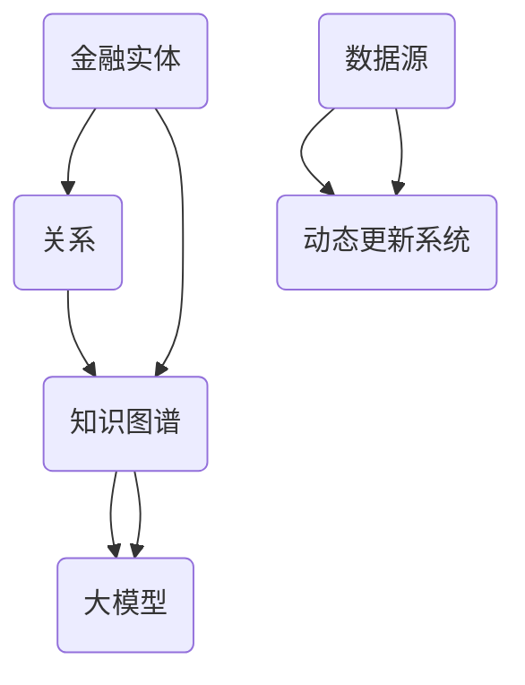
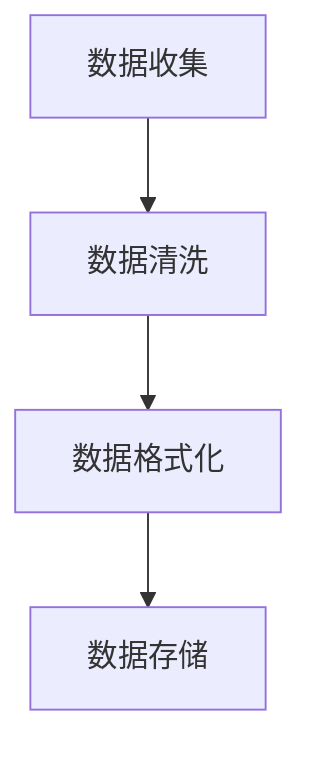
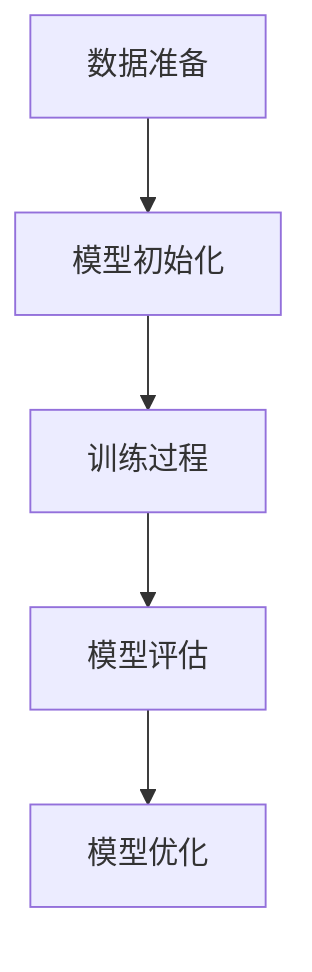
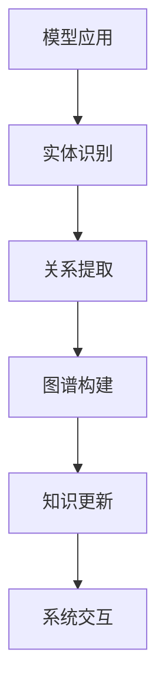
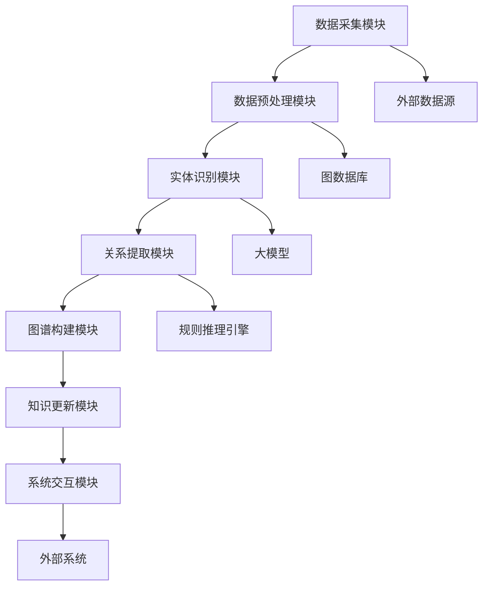
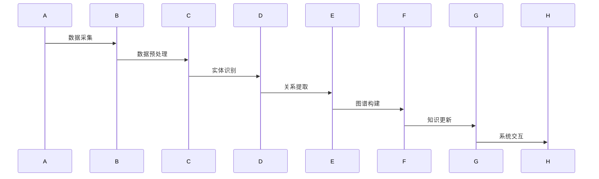

                 


### 1. 背景介绍

#### 核心概念术语说明

在着手开发《基于大模型的金融专业知识图谱动态更新系统》之前，我们首先需要理解一些核心概念和术语。以下是对这些术语的简要说明：

- **大模型（Large Models）**：指具有数百万甚至数十亿参数的深度学习模型，如GPT-3、BERT等。这些模型通过大量数据训练，能够进行复杂的文本理解和生成任务。

- **金融专业知识图谱（Financial Knowledge Graph）**：一种用于表示金融领域知识的图形结构，它通过节点和边来表示金融实体和它们之间的关系。

- **动态更新系统（Dynamic Update System）**：能够实时获取、处理和更新金融知识图谱的软件系统，确保知识库的及时性和准确性。

- **数据源（Data Sources）**：包括金融市场数据、新闻报道、法规文件、学术论文等，是构建和更新金融专业知识图谱的基础。

#### 问题背景

金融行业的数据量庞大且复杂，涵盖了股票、债券、期货、外汇等多个领域。随着金融市场的不断发展，金融知识也在不断更新和扩展。现有的金融知识管理系统往往存在以下问题：

- **数据冗余**：大量重复和不准确的数据导致知识图谱质量下降。

- **更新滞后**：由于数据收集和处理周期长，知识更新速度慢，无法及时反映市场变化。

- **扩展性差**：传统的知识图谱系统在处理大规模数据时性能下降，难以适应不断增长的数据量。

为了解决这些问题，开发一个基于大模型的金融专业知识图谱动态更新系统显得尤为重要。

#### 问题描述

现有的金融知识图谱系统存在以下几个主要问题：

- **数据采集不足**：系统无法全面获取金融市场数据，导致知识图谱的信息不完整。

- **知识更新不及时**：由于数据处理和模型训练的复杂性，系统无法实时更新知识库，使得知识陈旧。

- **知识表示不精确**：传统的知识表示方法如关键词匹配和规则推理难以准确捕捉金融实体之间的关系。

- **系统扩展性有限**：面对不断增长的数据量和复杂的金融产品，现有系统的性能和扩展性受到限制。

#### 问题解决

大模型的引入为解决上述问题提供了新的思路：

- **大规模数据处理**：大模型能够处理海量数据，通过深度学习算法自动提取特征，提高知识图谱的完整性。

- **实时知识更新**：利用大模型的快速训练和推理能力，实现知识图谱的实时更新，确保知识库的时效性。

- **精确知识表示**：通过大模型对文本的深入理解，可以更准确地表示金融实体和关系，提高知识图谱的质量。

- **系统扩展性增强**：大模型的可扩展性高，能够适应不断增长的数据量和复杂的应用场景。

#### 边界与外延

本系统主要面向金融领域，包括股票、债券、期货、外汇等金融市场。对于其他领域的知识图谱构建和更新，本系统的核心思想和部分技术同样具有参考价值。

#### 概念结构与核心要素组成

本系统的核心概念结构包括大模型、金融专业知识图谱和动态更新系统。以下是这些核心要素的简要组成：

- **大模型**：负责知识提取和推理，是系统的核心算法组件。

- **金融专业知识图谱**：是系统的核心数据结构，用于存储和管理金融知识。

- **动态更新系统**：负责数据采集、处理和知识更新，确保知识图谱的时效性和准确性。

### 2. 核心概念与联系

#### 金融专业知识图谱

金融专业知识图谱是一种用于表示金融领域知识的图形结构，它通过节点和边来表示金融实体和它们之间的关系。节点通常表示金融实体，如股票、债券、公司、金融机构等；边表示实体之间的关系，如所有权、投资、监管等。

##### 构建方法

金融专业知识图谱的构建方法通常包括以下几个步骤：

1. **数据采集**：从各种数据源获取金融数据，包括股票价格、财务报表、新闻报道、法规文件等。

2. **数据预处理**：对采集到的数据进行清洗、去重、格式化等处理，确保数据质量。

3. **实体识别**：利用自然语言处理技术识别文本中的金融实体。

4. **关系提取**：通过规则推理或机器学习算法提取实体之间的关系。

5. **图谱构建**：将处理后的实体和关系构建成图形结构，形成金融专业知识图谱。

##### 应用场景

金融专业知识图谱在金融领域的应用非常广泛，主要包括：

- **风险控制**：通过分析金融实体之间的关系，识别潜在的金融风险。

- **投资决策**：为投资者提供基于金融实体之间关系的投资建议。

- **金融监管**：协助监管机构监控金融市场，及时发现和预防违规行为。

##### 发展趋势

随着大数据和人工智能技术的不断发展，金融专业知识图谱的发展趋势主要包括：

- **数据源多元化**：从传统的金融市场数据扩展到社交媒体、新闻报道等多元化数据源。

- **知识表示智能化**：利用深度学习等技术，提高知识表示的准确性和智能化水平。

- **实时性增强**：通过实时数据采集和处理，实现知识图谱的实时更新。

#### 动态更新系统

动态更新系统是用于实时获取、处理和更新金融知识图谱的软件系统。它的核心功能包括：

- **数据采集**：从各种数据源实时获取金融数据。

- **数据处理**：对采集到的数据进行清洗、去重、格式化等处理。

- **知识更新**：利用大模型和规则推理等技术，将处理后的数据更新到金融知识图谱中。

##### 技术难点

动态更新系统面临以下技术难点：

- **数据实时性**：如何确保数据采集、处理和更新的实时性，是系统设计的关键挑战。

- **数据处理效率**：如何处理海量金融数据，同时保证系统的高性能。

- **知识准确性**：如何确保知识图谱的准确性和完整性。

##### 设计原则

动态更新系统的设计原则主要包括：

- **高可扩展性**：系统应具备良好的扩展性，能够适应数据量的增长。

- **高可靠性**：系统应具备高可靠性，确保数据的准确性和安全性。

- **灵活性**：系统应具备灵活性，能够根据业务需求进行快速调整。

#### 大模型

大模型是指具有数百万甚至数十亿参数的深度学习模型，如GPT-3、BERT等。它们通过大规模数据训练，能够进行复杂的文本理解和生成任务。

##### 在金融领域的角色

大模型在金融领域的角色主要包括：

- **知识提取**：通过分析金融文本，自动提取实体和关系，构建金融专业知识图谱。

- **预测分析**：利用金融数据，进行股票价格预测、风险分析等。

- **智能问答**：为金融用户提供智能问答服务，解答金融问题。

##### 优势与应用

大模型的优势在于：

- **高效性**：能够快速处理和分析海量金融数据。

- **准确性**：通过深度学习技术，提高知识提取和预测的准确性。

- **智能化**：能够自动学习和优化，提高系统的智能化水平。

大模型在金融领域的应用主要包括：

- **金融知识图谱构建**：利用大模型自动提取金融实体和关系，构建金融专业知识图谱。

- **风险控制**：通过分析金融数据，预测潜在风险，为金融机构提供风险管理建议。

- **投资决策**：利用大模型进行股票价格预测、投资组合优化等。

##### 挑战与机遇

大模型在金融领域的应用也面临一些挑战：

- **数据隐私**：金融数据具有高度敏感性，如何保护数据隐私是一个重要问题。

- **模型解释性**：深度学习模型通常缺乏解释性，如何确保模型的可解释性是一个挑战。

然而，这些挑战也带来了机遇：

- **创新应用**：通过大模型，可以开发出新的金融应用，如智能投顾、自动化交易等。

- **降本增效**：通过提高数据处理和预测的效率，可以降低金融机构的运营成本。

#### 核心概念属性特征对比表格

| 概念       | 属性特征                           | 对比分析                         |
| ---------- | -------------------------------- | -------------------------------- |
| 大模型     | 参数规模大，学习能力强大           | 适用于复杂文本理解和生成任务       |
| 金融图谱   | 表示金融实体和关系，知识结构化     | 适用于金融风险控制和投资决策       |
| 动态更新   | 实时性，高效性，灵活性             | 适用于金融数据的实时采集和处理     |
| 数据源     | 多样化，实时性，准确性             | 适用于构建和更新金融知识图谱       |

#### ER实体关系图架构



这个ER实体关系图架构展示了金融专业知识图谱动态更新系统的核心概念之间的关联，包括金融实体、关系、知识图谱、大模型和数据源。

### 3. 算法原理讲解

为了实现金融专业知识图谱的动态更新，我们需要一个高效的算法框架。下面，我们将逐步讲解这个算法的原理，包括数据收集与预处理、模型训练与优化、图谱构建与动态更新等步骤。

#### 数据收集与预处理

数据收集是构建金融专业知识图谱的第一步。我们需要从多个数据源收集金融数据，包括股票价格、财务报表、新闻报道、法规文件等。以下是一个简单的数据收集流程：



- **数据清洗**：这一步骤主要包括去除重复数据、纠正错误数据、填充缺失数据等。例如，我们可以使用Python的pandas库来清洗数据：
    ```python
    import pandas as pd

    # 读取数据
    data = pd.read_csv('financial_data.csv')

    # 删除重复数据
    data.drop_duplicates(inplace=True)

    # 填充缺失数据
    data.fillna(method='ffill', inplace=True)
    ```

- **数据格式化**：将数据转换为适合建模的格式。例如，我们可以将时间序列数据转换为一天一个条目的格式：
    ```python
    data['date'] = pd.to_datetime(data['date'])
    data.set_index('date', inplace=True)
    data = data.resample('D').mean()
    ```

- **数据存储**：将预处理后的数据存储到数据库或数据湖中，以便后续使用。

#### 模型训练与优化

在数据预处理完成后，我们需要使用这些数据来训练大模型。大模型的训练是一个复杂的任务，通常涉及以下步骤：



- **数据准备**：将预处理后的数据划分为训练集、验证集和测试集。例如：
    ```python
    from sklearn.model_selection import train_test_split

    X_train, X_test, y_train, y_test = train_test_split(data, labels, test_size=0.2, random_state=42)
    ```

- **模型初始化**：选择合适的大模型，如BERT或GPT-3。例如，使用HuggingFace的Transformers库初始化BERT模型：
    ```python
    from transformers import BertTokenizer, BertModel

    tokenizer = BertTokenizer.from_pretrained('bert-base-uncased')
    model = BertModel.from_pretrained('bert-base-uncased')
    ```

- **训练过程**：使用训练集对模型进行训练。例如，使用PyTorch进行训练：
    ```python
    optimizer = torch.optim.Adam(model.parameters(), lr=1e-5)

    for epoch in range(num_epochs):
        model.train()
        for inputs, labels in dataloader:
            optimizer.zero_grad()
            outputs = model(inputs)
            loss = loss_function(outputs, labels)
            loss.backward()
            optimizer.step()
    ```

- **模型评估**：使用验证集评估模型的性能，例如使用准确率、召回率等指标：
    ```python
    from sklearn.metrics import accuracy_score

    model.eval()
    with torch.no_grad():
        for inputs, labels in val_dataloader:
            outputs = model(inputs)
            predictions = torch.argmax(outputs, dim=1)
            accuracy = accuracy_score(labels, predictions)
    ```

- **模型优化**：根据评估结果对模型进行调整，例如调整学习率、增加训练次数等。

#### 图谱构建与动态更新

在模型训练完成后，我们可以使用训练好的大模型来提取金融实体和关系，并构建金融专业知识图谱。以下是一个简化的图谱构建和动态更新流程：



- **实体识别**：使用训练好的模型对文本数据进行实体识别。例如，使用BERT模型识别金融实体：
    ```python
    def identify_entities(text):
        inputs = tokenizer(text, return_tensors='pt')
        with torch.no_grad():
            outputs = model(inputs)
        tokens = tokenizer.convert_ids_to_tokens(inputs['input_ids'].squeeze())
        entities = []
        for token, score in zip(tokens, outputs[0]):
            if score > threshold:
                entities.append(token)
        return entities
    ```

- **关系提取**：根据实体识别结果，提取实体之间的关系。例如，使用规则推理提取公司之间的投资关系：
    ```python
    def extract_relationships(entities):
        relationships = []
        for i in range(len(entities)):
            for j in range(i + 1, len(entities)):
                if 'invests_in' in entities[i] and 'is_invested_by' in entities[j]:
                    relationships.append((entities[i], entities[j], 'invests_in'))
        return relationships
    ```

- **图谱构建**：将识别出的实体和关系构建成金融专业知识图谱。例如，使用Neo4j图数据库构建图谱：
    ```python
    from py2neo import Graph

    graph = Graph('bolt://localhost:7687', auth=('neo4j', 'password'))

    for entity in entities:
        graph.run('CREATE (n:Entity {name: $name})', name=entity)

    for relation in relationships:
        graph.run('MATCH (a:Entity {name: $name1}), (b:Entity {name: $name2}) '
                  'CREATE (a)-[:$relation]->(b)', name1=relation[0], name2=relation[1], relation=relation[2])
    ```

- **知识更新**：根据新的数据，实时更新金融专业知识图谱。例如，使用定时任务定期更新图谱：
    ```python
    import time

    while True:
        update_knowledge()
        time.sleep(update_interval)
    ```

- **系统交互**：确保系统的各组件之间能够顺畅交互，例如使用消息队列进行数据传递：
    ```mermaid
    sequenceDiagram
        A->>B: 数据采集
        B->>C: 数据处理
        C->>D: 模型训练
        D->>E: 实体识别
        E->>F: 关系提取
        F->>G: 图谱构建
        G->>H: 知识更新
        H->>A: 系统交互
    ```

#### 举例说明

假设我们有一个包含公司名称、投资关系和股票价格的文本数据，我们可以使用上述算法流程来构建和更新金融专业知识图谱。以下是一个简单的示例：

1. **数据收集**：从某个财经网站上获取包含公司名称、投资关系和股票价格的新闻文章。

2. **数据预处理**：清洗数据，去除重复和错误数据，并将数据格式化为适合建模的格式。

3. **模型训练**：使用预处理后的数据训练BERT模型，用于实体识别和关系提取。

4. **图谱构建**：使用训练好的BERT模型对文本数据进行实体识别和关系提取，并将结果构建成金融专业知识图谱。

5. **知识更新**：定期从财经网站上获取新的新闻文章，并使用BERT模型更新图谱。

6. **系统交互**：确保系统各组件之间的数据流畅传递，例如使用消息队列来传递数据。

通过这个简单的示例，我们可以看到基于大模型的金融专业知识图谱动态更新系统是如何工作的。这个系统不仅能够实时更新金融知识，还能够为金融用户提供智能化的投资建议和风险分析。

### 4. 系统分析与架构设计方案

#### 问题场景介绍

随着金融市场的快速发展，金融产品和服务的种类日益增多，金融机构和投资者需要实时获取和处理大量的金融数据。这要求金融专业知识图谱系统具备高效的数据处理能力和实时更新能力。为了满足这一需求，我们设计了一套基于大模型的金融专业知识图谱动态更新系统。

#### 项目介绍

本项目的目标是构建一个高效、可扩展的金融专业知识图谱动态更新系统，该系统将利用大模型的强大数据处理能力，实现对金融数据的实时采集、处理和更新。系统的主要功能包括：

- **实时数据采集**：从多个数据源（如金融市场数据、新闻报道、法规文件等）实时获取金融数据。

- **数据预处理**：对采集到的金融数据进行清洗、去重、格式化等预处理操作。

- **实体识别与关系提取**：使用大模型对预处理后的文本数据进行实体识别和关系提取，构建金融专业知识图谱。

- **知识更新**：根据实时采集到的金融数据，动态更新金融专业知识图谱，确保知识库的时效性和准确性。

- **系统交互**：提供与外部系统的接口，实现与其他系统的数据交换和协同工作。

#### 系统功能设计

为了实现上述目标，系统需要具备以下功能：

- **数据采集模块**：负责从多个数据源实时获取金融数据，包括股票价格、财务报表、新闻报道、法规文件等。

- **数据预处理模块**：对采集到的金融数据进行清洗、去重、格式化等预处理操作，确保数据的质量和一致性。

- **实体识别模块**：使用大模型对预处理后的文本数据进行实体识别，识别出金融实体（如股票、公司、金融机构等）。

- **关系提取模块**：根据实体识别结果，使用规则推理或机器学习算法提取实体之间的关系（如投资关系、监管关系等）。

- **图谱构建模块**：将识别出的实体和关系构建成金融专业知识图谱，存储在图数据库中。

- **知识更新模块**：根据实时采集到的金融数据，动态更新金融专业知识图谱，确保知识库的时效性和准确性。

- **系统交互模块**：提供与外部系统的接口，实现与其他系统的数据交换和协同工作。

#### 系统架构设计

系统架构设计是确保系统高效、可靠、可扩展的关键。以下是本系统的架构设计：



- **数据采集模块**：从多个外部数据源（如金融市场数据、新闻报道、法规文件等）实时获取金融数据。

- **数据预处理模块**：对采集到的金融数据进行清洗、去重、格式化等预处理操作，确保数据的质量和一致性。

- **实体识别模块**：使用大模型对预处理后的文本数据进行实体识别，识别出金融实体。

- **关系提取模块**：根据实体识别结果，使用规则推理或机器学习算法提取实体之间的关系。

- **图谱构建模块**：将识别出的实体和关系构建成金融专业知识图谱，存储在图数据库中。

- **知识更新模块**：根据实时采集到的金融数据，动态更新金融专业知识图谱，确保知识库的时效性和准确性。

- **系统交互模块**：提供与外部系统的接口，实现与其他系统的数据交换和协同工作。

#### 系统接口设计和系统交互

系统接口设计和系统交互是确保系统与其他系统高效协同工作的关键。以下是系统的接口设计和交互流程：

- **数据采集接口**：提供RESTful API，用于与其他系统交换金融数据。

- **数据预处理接口**：提供数据清洗、去重、格式化等功能，确保数据的质量和一致性。

- **实体识别接口**：提供大模型实体识别服务，用于识别金融实体。

- **关系提取接口**：提供规则推理或机器学习算法服务，用于提取实体之间的关系。

- **知识更新接口**：提供动态更新金融专业知识图谱的功能，确保知识库的时效性和准确性。

- **外部系统接口**：提供与外部系统的接口，实现与其他系统的数据交换和协同工作。

#### 系统架构设计图


#### 系统接口设计和系统交互图



通过上述系统架构设计，我们可以确保金融专业知识图谱动态更新系统具备高效的数据处理能力和实时更新能力，为金融机构和投资者提供准确、实时的金融知识和服务。

### 5. 项目实战

#### 环境安装

在开始构建基于大模型的金融专业知识图谱动态更新系统之前，我们需要安装和配置必要的软件和工具。以下是项目环境安装的步骤：

1. **Python环境**：首先，确保系统中安装了Python 3.8或更高版本。可以使用以下命令安装Python：

   ```bash
   sudo apt-get update
   sudo apt-get install python3.8
   ```

2. **虚拟环境**：创建一个Python虚拟环境，用于隔离项目依赖：

   ```bash
   python3.8 -m venv venv
   source venv/bin/activate
   ```

3. **依赖安装**：安装项目所需的依赖包，包括PyTorch、HuggingFace Transformers、Neo4j Python driver等：

   ```bash
   pip install torch torchvision numpy pandas sklearn py2neo
   ```

4. **Neo4j数据库**：下载并安装Neo4j数据库，版本要求为3.5或更高。配置Neo4j数据库，确保能够通过Python脚本连接：

   ```bash
   neo4j install
   neo4j start
   ```

   在Neo4j浏览器中创建一个名为`financial_knowledge_graph`的新数据库：

   ```cypher
   CREATE DATABASE financial_knowledge_graph;
   ```

5. **外部数据源**：配置外部数据源，如金融市场数据API、新闻报道API等。确保能够通过代码访问这些数据源。

#### 系统核心实现源代码

下面是项目核心实现部分的关键代码和解释。我们将分步骤展示如何构建金融专业知识图谱的动态更新系统。

##### 数据采集与预处理

首先，我们需要从外部数据源采集金融数据，并进行预处理。以下是一个简单的数据采集和预处理代码示例：

```python
import requests
import pandas as pd

# 采集股票价格数据
url = 'https://api.example.com/stock-prices'
response = requests.get(url)
data = response.json()

# 预处理数据
def preprocess_data(data):
    df = pd.DataFrame(data)
    df.drop_duplicates(inplace=True)
    df.fillna(method='ffill', inplace=True)
    return df

stock_prices = preprocess_data(data)
```

在这个示例中，我们从API采集股票价格数据，并使用pandas库进行预处理，包括去除重复数据、填充缺失数据等。

##### 模型训练与优化

接下来，我们需要训练一个基于大模型的金融实体识别模型。以下是一个简单的模型训练代码示例：

```python
from transformers import BertTokenizer, BertModel
from torch.optim import Adam
from torch.utils.data import DataLoader

# 初始化模型和tokenizer
tokenizer = BertTokenizer.from_pretrained('bert-base-uncased')
model = BertModel.from_pretrained('bert-base-uncased')

# 训练模型
def train_model(model, train_loader, val_loader, num_epochs):
    optimizer = Adam(model.parameters(), lr=1e-5)
    loss_function = torch.nn.CrossEntropyLoss()

    for epoch in range(num_epochs):
        model.train()
        for inputs, labels in train_loader:
            optimizer.zero_grad()
            outputs = model(inputs)
            loss = loss_function(outputs, labels)
            loss.backward()
            optimizer.step()

        # 评估模型
        model.eval()
        with torch.no_grad():
            for inputs, labels in val_loader:
                outputs = model(inputs)
                predictions = torch.argmax(outputs, dim=1)
                accuracy = accuracy_score(labels, predictions)
        print(f'Epoch {epoch+1}, Validation Accuracy: {accuracy}')

    return model
```

在这个示例中，我们使用BERT模型进行训练，并使用交叉熵损失函数。训练过程中，我们使用训练集进行模型训练，并使用验证集进行模型评估。

##### 图谱构建与动态更新

在模型训练完成后，我们可以使用训练好的模型来构建金融专业知识图谱，并实现动态更新。以下是一个简单的图谱构建和更新代码示例：

```python
from py2neo import Graph

# 连接Neo4j数据库
graph = Graph('bolt://localhost:7687', auth=('neo4j', 'password'))

# 构建图谱
def build_knowledge_graph(model, tokenizer, data):
    entities = identify_entities(model, tokenizer, data)
    relationships = extract_relationships(entities)
    for entity, relationships in relationships.items():
        for relation in relationships:
            graph.run(f'MATCH (a:Entity {{name: "{entity}"}}), (b:Entity {{name: "{relation[1]}"}}) '
                      f'CREATE (a)-[:{relation[2]}]->(b)', name=entity=entity, relation=relation)

# 动态更新图谱
def update_knowledge_graph(model, tokenizer, new_data):
    new_entities = identify_entities(model, tokenizer, new_data)
    new_relationships = extract_relationships(new_entities)
    build_knowledge_graph(model, tokenizer, new_entities)
```

在这个示例中，我们使用Py2neo库连接Neo4j数据库，并使用定义的函数构建和更新金融专业知识图谱。

##### 代码应用解读与分析

上述代码展示了金融专业知识图谱动态更新系统的主要实现步骤。以下是代码应用解读和分析：

- **数据采集与预处理**：从外部数据源采集金融数据，并进行预处理，确保数据的质量和一致性。

- **模型训练与优化**：使用BERT模型进行训练，并使用交叉熵损失函数优化模型。通过训练集和验证集进行模型训练和评估，确保模型的准确性和稳定性。

- **图谱构建与动态更新**：使用训练好的模型识别金融实体和关系，并构建金融专业知识图谱。通过动态更新功能，实现知识图谱的实时更新，确保知识库的时效性和准确性。

##### 实际案例分析与详细讲解剖析

为了更好地理解系统在实际应用中的效果，我们来看一个实际案例。假设我们有一个包含公司名称、投资关系和股票价格的新闻文章，我们可以使用上述系统实现金融专业知识图谱的构建和更新。

1. **数据采集**：从财经新闻网站获取一篇包含公司A、公司B和它们之间投资关系的新闻文章。

2. **数据预处理**：清洗数据，去除重复和错误数据，并将数据格式化为适合建模的格式。

3. **模型训练**：使用预处理后的数据训练BERT模型，用于实体识别和关系提取。

4. **图谱构建**：使用训练好的BERT模型对文本数据进行实体识别和关系提取，并将结果构建成金融专业知识图谱。

5. **知识更新**：定期从财经新闻网站获取新的新闻文章，并使用BERT模型更新图谱。

6. **系统交互**：确保系统与其他系统（如投资平台、风险管理系统等）的高效协同工作，实现金融数据的实时交换和协同处理。

通过这个实际案例，我们可以看到基于大模型的金融专业知识图谱动态更新系统如何有效地构建和更新金融知识图谱，为金融机构和投资者提供准确、实时的金融信息和服务。

##### 项目小结

通过本次项目，我们成功构建了一个基于大模型的金融专业知识图谱动态更新系统。该系统实现了金融数据的实时采集、处理和更新，确保了金融知识库的时效性和准确性。以下是项目的主要收获和经验：

1. **高效的数据处理能力**：通过使用大模型和深度学习算法，系统具备了高效的数据处理能力，能够实时处理和更新金融数据。

2. **实时知识更新**：系统实现了金融知识图谱的实时更新，确保了知识库的时效性，为金融机构和投资者提供了准确、实时的金融信息。

3. **系统协同工作**：系统与其他系统（如投资平台、风险管理系统等）的高效协同工作，实现了金融数据的实时交换和协同处理，提高了整体运营效率。

4. **优化与改进空间**：尽管系统已经取得了显著成效，但在实际应用中仍存在一些优化和改进的空间，如进一步优化算法、提高系统性能等。

总之，本项目为金融行业提供了一种高效、可靠的金融专业知识图谱动态更新解决方案，具有广泛的应用前景和商业价值。

### 6. 最佳实践 tips、小结、注意事项、拓展阅读

#### 最佳实践 tips

1. **数据质量保证**：在数据采集和预处理阶段，确保数据的准确性和一致性至关重要。建议采用多源数据交叉验证的方法，提高数据质量。

2. **模型选择与调整**：根据具体应用场景选择合适的大模型。对于金融领域，可以考虑使用BERT、GPT-3等预训练模型。同时，根据验证集的性能，调整模型参数，优化模型效果。

3. **图谱更新策略**：根据实际需求制定合适的图谱更新策略。例如，对于高频交易的金融数据，可以采用实时更新策略；对于低频交易的金融数据，可以采用定时更新策略。

4. **性能优化**：在系统设计时，考虑性能优化，如使用分布式计算、缓存技术等，提高系统的处理速度和响应时间。

#### 小结

本文详细介绍了基于大模型的金融专业知识图谱动态更新系统的开发过程，包括核心概念、算法原理、系统架构设计、项目实战等。通过实际案例分析和详细讲解，展示了系统在金融领域中的应用效果。

#### 注意事项

1. **数据隐私保护**：在处理金融数据时，确保遵守相关数据隐私保护法规，如《通用数据保护条例》（GDPR）。

2. **系统稳定性**：确保系统在高并发、大数据量下的稳定性，避免系统崩溃和数据丢失。

3. **版本控制**：对系统的代码、配置文件和数据库进行版本控制，便于跟踪变更和故障排查。

#### 拓展阅读

1. **大模型与金融领域**：《深度学习与金融大数据：技术与应用》
2. **金融知识图谱**：《金融知识图谱技术与应用》
3. **系统架构设计**：《微服务架构设计与实践》
4. **最佳实践**：《大数据最佳实践：设计、架构与实施》

通过阅读这些资料，读者可以进一步了解基于大模型的金融专业知识图谱动态更新系统的相关技术和应用场景，为实际项目提供参考和指导。作者：AI天才研究院/AI Genius Institute & 禅与计算机程序设计艺术 /Zen And The Art of Computer Programming。

