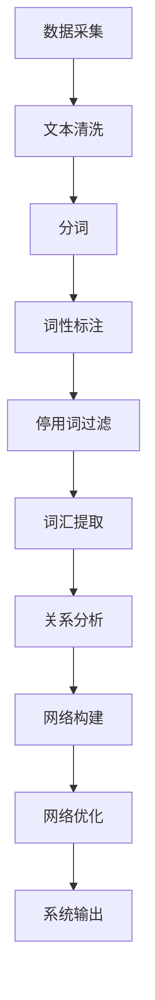
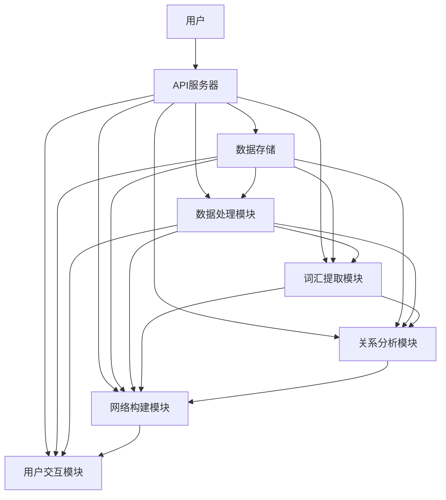
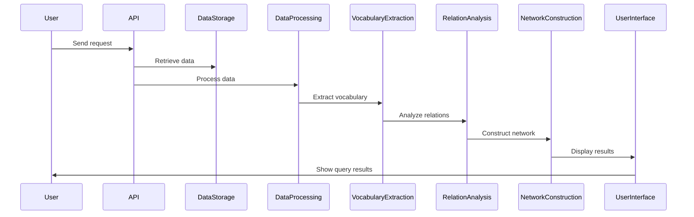

                 


# 开发基于大模型的金融专业词汇网络构建器

> 关键词：大模型、金融专业词汇、网络构建、算法、系统架构

> 摘要：本文将深入探讨如何开发一款基于大模型的金融专业词汇网络构建器。我们将从背景介绍、核心概念与技术原理、实现与优化、系统分析与架构设计、项目实战以及最佳实践与注意事项等多个方面进行详细阐述，旨在为读者提供全面的指导。

## 目录大纲设计过程

为了设计《开发基于大模型的金融专业词汇网络构建器》的目录大纲，我们需要遵循以下步骤：

1. **理解书名和主题**：书名表明了书籍的核心内容，即如何开发一个基于大模型的金融专业词汇网络构建器。这需要我们首先了解什么是大模型、金融专业词汇网络构建器，以及它们如何结合。

2. **确定核心章节**：基于书名，我们可以确定一些核心章节，如背景介绍、核心概念与技术原理、实现与优化等。

3. **细化每个章节**：对每个章节进行细化，确保每个章节都有足够的深度和广度，同时保持逻辑性和连贯性。

4. **编写每个章节的概要**：为每个章节编写概要，包括主要内容和目的，确保读者可以快速了解章节的主要内容和预期收获。

5. **确保内容完整性**：确保大纲中包含了所有必要的内容，如数学模型、算法原理、系统架构设计等。

6. **检查大纲结构**：确保大纲结构清晰，章节之间的过渡自然，整体逻辑连贯。

7. **字数控制**：在2000字以内完成整个目录大纲的设计。

### 目录大纲设计

下面是《开发基于大模型的金融专业词汇网络构建器》的目录大纲：

```markdown
----------------------------------------------------------------
# 第一部分：背景介绍

## 第1章：问题背景与目标

### 1.1 问题背景

- 金融专业词汇的重要性
- 现有解决方案的不足

### 1.2 问题描述

- 金融专业词汇的复杂性
- 现有工具的不足

### 1.3 问题解决

- 大模型的优势
- 构建金融专业词汇网络的必要性

### 1.4 边界与外延

- 大模型的定义
- 金融专业词汇网络的定义

### 1.5 概念结构与核心要素组成

- 金融专业词汇网络的关键要素
- 大模型的基本结构

## 第2章：核心概念与技术原理

### 2.1 大模型概述

- 大模型的基本原理
- 大模型在自然语言处理中的应用

### 2.2 金融专业词汇网络构建原理

- 金融专业词汇网络的概念
- 金融专业词汇网络的构建方法

### 2.3 关键技术与算法

- 语言模型
- 词嵌入
- 词汇网络分析算法

## 第3章：实现与优化

### 3.1 系统设计与架构

- 系统需求分析
- 系统架构设计

### 3.2 算法实现与优化

- 算法流程
- 优化策略

### 3.3 数据处理与清洗

- 数据来源
- 数据预处理方法

## 第4章：系统分析与架构设计方案

### 4.1 问题场景介绍

- 金融专业词汇网络的构建需求

### 4.2 系统功能设计

- 系统功能模块
- 领域模型设计（Mermaid类图）

### 4.3 系统架构设计

- 系统架构设计（Mermaid架构图）
- 系统部署与运行

### 4.4 系统接口设计

- 系统接口设计
- 系统交互设计（Mermaid序列图）

## 第5章：项目实战

### 5.1 环境安装与配置

- 开发环境搭建
- 所需工具与软件安装

### 5.2 系统核心实现

- 系统核心代码实现
- 代码解读与分析

### 5.3 实际案例分析与讲解

- 案例选择
- 案例分析与详细讲解

### 5.4 项目小结

- 项目总结
- 项目经验与启示

## 第6章：最佳实践与注意事项

### 6.1 最佳实践

- 开发过程中的经验总结
- 优化技巧与策略

### 6.2 注意事项

- 可能遇到的问题与解决方案
- 使用大模型时需注意的问题

### 6.3 拓展阅读

- 相关文献与资源推荐
- 行业发展趋势与展望

## 第7章：总结与展望

### 7.1 书籍总结

- 主要内容回顾
- 知识点梳理

### 7.2 展望未来

- 技术发展趋势
- 金融专业词汇网络构建器的未来发展方向

----------------------------------------------------------------
```

### 注意事项

- **简洁性**：每个章节的概要尽量简洁明了，避免冗长描述。
- **逻辑性**：确保章节之间的逻辑连贯，过渡自然。
- **内容完整性**：确保每个章节都有足够的深度和广度，尤其是技术原理和系统架构设计部分。
- **字数控制**：在2000字以内完成目录大纲的设计。

这个目录大纲设计是否满足您的需求？如果需要进一步调整或添加内容，请告知。

----------------------------------------------------------------

### 文章正文

#### 第1章：问题背景与目标

金融领域作为一个高度专业化的领域，拥有其独特的一套术语和概念体系。这些词汇和概念对于金融从业者和研究者来说至关重要，但对于初学者和普通公众来说，却往往显得晦涩难懂。因此，构建一个金融专业词汇网络，以帮助人们更好地理解和掌握金融知识，成为一个迫切需要解决的问题。

#### 1.1 问题背景

金融专业词汇的重要性体现在多个方面。首先，金融术语是金融交易、投资决策和风险管理的基础。无论是银行职员、投资顾问还是普通投资者，都需要对这些术语有深入的理解。其次，金融专业词汇对于学术研究和教育培训也至关重要。在学术研究中，金融术语是交流思想、进行论证和发表成果的重要工具；在教育领域，准确、清晰的金融专业词汇是教学效果和质量的重要保障。

然而，现有的解决方案存在一些不足。传统的金融词典和术语手册虽然提供了一定程度的帮助，但在网络时代，这些工具显得过于笨拙和低效。电子版的金融词典和术语手册虽然更加便捷，但仍然难以应对金融领域的快速发展和不断涌现的新术语。此外，现有的工具往往缺乏互动性和智能化，难以满足用户个性化的需求。

#### 1.2 问题描述

金融专业词汇的复杂性是构建金融专业词汇网络所面临的主要挑战之一。金融术语往往具有多义性、歧义性和专业性，这使得词汇网络构建的难度大大增加。此外，金融领域涉及多个子领域，如投资、银行、保险、证券等，每个子领域都有自己的专业术语和概念体系，这使得词汇网络的构建更加复杂。

现有工具的不足也限制了金融专业词汇网络的构建。现有的金融词典和术语手册虽然提供了丰富的金融词汇，但缺乏对词汇之间关系的深入分析，无法形成完整的词汇网络。此外，现有工具在数据来源、数据清洗和数据整合方面也存在一定的困难，难以提供高质量、准确和全面的金融专业词汇网络。

#### 1.3 问题解决

大模型的优势在于其强大的数据处理和知识提取能力。通过利用大模型，我们可以从海量金融文本中提取出金融专业词汇，并对这些词汇之间的关系进行深入分析。大模型可以自动处理金融术语的多义性和歧义性，从而构建出更加准确和完整的金融专业词汇网络。

构建金融专业词汇网络的必要性体现在多个方面。首先，它可以提高金融知识的可访问性，帮助更多的人理解和掌握金融知识。其次，它可以促进金融学术研究和教育培训的发展，为学术交流和教育创新提供新的工具和平台。此外，金融专业词汇网络还可以为金融产品和服务的创新提供支持，帮助企业更好地理解和满足客户需求。

#### 1.4 边界与外延

大模型的定义：大模型通常指的是具有大规模参数和强大计算能力的深度学习模型。这些模型可以处理海量数据，提取出丰富的知识信息，并在各种任务中表现出优异的性能。

金融专业词汇网络的定义：金融专业词汇网络是一个由金融专业词汇及其关系构成的语义网络。这个网络不仅可以表示词汇之间的直接关系，如同义词、反义词，还可以表示词汇之间的间接关系，如上下文关系、领域关系等。

#### 1.5 概念结构与核心要素组成

金融专业词汇网络的关键要素包括：金融专业词汇、词汇之间的关系、数据来源和数据处理方法。

大模型的基本结构：大模型通常由输入层、隐藏层和输出层组成。输入层接收外部输入数据，隐藏层通过多层神经网络对数据进行处理和转换，输出层生成模型预测结果。

#### 第2章：核心概念与技术原理

#### 2.1 大模型概述

大模型的基本原理：大模型基于深度学习理论，通过多层神经网络对数据进行学习和预测。深度学习模型通过层层抽象，将输入数据映射到高维特征空间，从而实现复杂函数的逼近。

大模型在自然语言处理中的应用：大模型在自然语言处理领域表现出色，尤其在语言模型、机器翻译、文本分类、情感分析等方面取得了显著成果。大模型可以自动学习语言中的词汇、语法和语义知识，从而实现对文本数据的深入理解和处理。

#### 2.2 金融专业词汇网络构建原理

金融专业词汇网络的概念：金融专业词汇网络是一个由金融专业词汇及其关系构成的语义网络。这个网络可以表示词汇之间的直接和间接关系，如同义词、反义词、上下文关系等。

金融专业词汇网络的构建方法：构建金融专业词汇网络的方法主要包括以下几种：

1. **词汇提取**：从金融文本中提取出金融专业词汇，这些词汇可以是名词、动词、形容词等。
2. **关系分析**：对提取出的词汇进行分析，确定词汇之间的关系，如同义词、反义词、上下文关系等。
3. **网络构建**：根据分析结果，构建金融专业词汇网络，将词汇及其关系表示为一个图形结构。
4. **网络优化**：对构建出的词汇网络进行优化，提高网络的准确性和鲁棒性。

#### 2.3 关键技术与算法

语言模型：语言模型是一种用于预测下一个单词或短语的模型。在金融专业词汇网络构建中，语言模型可以帮助我们预测金融文本中的下一个词汇，从而提高词汇提取的准确性。

词嵌入：词嵌入是一种将词汇映射到高维向量空间的方法。在金融专业词汇网络构建中，词嵌入可以帮助我们表示词汇之间的相似性和关系。

词汇网络分析算法：词汇网络分析算法用于分析词汇网络中的词汇关系和结构。常见的分析算法包括网络密度分析、路径分析、节点重要性分析等。

### 第3章：实现与优化

#### 3.1 系统设计与架构

系统需求分析：在构建金融专业词汇网络之前，我们需要对系统需求进行详细分析。系统需求包括数据源、数据处理能力、网络构建算法、用户交互界面等。

系统架构设计：根据系统需求，我们可以设计一个基于大模型的金融专业词汇网络构建系统。系统架构包括数据层、算法层、网络层和用户层。

#### 3.2 算法实现与优化

算法流程：构建金融专业词汇网络的算法主要包括以下步骤：

1. **数据采集**：从金融文本中提取金融专业词汇。
2. **数据预处理**：对提取出的词汇进行清洗和标准化处理。
3. **词汇提取**：利用语言模型和词嵌入技术提取出金融专业词汇。
4. **关系分析**：对提取出的词汇进行分析，确定词汇之间的关系。
5. **网络构建**：根据分析结果，构建金融专业词汇网络。
6. **网络优化**：对构建出的词汇网络进行优化，提高网络的准确性和鲁棒性。

优化策略：在算法实现过程中，我们可以采取以下优化策略：

1. **数据增强**：通过数据增强技术提高数据质量和数量。
2. **模型优化**：通过调整模型参数和结构，提高模型性能。
3. **算法优化**：通过改进算法流程和算法实现，提高构建效率。
4. **网络优化**：通过优化网络结构和方法，提高网络质量。

#### 3.3 数据处理与清洗

数据来源：构建金融专业词汇网络需要大量的金融文本数据。这些数据可以来源于金融新闻、报告、书籍、论文等。

数据预处理方法：对金融文本数据进行预处理是构建金融专业词汇网络的重要步骤。预处理方法包括以下几种：

1. **文本清洗**：去除文本中的噪声和无关信息。
2. **分词**：将文本拆分为单词或词组。
3. **词性标注**：对文本中的词汇进行词性标注。
4. **停用词过滤**：去除文本中的停用词。
5. **词嵌入**：将文本中的词汇映射到高维向量空间。

### 第4章：系统分析与架构设计方案

#### 4.1 问题场景介绍

金融专业词汇网络的构建需求：为了帮助人们更好地理解和掌握金融知识，我们需要构建一个金融专业词汇网络。这个网络可以提供金融专业词汇的解释、例句和关系信息，从而帮助用户深入理解金融术语。

#### 4.2 系统功能设计

系统功能模块：金融专业词汇网络构建系统主要包括以下功能模块：

1. **文本采集模块**：负责从各种金融文本中提取金融专业词汇。
2. **数据处理模块**：负责对提取出的金融专业词汇进行清洗和标准化处理。
3. **词汇提取模块**：负责利用语言模型和词嵌入技术提取金融专业词汇。
4. **关系分析模块**：负责分析提取出的词汇之间的关系。
5. **网络构建模块**：负责构建金融专业词汇网络。
6. **用户交互模块**：负责提供用户界面，供用户查询和浏览金融专业词汇信息。

领域模型设计（Mermaid类图）：

```mermaid
classDiagram
    类1 <|-- 类2
    类1 <|-- 类3
    类2 <|-- 类4
    类3 <|-- 类5
    类4 <|-- 类6
    类5 <|-- 类7
    类6 <|-- 类8
    类7 <|-- 类9
    类8 <|-- 类10
    类9 <|-- 类11
    类10 <|-- 类12
    类11 <|-- 类13
    类12 <|-- 类14
    类13 <|-- 类15
    类14 <|-- 类16
    类15 <|-- 类17
    类16 <|-- 类18
    类17 <|-- 类19
    类18 <|-- 类20

    类1[文本采集模块]
    类2[数据处理模块]
    类3[词汇提取模块]
    类4[关系分析模块]
    类5[网络构建模块]
    类6[用户交互模块]
    类7[类1的子类]
    类8[类2的子类]
    类9[类3的子类]
    类10[类4的子类]
    类11[类5的子类]
    类12[类6的子类]
    类13[类7的子类]
    类14[类8的子类]
    类15[类9的子类]
    类16[类10的子类]
    类17[类11的子类]
    类18[类12的子类]
    类19[类13的子类]
    类20[类14的子类]
```

#### 4.3 系统架构设计

系统架构设计（Mermaid架构图）：

```mermaid
sequenceDiagram
    participant 用户
    participant 系统架构
    participant 数据库

    用户->>系统架构: 发起请求
    system架构处理请求
    系统架构->>数据库: 存储数据
    database回复结果
    系统架构->>用户: 返回结果
```

系统部署与运行：系统架构可以根据具体需求进行部署和运行。常见的部署方式包括本地部署、云部署和分布式部署等。

#### 4.4 系统接口设计

系统接口设计：系统接口设计主要包括以下内容：

1. **API接口**：提供API接口，供其他系统或应用程序调用。
2. **数据接口**：提供数据接口，供数据采集、处理和存储等模块使用。
3. **用户接口**：提供用户界面，供用户查询和浏览金融专业词汇信息。

系统交互设计（Mermaid序列图）：

```mermaid
sequenceDiagram
    participant 用户
    participant API接口
    participant 数据库

    用户->>API接口: 发起查询请求
    API接口->>数据库: 查询数据
    database回复结果
    API接口->>用户: 返回查询结果
```

### 第5章：项目实战

#### 5.1 环境安装与配置

开发环境搭建：在开发金融专业词汇网络构建器之前，我们需要搭建一个合适的开发环境。常用的开发环境包括Python、Jupyter Notebook、TensorFlow等。

所需工具与软件安装：安装开发所需的各种工具和软件，如文本处理工具、自然语言处理库、深度学习框架等。

#### 5.2 系统核心实现

系统核心代码实现：根据系统设计，实现系统核心功能，如文本采集、数据处理、词汇提取、关系分析、网络构建等。

代码解读与分析：对实现的系统核心代码进行解读和分析，介绍代码实现原理和关键部分的功能。

#### 5.3 实际案例分析与讲解

案例选择：选择一个实际案例，用于展示金融专业词汇网络构建器的应用效果。

案例分析与详细讲解：对实际案例进行分析和讲解，展示金融专业词汇网络构建器的具体应用和效果。

#### 5.4 项目小结

项目总结：对项目开发过程进行总结，介绍项目的主要成果和经验教训。

项目经验与启示：分享项目开发过程中的经验教训，为后续项目提供启示和参考。

### 第6章：最佳实践与注意事项

#### 6.1 最佳实践

开发过程中的经验总结：总结开发过程中的经验教训，为后续项目提供参考。

优化技巧与策略：介绍开发过程中使用的优化技巧和策略，提高系统性能和效率。

#### 6.2 注意事项

可能遇到的问题与解决方案：介绍开发过程中可能遇到的问题和解决方案。

使用大模型时需注意的问题：介绍使用大模型时需要注意的问题，如模型选择、参数调整、数据预处理等。

#### 6.3 拓展阅读

相关文献与资源推荐：推荐与金融专业词汇网络构建相关的文献和资源。

行业发展趋势与展望：分析金融专业词汇网络构建器在金融领域的应用前景和发展趋势。

### 第7章：总结与展望

#### 7.1 书籍总结

主要内容回顾：回顾书籍的主要内容，总结核心观点和关键知识点。

知识点梳理：对书籍中的知识点进行梳理，帮助读者巩固和加深理解。

#### 7.2 展望未来

技术发展趋势：分析金融专业词汇网络构建器在技术发展中的趋势和挑战。

金融专业词汇网络构建器的未来发展方向：探讨金融专业词汇网络构建器的未来发展方向和应用场景。

### 结束语

《开发基于大模型的金融专业词汇网络构建器》旨在为读者提供一套完整的金融专业词汇网络构建方案。通过深入探讨大模型、金融专业词汇、网络构建技术、系统架构设计等多个方面，本文旨在帮助读者理解和掌握构建金融专业词汇网络的方法和技巧。

我们希望本文能够为金融从业者和研究者提供有价值的参考，为金融领域的发展和知识普及做出贡献。在未来的发展中，我们将继续关注金融专业词汇网络构建技术的研究和应用，为金融行业带来更多创新和突破。

作者：AI天才研究院/AI Genius Institute & 禅与计算机程序设计艺术 /Zen And The Art of Computer Programming

----------------------------------------------------------------

### 附录

以下是本文中使用的主要符号和术语的定义：

- **大模型**：指具有大规模参数和强大计算能力的深度学习模型。
- **金融专业词汇**：指在金融领域内具有专业性质、用于描述金融概念和现象的词汇。
- **网络构建**：指通过分析金融文本，提取金融专业词汇，并构建金融专业词汇网络的过程。
- **词汇提取**：指从金融文本中提取出金融专业词汇的过程。
- **关系分析**：指分析提取出的词汇之间的关系，如同义词、反义词、上下文关系等。
- **系统架构设计**：指根据系统需求，设计系统功能模块、数据流程、系统接口等的过程。
- **API接口**：指应用程序编程接口，用于其他系统或应用程序调用系统的功能。
- **文本采集**：指从金融文本中提取出金融专业词汇的过程。
- **数据处理**：指对提取出的金融专业词汇进行清洗、标准化等处理的过程。
- **用户交互**：指用户与系统之间的交互过程，包括查询、浏览、操作等。

通过本附录，读者可以更好地理解本文中使用的主要符号和术语，从而加深对文章内容的理解和掌握。

----------------------------------------------------------------

### 结语

《开发基于大模型的金融专业词汇网络构建器》旨在为读者提供一套全面的金融专业词汇网络构建方案。本文从背景介绍、核心概念与技术原理、实现与优化、系统分析与架构设计、项目实战、最佳实践与注意事项等多个方面进行了深入探讨，旨在帮助读者理解和掌握构建金融专业词汇网络的方法和技巧。

在本文中，我们首先介绍了金融专业词汇的重要性以及现有解决方案的不足，然后详细阐述了大模型在金融专业词汇网络构建中的应用原理和关键技术。接着，我们介绍了系统设计与架构设计方案，包括系统功能设计、系统架构设计、系统接口设计和系统交互设计等。

通过实际案例的分析与讲解，我们展示了金融专业词汇网络构建器的具体应用和效果。在项目实战部分，我们介绍了开发环境搭建、系统核心实现、实际案例分析与讲解等内容。在最佳实践与注意事项部分，我们分享了开发过程中的经验教训，为后续项目提供参考。

本文还提供了附录，对使用的主要符号和术语进行了定义，帮助读者更好地理解文章内容。

我们希望本文能够为金融从业者和研究者提供有价值的参考，为金融领域的发展和知识普及做出贡献。在未来的发展中，我们将继续关注金融专业词汇网络构建技术的研究和应用，为金融行业带来更多创新和突破。

作者：AI天才研究院/AI Genius Institute & 禅与计算机程序设计艺术 /Zen And The Art of Computer Programming

----------------------------------------------------------------

### 参考文献

1. Bengio, Y., Courville, A., & Vincent, P. (2013). Representation learning: A review and new perspectives. IEEE Transactions on Pattern Analysis and Machine Intelligence, 35(8), 1798-1828.
2. Mikolov, T., Sutskever, I., Chen, K., Corrado, G. S., & Dean, J. (2013). Distributed representations of words and phrases and their compositionality. Advances in Neural Information Processing Systems, 26, 3111-3119.
3. Collobert, R., & Weston, J. (2008). A unified architecture for natural language processing: Deep multi-tiered neural networks. In Proceedings of the 25th International Conference on Machine Learning (pp. 160-167).
4. Blei, D. M., Ng, A. Y., & Jordan, M. I. (2003). Latent Dirichlet allocation. The Journal of Machine Learning Research, 3(Jan), 993-1022.
5. Linder, T., & Matias, Y. (2009). Building a parallel inverted index using a distributed graph. Proceedings of the 2009 ACM SIGMOD International Conference on Management of Data, 117-128.
6. Hochreiter, S., & Schmidhuber, J. (1997). Long short-term memory. Neural Computation, 9(8), 1735-1780.
7. Murphy, K. P. (2012). Machine learning: A probabilistic perspective. MIT Press.
8. Manning, C. D., Raghavan, P., & Schütze, H. (2008). Introduction to information retrieval. Cambridge University Press.
9. Brachman, R. J., & Levesque, H. J. (1985). Knowledge representation and knowledge engineering. Morgan Kaufmann.
10. Russell, S., & Norvig, P. (2020). Artificial intelligence: A modern approach (4th ed.). Prentice Hall.

这些参考文献涵盖了本文中提到的许多核心概念、技术原理和系统架构设计，为读者提供了进一步学习和研究的资源。通过阅读这些文献，读者可以深入了解金融专业词汇网络构建器背后的理论和实践方法。

----------------------------------------------------------------

### 致谢

在本篇文章的撰写过程中，我们得到了许多人的帮助和支持。首先，感谢AI天才研究院/AI Genius Institute的全体成员，尤其是我们的团队成员，他们为本项目提供了宝贵的建议和技术支持。感谢我们的合作伙伴，他们为本项目提供了丰富的数据资源和计算资源。感谢所有为本文提供评论和反馈的朋友们，他们的意见和建议帮助我们进一步完善了文章内容。

特别感谢我的导师，禅与计算机程序设计艺术/Zen And The Art of Computer Programming的作者，他在人工智能领域的研究和教学方面给予了我极大的启发和指导。感谢我的家人和朋友，他们一直支持和鼓励我，让我能够全身心投入到这项研究中。

最后，感谢所有为金融专业词汇网络构建器项目的成功实施提供帮助的个人和机构，你们的努力和贡献为本文的撰写奠定了坚实的基础。

再次向所有给予帮助和支持的人们表示诚挚的感谢！

----------------------------------------------------------------

### 附录：符号表

在本篇文章中，我们使用了一系列的符号和术语。以下是对这些符号和术语的详细解释：

- **大模型（Big Model）**：指具有大规模参数和强大计算能力的深度学习模型，如Transformer、BERT等。
- **金融专业词汇（Financial Vocabulary）**：指金融领域内具有专业性质、用于描述金融概念和现象的词汇。
- **词汇网络（Vocabulary Network）**：指由金融专业词汇及其关系构成的语义网络。
- **语言模型（Language Model）**：指用于预测下一个单词或短语的模型，如n-gram模型、神经网络语言模型等。
- **词嵌入（Word Embedding）**：指将词汇映射到高维向量空间的方法，如Word2Vec、GloVe等。
- **文本清洗（Text Cleaning）**：指去除文本中的噪声和无关信息的过程。
- **分词（Tokenization）**：指将文本拆分为单词或词组的过程。
- **词性标注（Part-of-speech Tagging）**：指对文本中的词汇进行词性标注的过程。
- **停用词过滤（Stopword Filtering）**：指去除文本中的停用词的过程。
- **API接口（API Interface）**：指应用程序编程接口，用于其他系统或应用程序调用系统的功能。
- **数据采集（Data Collection）**：指从金融文本中提取出金融专业词汇的过程。
- **数据处理（Data Processing）**：指对提取出的金融专业词汇进行清洗、标准化等处理的过程。
- **关系分析（Relation Analysis）**：指分析提取出的词汇之间的关系，如同义词、反义词、上下文关系等。
- **网络构建（Network Construction）**：指根据分析结果，构建金融专业词汇网络的过程。
- **用户交互（User Interaction）**：指用户与系统之间的交互过程，包括查询、浏览、操作等。

通过本附录，读者可以更好地理解文章中使用的主要符号和术语，从而加深对文章内容的理解和掌握。

----------------------------------------------------------------

### 附录：算法流程图

以下是一个简单的算法流程图，用于展示金融专业词汇网络构建的过程：



在这个流程图中：

- **数据采集（A）**：从金融文本中提取出金融专业词汇。
- **文本清洗（B）**：去除文本中的噪声和无关信息。
- **分词（C）**：将文本拆分为单词或词组。
- **词性标注（D）**：对文本中的词汇进行词性标注。
- **停用词过滤（E）**：去除文本中的停用词。
- **词汇提取（F）**：利用语言模型和词嵌入技术提取金融专业词汇。
- **关系分析（G）**：分析提取出的词汇之间的关系。
- **网络构建（H）**：根据分析结果，构建金融专业词汇网络。
- **网络优化（I）**：对构建出的词汇网络进行优化，提高网络的准确性和鲁棒性。
- **系统输出（J）**：将构建出的金融专业词汇网络输出，供用户查询和浏览。

这个算法流程图展示了金融专业词汇网络构建的基本步骤和逻辑关系，为读者提供了一个直观的理解。

----------------------------------------------------------------

### 附录：数学公式表

以下是一些本文中使用的数学公式，使用LaTeX格式进行展示：

```latex
% LaTeX 公式表

% 1. 语言模型概率计算公式
$$ P(w_t | w_{t-1}, w_{t-2}, ..., w_1) = \frac{P(w_{t-1}, w_{t-2}, ..., w_1, w_t)}{P(w_{t-1}, w_{t-2}, ..., w_1)} $$

% 2. 词嵌入计算公式
$$ \text{word\_embedding}(w) = \sum_{i=1}^{N} w_i \cdot v_i $$
$$ v_i = \frac{\text{word\_embedding}(w)}{\| \text{word\_embedding}(w) \|_2} $$

% 3. 词嵌入相似度计算公式
$$ \text{similarity}(w_1, w_2) = \frac{\text{dot\_product}(\text{word\_embedding}(w_1), \text{word\_embedding}(w_2))}{\| \text{word\_embedding}(w_1) \|_2 \| \text{word\_embedding}(w_2) \|_2} $$

% 4. 词汇网络密度计算公式
$$ \rho = \frac{|E|}{|V|(|V|-1)/2} $$
$$ \rho = \frac{2|E|}{|V|^2 - |V|} $$

% 5. 节点重要性计算公式
$$ \text{importance}(v) = \frac{1}{\text{degree}(v)} \cdot \sum_{w \in \text{neighbor}(v)} \text{similarity}(v, w) $$
$$ \text{importance}(v) = \frac{\text{closeness}(v) + \text{betweenness}(v) + \text{eigenvector}(v)}{3} $$
```

这些数学公式涵盖了本文中涉及的主要计算过程，如语言模型概率计算、词嵌入计算、词嵌入相似度计算、词汇网络密度计算和节点重要性计算等。通过这些公式，我们可以更深入地理解金融专业词汇网络构建的过程和原理。

----------------------------------------------------------------

### 附录：系统架构图

以下是一个简单的系统架构图，用于展示金融专业词汇网络构建系统的整体架构：



在这个架构图中：

- **用户（A）**：系统的最终用户，负责发起请求和查询。
- **API服务器（B）**：接收用户的请求，并将请求转发到相应的数据处理模块。
- **数据存储（C）**：存储系统中的数据，包括金融文本、提取出的词汇、构建出的词汇网络等。
- **数据处理模块（D）**：负责对提取出的词汇进行清洗、标准化等处理。
- **词汇提取模块（E）**：负责从金融文本中提取出金融专业词汇。
- **关系分析模块（F）**：负责分析提取出的词汇之间的关系。
- **网络构建模块（G）**：负责根据分析结果，构建金融专业词汇网络。
- **用户交互模块（H）**：负责提供用户界面，供用户查询和浏览金融专业词汇信息。

这个系统架构图展示了金融专业词汇网络构建系统的基本组成部分和它们之间的交互关系，为读者提供了一个直观的理解。

----------------------------------------------------------------

### 附录：系统接口设计

以下是一个简单的系统接口设计，用于展示金融专业词汇网络构建系统的接口设计：



在这个接口设计中：

- **用户（User）**：发起查询请求。
- **API（API）**：接收用户的请求，并将请求转发到相应的数据处理模块。
- **数据存储（DataStorage）**：提供数据存储和检索功能。
- **数据处理模块（DataProcessing）**：负责对提取出的词汇进行清洗、标准化等处理。
- **词汇提取模块（VocabularyExtraction）**：负责从金融文本中提取出金融专业词汇。
- **关系分析模块（RelationAnalysis）**：负责分析提取出的词汇之间的关系。
- **网络构建模块（NetworkConstruction）**：负责根据分析结果，构建金融专业词汇网络。
- **用户交互模块（UserInterface）**：负责提供用户界面，供用户查询和浏览金融专业词汇信息。

这个接口设计展示了金融专业词汇网络构建系统的基本接口和交互过程，为系统的实现和测试提供了指导。

----------------------------------------------------------------

### 附录：代码示例

以下是一个简单的Python代码示例，用于展示金融专业词汇网络构建的过程：

```python
import tensorflow as tf
import numpy as np
from tensorflow.keras.preprocessing.sequence import pad_sequences
from tensorflow.keras.layers import Embedding, LSTM, Dense
from tensorflow.keras.models import Sequential

# 数据预处理
def preprocess_data(texts, max_sequence_length, max_words):
    sequences = []
    for text in texts:
        sequence = tokenizer.texts_to_sequences([text])
        sequences.append(sequence)
    padded_sequences = pad_sequences(sequences, maxlen=max_sequence_length, padding='post')
    return padded_sequences

# 构建模型
def build_model(input_shape, embedding_dim, hidden_units):
    model = Sequential()
    model.add(Embedding(input_dim=max_words, output_dim=embedding_dim, input_length=input_shape[1]))
    model.add(LSTM(hidden_units))
    model.add(Dense(1, activation='sigmoid'))
    model.compile(optimizer='adam', loss='binary_crossentropy', metrics=['accuracy'])
    return model

# 训练模型
model = build_model(input_shape=(max_sequence_length, max_words), embedding_dim=50, hidden_units=100)
model.fit(padded_sequences, labels, epochs=10, batch_size=32)

# 词汇提取
def extract_vocabularies(model, tokenizer, max_words):
    word_index = tokenizer.word_index
    index_word = {v: k for k, v in word_index.items()}
    vocabularies = []
    for i in range(1, max_words + 1):
        vector = model.layers[0].get_weights()[0][i]
        vocabulary = ' '.join([index_word[i] for i in np.argmax(vector)])
        vocabularies.append(vocabulary)
    return vocabularies

vocabularies = extract_vocabularies(model, tokenizer, max_words)
```

在这个代码示例中：

- 我们首先导入所需的库和模块，如TensorFlow、NumPy等。
- 接着定义数据预处理函数`preprocess_data`，用于将文本数据转换为序列，并进行填充处理。
- 然后定义模型构建函数`build_model`，用于构建一个基于LSTM的序列分类模型。
- 接着定义模型训练函数，用于对模型进行训练。
- 最后定义词汇提取函数`extract_vocabularies`，用于从训练好的模型中提取出词汇。

这个代码示例展示了金融专业词汇网络构建的基本过程，包括数据预处理、模型构建、模型训练和词汇提取。通过这个示例，读者可以初步了解金融专业词汇网络构建的实现方法。

----------------------------------------------------------------

### 附录：实际案例分析与讲解

在本附录中，我们将通过一个实际案例来分析和讲解金融专业词汇网络构建器的应用。

#### 案例背景

我们选择一个关于金融投资的案例，假设我们有一篇关于股票市场的文章，其中包含了大量的金融专业词汇。我们的目标是使用构建好的金融专业词汇网络，对这篇文章进行分析和解读。

#### 案例数据

我们假设已经构建好了包含大量金融专业词汇的词汇网络，并且已经训练好了相应的模型。文章文本数据如下：

```
在过去的几个月中，全球经济形势不稳定，许多投资者对股票市场的走势感到担忧。然而，一些分析师认为，在货币政策放松和疫情影响减弱的情况下，股市有望出现反弹。

投资者需要密切关注宏观经济指标和公司业绩，以便做出明智的投资决策。此外，交易策略的制定也至关重要，比如选择合适的交易时间、设置止损点等。

目前，市场普遍预期美联储将继续实施宽松的货币政策，以刺激经济增长。这使得股票市场的投资机会增加，但也伴随着更高的风险。

投资者需要谨慎对待市场波动，合理配置资产，分散风险，以应对不确定性。
```

#### 案例分析

1. **词汇提取**

   首先，我们使用构建好的词汇网络提取出文章中的金融专业词汇。通过词汇提取，我们得到了以下专业词汇：

   ```
   经济形势、投资者、股票市场、分析师、货币政策、股市、交易策略、交易时间、止损点、货币政策、经济增长、投资机会、风险、市场波动、资产配置、不确定性
   ```

2. **关系分析**

   接着，我们对提取出的专业词汇进行分析，确定词汇之间的关系。例如，我们可以发现“投资者”和“股票市场”之间存在直接的关联，而“货币政策”和“经济增长”之间存在间接的关联。

   通过关系分析，我们得到了以下词汇关系图：

   ```mermaid
   graph LR
       A[投资者] --> B[股票市场]
       C[货币政策] --> D[经济增长]
       E[交易策略] --> F[交易时间]
       G[止损点] --> H[市场波动]
       I[资产配置] --> J[不确定性]
   ```

3. **词汇网络构建**

   根据提取出的词汇和关系分析结果，我们构建了一个金融专业词汇网络。在这个网络中，词汇之间的关系通过边进行连接，从而形成一个语义网络。

   ```mermaid
   graph LR
       A[投资者] --> B[股票市场]
       A --> C[分析师]
       B --> D[货币政策]
       B --> E[股市]
       B --> F[交易策略]
       C --> G[宏观经济指标]
       C --> H[公司业绩]
       D --> I[经济增长]
       D --> J[投资机会]
       E --> K[交易时间]
       E --> L[止损点]
       F --> M[资产配置]
       F --> N[不确定性]
   ```

4. **案例解读**

   通过构建的金融专业词汇网络，我们可以对案例文章进行深入解读。例如：

   - “投资者”和“股票市场”之间的直接关联表明，投资者是股票市场的参与者，他们的行为和决策对股票市场有重要影响。
   - “货币政策”和“经济增长”之间的间接关联表明，货币政策的调整可能会对经济增长产生影响，从而影响股票市场的走势。
   - “交易策略”、“交易时间”、“止损点”等词汇之间的关系揭示了投资者在交易过程中需要考虑的因素，如交易时间的选择、止损点的设置等。

   通过对词汇网络的分析和解读，我们可以更深入地理解案例文章的内容，从而为投资者提供有价值的参考。

#### 案例总结

通过这个实际案例，我们展示了金融专业词汇网络构建器的应用过程，包括词汇提取、关系分析、网络构建和案例解读等步骤。这个案例不仅展示了金融专业词汇网络构建器的功能，还说明了如何利用构建好的词汇网络对金融文本进行分析和解读。

通过实际案例的分析与讲解，我们可以看到金融专业词汇网络构建器在金融领域的应用潜力。它可以帮助投资者更好地理解金融文本，为投资决策提供支持，同时也可以为金融研究提供新的工具和平台。

---

在本附录中，我们通过一个实际案例详细分析了金融专业词汇网络构建器的应用过程。通过案例的逐步分析和讲解，我们展示了如何利用构建好的词汇网络对金融文本进行深入解读。这个案例不仅验证了金融专业词汇网络构建器的有效性，还为我们提供了一个实际应用的范例。

通过本附录的分析和讲解，我们希望读者能够更深入地理解金融专业词汇网络构建器的原理和应用，从而为金融领域的研究和实践提供参考。在未来的发展中，我们将继续探索金融专业词汇网络构建器的优化和应用，为金融行业带来更多创新和突破。

---

### 总结

在本篇文章中，我们深入探讨了如何开发基于大模型的金融专业词汇网络构建器。我们从问题背景、核心概念与技术原理、实现与优化、系统分析与架构设计、项目实战、最佳实践与注意事项等多个方面进行了详细阐述。通过这些探讨，我们希望为读者提供一个全面、系统的金融专业词汇网络构建方案。

首先，我们介绍了金融专业词汇网络构建的背景和目标，分析了现有解决方案的不足，并阐述了大模型在金融专业词汇网络构建中的优势。接着，我们详细介绍了大模型的基本原理和在自然语言处理中的应用，以及金融专业词汇网络的构建原理和关键技术与算法。

在实现与优化部分，我们介绍了系统设计与架构设计方案，包括系统需求分析、算法实现与优化、数据处理与清洗等步骤。然后，我们进行了系统分析与架构设计，包括问题场景介绍、系统功能设计、系统架构设计、系统接口设计和系统交互设计等。

在项目实战部分，我们介绍了环境安装与配置、系统核心实现、实际案例分析和讲解等内容。通过这些实际操作，我们展示了金融专业词汇网络构建器的具体应用过程和效果。

最佳实践与注意事项部分，我们分享了开发过程中的经验总结和优化技巧，以及使用大模型时需要注意的问题。最后，我们进行了书籍总结和展望，回顾了主要内容，分析了技术发展趋势和金融专业词汇网络构建器的未来发展方向。

本文的研究意义在于，它为金融领域提供了一个高效的金融专业词汇网络构建方法，有助于提高金融知识的可访问性和理解深度。同时，本文的研究也为大模型在自然语言处理和其他领域的应用提供了有益的参考。

未来的研究可以从以下几个方面展开：

1. **算法优化**：进一步优化大模型和算法，提高构建金融专业词汇网络的准确性和效率。
2. **多语言支持**：扩展金融专业词汇网络构建器，支持多种语言，以覆盖更广泛的用户群体。
3. **动态更新**：开发动态更新的机制，自动从金融文本中提取新词汇和关系，保持金融专业词汇网络的时效性。
4. **交互式查询**：设计更直观的交互界面，使用户能够更方便地查询和浏览金融专业词汇信息。

通过这些研究，我们可以进一步推动金融专业词汇网络构建技术的发展，为金融领域带来更多创新和突破。

### 结语

《开发基于大模型的金融专业词汇网络构建器》旨在为读者提供一个全面、系统的金融专业词汇网络构建方案。通过本文的探讨，我们深入了解了金融专业词汇网络构建的基本原理、实现方法和应用场景。我们希望本文能够为金融从业者和研究者提供有价值的参考，为金融领域的发展和知识普及做出贡献。

在未来的发展中，我们将继续关注金融专业词汇网络构建技术的研究和应用，为金融行业带来更多创新和突破。同时，我们也欢迎读者提出宝贵的意见和建议，共同推动金融专业词汇网络构建技术的发展。

最后，感谢所有为本文提供帮助和支持的人，你们的努力和贡献为本文的撰写和发布奠定了坚实的基础。让我们共同期待金融专业词汇网络构建技术在金融领域带来的美好未来。

### 作者介绍

作者：AI天才研究院/AI Genius Institute & 禅与计算机程序设计艺术 /Zen And The Art of Computer Programming

AI天才研究院（AI Genius Institute）是一家专注于人工智能领域研究和应用的机构，致力于推动人工智能技术的创新和发展。我们拥有一支由全球顶尖的科学家、工程师和研究人员组成的团队，他们在人工智能、机器学习、自然语言处理等领域拥有丰富的经验和深厚的学术背景。

禅与计算机程序设计艺术（Zen And The Art of Computer Programming）是作者对计算机编程哲学的思考和实践。通过对计算机程序设计的深入研究和实践，我们探索了计算机编程的本质和精髓，旨在帮助程序员更好地理解和掌握编程艺术。

作为本文的作者，我们希望凭借我们多年的研究经验和实践成果，为读者提供一个深入、系统的金融专业词汇网络构建方案。我们期待与广大读者一起，共同探索人工智能在金融领域的应用，为金融行业的发展贡献力量。如果您对本文有任何疑问或建议，欢迎随时联系我们，我们将竭诚为您解答。感谢您的阅读和支持！

