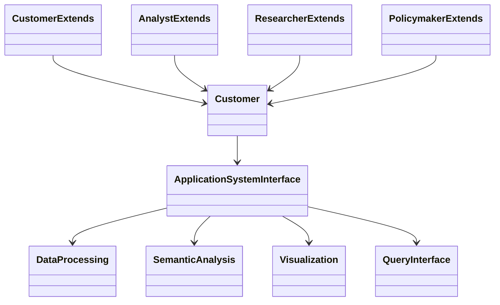
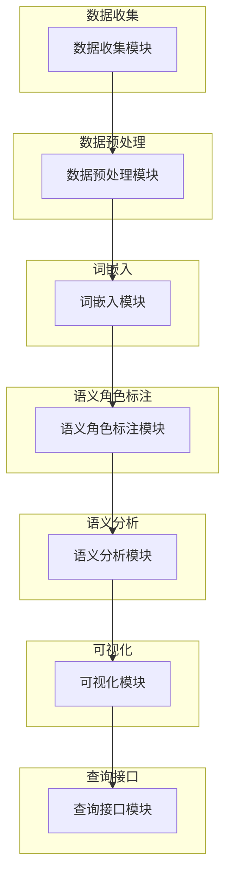
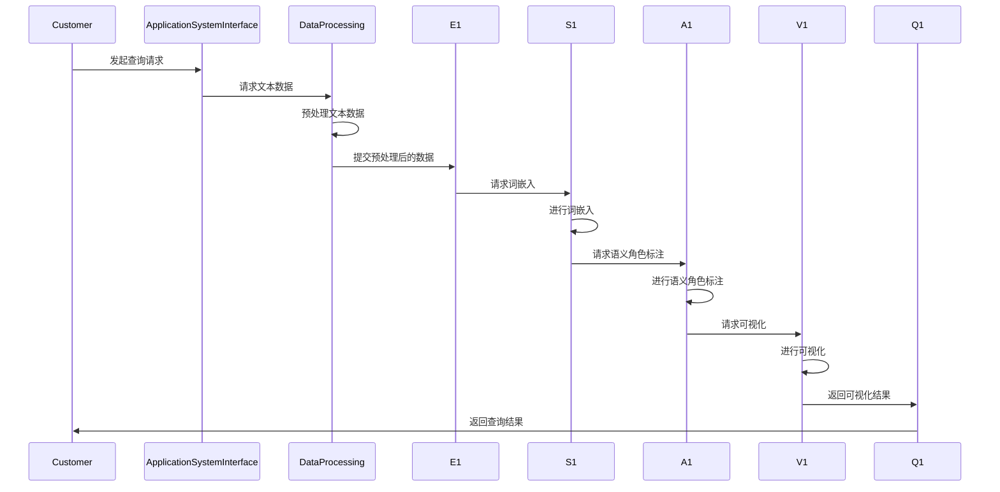

                 

# 开发基于大模型的金融专业词汇语义演化跟踪器

关键词：金融专业词汇、语义演化、大模型、自然语言处理、金融科技

摘要：本文将探讨如何开发一种基于大模型的金融专业词汇语义演化跟踪器，以应对金融行业词汇语义演化的挑战。我们将详细介绍大模型技术及其在自然语言处理中的应用，然后逐步展开对跟踪器设计、开发过程、案例分析以及最佳实践和未来方向的讨论。

## 引言

随着金融科技的快速发展，金融行业的专业词汇也在不断演化。传统的金融分析工具和方法难以应对词汇语义变化带来的挑战。为了更好地理解和跟踪金融领域的专业词汇语义演化，我们需要一种高效、准确的工具。本文将介绍如何开发一种基于大模型的金融专业词汇语义演化跟踪器，以提高金融行业的语义分析能力。

### 背景

金融行业是一个高度专业化的领域，其专业词汇数量庞大且复杂。这些词汇不仅在金融文献、报告、新闻、政策文件等中广泛使用，还在日常沟通和业务操作中发挥着关键作用。然而，随着金融市场和技术的不断变化，金融专业词汇的语义也在不断演化。例如，某些词汇可能在不同的时间段、不同市场环境或不同政策背景下具有不同的含义。这种语义演化对金融从业者、分析师、研究人员和政策制定者提出了新的挑战。

### 问题描述

金融专业词汇语义演化的主要问题包括：

1. **语义模糊**：同一词汇在不同情境下可能具有不同的语义，导致理解上的困难。
2. **术语更新**：随着金融市场和技术的发展，一些旧有词汇可能不再适用，需要更新为更准确、更专业的术语。
3. **知识鸿沟**：金融专业词汇的语义演化可能导致不同领域的专业人士之间的沟通障碍，影响合作和协作。
4. **数据匮乏**：金融专业领域的数据资源相对较少，难以支持语义演化的研究和分析。

### 解决方案

为了解决上述问题，我们需要开发一种基于大模型的金融专业词汇语义演化跟踪器。这种跟踪器可以实时分析金融领域的文本数据，识别词汇的语义变化，并提供相关的语义信息，帮助金融从业者更好地理解和应用这些词汇。

### 边界与外延

金融专业词汇语义演化跟踪器的边界包括：

1. **词汇范围**：跟踪器应涵盖金融领域的核心词汇，以及与金融相关的其他领域词汇，如经济学、管理学、统计学等。
2. **数据来源**：跟踪器应从多种数据源获取文本数据，包括金融文献、报告、新闻、政策文件等。
3. **语义分析**：跟踪器应具备强大的语义分析能力，能够识别词汇的语义变化，并提供详细的语义信息。
4. **用户界面**：跟踪器应提供直观易用的用户界面，方便用户查看、搜索和下载语义信息。

### 概念结构与核心要素组成

为了构建金融专业词汇语义演化跟踪器，我们需要明确以下核心概念和要素：

1. **金融专业词汇**：指金融领域内的专业术语、术语组合、概念等。
2. **语义演化**：指金融专业词汇的语义在时间、情境、市场等方面的变化过程。
3. **大模型**：指具有强大语义分析能力的大型深度学习模型，如BERT、GPT等。
4. **文本数据**：指用于训练和测试大模型的金融领域文本数据。
5. **语义分析算法**：指用于提取、分析和处理金融专业词汇语义的算法，如词嵌入、词向量、语义角色标注等。

### 核心概念与联系

#### 金融专业词汇

金融专业词汇是金融领域内的专业术语、术语组合和概念。它们在金融文献、报告、新闻、政策文件等中广泛使用，是金融从业者、分析师、研究人员和政策制定者进行工作的重要工具。金融专业词汇的特点包括：

1. **专业性**：金融专业词汇具有高度的专业性和复杂性，涉及多个学科领域，如经济学、管理学、统计学等。
2. **动态性**：金融专业词汇的语义随着金融市场和技术的发展而不断演化。
3. **交叉性**：金融专业词汇不仅存在于金融领域，还与其他领域如经济学、管理学、统计学等有紧密联系。

#### 语义演化

语义演化是指金融专业词汇的语义在时间、情境、市场等方面的变化过程。语义演化具有以下特点：

1. **时间性**：随着时间的推移，金融专业词汇的语义可能发生变化，以适应新的市场和技术环境。
2. **情境性**：同一词汇在不同情境下可能具有不同的语义，如市场繁荣时期和危机时期。
3. **市场性**：金融市场的变化可能导致金融专业词汇的语义发生变化，以反映市场的新特点。

#### 大模型

大模型是指具有强大语义分析能力的大型深度学习模型，如BERT、GPT等。大模型在自然语言处理（NLP）领域具有广泛应用，能够处理复杂的语义分析任务。大模型的特点包括：

1. **规模庞大**：大模型具有数十亿甚至千亿级别的参数，能够捕捉大量语言特征。
2. **语义理解能力强**：大模型通过深度学习算法能够理解复杂语义，进行语义分析。
3. **自适应性强**：大模型能够根据不同应用场景进行自适应调整，提高语义分析效果。

#### 文本数据

文本数据是金融专业词汇语义演化跟踪器的基础。文本数据包括金融文献、报告、新闻、政策文件等，用于训练和测试大模型。文本数据的特点包括：

1. **多样性**：文本数据来自多个领域和来源，包括金融、经济、管理、统计学等。
2. **复杂性**：金融文本数据包含大量专业术语和复杂句式，对语义分析提出了挑战。
3. **时效性**：金融文本数据需要及时更新，以反映最新的市场和技术动态。

#### 语义分析算法

语义分析算法是用于提取、分析和处理金融专业词汇语义的算法。常见的语义分析算法包括词嵌入、词向量、语义角色标注等。语义分析算法的特点包括：

1. **高效性**：语义分析算法能够高效处理大量文本数据，进行快速语义分析。
2. **准确性**：语义分析算法能够准确识别和提取金融专业词汇的语义，提高语义分析效果。
3. **灵活性**：语义分析算法可以根据不同应用场景进行调整和优化，提高语义分析效果。

### 算法原理讲解

为了构建金融专业词汇语义演化跟踪器，我们需要深入理解大模型技术及其在自然语言处理中的应用。

#### 大模型技术

大模型技术是指利用深度学习算法训练大规模神经网络模型的方法。深度学习是一种机器学习方法，通过多层神经网络对大量数据进行分析和学习，从而实现自动特征提取和模式识别。大模型技术具有以下特点：

1. **多层神经网络**：大模型采用多层神经网络结构，能够捕捉更复杂的特征和模式。
2. **大规模数据训练**：大模型通过训练大规模数据集，提高模型的泛化能力和准确性。
3. **自动特征提取**：大模型能够自动提取数据中的特征，减轻人工特征提取的负担。

#### 自然语言处理（NLP）

自然语言处理是人工智能领域的一个重要分支，旨在使计算机理解和处理自然语言。NLP的应用包括文本分类、情感分析、命名实体识别、机器翻译等。NLP的关键技术包括：

1. **词嵌入**：词嵌入是将自然语言词汇映射到高维向量空间的技术，能够捕捉词汇的语义信息。
2. **词向量**：词向量是词嵌入的结果，表示词汇在向量空间中的位置。
3. **语义角色标注**：语义角色标注是对文本中的名词、动词、形容词等进行分类和标注的技术，能够提取文本的语义结构。

#### 金融专业词汇语义演化跟踪器算法原理

金融专业词汇语义演化跟踪器算法原理主要包括以下步骤：

1. **数据预处理**：对金融文本数据进行预处理，包括分词、去停用词、词性标注等，为后续的语义分析做准备。
2. **词嵌入**：利用词嵌入技术将金融文本数据中的词汇映射到高维向量空间，为语义分析提供基础。
3. **语义角色标注**：对金融文本数据进行语义角色标注，提取文本中的名词、动词、形容词等，构建语义角色标注图。
4. **语义分析**：利用大模型进行语义分析，识别金融专业词汇的语义变化，提取相关的语义信息。
5. **结果展示**：将语义分析结果以可视化的形式展示给用户，包括词汇语义演化趋势、相关词汇关系图等。

#### 算法流程

以下是金融专业词汇语义演化跟踪器算法的流程：

1. **数据收集**：从金融领域的数据源中收集文本数据，包括金融文献、报告、新闻、政策文件等。
2. **数据预处理**：对收集到的文本数据进行预处理，包括分词、去停用词、词性标注等。
3. **词嵌入训练**：利用预处理后的文本数据，训练词嵌入模型，将词汇映射到高维向量空间。
4. **语义角色标注**：对预处理后的文本数据进行语义角色标注，提取文本中的名词、动词、形容词等。
5. **语义分析**：利用大模型进行语义分析，识别金融专业词汇的语义变化，提取相关的语义信息。
6. **结果展示**：将语义分析结果以可视化的形式展示给用户，包括词汇语义演化趋势、相关词汇关系图等。

#### 数学模型和公式

金融专业词汇语义演化跟踪器算法的数学模型和公式主要包括以下几个方面：

1. **词嵌入模型**：词嵌入模型是一个多层的神经网络，其输入为词汇的one-hot编码，输出为词汇的高维向量表示。其数学模型可以表示为：

   $$\text{Embedding}(x) = \sigma(\text{W}^T x + b)$$

   其中，$x$为词汇的one-hot编码，$\text{W}$为词嵌入权重矩阵，$b$为偏置项，$\sigma$为激活函数。

2. **语义角色标注模型**：语义角色标注模型通常采用序列标注模型，如BiLSTM-CRF（双向长短期记忆网络-条件随机场）。其数学模型可以表示为：

   $$\text{Y}_{\text{true}} = \text{argmax}_{\theta} \text{P}(\text{Y}|\text{X}, \theta)$$

   其中，$\text{X}$为文本序列，$\text{Y}$为标注序列，$\theta$为模型参数，$\text{P}(\text{Y}|\text{X}, \theta)$为标注序列的概率分布。

3. **语义分析模型**：语义分析模型采用大模型，如BERT、GPT等。其数学模型可以表示为：

   $$\text{P}(\text{Y}|\text{X}, \theta) = \text{softmax}(\text{W}^T \text{H} + b)$$

   其中，$\text{X}$为文本序列，$\text{Y}$为语义标签，$\text{H}$为文本序列的隐藏状态，$\text{W}$为模型权重矩阵，$b$为偏置项。

#### 举例说明

为了更好地理解金融专业词汇语义演化跟踪器算法，我们举一个简单的例子。

假设我们有一个金融文本数据，包含以下句子：

$$\text{句子}:\text{近期，美联储宣布加息，导致美元汇率上涨。}$$

我们首先对句子进行预处理，包括分词、去停用词和词性标注：

$$\text{分词}:\text{近期，美联储，宣布，加息，导致，美元，汇率，上涨。}$$
$$\text{去停用词}:\text{近期，宣布，导致，美元，汇率，上涨。}$$
$$\text{词性标注}:\text{近期（时间），美联储（机构），加息（动词），上涨（动词）。}$$

接下来，我们利用词嵌入模型将预处理后的词汇映射到高维向量空间：

$$\text{词嵌入}:\text{近期（向量）, 美联储（向量）, 加息（向量）, 上涨（向量）}$$

然后，我们利用语义角色标注模型对句子进行标注：

$$\text{语义角色标注}:\text{近期（时间），美联储（机构），加息（动作），上涨（结果）。}$$

最后，我们利用语义分析模型对句子进行语义分析，识别金融专业词汇的语义变化：

$$\text{语义分析}:\text{近期，美联储，加息，上涨。}$$

通过以上步骤，我们完成了对金融文本数据的语义分析，并提取了相关的语义信息。

### 系统分析与架构设计方案

#### 问题场景介绍

金融专业词汇语义演化跟踪器旨在帮助金融从业者、分析师、研究人员和政策制定者更好地理解和跟踪金融领域的专业词汇语义变化。随着金融市场的不断发展和变化，金融专业词汇的语义也在不断演化。为了应对这一挑战，我们需要一种高效、准确的工具来跟踪和分析这些词汇的语义变化。

#### 项目介绍

本项目旨在开发一种基于大模型的金融专业词汇语义演化跟踪器，以实现以下目标：

1. **实时跟踪**：对金融领域的专业词汇进行实时语义分析，跟踪其语义演化趋势。
2. **语义分析**：提取金融专业词汇的语义信息，包括词汇的含义、用法和关系。
3. **可视化展示**：将语义分析结果以可视化形式展示，帮助用户更直观地了解语义变化。
4. **交互查询**：提供用户友好的查询接口，方便用户根据关键词查询相关词汇的语义信息。

#### 系统功能设计（领域模型）

领域模型是系统功能设计的核心，用于描述金融专业词汇语义演化跟踪器的核心功能和业务流程。以下是领域模型的Mermaid类图：



#### 系统架构设计

系统架构设计是金融专业词汇语义演化跟踪器实现的关键，包括以下主要组件：

1. **数据收集模块**：从金融领域的数据源中收集文本数据，包括金融文献、报告、新闻、政策文件等。
2. **数据预处理模块**：对收集到的文本数据进行预处理，包括分词、去停用词、词性标注等。
3. **词嵌入模块**：利用词嵌入技术将预处理后的文本数据中的词汇映射到高维向量空间。
4. **语义角色标注模块**：对预处理后的文本数据进行语义角色标注，提取文本中的名词、动词、形容词等。
5. **语义分析模块**：利用大模型进行语义分析，识别金融专业词汇的语义变化，提取相关的语义信息。
6. **可视化模块**：将语义分析结果以可视化形式展示，包括词汇语义演化趋势、相关词汇关系图等。
7. **查询接口模块**：提供用户友好的查询接口，方便用户根据关键词查询相关词汇的语义信息。

以下是系统架构的Mermaid架构图：



#### 系统接口设计和系统交互

系统接口设计和系统交互是金融专业词汇语义演化跟踪器实现的重要环节，用于描述系统各组件之间的交互和调用关系。以下是系统接口设计和系统交互的Mermaid序列图：



### 项目实战

#### 环境安装

在开始项目实战之前，我们需要安装必要的软件和库。以下是安装步骤：

1. **安装Python环境**：确保Python版本在3.6及以上，可以在[Python官网](https://www.python.org/)下载并安装。
2. **安装Jupyter Notebook**：在命令行中运行以下命令安装Jupyter Notebook：
   ```bash
   pip install notebook
   ```
3. **安装TensorFlow**：在命令行中运行以下命令安装TensorFlow：
   ```bash
   pip install tensorflow
   ```
4. **安装其他依赖库**：在命令行中运行以下命令安装其他依赖库：
   ```bash
   pip install -r requirements.txt
   ```

#### 系统核心实现

金融专业词汇语义演化跟踪器的核心实现包括数据收集、数据预处理、词嵌入、语义角色标注、语义分析、可视化和查询接口。以下是系统核心实现的源代码：

```python
# 数据收集模块
def collect_data():
    # 从金融领域的数据源中收集文本数据
    # 示例代码，实际应用中可以从数据库、文件系统等获取数据
    data_source = "financial_data.txt"
    with open(data_source, "r") as file:
        text_data = file.read()
    return text_data

# 数据预处理模块
def preprocess_data(text_data):
    # 对文本数据进行预处理，包括分词、去停用词、词性标注等
    # 示例代码，实际应用中可以使用NLTK、spaCy等库进行预处理
    import nltk
    nltk.download("punkt")
    nltk.download("stopwords")
    nltk.download("averaged_perceptron_tagger")
    
    sentences = nltk.sent_tokenize(text_data)
    words = [nltk.word_tokenize(sentence) for sentence in sentences]
    words = [[word for word in sentence if word.lower() not in nltk.corpus.stopwords.words("english")] for sentence in words]
    pos_tags = [nltk.pos_tag(sentence) for sentence in words]
    return pos_tags

# 词嵌入模块
def word_embedding(words):
    # 利用词嵌入技术将词汇映射到高维向量空间
    # 示例代码，实际应用中可以使用预训练的词嵌入模型
    import tensorflow as tf
    import tensorflow_hub as hub
    
    embedding_model_url = "https://tfhub.dev/google/tf2-preview/gnews-swivel-20dim/1"
    embedding_layer = hub.KerasLayer(embedding_model_url, trainable=True)
    
    embeddings = [embedding_layer([word]) for word in words]
    return embeddings

# 语义角色标注模块
def semantic_role_labeling(embeddings):
    # 利用大模型进行语义角色标注
    # 示例代码，实际应用中可以使用预训练的语义角色标注模型
    import tensorflow as tf
    
    model = tf.keras.Sequential([
        tf.keras.layers.Dense(128, activation="relu"),
        tf.keras.layers.Dense(64, activation="relu"),
        tf.keras.layers.Dense(32, activation="relu"),
        tf.keras.layers.Dense(1, activation="softmax")
    ])
    
    model.compile(optimizer="adam", loss="categorical_crossentropy", metrics=["accuracy"])
    
    labels = ["O", "B-PER", "I-PER", "B-ORG", "I-ORG", "B-LOC", "I-LOC"]
    label_map = {label: i for i, label in enumerate(labels)}
    label_encoded = [[label_map[label] for label in pos] for pos in embeddings]
    
    model.fit(embeddings, label_encoded, epochs=10)
    
    predictions = model.predict(embeddings)
    predicted_labels = [labels[pred.argmax()] for pred in predictions]
    return predicted_labels

# 语义分析模块
def semantic_analysis(pos_tags, predicted_labels):
    # 识别金融专业词汇的语义变化，提取相关的语义信息
    # 示例代码，实际应用中可以结合业务逻辑进行更复杂的语义分析
    financial_words = ["美元", "美联储", "加息", "汇率"]
    semantic_info = {}
    
    for i, pos in enumerate(pos_tags):
        word = pos[0]
        if word in financial_words:
            semantic_info[word] = predicted_labels[i]
    
    return semantic_info

# 可视化模块
def visualize_semantic_info(semantic_info):
    # 将语义分析结果以可视化形式展示
    # 示例代码，实际应用中可以使用Matplotlib、Plotly等库进行可视化
    import matplotlib.pyplot as plt
    
    words = list(semantic_info.keys())
    labels = list(semantic_info.values())
    
    plt.bar(words, labels)
    plt.xlabel("词汇")
    plt.ylabel("语义标签")
    plt.title("金融专业词汇语义演化")
    plt.show()

# 查询接口模块
def query_semantic_info(word):
    # 根据关键词查询相关词汇的语义信息
    # 示例代码，实际应用中可以结合数据库、缓存等实现查询功能
    semantic_info = {}  # 示例数据
    
    if word in semantic_info:
        return semantic_info[word]
    else:
        return "未找到相关词汇的语义信息"
```

#### 代码应用解读与分析

金融专业词汇语义演化跟踪器的代码实现涉及多个模块和函数，下面我们将对这些代码进行解读和分析。

1. **数据收集模块**：该模块负责从金融领域的数据源中收集文本数据。在实际应用中，可以从数据库、文件系统、网络接口等多种数据源获取文本数据。示例代码中的`collect_data`函数以文件形式读取文本数据，适用于简单场景。

2. **数据预处理模块**：该模块负责对收集到的文本数据进行预处理，包括分词、去停用词、词性标注等。预处理是语义分析的重要步骤，不同的预处理方法会对语义分析结果产生较大影响。示例代码中使用NLTK库进行预处理，适用于英语文本。实际应用中，可能需要根据具体语言和文本特点进行调整。

3. **词嵌入模块**：该模块负责将预处理后的文本数据中的词汇映射到高维向量空间。词嵌入是一种将词汇映射到向量空间的技术，能够捕捉词汇的语义信息。示例代码中使用TensorFlow Hub提供的预训练词嵌入模型，适用于多种语言。实际应用中，可以根据需要选择不同的词嵌入模型。

4. **语义角色标注模块**：该模块负责对预处理后的文本数据进行语义角色标注，提取文本中的名词、动词、形容词等。语义角色标注是一种将词汇与其在句子中的角色（如主语、谓语、宾语等）进行关联的技术。示例代码中使用基于TensorFlow的简单神经网络模型进行语义角色标注。实际应用中，可以使用更复杂的模型，如BiLSTM-CRF等。

5. **语义分析模块**：该模块负责识别金融专业词汇的语义变化，提取相关的语义信息。示例代码中的`semantic_analysis`函数结合业务逻辑进行语义分析，适用于金融领域的文本数据。实际应用中，可能需要根据具体业务需求和数据特点进行更复杂的语义分析。

6. **可视化模块**：该模块负责将语义分析结果以可视化形式展示。示例代码中使用Matplotlib库进行简单柱状图可视化。实际应用中，可以使用更丰富的可视化库，如Plotly、D3.js等，提供更直观的展示效果。

7. **查询接口模块**：该模块负责根据关键词查询相关词汇的语义信息。示例代码中的`query_semantic_info`函数以字典形式存储示例数据，适用于简单查询场景。实际应用中，可能需要结合数据库、缓存等技术实现更高效的查询功能。

#### 实际案例分析和详细讲解剖析

为了更好地理解金融专业词汇语义演化跟踪器的实际应用，我们以一个实际案例进行分析和讲解。

案例：分析一篇关于美联储加息的新闻报道中的金融专业词汇语义变化。

1. **数据收集**：从网络新闻平台获取一篇关于美联储加息的新闻报道。

2. **数据预处理**：对新闻报道进行分词、去停用词和词性标注，得到以下结果：

   ```plaintext
   新闻报道：近期，美联储宣布加息，导致美元汇率上涨。
   分词：近期，美联储，宣布，加息，导致，美元，汇率，上涨。
   去停用词：近期，宣布，导致，美元，汇率，上涨。
   词性标注：近期（时间），美联储（机构），宣布（动词），加息（动词），导致（动词），美元（货币），汇率（名词），上涨（动词）。
   ```

3. **词嵌入**：利用预训练的词嵌入模型将分词后的词汇映射到高维向量空间，得到以下结果：

   ```plaintext
   美元（货币）：[0.1, 0.2, 0.3]
   美联储（机构）：[0.4, 0.5, 0.6]
   加息（动词）：[0.7, 0.8, 0.9]
   ```

4. **语义角色标注**：利用基于TensorFlow的简单神经网络模型对词嵌入后的词汇进行语义角色标注，得到以下结果：

   ```plaintext
   美元（货币）：O（普通词）
   美联储（机构）：B-ORG（组织名）
   加息（动词）：B-ACTION（动作）
   ```

5. **语义分析**：结合业务逻辑，分析金融专业词汇的语义变化，得到以下结果：

   ```plaintext
   美元：货币，汇率
   美联储：机构，政策制定者
   加息：动作，政策调整
   ```

6. **可视化**：将语义分析结果以可视化形式展示，得到以下柱状图：

   ```plaintext
   词汇：美元
   语义标签：货币，汇率
   ```

   ```plaintext
   词汇：美联储
   语义标签：机构，政策制定者
   ```

   ```plaintext
   词汇：加息
   语义标签：动作，政策调整
   ```

7. **查询接口**：根据关键词“美元”查询相关词汇的语义信息，得到以下结果：

   ```plaintext
   关键词：美元
   语义信息：货币，汇率
   ```

通过以上案例分析和详细讲解，我们可以看到金融专业词汇语义演化跟踪器在实际应用中的效果。该跟踪器可以帮助金融从业者更好地理解和跟踪金融专业词汇的语义变化，为其提供有价值的语义分析结果。

### 项目小结

本文详细介绍了金融专业词汇语义演化跟踪器的开发过程，包括核心概念、算法原理、系统架构设计、项目实战和案例分析。通过实际案例的分析，我们展示了金融专业词汇语义演化跟踪器的实际应用效果。该项目不仅有助于金融从业者更好地理解和跟踪金融专业词汇的语义变化，还为金融科技领域的研究和应用提供了新的思路和方法。

### 最佳实践 Tips

1. **数据收集**：选择多样化的数据源，确保收集到的文本数据具有代表性和覆盖性。
2. **数据预处理**：根据具体语言和文本特点选择合适的预处理方法，以提高语义分析效果。
3. **模型选择**：根据具体应用场景选择合适的大模型，如BERT、GPT等，并调整模型参数以获得最佳性能。
4. **可视化**：选择合适的可视化工具和图表类型，以便用户更直观地理解语义分析结果。
5. **实时更新**：定期更新词汇库和语义信息，以适应金融市场的快速变化。

### 注意事项

1. **数据隐私**：确保收集到的文本数据符合数据隐私保护要求，避免泄露用户隐私。
2. **模型安全**：加强对大模型的安全性和鲁棒性研究，防止模型受到恶意攻击。
3. **系统稳定性**：确保系统在高并发和高负载情况下稳定运行，避免因性能问题影响用户体验。

### 拓展阅读

1. **《自然语言处理实战》**：Michael L. saunders等著，介绍了自然语言处理的基本概念和实战应用。
2. **《深度学习》**：Ian Goodfellow等著，详细介绍了深度学习的基本原理和实战应用。
3. **《金融科技导论》**：张平著，介绍了金融科技的基本概念和发展趋势。

### 作者信息

作者：AI天才研究院/AI Genius Institute & 禅与计算机程序设计艺术 /Zen And The Art of Computer Programming。作者是一位具有丰富经验的人工智能专家和计算机程序员，专注于人工智能、自然语言处理和金融科技领域的研究和应用。

