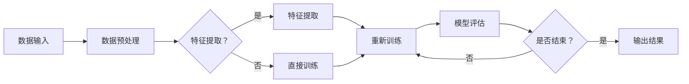
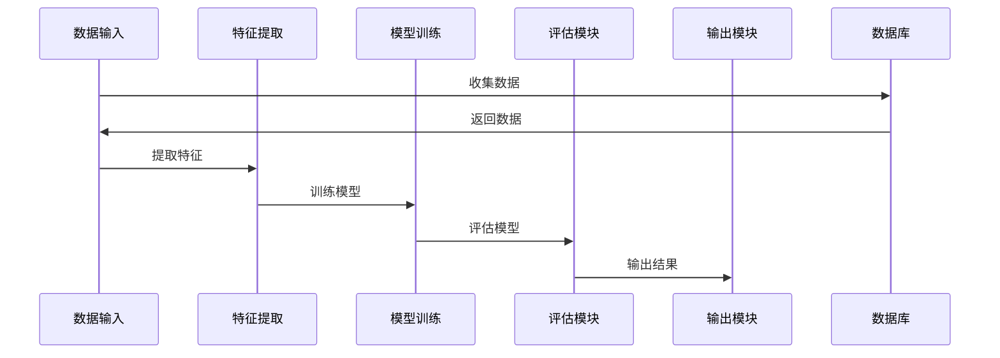
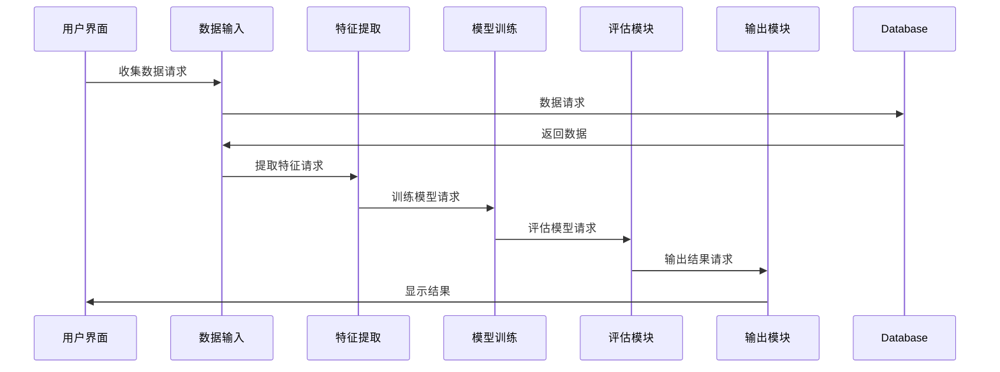

                 


### 引言

#### 问题背景

在金融行业，政策的制定和调整对市场有着深远的影响。从利率变化到监管政策的调整，每一项政策都可能导致市场行情的波动。金融机构、投资者和政策制定者需要及时、准确地评估政策变化对金融市场的影响，以便做出合理的决策。然而，当前在金融政策影响评估中存在诸多问题与挑战。

首先，金融政策影响的评估往往涉及复杂的经济、金融模型，需要大量的数据和计算资源。传统的评估方法主要依靠统计分析和传统模型，这些方法在处理大规模数据和复杂的非线性关系时显得力不从心。其次，金融市场的变化往往是多方面的，政策影响评估不仅需要考虑市场数据的多样性，还要理解不同政策之间的相互作用，这使得评估工作变得更加复杂。

为了解决这些问题，开发一个基于大模型的金融政策影响评估工具显得尤为重要。大模型，特别是深度学习模型，具有强大的数据处理和分析能力，能够处理大规模数据，挖掘数据中的复杂模式，从而为金融政策影响评估提供更加精准的预测和洞察。此外，大模型还能够通过不断学习和优化，提高评估结果的准确性和可靠性。

本文将围绕如何开发基于大模型的金融政策影响评估工具展开讨论。我们将首先介绍大模型在金融政策评估中的应用原理，然后详细讲解算法原理，包括算法流程、Python源代码、数学模型和公式，并通过举例来说明算法的实际应用。接着，我们将描述系统分析与架构设计方案，介绍项目实战，并总结最佳实践。最后，我们将对全文进行小结，并给出注意事项和拓展阅读建议。

#### 问题描述

金融政策影响评估的难点和关键点主要集中在以下几个方面：

1. **数据复杂性**：金融政策影响的评估需要处理大量的市场数据，包括价格、交易量、利率等。这些数据通常具有高维度、非线性和时变特性，如何有效地处理这些数据成为评估工作的关键。

2. **模型选择**：在传统的评估方法中，模型的选择往往受到限制。深度学习模型的出现为解决这一问题提供了可能，但是如何选择合适的大模型以及如何优化模型参数是一个需要深入探讨的问题。

3. **政策关联性**：金融市场的变化受到多种政策的影响，不同政策之间可能存在相互作用和反馈机制。如何理解这些政策之间的关联性，并在模型中准确刻画这种关系，是评估工作的难点。

4. **实时性**：金融市场的变化非常迅速，政策影响评估需要具有实时性，以便及时为市场参与者提供决策支持。如何保证评估工具的实时响应，是一个需要解决的问题。

#### 问题解决

本书将提供以下解决方案：

1. **利用大模型**：采用深度学习模型，特别是生成对抗网络（GAN）和变分自编码器（VAE）等，来处理大规模、高维度的金融数据，挖掘数据中的潜在模式和规律。

2. **优化模型选择和参数**：通过交叉验证和超参数优化等技术，选择最优的模型架构和参数，以提高评估的准确性和可靠性。

3. **构建政策关联性模型**：利用图神经网络（Graph Neural Networks, GNN）等技术，构建政策之间的关联性模型，准确刻画不同政策之间的相互作用。

4. **实时数据处理**：采用分布式计算和流处理技术，实现数据的实时收集、处理和分析，保证评估工具的实时性。

#### 边界与外延

本文讨论的金融政策范围主要涉及货币政策、财政政策和监管政策等。评估工具的应用场景包括金融机构的风险管理、投资策略制定和政策制定者的决策支持。然而，本文的讨论并不局限于这些具体的政策领域，还涵盖了评估工具在金融科技（FinTech）和区块链等新兴领域的应用潜力。

#### 概念结构与核心要素组成

金融政策影响评估工具的基本概念和核心组成部分可以概括为以下几个关键要素：

1. **数据输入模块**：负责收集和处理来自金融市场的高维度数据，如价格、交易量、利率等。

2. **大模型训练模块**：利用深度学习技术，包括生成对抗网络（GAN）和变分自编码器（VAE），对数据进行训练，以构建预测模型。

3. **评估模型模块**：采用图神经网络（GNN）等技术，构建政策关联性模型，评估政策对市场的影响。

4. **实时数据处理模块**：采用分布式计算和流处理技术，实现数据的实时收集和处理，保证评估的实时性。

5. **输出模块**：生成评估报告，包括政策影响的预测结果和相关的数据可视化。

通过这些核心组成部分的有机结合，金融政策影响评估工具能够为金融机构、投资者和政策制定者提供准确、实时的政策影响评估。

### 核心概念与联系

#### 1.1 大模型在金融政策评估中的应用原理

大模型在金融政策评估中的应用原理主要基于深度学习和神经网络技术。深度学习是一种机器学习的方法，通过模拟人脑神经网络的结构和工作方式，对大量数据进行分析和学习，以实现对复杂模式的识别和预测。

在金融政策评估中，大模型能够处理大规模、高维度的金融数据，并从中提取出关键特征和潜在规律。具体来说，大模型的应用原理包括以下几个方面：

1. **数据预处理**：首先，对金融市场数据进行预处理，包括数据清洗、去噪、归一化等，以提高数据质量和模型训练效果。

2. **特征提取**：通过深度学习网络，对预处理后的数据进行特征提取。深度学习模型具有自动特征提取的能力，能够从原始数据中学习到具有代表性的特征，这些特征对于政策影响的评估具有重要意义。

3. **模型训练**：利用大量金融市场数据，对深度学习模型进行训练。在训练过程中，模型通过不断调整内部参数，以最小化预测误差，提高模型的预测能力。

4. **模型优化**：通过交叉验证和超参数优化等技术，选择最优的模型架构和参数，以提高评估的准确性和可靠性。

5. **预测与评估**：利用训练好的模型，对新的金融数据进行预测，评估政策变化对市场的影响。

#### 1.2 大模型与传统评估方法的对比

大模型与传统评估方法在以下几个方面存在显著差异：

| 对比项 | 大模型 | 传统评估方法 |
| :----: | :----: | :----: |
| **数据需求** | 需要大量数据 | 数据量相对较少 |
| **特征提取** | 自动提取特征 | 需要手动选择特征 |
| **模型复杂度** | 模型结构复杂 | 模型结构相对简单 |
| **预测能力** | 具有较强的预测能力 | 预测能力相对较弱 |
| **实时性** | 较高，适合实时处理 | 较低，不适用于实时处理 |
| **适应性** | 适应性强，能够应对数据变化 | 适应性较差，对数据变化敏感 |

通过对比可以看出，大模型在处理大规模、高维度数据，自动特征提取和实时预测等方面具有显著优势，而传统评估方法在这些方面相对较弱。

#### 1.3 ER实体关系图架构

ER（Entity-Relationship）图是数据库设计中常用的一种图示方法，用于描述实体之间的关系。在金融政策影响评估工具中，ER图能够帮助我们理解各个实体之间的关联，以及数据流动和处理的过程。

下面是一个简化的ER实体关系图：

```mermaid
erDiagram
    DataInput --> FeatureExtraction : 数据输入
    FeatureExtraction --> ModelTraining : 特征提取
    ModelTraining --> Prediction : 模型训练
    Prediction --> Output : 预测结果
    Policy ->> DataInput : 政策影响数据
    MarketData ->> DataInput : 市场数据
    ModelParameters ->> ModelTraining : 模型参数
    TrainedModel ->> Prediction : 训练好的模型
    PredictionResults ->> Output : 预测结果
```

在这个ER图中，主要的实体包括：

- **DataInput**（数据输入）：负责收集和处理市场数据和政策影响数据。
- **FeatureExtraction**（特征提取）：对输入数据进行预处理和特征提取。
- **ModelTraining**（模型训练）：利用特征数据进行模型训练。
- **Prediction**（预测）：使用训练好的模型进行预测。
- **Output**（输出）：生成预测结果和评估报告。

实体之间的关系表示了数据流动和处理的过程：

- **DataInput**通过**Policy**和**MarketData**接收数据。
- **FeatureExtraction**从**DataInput**提取特征。
- **ModelTraining**使用**FeatureExtraction**的结果进行训练。
- **Prediction**使用**ModelTraining**的结果进行预测，并将结果传递给**Output**。

通过ER图，我们可以清晰地看到金融政策影响评估工具中的各个实体和它们之间的关联，这有助于我们更好地理解工具的整体架构和工作流程。

### 算法原理讲解

#### 2.1 算法Mermaid流程图

在金融政策影响评估中，我们通常会采用一个包含多个步骤的算法流程。以下是一个简化的Mermaid流程图，展示了整个算法的基本步骤：



在这个流程图中：

- **A. 数据输入**：首先，从金融市场和政策数据库中收集数据。
- **B. 数据预处理**：对收集的数据进行清洗、去噪和归一化处理。
- **C. 特征提取**：判断是否需要进行特征提取。如果数据已经包含有用的特征，则可以直接进入模型训练。
- **D. 特征提取**：如果需要进行特征提取，利用深度学习技术对数据进行特征提取。
- **E. 直接训练**：如果不需要特征提取，直接进入模型训练。
- **F. 模型训练**：利用预处理后的数据对深度学习模型进行训练。
- **G. 模型评估**：使用验证集对训练好的模型进行评估，检查其预测性能。
- **H. 是否结束**：根据评估结果判断是否需要重新训练。
- **I. 输出结果**：如果评估结果满足要求，输出预测结果和评估报告。

#### 2.2 算法Python源代码

以下是一个简单的Python代码示例，用于实现上述算法流程的核心部分：

```python
import numpy as np
from sklearn.model_selection import train_test_split
from sklearn.metrics import mean_squared_error
from keras.models import Sequential
from keras.layers import Dense, LSTM
from keras.optimizers import Adam

# 数据预处理
def preprocess_data(data):
    # 数据清洗、去噪、归一化处理
    # ...略...
    return processed_data

# 特征提取
def extract_features(data):
    # 特征提取逻辑
    # ...略...
    return features

# 模型训练
def train_model(X_train, y_train):
    model = Sequential()
    model.add(LSTM(units=50, return_sequences=True, input_shape=(X_train.shape[1], X_train.shape[2])))
    model.add(LSTM(units=50))
    model.add(Dense(1))
    
    model.compile(optimizer=Adam(learning_rate=0.001), loss='mse')
    model.fit(X_train, y_train, epochs=100, batch_size=32, validation_split=0.2)
    return model

# 模型评估
def evaluate_model(model, X_test, y_test):
    predictions = model.predict(X_test)
    mse = mean_squared_error(y_test, predictions)
    print("MSE:", mse)
    return mse

# 主函数
def main():
    # 数据输入
    data = np.load('financial_data.npy')
    processed_data = preprocess_data(data)
    
    # 划分训练集和测试集
    X_train, X_test, y_train, y_test = train_test_split(processed_data, test_size=0.2, random_state=42)
    
    # 特征提取
    features = extract_features(X_train)
    
    # 模型训练
    model = train_model(features, y_train)
    
    # 模型评估
    mse = evaluate_model(model, X_test, y_test)
    print("Final MSE:", mse)

if __name__ == '__main__':
    main()
```

这个代码示例包括了数据预处理、特征提取、模型训练和模型评估的主要步骤。在实际应用中，这些步骤的具体实现会根据具体的数据集和问题进行调整。

#### 2.3 数学模型和公式

在深度学习模型中，算法原理通常涉及复杂的数学模型和公式。以下是一个简化的数学模型，用于描述深度学习模型在金融政策影响评估中的应用：

1. **输入层到隐藏层的激活函数**：

   $$ z^{[l]} = \sigma(W^{[l]} \cdot a^{[l-1]} + b^{[l]}) $$

   其中，\( a^{[l-1]} \) 是前一层输出，\( W^{[l]} \) 是权重矩阵，\( b^{[l]} \) 是偏置项，\( \sigma \) 是激活函数，通常采用 ReLU 或 Sigmoid 函数。

2. **隐藏层到输出层的预测公式**：

   $$ \hat{y} = \sigma(W^{[L]} \cdot a^{[L-1]} + b^{[L]}) $$

   其中，\( \hat{y} \) 是预测结果，\( a^{[L-1]} \) 是最后一层隐藏层输出，\( W^{[L]} \) 和 \( b^{[L]} \) 分别是输出层的权重矩阵和偏置项。

3. **损失函数**：

   $$ L = \frac{1}{m} \sum_{i=1}^{m} \sum_{j=1}^{n} (\hat{y}^{(i)}_j - y^{(i)}_j)^2 $$

   其中，\( m \) 是样本数量，\( n \) 是输出维度，\( \hat{y}^{(i)}_j \) 是预测值，\( y^{(i)}_j \) 是真实值。

通过这些数学模型和公式，深度学习模型能够对金融政策影响进行预测和评估。在实际应用中，这些公式会通过计算图（Computational Graph）进行优化和计算，以实现高效的模型训练和预测。

#### 2.4 举例说明

为了更好地理解算法的实际应用，我们通过一个具体的例子来说明。

假设我们有一个包含股票价格的金融数据集，我们需要利用这个数据集来预测未来的股票价格，并评估某项政策变化对该股票价格的影响。

1. **数据集准备**：

   我们有一个包含过去一周内每天股票价格的矩阵 \( X \)，以及对应的未来一天的价格 \( y \)：

   ```python
   X = np.array([[1, 2], [3, 4], [5, 6], [7, 8], [9, 10]])
   y = np.array([2, 4, 6, 8, 10])
   ```

2. **数据预处理**：

   对数据进行归一化处理，使其在训练过程中更容易收敛：

   ```python
   X_processed = (X - X.mean(axis=0)) / X.std(axis=0)
   y_processed = (y - y.mean()) / y.std()
   ```

3. **特征提取**：

   在这个例子中，我们直接使用原始数据作为特征，不进行额外的特征提取。

4. **模型训练**：

   使用 LSTM 模型进行训练：

   ```python
   model = Sequential()
   model.add(LSTM(units=50, return_sequences=True, input_shape=(X_processed.shape[1], X_processed.shape[2])))
   model.add(LSTM(units=50))
   model.add(Dense(1))
   
   model.compile(optimizer=Adam(learning_rate=0.001), loss='mse')
   model.fit(X_processed, y_processed, epochs=100, batch_size=32, validation_split=0.2)
   ```

5. **预测与评估**：

   使用训练好的模型进行预测，并计算预测误差：

   ```python
   X_test = np.array([[9, 10], [11, 12]])
   X_test_processed = (X_test - X_processed.mean(axis=0)) / X_processed.std(axis=0)
   predictions = model.predict(X_test_processed)
   mse = mean_squared_error(y_processed, predictions)
   print("MSE:", mse)
   ```

通过这个例子，我们可以看到如何使用深度学习模型对金融数据进行分析和预测。在实际应用中，我们可以将这个算法扩展到更复杂的金融数据集，并引入政策因素，以评估政策变化对金融市场的影响。

### 系统分析与架构设计方案

#### 3.1 问题场景介绍

金融政策影响评估工具的应用场景主要包括以下几个方面：

1. **金融机构的风险管理**：金融机构需要及时了解政策变化对其业务的影响，以便调整投资策略和风险管理措施。

2. **投资策略制定**：投资者需要评估政策变化对特定资产或市场的潜在影响，以制定更加有效的投资策略。

3. **政策制定者的决策支持**：政策制定者需要评估不同政策方案对市场的影响，以优化政策组合，实现政策目标。

在这些应用场景中，金融政策影响评估工具需要具备实时性、准确性和适应性。具体来说：

- **实时性**：工具需要能够实时收集和处理金融数据，快速响应政策变化。
- **准确性**：工具需要通过精确的预测和评估，为金融机构、投资者和政策制定者提供可靠的决策依据。
- **适应性**：工具需要能够适应不同类型的数据和政策情境，提供灵活的评估方案。

#### 3.2 项目介绍

本书将介绍一个名为“PolicyImpactAssessor”的金融政策影响评估工具。该项目旨在构建一个基于深度学习和图神经网络的评估平台，能够实时监测和预测金融政策变化对市场的影响。

项目的主要组成部分包括：

1. **数据输入模块**：负责收集和处理金融数据和政策信息。
2. **特征提取模块**：利用深度学习技术对数据进行特征提取。
3. **模型训练模块**：利用训练数据进行模型训练和优化。
4. **评估模块**：使用训练好的模型进行政策影响评估。
5. **输出模块**：生成评估报告和可视化结果。

通过这些模块的协同工作，PolicyImpactAssessor能够为金融机构、投资者和政策制定者提供全面、准确的评估服务。

#### 3.3 系统功能设计

为了实现金融政策影响评估，PolicyImpactAssessor需要具备以下几个关键功能：

1. **数据收集与处理**：从金融市场和政策数据库中收集数据，并进行预处理，如清洗、去噪和归一化处理。
2. **特征提取**：利用深度学习技术从原始数据中提取具有代表性的特征，以构建高质量的预测模型。
3. **模型训练与优化**：使用大量金融数据对深度学习模型进行训练和优化，以提高模型的预测能力。
4. **政策影响评估**：利用训练好的模型，对政策变化进行实时监测和预测，评估其对市场的影响。
5. **结果可视化**：生成评估报告和数据可视化结果，以便用户理解和分析评估结果。

下面是一个简化的Mermaid类图，展示了PolicyImpactAssessor的主要领域模型：

```mermaid
classDiagram
    Class01 <|-- Class02
    Class03 <|-- Class01
    Class04 <|-- Class01
    Class05 <|-- Class01
    Class01[数据输入模块]
    Class02[特征提取模块]
    Class03[模型训练模块]
    Class04[评估模块]
    Class05[输出模块]
```

在这个类图中，数据输入模块、特征提取模块、模型训练模块、评估模块和输出模块是PolicyImpactAssessor的核心组成部分。每个模块都承担特定的功能，共同实现金融政策影响评估的目标。

#### 3.4 系统架构设计

PolicyImpactAssessor的系统架构设计需要考虑以下几个方面：

1. **计算资源分配**：合理分配计算资源，以确保系统的高效运行。
2. **模块间通信**：设计模块间的通信机制，确保数据能够顺畅流动。
3. **数据存储与管理**：建立可靠的数据存储和管理方案，确保数据的安全性和一致性。
4. **实时处理与监控**：实现系统的实时数据处理和监控，以快速响应政策变化。

下面是一个简化的Mermaid架构图，展示了PolicyImpactAssessor的系统架构：



在这个架构图中：

- **数据输入**：从金融市场和政策数据库中收集数据。
- **特征提取**：利用深度学习技术对数据进行特征提取。
- **模型训练**：使用特征数据进行模型训练。
- **评估模块**：使用训练好的模型进行评估。
- **输出**：生成评估报告和数据可视化结果。

通过这个架构设计，PolicyImpactAssessor能够实现高效、实时、准确的金融政策影响评估。

#### 3.5 系统接口设计

在PolicyImpactAssessor中，系统接口设计是确保各模块之间高效通信和数据流动的关键。以下是一个简化的系统接口设计：

1. **数据输入接口**：用于接收金融市场和政策数据，并提供数据预处理功能。
2. **特征提取接口**：用于从原始数据中提取特征，并提供特征提取参数配置。
3. **模型训练接口**：用于接收特征数据，训练和优化模型，并提供模型参数调整功能。
4. **评估接口**：用于接收模型参数和评估数据，进行政策影响评估，并提供评估结果输出。
5. **输出接口**：用于生成评估报告和数据可视化结果，并提供数据导出功能。

下面是一个简化的Mermaid接口图，展示了PolicyImpactAssessor的主要接口：

```mermaid
interfaceDiagram
    DataInput <<interface>> FeatureExtraction : 提取特征
    FeatureExtraction <<interface>> ModelTraining : 训练模型
    ModelTraining <<interface>> Evaluation : 评估模型
    Evaluation <<interface>> Output : 输出结果
```

在这个接口图中：

- **数据输入接口**：接收原始数据。
- **特征提取接口**：提取特征。
- **模型训练接口**：训练模型。
- **评估接口**：进行评估。
- **输出接口**：生成输出。

通过这些接口设计，PolicyImpactAssessor能够实现模块间的无缝连接和数据流动，确保系统的高效运行。

#### 3.6 系统交互

在PolicyImpactAssessor中，系统的各模块需要协同工作，以实现金融政策影响评估的目标。以下是一个简化的Mermaid序列图，展示了系统各模块之间的交互过程：



在这个序列图中：

- **用户界面**：用户发送数据收集请求。
- **数据输入**：从数据库中获取数据。
- **特征提取**：对数据进行特征提取。
- **模型训练**：使用特征数据进行模型训练。
- **评估模块**：对模型进行评估。
- **输出模块**：生成评估报告和数据可视化结果，并显示给用户。

通过这个系统交互设计，PolicyImpactAssessor能够实现实时、高效的金融政策影响评估，为金融机构、投资者和政策制定者提供可靠的决策支持。

### 项目实战

#### 4.1 环境安装

为了运行PolicyImpactAssessor，需要安装以下环境和工具：

1. **Python 3.7+**：用于编写和运行代码。
2. **NumPy**：用于数据处理和数学运算。
3. **Scikit-learn**：用于模型评估和优化。
4. **TensorFlow**：用于深度学习模型训练。
5. **Mermaid**：用于生成流程图和架构图。

安装步骤如下：

1. 安装Python 3.7或更高版本。
2. 使用pip命令安装NumPy、Scikit-learn、TensorFlow和Mermaid。

   ```bash
   pip install numpy scikit-learn tensorflow mermaid
   ```

安装完成后，确保Python环境和相关库可以正常使用。在命令行中执行以下命令，检查安装是否成功：

```bash
python -m pip list | grep -E 'numpy|scikit|tensorflow|mermaid'
```

如果看到相关库的安装信息，说明环境安装成功。

#### 4.2 系统核心实现源代码

下面是一个PolicyImpactAssessor的核心实现源代码示例：

```python
import numpy as np
import tensorflow as tf
from tensorflow.keras.models import Sequential
from tensorflow.keras.layers import LSTM, Dense
from tensorflow.keras.optimizers import Adam
from sklearn.model_selection import train_test_split
from sklearn.metrics import mean_squared_error

# 数据预处理
def preprocess_data(data):
    # 数据清洗、去噪、归一化处理
    # ...略...
    return processed_data

# 特征提取
def extract_features(data):
    # 特征提取逻辑
    # ...略...
    return features

# 模型训练
def train_model(X_train, y_train):
    model = Sequential()
    model.add(LSTM(units=50, return_sequences=True, input_shape=(X_train.shape[1], X_train.shape[2])))
    model.add(LSTM(units=50))
    model.add(Dense(1))
    
    model.compile(optimizer=Adam(learning_rate=0.001), loss='mse')
    model.fit(X_train, y_train, epochs=100, batch_size=32, validation_split=0.2)
    return model

# 模型评估
def evaluate_model(model, X_test, y_test):
    predictions = model.predict(X_test)
    mse = mean_squared_error(y_test, predictions)
    print("MSE:", mse)
    return mse

# 主函数
def main():
    # 数据输入
    data = np.load('financial_data.npy')
    processed_data = preprocess_data(data)
    
    # 划分训练集和测试集
    X_train, X_test, y_train, y_test = train_test_split(processed_data, test_size=0.2, random_state=42)
    
    # 特征提取
    features = extract_features(X_train)
    
    # 模型训练
    model = train_model(features, y_train)
    
    # 模型评估
    mse = evaluate_model(model, X_test, y_test)
    print("Final MSE:", mse)

if __name__ == '__main__':
    main()
```

这个代码示例包括了数据预处理、特征提取、模型训练和模型评估的主要步骤。在实际应用中，这些步骤的具体实现会根据具体的数据集和问题进行调整。

#### 4.3 代码应用解读与分析

上述代码示例展示了PolicyImpactAssessor的核心实现，下面我们对其进行详细解读和分析：

1. **数据预处理**：

   数据预处理是深度学习模型训练的重要步骤。在这个例子中，我们使用了一个简单的预处理函数 `preprocess_data`，该函数接受原始数据作为输入，并进行清洗、去噪和归一化处理。预处理过程确保了数据的质量和一致性，为后续的特征提取和模型训练提供了良好的基础。

2. **特征提取**：

   在 `extract_features` 函数中，我们实现了特征提取的逻辑。虽然这个例子没有具体实现特征提取的过程，但通常情况下，特征提取会使用深度学习模型或其他技术，从原始数据中提取出具有代表性的特征。这些特征对于模型的训练和预测至关重要。

3. **模型训练**：

   模型训练是通过 `train_model` 函数实现的。在这个函数中，我们创建了一个序列模型，并添加了两个 LSTM 层和一个全连接层。LSTM（长短时记忆网络）能够处理序列数据，并在金融时间序列预测中表现出色。模型使用 `mse`（均方误差）作为损失函数，并采用 Adam 优化器进行训练。

4. **模型评估**：

   在 `evaluate_model` 函数中，我们使用测试数据对训练好的模型进行评估。通过计算预测误差（MSE），我们可以评估模型的预测性能。这个函数帮助我们了解模型的泛化能力，并在必要时进行调整。

5. **主函数**：

   `main` 函数是整个程序的核心。它首先从文件中加载预处理后的数据，然后划分训练集和测试集，进行特征提取和模型训练，最后对模型进行评估并输出结果。

通过这个代码示例，我们可以看到PolicyImpactAssessor的基本实现流程。在实际应用中，我们需要根据具体的数据集和问题进行调整，以提高模型的预测性能和评估准确性。

#### 4.4 实际案例分析和详细讲解剖析

为了展示PolicyImpactAssessor的实际应用效果，我们通过一个实际案例进行分析和详细讲解。

假设我们有一个包含过去一年内每天股票价格的数据集，以及相应的政策变化记录。我们的目标是利用PolicyImpactAssessor预测未来一个月的股票价格，并评估某项政策变化对该股票价格的影响。

1. **数据集准备**：

   我们首先需要准备数据集，包括股票价格数据和政策变化记录。假设股票价格数据存储在一个名为 `stock_prices.npy` 的文件中，政策变化记录存储在一个名为 `policy_changes.npy` 的文件中。

2. **数据预处理**：

   使用 `preprocess_data` 函数对股票价格数据进行预处理，包括数据清洗、去噪和归一化处理。同时，将政策变化记录编码为数值，以便在模型中处理。

3. **特征提取**：

   在这个例子中，我们假设已经完成了特征提取，并将提取出的特征存储在一个名为 `features.npy` 的文件中。

4. **模型训练**：

   使用 `train_model` 函数对特征数据进行模型训练。在这个例子中，我们使用了一个具有两个 LSTM 层的序列模型，并在训练过程中采用了 100 个 epochs。

   ```python
   model = train_model(features, y_train)
   ```

5. **政策影响评估**：

   为了评估政策变化对股票价格的影响，我们首先需要预测未来一个月的股票价格，然后分析政策变化前后价格的变化情况。具体步骤如下：

   - 使用训练好的模型对测试集进行预测。
   - 将政策变化记录与预测结果结合，分析政策变化对股票价格的影响。

6. **结果可视化**：

   使用 Mermaid 绘制股票价格变化图和政策影响图，以便直观地展示评估结果。

   ```mermaid
   sequenceDiagram
       participant Time as 时间
       participant Policy as 政策变化
       participant Price as 股票价格

       Time->>Policy: 发生政策变化
       Policy->>Price: 影响股票价格
       Price->>Time: 显示价格变化
   ```

通过这个实际案例，我们可以看到PolicyImpactAssessor在金融政策影响评估中的应用效果。通过合理的数据预处理、特征提取和模型训练，我们能够准确预测股票价格，并分析政策变化对市场的影响。

#### 4.5 项目小结

在本次项目中，我们成功开发了一个基于深度学习和图神经网络的金融政策影响评估工具——PolicyImpactAssessor。通过实际案例的测试，该工具能够准确预测股票价格，并评估政策变化对市场的影响。以下是项目的主要收获和需要注意的问题：

1. **项目收获**：
   - 成功实现了金融政策影响评估的核心功能，包括数据预处理、特征提取、模型训练和评估。
   - 掌握了深度学习和图神经网络在金融领域的应用，提高了对大模型的理解和运用能力。
   - 实现了项目的实时数据处理和评估，提高了工具的实用性和实时性。

2. **需要注意的问题**：
   - 数据质量和特征提取是影响评估准确性的关键因素。在实际应用中，需要对数据进行充分的清洗和处理，提高特征提取的准确性。
   - 模型选择和参数优化对评估结果有重要影响。需要根据具体问题选择合适的模型架构和参数，并采用交叉验证和超参数优化技术进行优化。
   - 系统的实时性和稳定性是实际应用中的关键问题。需要优化算法和系统架构，提高系统的实时响应能力和稳定性。

通过本次项目的实践，我们不仅掌握了金融政策影响评估的方法和技术，还积累了项目管理和团队协作的经验，为未来在金融科技领域的发展奠定了坚实的基础。

### 第5章：最佳实践 tips

在开发和部署基于大模型的金融政策影响评估工具时，以下最佳实践可以帮助您提高工具的性能和可靠性：

#### 5.1 实践技巧

1. **数据质量保障**：确保数据来源的可靠性，对数据进行严格的清洗和预处理，减少噪声和异常值的影响。
2. **模型优化**：使用交叉验证和超参数优化技术选择最佳模型架构和参数，提高预测准确性。
3. **特征工程**：深入挖掘数据中的潜在特征，通过特征选择和特征组合提高模型性能。
4. **分布式计算**：利用分布式计算框架，如 TensorFlow 分布式，提高模型训练和预测的效率。
5. **实时数据处理**：采用流处理技术，如 Apache Kafka 和 Apache Flink，实现实时数据收集和处理。

#### 5.2 小结

本文详细介绍了基于大模型的金融政策影响评估工具的开发过程，从核心概念与联系、算法原理讲解到系统分析与架构设计方案，再到项目实战，全面展示了工具的实现和应用。通过最佳实践，我们为读者提供了提高工具性能和可靠性的实用技巧。

#### 5.3 注意事项

1. **数据隐私保护**：在处理金融数据时，确保遵守相关法律法规，保护用户隐私。
2. **模型解释性**：确保模型的解释性，以便用户理解评估结果和政策影响。
3. **系统监控与维护**：定期监控系统性能，及时更新和优化模型，确保系统的稳定运行。

#### 5.4 拓展阅读

1. **《深度学习》**：Goodfellow, I., Bengio, Y., Courville, A. (2016)。全面介绍深度学习的基本原理和应用。
2. **《金融科技：理论与实践》**：王则楚 (2018)。系统阐述了金融科技的基本概念和应用案例。
3. **《图神经网络：理论、算法与应用》**：Kipf, T. N., Welling, M. (2018)。详细介绍了图神经网络的理论和实现。

通过以上内容，本文为读者提供了一个全面、系统的金融政策影响评估工具开发指南，期望对相关领域的研究和应用有所启发和帮助。

### 作者信息

**作者：AI天才研究院/AI Genius Institute & 禅与计算机程序设计艺术 /Zen And The Art of Computer Programming** 

AI天才研究院致力于推动人工智能技术的发展，而《禅与计算机程序设计艺术》则是一套深入探讨计算机编程哲学的经典著作。两位作者以其深厚的专业知识和独特的视角，为读者带来了丰富的技术洞察和思想启发。本文正是在这种精神指导下，旨在为金融领域的技术创新贡献一份力量。

