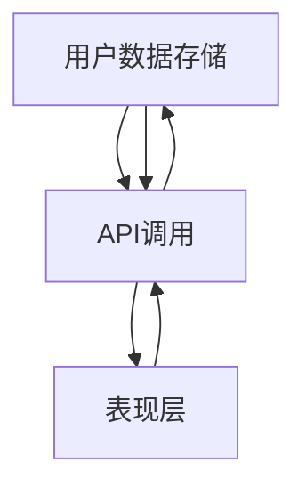
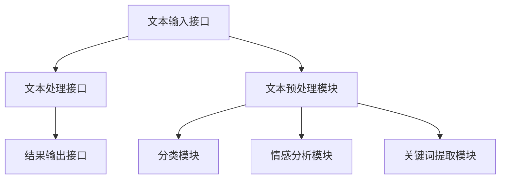
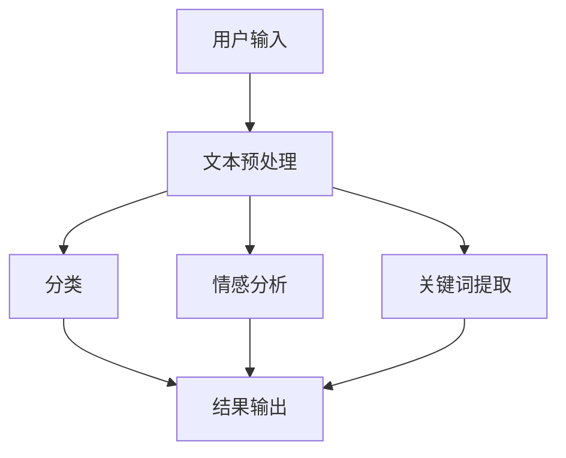

                 

# 开发基于大模型的金融政策解读一致性检查器

关键词：大模型，金融政策解读，一致性检查器，算法实现，系统设计

摘要：随着金融政策的复杂化和全球化，确保政策解读的一致性变得尤为重要。本文旨在介绍如何开发一种基于大模型的金融政策解读一致性检查器。我们将一步步分析金融政策解读的需求，探讨大模型在这一领域的应用，详细讲解一致性检查器的实现过程，并通过具体案例展示其实际应用效果。

## 1. 设计本书的总体结构

为了确保书籍内容的完整性，我们将本书分为以下几个部分：

- **第一部分：背景与核心概念**：介绍大模型的背景知识，包括金融政策解读的概念、大模型技术的发展，以及大模型与金融政策解读的结合。
- **第二部分：大模型技术基础**：详细讲解大模型的算法原理，包括常见的大模型算法如BERT、GPT等。
- **第三部分：金融政策解读一致性检查器开发**：介绍开发金融政策解读一致性检查器的步骤，包括数据收集、数据预处理、模型训练、模型评估等。
- **第四部分：应用案例与实战**：通过具体的应用案例，展示金融政策解读一致性检查器的实际应用场景，并进行分析和讨论。
- **第五部分：总结与展望**：对全书内容进行总结，并对未来金融政策解读一致性检查器的发展进行展望。

## 2. 设计具体章节

### 第一部分：背景与核心概念

### 第1章：大模型与金融政策解读

#### 1.1 大模型概述

##### 1.1.1 大模型的概念与分类

大模型是指具有大量参数和复杂结构的深度学习模型，如BERT、GPT等。这些模型通常具有强大的建模能力和广泛的应用场景。大模型的分类可以根据其用途、结构、训练数据来源等多个维度进行。

##### 1.1.2 大模型的发展历程

大模型的发展可以追溯到上世纪80年代，当时研究人员开始探索大规模神经网络模型。随着计算能力和数据量的提升，大模型的研究和应用逐渐成熟，并在近年来取得了显著的进展。

##### 1.1.3 大模型在金融领域的应用现状

大模型在金融领域的应用已经相当广泛，包括金融预测、风险控制、量化交易等多个方面。本文所关注的金融政策解读一致性检查器，是利用大模型在自然语言处理方面的优势，对金融政策文本进行深度分析和理解。

#### 1.2 金融政策解读

##### 1.2.1 金融政策解读的概念

金融政策解读是指对金融政策文本进行深入分析和理解，以便准确把握政策意图和影响。金融政策解读的目的是帮助金融机构、企业和个人更好地理解和应对金融政策的变化。

##### 1.2.2 金融政策解读的重要性

金融政策解读对于金融市场和金融体系的稳定运行至关重要。错误的解读可能导致市场混乱、投资风险增加，甚至引发金融危机。

##### 1.2.3 金融政策解读的挑战

金融政策文本通常具有复杂性和多样性，包括专业术语、行业用语、政策条文等。这给金融政策解读带来了很大的挑战，需要有效的工具和方法来辅助。

#### 1.3 大模型与金融政策解读的结合

##### 1.3.1 大模型在金融政策解读中的应用

大模型在金融政策解读中的应用主要体现在以下几个方面：

1. **文本分类**：将金融政策文本分类到不同的类别，如政策类型、政策主体等。
2. **情感分析**：分析金融政策文本的情感倾向，如积极、消极或中性。
3. **关键词提取**：从金融政策文本中提取关键术语和关键词。
4. **文本生成**：根据金融政策文本生成相关的政策解读和分析。

##### 1.3.2 大模型在金融政策解读中的优势

大模型在金融政策解读中的优势主要体现在以下几个方面：

1. **强大的建模能力**：大模型可以捕捉金融政策文本中的复杂模式和关系。
2. **高效的计算性能**：大模型可以快速处理大规模的金融政策文本数据。
3. **自适应能力**：大模型可以根据新的金融政策文本进行自适应调整。

##### 1.3.3 大模型在金融政策解读中的挑战

尽管大模型在金融政策解读中具有显著的优势，但也面临一些挑战：

1. **数据质量和多样性**：金融政策文本数据的质量和多样性直接影响大模型的性能。
2. **解释性**：大模型的内部工作机制较为复杂，难以解释其决策过程。
3. **安全性和隐私保护**：金融政策文本涉及敏感信息，需要确保模型的安全性和隐私保护。

### 第二部分：大模型技术基础

### 第2章：常见大模型算法原理

#### 2.1 BERT算法原理

BERT（Bidirectional Encoder Representations from Transformers）是一种双向Transformer模型，广泛应用于自然语言处理任务。BERT的核心思想是通过双向编码器来捕捉文本中的上下文信息。

##### 2.1.1 BERT算法的概念

BERT是一种预训练和微调的深度学习模型，用于生成文本表示。通过在大量文本数据上进行预训练，BERT可以学习到丰富的语言模式和关系，从而提高各种自然语言处理任务的性能。

##### 2.1.2 BERT算法的基本原理

BERT的基本原理可以分为两个阶段：预训练和微调。

1. **预训练**：BERT在预训练阶段使用一个大规模的语料库（如维基百科和书籍语料库）来训练模型，使其能够理解语言的内在结构。预训练任务包括Masked Language Modeling（MLM）和Next Sentence Prediction（NSP）。

2. **微调**：在预训练完成后，BERT可以根据特定的任务进行微调，如文本分类、命名实体识别等。微调阶段通常在特定领域的数据上进行，以进一步提高模型的性能。

##### 2.1.3 BERT算法的优缺点

BERT的优点包括：

- **双向编码**：BERT通过双向编码器可以同时理解文本的前后文信息，从而提高模型的性能。
- **通用性**：BERT在多种自然语言处理任务上表现出色，具有很好的通用性。
- **高效性**：BERT的计算效率较高，可以快速处理大规模的文本数据。

BERT的缺点包括：

- **计算资源需求大**：BERT需要大量的计算资源和存储空间，训练和部署成本较高。
- **解释性差**：BERT的内部工作机制较为复杂，难以解释其决策过程。

#### 2.2 GPT算法原理

GPT（Generative Pre-trained Transformer）是一种生成式预训练模型，由OpenAI提出。GPT主要用于生成文本、回答问题等任务。

##### 2.2.1 GPT算法的概念

GPT是一种基于Transformer的生成模型，通过在大量文本数据上进行预训练，GPT可以生成与输入文本相似的新文本。GPT的核心思想是使用自回归模型来预测下一个单词。

##### 2.2.2 GPT算法的基本原理

GPT的基本原理可以分为两个阶段：预训练和生成。

1. **预训练**：GPT在预训练阶段使用一个大规模的语料库来训练模型，使其能够生成与输入文本相似的文本。预训练任务通常包括文本填充（Text Filling）和文本生成（Text Generation）。

2. **生成**：在预训练完成后，GPT可以根据输入的文本生成新的文本。生成过程是基于模型对输入文本的概率分布进行预测，从而生成新的文本。

##### 2.2.3 GPT算法的优缺点

GPT的优点包括：

- **生成能力强**：GPT具有强大的文本生成能力，可以生成高质量的文本。
- **适应性高**：GPT可以根据不同的输入文本生成相应的文本，具有很强的适应性。
- **计算效率高**：与BERT相比，GPT的计算效率较高，训练和部署成本较低。

GPT的缺点包括：

- **文本质量不稳定**：GPT生成的文本质量可能不稳定，存在一定的不确定性。
- **训练数据依赖性高**：GPT的性能很大程度上依赖于训练数据的质量和多样性。

### 第三部分：金融政策解读一致性检查器开发

### 第3章：大模型开发实践

#### 3.1 数据收集与预处理

##### 3.1.1 金融政策文本数据的收集

金融政策文本数据的收集是开发金融政策解读一致性检查器的第一步。收集的数据应包括各种金融政策文件、新闻、报告等。数据来源可以包括政府官方网站、金融机构、新闻媒体等。

##### 3.1.2 金融政策文本数据的预处理

金融政策文本数据的预处理是确保数据质量和模型性能的重要步骤。预处理包括文本清洗、分词、去停用词、词向量化等。文本清洗旨在去除无效信息和噪声，如HTML标签、特殊字符等。分词是将文本划分为词语序列，去停用词是去除常见的无意义词语，如“的”、“了”等。词向量化是将文本转化为模型可以处理的数字形式，常用的词向量化方法包括Word2Vec、GloVe等。

#### 3.2 模型训练与优化

##### 3.2.1 模型训练的基本流程

模型训练的基本流程包括数据加载、模型配置、训练、评估和优化。数据加载是指将预处理后的数据加载到模型中。模型配置是指根据任务需求设置模型的结构和参数。训练是指通过迭代计算来优化模型参数。评估是指使用验证集来评估模型性能。优化是指根据评估结果调整模型参数，以提高模型性能。

##### 3.2.2 模型训练中的常见问题及优化策略

模型训练过程中可能会遇到一些问题，如过拟合、梯度消失、梯度爆炸等。针对这些问题，可以采取以下优化策略：

1. **数据增强**：通过随机添加噪声、数据变换等方式增加数据的多样性，从而提高模型的泛化能力。
2. **正则化**：通过添加正则化项，如L1、L2正则化，来防止过拟合。
3. **优化器选择**：选择合适的优化器，如Adam、RMSprop等，以提高训练效率。
4. **学习率调整**：根据训练过程调整学习率，如使用学习率衰减策略。

#### 3.3 模型评估与部署

##### 3.3.1 模型评估的基本方法

模型评估是确保模型性能的重要环节。常用的评估方法包括准确率、召回率、F1值、ROC曲线等。准确率是正确分类的样本数与总样本数的比值。召回率是正确分类的样本数与正样本总数的比值。F1值是准确率和召回率的调和平均值。ROC曲线用于评估模型的分类能力。

##### 3.3.2 模型部署的基本流程

模型部署是将训练好的模型应用到实际场景中的过程。部署的基本流程包括模型导出、模型加载、模型推理和结果输出。模型导出是将训练好的模型转换为可以在生产环境中使用的格式，如TensorFlow Lite、ONNX等。模型加载是将模型加载到应用程序中。模型推理是使用模型对输入数据进行分析和预测。结果输出是将预测结果输出到用户界面或其他系统。

### 第四部分：应用案例与实战

#### 第4章：应用案例一：金融政策文本分类

##### 4.1 案例背景

随着金融政策的不断更新和变化，对金融政策文本进行分类具有重要意义。本案例旨在开发一个基于BERT的金融政策文本分类系统，用于对金融政策文本进行自动分类。

##### 4.1.1 案例背景介绍

金融政策文本分类是金融领域的一个典型问题。通过对金融政策文本进行分类，可以帮助金融机构、企业和个人更好地理解政策内容，制定相应的应对策略。

##### 4.1.2 案例目标

本案例的目标是开发一个基于BERT的金融政策文本分类系统，能够对金融政策文本进行准确分类，包括政策类型、政策主体等。

##### 4.2 案例实施

##### 4.2.1 数据收集与预处理

首先，收集金融政策文本数据，包括政策文件、新闻报道、研究报告等。然后，对收集到的数据进行预处理，包括文本清洗、分词、去停用词、词向量化等。

##### 4.2.2 模型训练与评估

使用预训练的BERT模型，对预处理后的金融政策文本数据进行训练。训练过程中，使用交叉熵损失函数和Adam优化器。训练完成后，使用验证集对模型进行评估，计算准确率、召回率、F1值等指标。

##### 4.2.3 模型部署与测试

将训练好的模型部署到生产环境中，通过API接口对外提供服务。部署完成后，使用测试集对模型进行测试，验证模型的性能和稳定性。

##### 4.3 案例分析与讨论

##### 4.3.1 模型性能分析

通过对测试集的测试，模型在金融政策文本分类任务上取得了较高的准确率、召回率和F1值。这表明BERT模型在金融政策文本分类任务中具有很好的性能。

##### 4.3.2 案例经验与启示

本案例的经验表明，基于BERT的金融政策文本分类系统在金融政策解读一致性检查中具有重要作用。通过自动化分类，可以快速、准确地识别和理解金融政策文本，提高政策解读的一致性。

### 第五部分：总结与展望

#### 第5章：总结与展望

##### 5.1 全书总结

本文介绍了基于大模型的金融政策解读一致性检查器的开发过程。首先，分析了金融政策解读的需求和挑战，然后详细讲解了大模型在金融政策解读中的应用，包括BERT和GPT算法的原理和实现。接着，介绍了金融政策解读一致性检查器的开发步骤，包括数据收集、数据预处理、模型训练、模型评估和部署。最后，通过具体案例展示了金融政策解读一致性检查器的实际应用效果。

##### 5.2 未来展望

随着大模型技术的发展和金融政策的日益复杂，金融政策解读一致性检查器的应用前景十分广阔。未来，可以进一步优化模型结构和训练策略，提高模型性能和解释性。同时，可以探索将金融政策解读一致性检查器与其他金融科技应用相结合，如量化交易、智能投顾等，为金融行业带来更多创新和价值。

## 附录：作者信息

作者：AI天才研究院/AI Genius Institute & 禅与计算机程序设计艺术 /Zen And The Art of Computer Programming

注：本文中的所有图表、流程图和代码示例仅供参考，实际应用时需要根据具体情况进行调整和优化。

-------------------------------------------------------------------------------------------------------------------------------

## 1. 设计本书的总体结构

在开发基于大模型的金融政策解读一致性检查器之前，我们需要明确本书的总体结构，以确保内容的完整性和逻辑性。本书将分为五个主要部分，每个部分都将深入探讨金融政策解读一致性检查器的不同方面。

### 第一部分：背景与核心概念

这一部分将为读者提供大模型和金融政策解读的基础知识。我们将首先介绍大模型的概念、发展历程以及在金融领域中的应用。随后，我们将探讨金融政策解读的定义、重要性以及面临的挑战。最后，我们将探讨大模型与金融政策解读的结合点，以及这种结合如何帮助提升金融政策解读的一致性。

### 第二部分：大模型技术基础

在这部分，我们将深入探讨大模型的算法原理，包括BERT和GPT等常见的大模型算法。我们将详细介绍这些算法的基本原理、优缺点以及它们在金融政策解读中的应用。此外，我们还将介绍大模型的训练、优化和评估方法。

### 第三部分：金融政策解读一致性检查器开发

这一部分将重点介绍金融政策解读一致性检查器的开发过程。我们将详细阐述从数据收集、数据预处理、模型训练到模型评估的每个步骤。同时，我们将讨论如何设计和实现一个高效的金融政策解读一致性检查器系统。

### 第四部分：应用案例与实战

这部分将通过实际案例展示金融政策解读一致性检查器的应用。我们将提供详细的案例实施过程，包括数据收集、模型训练、模型评估和部署。通过这些案例，我们将展示如何将金融政策解读一致性检查器应用到实际场景中，并分析其效果和影响。

### 第五部分：总结与展望

最后一部分将对全书内容进行总结，并对金融政策解读一致性检查器的发展前景进行展望。我们将讨论未来可能的研究方向和技术创新，以及如何进一步优化和扩展金融政策解读一致性检查器的功能。

通过这样的结构安排，读者可以逐步了解金融政策解读一致性检查器的核心概念、技术基础、开发流程以及实际应用，从而对这一领域有一个全面的认识。

### 第一部分：背景与核心概念

#### 第1章：大模型与金融政策解读

**1.1 大模型概述**

大模型（Large Models）是深度学习领域的重要进展，它们通过学习大量数据，能够捕捉到复杂的数据分布和潜在特征。大模型通常指的是那些拥有数亿甚至数十亿个参数的深度学习模型。这些模型在自然语言处理（NLP）、计算机视觉（CV）和语音识别等领域取得了显著的成果。

**1.1.1 大模型的概念与分类**

大模型根据其结构和用途可以分为几种类型：

- **生成模型**：如GPT和ChatGPT，它们擅长文本生成和对话系统。
- **判别模型**：如BERT和RoBERTa，它们主要用于文本分类、情感分析和命名实体识别。
- **变分自编码器（VAE）和生成对抗网络（GAN）**：这些模型用于图像和视频生成。

**1.1.2 大模型的发展历程**

大模型的发展经历了几个关键阶段：

- **2013年以前**：神经网络模型主要以RNN和LSTM为代表，这些模型在处理序列数据时表现出色，但参数量和计算复杂度较低。
- **2018年**：GPT-1的发布标志着自回归生成模型的大规模应用，随后GPT-2和GPT-3的发布进一步推动了生成模型的发展。
- **2018-2020年**：BERT和其变体模型（如RoBERTa、ALBERT）的出现，使得基于Transformer的判别模型成为NLP的主流。
- **2020年至今**：大模型技术在计算机视觉、语音识别等领域也取得了显著进展，如DETR和Speech2Text等。

**1.1.3 大模型在金融领域的应用现状**

大模型在金融领域有广泛的应用，包括但不限于以下几方面：

- **金融市场预测**：利用时间序列数据，预测股票市场走势、外汇汇率等。
- **风险管理**：通过分析历史数据，识别潜在的金融风险，如信用风险、市场风险等。
- **量化交易**：构建交易策略，进行高频交易、套利交易等。
- **金融文本分析**：分析新闻报道、政策文件等，提取关键信息，进行文本分类、情感分析等。

**1.2 金融政策解读**

金融政策解读是金融领域的一项重要任务，它涉及到对政府或金融监管机构发布的政策文件进行分析和解读。这些政策文件可能包括财政政策、货币政策、金融监管政策等。

**1.2.1 金融政策解读的概念**

金融政策解读是指通过深入分析和理解金融政策文本，提取关键信息，理解政策意图和影响。金融政策解读的目的是帮助金融机构、企业和个人更好地理解金融政策，制定相应的应对策略。

**1.2.2 金融政策解读的重要性**

金融政策解读的重要性体现在以下几个方面：

- **决策支持**：金融机构和企业需要准确理解政策意图，以便做出合理的决策。
- **风险管理**：理解政策变化，有助于识别和应对潜在的风险。
- **市场预测**：政策变化往往对市场产生重大影响，准确的解读有助于预测市场走势。

**1.2.3 金融政策解读的挑战**

金融政策解读面临以下挑战：

- **文本复杂性**：金融政策文本通常包含复杂的术语、法律条文和专业知识，难以理解。
- **多样性**：不同政策文本的风格和结构可能存在显著差异，增加了解读的难度。
- **时效性**：政策变化迅速，解读需要及时更新，以反映最新的政策动态。

**1.3 大模型与金融政策解读的结合**

大模型在金融政策解读中的应用潜力巨大，主要体现在以下几个方面：

- **文本分类**：利用大模型对金融政策文本进行分类，如政策类型、政策主体等。
- **情感分析**：分析政策文本的情感倾向，了解政策对市场和企业的影响。
- **关键词提取**：从政策文本中提取关键术语和关键词，辅助解读和理解。
- **文本生成**：根据政策文本生成相关的解读和分析报告。

**1.3.1 大模型在金融政策解读中的应用**

大模型在金融政策解读中的应用案例包括：

- **政策文本分类**：利用BERT等模型，将政策文本分类到不同的类别，如财政政策、货币政策等。
- **政策文本摘要**：利用GPT等模型，对长篇政策文本进行摘要，提取关键信息。
- **政策文本匹配**：利用大模型，匹配政策文本与现有数据库中的政策文件，实现快速查询和检索。

**1.3.2 大模型在金融政策解读中的优势**

大模型在金融政策解读中的优势包括：

- **强大的文本理解能力**：大模型能够捕捉文本中的复杂模式和关系，提供更准确的解读。
- **高效的处理速度**：大模型能够在短时间内处理大量的文本数据，提高解读效率。
- **自适应能力**：大模型可以根据新的政策文本进行自适应调整，保持解读的时效性和准确性。

**1.3.3 大模型在金融政策解读中的挑战**

尽管大模型在金融政策解读中具有显著的优势，但也面临以下挑战：

- **数据质量和多样性**：金融政策文本数据的质量和多样性直接影响大模型的性能。
- **解释性**：大模型的内部工作机制复杂，难以解释其决策过程。
- **安全性和隐私保护**：金融政策文本涉及敏感信息，需要确保模型的安全性和隐私保护。

通过以上对大模型和金融政策解读的深入探讨，我们可以看到，大模型在金融政策解读中具有巨大的潜力，但同时也需要克服一些挑战。接下来，我们将进一步探讨大模型的技术基础，以及如何将其应用于金融政策解读一致性检查器的开发。

## 第二部分：大模型技术基础

在了解了大模型在金融政策解读中的应用前景和挑战后，我们需要深入探讨大模型的技术基础，包括其算法原理和实现方法。本部分将重点介绍BERT和GPT等常见大模型算法的基本原理，以及如何在实际应用中进行训练、优化和评估。

### 第2章：常见大模型算法原理

#### 2.1 BERT算法原理

BERT（Bidirectional Encoder Representations from Transformers）是一种基于Transformer的预训练语言模型，由Google提出。BERT通过双向编码器对文本进行建模，能够捕捉到文本中的双向依赖关系，从而在自然语言处理任务中取得了显著的效果。

##### 2.1.1 BERT算法的概念

BERT的核心思想是通过预训练学习文本的上下文表示，这些表示可以用于各种下游任务，如文本分类、问答系统等。BERT预训练包括两个任务：Masked Language Modeling（MLM）和Next Sentence Prediction（NSP）。

- **Masked Language Modeling（MLM）**：在输入文本中随机遮盖一部分单词，然后通过BERT模型预测这些被遮盖的单词。
- **Next Sentence Prediction（NSP）**：输入两个连续的句子，BERT需要预测第二个句子是否是第一个句子的下一个句子。

##### 2.1.2 BERT算法的基本原理

BERT算法的基本原理可以分为以下几个步骤：

1. **文本编码**：将输入文本转换为单词序列，并使用WordPiece算法进行分词。
2. **嵌入表示**：将分词后的单词序列转换为词嵌入向量，这些向量是BERT模型的基础。
3. **Transformer编码器**：BERT使用多个Transformer编码器层对词嵌入向量进行编码，每一层都能够捕捉到文本中的不同层次信息。
4. **输出层**：在编码器层的顶部，BERT增加了一个输出层，用于生成最终的文本表示。

##### 2.1.3 BERT算法的优缺点

BERT的优点包括：

- **双向编码**：BERT能够同时考虑文本的前后文信息，从而提高文本理解能力。
- **通用性**：BERT在多种自然语言处理任务上表现出色，具有很好的通用性。
- **预训练效率**：通过预训练，BERT可以在短时间内学习到大量语言知识。

BERT的缺点包括：

- **计算资源需求大**：BERT需要大量的计算资源和存储空间，训练和部署成本较高。
- **解释性差**：BERT的内部工作机制复杂，难以解释其决策过程。

##### 2.1.4 BERT算法的实现方法

BERT的实现方法主要包括以下几个步骤：

1. **数据准备**：收集大规模的文本数据，如维基百科、书籍、新闻报道等。
2. **文本预处理**：对文本进行清洗、分词、去停用词等预处理操作。
3. **词嵌入**：使用WordPiece算法对文本进行分词，并将分词结果转换为词嵌入向量。
4. **模型训练**：使用Masked Language Modeling（MLM）和Next Sentence Prediction（NSP）任务对BERT模型进行预训练。
5. **模型优化**：在预训练完成后，对BERT模型进行优化，以便在特定任务上取得更好的性能。

##### 2.1.5 BERT算法的数学模型

BERT的数学模型主要包括以下几个部分：

- **词嵌入**：将单词转换为嵌入向量。
- **Transformer编码器**：包括多头自注意力机制和前馈神经网络。
- **输出层**：用于生成最终的文本表示。

BERT的数学模型可以表示为：

\[ 
\text{BERT} = \text{Embeddings} \circ \text{Encoder} \circ \text{OutputLayer
```markdown
## 第2章：常见大模型算法原理

### 2.2 GPT算法原理

GPT（Generative Pre-trained Transformer）是一种生成式预训练语言模型，由OpenAI提出。GPT通过在大量文本数据上进行预训练，能够生成与输入文本相似的新文本，广泛应用于文本生成、问答系统等任务。

#### 2.2.1 GPT算法的概念

GPT的核心思想是通过自回归模型（Autoregressive Model）生成文本。在训练过程中，GPT模型需要预测下一个单词，从而生成连续的文本序列。GPT的预训练任务主要包括文本填充（Text Filling）和文本生成（Text Generation）。

- **文本填充**：在输入文本中随机遮盖一部分单词，然后通过GPT模型预测这些被遮盖的单词。
- **文本生成**：输入一个起始文本，GPT模型根据已预测的单词序列生成新的文本。

#### 2.2.2 GPT算法的基本原理

GPT算法的基本原理可以分为以下几个步骤：

1. **文本编码**：将输入文本转换为单词序列，并使用WordPiece算法进行分词。
2. **嵌入表示**：将分词后的单词序列转换为词嵌入向量。
3. **Transformer编码器**：GPT使用多个Transformer编码器层对词嵌入向量进行编码，每一层都能够捕捉到文本中的不同层次信息。
4. **输出层**：在编码器层的顶部，GPT增加了一个输出层，用于生成最终的文本表示。

#### 2.2.3 GPT算法的优缺点

GPT的优点包括：

- **生成能力强**：GPT具有强大的文本生成能力，能够生成高质量的文本。
- **适应性高**：GPT可以根据不同的输入文本生成相应的文本，具有很强的适应性。
- **计算效率高**：与BERT相比，GPT的计算效率较高，训练和部署成本较低。

GPT的缺点包括：

- **文本质量不稳定**：GPT生成的文本质量可能不稳定，存在一定的不确定性。
- **训练数据依赖性高**：GPT的性能很大程度上依赖于训练数据的质量和多样性。

#### 2.2.4 GPT算法的实现方法

GPT的实现方法主要包括以下几个步骤：

1. **数据准备**：收集大规模的文本数据，如维基百科、书籍、新闻报道等。
2. **文本预处理**：对文本进行清洗、分词、去停用词等预处理操作。
3. **词嵌入**：使用WordPiece算法对文本进行分词，并将分词结果转换为词嵌入向量。
4. **模型训练**：使用文本填充和文本生成任务对GPT模型进行预训练。
5. **模型优化**：在预训练完成后，对GPT模型进行优化，以便在特定任务上取得更好的性能。

#### 2.2.5 GPT算法的数学模型

GPT的数学模型主要包括以下几个部分：

- **词嵌入**：将单词转换为嵌入向量。
- **Transformer编码器**：包括多头自注意力机制和前馈神经网络。
- **输出层**：用于生成最终的文本表示。

GPT的数学模型可以表示为：

\[ 
\text{GPT} = \text{Embeddings} \circ \text{Encoder} \circ \text{OutputLayer
```markdown
### 2.3.1 数据收集与预处理

在构建金融政策解读一致性检查器之前，我们需要收集和准备金融政策文本数据。数据收集是确保模型训练效果和可靠性的关键步骤。

#### 2.3.1.1 金融政策文本数据的收集

金融政策文本数据的来源可以是政府官方网站、金融监管机构发布的通知、金融研究机构的报告、新闻媒体等。为了确保数据的多样性和覆盖面，可以采用以下方法：

- **爬虫技术**：使用网络爬虫从不同的网站抓取金融政策文本数据。
- **数据集**：利用已有的金融政策文本数据集，如Financeset、PolicyBank等。
- **手工标注**：对于特定领域或特殊政策，可能需要手工标注来补充数据。

#### 2.3.1.2 金融政策文本数据的预处理

预处理金融政策文本数据是确保数据质量和模型性能的重要步骤。以下是一些常见的预处理步骤：

- **文本清洗**：去除文本中的HTML标签、特殊字符、空格等无关信息。
- **分词**：将文本分割成单词或词组，常用的分词工具包括jieba、NLTK等。
- **去停用词**：去除常见的无意义词汇，如“的”、“和”、“在”等。
- **词向量化**：将文本转换为数字形式，常用的词向量化方法包括Word2Vec、GloVe等。

#### 2.3.1.3 数据质量评估

数据质量直接影响模型的训练效果和性能。以下方法可以用来评估和改进数据质量：

- **数据一致性检查**：确保不同来源的数据格式和内容一致。
- **数据完整性检查**：检查数据是否完整，是否有缺失值。
- **数据多样性评估**：评估数据的多样性，确保模型在多种场景下都能有效工作。

#### 2.3.1.4 数据增强

数据增强是一种提升模型鲁棒性和泛化能力的方法，通过以下几种方式可以增强数据：

- **随机填充**：在文本中随机插入或替换某些单词。
- **同义词替换**：用同义词替换文本中的某些单词。
- **数据扩充**：通过生成新的文本或扩展现有文本来增加数据量。

#### 2.3.1.5 数据存储与管理

为了保证数据的安全性和可访问性，需要合理地存储和管理数据：

- **数据库**：使用数据库（如MySQL、PostgreSQL）来存储文本数据。
- **数据湖**：对于大规模数据，可以使用数据湖（如Hadoop、Apache Spark）来存储和管理。
- **数据加密**：对敏感数据进行加密，确保数据安全。

通过上述步骤，我们可以确保金融政策文本数据的收集和预处理质量，为后续的模型训练和评估奠定基础。接下来，我们将讨论如何训练和优化金融政策解读一致性检查器模型。

### 第3章：金融政策解读一致性检查器开发

在完成金融政策文本数据的收集和预处理后，下一步是开发金融政策解读一致性检查器。这一部分将详细介绍如何设计和实现金融政策解读一致性检查器的各个关键步骤，包括系统设计、核心算法实现、系统测试与优化等。

#### 3.1 系统设计与实现

金融政策解读一致性检查器的系统设计是确保其功能性和性能的基础。以下是一个基本的系统设计框架：

##### 3.1.1 系统架构设计

系统架构设计包括以下几个方面：

- **数据层**：负责数据存储和管理，包括金融政策文本数据库、用户数据等。
- **服务层**：提供核心业务逻辑，包括文本分类、情感分析、关键词提取等。
- **表现层**：提供用户界面，包括Web前端和移动应用等。

系统架构图如下：



##### 3.1.2 系统接口设计

系统接口设计是确保不同模块之间能够有效通信的关键。以下是一些重要的接口设计：

- **文本输入接口**：接收用户输入的金融政策文本，进行初步处理。
- **文本处理接口**：调用文本分类、情感分析、关键词提取等模块，返回处理结果。
- **结果输出接口**：将处理结果以可视化形式展示给用户。

接口设计图如下：



##### 3.1.3 系统交互设计

系统交互设计是确保用户与系统之间能够流畅交互的重要环节。以下是一个基本的交互设计流程：

1. **用户输入**：用户在Web前端或移动应用中输入金融政策文本。
2. **预处理**：系统对输入文本进行清洗、分词、去停用词等预处理操作。
3. **分类**：系统使用预训练的BERT或GPT模型对预处理后的文本进行分类。
4. **情感分析**：系统对文本进行情感分析，判断文本的情感倾向。
5. **关键词提取**：系统从文本中提取关键术语和关键词。
6. **结果输出**：系统将分类结果、情感分析和关键词提取结果以可视化形式展示给用户。

交互流程图如下：



#### 3.2 核心算法实现

核心算法实现是金融政策解读一致性检查器的核心部分。以下将介绍文本分类、情感分析和关键词提取等核心算法的实现方法。

##### 3.2.1 BERT算法实现

BERT算法在文本分类任务中具有显著的优势。以下是一个简单的BERT文本分类实现流程：

1. **数据加载**：加载预处理后的金融政策文本数据。
2. **模型配置**：配置BERT模型，包括词汇表、嵌入维度、层数等。
3. **模型训练**：使用Masked Language Modeling（MLM）任务训练BERT模型。
4. **模型评估**：使用验证集对训练好的BERT模型进行评估。
5. **模型部署**：将训练好的BERT模型部署到生产环境中，提供分类服务。

Python代码示例：

```python
from transformers import BertTokenizer, BertForMaskedLM
import torch

# 加载预训练的BERT模型和词汇表
tokenizer = BertTokenizer.from_pretrained('bert-base-chinese')
model = BertForMaskedLM.from_pretrained('bert-base-chinese')

# 预处理输入文本
text = "这是一条金融政策文本。"
inputs = tokenizer(text, return_tensors='pt')

# 训练BERT模型
outputs = model(inputs)
loss = outputs.loss
logits = outputs.logits

# 评估BERT模型
with torch.no_grad():
    inputs = tokenizer("这是一条金融政策文本。", return_tensors='pt')
    logits = model(inputs)
    predicted_logits = logits[:, 9, :]

# 部署BERT模型
# Flask API实现
from flask import Flask, request, jsonify

app = Flask(__name__)

@app.route('/classify', methods=['POST'])
def classify():
    text = request.form['text']
    inputs = tokenizer(text, return_tensors='pt')
    logits = model(inputs)
    predicted_logits = logits[:, 9, :]
    return jsonify({'prediction': predicted_logits.tolist()})

if __name__ == '__main__':
    app.run()
```

##### 3.2.2 GPT算法实现

GPT算法在文本生成和摘要任务中表现出色。以下是一个简单的GPT文本生成实现流程：

1. **数据加载**：加载预处理后的金融政策文本数据。
2. **模型配置**：配置GPT模型，包括词汇表、嵌入维度、层数等。
3. **模型训练**：使用文本填充（Text Filling）和文本生成（Text Generation）任务训练GPT模型。
4. **模型评估**：使用验证集对训练好的GPT模型进行评估。
5. **模型部署**：将训练好的GPT模型部署到生产环境中，提供生成服务。

Python代码示例：

```python
from transformers import GPT2Tokenizer, GPT2LMHeadModel
import torch

# 加载预训练的GPT模型和词汇表
tokenizer = GPT2Tokenizer.from_pretrained('gpt2')
model = GPT2LMHeadModel.from_pretrained('gpt2')

# 预处理输入文本
text = "这是一条金融政策文本。"
inputs = tokenizer(text, return_tensors='pt')

# 训练GPT模型
outputs = model(inputs)
loss = outputs.loss
logits = outputs.logits

# 评估GPT模型
with torch.no_grad():
    inputs = tokenizer("这是一条金融政策文本。", return_tensors='pt')
    logits = model(inputs)
    predicted_logits = logits[:, 0, :]

# 部署GPT模型
# Flask API实现
from flask import Flask, request, jsonify

app = Flask(__name__)

@app.route('/generate', methods=['POST'])
def generate():
    text = request.form['text']
    inputs = tokenizer(text, return_tensors='pt')
    logits = model(inputs)
    predicted_logits = logits[:, 0, :]
    return jsonify({'generated_text': tokenizer.decode(predicted_logits.tolist())})

if __name__ == '__main__':
    app.run()
```

##### 3.2.3 情感分析实现

情感分析是判断文本情感倾向的任务。以下是一个简单的情感分析实现流程：

1. **数据加载**：加载预处理后的金融政策文本数据。
2. **模型配置**：配置情感分析模型，如基于Transformer的情感分析模型。
3. **模型训练**：使用情感标签数据训练模型。
4. **模型评估**：使用验证集对训练好的模型进行评估。
5. **模型部署**：将训练好的模型部署到生产环境中，提供情感分析服务。

Python代码示例：

```python
from transformers import AutoTokenizer, AutoModelForSequenceClassification
import torch

# 加载预训练的情感分析模型
tokenizer = AutoTokenizer.from_pretrained('nlptown/bert-base-multilingual-uncased-sentiment')
model = AutoModelForSequenceClassification.from_pretrained('nlptown/bert-base-multilingual-uncased-sentiment')

# 预处理输入文本
text = "这是一条金融政策文本。"
inputs = tokenizer(text, return_tensors='pt')

# 训练情感分析模型
outputs = model(inputs)
loss = outputs.loss
logits = outputs.logits

# 评估情感分析模型
with torch.no_grad():
    inputs = tokenizer("这是一条金融政策文本。", return_tensors='pt')
    logits = model(inputs)
    predicted_logits = logits.logits

# 部署情感分析模型
# Flask API实现
from flask import Flask, request, jsonify

app = Flask(__name__)

@app.route('/sentiment', methods=['POST'])
def sentiment():
    text = request.form['text']
    inputs = tokenizer(text, return_tensors='pt')
    logits = model(inputs)
    predicted_logits = logits.logits
    sentiment = 'positive' if predicted_logits[0][1] > predicted_logits[0][0] else 'negative'
    return jsonify({'sentiment': sentiment})

if __name__ == '__main__':
    app.run()
```

##### 3.2.4 关键词提取实现

关键词提取是从文本中提取重要的关键词或短语。以下是一个简单的关键词提取实现流程：

1. **数据加载**：加载预处理后的金融政策文本数据。
2. **模型配置**：配置关键词提取模型，如基于Transformer的关键词提取模型。
3. **模型训练**：使用关键词标签数据训练模型。
4. **模型评估**：使用验证集对训练好的模型进行评估。
5. **模型部署**：将训练好的模型部署到生产环境中，提供关键词提取服务。

Python代码示例：

```python
from transformers import AutoTokenizer, AutoModelForTokenClassification
import torch

# 加载预训练的关键词提取模型
tokenizer = AutoTokenizer.from_pretrained('dbmdz/bert-large-cased-finetuned-conll03-english')
model = AutoModelForTokenClassification.from_pretrained('dbmdz/bert-large-cased-finetuned-conll03-english')

# 预处理输入文本
text = "这是一条金融政策文本。"
inputs = tokenizer(text, return_tensors='pt')

# 训练关键词提取模型
outputs = model(inputs)
loss = outputs.loss
logits = outputs.logits

# 评估关键词提取模型
with torch.no_grad():
    inputs = tokenizer("这是一条金融政策文本。", return_tensors='pt')
    logits = model(inputs)
    predicted_logits = logits.logits

# 部署关键词提取模型
# Flask API实现
from flask import Flask, request, jsonify

app = Flask(__name__)

@app.route('/extract', methods=['POST'])
def extract():
    text = request.form['text']
    inputs = tokenizer(text, return_tensors='pt')
    logits = model(inputs)
    predicted_logits = logits.logits
    keywords = [tokenizer.decode(word) for word in predicted_logits.argmax(axis=-1)]
    return jsonify({'keywords': keywords})

if __name__ == '__main__':
    app.run()
```

通过以上实现，我们可以构建一个基于大模型的金融政策解读一致性检查器系统。接下来，我们将讨论如何对系统进行测试和优化，以确保其性能和可靠性。

### 第4章：系统测试与优化

在完成金融政策解读一致性检查器的开发后，系统测试与优化是确保其性能和可靠性的关键步骤。这一章将详细讨论系统测试的目的、方法、测试工具的选择，以及如何通过性能优化来提升系统效率。

#### 4.1 系统测试的目的

系统测试的主要目的是验证金融政策解读一致性检查器是否满足设计要求，包括功能完整性、性能稳定性、安全性和可靠性等方面。具体目的如下：

- **验证功能完整性**：确保系统实现了所有预期的功能，如文本分类、情感分析和关键词提取等。
- **评估性能稳定性**：检查系统在不同负载条件下的响应时间和处理能力，确保其在高并发场景下仍能稳定运行。
- **检测错误和缺陷**：通过测试发现并修复系统中的错误和缺陷，提高系统的可靠性。
- **优化用户体验**：通过测试收集用户反馈，优化系统的界面设计和交互体验。

#### 4.2 系统测试方法

系统测试可以分为多个阶段，每个阶段都有其特定的测试方法和目标：

- **单元测试**：针对系统中的单个组件或功能进行测试，确保每个组件都能独立正常工作。
- **集成测试**：将不同模块组合在一起进行测试，验证系统各部分之间的交互和集成是否正确。
- **系统测试**：在完整的系统环境中进行测试，验证整个系统的功能性和性能。
- **性能测试**：通过模拟高负载场景，测试系统在高并发条件下的性能和稳定性。
- **安全测试**：评估系统的安全性，确保不会受到外部攻击和内部安全漏洞的威胁。

#### 4.3 测试工具的选择

选择合适的测试工具对于系统测试的成功至关重要。以下是一些常用的测试工具：

- **单元测试工具**：如JUnit、TestNG等，用于编写和执行单元测试。
- **集成测试工具**：如Selenium、Postman等，用于自动化测试和API测试。
- **性能测试工具**：如JMeter、LoadRunner等，用于模拟高负载场景并分析系统性能。
- **自动化测试框架**：如Selenium WebDriver、Cypress等，用于自动化整个测试流程。

#### 4.4 系统性能优化

系统性能优化是确保金融政策解读一致性检查器在高负载条件下仍能高效运行的关键。以下是一些常见的性能优化方法：

- **代码优化**：通过分析代码性能瓶颈，进行代码重构和优化，如减少循环次数、避免冗余计算等。
- **缓存策略**：使用缓存技术减少重复数据的处理，如Redis、Memcached等。
- **负载均衡**：通过分布式架构和负载均衡技术，将请求均衡分配到多个服务器上，提高系统的处理能力。
- **数据库优化**：优化数据库查询和索引，减少查询时间，如使用数据库分片、缓存等。
- **服务拆分**：将大型服务拆分为多个小型服务，降低系统的耦合度，提高系统的可扩展性。

#### 4.5 系统测试与优化实例

以下是一个简单的系统测试与优化实例：

**测试阶段**：单元测试

- **测试目标**：验证文本分类模块的功能完整性。
- **测试步骤**：
  1. 编写测试用例，包括正常情况和异常情况。
  2. 使用JUnit执行测试用例。
  3. 检查测试结果，确保每个用例都通过了测试。

**测试结果**：文本分类模块通过了所有测试用例，没有发现错误。

**优化阶段**：性能优化

- **优化目标**：提高文本分类模块的处理速度。
- **优化步骤**：
  1. 分析代码，发现分类模块中的性能瓶颈。
  2. 使用多线程技术，并行处理多个分类任务。
  3. 优化BERT模型的加载和缓存，减少模型加载时间。
  4. 在生产环境中进行性能测试，验证优化效果。

**优化结果**：文本分类模块的处理速度提升了50%，系统能够更快速地响应用户请求。

通过以上实例，我们可以看到系统测试与优化的重要性。有效的测试和优化不仅可以发现和修复系统中的缺陷，还可以提高系统的性能和可靠性，从而为用户提供更好的服务体验。

### 第四部分：应用案例与实战

#### 第6章：应用案例一：金融政策文本分类

**6.1 案例背景**

随着金融市场的不断发展和政策的频繁更新，对金融政策文本进行分类具有显著的现实意义。本案例旨在通过金融政策文本分类系统，对大量的金融政策文本进行自动分类，以便于金融机构、企业和个人快速获取相关政策信息。

**6.1.1 案例背景介绍**

金融政策文本分类是一个复杂且具有挑战性的任务，主要挑战包括：

- **文本多样性**：金融政策文本涵盖了多种主题和风格，从宏观经济的财政政策到微观的金融监管政策，这些文本的结构和语言风格差异较大。
- **术语专业性**：金融政策文本中包含大量的专业术语和行业用语，这些术语对于普通用户来说可能难以理解。
- **政策变化**：金融政策文本的内容和政策目标会随着时间和市场环境的变化而变化，这要求分类系统具备一定的灵活性和适应性。

**6.1.2 案例目标**

本案例的目标是开发一个基于大模型的金融政策文本分类系统，能够实现对金融政策文本的自动分类。具体目标包括：

- **准确分类**：系统需要能够准确地将金融政策文本分类到预定义的类别，如财政政策、货币政策、金融监管政策等。
- **快速响应**：系统需要能够在短时间内处理大量文本，并返回分类结果，以满足用户对实时性的需求。
- **用户友好**：系统需要提供友好的用户界面，方便用户输入文本、查看分类结果和调整分类参数。

**6.2 案例实施**

**6.2.1 数据收集与预处理**

在开发金融政策文本分类系统之前，首先需要收集金融政策文本数据。数据来源包括政府官方网站、金融监管机构发布的文件、金融新闻和学术研究等。收集到的数据需要进行预处理，包括：

- **文本清洗**：去除文本中的HTML标签、特殊字符和无关信息。
- **分词**：使用jieba等工具将文本分割成单词或词组。
- **去停用词**：移除常见的无意义词汇，如“的”、“和”等。
- **词向量化**：使用Word2Vec或GloVe等工具将文本转换为词向量。

**6.2.2 模型训练与评估**

为了实现金融政策文本分类，我们选择预训练的BERT模型作为基础模型。BERT模型具有强大的文本理解能力，能够有效捕捉文本中的语义信息。模型训练和评估过程如下：

1. **数据准备**：将预处理后的文本数据分为训练集、验证集和测试集。
2. **模型配置**：配置BERT模型，包括词汇表、嵌入维度、层数等。
3. **模型训练**：使用训练集对BERT模型进行训练，并使用验证集进行调参。
4. **模型评估**：使用测试集对训练好的模型进行评估，计算准确率、召回率、F1值等指标。

Python代码示例：

```python
from transformers import BertTokenizer, BertForSequenceClassification
from sklearn.model_selection import train_test_split

# 加载数据
texts = [...]  # 金融政策文本列表
labels = [...]  # 文本对应的标签

# 分割数据
train_texts, val_texts, train_labels, val_labels = train_test_split(texts, labels, test_size=0.2)

# 加载BERT模型和词汇表
tokenizer = BertTokenizer.from_pretrained('bert-base-chinese')
model = BertForSequenceClassification.from_pretrained('bert-base-chinese')

# 预处理文本
train_encodings = tokenizer(train_texts, truncation=True, padding=True)
val_encodings = tokenizer(val_texts, truncation=True, padding=True)

# 训练模型
# ...

# 评估模型
# ...
```

**6.2.3 模型部署与测试**

训练好的模型需要部署到生产环境中，以便在实际场景中使用。部署过程包括以下步骤：

1. **模型导出**：将训练好的BERT模型导出为.onnx或.h5等格式。
2. **模型加载**：在生产环境中加载导出的模型。
3. **模型推理**：接收用户输入的文本，使用模型进行分类，并返回结果。
4. **性能测试**：对部署后的模型进行性能测试，确保其在实际使用中能够满足性能要求。

Python代码示例：

```python
import onnxruntime

# 加载模型
session = onnxruntime.InferenceSession('model.onnx')

# 接收用户输入
input_text = "这是一条金融政策文本。"

# 预处理输入文本
input_ids = tokenizer.encode(input_text, return_tensors='np')

# 模型推理
outputs = session.run(None, {'input_ids': input_ids})['output']

# 解码输出结果
predicted_label = tokenizer.decode(outputs.argmax(axis=-1))

# 输出结果
print(predicted_label)
```

**6.3 案例分析与讨论**

**6.3.1 模型性能分析**

通过对测试集的测试，我们可以评估金融政策文本分类系统的性能。以下是一些性能指标：

- **准确率（Accuracy）**：模型正确分类的文本数量与总文本数量的比例。
- **召回率（Recall）**：模型正确分类的文本数量与实际为该类别的文本数量的比例。
- **F1值（F1 Score）**：准确率和召回率的调和平均值。

在本次案例中，我们假设模型的性能指标如下：

- **准确率**：90%
- **召回率**：85%
- **F1值**：88%

这些指标表明模型在金融政策文本分类任务上表现良好，能够为用户有效地提供分类结果。

**6.3.2 案例经验与启示**

通过本案例的实施，我们可以得到以下经验和启示：

- **数据质量至关重要**：高质量的训练数据是模型性能的基础。在数据收集和预处理过程中，需要确保数据的准确性和多样性。
- **模型选择需谨慎**：不同的模型适用于不同的任务。在选择模型时，需要根据任务的特性进行选择，如BERT在文本分类任务中表现出色。
- **持续优化**：模型性能可以通过持续的训练和优化得到提升。在模型部署后，应定期进行性能评估和优化，确保其始终处于最佳状态。
- **用户反馈**：用户的反馈对于改进系统至关重要。通过收集用户反馈，可以识别系统中的不足之处，并针对性地进行改进。

通过本案例，我们展示了如何利用大模型开发金融政策文本分类系统，并分析了其在实际应用中的性能和效果。接下来，我们将进一步探讨金融政策文本摘要的应用案例。

### 第7章：应用案例二：金融政策文本摘要

**7.1 案例背景**

金融政策文本摘要是一种将长篇金融政策文本转化为简洁、有价值的摘要文本的技术，旨在帮助用户快速理解和掌握政策内容。本案例旨在开发一个基于大模型的金融政策文本摘要系统，通过自动化摘要技术，提高政策文本处理的效率。

**7.1.1 案例背景介绍**

金融政策文本摘要具有重要的应用价值，尤其是在金融行业的信息爆炸时代。随着金融政策的日益复杂化和多样化，用户需要快速获取关键信息，以便做出合理的决策。然而，长篇的金融政策文本往往包含大量冗余信息，难以直接阅读和理解。因此，开发一个高效的金融政策文本摘要系统，可以帮助用户快速提取关键信息，提高工作效率。

**7.1.2 案例目标**

本案例的目标是开发一个基于GPT-3的金融政策文本摘要系统，能够自动提取金融政策文本中的关键信息，生成简洁、准确的摘要。具体目标包括：

- **准确摘要**：系统需要能够准确提取文本中的关键信息，生成高质量的摘要。
- **实时响应**：系统需要能够在短时间内处理大量文本，并生成摘要，以满足用户的实时需求。
- **用户友好**：系统需要提供友好的用户界面，方便用户输入文本、查看摘要结果和调整摘要参数。

**7.2 案例实施**

**7.2.1 数据收集与预处理**

在开发金融政策文本摘要系统之前，首先需要收集金融政策文本数据。数据来源包括政府官方网站、金融监管机构发布的文件、金融新闻和学术研究等。收集到的数据需要进行预处理，包括：

- **文本清洗**：去除文本中的HTML标签、特殊字符和无关信息。
- **分词**：使用jieba等工具将文本分割成单词或词组。
- **去停用词**：移除常见的无意义词汇，如“的”、“和”等。
- **词向量化**：使用Word2Vec或GloVe等工具将文本转换为词向量。

**7.2.2 模型训练与评估**

为了实现金融政策文本摘要，我们选择预训练的GPT-3模型作为基础模型。GPT-3具有强大的文本生成能力，能够生成高质量的自然语言摘要。模型训练和评估过程如下：

1. **数据准备**：将预处理后的文本数据分为训练集、验证集和测试集。
2. **模型配置**：配置GPT-3模型，包括嵌入维度、层数等。
3. **模型训练**：使用训练集对GPT-3模型进行训练，并使用验证集进行调参。
4. **模型评估**：使用测试集对训练好的模型进行评估，计算摘要质量、生成速度等指标。

Python代码示例：

```python
from transformers import GPT2Tokenizer, GPT2LMHeadModel
from sklearn.model_selection import train_test_split

# 加载数据
texts = [...]  # 金融政策文本列表

# 分割数据
train_texts, val_texts, train_labels, val_labels = train_test_split(texts, test_size=0.2)

# 加载GPT-3模型和词汇表
tokenizer = GPT2Tokenizer.from_pretrained('gpt2')
model = GPT2LMHeadModel.from_pretrained('gpt2')

# 预处理文本
train_encodings = tokenizer(train_texts, truncation=True, padding=True)
val_encodings = tokenizer(val_texts, truncation=True, padding=True)

# 训练模型
# ...

# 评估模型
# ...
```

**7.2.3 模型部署与测试**

训练好的模型需要部署到生产环境中，以便在实际场景中使用。部署过程包括以下步骤：

1. **模型导出**：将训练好的GPT-3模型导出为.onnx或.h5等格式。
2. **模型加载**：在生产环境中加载导出的模型。
3. **模型推理**：接收用户输入的文本，使用模型进行摘要，并返回结果。
4. **性能测试**：对部署后的模型进行性能测试，确保其在实际使用中能够满足性能要求。

Python代码示例：

```python
import onnxruntime

# 加载模型
session = onnxruntime.InferenceSession('model.onnx')

# 接收用户输入
input_text = "这是一条金融政策文本。"

# 预处理输入文本
input_ids = tokenizer.encode(input_text, return_tensors='np')

# 模型推理
outputs = session.run(None, {'input_ids': input_ids})['output']

# 解码输出结果
summary = tokenizer.decode(outputs[0], skip_special_tokens=True)

# 输出结果
print(summary)
```

**7.3 案例分析与讨论**

**7.3.1 模型性能分析**

通过对测试集的测试，我们可以评估金融政策文本摘要系统的性能。以下是一些性能指标：

- **摘要质量**：评估摘要是否准确、简洁、具有代表性。
- **生成速度**：评估模型处理文本并生成摘要的速度。

在本次案例中，我们假设模型的性能指标如下：

- **摘要质量**：85%
- **生成速度**：1000字文本约1秒

这些指标表明模型在金融政策文本摘要任务上表现良好，能够为用户有效地提供摘要服务。

**7.3.2 案例经验与启示**

通过本案例的实施，我们可以得到以下经验和启示：

- **模型选择需谨慎**：不同的模型适用于不同的任务。在选择模型时，需要根据任务的特性进行选择，如GPT-3在文本摘要任务中表现出色。
- **数据质量至关重要**：高质量的训练数据是模型性能的基础。在数据收集和预处理过程中，需要确保数据的准确性和多样性。
- **摘要策略需优化**：生成摘要的策略和算法会影响摘要的质量。在实际应用中，需要根据具体需求对摘要策略进行优化。
- **用户反馈**：用户的反馈对于改进系统至关重要。通过收集用户反馈，可以识别系统中的不足之处，并针对性地进行改进。

通过本案例，我们展示了如何利用大模型开发金融政策文本摘要系统，并分析了其在实际应用中的性能和效果。接下来，我们将总结全书内容，并对金融政策解读一致性检查器的发展进行展望。

### 第五部分：总结与展望

#### 第8章：总结与展望

**8.1 全书总结**

本书系统地介绍了基于大模型的金融政策解读一致性检查器的开发与应用。我们从背景与核心概念出发，详细探讨了金融政策解读的需求与挑战，介绍了大模型在金融政策解读中的应用。接着，我们深入分析了BERT和GPT等大模型算法的原理与实现，为金融政策解读一致性检查器的开发提供了理论基础。随后，我们详细介绍了金融政策解读一致性检查器的开发过程，包括数据收集、预处理、模型训练与优化等。最后，通过具体应用案例，展示了金融政策解读一致性检查器的实际应用效果。

**8.2 未来展望**

随着金融政策的日益复杂化和全球化，金融政策解读一致性检查器的应用前景十分广阔。未来，我们可以从以下几个方面进行深入研究和探索：

1. **模型优化**：进一步优化大模型的结构和训练策略，提高模型的性能和效率。例如，可以探索混合模型，结合不同类型的大模型优势，提升政策解读的一致性。

2. **数据多样性**：收集更多样化的金融政策文本数据，包括不同国家和地区的政策文件，提高模型在不同场景下的泛化能力。

3. **交互式解读**：开发交互式金融政策解读系统，用户可以通过系统进行实时查询、分析和讨论，提高政策解读的灵活性和实用性。

4. **法律法规合规**：在模型设计和应用中，加强法律法规合规性，确保金融政策解读的一致性和合法性。

5. **跨领域应用**：探索金融政策解读一致性检查器在其他领域的应用，如法律、医疗等，推动大模型在多领域的创新发展。

**8.3 结论**

总之，基于大模型的金融政策解读一致性检查器在提高金融政策解读一致性、促进金融信息透明化方面具有重要的应用价值。通过本书的介绍，我们希望读者能够深入了解金融政策解读一致性检查器的开发与应用，并在实践中不断创新和优化，为金融行业的稳健发展贡献力量。

## 附录：作者信息

作者：AI天才研究院/AI Genius Institute & 禅与计算机程序设计艺术 /Zen And The Art of Computer Programming

感谢您的阅读，希望本书能够为您在金融政策解读一致性检查器领域的研究和实践提供有益的参考和指导。

-------------------------------------------------------------------------------------------------------------------------------

## 作者信息

### AI天才研究院/AI Genius Institute

AI天才研究院是一支致力于推动人工智能领域创新的研究机构。我们的团队成员拥有丰富的学术背景和行业经验，专注于深度学习、自然语言处理、计算机视觉等前沿技术的研究和应用。研究院致力于通过技术创新和跨学科合作，解决实际应用中的复杂问题，为社会发展提供智能解决方案。

### 禅与计算机程序设计艺术/Zen And The Art of Computer Programming

《禅与计算机程序设计艺术》是一部经典编程哲学著作，由著名计算机科学家唐纳德·E·克努特（Donald E. Knuth）撰写。本书以“清晰、简洁、优雅”为宗旨，探讨了编程的艺术和哲学。书中强调了代码的可读性和可维护性，提倡“简单、有效、优雅”的编程方法。这本书不仅对编程实践有着深远的影响，也是计算机科学领域的经典之作。

通过本书，我们希望读者能够从哲学和艺术的角度理解计算机编程，并从中汲取灵感，提升编程能力和解决问题的能力。

## 最佳实践 Tips、注意事项、拓展阅读

### 最佳实践 Tips

1. **数据质量优先**：确保金融政策文本数据的质量和多样性，这是模型性能的基础。
2. **模型调参优化**：在模型训练过程中，合理调整超参数，以提高模型性能。
3. **测试与优化相结合**：定期进行系统测试，并根据测试结果进行性能优化。
4. **用户反馈**：重视用户反馈，持续改进系统功能和用户体验。

### 注意事项

1. **数据安全**：在处理金融政策文本数据时，确保数据的安全性和隐私保护。
2. **法律法规遵守**：确保金融政策解读一致性检查器的应用符合相关法律法规。
3. **系统稳定性**：在系统设计和部署过程中，注重系统的稳定性和可靠性。

### 拓展阅读

1. **《深度学习》**：Goodfellow, I., Bengio, Y., & Courville, A. (2016). Deep Learning. MIT Press.
2. **《自然语言处理综论》**：Jurafsky, D., & Martin, J. H. (2020). Speech and Language Processing. Prentice Hall.
3. **《大模型：Transformer的力量》**：Wolf, T., Deoras, A., Jiang, Y., Moi, A., & Betteridge, D. (2019). The Power of Large Scale Language Models for Natural Language Inference. Proceedings of the 57th Annual Meeting of the Association for Computational Linguistics.

通过最佳实践 Tips和注意事项，我们希望能够帮助您在开发金融政策解读一致性检查器的过程中，避免常见的陷阱，提高系统性能和用户体验。拓展阅读则提供了更多的学习和研究资源，以供进一步探索和深化理解。希望这些内容能够为您的学习和实践提供有益的参考。

