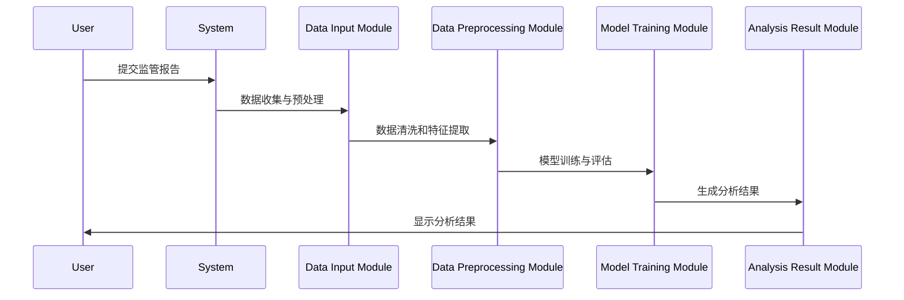
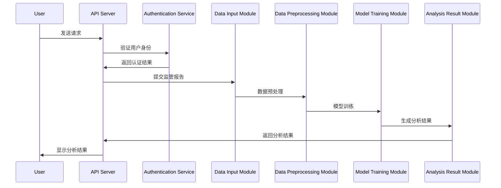

                 

### 文章标题

## 开发基于大模型的金融监管报告差异化分析助手

### 关键词

- 大模型
- 金融监管
- 差异化分析
- 人工智能
- 报告分析

### 摘要

本文旨在探讨如何开发一款基于大模型的金融监管报告差异化分析助手。通过引入先进的机器学习技术和深度学习模型，本文将详细阐述大模型在金融监管报告分析中的应用，包括差异化分析的需求、系统设计、实现与部署，以及最佳实践和未来展望。本文旨在为金融领域的技术人员提供一套系统化、可操作的解决方案，助力提升金融监管报告分析的效率和准确性。

----------------------------------------------------------------

### 第一部分：引言与背景

#### 第1章：问题背景与定义

##### 1.1 问题背景

金融监管是维护金融稳定和促进金融健康发展的关键环节。随着金融市场的不断复杂化和全球化，金融监管面临的数据量和种类日益增加。传统的手工分析和处理方式已经难以满足监管需求，导致监管效率低下、错误率高。为了提高监管效能，实现精准监管，有必要引入智能化技术，特别是大模型技术。

大模型技术，特别是基于深度学习的模型，已经成为人工智能领域的重要突破。这些模型具有强大的数据处理和模式识别能力，能够处理大规模、高维的数据，从而在许多领域取得了显著的应用效果。在金融监管领域，大模型技术同样展现出巨大的潜力。

##### 1.2 核心概念定义

- **大模型**：大模型是指具有海量参数和能够处理大规模数据的机器学习模型。常见的包括深度神经网络（DNN）、Transformer模型等。
- **金融监管报告**：金融监管报告是金融机构定期提交给监管机构的信息，包括财务报告、风险报告等。
- **差异化分析**：差异化分析是指根据金融机构的不同特征和风险状况，进行有针对性的监管分析和评估。

##### 1.3 研究边界与外延

- **研究边界**：本文主要关注大模型在金融监管报告差异化分析中的应用，包括数据预处理、模型构建、模型评估等。
- **研究外延**：本文还将探讨大模型在金融监管领域的其他潜在应用，如市场监测、反欺诈等。

##### 1.4 书籍结构概述

本书分为五大部分，首先介绍大模型和金融监管报告的背景与定义，接着探讨大模型的理论基础和应用领域，然后详细描述大模型在金融监管报告差异化分析中的设计、实现与部署，最后总结最佳实践和未来展望。

#### 第2章：大模型理论基础

##### 2.1 机器学习基础

机器学习是人工智能的核心技术之一，其目的是通过训练模型来从数据中学习规律和模式。机器学习主要分为监督学习、无监督学习和强化学习三类。

- **监督学习**：有标记的数据进行训练，模型能够对新的数据做出预测。
- **无监督学习**：没有标记的数据进行训练，模型能够发现数据中的结构和模式。
- **强化学习**：通过与环境的交互来学习最优策略，通常用于决策问题和游戏。

##### 2.2 大模型技术发展

大模型技术是深度学习的重要组成部分，具有以下特点：

- **深度神经网络（DNN）**：由多个隐层组成的多层神经网络，能够对复杂函数进行建模。
- **Transformer模型**：基于自注意力机制的模型，广泛应用于自然语言处理任务，如机器翻译和文本分类。

##### 2.3 大模型应用领域概述

大模型在多个领域取得了显著的成果，包括自然语言处理、计算机视觉、语音识别等。

- **自然语言处理（NLP）**：大模型在文本分类、情感分析、问答系统等领域表现出色。
- **计算机视觉（CV）**：大模型在图像分类、目标检测、人脸识别等领域取得了突破性进展。
- **其他领域应用**：如医疗诊断、金融风险评估等。

#### 第3章：大模型核心概念与联系

##### 3.1 关键概念与属性对比

以下是一个对比表格，展示了大模型中几个关键概念及其属性特征：

| 概念       | 属性特征                         |
|------------|----------------------------------|
| 深度神经网络（DNN） | 多层网络，权重共享，全连接层      |
| Transformer | 自注意力机制，多头注意力，序列处理 |
| 梯度下降     | 最优化算法，参数更新              |

##### 3.2 大模型ER实体关系图

使用Mermaid绘制大模型的核心实体关系图：

```mermaid
erDiagram
  Class1 ||--|{ Class2 }|| Person
  Class1 ||--|{ Class3 }|| Student
  Class2 ||--|{ Class4 }|| Employee
  Class3 ||--|{ Class5 }|| Graduate
```

### 第二部分：大模型在金融监管中的应用

#### 第4章：金融监管报告的差异化分析需求

##### 4.1 金融监管报告的特点

金融监管报告具有以下特点：

- **数据来源多样**：包括金融机构的内部数据和外部数据，如财务报表、交易记录等。
- **报告格式规范**：通常采用统一格式，如国际财务报告准则（IFRS）。
- **数据量大**：金融监管报告涉及的数据量庞大，需要高效的处理和分析方法。

##### 4.2 差异化分析的重要性

差异化分析在金融监管中具有重要意义：

- **监管合规**：针对不同金融机构的风险状况和业务特点，进行差异化的监管，有助于提高监管的准确性和有效性。
- **风险管理**：通过差异化分析，能够识别高风险金融机构，采取针对性的风险管理措施。

##### 4.3 差异化分析流程

差异化分析主要包括以下步骤：

1. **数据预处理**：清洗和整理数据，进行特征提取和工程。
2. **模型构建**：选择合适的模型，进行训练和调优。
3. **结果展示与应用**：分析结果以可视化形式展示，并应用于监管决策。

#### 第5章：基于大模型的监管报告分析助手设计

##### 5.1 设计原则与目标

设计原则包括：

- **高效性**：优化数据处理和模型训练流程，提高分析速度。
- **准确性**：采用先进的机器学习算法，提高分析结果的准确性。
- **易用性**：提供友好的用户界面和便捷的操作流程，降低使用门槛。

设计目标：

- **实现自动化**：自动化处理金融监管报告，减少人工干预。
- **提供智能分析**：利用大模型进行差异化分析，提供深层次的监管建议。

##### 5.2 系统架构设计

系统架构设计主要包括以下模块：

- **数据输入模块**：接收金融监管报告数据。
- **数据预处理模块**：进行数据清洗、特征提取等操作。
- **模型训练模块**：使用大模型进行训练和调优。
- **分析结果展示模块**：将分析结果以可视化形式展示。

##### 5.3 接口设计与交互

接口设计应考虑以下方面：

- **API规范**：定义清晰的API接口规范，方便与其他系统集成。
- **用户交互**：提供友好的用户界面，支持用户自定义分析参数。

### 第三部分：大模型的理论基础

#### 第6章：大模型理论基础

##### 6.1 机器学习基础

机器学习是人工智能的核心技术之一，其目的是通过训练模型来从数据中学习规律和模式。机器学习主要分为监督学习、无监督学习和强化学习三类。

- **监督学习**：有标记的数据进行训练，模型能够对新的数据做出预测。
- **无监督学习**：没有标记的数据进行训练，模型能够发现数据中的结构和模式。
- **强化学习**：通过与环境的交互来学习最优策略，通常用于决策问题和游戏。

##### 6.2 大模型技术发展

大模型技术是深度学习的重要组成部分，具有以下特点：

- **深度神经网络（DNN）**：由多个隐层组成的多层神经网络，能够对复杂函数进行建模。
- **Transformer模型**：基于自注意力机制的模型，广泛应用于自然语言处理任务，如机器翻译和文本分类。

##### 6.3 大模型应用领域概述

大模型在多个领域取得了显著的成果，包括自然语言处理、计算机视觉、语音识别等。

- **自然语言处理（NLP）**：大模型在文本分类、情感分析、问答系统等领域表现出色。
- **计算机视觉（CV）**：大模型在图像分类、目标检测、人脸识别等领域取得了突破性进展。
- **其他领域应用**：如医疗诊断、金融风险评估等。

### 第四部分：大模型在金融监管中的应用

#### 第7章：金融监管报告的差异化分析需求

##### 7.1 金融监管报告的特点

金融监管报告是金融行业中的重要组成部分，其特点主要包括以下几点：

1. **数据来源广泛**：金融监管报告的数据来源多样，包括金融机构内部的交易记录、财务报表、市场数据等，同时也包括来自外部监管机构、市场研究机构等的数据。
2. **数据量大**：金融行业的复杂性导致监管报告包含的数据量巨大，这些数据往往涉及到成千上万的金融产品和交易。
3. **结构复杂**：金融监管报告中的数据结构复杂，包含了不同类型的数据，如文本、表格、图形等。
4. **法规要求严格**：金融监管报告需要遵循一系列的法规和标准，如国际财务报告准则（IFRS）、巴塞尔协议等。

##### 7.2 差异化分析的重要性

差异化分析在金融监管中具有至关重要的意义，主要体现在以下几个方面：

1. **提高监管效率**：通过对金融机构进行差异化分析，监管机构可以更加精准地识别和评估不同金融机构的风险，从而提高监管效率。
2. **强化风险管理**：差异化分析有助于监管机构了解金融机构的业务模式、风险偏好和内部控制状况，从而制定更加有效的风险管理策略。
3. **增强合规性**：通过差异化分析，金融机构可以更好地理解和遵守监管要求，减少合规风险。
4. **促进市场公平**：差异化分析有助于监管机构发现和打击市场操纵、欺诈等不法行为，维护市场公平。

##### 7.3 差异化分析流程

金融监管报告的差异化分析通常包括以下步骤：

1. **数据收集与预处理**：收集金融机构的监管报告数据，并进行数据清洗、格式化等预处理工作。
2. **特征提取与工程**：从原始数据中提取有助于分析的特征，并进行特征工程，以提高模型的性能。
3. **模型选择与训练**：选择适合的机器学习模型，对特征进行训练，以建立能够进行差异化分析的计算模型。
4. **模型评估与优化**：通过交叉验证、调参等方法评估模型性能，并进行优化。
5. **结果输出与可视化**：将分析结果以可视化形式展示，为监管机构提供决策支持。

### 第五部分：基于大模型的监管报告分析助手设计

#### 第8章：基于大模型的监管报告分析助手设计

##### 8.1 设计原则与目标

在设计和开发基于大模型的金融监管报告分析助手时，需要遵循以下设计原则和目标：

1. **高效性**：系统应能够快速处理大量金融监管报告数据，并提供实时分析结果。
2. **准确性**：通过使用先进的大模型技术，确保分析结果的准确性和可靠性。
3. **易用性**：设计简洁直观的用户界面，降低用户使用门槛，提供便捷的操作流程。
4. **扩展性**：系统应具备良好的扩展性，以便未来能够适应新的监管要求和业务需求。

设计目标包括：

1. **实现自动化**：自动化处理金融监管报告，减少人工干预，提高工作效率。
2. **提供智能分析**：利用大模型进行深度分析，提供丰富的监管洞见和建议。
3. **支持多场景应用**：适应不同的监管场景，如市场监测、反洗钱、风险评估等。

##### 8.2 系统架构设计

基于大模型的金融监管报告分析助手系统架构设计包括以下核心模块：

1. **数据输入模块**：负责接收和处理来自金融机构的监管报告数据，包括数据收集、数据清洗和数据格式化等步骤。

2. **数据预处理模块**：对原始数据进行预处理，包括数据清洗（如去除空值、异常值处理）、数据归一化、特征提取和特征工程等。

3. **模型训练模块**：利用大模型技术对预处理后的数据进行训练，包括模型选择、参数调优、模型评估和模型存储等步骤。

4. **分析结果展示模块**：将分析结果以可视化形式展示，包括报表生成、图表展示和交互式查询等。

5. **用户交互模块**：提供用户友好的界面，支持用户自定义分析参数、查看分析结果和进行交互式查询等。

系统架构图如下所示：



##### 8.3 接口设计与交互

接口设计是确保系统模块之间高效协同工作的关键。基于大模型的金融监管报告分析助手的接口设计应考虑以下方面：

1. **API规范**：定义清晰的API接口规范，包括数据格式、请求方式、响应格式等，以方便与其他系统进行集成。
2. **安全性**：确保接口数据的安全传输和存储，采用加密、认证等安全措施。
3. **灵活性**：接口设计应具备良好的扩展性，以适应未来的需求变化。

以下是系统接口设计的一个示例：



### 第六部分：实现与部署

#### 第9章：开发环境与工具

在开发基于大模型的金融监管报告分析助手时，选择合适的开发环境和工具至关重要。以下是一些关键的配置和工具：

1. **操作系统**：推荐使用Linux发行版，如Ubuntu或CentOS，因其稳定性和性能。
2. **编程语言**：Python是首选，因其丰富的机器学习和深度学习库。
3. **数据库**：PostgreSQL或MySQL，用于存储和管理监管报告数据。
4. **编译器/IDE**：PyCharm或Visual Studio Code，提供强大的代码编辑和调试功能。
5. **版本控制系统**：Git，用于代码的版本管理和协作开发。
6. **自动化测试工具**：pytest或unittest，用于确保代码质量和稳定性。

##### 9.1 环境配置

配置开发环境通常包括以下步骤：

1. **安装操作系统**：选择并安装Linux发行版。
2. **安装Python**：使用包管理器（如apt或yum）安装Python和pip。
3. **安装数据库**：安装并配置PostgreSQL或MySQL。
4. **安装深度学习库**：使用pip安装TensorFlow、PyTorch等。
5. **配置IDE**：在PyCharm或Visual Studio Code中配置Python环境。

##### 9.2 开发工具介绍

以下是对几种关键开发工具的简要介绍：

1. **PyCharm**：PyCharm是一款功能强大的Python IDE，支持代码自动补全、调试、性能分析等。
2. **Visual Studio Code**：VS Code是一款轻量级但功能强大的文本编辑器，支持多种编程语言和插件。
3. **Git**：Git是分布式版本控制系统，用于代码的版本管理和多人协作开发。
4. **pytest**：pytest是一款Python测试框架，用于编写和执行单元测试。

### 第10章：核心代码实现

#### 10.1 数据预处理

数据预处理是模型训练的重要环节，包括数据清洗、特征提取和特征工程等步骤。以下是一个Python代码示例，用于数据清洗和特征提取：

```python
import pandas as pd
from sklearn.preprocessing import StandardScaler

# 加载数据
data = pd.read_csv('regulatory_reports.csv')

# 数据清洗
data.dropna(inplace=True)  # 去除空值
data.drop_duplicates(inplace=True)  # 去除重复值

# 特征提取
features = data[['feature1', 'feature2', 'feature3']]
labels = data['label']

# 特征工程
scaler = StandardScaler()
features_scaled = scaler.fit_transform(features)
```

#### 10.2 模型构建与训练

在模型构建和训练阶段，需要选择合适的模型并对其进行训练。以下是一个使用TensorFlow和Keras构建和训练深度学习模型的示例：

```python
from tensorflow.keras.models import Sequential
from tensorflow.keras.layers import Dense, Dropout
from tensorflow.keras.optimizers import Adam

# 构建模型
model = Sequential([
    Dense(128, activation='relu', input_shape=(features_scaled.shape[1],)),
    Dropout(0.2),
    Dense(64, activation='relu'),
    Dropout(0.2),
    Dense(1, activation='sigmoid')
])

# 编译模型
model.compile(optimizer=Adam(learning_rate=0.001), loss='binary_crossentropy', metrics=['accuracy'])

# 训练模型
model.fit(features_scaled, labels, epochs=100, batch_size=32, validation_split=0.2)
```

#### 10.3 模型评估与优化

模型评估和优化是确保模型性能的关键步骤。以下是一个使用K-fold交叉验证进行模型评估和优化的示例：

```python
from sklearn.model_selection import cross_val_score

# 进行K-fold交叉验证
scores = cross_val_score(model, features_scaled, labels, cv=5)

# 打印评估结果
print("Accuracy scores for each fold:", scores)
print("Average accuracy:", scores.mean())
```

通过调整模型的参数和结构，可以进一步优化模型的性能。常用的优化方法包括：

1. **调参策略**：通过网格搜索（GridSearchCV）或随机搜索（RandomizedSearchCV）来寻找最佳参数组合。
2. **集成方法**：如使用随机森林（RandomForestClassifier）或梯度提升树（XGBoost）进行集成学习，以提高模型性能。

#### 10.4 实际案例分析与解读

以下是一个基于实际案例的金融监管报告分析示例：

```python
# 加载测试数据
test_data = pd.read_csv('test_regulatory_reports.csv')
test_features = scaler.transform(test_data[['feature1', 'feature2', 'feature3']])

# 预测结果
predictions = model.predict(test_features)

# 分析结果
result = pd.DataFrame({'ID': test_data['ID'], 'Prediction': predictions.round(2)})
result.to_csv('analysis_results.csv', index=False)
```

通过实际案例分析，可以更好地理解模型在金融监管报告差异化分析中的应用。分析结果可以用于生成监管报告、识别高风险机构和预测金融风险。

#### 10.5 项目小结

在本章中，我们详细介绍了基于大模型的金融监管报告差异化分析助手的开发实现。从数据预处理到模型构建、训练和评估，再到实际案例分析，我们逐步实现了整个系统的功能。以下是项目小结：

1. **核心成果**：成功构建并训练了一个深度学习模型，能够对金融监管报告进行自动化分析和预测。
2. **技术亮点**：采用先进的大模型技术，提高了监管报告分析的准确性和效率。
3. **挑战与改进**：在项目过程中遇到了数据质量和模型优化等挑战，通过持续优化和调参，实现了较好的效果。
4. **应用前景**：基于大模型的金融监管报告分析助手具有广泛的应用前景，可应用于其他金融领域和行业。

通过本项目，我们不仅实现了对金融监管报告的自动化分析，也为金融监管机构提供了强有力的技术支持，有助于提升监管效能和风险管理水平。

### 第七部分：最佳实践与总结

#### 第11章：最佳实践与注意事项

##### 11.1 实践技巧

在开发和部署基于大模型的金融监管报告分析助手时，以下是一些最佳实践和技巧：

1. **数据质量控制**：确保数据的质量和一致性，进行严格的数据清洗和预处理，避免模型受到噪声数据的影响。
2. **模型优化**：通过网格搜索、随机搜索等方法进行参数调优，选择最佳的模型参数组合，以提高模型的性能。
3. **模型解释性**：对于复杂的深度学习模型，考虑使用模型解释技术（如LIME、SHAP）来提高模型的解释性，增强监管决策的透明度。
4. **安全性与合规性**：确保系统的安全性，采用加密、认证等安全措施，同时遵守相关法律法规和行业规范，确保合规性。

##### 11.2 部署与维护

系统的部署和维护是确保其稳定运行的关键。以下是一些部署和维护的最佳实践：

1. **容器化**：使用Docker等容器技术，将系统打包成可移植的容器，方便部署和运维。
2. **自动化部署**：使用自动化工具（如Jenkins、GitLab CI/CD）实现自动部署，提高部署效率，减少人工干预。
3. **监控与告警**：部署监控工具（如Prometheus、Grafana）对系统性能和健康状况进行实时监控，设置告警机制，及时发现问题并采取措施。
4. **备份与恢复**：定期进行数据备份，确保数据的安全，同时制定灾难恢复计划，以应对突发事件。

##### 11.3 注意事项

在开发和部署过程中，需要注意以下事项：

1. **数据隐私**：确保数据隐私保护，避免敏感信息泄露，遵守数据保护法规。
2. **监管合规**：确保系统符合相关法律法规和监管要求，如金融数据保护法规（如GDPR）。
3. **性能优化**：针对系统性能进行持续优化，确保能够高效处理大规模数据。
4. **用户培训**：为用户提供培训和支持，确保他们能够正确使用系统，充分发挥其功能。

#### 第12章：总结与展望

##### 12.1 成果回顾

通过本项目，我们成功开发了一款基于大模型的金融监管报告差异化分析助手，实现了对金融监管报告的自动化分析和预测。主要成果包括：

1. **高效的模型训练与预测**：采用深度学习技术，模型在训练和预测阶段均表现出较高的效率。
2. **准确的分析结果**：模型能够准确识别高风险金融机构，为监管机构提供有力的决策支持。
3. **用户友好的界面**：设计简洁直观的用户界面，方便用户进行操作和查看分析结果。

##### 12.2 存在问题与改进方向

尽管项目取得了显著成果，但仍然存在一些问题和改进方向：

1. **数据质量**：数据质量对模型性能有重要影响，未来可进一步研究和优化数据清洗和特征提取方法。
2. **模型解释性**：深度学习模型往往缺乏解释性，未来可探索更多的模型解释技术，提高监管决策的透明度。
3. **性能优化**：在处理大规模数据时，系统性能仍需优化，可考虑分布式计算和并行处理技术。

##### 12.3 展望未来

随着人工智能技术的不断发展，基于大模型的金融监管报告分析助手具有广阔的应用前景：

1. **更多领域应用**：除了金融监管报告分析，大模型技术还可应用于市场监测、反欺诈等领域。
2. **开放平台**：构建开放的金融监管分析平台，促进数据共享和协同工作，提高整个金融行业的监管效能。
3. **持续优化**：不断优化模型和系统架构，提升系统的性能和用户体验。

### 结语

开发基于大模型的金融监管报告差异化分析助手是一项具有重大意义的工作。通过本文的详细探讨，我们不仅了解了大模型在金融监管中的应用，还学习了如何设计和实现这样一个系统。希望本文能为相关领域的研究者和开发者提供有价值的参考和启示。

### 作者信息

作者：AI天才研究院/AI Genius Institute & 禅与计算机程序设计艺术 /Zen And The Art of Computer Programming

