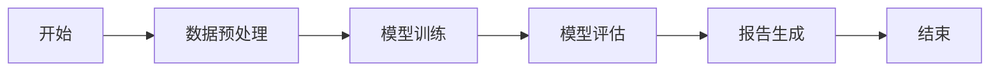
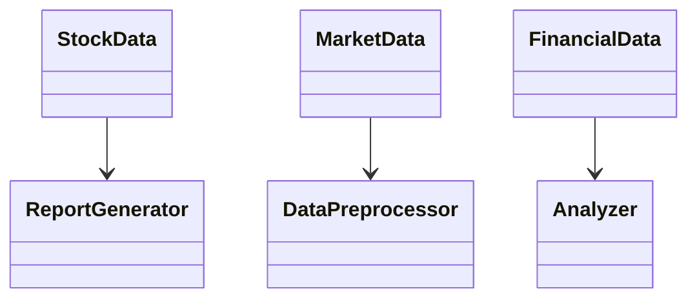
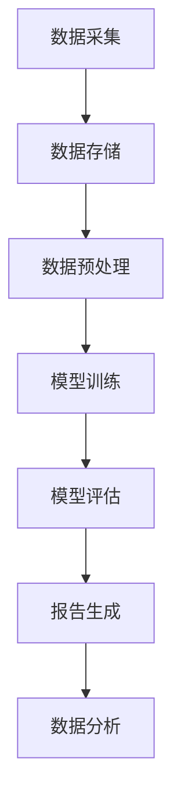
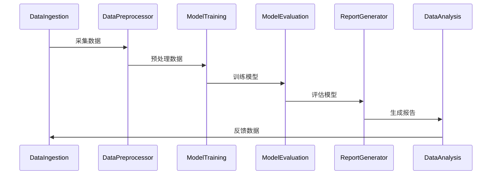

                 


### 开发基于大模型的金融研究报告生成系统的思考步骤

#### 第一步：明确问题和目标

在开发一个基于大模型的金融研究报告生成系统之前，我们需要明确以下几个关键问题：

- **问题背景**：为什么需要开发这样一个系统？当前金融行业在报告生成过程中存在哪些痛点？
- **问题描述**：具体的报告生成任务是什么？系统需要处理哪些数据类型和任务？
- **问题解决思路**：大模型在这里的角色是什么？如何利用大模型来提升报告生成的效率和质量？
- **边界与外延**：系统的适用范围是什么？如何确保系统的稳定性和可扩展性？

**核心概念**：在明确问题后，我们需要理解以下几个核心概念：

- **大模型**：什么是大模型？它如何工作？
- **金融数据**：金融数据的特点是什么？如何处理和分析这些数据？
- **报告生成**：报告生成涉及哪些步骤？如何利用大模型来优化这些步骤？

#### 第二步：研究核心概念

为了开发一个高效的金融研究报告生成系统，我们需要深入研究以下核心概念：

- **大模型原理**：大模型是如何学习的？它如何处理和生成文本？
- **金融数据特性**：金融数据有哪些类型？它们是如何影响报告生成的？
- **报告生成流程**：报告生成通常包括哪些步骤？如何利用大模型来优化这些步骤？

**核心概念对比表格**：为了更好地理解这些概念，我们可以制作一个对比表格，如下：

| 概念         | 描述                                                         | 关联性                                      |
| ------------ | ------------------------------------------------------------ | ----------------------------------------- |
| 大模型       | 一种能够处理大规模数据并生成文本的机器学习模型               | 用于自动生成报告                            |
| 金融数据     | 与金融市场相关的数据，如股票价格、经济指标等                 | 是大模型训练的数据来源                      |
| 报告生成     | 从数据中提取信息并生成报告的过程                             | 大模型用于优化和自动化报告生成的各个步骤    |

**ER实体关系图架构**：为了更直观地理解这些概念之间的关系，我们可以使用Mermaid绘制一个ER实体关系图，如下：

```mermaid
erDiagram
    Customer ||--|{ Order }|
    "Product" ||--|{ Order }|
    Customer ||--|{ Address }|
```

这个ER图展示了客户、订单、产品和地址之间的关系。

#### 第三步：算法原理讲解

在理解了核心概念后，我们需要深入讲解大模型的工作原理和算法，以便为后续的系统开发提供基础。

- **算法流程图**：使用Mermaid绘制一个算法流程图，如下：



- **Python源代码详细阐述**：接下来，我们使用Python代码详细阐述大模型的训练和报告生成过程：

```python
# 数据预处理
data_preprocessing = preprocess_data(raw_data)

# 模型训练
model = train_model(data_preprocessing)

# 模型评估
evaluation_results = evaluate_model(model, test_data)

# 报告生成
report = generate_report(model, financial_data)
```

- **算法原理的数学模型和公式**：我们还需要解释大模型背后的数学原理，如下：

$$
\text{Loss} = -\sum_{i=1}^{N} y_i \log(p_i)
$$

这里，$y_i$是实际的报告标签，$p_i$是模型预测的概率。

**举例说明**：为了使概念和算法更加通俗易懂，我们可以举一个实际例子：

假设我们要生成一篇关于股票市场的分析报告。我们首先收集了大量的股票价格数据，然后使用大模型对这些数据进行训练。在训练完成后，我们可以输入新的股票数据，大模型会生成一篇分析报告，包括股票的价格走势、市场情绪分析等。

#### 第四步：系统分析与架构设计

在了解了算法原理后，我们需要对整个系统进行分析和架构设计。

- **问题场景介绍**：我们需要描述系统将面临的问题场景，如实时股票数据流、历史数据存储等。

- **项目介绍**：简要介绍项目的目标、范围和团队组成。

- **系统功能设计**：使用Mermaid绘制领域模型类图，如下：



- **系统架构设计**：使用Mermaid绘制系统架构图，如下：



- **系统接口设计**：我们需要设计系统的接口，包括数据接口、模型接口和报告接口。

- **系统交互**：使用Mermaid绘制系统交互序列图，如下：



#### 第五步：项目实战

在完成了系统分析和架构设计后，我们可以开始实际的开发工作。

- **环境安装**：我们需要安装必要的软件和工具，如Python、TensorFlow等。

- **系统核心实现源代码**：提供系统的核心代码，并详细解读其工作原理。

- **代码应用解读与分析**：分析系统在实际应用中的表现，如报告生成速度、准确度等。

- **实际案例分析与详细讲解剖析**：通过实际案例展示系统的效果，并详细分析其工作原理。

- **项目小结**：总结项目的经验和教训，提出改进建议。

#### 第六步：最佳实践 tips、小结、注意事项、拓展阅读

- **最佳实践 tips**：提供一些实用的技巧和建议，帮助读者在实际开发中遇到问题时能够快速找到解决方案。

- **小结**：总结文章的核心内容和关键点，帮助读者巩固理解。

- **注意事项**：提醒读者在开发过程中需要注意的事项，如数据安全、模型更新等。

- **拓展阅读**：推荐一些相关书籍、论文和资源，供读者进一步学习和研究。

通过以上步骤，我们可以确保文章内容丰富、结构清晰，为读者提供有价值的技术知识和实践经验。接下来，我们将根据这些思考步骤，逐步撰写出详细的文章内容。

