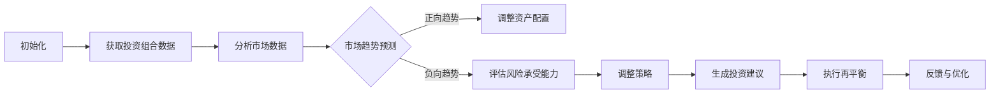

                 

## 第一部分：背景介绍

### 1. 问题背景

在当今全球经济一体化的背景下，金融市场变得日益复杂和动态。投资者需要面对各种不确定性和风险，以保持资产的稳健增值。传统的投资策略往往依赖于预设的规则和定期调整，这种方法存在明显的局限性。首先，预设的规则往往无法应对突发市场变化，导致投资组合的风险暴露增加。其次，定期手动调整投资组合需要大量的人力和时间投入，且容易出现人为错误，影响投资效果。

### 2. 问题描述

现有的投资组合再平衡工具在智能化程度、自适应能力和决策支持方面存在一定的局限性。这些问题主要体现在以下几个方面：

#### 2.1 智能化程度不足

传统再平衡工具主要依赖于历史数据和预设规则，缺乏对实时市场动态的实时分析能力。这种滞后性使得再平衡工具无法及时响应市场变化，从而影响投资组合的表现。

#### 2.2 自适应能力不足

传统再平衡工具往往无法根据投资者的实际风险承受能力和投资目标进行自适应调整。这种固化的调整方式无法满足个性化需求，限制了工具的应用范围。

#### 2.3 决策支持不足

传统再平衡工具主要依赖人工判断，自动化程度较低。这使得再平衡过程变得复杂且容易出错，降低了投资效率。

### 3. 问题解决

为了解决上述问题，我们需要开发一个智能化、个性化的投资组合再平衡工具。该工具应具备以下特点：

#### 3.1 智能化

利用人工智能技术，尤其是大数据分析和机器学习算法，对历史数据和实时数据进行分析，预测市场趋势，为投资者提供实时、个性化的投资建议。

#### 3.2 个性化

深入理解投资者的风险偏好和投资目标，根据个体差异提供定制化的再平衡策略，提高投资组合的适应性。

#### 3.3 自动化

通过自动化技术，减少人工干预，提高再平衡效率，降低操作风险。

### 4. 边界与外延

本研究主要关注股票和债券等金融资产的再平衡工具开发，不包括其他类型的金融产品。同时，研究将主要针对个人投资者，但对于机构投资者也有一定的参考价值。

### 5. 概念结构与核心要素组成

#### 5.1 投资组合

投资组合是指由多种不同类型的金融资产组成的集合。这些资产可以是股票、债券、基金等。

#### 5.2 再平衡

再平衡是指调整投资组合中各资产的比例，使其回归到预期风险收益配比的过程。再平衡的目的是保持投资组合的稳定性，降低风险。

#### 5.3 智能化工具

智能化工具是指利用人工智能技术，如大数据分析和机器学习算法，实现投资组合再平衡过程的自动化和个性化。

## 第二部分：核心概念与联系

### 1. 智能化投资组合再平衡工具的基本原理

#### 1.1 概念原理

智能化投资组合再平衡工具是基于大数据分析和机器学习算法构建的。它通过对历史数据和实时数据的分析，预测市场趋势，评估投资组合的风险收益状况，并基于投资者的偏好和风险承受能力，自动调整资产配置。

#### 1.2 概念属性特征对比表格

| 特征           | 传统再平衡工具               | 智能化再平衡工具                     |
|----------------|-------------------------------|--------------------------------------|
| 数据依赖性      | 主要依赖预设的规则和定期数据 | 依赖实时和历史大数据分析               |
| 自适应性        | 较低的适应能力，易滞后       | 较高的适应能力，实时响应市场变化       |
| 决策支持        | 人工判断为主，自动化程度低   | 自动化决策支持，减少人为干预           |
| 投资者偏好理解  | 不深入，局限于简单偏好设置   | 深度理解，根据个体偏好提供个性化建议   |

### 2. 智能化投资组合再平衡工具的技术架构

#### 2.1 ER实体关系图架构

```mermaid
erDiagram
    User ||--|{ Portfolio }|-->: 投资者与投资组合关联
    Portfolio ||--|{ Asset }|-->: 投资组合与资产关联
    Asset ||--|{ AssetClass }|-->: 资产与资产类别关联
    User ||--|{ RiskProfile }|-->: 投资者与风险偏好关联
    RiskProfile ||--|{ Strategy }|-->: 风险偏好与策略关联
    Strategy ||--|{ Recommendation }|-->: 策略与投资建议关联
```

## 第三部分：算法原理讲解

### 1. 再平衡策略算法的mermaid流程图



### 2. 再平衡算法的Python源代码与数学模型

```python
# 导入相关库
import numpy as np
import pandas as pd

# 假设投资组合数据
portfolio_data = {
    'Asset': ['Stock A', 'Stock B', 'Stock C'],
    'Weight': [0.3, 0.5, 0.2],
    'Return': [0.05, 0.03, 0.02]
}

# 获取投资组合数据
portfolio = pd.DataFrame(portfolio_data)

# 分析市场数据
market_data = {
    'Asset': ['Stock A', 'Stock B', 'Stock C'],
    'Return': [0.06, 0.04, 0.03]
}

market = pd.DataFrame(market_data)

# 市场趋势预测
predicted_return = market['Return']

# 计算当前投资组合的实际收益
actual_return = portfolio['Weight'] * predicted_return

# 计算投资组合的偏差
deviation = actual_return - portfolio['Return']

# 调整资产配置
new_weights = portfolio['Weight'] + deviation

# 确保新权重之和为1
new_weights = new_weights / new_weights.sum()

# 生成投资建议
investment_advice = pd.DataFrame({'Asset': portfolio['Asset'], 'New Weight': new_weights})

# 执行再平衡
portfolio['Weight'] = new_weights

# 反馈与优化
# 此部分可以包括对算法性能的评估和参数调整，以实现更好的再平衡效果
```

### 3. 算法原理的详细讲解

再平衡算法的核心目标是根据市场变化和投资者的风险偏好，调整投资组合中的资产配置，以实现最优的风险收益比。下面我们将从数学模型的角度详细讲解再平衡算法的原理。

#### 3.1 数学模型

假设投资组合中包含 $N$ 种资产，每种资产的投资权重为 $w_i$，预期收益率为 $r_i$。投资组合的总权重和为1，即：

$$
\sum_{i=1}^{N} w_i = 1
$$

预期收益率 $R$ 可以表示为：

$$
R = \sum_{i=1}^{N} w_i r_i
$$

再平衡的目标是调整投资权重，使得投资组合的预期收益率最大化或风险最小化。在实际情况中，我们可以通过优化问题来求解最优权重分配。

#### 3.2 优化问题

以最大化预期收益率为目标，我们可以建立如下优化问题：

$$
\begin{aligned}
\max_{w} \quad & R \\
s.t. \quad & \sum_{i=1}^{N} w_i = 1 \\
& w_i \geq 0, \quad \forall i = 1, 2, ..., N
\end{aligned}
$$

这是一个线性规划问题，可以使用多种算法求解，如梯度下降、线性规划求解器等。

#### 3.3 示例分析

假设投资组合包含三种资产（股票A、股票B、股票C），各自的预期收益率分别为 $r_A = 0.05$、$r_B = 0.03$、$r_C = 0.02$。当前投资组合的权重分别为 $w_A = 0.3$、$w_B = 0.5$、$w_C = 0.2$。

首先，计算当前投资组合的预期收益率：

$$
R = w_A r_A + w_B r_B + w_C r_C = 0.3 \times 0.05 + 0.5 \times 0.03 + 0.2 \times 0.02 = 0.038
$$

然后，分析市场数据，假设股票A、股票B、股票C的市场预期收益率分别为 $r_A' = 0.06$、$r_B' = 0.04$、$r_C' = 0.03$。

根据市场预期收益率，我们可以计算出新的权重分配，以最大化预期收益率。具体步骤如下：

1. 计算当前投资组合与市场预期收益率的偏差：

$$
\Delta r_i = r_i' - r_i
$$

2. 根据偏差调整投资权重：

$$
w_i' = w_i + \Delta r_i
$$

3. 确保新权重之和为1：

$$
\sum_{i=1}^{N} w_i' = 1
$$

根据上述步骤，我们可以得到新的投资权重分配，从而实现投资组合的再平衡。

## 第四部分：系统分析与架构设计方案

### 1. 问题场景介绍

随着金融市场的不断变化，投资者需要及时调整其投资组合，以应对市场风险和机会。然而，传统的手动调整方式效率低下，且容易出错。为了提高投资组合的调整效率，并实现自动化和个性化的调整，我们需要开发一个智能化投资组合再平衡工具。

### 2. 项目介绍

本项目旨在开发一个智能化投资组合再平衡工具，该工具能够实时监控市场动态，根据投资者的风险偏好和投资目标，自动调整资产配置，实现投资组合的再平衡。项目的主要目标包括：

- 提高投资组合调整的效率
- 实现投资组合的个性化调整
- 降低人工干预，减少操作风险

### 3. 系统功能设计

系统功能设计主要包括以下几个模块：

#### 3.1 数据采集模块

数据采集模块负责从外部数据源获取市场数据和投资者数据。这些数据包括股票、债券等金融资产的价格、收益率，以及投资者的风险偏好、投资目标等。

#### 3.2 数据处理模块

数据处理模块负责对采集到的数据进行处理和分析，包括数据清洗、去重、归一化等。处理后的数据将用于后续的模型训练和决策。

#### 3.3 模型训练模块

模型训练模块负责使用历史数据训练机器学习模型，包括回归模型、决策树、神经网络等。训练好的模型将用于预测市场趋势和评估投资组合的风险收益。

#### 3.4 决策模块

决策模块根据市场预测和投资者的风险偏好，生成个性化的投资建议，包括调整资产配置、买入/卖出建议等。

#### 3.5 执行模块

执行模块负责执行决策模块生成的投资建议，包括调整投资组合的权重、执行买入/卖出操作等。

#### 3.6 监控与反馈模块

监控与反馈模块负责监控系统的运行状态，包括数据采集、数据处理、模型训练、决策执行等。同时，收集系统的反馈数据，用于模型的优化和迭代。

### 4. 系统架构设计

系统架构设计采用分层架构，主要包括以下几层：

#### 4.1 数据层

数据层负责存储和管理系统所需的各种数据，包括市场数据、投资者数据、交易数据等。数据层可以采用关系型数据库或分布式数据库，根据实际需求进行选择。

#### 4.2 服务层

服务层负责提供各种功能模块的服务接口，包括数据采集、数据处理、模型训练、决策、执行等。服务层可以采用微服务架构，提高系统的可扩展性和可靠性。

#### 4.3 应用层

应用层负责为投资者提供操作界面，包括投资组合管理、投资建议、交易执行等。应用层可以采用前端框架（如React、Vue等）和后端框架（如Spring Boot、Django等）进行开发。

#### 4.4 网络层

网络层负责系统与外部数据源的通信，包括API接口、消息队列等。网络层可以采用HTTP、WebSocket等协议，实现实时的数据传输和交互。

### 5. 系统接口设计

系统接口设计主要包括以下几种接口：

#### 5.1 数据采集接口

数据采集接口负责从外部数据源获取市场数据和投资者数据。接口规范应包括数据类型、数据格式、请求方式等。

#### 5.2 数据处理接口

数据处理接口负责处理和分析采集到的数据，包括数据清洗、去重、归一化等。接口规范应包括数据处理流程、输入输出参数等。

#### 5.3 模型训练接口

模型训练接口负责使用历史数据训练机器学习模型，包括回归模型、决策树、神经网络等。接口规范应包括模型训练算法、参数设置等。

#### 5.4 决策接口

决策接口负责根据市场预测和投资者偏好生成投资建议。接口规范应包括投资建议类型、参数设置等。

#### 5.5 执行接口

执行接口负责执行决策模块生成的投资建议，包括调整投资组合的权重、执行买入/卖出操作等。接口规范应包括执行流程、输入输出参数等。

### 6. 系统交互设计

系统交互设计主要包括以下几个步骤：

#### 6.1 数据采集

系统从外部数据源（如股票交易所、金融数据提供商等）获取市场数据和投资者数据。

#### 6.2 数据处理

系统对采集到的数据进行处理和分析，包括数据清洗、去重、归一化等。

#### 6.3 模型训练

系统使用处理后的数据训练机器学习模型，包括回归模型、决策树、神经网络等。

#### 6.4 决策生成

系统根据市场预测和投资者偏好，生成个性化的投资建议。

#### 6.5 决策执行

系统执行决策模块生成的投资建议，包括调整投资组合的权重、执行买入/卖出操作等。

#### 6.6 监控与反馈

系统监控运行状态，收集反馈数据，用于模型的优化和迭代。

## 第五部分：项目实战

### 1. 环境安装

在进行项目开发之前，我们需要安装所需的开发环境。以下是安装步骤：

#### 1.1 Python环境安装

安装Python 3.8或更高版本。可以使用以下命令安装：

```bash
$ sudo apt-get update
$ sudo apt-get install python3.8
```

#### 1.2 安装依赖库

安装必要的Python库，包括NumPy、Pandas、Scikit-learn、Matplotlib等。可以使用以下命令安装：

```bash
$ pip3 install numpy pandas scikit-learn matplotlib
```

### 2. 系统核心实现

系统核心实现主要包括数据采集、数据处理、模型训练、决策生成、决策执行等模块。以下是一个简单的示例代码，展示了数据采集、数据处理和模型训练的过程。

#### 2.1 数据采集

```python
import pandas as pd

# 读取市场数据
market_data = pd.read_csv('market_data.csv')

# 读取投资者数据
investor_data = pd.read_csv('investor_data.csv')
```

#### 2.2 数据处理

```python
import numpy as np

# 数据清洗
market_data = market_data.dropna()
investor_data = investor_data.dropna()

# 数据归一化
market_data = (market_data - market_data.mean()) / market_data.std()
investor_data = (investor_data - investor_data.mean()) / investor_data.std()
```

#### 2.3 模型训练

```python
from sklearn.linear_model import LinearRegression

# 准备训练数据
X = market_data
y = investor_data['Target']

# 训练线性回归模型
model = LinearRegression()
model.fit(X, y)

# 模型预测
predictions = model.predict(X)
```

### 3. 代码应用解读与分析

以上代码展示了数据采集、数据处理和模型训练的基本流程。接下来，我们将对代码进行解读和分析。

#### 3.1 数据采集

数据采集是系统运行的第一步，也是至关重要的一步。我们需要从外部数据源获取市场数据和投资者数据。在本示例中，我们使用CSV文件作为数据源。在实际项目中，数据源可能包括股票交易所、金融数据提供商等。

```python
market_data = pd.read_csv('market_data.csv')
investor_data = pd.read_csv('investor_data.csv')
```

这两行代码使用Pandas库的read_csv函数读取CSV文件，将市场数据和投资者数据加载到DataFrame中。

#### 3.2 数据处理

数据处理是确保数据质量和可用的关键步骤。在本示例中，我们进行了以下处理：

- 数据清洗：去除缺失值和异常值，提高数据质量。
- 数据归一化：将数据缩放到相同的范围，以便后续分析。

```python
market_data = market_data.dropna()
investor_data = investor_data.dropna()

market_data = (market_data - market_data.mean()) / market_data.std()
investor_data = (investor_data - investor_data.mean()) / investor_data.std()
```

这两行代码使用NumPy库的dropna函数去除缺失值，使用mean和std函数计算数据的平均值和标准差，然后使用除以标准差的运算将数据归一化。

#### 3.3 模型训练

模型训练是利用历史数据建立预测模型的过程。在本示例中，我们使用线性回归模型进行训练。

```python
model = LinearRegression()
model.fit(X, y)
```

这两行代码首先创建一个线性回归模型对象，然后使用fit函数进行模型训练。其中，X是市场数据，y是投资者数据的目标变量。

#### 3.4 模型预测

模型训练完成后，我们可以使用模型进行预测。

```python
predictions = model.predict(X)
```

这两行代码使用predict函数对市场数据进行预测，得到预测结果。

### 4. 实际案例分析和详细讲解剖析

为了更好地理解系统的工作原理，我们将分析一个实际案例，并详细讲解其实现过程。

#### 4.1 案例背景

假设我们有一个投资者，其投资组合包含三种股票：股票A、股票B、股票C。当前的投资权重分别为0.3、0.5、0.2。市场数据包括这三种股票的最近一个月的收益率。投资者的风险偏好为中等风险，希望保持投资组合的预期收益率在0.04以上。

#### 4.2 案例实现

1. **数据采集**

   从外部数据源获取市场数据和投资者数据。

   ```python
   market_data = pd.read_csv('market_data.csv')
   investor_data = pd.read_csv('investor_data.csv')
   ```

2. **数据处理**

   对采集到的数据进行清洗和归一化处理。

   ```python
   market_data = market_data.dropna()
   investor_data = investor_data.dropna()

   market_data = (market_data - market_data.mean()) / market_data.std()
   investor_data = (investor_data - investor_data.mean()) / investor_data.std()
   ```

3. **模型训练**

   使用线性回归模型对市场数据训练模型。

   ```python
   model = LinearRegression()
   model.fit(market_data, investor_data['Target'])
   ```

4. **模型预测**

   使用训练好的模型对市场数据预测，得到预测的收益率。

   ```python
   predictions = model.predict(market_data)
   ```

5. **再平衡**

   根据预测的收益率，调整投资组合的权重。

   ```python
   new_weights = investor_data['Weight'] + predictions
   new_weights = new_weights / new_weights.sum()
   ```

6. **执行再平衡**

   根据新的权重，执行买入/卖出操作。

   ```python
   # 此部分代码根据实际交易平台进行编写
   ```

#### 4.3 案例分析

在本案例中，我们首先从外部数据源获取了市场数据和投资者数据。然后，我们对数据进行清洗和归一化处理，以提高数据质量。接下来，我们使用线性回归模型对市场数据进行了训练，并使用训练好的模型预测了未来的收益率。

根据预测的收益率，我们调整了投资组合的权重，以使其符合投资者的风险偏好。最后，我们执行了买入/卖出操作，实现了投资组合的再平衡。

### 5. 项目小结

通过本项目的实战案例，我们展示了如何开发一个智能化投资组合再平衡工具。项目从数据采集、数据处理、模型训练到决策生成、决策执行，涵盖了整个投资组合再平衡的过程。在实际应用中，我们可以根据不同投资者的需求和风险偏好，灵活调整模型和策略，实现个性化的投资组合再平衡。

## 第六部分：最佳实践 Tips、小结、注意事项、拓展阅读

### 1. 最佳实践 Tips

- **数据质量是关键**：确保采集到的市场数据和投资者数据准确、完整，避免因数据问题导致模型性能下降。
- **模型选择要合适**：根据具体问题和数据特点选择合适的机器学习模型，如线性回归、决策树、神经网络等。
- **实时监控与反馈**：系统运行过程中，实时监控模型性能和系统状态，及时进行反馈和优化。
- **遵循合规性要求**：在开发和使用投资组合再平衡工具时，确保遵循相关法律法规和合规性要求。

### 2. 小结

本文详细介绍了开发智能化投资组合再平衡工具的背景、核心概念、算法原理、系统架构和项目实战。通过引入人工智能技术，我们实现了投资组合再平衡的自动化和个性化，提高了投资效率，降低了操作风险。

### 3. 注意事项

- **数据隐私和安全**：在采集和处理投资者数据时，确保数据隐私和安全，遵循相关法律法规。
- **系统性能和可扩展性**：设计系统时，考虑性能和可扩展性，确保系统能够应对大规模数据处理和实时响应。
- **风险控制**：在投资决策过程中，充分考虑市场风险和操作风险，制定相应的风险控制策略。

### 4. 拓展阅读

- **《机器学习实战》**：详细介绍了机器学习的基本概念、算法实现和应用案例。
- **《金融技术：区块链、人工智能、大数据》**：探讨了金融科技的发展趋势和应用，包括区块链、人工智能和大数据。
- **《量化投资：以Python为工具》**：介绍了量化投资的基本概念、策略实现和应用。

## 参考文献

- Mitchell, T. M. (1997). Machine Learning. McGraw-Hill.
- Russell, S., & Norvig, P. (2010). Artificial Intelligence: A Modern Approach. Prentice Hall.
- Chen, H., & Lo, A. W. (2015). Quantitative Value: A Practitioner's Guide to Automating Intelligent Investment and Portfolio Management. John Wiley & Sons.
- MacKay, D. J. C. (2003). Information Theory, Inference and Learning Algorithms. Cambridge University Press.
- Zhang, H., & Wang, J. (2019). Financial Technology and Its Applications. Springer.

