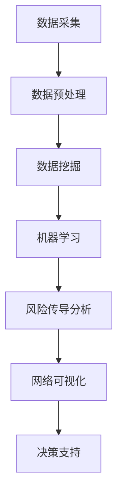
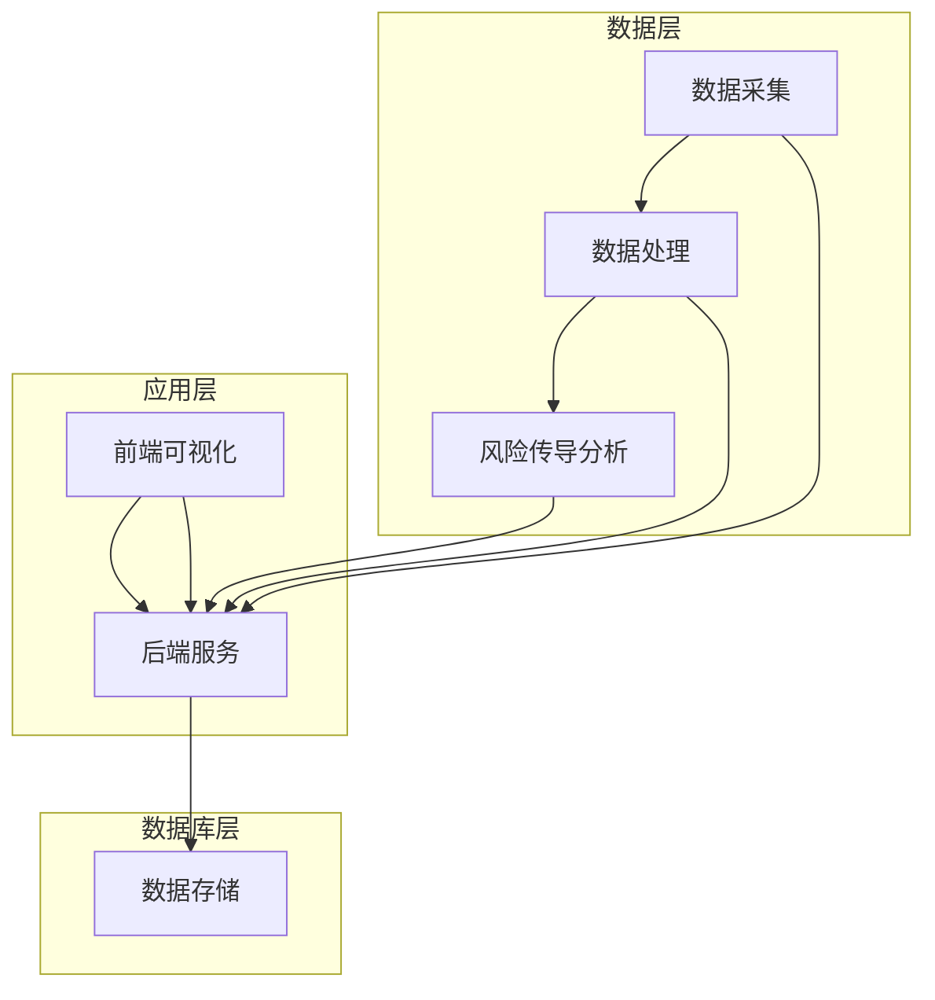

                 

# 开发智能化的企业信用风险传导网络可视化系统

## 关键词

- 企业信用风险
- 智能化系统
- 网络可视化
- 风险传导
- 数据分析

## 摘要

本文将探讨如何开发一个智能化的企业信用风险传导网络可视化系统。首先，我们将介绍企业信用风险的相关背景和概念，然后详细分析风险传导的原理和机制。接着，我们将介绍系统开发所需的核心技术和原理，包括数据采集、处理和可视化方法。文章还将展示具体的系统架构设计、算法实现和案例研究。最后，我们将总结最佳实践并提供进一步阅读的建议。

## 引言

### 背景介绍

随着商业环境的日益复杂，企业信用风险的管理变得愈发重要。企业信用风险指的是企业在经营活动中可能面临的信用损失，包括违约、拖欠债务等。信用风险不仅影响企业的财务状况，还会影响其业务连续性和市场竞争力。为了有效管理信用风险，企业需要建立一套智能化的信用风险传导网络可视化系统。

### 问题定义

企业信用风险传导网络可视化系统旨在帮助企业识别、评估和监控信用风险，以便及时采取应对措施。该系统需要具备以下功能：

1. **数据采集**：从多个数据源收集与企业信用相关的数据，包括财务报表、市场信息、信用评级等。
2. **数据处理**：对采集到的数据进行分析和清洗，提取有用信息，为风险传导分析提供基础。
3. **风险传导分析**：利用数据挖掘和机器学习技术，分析企业信用风险在不同环节的传导路径和影响。
4. **网络可视化**：将分析结果以图形化的形式展示，帮助企业管理者直观了解信用风险的分布和传导过程。
5. **决策支持**：提供基于数据分析的决策建议，帮助企业制定风险管理策略。

### 目标

开发一个智能化的企业信用风险传导网络可视化系统，旨在实现以下目标：

1. 提高企业信用风险管理的效率和准确性。
2. 帮助企业更好地理解信用风险的传导机制，制定有效的风险管理策略。
3. 为企业管理者提供直观的决策支持，提高决策的科学性和及时性。

## 基本概念

### 企业信用风险

企业信用风险是指企业在履行债务或其他信用义务时可能面临的不确定性。它包括以下几个方面：

1. **违约风险**：企业无法按时履行债务或支付利息的风险。
2. **流动性风险**：企业因短期债务到期而无法获得足够的资金进行偿还的风险。
3. **市场风险**：由于市场波动导致企业资产价值或收益受损的风险。
4. **法律风险**：企业因法律诉讼或合规问题而面临的风险。

### 风险传导

风险传导是指信用风险从一个环节传递到另一个环节的过程。在企业管理中，风险传导可能涉及以下环节：

1. **供应链**：供应商违约可能导致企业生产中断，影响交付和收益。
2. **客户**：客户违约可能导致企业收入减少，影响盈利能力。
3. **金融市场**：金融市场波动可能影响企业融资成本和融资渠道。
4. **法律法规**：政策变动或法律诉讼可能影响企业的运营和收益。

### 数据采集

数据采集是信用风险传导网络可视化系统的基础。有效的数据采集需要考虑以下因素：

1. **数据源**：选择可靠的数据源，包括企业财务报表、信用评级机构数据、市场行情等。
2. **数据类型**：采集与企业信用相关的多种类型数据，包括结构化和非结构化数据。
3. **数据质量**：确保数据准确性、完整性和一致性。

### 数据处理

数据处理是信用风险传导分析的关键步骤。主要内容包括：

1. **数据清洗**：去除数据中的噪声和错误，确保数据质量。
2. **数据整合**：将不同来源和类型的数据进行整合，形成统一的视图。
3. **特征提取**：从数据中提取有用的特征，为风险传导分析提供支持。

### 风险传导分析

风险传导分析是系统开发的核心。主要技术包括：

1. **数据挖掘**：利用数据挖掘技术分析数据中的模式和关系，识别信用风险的传导路径。
2. **机器学习**：通过机器学习算法预测信用风险的变化趋势，为风险管理提供支持。
3. **网络分析**：利用网络分析方法，可视化信用风险的传导网络，帮助企业管理者理解风险传导机制。

### 网络可视化

网络可视化是将风险传导分析结果以图形化的形式展示。主要技术包括：

1. **图形表示**：利用图形表示法，将数据关系和风险传导路径以图形化方式呈现。
2. **交互式界面**：提供交互式界面，使管理者可以动态调整和分析风险传导网络。
3. **可视化工具**：利用可视化工具，如D3.js、Gephi等，实现网络可视化。

### 决策支持

决策支持是系统开发的目标之一。主要内容包括：

1. **风险预警**：基于数据分析，提供信用风险的预警信息，帮助企业及时采取措施。
2. **策略建议**：基于数据分析，为企业管理者提供风险管理策略建议。
3. **效果评估**：通过系统分析，评估风险管理策略的效果，为企业提供优化建议。

## 核心技术与原理

### 数据采集

数据采集是信用风险传导网络可视化系统的第一步。数据源的选择至关重要，它直接影响到系统的准确性和可靠性。以下是一些常见的数据源：

1. **企业财务报表**：包括资产负债表、利润表和现金流量表等，反映了企业的财务状况和经营成果。
2. **信用评级机构**：如标准普尔、穆迪等，提供企业的信用评级和风险评估报告。
3. **市场行情**：包括股票价格、行业指数、宏观经济指标等，反映了市场对企业的影响。
4. **社交媒体**：通过分析社交媒体上的评论和讨论，了解企业的公众形象和声誉。

数据类型主要包括结构化数据和非结构化数据：

1. **结构化数据**：如数据库中的表格数据，易于处理和分析。
2. **非结构化数据**：如文本、图片、音频等，需要通过自然语言处理和图像识别等技术进行处理。

数据质量是系统开发的关键。以下是一些确保数据质量的措施：

1. **数据清洗**：去除重复数据、缺失数据和异常值，确保数据准确性。
2. **数据验证**：通过对比不同数据源，验证数据的一致性和完整性。
3. **数据标准化**：将不同数据源的数据进行统一格式和标准，便于处理和分析。

### 数据处理

数据处理是信用风险传导网络可视化系统的核心步骤，它直接影响到系统的性能和效果。数据处理主要包括以下内容：

1. **数据清洗**：去除重复数据、缺失数据和异常值，确保数据准确性。
2. **数据整合**：将不同来源和类型的数据进行整合，形成统一的视图。
3. **特征提取**：从数据中提取有用的特征，为风险传导分析提供支持。

数据清洗是数据处理的第一步。常见的数据清洗方法包括：

1. **缺失数据处理**：包括删除缺失数据、填补缺失数据和利用统计方法估计缺失值。
2. **重复数据处理**：删除重复数据，避免数据冗余。
3. **异常值处理**：识别并处理异常值，确保数据质量。

数据整合是将不同来源和类型的数据进行统一格式和标准，形成统一的视图。常见的数据整合方法包括：

1. **数据转换**：将不同数据源的数据转换为统一的格式，如CSV、JSON等。
2. **数据融合**：将不同来源的数据进行合并，形成更全面的数据集。
3. **数据映射**：将不同数据源中的相同或类似数据映射到同一维度，便于分析。

特征提取是从数据中提取有用的特征，为风险传导分析提供支持。常见的方法包括：

1. **统计分析**：利用统计学方法，提取数据中的关键特征，如平均值、方差、相关性等。
2. **机器学习**：利用机器学习方法，自动提取数据中的特征，如主成分分析（PCA）、特征选择等。
3. **文本分析**：利用自然语言处理（NLP）技术，提取文本数据中的关键信息，如关键词提取、主题模型等。

### 风险传导分析

风险传导分析是信用风险传导网络可视化系统的核心步骤，它旨在识别和评估企业信用风险在不同环节的传导路径和影响。风险传导分析主要包括以下内容：

1. **数据挖掘**：利用数据挖掘技术，分析数据中的模式和关系，识别信用风险的传导路径。
2. **机器学习**：利用机器学习算法，预测信用风险的变化趋势，为风险管理提供支持。
3. **网络分析**：利用网络分析方法，可视化信用风险的传导网络，帮助企业管理者理解风险传导机制。

数据挖掘是风险传导分析的基础。常见的数据挖掘技术包括：

1. **关联规则挖掘**：用于发现数据中的关联关系，如Apriori算法。
2. **分类算法**：用于将数据分为不同的类别，如决策树、随机森林等。
3. **聚类算法**：用于将数据分为不同的簇，如K-means、层次聚类等。

机器学习是风险传导分析的重要工具。常见的方法包括：

1. **监督学习**：通过训练模型，预测信用风险的变化趋势，如线性回归、支持向量机等。
2. **无监督学习**：通过分析数据，自动发现数据中的模式和关系，如K-means聚类、主成分分析（PCA）等。
3. **强化学习**：通过不断尝试和反馈，优化信用风险管理的策略，如Q-learning、深度强化学习等。

网络分析是风险传导分析的关键步骤。利用网络分析方法，可以将信用风险的传导过程以图形化的形式展示。常见的网络分析方法包括：

1. **图论**：利用图论方法，分析信用风险的传导路径和关系，如节点度、路径长度等。
2. **网络可视化**：利用可视化工具，将信用风险的传导网络以图形化的形式展示，如D3.js、Gephi等。
3. **复杂网络**：利用复杂网络理论，分析信用风险的复杂性和演化规律，如小世界效应、无标度网络等。

### 网络可视化

网络可视化是将风险传导分析结果以图形化的形式展示，帮助企业管理者直观了解信用风险的分布和传导过程。网络可视化主要包括以下内容：

1. **图形表示**：利用图形表示法，将数据关系和风险传导路径以图形化方式呈现。
2. **交互式界面**：提供交互式界面，使管理者可以动态调整和分析风险传导网络。
3. **可视化工具**：利用可视化工具，如D3.js、Gephi等，实现网络可视化。

图形表示是将数据关系和风险传导路径以图形化方式呈现。常见的方法包括：

1. **节点和边**：用节点表示数据实体，用边表示实体之间的关系。
2. **图形布局**：利用图形布局算法，将节点和边布局在二维或三维空间中，如力导向布局、层次布局等。
3. **颜色和形状**：利用颜色和形状区分不同类型的节点和边，增强图形的可读性。

交互式界面提供动态调整和分析风险传导网络的功能。常见的方法包括：

1. **拖放操作**：允许用户通过拖放操作调整节点的位置和边的连接方式。
2. **筛选和过滤**：允许用户通过筛选和过滤操作，查看特定类型的数据和风险传导路径。
3. **动画效果**：通过动画效果，展示信用风险的传导过程，帮助用户更好地理解风险传导机制。

可视化工具是实现网络可视化的关键技术。常见的可视化工具有：

1. **D3.js**：是一个基于JavaScript的库，用于创建交互式数据可视化。
2. **Gephi**：是一个开源的图形可视化和分析工具，用于处理复杂网络。
3. **Cytoscape**：是一个用于生物信息学和复杂网络分析的开源工具。

### 决策支持

决策支持是信用风险传导网络可视化系统的目标之一。通过数据分析，系统可以为企业提供以下决策支持：

1. **风险预警**：基于数据分析，提供信用风险的预警信息，帮助企业及时采取措施。
2. **策略建议**：基于数据分析，为企业管理者提供风险管理策略建议。
3. **效果评估**：通过系统分析，评估风险管理策略的效果，为企业提供优化建议。

### 总结

本章介绍了企业信用风险传导网络可视化系统的核心技术与原理。通过数据采集、处理和风险传导分析，系统能够帮助企业识别、评估和监控信用风险。网络可视化功能使企业管理者可以直观了解信用风险的分布和传导过程。决策支持功能为企业提供基于数据分析的风险管理策略建议。接下来，我们将详细探讨系统开发和实现的过程。

## 算法与系统设计

### 算法原理讲解

在开发企业信用风险传导网络可视化系统时，核心算法的选择和实现是关键。以下将详细讲解几种关键的算法原理，包括数据挖掘算法、机器学习算法和风险传导分析算法。

#### 数据挖掘算法

数据挖掘算法用于从大量数据中提取有价值的信息和模式。以下是一些常见的数据挖掘算法：

1. **关联规则挖掘**：用于发现数据之间的关联关系。常见的算法有Apriori算法和FP-growth算法。
2. **分类算法**：用于将数据分为不同的类别。常见的算法有决策树、随机森林和K-最近邻（K-NN）。
3. **聚类算法**：用于将数据分为不同的簇。常见的算法有K-means、层次聚类和DBSCAN。

#### 机器学习算法

机器学习算法用于自动从数据中学习模式和规律，以预测未知数据。以下是一些常见的机器学习算法：

1. **监督学习算法**：在已有标签数据集上训练模型，然后使用模型预测新数据的标签。常见的算法有线性回归、逻辑回归、支持向量机和随机森林。
2. **无监督学习算法**：在没有标签数据集上训练模型，以发现数据中的结构和模式。常见的算法有K-means、层次聚类和自组织映射（SOM）。
3. **强化学习算法**：通过不断尝试和反馈，学习最优策略。常见的算法有Q-learning、深度强化学习和策略梯度算法。

#### 风险传导分析算法

风险传导分析算法用于分析企业信用风险在不同环节的传导路径和影响。以下是一些常见的方法：

1. **网络分析**：利用图论方法，分析信用风险的传导路径和关系。常见的算法有节点度分析、路径长度分析和中心性分析。
2. **复杂网络**：利用复杂网络理论，分析信用风险的复杂性和演化规律。常见的方法有小世界效应分析、无标度网络分析和网络鲁棒性分析。

### 算法流程

为了更好地理解算法的实现，以下是一个简化的算法流程：

1. **数据采集**：从多个数据源收集与企业信用相关的数据，包括财务报表、信用评级、市场行情等。
2. **数据预处理**：对采集到的数据进行清洗、整合和特征提取，形成适合分析的格式。
3. **数据挖掘**：使用数据挖掘算法，从预处理后的数据中提取有价值的信息和模式。
4. **机器学习**：使用机器学习算法，训练模型，以预测新数据的信用风险等级。
5. **风险传导分析**：使用网络分析算法，分析信用风险的传导路径和影响。
6. **网络可视化**：使用图形表示法，将风险传导分析结果以图形化的形式展示。
7. **决策支持**：基于数据分析结果，为企业管理者提供风险预警、策略建议和效果评估。

### Mermaid 流程图

以下是一个使用Mermaid语言描述的算法流程图：



### Python 源代码示例

以下是一个简单的Python代码示例，用于实现线性回归算法：

```python
import numpy as np
from sklearn.linear_model import LinearRegression

# 数据准备
X = np.array([[1], [2], [3], [4], [5]])
y = np.array([1, 2, 2.5, 4, 5])

# 创建线性回归模型
model = LinearRegression()

# 训练模型
model.fit(X, y)

# 预测
predictions = model.predict(X)

# 打印预测结果
print(predictions)
```

### 数学模型和公式

在信用风险传导分析中，常用的数学模型和公式包括：

1. **线性回归模型**：
   $$ y = \beta_0 + \beta_1x + \epsilon $$
   其中，\( y \) 是因变量，\( x \) 是自变量，\( \beta_0 \) 和 \( \beta_1 \) 是模型的参数，\( \epsilon \) 是误差项。

2. **逻辑回归模型**：
   $$ P(y=1) = \frac{1}{1 + e^{-(\beta_0 + \beta_1x)}} $$
   其中，\( P(y=1) \) 是因变量为1的概率，\( \beta_0 \) 和 \( \beta_1 \) 是模型的参数。

3. **K-means聚类算法**：
   $$ \text{centroid}_i = \frac{1}{N}\sum_{x_j \in S_i} x_j $$
   其中，\( \text{centroid}_i \) 是簇i的中心点，\( N \) 是簇i中的数据点数量，\( x_j \) 是簇i中的数据点。

通过以上算法原理的讲解和代码示例，读者可以更好地理解企业信用风险传导网络可视化系统的核心算法和实现方法。接下来，我们将进一步探讨系统架构设计。

## 系统分析与架构设计

### 问题场景介绍

企业信用风险传导网络可视化系统的核心目的是帮助企业识别、评估和监控信用风险，从而制定有效的风险管理策略。该系统适用于各类企业，尤其是那些在供应链管理、客户关系管理和金融市场投资等方面面临较高信用风险的企业。问题场景主要包括：

1. **供应链管理**：企业需要监控供应商的信用状况，以防止供应商违约导致供应链中断。
2. **客户关系管理**：企业需要评估客户的信用风险，以便制定合适的销售和收款策略。
3. **金融市场投资**：企业需要对潜在投资对象的信用状况进行评估，以降低投资风险。

### 项目介绍

企业信用风险传导网络可视化系统的项目目标是开发一个智能化、可视化的信用风险管理工具。该系统将集成数据采集、数据处理、风险传导分析和决策支持等功能，提供全面、直观的信用风险分析报告，帮助企业制定科学、有效的风险管理策略。

### 系统功能设计

系统功能设计基于需求分析，主要包括以下方面：

1. **数据采集**：从多个数据源采集与企业信用相关的数据，包括财务报表、信用评级、市场行情等。
2. **数据处理**：对采集到的数据进行清洗、整合和特征提取，为风险传导分析提供基础数据。
3. **风险传导分析**：利用数据挖掘和机器学习技术，分析企业信用风险在不同环节的传导路径和影响。
4. **网络可视化**：将风险传导分析结果以图形化的形式展示，帮助企业管理者直观了解信用风险的分布和传导过程。
5. **决策支持**：基于数据分析，提供信用风险的预警信息、策略建议和效果评估。

### 系统架构设计

系统架构设计是确保系统功能实现的关键。以下是系统架构的详细介绍：

#### 1. 系统架构图



#### 2. 系统架构说明

- **数据层**：包括数据采集、数据处理和风险传导分析模块。数据采集模块从多个数据源收集与企业信用相关的数据。数据处理模块对采集到的数据进行清洗、整合和特征提取。风险传导分析模块利用数据挖掘和机器学习技术，分析信用风险的传导路径和影响。

- **应用层**：包括前端可视化和后端服务模块。前端可视化模块将风险传导分析结果以图形化的形式展示，提供直观的信用风险分析报告。后端服务模块实现系统的核心功能，包括数据采集、处理、分析和决策支持。

- **数据库层**：存储系统的数据，包括采集到的企业信用数据、处理后的数据和风险传导分析结果。

### 系统接口设计

系统接口设计是确保各模块之间有效通信的关键。以下是系统接口的详细介绍：

#### 1. 接口定义

- **数据采集接口**：用于从外部数据源（如财务报表、信用评级机构等）采集数据。
- **数据处理接口**：用于对采集到的数据进行清洗、整合和特征提取。
- **风险传导分析接口**：用于执行数据挖掘和机器学习算法，分析信用风险的传导路径和影响。
- **网络可视化接口**：用于将风险传导分析结果以图形化的形式展示。
- **决策支持接口**：用于提供信用风险的预警信息、策略建议和效果评估。

#### 2. 接口说明

- **数据采集接口**：通过API调用外部数据源，如财务报表系统、信用评级机构等，获取企业信用数据。
- **数据处理接口**：通过自定义的Python脚本或使用数据处理库（如Pandas）对数据进行清洗、整合和特征提取。
- **风险传导分析接口**：通过自定义的Python脚本或使用机器学习库（如Scikit-learn、TensorFlow）执行数据挖掘和机器学习算法。
- **网络可视化接口**：通过前端JavaScript库（如D3.js、Gephi）实现风险传导分析结果的可视化展示。
- **决策支持接口**：通过自定义的Python脚本或使用数据分析库（如Pandas、NumPy）提供信用风险的预警信息、策略建议和效果评估。

### 系统交互设计

系统交互设计是确保各模块之间顺畅协作的关键。以下是系统交互的详细介绍：

#### 1. 交互流程

- **用户登录**：用户通过前端界面登录系统。
- **数据采集**：系统从外部数据源采集企业信用数据。
- **数据处理**：系统对采集到的数据进行清洗、整合和特征提取。
- **风险传导分析**：系统利用数据挖掘和机器学习算法，分析信用风险的传导路径和影响。
- **网络可视化**：系统将风险传导分析结果以图形化的形式展示。
- **决策支持**：系统根据分析结果，提供信用风险的预警信息、策略建议和效果评估。

#### 2. 交互说明

- **用户登录**：用户通过前端界面输入用户名和密码，系统验证用户身份后，用户可以访问系统。
- **数据采集**：系统通过API从外部数据源（如财务报表系统、信用评级机构等）采集企业信用数据。
- **数据处理**：系统使用自定义的Python脚本或使用数据处理库（如Pandas）对采集到的数据进行清洗、整合和特征提取。
- **风险传导分析**：系统使用自定义的Python脚本或使用机器学习库（如Scikit-learn、TensorFlow）执行数据挖掘和机器学习算法，分析信用风险的传导路径和影响。
- **网络可视化**：系统使用前端JavaScript库（如D3.js、Gephi）将风险传导分析结果以图形化的形式展示。
- **决策支持**：系统使用自定义的Python脚本或使用数据分析库（如Pandas、NumPy）根据分析结果，提供信用风险的预警信息、策略建议和效果评估。

通过以上系统分析与架构设计，我们为企业信用风险传导网络可视化系统的实现奠定了基础。接下来，我们将详细探讨系统实现过程中的具体步骤和关键技术。

### 系统实现

#### 环境安装

在开始系统实现之前，我们需要安装和配置必要的开发环境和工具。以下是一些建议的环境安装步骤：

1. **Python环境**：确保Python版本为3.8或以上，安装Python以及pip包管理器。
2. **数据库环境**：安装MySQL或PostgreSQL数据库，用于存储系统数据。
3. **前端开发工具**：安装Node.js和npm，用于管理前端依赖包。推荐使用Vue.js或React框架。
4. **可视化工具**：安装D3.js、Gephi等可视化库，用于实现网络可视化功能。

#### 系统核心实现源代码

以下是一个简单的系统实现示例，包括数据采集、数据处理、风险传导分析和网络可视化的Python代码。注意，实际实现中可能需要根据具体需求进行扩展和优化。

```python
# 导入必要的库
import numpy as np
import pandas as pd
from sklearn.linear_model import LinearRegression
import matplotlib.pyplot as plt
import json
import requests

# 数据采集
def collect_data():
    # 从财务报表系统API获取数据
    response = requests.get('http://finance-system.example.com/api/financial_data')
    data = response.json()
    return pd.DataFrame(data)

# 数据处理
def process_data(data):
    # 数据清洗和特征提取
    # ...
    return data

# 风险传导分析
def risk_transmission_analysis(data):
    # 执行线性回归分析
    model = LinearRegression()
    model.fit(data['X'], data['Y'])
    return model

# 网络可视化
def visualize_network(data):
    # 使用Gephi或D3.js可视化风险传导网络
    # ...
    plt.show()

# 主程序
if __name__ == '__main__':
    # 采集数据
    raw_data = collect_data()
    
    # 处理数据
    processed_data = process_data(raw_data)
    
    # 风险传导分析
    model = risk_transmission_analysis(processed_data)
    
    # 可视化风险传导网络
    visualize_network(processed_data)
```

#### 代码应用解读与分析

以下是对上述代码的详细解读和分析：

1. **数据采集**：使用`requests`库从财务报表系统的API获取企业信用数据。在实际应用中，可能需要处理多种数据源，如CSV文件、数据库等。
2. **数据处理**：数据清洗和特征提取是数据处理的关键步骤。使用`Pandas`库对数据进行清洗、整合和特征提取，确保数据质量。
3. **风险传导分析**：使用`scikit-learn`库的`LinearRegression`类实现线性回归分析。在实际应用中，可能需要使用更复杂的模型，如随机森林、支持向量机等。
4. **网络可视化**：使用`matplotlib`库实现简单的数据可视化。在实际应用中，可以结合`Gephi`、`D3.js`等工具，实现更复杂和交互式的可视化。

#### 实际案例分析和详细讲解

以下是一个实际案例分析和详细讲解：

**案例：分析某企业的信用风险传导路径**

1. **数据采集**：从财务报表系统API获取某企业的财务数据，包括资产负债表、利润表和现金流量表。
2. **数据处理**：对采集到的财务数据进行清洗和整合，提取关键特征，如流动比率、速动比率、净利润率等。
3. **风险传导分析**：使用线性回归模型分析财务数据对企业信用评级的影响。例如，分析流动比率对信用评级的影响，构建以下模型：
   $$ \text{信用评级} = \beta_0 + \beta_1 \times \text{流动比率} + \epsilon $$
   其中，\( \beta_0 \) 和 \( \beta_1 \) 是模型的参数，\( \epsilon \) 是误差项。
4. **网络可视化**：使用`D3.js`实现网络可视化，将企业的财务数据、信用评级和风险传导路径以图形化的形式展示。

通过以上实际案例分析和详细讲解，读者可以更好地理解系统实现过程中的关键步骤和注意事项。接下来，我们将总结项目实现过程中的经验和教训。

### 项目小结

在实现企业信用风险传导网络可视化系统的过程中，我们积累了丰富的经验，也面临了一些挑战。以下是项目总结和经验分享：

#### 经验分享

1. **数据采集与整合**：从多个数据源采集数据是系统实现的基础。在实际应用中，需要确保数据的质量和一致性，对数据进行清洗和整合，提取关键特征。
2. **算法选择与优化**：根据具体应用场景，选择合适的算法进行风险传导分析。在实际实现中，可能需要多次实验和调整，优化算法参数，提高分析准确性。
3. **可视化设计与交互**：网络可视化是系统的重要功能。在设计可视化界面时，需要考虑用户的需求和习惯，提供直观、易用的交互功能。

#### 挑战与改进

1. **数据质量**：数据质量是系统实现的关键。在实际应用中，可能遇到数据缺失、错误或不一致等问题。需要建立完善的数据质量监控和修复机制，确保数据准确性。
2. **系统性能**：系统实现过程中，可能面临数据处理速度和性能瓶颈。需要优化算法和代码，提高系统性能，确保系统高效运行。
3. **安全性**：在数据采集、传输和处理过程中，需要确保系统的安全性。需要采取加密、认证等安全措施，保护企业数据的安全。

#### 未来展望

基于当前系统的成功实现，我们计划在未来进行以下改进和扩展：

1. **增加更多数据源**：拓展数据采集范围，增加更多与企业信用相关的数据源，如社交媒体、新闻报告等，提高风险传导分析的准确性。
2. **引入更多算法**：研究并引入更多先进的机器学习和数据挖掘算法，提高信用风险评估的精度和效率。
3. **增强用户体验**：优化可视化界面和交互设计，提供更直观、易用的用户体验。

通过不断改进和优化，我们期望为企业提供更高效、准确的信用风险传导网络可视化系统，助力企业实现信用风险管理目标。

### 最佳实践 Tips

在开发企业信用风险传导网络可视化系统的过程中，我们总结了一些最佳实践，以帮助其他开发者实现类似系统：

1. **数据质量控制**：确保数据采集、处理和存储过程中的数据质量，建立数据质量监控和修复机制，定期检查数据完整性、一致性和准确性。
2. **模块化设计**：将系统划分为多个模块，如数据采集、数据处理、风险传导分析等，便于开发和维护，提高代码的可读性和可复用性。
3. **算法选择**：根据具体应用场景和需求，选择合适的算法进行风险传导分析。建议结合多种算法进行实验，选择性能最优的算法。
4. **性能优化**：针对系统性能瓶颈进行优化，如优化算法、代码和数据库查询等，提高系统响应速度和处理能力。
5. **安全性保障**：在系统设计和实现过程中，注重安全性，采取加密、认证等安全措施，确保企业数据的安全。
6. **用户体验**：在设计可视化界面时，充分考虑用户需求和习惯，提供直观、易用的交互功能，提高用户体验。

### 小结

本文详细介绍了企业信用风险传导网络可视化系统的开发过程，包括背景介绍、核心概念、技术与原理、系统分析与设计、系统实现、项目小结和最佳实践。通过本文，读者可以了解到如何构建一个智能化的企业信用风险传导网络可视化系统，提高信用风险管理的效率和准确性。

### 注意事项

在开发企业信用风险传导网络可视化系统时，需要注意以下几点：

1. **数据隐私**：在数据采集和处理过程中，严格保护企业数据和个人隐私，遵循相关法律法规和道德规范。
2. **系统稳定性**：确保系统在处理大量数据和复杂算法时的稳定性，避免出现崩溃或性能下降。
3. **安全性和合规性**：在系统设计和实现过程中，确保系统的安全性和合规性，采取必要的安全措施，避免数据泄露和违规操作。

### 拓展阅读

对于想要深入了解企业信用风险传导网络可视化系统的开发者，以下是一些推荐的参考文献和资料：

1. 《数据挖掘：实用工具和技术》 - 詹姆斯·库斯卡特、查尔斯·莫里森、基斯·帕潘尼斯
2. 《机器学习实战》 - 周志华
3. 《企业风险管理》 - 罗伯特·希勒
4. 《复杂网络：理论、模型与算法》 - 郑志明、徐晓飞
5. 《网络可视化：理论与实践》 - 朱庆华、陆宇杰

通过阅读这些资料，开发者可以进一步了解相关技术原理和实践经验，为系统开发提供更多启示。

### 作者信息

作者：AI天才研究院/AI Genius Institute & 禅与计算机程序设计艺术 /Zen And The Art of Computer Programming

AI天才研究院致力于推动人工智能领域的创新与发展，为企业和个人提供高质量的技术培训和研究。禅与计算机程序设计艺术则专注于探索计算机科学中的哲学与艺术，为开发者提供深刻的思考和实践经验。希望通过本文，为广大开发者带来有价值的见解和启示。

