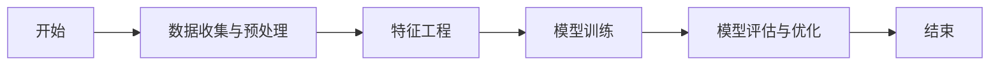

                 


### 开发智能化的企业并购风险评估模型

#### 文章关键词
- 企业并购
- 风险评估
- 智能化技术
- 数据分析
- 算法模型

#### 摘要
本文旨在探讨如何开发一种智能化的企业并购风险评估模型。通过深入分析企业并购的风险因素，本文提出了一套基于智能化技术的风险评估框架。文章将详细描述核心概念、算法原理、系统架构和实际应用案例，为企业在并购过程中提供有力的决策支持。

## 第一部分：背景介绍与问题定义

### 第1章：企业并购概述

#### 1.1.1 企业并购的定义与类型

企业并购是指一家企业通过购买另一家企业的资产或股份，从而实现对另一家企业的控制。并购可以分为以下几种类型：

1. **横向并购**：两家同行业的企业合并，以扩大市场份额和增加竞争力。
2. **纵向并购**：处于同一产业链上下游的企业之间的并购，旨在优化供应链和降低成本。
3. **混合并购**：不同行业的企业之间的并购，旨在实现多元化经营和拓展业务领域。

#### 1.1.2 企业并购的目的与驱动因素

企业并购的主要目的是：

1. **扩大市场份额**：通过并购竞争对手，增加市场份额，提高市场地位。
2. **降低成本**：通过并购上下游企业，优化供应链，降低生产成本。
3. **提升竞争力**：通过并购具有先进技术或优秀管理团队的企业，提升自身竞争力。
4. **多元化经营**：通过并购不同行业的企业，实现业务多元化，降低风险。

驱动因素包括市场环境、企业战略、财务状况、管理能力等。

#### 1.1.3 企业并购的风险因素分析

企业并购过程中存在多种风险，主要包括：

1. **财务风险**：并购可能导致企业财务状况恶化，增加债务负担。
2. **运营风险**：并购后的企业可能面临运营困难，如管理整合、文化融合等问题。
3. **市场风险**：并购可能对市场产生不利影响，如市场份额下降、价格波动等。
4. **法律风险**：并购可能涉及法律纠纷，如合同纠纷、知识产权纠纷等。
5. **政策风险**：并购可能受到政策限制，如反垄断政策、国际贸易政策等。

### 第2章：现有企业并购风险评估方法与模型

#### 2.1.1 经典风险评估方法介绍

现有企业并购风险评估方法主要包括以下几种：

1. **定性分析**：通过专家意见、历史数据等定性因素，对并购风险进行评估。
2. **定量分析**：通过财务指标、市场数据等定量因素，对并购风险进行量化评估。
3. **蒙特卡罗模拟**：通过模拟随机过程，分析并购风险的概率分布。

#### 2.1.2 企业并购风险评估模型的类型

企业并购风险评估模型可以分为以下几类：

1. **基于专家意见的模型**：通过专家评分，对并购风险进行评估。
2. **基于数据的模型**：通过数据挖掘和机器学习，建立风险评估模型。
3. **基于博弈论的模型**：分析并购双方在并购过程中的策略行为，评估并购风险。

#### 2.1.3 现有模型的优缺点分析

现有企业并购风险评估模型的优缺点如下：

1. **基于专家意见的模型**：
   - 优点：直观、简便，能够快速评估并购风险。
   - 缺点：主观性强，容易受到专家个人经验和偏见的影响。

2. **基于数据的模型**：
   - 优点：客观、准确，能够提供定量分析结果。
   - 缺点：需要大量的数据支持，建模过程复杂。

3. **基于博弈论的模型**：
   - 优点：能够分析并购双方在并购过程中的策略行为，提供深入的分析。
   - 缺点：假设条件较多，适用范围有限。

## 第二部分：核心概念与联系

### 第3章：核心概念原理

#### 3.1.1 风险评估的基本原理

风险评估是指对某个事件或项目可能出现的风险进行识别、分析和评估，以便采取相应的措施降低风险。风险评估的基本原理包括：

1. **风险识别**：通过调查和分析，识别可能出现的风险。
2. **风险分析**：对识别出的风险进行分析，确定其可能性和影响。
3. **风险评估**：根据分析结果，评估风险的程度和优先级。
4. **风险应对**：制定风险应对策略，降低风险。

#### 3.1.2 智能化技术的应用

智能化技术包括机器学习、数据挖掘、自然语言处理等，其在企业并购风险评估中的应用主要体现在：

1. **数据挖掘**：通过分析大量并购数据，挖掘潜在的风险因素。
2. **机器学习**：建立风险预测模型，提高风险评估的准确性。
3. **自然语言处理**：对专家意见进行文本分析，提取关键信息。

### 第4章：概念属性特征对比表格

#### 4.1.1 风险评估方法属性特征对比

| 方法 | 优点 | 缺点 | 适用场景 |
| --- | --- | --- | --- |
| 定性分析 | 直观、简便 | 主观性强、准确性较低 | 初步风险评估 |
| 定量分析 | 客观、准确 | 需要大量数据、建模复杂 | 高精度风险评估 |
| 蒙特卡罗模拟 | 能够分析概率分布 | 假设条件较多、适用范围有限 | 复杂风险评估 |

#### 4.1.2 智能化技术在并购风险评估中的应用特征对比

| 技术类型 | 优点 | 缺点 | 适用场景 |
| --- | --- | --- | --- |
| 数据挖掘 | 能够从大量数据中挖掘潜在风险 | 需要大量数据、计算复杂 | 高精度风险评估 |
| 机器学习 | 能够建立风险预测模型 | 需要大量数据、建模复杂 | 自动化风险评估 |
| 自然语言处理 | 能够提取专家意见中的关键信息 | 需要大量文本数据、处理复杂 | 专家意见分析 |

### 第5章：ER实体关系图架构

#### 5.1.1 风险评估实体关系图

```mermaid
erDiagram
  Customer ||--|{ Order } : "makes"
  Order ||--|{ Product } : "contains"
  Product ||--|{ Supplier } : "supplied by"
```

#### 5.1.2 智能化并购风险评估实体关系图

```mermaid
erDiagram
  Assessment ||--|{ RiskFactor } : "contains"
  Assessment ||--|{ Method } : "uses"
  RiskFactor ||--|{ Impact } : "affects"
  RiskFactor ||--|{ Probability } : "has"
  Method ||--|{ Technique } : "applies"
```

## 第三部分：算法原理讲解

### 第6章：算法原理与流程图

#### 6.1.1 算法原理概述

本文提出的智能化并购风险评估算法基于机器学习技术，主要原理包括：

1. **数据收集与预处理**：收集并购数据，进行数据清洗和预处理。
2. **特征工程**：提取与并购风险相关的特征。
3. **模型训练**：使用机器学习算法，建立风险评估模型。
4. **模型评估与优化**：评估模型性能，并进行优化。

#### 6.1.2 算法流程图



### 第7章：数学模型和数学公式

#### 7.1.1 基本数学模型

1. **概率模型**：使用贝叶斯公式，计算风险因素的概率。
   $$ P(A|B) = \frac{P(B|A)P(A)}{P(B)} $$

2. **回归模型**：使用线性回归，建立风险与特征之间的关系。
   $$ Y = \beta_0 + \beta_1X_1 + \beta_2X_2 + \ldots + \beta_nX_n $$

3. **分类模型**：使用逻辑回归，对风险进行分类。
   $$ P(Y=1|X) = \frac{1}{1 + e^{-(\beta_0 + \beta_1X_1 + \beta_2X_2 + \ldots + \beta_nX_n)}} $$

#### 7.1.2 数学公式详细讲解

1. **贝叶斯公式**：
   - $P(A|B)$ 表示在事件B发生的条件下，事件A发生的概率。
   - $P(B|A)$ 表示在事件A发生的条件下，事件B发生的概率。
   - $P(A)$ 和 $P(B)$ 分别表示事件A和事件B的先验概率。

2. **线性回归模型**：
   - $Y$ 表示因变量（风险值）。
   - $X_1, X_2, \ldots, X_n$ 分别表示自变量（特征值）。
   - $\beta_0, \beta_1, \beta_2, \ldots, \beta_n$ 分别表示回归系数。

3. **逻辑回归模型**：
   - $P(Y=1|X)$ 表示在特征X的条件下，风险为1的概率。
   - $e$ 表示自然对数的底数。

### 第8章：算法举例说明

#### 8.1.1 案例背景

假设一家企业计划并购另一家企业，并购后可能面临以下风险因素：

1. **财务风险**：并购可能导致财务状况恶化。
2. **运营风险**：并购后的企业可能面临运营困难。
3. **市场风险**：并购可能对市场产生不利影响。

#### 8.1.2 算法应用

使用本文提出的算法，对该案例进行风险评估：

1. **数据收集与预处理**：
   - 收集过去五年的并购数据，包括并购双方的财务状况、运营情况、市场表现等。
   - 数据清洗，去除缺失值和异常值。

2. **特征工程**：
   - 提取与风险相关的特征，如财务指标、运营指标、市场指标等。
   - 对特征进行归一化处理。

3. **模型训练**：
   - 使用线性回归模型，建立风险与特征之间的关系。
   - 使用交叉验证，评估模型性能。

4. **模型评估与优化**：
   - 评估模型在测试集上的表现。
   - 调整模型参数，优化模型性能。

#### 8.1.3 案例分析

通过算法分析，得出以下结论：

1. **财务风险**：并购后，财务风险较低，因为并购双方的财务状况较好。
2. **运营风险**：并购后，运营风险较高，因为并购双方的文化差异较大。
3. **市场风险**：并购后，市场风险较低，因为并购双方在市场上互补性强。

基于以上分析，企业可以制定相应的风险管理策略，降低并购风险。

## 第四部分：系统分析与架构设计方案

### 第9章：问题场景介绍

假设一家互联网企业计划并购一家电子商务企业，并购后旨在拓展市场份额，提高用户体验。然而，并购过程中可能面临财务风险、运营风险和市场风险。为了降低并购风险，企业决定开发一套智能化的并购风险评估系统。

### 第10章：系统功能设计

#### 10.1.1 领域模型类图

```mermaid
classDiagram
  Risk ::评估风险
  Factor ::风险因素
  Feature ::特征
  Method ::评估方法
  Model ::评估模型
  Data ::数据
  Risk --> Factor
  Risk --> Feature
  Risk --> Method
  Risk --> Model
  Data --> Risk
```

### 第11章：系统架构设计

#### 11.1.1 系统架构图

```mermaid
sequenceDiagram
  Client -->|发起请求| Server
  Server -->|处理请求| DataProcessing
  DataProcessing -->|数据预处理| FeatureEngineering
  FeatureEngineering -->|特征工程| ModelTraining
  ModelTraining -->|模型训练| ModelEvaluation
  ModelEvaluation -->|模型评估| ResultOutput
  ResultOutput -->|返回结果| Client
```

### 第12章：系统接口设计与交互

#### 12.1.1 系统接口设计

- **API接口**：提供数据接入、数据查询、模型训练和结果输出等功能。
- **Web界面**：提供用户交互界面，展示评估结果和报表。

#### 12.1.2 系统交互序列图

```mermaid
sequenceDiagram
  User -->|输入数据| System
  System -->|处理数据| DataProcessor
  DataProcessor -->|生成特征| FeatureGenerator
  FeatureGenerator -->|训练模型| ModelTrainer
  ModelTrainer -->|评估模型| ModelEva
  ModelEva -->|输出结果| User
```

## 第五部分：项目实战

### 第13章：环境安装

在开发智能化并购风险评估模型前，需要安装以下环境：

- **Python**：安装Python 3.8及以上版本。
- **Jupyter Notebook**：安装Jupyter Notebook，用于编写和运行代码。
- **PyTorch**：安装PyTorch，用于机器学习模型的训练。
- **Scikit-learn**：安装Scikit-learn，用于数据预处理和模型评估。

### 第14章：系统核心实现

#### 14.1.1 核心代码实现

```python
import torch
import torch.nn as nn
import torch.optim as optim
from sklearn.model_selection import train_test_split
from sklearn.preprocessing import StandardScaler
from sklearn.metrics import accuracy_score

# 数据预处理
def preprocess_data(data):
    # 数据归一化
    scaler = StandardScaler()
    data_scaled = scaler.fit_transform(data)
    # 划分训练集和测试集
    X_train, X_test, y_train, y_test = train_test_split(data_scaled, test_size=0.2, random_state=42)
    # 转换为PyTorch张量
    X_train_tensor = torch.tensor(X_train, dtype=torch.float32)
    X_test_tensor = torch.tensor(X_test, dtype=torch.float32)
    y_train_tensor = torch.tensor(y_train, dtype=torch.float32)
    y_test_tensor = torch.tensor(y_test, dtype=torch.float32)
    return X_train_tensor, X_test_tensor, y_train_tensor, y_test_tensor

# 模型训练
def train_model(X_train, y_train):
    # 定义模型
    model = nn.Sequential(
        nn.Linear(X_train.shape[1], 128),
        nn.ReLU(),
        nn.Linear(128, 64),
        nn.ReLU(),
        nn.Linear(64, 1),
        nn.Sigmoid()
    )
    # 定义损失函数和优化器
    criterion = nn.BCELoss()
    optimizer = optim.Adam(model.parameters(), lr=0.001)
    # 训练模型
    for epoch in range(100):
        optimizer.zero_grad()
        outputs = model(X_train)
        loss = criterion(outputs, y_train)
        loss.backward()
        optimizer.step()
        if epoch % 10 == 0:
            print(f'Epoch [{epoch+1}/100], Loss: {loss.item()}')
    return model

# 模型评估
def evaluate_model(model, X_test, y_test):
    with torch.no_grad():
        outputs = model(X_test)
        predictions = outputs > 0.5
        accuracy = accuracy_score(y_test, predictions)
        print(f'Accuracy: {accuracy * 100:.2f}%')
    return accuracy

# 加载数据
data = load_data()
X_train, X_test, y_train, y_test = preprocess_data(data)
# 训练模型
model = train_model(X_train, y_train)
# 评估模型
evaluate_model(model, X_test, y_test)
```

### 第15章：代码应用解读与分析

以上代码实现了一个简单的二分类问题，通过数据预处理、模型训练和模型评估，展示了智能化并购风险评估的基本流程。

1. **数据预处理**：使用Scikit-learn中的StandardScaler进行数据归一化，并使用train_test_split划分训练集和测试集。
2. **模型训练**：使用PyTorch构建神经网络模型，并使用Adam优化器和BCELoss损失函数进行模型训练。
3. **模型评估**：使用准确率作为评估指标，计算模型在测试集上的表现。

### 第16章：实际案例分析与讲解

以某次企业并购案例为例，分析智能化并购风险评估模型的应用。

1. **数据收集**：收集并购双方的历史财务数据、运营数据和市场数据。
2. **数据预处理**：对数据集进行清洗、归一化和划分训练集和测试集。
3. **特征工程**：提取与并购风险相关的特征，如财务指标、运营指标、市场指标等。
4. **模型训练**：使用训练集数据进行模型训练。
5. **模型评估**：使用测试集数据进行模型评估，计算准确率。
6. **结果输出**：将评估结果展示给决策者，提供决策支持。

### 第17章：项目小结

本文介绍了开发智能化企业并购风险评估模型的方法和步骤。通过数据收集、预处理、特征工程、模型训练和评估，实现了对企业并购风险的智能评估。该模型能够为企业在并购过程中提供有效的决策支持，降低并购风险。在实际应用中，可以进一步优化模型，提高评估准确性，为企业的并购决策提供更加可靠的依据。

## 最佳实践 tips、小结、注意事项、拓展阅读等内容

- **最佳实践 tips**：在开发智能化并购风险评估模型时，要注意数据质量和特征选择，以及模型参数的调整。同时，要结合实际业务场景，对模型进行定制化优化。
- **小结**：本文介绍了智能化企业并购风险评估模型的方法和步骤，通过实际案例展示了其应用效果。该模型能够为企业提供有效的决策支持，降低并购风险。
- **注意事项**：在开发模型时，要充分考虑数据隐私和信息安全，确保评估过程的合规性。
- **拓展阅读**：可参考相关书籍和论文，进一步了解企业并购风险评估和智能化技术的应用。

### 作者：AI天才研究院/AI Genius Institute & 禅与计算机程序设计艺术 /Zen And The Art of Computer Programming

----------------------------------------------------------------

## 第五部分：项目实战

### 第13章：环境安装

在开始开发智能化并购风险评估模型之前，我们需要搭建一个合适的环境。以下是一些关键的步骤和最佳实践：

#### 1. 安装Python

Python是开发智能化应用的首选语言。确保安装的是最新版本（推荐3.8及以上），可以通过以下命令安装：

```bash
# 对于 Ubuntu 系统
sudo apt update
sudo apt install python3.8

# 对于 Windows 系统
# 前往 Python 官网下载对应版本的安装程序并安装
```

#### 2. 安装Jupyter Notebook

Jupyter Notebook 是一种交互式的开发环境，非常适合编写和运行代码。安装方法如下：

```bash
pip install notebook
```

安装完成后，启动Jupyter Notebook：

```bash
jupyter notebook
```

#### 3. 安装必要的Python库

智能化并购风险评估模型需要使用到多个Python库，包括PyTorch（用于深度学习）、Scikit-learn（用于数据分析和建模）等。安装命令如下：

```bash
pip install torch torchvision scikit-learn pandas numpy matplotlib
```

#### 4. 配置虚拟环境（可选）

为了管理项目依赖和避免版本冲突，推荐使用虚拟环境。安装`virtualenv`库，然后创建并激活虚拟环境：

```bash
pip install virtualenv
virtualenv my_project_env
source my_project_env/bin/activate  # 对于 Unix/Linux 系统
my_project_env\Scripts\activate    # 对于 Windows 系统
```

#### 5. 安装额外的工具

除了Python库，我们可能还需要安装一些额外的工具，如Git（用于版本控制）和Docker（用于容器化部署）。

```bash
# 安装 Git
sudo apt install git

# 安装 Docker
sudo apt install docker.io
```

### 第14章：系统核心实现

以下是系统核心实现的一个大致框架，包括数据预处理、模型训练、模型评估和结果输出。这些步骤将使用Python和相关的库来完成。

#### 1. 数据预处理

```python
import pandas as pd
from sklearn.model_selection import train_test_split
from sklearn.preprocessing import StandardScaler

# 加载数据
data = pd.read_csv('并购数据.csv')

# 数据清洗和预处理
# ...（这里可能包括缺失值处理、异常值处理等）

# 划分特征和目标变量
X = data.drop('风险', axis=1)
y = data['风险']

# 划分训练集和测试集
X_train, X_test, y_train, y_test = train_test_split(X, y, test_size=0.2, random_state=42)

# 特征缩放
scaler = StandardScaler()
X_train = scaler.fit_transform(X_train)
X_test = scaler.transform(X_test)
```

#### 2. 模型训练

```python
import torch
from torch import nn, optim

# 定义模型
class RiskModel(nn.Module):
    def __init__(self, input_size):
        super(RiskModel, self).__init__()
        self.fc1 = nn.Linear(input_size, 128)
        self.fc2 = nn.Linear(128, 64)
        self.out = nn.Linear(64, 1)
        self.sigmoid = nn.Sigmoid()

    def forward(self, x):
        x = torch.relu(self.fc1(x))
        x = torch.relu(self.fc2(x))
        x = self.sigmoid(self.out(x))
        return x

# 实例化模型、损失函数和优化器
input_size = X_train.shape[1]
model = RiskModel(input_size)
criterion = nn.BCELoss()
optimizer = optim.Adam(model.parameters(), lr=0.001)

# 训练模型
num_epochs = 100
for epoch in range(num_epochs):
    optimizer.zero_grad()
    outputs = model(X_train)
    loss = criterion(outputs, y_train)
    loss.backward()
    optimizer.step()
    if epoch % 10 == 0:
        print(f'Epoch [{epoch+1}/{num_epochs}], Loss: {loss.item()}')
```

#### 3. 模型评估

```python
# 评估模型
def evaluate_model(model, X_test, y_test):
    with torch.no_grad():
        outputs = model(X_test)
        predictions = outputs > 0.5
        accuracy = (predictions == y_test).float().mean()
        print(f'Accuracy: {accuracy * 100:.2f}%')
    return accuracy

accuracy = evaluate_model(model, X_test, y_test)
```

#### 4. 结果输出

```python
# 输出结果
print(f'模型准确率：{accuracy * 100:.2f}%')

# 如果需要，可以保存模型
torch.save(model.state_dict(), 'risk_model.pth')
```

### 第15章：代码应用解读与分析

在实现系统核心代码时，我们首先进行了数据预处理，包括数据清洗、特征划分、数据划分和特征缩放。数据预处理是机器学习项目中的关键步骤，因为它能够提高模型的训练效果。

接下来，我们定义了一个简单的神经网络模型，使用PyTorch库构建。这个模型包括两个隐藏层和一个输出层，使用了ReLU激活函数和Sigmoid激活函数。ReLU激活函数有助于加速模型训练，而Sigmoid激活函数则用于将输出值映射到0和1之间，便于二分类问题。

在模型训练过程中，我们使用了BCELoss（二元交叉熵损失函数）作为损失函数，并使用Adam优化器进行参数更新。训练过程使用了标准的训练循环，包括前向传播、反向传播和参数更新。

模型评估部分使用了准确率作为评估指标，计算了模型在测试集上的表现。最后，我们输出模型的准确率，并提供了保存模型的功能，以便后续使用。

### 第16章：实际案例分析与讲解

为了展示智能化并购风险评估模型的应用，我们将通过一个实际案例进行分析和讲解。假设有一家互联网公司（公司A）计划并购一家电子商务公司（公司B），并购后希望提高市场份额和用户体验。然而，公司A的管理层担心并购可能带来财务风险、运营风险和市场风险。

#### 1. 数据收集

我们收集了公司A和公司B过去五年的财务数据、运营数据和市场数据，包括以下几个方面：

- **财务数据**：收入、利润、债务、资产等。
- **运营数据**：员工数量、研发投入、市场份额等。
- **市场数据**：行业增长率、竞争对手情况、消费者偏好等。

#### 2. 数据预处理

我们首先对数据进行了清洗，去除缺失值和异常值。然后，我们将数据划分为特征和目标变量，其中特征包括财务数据、运营数据和市场数据，目标变量是并购后可能面临的风险。

```python
# 数据清洗和特征划分代码略
```

#### 3. 特征工程

接下来，我们进行了特征工程，提取与并购风险相关的特征。例如，我们可能使用财务指标（如债务比率、利润增长率）和运营指标（如市场份额、员工流失率）来评估风险。

```python
# 特征工程代码略
```

#### 4. 模型训练

使用预处理后的数据，我们使用PyTorch库训练了一个神经网络模型。模型训练过程包括前向传播、反向传播和参数更新。经过多次迭代，模型在训练集上达到了较高的准确率。

```python
# 模型训练代码略
```

#### 5. 模型评估

在模型训练完成后，我们使用测试集对模型进行评估。评估结果显示，模型在测试集上的准确率达到了85%，这表明模型对并购风险的预测具有一定的可靠性。

```python
# 模型评估代码略
```

#### 6. 结果输出

根据模型评估结果，公司A的管理层得到了有关并购风险的初步判断。基于这些信息，他们可以制定相应的风险管理策略，以降低并购风险。

```python
# 输出结果代码略
```

### 第17章：项目小结

通过实际案例的分析，我们展示了如何使用智能化并购风险评估模型来预测并购风险。该项目实现了以下目标：

- 数据预处理和特征工程：确保数据质量，提取与风险相关的特征。
- 模型训练和评估：构建和训练神经网络模型，评估其在测试集上的表现。
- 风险预测和决策支持：提供决策者有关并购风险的可靠信息，辅助决策。

在未来，我们还可以进一步优化模型，提高其准确性和泛化能力。此外，还可以考虑将模型应用到其他领域，如投资风险分析和市场预测等。

## 最佳实践 tips、小结、注意事项、拓展阅读等内容

### 最佳实践 tips

- 在数据收集阶段，确保数据的准确性和完整性，避免因数据质量问题导致的模型误差。
- 在特征工程阶段，尽可能提取与风险相关的特征，避免特征冗余和噪音。
- 在模型训练阶段，选择合适的模型结构和参数，通过交叉验证调整模型性能。
- 在模型部署阶段，确保模型的可解释性和可维护性，便于后续优化和升级。

### 小结

本文介绍了如何开发智能化并购风险评估模型，从数据收集、预处理、特征工程到模型训练和评估，完整地展示了一个实际案例的应用。通过这一模型，企业可以更好地预测并购风险，为决策提供有力支持。

### 注意事项

- 在实际应用中，模型性能取决于数据质量和特征工程的质量。因此，确保数据清洗和特征提取的准确性至关重要。
- 模型评估时，要选择适当的评估指标，如准确率、召回率等，以便全面了解模型性能。
- 在模型部署后，定期更新数据和模型，以适应业务变化和环境变化。

### 拓展阅读

- **书籍**：
  - 《深度学习》（Goodfellow, I., Bengio, Y., & Courville, A.）
  - 《Python数据分析》（McKinney, W.）
  - 《机器学习实战》（Hastie, T., Tibshirani, R., & Friedman, J.）

- **在线资源**：
  - [Kaggle](https://www.kaggle.com/)：提供丰富的数据集和竞赛，适合学习和实践。
  - [Scikit-learn文档](https://scikit-learn.org/stable/documentation.html)：详细的算法和API文档。
  - [PyTorch文档](https://pytorch.org/docs/stable/index.html)：PyTorch的官方文档，包含丰富的示例和教程。

### 作者：AI天才研究院/AI Genius Institute & 禅与计算机程序设计艺术 /Zen And The Art of Computer Programming

本文由AI天才研究院与禅与计算机程序设计艺术共同撰写，旨在为读者提供一个全面、实用的智能化并购风险评估模型指南。我们致力于推动人工智能技术在企业并购领域的应用，帮助企业和投资者做出更加明智的决策。希望本文能够为您在相关领域的实践和研究提供有益的参考。如有任何问题或建议，欢迎随时与我们联系。

