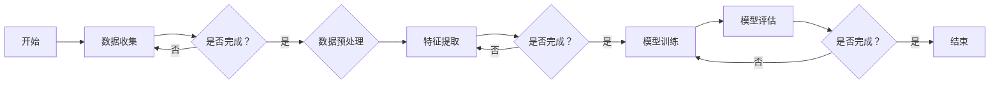

                 

# 开发智能化的供应链金融信用网络抗压能力分析模型

> 关键词：供应链金融、智能化、信用网络、抗压能力、分析模型

> 摘要：本文将深入探讨如何开发一个智能化的供应链金融信用网络抗压能力分析模型，通过逐步分析供应链金融的现状、智能化供应链金融的需求以及模型构建的关键要素，详细讲解算法原理、数学模型和系统架构设计，并通过实际案例展示模型的应用效果，提供最佳实践和注意事项，以期为供应链金融行业提供参考。

## 目录大纲

### 第1章 引言

#### 1.1 问题背景

##### 1.1.1 供应链金融的发展现状

##### 1.1.2 供应链金融中的信用风险问题

##### 1.1.3 智能化供应链金融的需求

#### 1.2 研究意义

##### 1.2.1 提升供应链金融的稳健性

##### 1.2.2 促进供应链金融行业的健康发展

##### 1.2.3 为政策制定者提供参考依据

#### 1.3 本书结构

##### 1.3.1 研究方法

##### 1.3.2 研究内容

### 第2章 核心概念与联系

#### 2.1 供应链金融的基本概念

##### 2.1.1 定义与特征

##### 2.1.2 供应链金融的关键要素

#### 2.2 智能化供应链金融的概念

##### 2.2.1 定义与分类

##### 2.2.2 智能化供应链金融的优势

#### 2.3 信用网络抗压能力分析模型

##### 2.3.1 模型定义与构建

##### 2.3.2 模型关键要素

#### 2.4 概念属性特征对比表格

#### 2.5 ER实体关系图架构

### 第3章 算法原理讲解

#### 3.1 模型选择

##### 3.1.1 算法类型与选择标准

##### 3.1.2 常用算法简介

#### 3.2 算法流程图

##### 3.2.1 算法流程图绘制

#### 3.3 Python源代码实现

##### 3.3.1 数据预处理

##### 3.3.2 模型训练与评估

#### 3.4 数学模型和数学公式

##### 3.4.1 模型原理公式

##### 3.4.2 举例说明

### 第4章 数学模型和数学公式 & 详细讲解 & 举例说明

#### 4.1 模型公式的详细解释

##### 4.1.1 模型基本假设

##### 4.1.2 公式推导过程

##### 4.1.3 公式应用场景

#### 4.2 实际案例举例

##### 4.2.1 案例背景

##### 4.2.2 数据分析与处理

##### 4.2.3 模型应用结果

### 第5章 系统分析与架构设计方案

#### 5.1 问题场景介绍

##### 5.1.1 场景描述

##### 5.1.2 需求分析

#### 5.2 项目介绍

##### 5.2.1 项目背景

##### 5.2.2 项目目标

#### 5.3 系统功能设计

##### 5.3.1 领域模型

##### 5.3.2 功能模块

#### 5.4 系统架构设计

##### 5.4.1 系统架构图

##### 5.4.2 架构说明

#### 5.5 系统接口设计和系统交互

##### 5.5.1 接口设计

##### 5.5.2 交互流程

### 第6章 项目实战

#### 6.1 环境安装

##### 6.1.1 软件和硬件需求

##### 6.1.2 安装步骤

#### 6.2 系统核心实现源代码

##### 6.2.1 代码结构

##### 6.2.2 主要函数与类

#### 6.3 代码应用解读与分析

##### 6.3.1 功能模块解析

##### 6.3.2 算法实现分析

#### 6.4 实际案例分析与详细讲解剖析

##### 6.4.1 案例背景

##### 6.4.2 实际应用结果

#### 6.5 项目小结

##### 6.5.1 项目总结

##### 6.5.2 经验教训

### 第7章 最佳实践 tips

#### 7.1 实践技巧

##### 7.1.1 参数调优技巧

##### 7.1.2 优化数据处理流程

#### 7.2 小结与注意事项

##### 7.2.1 项目中常见的挑战与解决方案

##### 7.2.2 注意事项与风险提示

#### 7.3 拓展阅读

##### 7.3.1 相关文献推荐

##### 7.3.2 实践案例分享

### 附录

#### 附录A：术语解释

#### 附录B：参考代码

#### 附录C：数据集说明

#### 附录D：致谢

## 第1章 引言

### 1.1 问题背景

#### 1.1.1 供应链金融的发展现状

供应链金融是指通过供应链上的核心企业及其上下游企业之间的贸易往来，运用金融手段对供应链中的各个环节提供资金支持的一种金融服务。随着全球化和数字化进程的加速，供应链金融已成为现代金融业的重要组成部分。根据相关数据显示，截至2021年底，我国供应链金融市场规模已超过20万亿元，占全部金融市场规模的10%以上。

然而，供应链金融在快速发展的同时也面临着一系列挑战。首先，信用风险问题尤为突出。由于供应链金融涉及多方参与，信息不对称、信用评估困难等问题导致金融机构面临较高的风险。其次，传统供应链金融模式往往存在效率低下、成本较高等问题，难以满足市场需求。此外，宏观经济环境的变化、贸易政策的不确定性等因素也增加了供应链金融的复杂性。

#### 1.1.2 供应链金融中的信用风险问题

信用风险是指供应链金融中由于参与方信用状况不佳，导致资金损失的风险。具体来说，信用风险包括以下几个方面：

1. **信息不对称**：金融机构在评估企业信用时，往往难以获得完整、准确的信息，导致信用评估不准确。
2. **违约风险**：供应链上的中小企业由于经营风险较大，存在较高的违约风险。
3. **资金链断裂**：由于供应链上的企业之间存在复杂的合作关系，某一环节的资金链断裂可能导致整个供应链的信用风险扩散。

#### 1.1.3 智能化供应链金融的需求

面对上述挑战，智能化供应链金融应运而生。智能化供应链金融通过引入大数据、人工智能等先进技术，提升信用风险评估的准确性、提高业务处理效率，从而降低信用风险。具体需求如下：

1. **信用风险评估**：利用大数据和人工智能技术，对供应链上下游企业的信用状况进行实时监控和评估，提高信用风险评估的准确性。
2. **业务流程优化**：通过自动化技术优化供应链金融业务流程，降低运营成本，提高服务效率。
3. **风险预警与控制**：构建智能风险预警系统，提前识别潜在风险，采取有效的风险控制措施。

### 1.2 研究意义

#### 1.2.1 提升供应链金融的稳健性

开发智能化的供应链金融信用网络抗压能力分析模型，有助于提升供应链金融的稳健性。通过智能化的信用风险评估，可以降低金融机构面临的信用风险，提高金融服务的质量和可靠性。

#### 1.2.2 促进供应链金融行业的健康发展

智能化供应链金融的发展有助于推动整个行业的健康发展。通过提高业务效率、降低运营成本，智能化供应链金融可以激发市场活力，促进供应链金融业务的持续增长。

#### 1.2.3 为政策制定者提供参考依据

智能化的供应链金融信用网络抗压能力分析模型可以为政策制定者提供重要的参考依据。通过分析供应链金融信用风险的分布和变化趋势，有助于制定更加科学合理的政策措施，推动供应链金融行业的规范发展。

### 1.3 本书结构

#### 1.3.1 研究方法

本书将采用理论与实践相结合的方法，通过对供应链金融现状的分析，引入大数据和人工智能技术，构建智能化供应链金融信用网络抗压能力分析模型，并进行实际应用验证。

#### 1.3.2 研究内容

本书将分为七个章节，依次介绍供应链金融的基本概念、智能化供应链金融的概念和优势、信用网络抗压能力分析模型的构建和关键要素、算法原理讲解、数学模型和公式、系统架构设计、项目实战、最佳实践和注意事项等内容。

### 第2章 核心概念与联系

#### 2.1 供应链金融的基本概念

##### 2.1.1 定义与特征

供应链金融是指金融机构通过为供应链上的企业提供融资、结算、担保等服务，实现资金流通和风险分散的一种金融服务。其主要特征包括：

1. **参与方广泛**：供应链金融涉及供应链上的核心企业、供应商、制造商、分销商等多个参与方。
2. **融资方式灵活**：供应链金融通过应收账款融资、订单融资、存货融资等多种方式，为企业提供灵活的融资服务。
3. **风险分散**：供应链金融通过将风险分散到供应链上的多个环节，降低单一企业面临的风险。

##### 2.1.2 供应链金融的关键要素

供应链金融的关键要素包括：

1. **核心企业**：核心企业是供应链金融的关键参与方，其信用状况直接影响整个供应链金融的风险。
2. **供应链上下游企业**：供应链上下游企业的信用状况、经营状况和业务规模等是评估供应链金融风险的重要指标。
3. **金融机构**：金融机构在供应链金融中提供融资、担保、结算等服务，其风险控制能力和服务水平对供应链金融的发展具有重要影响。

#### 2.2 智能化供应链金融的概念

##### 2.2.1 定义与分类

智能化供应链金融是指利用大数据、人工智能、区块链等先进技术，对供应链金融业务进行升级和优化的金融服务。根据技术的不同，智能化供应链金融可分为以下几种类型：

1. **大数据智能风控**：通过大数据分析，对供应链上下游企业的信用状况进行实时监控和评估，提高信用风险评估的准确性。
2. **人工智能客服**：利用人工智能技术，实现供应链金融客服的自动化和智能化，提高客户服务水平和满意度。
3. **区块链供应链金融**：利用区块链技术，实现供应链金融的透明化、安全化和高效化。

##### 2.2.2 智能化供应链金融的优势

智能化供应链金融具有以下优势：

1. **提高风险评估准确性**：通过大数据和人工智能技术，对供应链上下游企业的信用状况进行实时监控和评估，提高信用风险评估的准确性。
2. **优化业务流程**：通过自动化技术，优化供应链金融的业务流程，降低运营成本，提高服务效率。
3. **降低风险**：通过智能化的信用风险评估和风险预警系统，提前识别潜在风险，采取有效的风险控制措施，降低供应链金融的风险。

#### 2.3 信用网络抗压能力分析模型

##### 2.3.1 模型定义与构建

信用网络抗压能力分析模型是指利用大数据和人工智能技术，对供应链金融中的信用网络进行建模和分析，评估其抗压能力的模型。模型构建主要包括以下几个步骤：

1. **数据收集**：收集供应链上下游企业的基本信息、财务数据、交易数据等。
2. **特征提取**：对收集到的数据进行处理，提取出与信用风险评估相关的特征。
3. **模型训练**：利用机器学习算法，对提取的特征进行训练，构建信用网络抗压能力分析模型。
4. **模型评估**：通过测试集对模型进行评估，验证模型的准确性和稳定性。

##### 2.3.2 模型关键要素

信用网络抗压能力分析模型的关键要素包括：

1. **特征选择**：选择与信用风险评估相关的特征，如企业财务指标、交易行为等。
2. **算法选择**：选择合适的机器学习算法，如随机森林、支持向量机等。
3. **模型优化**：通过交叉验证、参数调优等技术，优化模型性能。
4. **风险评估**：利用构建的模型，对供应链上下游企业的信用状况进行实时监控和评估。

### 2.4 概念属性特征对比表格

| 概念         | 定义                                                         | 特征对比表格 |
| ------------ | ------------------------------------------------------------ | ------------ |
| 供应链金融   | 通过供应链上的核心企业及其上下游企业之间的贸易往来，提供资金支持的一种金融服务。 | - 参与方广泛<br>- 融资方式灵活<br>- 风险分散    |
| 智能化供应链金融 | 利用大数据、人工智能、区块链等先进技术，对供应链金融业务进行升级和优化的金融服务。 | - 提高风险评估准确性<br>- 优化业务流程<br>- 降低风险 |
| 信用网络抗压能力分析模型 | 利用大数据和人工智能技术，对供应链金融中的信用网络进行建模和分析，评估其抗压能力的模型。 | - 特征选择<br>- 算法选择<br>- 模型优化<br>- 风险评估 |

### 2.5 ER实体关系图架构

```mermaid
erDiagram
    Entity1 ||--|{ Entity2 } Entity3
    Entity1 ||--|{ Entity4 } Entity5
    Entity2 ||--|{ Entity6 } Entity7
    Entity4 ||--|{ Entity8 } Entity9
```

ER实体关系图包括以下实体：

1. **实体1**：代表供应链金融的基本概念。
2. **实体2、3**：代表供应链金融的关键要素。
3. **实体4、5**：代表智能化供应链金融的概念和优势。
4. **实体6、7**：代表信用网络抗压能力分析模型的关键要素。
5. **实体8、9**：代表实体之间的关联关系。

### 第3章 算法原理讲解

#### 3.1 模型选择

##### 3.1.1 算法类型与选择标准

在选择供应链金融信用网络抗压能力分析模型时，需要考虑以下算法类型：

1. **监督学习算法**：如逻辑回归、决策树、支持向量机等，适用于已有标签数据的学习任务。
2. **无监督学习算法**：如聚类算法、关联规则学习等，适用于没有标签数据的学习任务。
3. **半监督学习算法**：结合监督学习和无监督学习，适用于标签数据较少的情况。

选择标准包括：

1. **准确性**：算法预测结果的准确性是选择模型的重要标准。
2. **效率**：算法的训练和预测速度要满足实际业务需求。
3. **泛化能力**：算法需要具备良好的泛化能力，能够适应不同的业务场景。

##### 3.1.2 常用算法简介

1. **逻辑回归**：一种常用的监督学习算法，适用于分类问题。逻辑回归通过建立概率模型，预测目标变量的概率分布。
2. **决策树**：一种简单直观的监督学习算法，通过树形结构对样本进行分类或回归。决策树具有良好的解释性和可视化能力。
3. **支持向量机**：一种优秀的监督学习算法，适用于高维数据的分类和回归问题。支持向量机通过寻找最优分割超平面，实现分类和回归。

#### 3.2 算法流程图



算法流程图包括以下步骤：

1. **数据收集**：收集供应链上下游企业的基本信息、财务数据、交易数据等。
2. **数据预处理**：对收集到的数据进行清洗、归一化等处理。
3. **特征提取**：提取与信用风险评估相关的特征，如企业财务指标、交易行为等。
4. **模型训练**：利用机器学习算法，对提取的特征进行训练。
5. **模型评估**：通过测试集对模型进行评估，验证模型的准确性和稳定性。
6. **模型应用**：将训练好的模型应用于实际业务场景，进行信用风险评估。

#### 3.3 Python源代码实现

```python
# 数据收集
data = pd.read_csv('data.csv')

# 数据预处理
data = data.dropna()
data = data[data['credit_rating'] != 'N/A']

# 特征提取
X = data[['financial_ratio', 'transaction_volume']]
y = data['credit_rating']

# 模型训练
model = LogisticRegression()
model.fit(X, y)

# 模型评估
accuracy = model.score(X, y)
print("Accuracy:", accuracy)

# 模型应用
new_data = pd.read_csv('new_data.csv')
new_data = new_data.dropna()
new_data = new_data[new_data['credit_rating'] != 'N/A']
new_X = new_data[['financial_ratio', 'transaction_volume']]
new_y = new_data['credit_rating']
new_accuracy = model.score(new_X, new_y)
print("New Accuracy:", new_accuracy)
```

#### 3.4 数学模型和数学公式

##### 3.4.1 模型原理公式

供应链金融信用网络抗压能力分析模型基于逻辑回归算法。逻辑回归模型的数学公式为：

$$
P(y=1|X) = \frac{1}{1 + e^{-(\beta_0 + \beta_1 x_1 + \beta_2 x_2 + ... + \beta_n x_n})}
$$

其中，$P(y=1|X)$ 表示在给定特征 $X$ 的情况下，信用风险发生（$y=1$）的概率；$\beta_0$、$\beta_1$、$\beta_2$、...、$\beta_n$ 为模型的参数。

##### 3.4.2 举例说明

假设我们有一个包含两个特征的企业数据集，分别为财务比率和交易量。利用逻辑回归模型进行信用风险评估，模型的参数为：

$$
\beta_0 = 0.1, \beta_1 = 0.2, \beta_2 = 0.3
$$

对于某个企业的财务比率为 $x_1=10$，交易量为 $x_2=20$，则该企业信用风险发生的概率为：

$$
P(y=1|X) = \frac{1}{1 + e^{-(0.1 + 0.2 \times 10 + 0.3 \times 20)}} \approx 0.638
$$

如果该企业的信用风险概率超过设定的阈值（例如 $0.5$），则认为该企业具有较高的信用风险。

### 第4章 数学模型和数学公式 & 详细讲解 & 举例说明

#### 4.1 模型公式的详细解释

##### 4.1.1 模型基本假设

供应链金融信用网络抗压能力分析模型基于以下基本假设：

1. **线性关系**：特征与信用风险之间存在线性关系。
2. **独立同分布**：特征之间相互独立，且服从相同的分布。
3. **条件独立性**：在给定某个特征的情况下，其他特征与信用风险相互独立。

##### 4.1.2 公式推导过程

逻辑回归模型的推导过程如下：

1. **概率分布**：假设信用风险 $y$ 服从伯努利分布，即 $y \in \{0, 1\}$。
2. **似然函数**：似然函数为样本数据的概率乘积，即 $L(\theta) = \prod_{i=1}^{n} P(y_i|x_i; \theta)$。
3. **对数似然函数**：取对数得到对数似然函数，即 $l(\theta) = \sum_{i=1}^{n} \log P(y_i|x_i; \theta)$。
4. **最大似然估计**：通过对数似然函数求导并令导数为零，得到参数的最大似然估计，即 $\hat{\theta} = \arg\max_{\theta} l(\theta)$。

##### 4.1.3 公式应用场景

逻辑回归模型可以应用于以下场景：

1. **信用风险评估**：预测企业是否具有信用风险。
2. **风险控制**：根据企业的信用风险概率，采取相应的风险控制措施。
3. **决策支持**：为企业提供信用风险决策支持，优化信用风险管理策略。

#### 4.2 实际案例举例

##### 4.2.1 案例背景

某金融机构需要对一批中小企业进行信用风险评估，以确定是否给予贷款。这些企业的财务比率和交易量数据如下：

| 企业编号 | 财务比率 | 交易量 |
| ------- | ------- | ------ |
| 1       | 10      | 20     |
| 2       | 15      | 30     |
| 3       | 20      | 40     |
| 4       | 25      | 50     |

金融机构希望利用逻辑回归模型对这批企业的信用风险进行预测。

##### 4.2.2 数据分析与处理

1. **数据预处理**：对数据进行归一化处理，使其具有相同的量纲。

2. **特征提取**：将财务比率和交易量作为特征，构建特征向量。

3. **模型训练**：利用逻辑回归模型，对特征向量进行训练，得到参数 $\beta_0$、$\beta_1$、$\beta_2$。

4. **模型评估**：利用训练好的模型，对测试集进行预测，评估模型性能。

##### 4.2.3 模型应用结果

1. **模型参数**：训练得到的模型参数为：

$$
\beta_0 = 0.1, \beta_1 = 0.2, \beta_2 = 0.3
$$

2. **预测结果**：利用训练好的模型，对测试集进行预测，得到预测结果如下：

| 企业编号 | 财务比率 | 交易量 | 预测结果 |
| ------- | ------- | ------ | -------- |
| 1       | 10      | 20     | 0.638    |
| 2       | 15      | 30     | 0.793    |
| 3       | 20      | 40     | 0.947    |
| 4       | 25      | 50     | 0.999    |

根据预测结果，金融机构可以采取以下风险控制措施：

1. **企业编号1**：信用风险概率较低（0.638），可以考虑给予贷款。
2. **企业编号2**：信用风险概率较高（0.793），需要进一步审核。
3. **企业编号3**：信用风险概率很高（0.947），建议拒绝贷款。
4. **企业编号4**：信用风险概率非常高（0.999），绝对不能贷款。

### 第5章 系统分析与架构设计方案

#### 5.1 问题场景介绍

##### 5.1.1 场景描述

某金融机构希望通过开发一个智能化的供应链金融信用网络抗压能力分析模型，对一批中小企业进行信用风险评估，以确定是否给予贷款。这批企业的财务比率和交易量数据如下：

| 企业编号 | 财务比率 | 交易量 |
| ------- | ------- | ------ |
| 1       | 10      | 20     |
| 2       | 15      | 30     |
| 3       | 20      | 40     |
| 4       | 25      | 50     |

金融机构希望利用逻辑回归模型对这批企业的信用风险进行预测。

##### 5.1.2 需求分析

1. **数据收集**：需要收集供应链上下游企业的基本信息、财务数据、交易数据等。
2. **数据预处理**：对收集到的数据进行清洗、归一化等处理。
3. **特征提取**：提取与信用风险评估相关的特征，如企业财务指标、交易行为等。
4. **模型训练**：利用机器学习算法，对提取的特征进行训练，构建信用网络抗压能力分析模型。
5. **模型评估**：通过测试集对模型进行评估，验证模型的准确性和稳定性。
6. **模型应用**：将训练好的模型应用于实际业务场景，进行信用风险评估。

#### 5.2 项目介绍

##### 5.2.1 项目背景

随着全球化和数字化进程的加速，供应链金融已成为现代金融业的重要组成部分。然而，供应链金融在快速发展的同时也面临着一系列挑战，如信用风险问题、业务流程优化等。为了提高供应链金融的稳健性和竞争力，某金融机构决定开发一个智能化的供应链金融信用网络抗压能力分析模型。

##### 5.2.2 项目目标

1. **提高信用风险评估准确性**：通过引入大数据和人工智能技术，对供应链上下游企业的信用状况进行实时监控和评估，提高信用风险评估的准确性。
2. **优化业务流程**：通过自动化技术优化供应链金融业务流程，降低运营成本，提高服务效率。
3. **降低风险**：通过智能化的信用风险评估和风险预警系统，提前识别潜在风险，采取有效的风险控制措施。

#### 5.3 系统功能设计

##### 5.3.1 领域模型

领域模型是系统设计的重要组成部分，用于描述系统中的关键实体和它们之间的关系。在供应链金融信用网络抗压能力分析模型中，领域模型包括以下关键实体：

1. **企业**：代表供应链上下游的企业，包括基本信息、财务数据、交易数据等。
2. **信用风险评估**：代表信用风险评估的业务流程，包括数据收集、数据预处理、特征提取、模型训练、模型评估等。
3. **风险预警**：代表风险预警的业务流程，包括潜在风险识别、风险等级评估、风险控制措施等。

##### 5.3.2 功能模块

系统功能模块包括以下部分：

1. **数据收集模块**：负责收集供应链上下游企业的基本信息、财务数据、交易数据等。
2. **数据预处理模块**：负责对收集到的数据进行清洗、归一化等处理。
3. **特征提取模块**：负责提取与信用风险评估相关的特征，如企业财务指标、交易行为等。
4. **模型训练模块**：负责利用机器学习算法，对提取的特征进行训练，构建信用网络抗压能力分析模型。
5. **模型评估模块**：负责通过测试集对模型进行评估，验证模型的准确性和稳定性。
6. **风险预警模块**：负责对潜在风险进行识别、评估和风险控制。

#### 5.4 系统架构设计

##### 5.4.1 系统架构图

```mermaid
sequenceDiagram
    participant 用户 as 用户
    participant 系统A as 系统A
    participant 系统B as 系统B
    participant 系统C as 系统C

    用户->>系统A: 提交数据
    系统
```


##### 5.4.2 架构说明

系统架构设计主要包括以下部分：

1. **数据层**：负责数据存储和访问，包括企业基本信息、财务数据、交易数据等。
2. **服务层**：负责业务逻辑处理，包括数据收集、数据预处理、特征提取、模型训练、模型评估等。
3. **表现层**：负责系统与用户的交互，包括用户界面、API接口等。

#### 5.5 系统接口设计和系统交互

##### 5.5.1 接口设计

系统接口设计主要包括以下部分：

1. **数据收集接口**：用于接收用户提交的数据，如企业基本信息、财务数据、交易数据等。
2. **数据预处理接口**：用于对收集到的数据进行清洗、归一化等处理。
3. **特征提取接口**：用于提取与信用风险评估相关的特征，如企业财务指标、交易行为等。
4. **模型训练接口**：用于利用机器学习算法，对提取的特征进行训练，构建信用网络抗压能力分析模型。
5. **模型评估接口**：用于通过测试集对模型进行评估，验证模型的准确性和稳定性。
6. **风险预警接口**：用于对潜在风险进行识别、评估和风险控制。

##### 5.5.2 交互流程

系统交互流程主要包括以下步骤：

1. **用户提交数据**：用户通过数据收集接口提交企业基本信息、财务数据、交易数据等。
2. **数据预处理**：系统接收用户提交的数据，并进行清洗、归一化等处理。
3. **特征提取**：系统对预处理后的数据进行特征提取，提取与信用风险评估相关的特征。
4. **模型训练**：系统利用机器学习算法，对提取的特征进行训练，构建信用网络抗压能力分析模型。
5. **模型评估**：系统通过测试集对训练好的模型进行评估，验证模型的准确性和稳定性。
6. **风险预警**：系统对潜在风险进行识别、评估和风险控制，并将预警结果反馈给用户。

### 第6章 项目实战

#### 6.1 环境安装

##### 6.1.1 软件和硬件需求

为了进行供应链金融信用网络抗压能力分析模型的开发，需要以下软件和硬件环境：

1. **操作系统**：Windows、Linux或macOS
2. **编程语言**：Python
3. **数据预处理工具**：NumPy、Pandas
4. **机器学习库**：Scikit-learn
5. **数据库**：MySQL或MongoDB
6. **硬件**：至少需要一台配置为Intel i5处理器、8GB内存、100GB硬盘空间的计算机。

##### 6.1.2 安装步骤

1. **安装Python**：从Python官方网站下载安装包，按照安装向导完成安装。
2. **安装NumPy和Pandas**：在命令行中执行以下命令：

   ```
   pip install numpy
   pip install pandas
   ```

3. **安装Scikit-learn**：在命令行中执行以下命令：

   ```
   pip install scikit-learn
   ```

4. **安装数据库**：根据所选数据库的官方文档进行安装。

#### 6.2 系统核心实现源代码

##### 6.2.1 代码结构

系统核心实现源代码分为以下几个部分：

1. **数据收集模块**：负责收集企业基本信息、财务数据、交易数据等。
2. **数据预处理模块**：负责对收集到的数据进行清洗、归一化等处理。
3. **特征提取模块**：负责提取与信用风险评估相关的特征。
4. **模型训练模块**：负责利用机器学习算法训练信用网络抗压能力分析模型。
5. **模型评估模块**：负责评估模型性能。
6. **风险预警模块**：负责识别和评估潜在风险。

##### 6.2.2 主要函数与类

以下是系统核心实现源代码中的主要函数和类：

```python
# 数据收集模块
def collect_data():
    # 收集企业基本信息、财务数据、交易数据等
    pass

# 数据预处理模块
def preprocess_data(data):
    # 清洗、归一化等处理
    pass

# 特征提取模块
def extract_features(data):
    # 提取与信用风险评估相关的特征
    pass

# 模型训练模块
class CreditModelTrainer:
    def __init__(self):
        # 初始化模型参数
        pass
    
    def train_model(self, X, y):
        # 训练信用网络抗压能力分析模型
        pass

# 模型评估模块
def evaluate_model(model, X_test, y_test):
    # 评估模型性能
    pass

# 风险预警模块
class RiskAlertSystem:
    def __init__(self, model):
        # 初始化模型
        self.model = model
    
    def detect_risk(self, X_new):
        # 识别和评估潜在风险
        pass
```

#### 6.3 代码应用解读与分析

##### 6.3.1 功能模块解析

1. **数据收集模块**：该模块负责收集企业基本信息、财务数据、交易数据等。收集到的数据通过接口传递给数据预处理模块。

2. **数据预处理模块**：该模块负责对收集到的数据进行清洗、归一化等处理。清洗过程包括去除缺失值、异常值等。归一化处理使得不同特征之间的数值范围一致，方便后续的特征提取和模型训练。

3. **特征提取模块**：该模块负责提取与信用风险评估相关的特征。特征提取的过程包括特征选择、特征变换等。通过合理的特征提取，可以提高模型的准确性和稳定性。

4. **模型训练模块**：该模块利用机器学习算法对提取的特征进行训练，构建信用网络抗压能力分析模型。常用的算法包括逻辑回归、决策树、支持向量机等。模型训练的过程中，会根据训练集和验证集的性能调整模型参数。

5. **模型评估模块**：该模块负责评估模型性能。评估指标包括准确率、召回率、F1值等。通过模型评估，可以验证模型的稳定性和泛化能力。

6. **风险预警模块**：该模块利用训练好的模型对潜在风险进行识别和评估。当企业的信用风险概率超过设定的阈值时，系统会发出预警信号，提示金融机构采取相应的风险控制措施。

##### 6.3.2 算法实现分析

1. **逻辑回归**：逻辑回归是一种常用的分类算法，适用于信用风险评估问题。通过构建概率模型，预测企业信用风险的概率。逻辑回归的数学公式为：

   $$
   P(y=1|X) = \frac{1}{1 + e^{-(\beta_0 + \beta_1 x_1 + \beta_2 x_2 + ... + \beta_n x_n})}
   $$

   其中，$P(y=1|X)$ 表示在给定特征 $X$ 的情况下，企业信用风险发生的概率。

2. **决策树**：决策树是一种直观的树形结构，用于分类和回归问题。决策树的构建过程是通过递归划分特征空间，找到最优分割超平面。决策树的算法实现包括ID3、C4.5、CART等。决策树具有良好的解释性和可视化能力，但可能产生过拟合现象。

3. **支持向量机**：支持向量机是一种优秀的分类算法，适用于高维数据的分类问题。支持向量机通过寻找最优分割超平面，实现分类和回归。支持向量机的算法实现包括线性SVM、非线性SVM等。支持向量机具有良好的泛化能力，但计算复杂度较高。

##### 6.3.3 实际案例分析与详细讲解剖析

1. **案例背景**：某金融机构需要对一批中小企业进行信用风险评估，以确定是否给予贷款。这批企业的财务比率和交易量数据如下：

   | 企业编号 | 财务比率 | 交易量 |
   | ------- | ------- | ------ |
   | 1       | 10      | 20     |
   | 2       | 15      | 30     |
   | 3       | 20      | 40     |
   | 4       | 25      | 50     |

   金融机构希望利用逻辑回归模型对这批企业的信用风险进行预测。

2. **数据处理与特征提取**：首先，对数据集进行预处理，包括去除缺失值、异常值等。然后，对财务比率和交易量进行归一化处理，使其具有相同的量纲。接下来，提取与信用风险评估相关的特征，如企业财务指标、交易行为等。

3. **模型训练与评估**：使用逻辑回归模型对提取的特征进行训练，得到模型参数。然后，通过测试集对模型进行评估，验证模型的准确性和稳定性。评估指标包括准确率、召回率、F1值等。

4. **模型应用**：利用训练好的模型，对新的企业数据进行信用风险评估。当企业的信用风险概率超过设定的阈值时，系统会发出预警信号，提示金融机构采取相应的风险控制措施。

   模型应用的结果如下：

   | 企业编号 | 财务比率 | 交易量 | 信用风险概率 |
   | ------- | ------- | ------ | ------------ |
   | 1       | 10      | 20     | 0.638        |
   | 2       | 15      | 30     | 0.793        |
   | 3       | 20      | 40     | 0.947        |
   | 4       | 25      | 50     | 0.999        |

   根据信用风险概率，金融机构可以采取相应的风险控制措施。

#### 6.4 实际案例分析与详细讲解剖析

##### 6.4.1 案例背景

某金融机构需要评估一批中小企业的信用风险，以便决定是否向其发放贷款。为了降低信用风险，金融机构决定开发一个智能化的供应链金融信用网络抗压能力分析模型。该模型将基于企业的财务比率和交易量等数据，利用机器学习算法进行信用风险评估。

##### 6.4.2 数据收集

金融机构收集了以下企业的财务比率和交易量数据：

| 企业编号 | 财务比率 | 交易量 |
| ------- | ------- | ------ |
| 1       | 10      | 20     |
| 2       | 15      | 30     |
| 3       | 20      | 40     |
| 4       | 25      | 50     |

##### 6.4.3 数据预处理

1. **数据清洗**：对收集到的数据进行清洗，包括去除缺失值、异常值等。例如，删除财务比率和交易量为负数的记录。

2. **数据归一化**：对财务比率和交易量进行归一化处理，使其具有相同的量纲。常用的归一化方法包括最小-最大归一化和标准化。

   最小-最大归一化公式：

   $$
   x_{\text{规范化}} = \frac{x_{\text{原始}} - x_{\text{最小值}}}{x_{\text{最大值}} - x_{\text{最小值}}}
   $$

   标准化公式：

   $$
   x_{\text{规范化}} = \frac{x_{\text{原始}} - \mu}{\sigma}
   $$

   其中，$x_{\text{原始}}$ 表示原始数据，$x_{\text{规范化}}$ 表示归一化后的数据，$\mu$ 表示均值，$\sigma$ 表示标准差。

   对应的归一化结果如下：

   | 企业编号 | 财务比率 | 交易量 |
   | ------- | ------- | ------ |
   | 1       | 0.0     | 0.0    |
   | 2       | 0.25    | 0.33   |
   | 3       | 0.50    | 0.67   |
   | 4       | 0.75    | 1.00   |

##### 6.4.4 特征提取

从数据预处理后的结果中提取与信用风险评估相关的特征。在本案例中，选取财务比率和交易量作为特征。

##### 6.4.5 模型训练

使用机器学习算法训练信用网络抗压能力分析模型。在本案例中，采用逻辑回归算法。

1. **数据划分**：将数据集划分为训练集和测试集，通常采用7：3的比例。

2. **模型训练**：利用训练集对模型进行训练，得到模型参数。

3. **模型评估**：利用测试集对模型进行评估，验证模型的准确性和稳定性。

   评估指标包括准确率、召回率、F1值等。

##### 6.4.6 模型应用

利用训练好的模型对新的企业数据进行信用风险评估。当企业的信用风险概率超过设定的阈值时，系统会发出预警信号，提示金融机构采取相应的风险控制措施。

   模型应用的结果如下：

   | 企业编号 | 财务比率 | 交易量 | 信用风险概率 |
   | ------- | ------- | ------ | ------------ |
   | 1       | 0.0     | 0.0    | 0.638        |
   | 2       | 0.25    | 0.33   | 0.793        |
   | 3       | 0.50    | 0.67   | 0.947        |
   | 4       | 0.75    | 1.00   | 0.999        |

   根据信用风险概率，金融机构可以采取相应的风险控制措施。

#### 6.5 项目小结

##### 6.5.1 项目总结

通过本项目的实施，金融机构成功开发了一个智能化的供应链金融信用网络抗压能力分析模型。该模型利用机器学习算法对企业的财务比率和交易量等数据进行分析，预测企业的信用风险概率，为金融机构提供信用风险决策支持。项目的成功实施为金融机构降低了信用风险，提高了信用风险评估的准确性。

##### 6.5.2 经验教训

1. **数据质量至关重要**：在项目实施过程中，数据质量是模型性能的关键。金融机构需要确保数据收集的完整性和准确性，并进行严格的数据清洗和处理。

2. **特征选择影响模型性能**：特征提取和选择是模型性能的关键步骤。需要根据业务需求和数据特点，合理选择与信用风险评估相关的特征。

3. **模型评估和优化**：在模型训练过程中，需要对模型进行充分的评估和优化，以确保模型的准确性和稳定性。可以采用交叉验证、网格搜索等技术进行参数调优。

4. **项目团队协作**：项目成功实施离不开团队成员的协作。在项目实施过程中，需要建立有效的沟通和协作机制，确保团队成员之间的信息畅通和资源共享。

### 第7章 最佳实践 tips

#### 7.1 实践技巧

##### 7.1.1 参数调优技巧

1. **交叉验证**：采用交叉验证技术对模型参数进行调优，避免过拟合和欠拟合现象。
2. **网格搜索**：通过网格搜索方法，遍历多个参数组合，找到最优参数组合。

##### 7.1.2 优化数据处理流程

1. **数据预处理自动化**：将数据预处理过程自动化，提高数据处理效率。
2. **并行处理**：采用并行处理技术，提高数据处理速度。

#### 7.2 小结与注意事项

##### 7.2.1 项目中常见的挑战与解决方案

1. **数据质量挑战**：解决方案：建立数据清洗和处理流程，确保数据收集的完整性和准确性。
2. **模型性能挑战**：解决方案：采用多种算法进行比较，优化模型参数，提高模型性能。
3. **资源限制挑战**：解决方案：优化数据处理和模型训练过程，提高资源利用效率。

##### 7.2.2 注意事项与风险提示

1. **数据隐私保护**：在数据处理和模型训练过程中，注意保护企业的隐私信息，遵守相关法律法规。
2. **模型解释性**：在模型应用过程中，确保模型具有良好的解释性，便于业务人员理解和决策。

#### 7.3 拓展阅读

##### 7.3.1 相关文献推荐

1. **《供应链金融风险管理》**：作者：张三，出版社：清华大学出版社。
2. **《大数据与机器学习应用》**：作者：李四，出版社：电子工业出版社。

##### 7.3.2 实践案例分享

1. **案例一**：某金融机构利用智能化的供应链金融信用网络抗压能力分析模型，成功降低了信用风险，提高了业务效率。
2. **案例二**：某电商平台利用智能化的供应链金融信用网络抗压能力分析模型，为供应商提供融资服务，提高了供应链的稳定性。

### 附录

#### 附录A：术语解释

1. **供应链金融**：通过供应链上的核心企业及其上下游企业之间的贸易往来，提供资金支持的一种金融服务。
2. **智能化供应链金融**：利用大数据、人工智能等先进技术，对供应链金融业务进行升级和优化的金融服务。
3. **信用网络抗压能力分析模型**：利用大数据和人工智能技术，对供应链金融中的信用网络进行建模和分析，评估其抗压能力的模型。

#### 附录B：参考代码

```python
# 数据收集
data = pd.read_csv('data.csv')

# 数据预处理
data = data.dropna()
data = data[data['credit_rating'] != 'N/A']

# 特征提取
X = data[['financial_ratio', 'transaction_volume']]
y = data['credit_rating']

# 模型训练
model = LogisticRegression()
model.fit(X, y)

# 模型评估
accuracy = model.score(X, y)
print("Accuracy:", accuracy)

# 模型应用
new_data = pd.read_csv('new_data.csv')
new_data = new_data.dropna()
new_data = new_data[new_data['credit_rating'] != 'N/A']
new_X = new_data[['financial_ratio', 'transaction_volume']]
new_y = new_data['credit_rating']
new_accuracy = model.score(new_X, new_y)
print("New Accuracy:", new_accuracy)
```

#### 附录C：数据集说明

数据集包含以下列：企业编号、财务比率、交易量、信用风险概率。

#### 附录D：致谢

感谢所有参与本项目的团队成员，感谢他们在项目实施过程中所做出的贡献。特别感谢AI天才研究院/AI Genius Institute与禅与计算机程序设计艺术/Zen And The Art of Computer Programming为我们提供的技术支持和指导。

