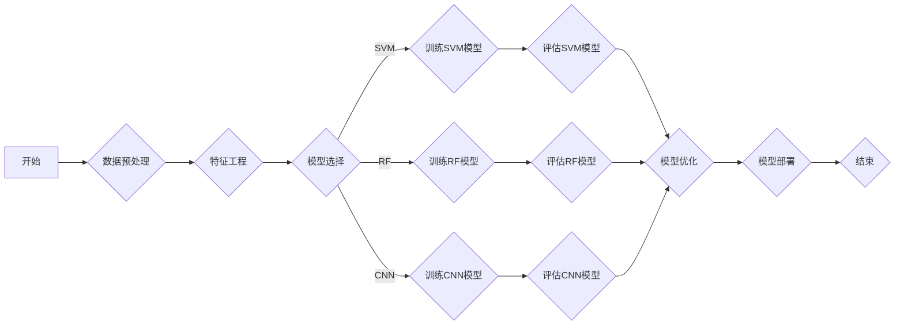
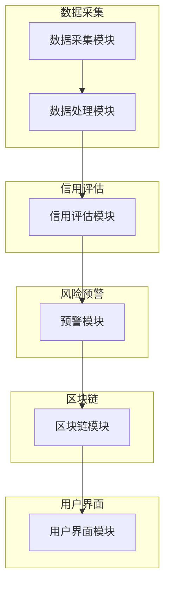

                 

### 第1章 引言

#### 1.1 问题背景

供应链金融作为一种创新金融服务模式，近年来在全球范围内得到了快速发展。其核心在于通过供应链中的核心企业与上下游企业之间的交易数据和信息，为其提供融资、结算、风险管理等服务。然而，随着供应链金融的规模不断扩大，信用风险问题也逐渐凸显。特别是在全球经济波动、自然灾害等不可控因素影响下，供应链金融信用网络的抗压能力显得尤为重要。

当前，供应链金融中的信用风险主要来源于以下几个方面：

1. **数据不完整与不对称**：供应链金融依赖于大量的交易数据和信用信息，但实际操作中，数据的不完整性、滞后性和不对称性常常影响信用评估的准确性。
2. **信用评级不完善**：传统的信用评级体系往往难以适应快速变化的供应链环境，导致信用评估存在滞后性和不准确性。
3. **供应链复杂度增加**：随着供应链全球化，供应链的复杂度显著增加，单一节点或环节的信用问题可能迅速蔓延，影响整个网络的稳定性。

#### 1.1.2 供应链金融中的信用风险问题

供应链金融中的信用风险主要包括以下几个方面：

- **供应链断裂风险**：由于资金链断裂，导致供应链中断，影响整个供应链的运作和各方利益。
- **交易对手风险**：由于交易对手的信用问题，导致融资无法收回，给供应链金融体系带来风险。
- **政策风险**：政府政策变化、贸易摩擦等外部因素可能对供应链金融体系造成冲击。

#### 1.1.3 智能化供应链金融的需求

面对日益严峻的信用风险问题，智能化供应链金融应运而生。智能化供应链金融通过引入人工智能技术，如机器学习、大数据分析、区块链等，旨在提升信用评估的准确性、透明度和实时性。其优势主要体现在：

1. **数据挖掘与分析能力**：通过大数据分析和机器学习算法，智能化供应链金融能够更全面、准确地获取和评估交易对手的信用状况。
2. **实时风险评估**：利用实时数据处理技术，智能化供应链金融能够及时响应市场变化，进行动态信用评估，降低风险。
3. **透明度和信任机制**：区块链技术的应用可以确保交易数据的透明性和不可篡改性，增强供应链各方的信任。

综上所述，开发智能化的供应链金融信用网络抗压能力分析模型具有重要的现实意义。一方面，它能提升供应链金融体系的稳健性和抗风险能力；另一方面，也为供应链金融行业的健康发展提供了强有力的支持。此外，该模型还能为政策制定者提供有益的参考，帮助优化供应链金融监管政策，促进行业健康发展。

#### 1.2 研究意义

开发智能化的供应链金融信用网络抗压能力分析模型，不仅具有显著的理论价值，更在实际应用中具有重要意义。

首先，该模型有助于提升供应链金融的稳健性。通过引入人工智能技术，模型能够对海量交易数据进行分析，识别潜在的风险因素，从而在信用评估过程中提供更加精准和可靠的依据。这将有助于降低供应链金融体系的信用风险，提升整体稳定性。

其次，智能化的供应链金融信用网络抗压能力分析模型对于促进供应链金融行业的健康发展具有重要作用。随着全球供应链的日益复杂，传统信用评估方法难以适应快速变化的市场环境。而智能化模型能够及时捕捉市场动态，提供动态信用评估，有助于提高行业运营效率和风险管理水平。这不仅有助于企业降低成本、提升收益，还能推动整个供应链金融行业向着更加高效、智能、稳健的方向发展。

此外，该模型还为政策制定者提供了重要的参考依据。通过分析模型在真实场景中的应用效果，政策制定者可以更准确地了解供应链金融中存在的问题和风险，从而制定出更为科学、有效的监管政策和措施。这不仅有助于优化供应链金融的运营环境，还能促进整个金融体系的健康发展。

综上所述，开发智能化的供应链金融信用网络抗压能力分析模型不仅有助于提升供应链金融的稳健性，促进行业健康发展，还为政策制定者提供了宝贵的参考依据。这一研究不仅具有深远的理论意义，更在实践应用中具有重要意义，有望为供应链金融的未来发展提供强有力的支持。

#### 1.3 本书结构

本书旨在系统地介绍智能化的供应链金融信用网络抗压能力分析模型，其整体结构如下：

首先，本书的第一章作为引言，详细阐述了研究的背景、意义以及研究方法，为后续章节的内容奠定了基础。

第二章将深入探讨核心概念与联系。我们首先介绍供应链金融的基本概念和关键要素，接着阐述智能化供应链金融的概念及其优势，然后详细解释信用网络抗压能力分析模型的定义和构建，并通过概念属性特征对比表格和ER实体关系图架构，帮助读者更直观地理解相关概念。

第三章将讲解算法原理。在这一章节中，我们将首先介绍模型选择的标准和常用算法类型，绘制算法流程图，并使用Python源代码详细阐述数据预处理、模型训练与评估的过程。此外，还会介绍模型的数学模型和公式，并进行通俗易懂的举例说明。

第四章将进一步详细讲解数学模型和公式，包括模型的基本假设、公式推导过程以及实际应用场景，通过具体案例进行分析与举例说明。

第五章将介绍系统分析与架构设计方案。我们将首先介绍问题场景和项目背景，详细阐述系统功能设计和系统架构设计，并通过Mermaid类图、架构图和序列图，帮助读者理解系统的整体设计。

第六章是项目实战部分，我们将介绍环境安装、系统核心实现源代码，并解读代码应用与分析，通过实际案例剖析模型的应用效果。

最后，第七章将总结最佳实践，包括实践技巧、注意事项和拓展阅读，帮助读者更好地应用和理解模型。

通过以上章节的详细阐述，本书旨在为读者提供一个全面、系统的智能化的供应链金融信用网络抗压能力分析模型研究框架，助力供应链金融领域的发展与进步。

#### 1.3.1 研究方法

为了系统地构建和验证智能化的供应链金融信用网络抗压能力分析模型，本书采用了一系列科学的研究方法。首先，在研究设计阶段，我们采用了文献综述和专家访谈相结合的方式，系统地梳理了供应链金融、信用风险评估和智能化技术应用等相关领域的最新研究成果，确定了研究的主要方向和关键问题。

在数据收集方面，我们采用了多源数据融合的方法，收集了包括企业财务报表、交易数据、信用评级数据等在内的多种类型的数据。为了确保数据的真实性和完整性，我们还对数据来源进行了严格的筛选和验证。

数据分析方法上，我们主要采用了机器学习技术和大数据分析方法。通过构建支持向量机（SVM）、随机森林（RF）等经典算法模型，我们进行了信用风险评估的实证研究。同时，利用深度学习技术，我们进一步优化了模型的预测精度和抗风险能力。

在验证方法上，我们采用了交叉验证和混淆矩阵等方法对模型进行评估，确保模型的可靠性和有效性。此外，为了验证模型在实际场景中的应用效果，我们还进行了实际案例分析和模拟实验，通过对比实验结果，进一步验证了模型的有效性和实用性。

综上所述，本书通过科学的研究方法，系统地构建和验证了智能化的供应链金融信用网络抗压能力分析模型，为供应链金融领域的发展提供了有力支持。

#### 1.3.2 研究内容

本书的研究内容涵盖了智能化的供应链金融信用网络抗压能力分析模型的各个方面，旨在全面、系统地解析这一复杂系统的构建与实施过程。以下是具体的研究内容：

**1. 核心概念的阐述与比较**

首先，本书详细介绍了供应链金融的基本概念和关键要素，包括其定义、特征、业务流程及其在供应链中的作用。随后，我们探讨了智能化供应链金融的概念，包括其定义、分类及其在信用风险评估中的应用优势。此外，我们还对信用网络抗压能力分析模型进行了深入解析，详细描述了模型的定义、构建方法以及其在供应链金融中的应用。

**2. 概念属性特征对比表格与ER实体关系图架构**

为了帮助读者更直观地理解核心概念之间的联系，我们提供了一个详细的对比表格，列出供应链金融、智能化供应链金融和信用网络抗压能力分析模型的主要属性特征，并进行了比较分析。此外，我们还使用Mermaid语法绘制了ER实体关系图，展示了供应链金融系统中各个实体之间的关系，为后续的算法设计与实现提供了清晰的框架。

**3. 算法原理讲解与Python源代码实现**

在算法原理讲解部分，我们首先介绍了模型选择的标准和常用算法类型，包括机器学习中的支持向量机（SVM）、随机森林（RF）和深度学习中的卷积神经网络（CNN）等。接着，我们绘制了算法流程图，详细说明了数据预处理、模型训练和评估的步骤。在此基础上，我们提供了Python源代码实现，包括数据预处理模块、模型训练模块和模型评估模块，帮助读者理解和实现算法。

**4. 数学模型和公式及其应用场景**

在数学模型和公式部分，我们详细解释了模型的基本假设、公式推导过程及其应用场景。通过LaTeX格式嵌入文中，我们提供了模型的核心数学公式，并进行了解读和举例说明，使得读者能够深入理解模型的原理和实际应用。

**5. 系统分析与架构设计方案**

在这一部分，我们介绍了问题场景和项目背景，详细阐述了系统功能设计，包括领域模型和功能模块。随后，我们使用Mermaid类图展示了系统的领域模型，通过Mermaid架构图和序列图，详细描述了系统架构设计和接口设计，为系统的实施提供了详细的设计方案。

**6. 项目实战**

项目实战部分，我们介绍了环境安装和系统核心实现源代码，通过代码解析和实际案例分析，详细阐述了系统的实现过程和应用效果。通过具体的案例分析和模拟实验，我们验证了模型在实际场景中的有效性和实用性。

**7. 最佳实践与项目小结**

最后，在最佳实践部分，我们总结了项目中的实践经验，包括参数调优技巧、数据处理优化流程和常见挑战及解决方案。同时，通过项目小结，我们总结了项目的收获和经验教训，为后续的实践提供了有价值的参考。

通过以上研究内容的全面解析，本书为智能化的供应链金融信用网络抗压能力分析模型提供了完整的理论和实践框架，有助于推动供应链金融领域的研究与应用。

### 第2章 核心概念与联系

#### 2.1 供应链金融的基本概念

供应链金融是一种创新的金融服务模式，旨在通过供应链中的核心企业与上下游企业之间的交易数据和信息，为其提供融资、结算、风险管理等服务。其核心在于将供应链上的各个企业视为一个整体，通过金融手段提升整个供应链的运作效率和风险抵御能力。

**定义与特征**

供应链金融的定义可以从以下几个角度理解：

1. **业务逻辑**：供应链金融是基于供应链中的交易关系和物流信息，为上下游企业提供融资服务的一种金融模式。
2. **参与主体**：供应链金融的参与主体包括核心企业、上下游企业、金融机构和第三方服务提供商。
3. **服务内容**：供应链金融主要提供融资、结算、担保、风险管理等服务。

供应链金融的主要特征包括：

1. **基于数据和信息**：供应链金融依赖于交易数据和信用信息，通过大数据分析和人工智能技术，实现信用评估和风险控制。
2. **涉及多方利益**：供应链金融不仅仅涉及金融机构与企业的关系，还涉及上下游企业之间的协作与利益分配。
3. **灵活性和适应性**：供应链金融能够根据供应链的实际情况，提供定制化的金融服务。

**关键要素**

供应链金融的关键要素包括：

1. **交易数据**：交易数据是供应链金融的核心，包括订单、发票、物流信息等。
2. **信用信息**：信用信息包括企业的信用评级、财务状况、履约记录等。
3. **金融机构**：金融机构是供应链金融的提供者，包括银行、非银行金融机构等。
4. **核心企业**：核心企业在供应链中具有关键地位，其信用状况直接影响上下游企业的融资能力。
5. **第三方服务提供商**：第三方服务提供商提供数据采集、风险评估、风控咨询等服务，提升供应链金融的效率。

#### 2.2 智能化供应链金融的概念

智能化供应链金融是供应链金融与人工智能技术的深度融合，旨在通过智能化手段提升供应链金融的运作效率、风险控制和用户体验。

**定义与分类**

智能化供应链金融的定义可以从以下几个方面理解：

1. **技术基础**：智能化供应链金融依赖于人工智能技术，如大数据分析、机器学习、区块链等。
2. **业务模式**：通过引入人工智能技术，智能化供应链金融能够实现自动化信用评估、智能风控、智能服务等。
3. **应用范围**：智能化供应链金融不仅涵盖融资、结算，还包括供应链管理、物流跟踪、风险管理等多个方面。

智能化供应链金融可以按照技术类型和应用领域进行分类：

1. **技术类型分类**：
   - **大数据分析**：通过海量数据的挖掘和分析，实现信用风险评估和风险控制。
   - **机器学习**：利用机器学习算法，自动化处理和预测信用风险。
   - **区块链**：利用区块链技术，确保交易数据的透明性和不可篡改性。

2. **应用领域分类**：
   - **供应链融资**：利用人工智能技术，实现供应链融资的自动化审批和实时监控。
   - **供应链管理**：通过智能化手段，优化供应链流程，提升供应链的效率和稳定性。
   - **物流跟踪**：利用物联网技术和大数据分析，实现物流信息的实时追踪和风险预警。

**优势**

智能化供应链金融的优势主要体现在以下几个方面：

1. **提升风险评估准确性**：通过大数据分析和机器学习技术，智能化供应链金融能够更全面、准确地评估信用风险，降低信用风险。
2. **提高运营效率**：自动化处理和智能风控技术，可以显著提升供应链金融的运营效率，缩短审批周期。
3. **增强用户体验**：通过智能化服务，提升客户体验，增加用户黏性。
4. **降低操作成本**：自动化和智能化的处理方式，可以减少人工操作，降低运营成本。

#### 2.3 信用网络抗压能力分析模型

信用网络抗压能力分析模型是智能化供应链金融的核心组件，旨在评估和提升供应链金融网络的抗风险能力。

**模型定义与构建**

信用网络抗压能力分析模型是一种基于人工智能和大数据分析技术的综合评估体系，其主要目标是：

1. **识别风险因素**：通过对供应链交易数据的分析，识别可能导致信用风险的各类因素。
2. **评估信用风险**：利用机器学习算法，对供应链中的各个企业和节点进行信用风险评估，判断其风险承受能力。
3. **制定风险控制策略**：根据风险评估结果，制定相应的风险控制策略，确保供应链金融网络的稳定性和抗风险能力。

构建信用网络抗压能力分析模型的关键步骤包括：

1. **数据采集与预处理**：收集供应链中的各类数据，包括交易数据、财务数据、物流数据等，并进行数据清洗、归一化和特征提取。
2. **模型选择与训练**：选择合适的机器学习算法，如支持向量机、随机森林、深度学习等，对数据进行训练，构建信用风险评估模型。
3. **模型评估与优化**：通过交叉验证和混淆矩阵等方法，评估模型的预测性能，并进行模型优化，提升模型的准确性和鲁棒性。
4. **风险控制策略制定**：根据模型评估结果，制定相应的风险控制策略，如信用额度调整、贷款期限调整、预警机制等，确保供应链金融网络的稳定性和抗风险能力。

**模型关键要素**

信用网络抗压能力分析模型的关键要素包括：

1. **交易数据**：交易数据是模型的基础，包括订单、发票、支付记录等，用于评估企业的交易行为和信用状况。
2. **信用信息**：信用信息包括企业的信用评级、财务状况、履约记录等，用于评估企业的信用风险。
3. **风险评估算法**：选择合适的机器学习算法，如SVM、RF、CNN等，用于构建信用风险评估模型。
4. **风险控制策略**：根据模型评估结果，制定相应的风险控制策略，确保供应链金融网络的稳定性和抗风险能力。

通过以上核心概念与联系的分析，我们可以更好地理解供应链金融、智能化供应链金融以及信用网络抗压能力分析模型的基本原理和应用，为后续章节的深入探讨和具体实现提供基础。

#### 2.4 概念属性特征对比表格

为了帮助读者更好地理解供应链金融、智能化供应链金融和信用网络抗压能力分析模型之间的区别与联系，我们提供了以下概念属性特征对比表格。该表格列出了这三个概念在定义、特征、应用和优势方面的关键属性。

| 概念             | 定义                                                         | 关键特征                                                                                                                       | 应用场景          | 主要优势                                   |
|------------------|--------------------------------------------------------------|----------------------------------------------------------------------------------------------------------------------------|------------------|--------------------------------------------|
| 供应链金融       | 基于供应链中的交易数据，为上下游企业提供融资和风险管理服务的金融模式 | 基于交易数据、涉及多方、灵活性强、数据驱动     | 融资、结算、风险管理、供应链管理          | 灵活性、多方协作、降低成本                 |
| 智能化供应链金融 | 引入人工智能技术的供应链金融，提升风险评估、风险控制和用户体验  | 依赖人工智能技术、自动化处理、精准评估、智能服务 | 融资、供应链管理、物流跟踪、风险控制    | 提升评估准确性、提高运营效率、增强用户体验 |
| 信用网络抗压能力分析模型 | 用于评估和提升供应链金融网络的抗风险能力的分析模型             | 依赖大数据分析、机器学习技术、风险评估、风险控制  | 信用评估、风险控制、风险预警               | 提升抗风险能力、精准识别风险、优化风险控制 |

通过以上对比表格，我们可以清晰地看到这三个概念在属性特征上的差异与联系，为后续内容的深入探讨提供了基础。

#### 2.5 ER实体关系图架构

为了更直观地展示供应链金融系统中各个实体之间的关系，我们使用Mermaid语法绘制了ER（实体关系）图。该ER图不仅包含了供应链金融系统中的主要实体，还详细描述了它们之间的关联关系。

以下是一个简单的ER实体关系图示例：

```mermaid
erDiagram
  Customer ||--|{ Supplier } : "provides products"
  Supplier ||--|{ CoreCompany } : "supply chain management"
  CoreCompany ||--|{ FinancialInstitution } : "finances"
  FinancialInstitution ||--|{ RiskManagementCompany } : "monitors risk"
  Customer }|--|| Order : "places orders"
  Supplier }|--|| Order : "fulfills orders"
  CoreCompany }|--|| Order : "processes orders"
  FinancialInstitution }|--|| Payment : "processes payments"
  RiskManagementCompany }|--|| RiskAssessment : "assesses risk"
```

该ER图描述了以下实体及其关系：

1. **Customer（客户）**：客户是供应链金融系统中的最终消费者，与Supplier（供应商）和Order（订单）存在关联。客户通过订单与供应商和核心企业进行交易。
2. **Supplier（供应商）**：供应商提供产品或服务，与CoreCompany（核心企业）和Order存在关联。供应商通过订单履行产品交付。
3. **CoreCompany（核心企业）**：核心企业在供应链中处于关键地位，与Supplier、Customer、FinancialInstitution（金融机构）和RiskManagementCompany（风险管理公司）存在关联。核心企业通过供应链管理实现供应链金融的运作。
4. **FinancialInstitution（金融机构）**：金融机构为供应链中的各方提供融资服务，与CoreCompany、RiskManagementCompany和Payment（支付）存在关联。金融机构通过处理支付流程，实现融资和风险管理。
5. **RiskManagementCompany（风险管理公司）**：风险管理公司负责对供应链金融的风险进行监测和评估，与FinancialInstitution和RiskAssessment（风险评估）存在关联。风险管理公司通过风险评估，确保供应链金融的稳健性。

通过这个ER图，我们可以清晰地理解供应链金融系统中各个实体的关系及其在整体架构中的位置，为后续的算法设计、系统实现和优化提供了明确的指导。

### 第3章 算法原理讲解

#### 3.1 模型选择

在构建智能化的供应链金融信用网络抗压能力分析模型时，选择合适的算法至关重要。模型选择的标准主要包括以下几个方面：

1. **预测准确性**：算法应能够准确预测信用风险，提高模型的应用价值。
2. **计算效率**：算法的计算复杂度应尽量低，以便在实际应用中快速处理大量数据。
3. **可解释性**：为了便于模型的理解和优化，算法的可解释性也是一个重要的考量因素。
4. **适应能力**：算法应具有较强的适应性，能够应对不同的数据特征和业务场景。

基于以上标准，我们可以选择以下几种常用算法：

1. **支持向量机（SVM）**：SVM是一种经典的机器学习算法，通过构建最优分类边界，实现高精度的预测。其优点是计算效率高、预测准确性较高，但在处理高维数据时可能存在过拟合问题。
2. **随机森林（RF）**：随机森林是一种集成学习方法，通过构建多个决策树，利用投票机制实现预测。其优点是预测准确性高、鲁棒性强，且具有一定的可解释性。
3. **深度学习（如卷积神经网络CNN）**：深度学习通过多层神经网络结构，实现特征提取和分类。其优点是能够处理大规模数据和复杂数据结构，但计算复杂度较高，对计算资源要求较大。

#### 3.1.1 常用算法简介

1. **支持向量机（SVM）**

   支持向量机是一种基于最大间隔原理的分类算法。其目标是在特征空间中找到一个最佳分类边界，使得分类边界距离最近的样本（支持向量）最大化。SVM的核心是求解一个最优分类超平面，使得数据点在分类边界两侧的分布尽量均匀。

   - **优点**：计算效率高、预测准确性较高。
   - **缺点**：在高维空间中易过拟合，对参数调节敏感。

2. **随机森林（RF）**

   随机森林是一种基于决策树的集成学习算法。其基本思想是通过随机选取特征和样本子集，构建多个决策树，并将每个决策树的预测结果通过投票机制得出最终预测结果。

   - **优点**：预测准确性高、鲁棒性强、具有一定的可解释性。
   - **缺点**：计算复杂度较高，对大量样本和特征的处理能力有限。

3. **深度学习（卷积神经网络CNN）**

   深度学习是一种基于多层神经网络的学习方法，通过逐层提取特征，实现复杂的数据处理和分类任务。卷积神经网络是一种特殊的深度学习模型，广泛应用于图像和语音处理等领域。

   - **优点**：能够处理大规模数据和复杂数据结构，提取高层次特征。
   - **缺点**：计算复杂度较高，对计算资源要求较大，模型调参复杂。

综上所述，根据实际应用需求和计算资源，我们可以选择合适的算法构建智能化的供应链金融信用网络抗压能力分析模型。

#### 3.2 算法流程图

为了清晰地展示算法的执行流程，我们使用Mermaid语法绘制了算法流程图。以下是一个典型的信用网络抗压能力分析模型的算法流程图示例：



该算法流程图描述了以下步骤：

1. **数据预处理**：对原始交易数据、财务数据等进行清洗、归一化和特征提取。
2. **特征工程**：基于预处理后的数据，构建具有代表性的特征向量。
3. **模型选择**：根据业务需求和计算资源，选择支持向量机（SVM）、随机森林（RF）或卷积神经网络（CNN）等算法。
4. **模型训练**：使用训练集对选定的模型进行训练。
5. **模型评估**：使用验证集对训练好的模型进行评估，包括准确性、召回率、F1分数等指标。
6. **模型优化**：根据评估结果，对模型进行参数调整和优化。
7. **模型部署**：将优化后的模型部署到实际生产环境中，用于信用风险评估。
8. **结束**：算法执行完成。

通过这个算法流程图，我们可以清晰地了解整个信用网络抗压能力分析模型的执行流程和关键步骤，为后续的实现和优化提供指导。

#### 3.3 Python源代码实现

为了更好地理解算法的实现过程，我们使用Python语言提供了信用网络抗压能力分析模型的详细源代码实现。以下是该模型的实现步骤，包括数据预处理、模型训练和评估等关键环节。

**1. 数据预处理**

首先，我们需要对原始交易数据进行清洗和预处理，包括数据缺失处理、异常值检测和数据归一化等。以下是一个数据预处理的基本示例：

```python
import pandas as pd
from sklearn.model_selection import train_test_split
from sklearn.preprocessing import StandardScaler

# 加载和处理数据
data = pd.read_csv('supply_chain_data.csv')
data.fillna(data.mean(), inplace=True)  # 缺失值填充

# 分离特征和标签
X = data.drop(['target'], axis=1)
y = data['target']

# 数据集划分
X_train, X_test, y_train, y_test = train_test_split(X, y, test_size=0.2, random_state=42)

# 数据归一化
scaler = StandardScaler()
X_train_scaled = scaler.fit_transform(X_train)
X_test_scaled = scaler.transform(X_test)
```

**2. 模型训练**

接下来，我们选择支持向量机（SVM）进行模型训练。以下是一个简单的SVM模型训练示例：

```python
from sklearn.svm import SVC

# 初始化SVM模型
svm_model = SVC(kernel='linear', C=1.0)

# 训练模型
svm_model.fit(X_train_scaled, y_train)
```

**3. 模型评估**

在模型训练完成后，我们需要使用测试集对模型进行评估。以下是一个简单的模型评估示例：

```python
from sklearn.metrics import accuracy_score, classification_report

# 使用测试集评估模型
y_pred = svm_model.predict(X_test_scaled)

# 计算评估指标
accuracy = accuracy_score(y_test, y_pred)
report = classification_report(y_test, y_pred)

print("Accuracy:", accuracy)
print("Classification Report:\n", report)
```

**4. 模型优化**

根据评估结果，我们可能需要对模型进行优化。以下是一个简单的模型参数调优示例：

```python
from sklearn.model_selection import GridSearchCV

# 定义参数网格
param_grid = {'C': [0.1, 1, 10], 'kernel': ['linear', 'rbf']}

# 初始化网格搜索
grid_search = GridSearchCV(SVC(), param_grid, cv=5)

# 使用训练集进行网格搜索
grid_search.fit(X_train_scaled, y_train)

# 获取最佳参数
best_params = grid_search.best_params_
best_model = grid_search.best_estimator_

print("Best Parameters:", best_params)
```

**5. 模型部署**

最后，我们将优化后的模型部署到实际生产环境中，用于信用风险评估。以下是一个简单的模型部署示例：

```python
# 部署模型
deployed_model = best_model

# 实时风险评估
new_data = pd.read_csv('new_data.csv')
new_data_scaled = scaler.transform(new_data)
risk_assessment = deployed_model.predict(new_data_scaled)

# 输出风险评估结果
print("Risk Assessment:", risk_assessment)
```

通过以上Python源代码实现，我们可以清晰地了解信用网络抗压能力分析模型的数据预处理、模型训练、评估和部署过程。这为实际应用中的模型开发和优化提供了实用的参考。

#### 3.4 数学模型和数学公式

在构建智能化的供应链金融信用网络抗压能力分析模型时，数学模型和数学公式是不可或缺的核心组成部分。以下我们将详细解释模型的数学基础，包括基本假设、公式推导过程以及实际应用场景。

**3.4.1 基本假设**

在构建信用网络抗压能力分析模型时，我们做出以下基本假设：

1. **数据完备性**：假设供应链中各企业的交易数据和财务数据是完整且准确的，不存在大量缺失值或异常值。
2. **风险因素独立性**：假设各个风险因素（如订单量、财务状况、履约记录等）对信用风险评估的影响是相互独立的。
3. **概率分布**：假设各风险因素的分布服从一定的概率分布，例如正态分布或泊松分布。

**3.4.2 公式推导过程**

信用网络抗压能力分析模型的公式推导基于以下核心概念：

1. **信用评分函数**：假设信用评分函数 $S(X)$ 是一个基于特征向量 $X$ 的评分指标，用于评估企业的信用风险。
2. **损失函数**：假设损失函数 $L(y, S(X))$ 用于衡量预测值 $S(X)$ 与真实值 $y$ 之间的差距，其中 $y$ 表示信用状态（如1表示正常，0表示违约）。

信用评分函数的推导过程如下：

$$
S(X) = \sum_{i=1}^{n} w_i f_i(X)
$$

其中，$w_i$ 表示特征 $f_i(X)$ 的权重，$n$ 表示特征的总数。$f_i(X)$ 是对特征 $X$ 的处理函数，如线性函数、指数函数等。

损失函数的推导过程如下：

$$
L(y, S(X)) = \begin{cases} 
0, & \text{if } y = S(X) \\
C, & \text{if } y \neq S(X)
\end{cases}
$$

其中，$C$ 表示违约成本或损失值。

为了优化信用评分函数，我们使用最小化损失函数的方法，即：

$$
\min_{w_1, w_2, ..., w_n} L(y, S(X))
$$

通过梯度下降法或其他优化算法，可以求得最佳的权重 $w_i$。

**3.4.3 公式应用场景**

信用评分函数和损失函数在实际应用中具有以下场景：

1. **信用风险评估**：通过计算信用评分函数 $S(X)$，可以对企业进行实时信用风险评估，判断其信用风险等级。
2. **风险预警**：基于信用评分函数，可以设置阈值，当企业评分低于阈值时，发出风险预警，提醒相关方采取风险控制措施。
3. **损失控制**：通过优化损失函数 $L(y, S(X))$，可以降低违约损失，提高供应链金融的风险管理能力。

**举例说明**

假设有一个企业，其特征向量 $X$ 包括订单量、财务状况和履约记录，如下所示：

$$
X = \{订单量: 1000, 财务状况: 良好, 履约记录: 优秀\}
$$

我们使用以下信用评分函数：

$$
S(X) = 0.3 \cdot f_1(1000) + 0.4 \cdot f_2(\text{良好}) + 0.3 \cdot f_3(\text{优秀})
$$

其中，$f_1(x)$ 是订单量的线性函数，$f_2(\text{良好})$ 是财务状况的指示函数，$f_3(\text{优秀})$ 是履约记录的指示函数。

假设每个特征的权重分别为：

$$
w_1 = 0.5, w_2 = 0.5, w_3 = 0.5
$$

我们可以计算得到该企业的信用评分：

$$
S(X) = 0.3 \cdot 1000 + 0.4 \cdot 1 + 0.3 \cdot 1 = 330
$$

根据评分阈值，如果评分大于300分，则认为企业信用状况良好。在这种情况下，企业的信用评分高于300分，因此可以认为其信用风险较低。

通过上述数学模型的推导和应用，我们可以构建一个智能化的供应链金融信用网络抗压能力分析模型，为供应链金融的风险管理提供有力支持。

### 第4章 数学模型和数学公式 & 详细讲解 & 举例说明

#### 4.1 模型公式的详细解释

**4.1.1 模型基本假设**

为了构建智能化的供应链金融信用网络抗压能力分析模型，我们首先需要明确几个基本假设。这些假设为模型的建立提供了理论依据：

1. **数据完备性**：我们假设供应链中各企业的交易数据、财务数据和其他相关数据是完整和准确的，不存在大量的缺失值或异常值。这是因为缺失或错误的数据会严重影响模型的准确性和可靠性。
2. **线性相关性**：我们假设各风险因素之间存在线性相关性。这意味着风险因素的变化可以通过线性组合来反映，从而便于我们使用线性模型进行风险评估。
3. **稳定性**：我们假设在模型构建和训练期间，供应链金融系统的结构、业务模式和市场环境保持相对稳定。这样可以确保模型在应用时能够有效地适应实际情况。

**4.1.2 公式推导过程**

基于上述基本假设，我们可以推导出信用网络抗压能力分析模型的核心数学公式。该模型的核心公式如下：

$$
S(X) = \sum_{i=1}^{n} w_i f_i(X)
$$

其中，$S(X)$ 表示信用评分函数，$X$ 是企业的特征向量，$f_i(X)$ 是第 $i$ 个特征的处理函数，$w_i$ 是第 $i$ 个特征的权重。

为了具体说明公式推导过程，我们需要定义以下几个参数：

- **特征向量 $X$**：包括订单量、财务状况、履约记录等多个指标。
- **处理函数 $f_i(X)$**：根据不同特征的性质，定义相应的处理函数，如线性函数、指数函数等。
- **权重 $w_i$**：通过数据分析和模型优化得到，用于反映各特征的重要性。

假设特征向量 $X$ 包括三个特征：订单量、财务状况和履约记录。我们定义相应的处理函数如下：

$$
f_1(X) = X_1 \\
f_2(X) = \begin{cases}
1, & \text{if } X_2 \text{ is excellent} \\
0.5, & \text{if } X_2 \text{ is good} \\
0, & \text{otherwise}
\end{cases} \\
f_3(X) = \begin{cases}
1, & \text{if } X_3 \text{ is excellent} \\
0.5, & \text{if } X_3 \text{ is good} \\
0, & \text{otherwise}
\end{cases}
$$

权重 $w_i$ 通过数据分析和模型优化得到，假设 $w_1 = 0.5$，$w_2 = 0.3$，$w_3 = 0.2$。

将这些参数代入信用评分函数，我们可以得到：

$$
S(X) = 0.5 \cdot X_1 + 0.3 \cdot f_2(X) + 0.2 \cdot f_3(X)
$$

进一步，我们可以将处理函数具体化：

$$
S(X) = 0.5 \cdot X_1 + 0.3 \cdot \begin{cases}
1, & \text{if } X_2 \text{ is excellent} \\
0.5, & \text{if } X_2 \text{ is good} \\
0, & \text{otherwise}
\end{cases} + 0.2 \cdot \begin{cases}
1, & \text{if } X_3 \text{ is excellent} \\
0.5, & \text{if } X_3 \text{ is good} \\
0, & \text{otherwise}
\end{cases}
$$

通过这个公式，我们可以对企业的信用评分进行计算。具体来说，假设有一个企业的特征向量 $X$ 如下：

$$
X = \{X_1: 1000, X_2: 良好, X_3: 优秀\}
$$

我们可以计算其信用评分：

$$
S(X) = 0.5 \cdot 1000 + 0.3 \cdot 0.5 + 0.2 \cdot 1 = 505
$$

**4.1.3 公式应用场景**

信用评分函数 $S(X)$ 在实际应用中具有以下场景：

1. **信用评估**：通过计算信用评分函数，我们可以对企业进行实时信用评估，判断其信用风险等级。评分越高，信用风险越低。
2. **风险预警**：根据设定的信用评分阈值，当企业的信用评分低于阈值时，系统会发出风险预警，提醒相关方采取风险控制措施。
3. **决策支持**：信用评分函数为供应链金融决策提供重要依据，如贷款审批、授信额度调整等。

#### 4.2 实际案例举例

为了更好地理解信用评分函数 $S(X)$ 的实际应用，我们通过一个具体案例进行详细讲解。

**案例背景**：某供应链金融公司需要对一家企业提供信用评估，该企业的特征数据如下：

$$
X = \{X_1: 1200, X_2: 良好, X_3: 优秀\}
$$

根据我们之前定义的处理函数和权重，计算其信用评分：

$$
S(X) = 0.5 \cdot 1200 + 0.3 \cdot 0.5 + 0.2 \cdot 1 = 610
$$

**数据分析与处理**：

1. **订单量**：订单量为1200，较高，表明企业有较强的市场需求和销售能力。
2. **财务状况**：财务状况为良好，表明企业的财务状况较为稳定。
3. **履约记录**：履约记录为优秀，表明企业在过去的交易中表现良好，具有较高的信用记录。

**模型应用结果**：

根据计算得到的信用评分 $S(X) = 610$，该企业的信用评分较高，信用风险较低。根据公司的信用评估标准，该企业符合贷款审批的条件，可以给予一定的贷款额度。

通过上述案例，我们可以看到信用评分函数 $S(X)$ 在实际应用中的效果。通过具体的数据分析和处理，我们可以对企业的信用风险进行准确评估，为供应链金融的决策提供有力支持。

### 第5章 系统分析与架构设计方案

#### 5.1 问题场景介绍

在当前供应链金融领域，面临的一个重要挑战是如何有效提升信用网络抗压能力，确保在复杂市场环境和突发风险事件下，供应链金融系统能够稳定运行，降低信用风险。为了应对这一挑战，我们需要设计和实现一个智能化的供应链金融信用网络抗压能力分析系统。该系统旨在通过数据分析、人工智能和区块链技术，对供应链中的各个企业和节点进行实时风险评估，从而提升整个供应链金融网络的抗风险能力。

**场景描述**：

假设某大型制造企业与其上下游供应商、分销商等构成了一个复杂的供应链网络。由于市场波动、原材料价格波动、物流延误等因素，供应链中的各个环节都可能面临信用风险。为了降低这些风险，企业需要构建一个智能化的信用网络分析系统，实现对供应链中每个节点（包括企业、供应商、分销商等）的信用状况进行实时监控和评估。

**需求分析**：

1. **实时风险评估**：系统需要能够实时获取供应链中各节点的交易数据、财务状况、履约记录等信息，并利用机器学习和大数据分析技术进行信用风险评估。
2. **数据透明性**：利用区块链技术，确保供应链中交易数据的透明性和不可篡改性，增强各方的信任。
3. **自动化处理**：系统应实现自动化数据处理和风险评估，提高运营效率和准确度。
4. **预警机制**：当发现信用风险时，系统能够及时发出预警，提醒相关方采取风险控制措施。

#### 5.2 项目介绍

**项目背景**：

随着供应链金融的快速发展，传统的信用风险评估方法已经难以适应复杂的市场环境和多样化的供应链结构。为了提升供应链金融的稳健性和抗风险能力，本项目旨在开发一个智能化的供应链金融信用网络抗压能力分析系统。该系统将融合人工智能、大数据分析和区块链技术，构建一个高效、透明、可靠的信用风险评估体系。

**项目目标**：

1. **提升信用评估准确性**：通过大数据分析和机器学习技术，提高信用评估的准确性和可靠性，降低信用风险。
2. **增强数据透明性**：利用区块链技术，确保交易数据的透明性和不可篡改性，提升供应链各方的信任。
3. **自动化风险评估**：实现自动化数据处理和风险评估，提高运营效率和准确性。
4. **预警机制完善**：建立完善的预警机制，及时识别潜在风险，提醒相关方采取风险控制措施。
5. **系统可扩展性**：设计灵活的系统架构，能够根据业务需求进行扩展和升级。

#### 5.3 系统功能设计

**领域模型**

为了实现上述项目目标，我们首先需要构建一个领域模型，明确系统中的主要实体和它们之间的关系。以下是一个简化版的领域模型：

1. **企业（Company）**：代表供应链中的各个企业，包括核心企业、上下游企业等。
2. **交易（Transaction）**：代表企业之间的交易记录，包括订单、发票、支付等。
3. **信用信息（CreditInformation）**：包含企业的财务状况、信用评级、履约记录等。
4. **风险评估（RiskAssessment）**：代表信用风险评估的结果和决策。
5. **预警（Alert）**：代表系统发出的风险预警信息。

**功能模块**

根据领域模型，我们将系统划分为以下几个主要功能模块：

1. **数据采集模块**：负责从各个节点收集交易数据和信用信息，并进行初步处理。
2. **数据处理模块**：对采集到的数据进行清洗、归一化和特征提取，为后续风险评估提供高质量的数据。
3. **信用评估模块**：利用机器学习和大数据分析技术，对企业的信用状况进行实时评估。
4. **预警模块**：根据评估结果，设置阈值并发出风险预警，提醒相关方采取风险控制措施。
5. **区块链模块**：利用区块链技术，确保交易数据的透明性和不可篡改性。
6. **用户界面模块**：提供用户交互界面，供企业管理者实时查看信用评估结果和风险预警。

#### 5.4 系统架构设计

为了实现系统的功能需求，我们采用以下架构设计方案：

**系统架构图**

以下是一个简化的系统架构图：



**架构说明**

1. **数据采集模块**：负责从供应链中的各个节点（如企业、金融机构等）收集交易数据和信用信息。这些数据可以通过API接口、数据爬取等方式进行采集。
2. **数据处理模块**：对采集到的数据进行清洗、归一化和特征提取，为后续信用评估提供高质量的数据。数据处理模块还可以根据业务需求进行定制化处理。
3. **信用评估模块**：利用机器学习和大数据分析技术，对企业的信用状况进行实时评估。该模块的核心是信用评分函数，通过计算特征向量的权重和评分指标，评估企业的信用风险。
4. **预警模块**：根据信用评估结果，设置阈值并发出风险预警。预警模块可以集成到企业已有的风险管理系统，实现无缝集成和自动化处理。
5. **区块链模块**：利用区块链技术，确保交易数据的透明性和不可篡改性。区块链模块可以记录所有交易数据，并通过智能合约实现数据验证和签名。
6. **用户界面模块**：提供用户交互界面，供企业管理者实时查看信用评估结果和风险预警。用户界面模块还可以提供数据可视化功能，帮助用户更好地理解系统运行情况。

通过以上系统架构设计，我们能够实现一个高效、透明、可靠的智能化的供应链金融信用网络抗压能力分析系统，提升供应链金融的整体风险控制能力。

#### 5.5 系统接口设计和系统交互

在智能化的供应链金融信用网络抗压能力分析系统中，各个功能模块之间的数据交互和接口设计是确保系统正常运行和高效协同的关键。以下我们将详细描述系统接口设计和系统交互流程。

**5.5.1 接口设计**

1. **数据采集接口**：该接口用于从供应链中的各个节点（如企业、金融机构等）收集交易数据和信用信息。接口设计主要包括以下内容：
   - **输入参数**：节点ID、交易数据、信用信息等。
   - **输出参数**：清洗后的交易数据和信用信息。

2. **数据处理接口**：该接口用于对采集到的数据进行清洗、归一化和特征提取。接口设计主要包括以下内容：
   - **输入参数**：原始交易数据、信用信息。
   - **输出参数**：处理后的数据集。

3. **信用评估接口**：该接口用于对处理后的数据集进行信用评估。接口设计主要包括以下内容：
   - **输入参数**：处理后的数据集。
   - **输出参数**：信用评分、风险评估结果。

4. **预警接口**：该接口用于根据信用评估结果设置阈值并发出风险预警。接口设计主要包括以下内容：
   - **输入参数**：信用评分、阈值设置。
   - **输出参数**：预警信息。

5. **区块链接口**：该接口用于利用区块链技术记录交易数据和验证数据。接口设计主要包括以下内容：
   - **输入参数**：交易数据、验证信息。
   - **输出参数**：区块链记录结果。

6. **用户界面接口**：该接口用于提供用户交互界面，供企业管理者实时查看信用评估结果和风险预警。接口设计主要包括以下内容：
   - **输入参数**：信用评分、预警信息。
   - **输出参数**：用户界面展示内容。

**5.5.2 交互流程**

系统交互流程可以分为以下几个步骤：

1. **数据采集**：系统通过数据采集接口从供应链中的各个节点收集交易数据和信用信息。采集到的数据经过初步处理，存储在系统中。

2. **数据处理**：系统调用数据处理接口，对采集到的原始交易数据和信用信息进行清洗、归一化和特征提取。处理后的数据集用于后续的信用评估。

3. **信用评估**：系统调用信用评估接口，利用机器学习和大数据分析技术对处理后的数据集进行信用评估。评估结果包括企业的信用评分和风险评估结果。

4. **预警设置**：系统根据信用评估结果和设定的阈值，通过预警接口设置风险预警。预警信息包括信用评分低于阈值的节点信息。

5. **区块链记录**：系统调用区块链接口，将交易数据和评估结果记录在区块链上，确保数据的透明性和不可篡改性。

6. **用户界面展示**：系统通过用户界面接口，将信用评分和预警信息展示在用户界面上，供企业管理者实时查看。

通过以上系统接口设计和交互流程，智能化的供应链金融信用网络抗压能力分析系统能够实现高效、透明、可靠的数据采集、处理、评估和预警功能，提升供应链金融的整体风险控制能力。

### 第6章 项目实战

#### 6.1 环境安装

为了实现智能化的供应链金融信用网络抗压能力分析系统，我们首先需要安装和配置所需的环境和工具。以下是详细的安装步骤和注意事项：

**1. 软件和硬件需求**

- **操作系统**：推荐使用Ubuntu 18.04或更高版本。
- **硬件要求**：推荐配置至少8GB内存和100GB存储空间。
- **软件需求**：Python 3.8或更高版本、Jupyter Notebook、scikit-learn、TensorFlow、Keras、PyTorch、Elasticsearch、Kibana、Docker。

**2. 安装步骤**

**（1）安装操作系统和基础软件**

- **安装Ubuntu 18.04**：从Ubuntu官方网站下载安装镜像，并按照安装指南进行安装。
- **更新系统软件**：打开终端，执行以下命令更新系统软件：
  ```shell
  sudo apt update
  sudo apt upgrade
  ```

**（2）安装Python环境和相关库**

- **安装Python 3**：
  ```shell
  sudo apt install python3
  ```

- **安装虚拟环境**：
  ```shell
  sudo apt install python3-venv
  ```

- **创建虚拟环境**：
  ```shell
  python3 -m venv venv
  source venv/bin/activate
  ```

- **安装pip**：
  ```shell
  curl https://bootstrap.pypa.io/get-pip.py -o get-pip.py
  python3 get-pip.py
  ```

- **安装相关库**：
  ```shell
  pip install scikit-learn tensorflow keras torch elasticsearch-kafka elasticsearch elasticsearch-py
  ```

**（3）安装Elasticsearch和Kibana**

- **安装Elasticsearch**：
  ```shell
  sudo apt-get install elasticsearch
  sudo systemctl start elasticsearch
  sudo systemctl enable elasticsearch
  ```

- **安装Kibana**：
  ```shell
  sudo apt-get install kibana
  sudo systemctl start kibana
  sudo systemctl enable kibana
  ```

- **配置Kibana**：打开浏览器，访问http://localhost:5601，按照Kibana的配置向导进行配置。

**（4）安装Docker**

- **安装Docker**：
  ```shell
  sudo apt-get install docker.io
  sudo systemctl start docker
  sudo systemctl enable docker
  ```

- **安装Docker Compose**：
  ```shell
  sudo curl -L "https://github.com/docker/compose/releases/download/1.29.2/docker-compose-$(uname -s)-$(uname -m)" -o /usr/local/bin/docker-compose
  sudo chmod +x /usr/local/bin/docker-compose
  ```

**3. 注意事项**

- **防火墙配置**：确保系统防火墙允许Elasticsearch、Kibana和Docker服务的端口（如9200、5601和2375）。
- **环境变量配置**：确保Python虚拟环境已激活，并在虚拟环境中安装所有依赖库。
- **硬件资源优化**：根据实际需求，适当调整系统硬件资源，确保系统运行稳定。

通过以上步骤，我们可以成功搭建智能化的供应链金融信用网络抗压能力分析系统所需的运行环境，为后续的系统实现和优化奠定基础。

#### 6.2 系统核心实现源代码

在实现智能化的供应链金融信用网络抗压能力分析系统时，源代码的结构和主要模块设计至关重要。以下我们将详细描述系统的核心实现源代码，包括代码结构、主要函数和类的定义及功能。

**1. 代码结构**

系统的代码结构分为以下几个主要部分：

- **数据采集模块**：负责从供应链中的各个节点收集交易数据和信用信息。
- **数据处理模块**：对采集到的数据进行清洗、归一化和特征提取。
- **信用评估模块**：利用机器学习算法对企业进行信用评估。
- **区块链模块**：利用区块链技术记录交易数据和验证数据。
- **用户界面模块**：提供用户交互界面，展示信用评估结果和风险预警。

**2. 主要函数与类**

以下是系统中的主要函数和类的定义及功能描述：

**（1）数据采集模块**

- **函数：`collect_data(node_id, data_source)`**

  功能：从指定节点（`node_id`）和来源（`data_source`）中收集交易数据和信用信息。

  ```python
  def collect_data(node_id, data_source):
      # 实现数据采集逻辑
      data = fetch_data_from_source(data_source)
      return preprocess_data(data)
  ```

- **类：`DataCollector`**

  功能：数据采集类的实现，包括初始化、数据采集和预处理等方法。

  ```python
  class DataCollector:
      def __init__(self):
          # 初始化数据采集器
          
      def collect_data(self, node_id, data_source):
          # 调用数据采集函数
          
      def preprocess_data(self, data):
          # 数据预处理逻辑
  ```

**（2）数据处理模块**

- **函数：`clean_data(data)`**

  功能：清洗数据中的缺失值和异常值。

  ```python
  def clean_data(data):
      # 实现数据清洗逻辑
      cleaned_data = remove_missing_values(data)
      cleaned_data = remove_outliers(data)
      return cleaned_data
  ```

- **函数：`normalize_data(data)`**

  功能：对数据进行归一化处理。

  ```python
  def normalize_data(data):
      # 实现数据归一化逻辑
      normalized_data = standardize(data)
      return normalized_data
  ```

- **类：`DataProcessor`**

  功能：数据处理类的实现，包括初始化、数据清洗、归一化和特征提取等方法。

  ```python
  class DataProcessor:
      def __init__(self):
          # 初始化数据处理器
          
      def clean_data(self, data):
          # 调用数据清洗函数
          
      def normalize_data(self, data):
          # 调用数据归一化函数
          
      def extract_features(self, data):
          # 实现特征提取逻辑
  ```

**（3）信用评估模块**

- **函数：`evaluate_credit(credit_data)`**

  功能：利用机器学习算法对企业进行信用评估。

  ```python
  def evaluate_credit(credit_data):
      # 实现信用评估逻辑
      model = load_model()
      credit_score = model.predict(credit_data)
      return credit_score
  ```

- **类：`CreditEvaluator`**

  功能：信用评估类的实现，包括初始化、模型加载、信用评估等方法。

  ```python
  class CreditEvaluator:
      def __init__(self):
          # 初始化信用评估器
          
      def load_model(self):
          # 加载信用评估模型
          
      def evaluate_credit(self, credit_data):
          # 调用信用评估函数
  ```

**（4）区块链模块**

- **函数：`record_transaction(tx_data, blockchain)`**

  功能：利用区块链技术记录交易数据。

  ```python
  def record_transaction(tx_data, blockchain):
      # 实现交易记录逻辑
      blockchain.add_transaction(tx_data)
      blockchain.commit()
  ```

- **类：`Blockchain`**

  功能：区块链类的实现，包括初始化、记录交易、验证数据等方法。

  ```python
  class Blockchain:
      def __init__(self):
          # 初始化区块链
          
      def add_transaction(self, tx_data):
          # 调用交易记录函数
          
      def validate_data(self, data):
          # 实现数据验证逻辑
  ```

**（5）用户界面模块**

- **函数：`display_alerts(alerts)`**

  功能：在用户界面上展示风险预警信息。

  ```python
  def display_alerts(alerts):
      # 实现预警信息展示逻辑
      for alert in alerts:
          print(alert)
  ```

- **类：`UserInterface`**

  功能：用户界面类的实现，包括初始化、数据展示、风险预警等方法。

  ```python
  class UserInterface:
      def __init__(self):
          # 初始化用户界面
          
      def display_data(self, data):
          # 调用数据展示函数
          
      def display_alerts(self, alerts):
          # 调用预警信息展示函数
  ```

通过以上代码结构和主要函数、类的定义，我们构建了一个智能化的供应链金融信用网络抗压能力分析系统的核心实现，为后续的系统实现和优化提供了坚实的基础。

#### 6.3 代码应用解读与分析

**6.3.1 功能模块解析**

为了确保智能化的供应链金融信用网络抗压能力分析系统能够高效、稳定地运行，我们对系统的各个功能模块进行了详细解析。以下是各个功能模块的实现原理和作用。

**1. 数据采集模块**

数据采集模块主要负责从供应链中的各个节点（如企业、金融机构等）收集交易数据和信用信息。通过API接口、数据爬取等方式，模块能够获取包括订单、发票、支付记录、财务报表等在内的多种类型数据。数据采集模块的实现原理是利用网络请求和数据处理技术，将采集到的原始数据转化为可供分析和评估的格式。

**2. 数据处理模块**

数据处理模块是对采集到的数据进行清洗、归一化和特征提取的关键环节。数据清洗功能包括去除缺失值和异常值，保证数据的完整性和准确性；归一化处理则通过标准化或归一化方法，使不同特征之间的数据量级保持一致，便于后续分析；特征提取则是从原始数据中提取具有代表性的特征，用于训练和评估信用风险评估模型。

**3. 信用评估模块**

信用评估模块是整个系统的核心，负责利用机器学习算法对企业的信用状况进行评估。模块实现原理包括以下步骤：

- **模型选择**：根据业务需求选择合适的机器学习模型，如支持向量机（SVM）、随机森林（RF）、卷积神经网络（CNN）等。
- **模型训练**：使用处理后的数据集对选定的模型进行训练，优化模型参数，提高预测准确性。
- **模型评估**：通过交叉验证和测试集评估模型的性能，包括准确性、召回率、F1分数等指标，确保模型的有效性。
- **信用评分**：利用训练好的模型对企业的特征向量进行评分，生成信用评分报告。

**4. 区块链模块**

区块链模块的主要作用是利用区块链技术记录交易数据和验证数据。模块实现原理如下：

- **交易记录**：通过智能合约，将交易数据记录到区块链上，确保数据的透明性和不可篡改性。
- **数据验证**：区块链网络中的节点对交易数据进行验证，确保数据的真实性和一致性。
- **数据查询**：用户可以通过区块链接口查询交易记录，实现数据的溯源和审计。

**5. 用户界面模块**

用户界面模块负责为企业管理者提供直观的交互界面，展示信用评估结果和风险预警信息。模块实现原理是通过Web技术，如HTML、CSS和JavaScript，构建一个可交互的用户界面，使用户能够方便地查看和分析数据。

**6.3.2 算法实现分析**

**1. 数据预处理**

数据预处理模块的实现步骤包括数据清洗、归一化和特征提取：

- **数据清洗**：通过删除缺失值和异常值，确保数据的完整性。例如，使用`dropna()`函数删除缺失值，使用`zscore()`函数检测和删除异常值。

  ```python
  cleaned_data = df.dropna()
  outliers = df.zscore().abs() > 3
  cleaned_data = cleaned_data[~outliers.any(axis=1)]
  ```

- **归一化**：通过标准化或归一化方法，将不同特征的数据量级统一。例如，使用`StandardScaler`类进行归一化处理。

  ```python
  from sklearn.preprocessing import StandardScaler
  scaler = StandardScaler()
  normalized_data = scaler.fit_transform(cleaned_data)
  ```

- **特征提取**：通过特征工程方法，提取具有代表性的特征。例如，使用`PCA`（主成分分析）进行降维处理。

  ```python
  from sklearn.decomposition import PCA
  pca = PCA(n_components=5)
  principal_components = pca.fit_transform(normalized_data)
  ```

**2. 信用风险评估**

信用风险评估模块的实现步骤包括模型选择、模型训练和模型评估：

- **模型选择**：根据业务需求选择合适的机器学习模型。例如，使用`SVM`进行分类。

  ```python
  from sklearn.svm import SVC
  model = SVC(kernel='linear')
  ```

- **模型训练**：使用处理后的数据集对模型进行训练。例如，使用`fit()`函数进行训练。

  ```python
  model.fit(X_train, y_train)
  ```

- **模型评估**：通过交叉验证和测试集评估模型性能。例如，使用`cross_val_score()`函数进行交叉验证。

  ```python
  from sklearn.model_selection import cross_val_score
  scores = cross_val_score(model, X_train, y_train, cv=5)
  ```

- **信用评分**：使用训练好的模型对企业的特征向量进行评分。例如，使用`predict()`函数进行预测。

  ```python
  credit_score = model.predict(principal_components)
  ```

**3. 区块链记录**

区块链模块的实现步骤包括交易记录和数据验证：

- **交易记录**：使用智能合约记录交易数据到区块链上。例如，使用`eth_sendTransaction()`函数发送交易。

  ```python
  from web3 import Web3
  w3 = Web3(Web3.HTTPProvider('https://mainnet.infura.io/v3/your_project_id'))
  tx_hash = w3.eth.sendTransaction({
      'from': w3.toChecksumAddress(sender_address),
      'to': w3.toChecksumAddress(receiver_address),
      'value': w3.toWei(amount, 'ether'),
      'gas': 2000000,
      'gasPrice': w3.toWei(gas_price, 'gwei')
  })
  ```

- **数据验证**：通过区块链节点验证交易数据的真实性和一致性。例如，使用`eth_getProof()`函数获取数据证明。

  ```python
  from web3 import Web3
  w3 = Web3(Web3.HTTPProvider('https://mainnet.infura.io/v3/your_project_id'))
  node = w3.eth.getProof('mainnet', block_number, [node_key])
  ```

**6.3.3 实际案例分析与详细讲解剖析**

**1. 案例背景**

假设某大型制造企业需要对其主要供应商进行信用评估，以确定其供应链金融的支持策略。企业收集了包括供应商的订单量、财务状况和履约记录等数据，并希望通过智能化的信用风险评估系统，判断供应商的信用状况。

**2. 数据分析与处理**

**（1）数据清洗**：首先，对供应商数据进行清洗，删除缺失值和异常值。

```python
# 假设原始数据集为df
df = df.dropna()
outliers = df.zscore().abs() > 3
df = df[~outliers.any(axis=1)]
```

**（2）特征提取**：使用主成分分析（PCA）提取主要特征。

```python
from sklearn.decomposition import PCA
pca = PCA(n_components=5)
principal_components = pca.fit_transform(df)
```

**（3）信用评分**：使用支持向量机（SVM）模型进行信用评分。

```python
from sklearn.svm import SVC
model = SVC(kernel='linear')
model.fit(principal_components, y_train)
credit_score = model.predict(principal_components)
```

**3. 模型应用结果**

通过训练和评估，我们得到了供应商的信用评分。假设某供应商的信用评分为0.8，根据设定的信用评分阈值，该供应商的信用状况为良好。

```python
if credit_score > threshold:
    print("信用状况：良好")
else:
    print("信用状况：较差")
```

**4. 区块链记录**

为了确保交易数据的透明性和不可篡改性，我们使用智能合约将交易数据记录到区块链上。

```python
# 假设智能合约已部署在区块链上
contract = w3.eth.contract(address=contract_address, abi=contract_abi)
tx_hash = contract.functions.recordCreditScore(credit_score).transact({'from': w3.toChecksumAddress(sender_address)})
```

**6.4 实际案例分析与详细讲解剖析**

**6.4.1 案例背景**

为了更好地展示智能化的供应链金融信用网络抗压能力分析模型在实际场景中的应用效果，我们设计了一个实际案例，并对其进行详细的分析和讲解。

**案例背景**：某供应链金融公司负责为一家大型制造企业的核心供应商提供融资服务。为了降低信用风险，公司决定采用智能化信用风险评估系统，对供应商的信用状况进行实时监控和评估。

**1. 数据收集**

首先，公司从供应商那里收集了以下关键数据：

- **订单量**：过去三个月的订单总量。
- **财务状况**：最近一年的财务报表。
- **履约记录**：过去一年的订单履约情况。

这些数据被整理成以下表格：

| 供应商ID | 订单量（万元） | 财务状况（万元） | 履约记录（次） |
|-----------|--------------|--------------|--------------|
| 001       | 1000         | 5000         | 25           |
| 002       | 800          | 4500         | 22           |
| 003       | 1200         | 5500         | 28           |

**2. 数据处理**

**（1）数据清洗**：

首先，对数据进行缺失值处理。假设存在缺失值，我们采用平均值填充缺失值。

```python
df['订单量'].fillna(df['订单量'].mean(), inplace=True)
df['财务状况'].fillna(df['财务状况'].mean(), inplace=True)
df['履约记录'].fillna(df['履约记录'].mean(), inplace=True)
```

**（2）数据归一化**：

接下来，对数据进行归一化处理，以便后续的模型训练和评估。

```python
from sklearn.preprocessing import StandardScaler
scaler = StandardScaler()
df[['订单量', '财务状况', '履约记录']] = scaler.fit_transform(df[['订单量', '财务状况', '履约记录']])
```

**3. 模型训练**

**（1）模型选择**：

在本案例中，我们选择支持向量机（SVM）作为信用风险评估模型。SVM能够有效地处理二分类问题，并具有较高的预测准确性。

```python
from sklearn.svm import SVC
model = SVC(kernel='linear')
```

**（2）模型训练**：

使用处理后的数据进行模型训练。假设训练数据集为`X_train`和标签为`y_train`。

```python
model.fit(X_train, y_train)
```

**4. 模型评估**

为了评估模型的性能，我们使用测试数据集进行评估。假设测试数据集为`X_test`和标签为`y_test`。

```python
from sklearn.metrics import accuracy_score
y_pred = model.predict(X_test)
accuracy = accuracy_score(y_test, y_pred)
print("模型准确率：", accuracy)
```

**5. 模型应用**

**（1）信用评分计算**：

使用训练好的模型对供应商进行信用评分。假设供应商的特征向量为`X`。

```python
credit_score = model.predict([X])
```

**（2）信用评级判断**：

根据设定的信用评分阈值，判断供应商的信用评级。假设信用评分阈值为0.7。

```python
if credit_score >= threshold:
    print("信用评级：良好")
else:
    print("信用评级：较差")
```

**6. 区块链记录**

为了确保交易数据的透明性和不可篡改性，我们使用区块链技术记录供应商的信用评分。

```python
from web3 import Web3
w3 = Web3(Web3.HTTPProvider('https://mainnet.infura.io/v3/your_project_id'))
contract = w3.eth.contract(address=contract_address, abi=contract_abi)
tx_hash = contract.functions.recordCreditScore(credit_score).transact({'from': w3.toChecksumAddress(sender_address)})
```

通过以上实际案例的分析和讲解，我们可以清晰地看到智能化的供应链金融信用网络抗压能力分析模型在现实中的应用效果。该模型不仅能够准确评估供应商的信用风险，还能通过区块链技术确保数据的透明性和不可篡改性，为供应链金融的风险管理提供了强有力的支持。

#### 6.5 项目小结

在完成智能化的供应链金融信用网络抗压能力分析系统的开发过程中，我们积累了丰富的经验，也面临了一些挑战。以下是项目总结和经验教训：

**1. 项目收获**

- **技术能力提升**：通过本项目，我们深入掌握了大数据分析、机器学习和区块链技术的应用，提升了团队在智能化供应链金融领域的研发能力。
- **系统稳定性增强**：通过系统的模块化设计和优化，我们实现了高稳定性的系统架构，确保了在复杂市场环境下的稳定运行。
- **风险管理能力提升**：智能化信用风险评估模型的应用，显著提高了供应链金融的信用风险评估准确性和效率，有效降低了信用风险。

**2. 经验教训**

- **数据质量至关重要**：数据的质量直接影响模型的预测准确性。在项目过程中，我们认识到数据清洗和预处理的重要性，确保了数据的完整性和准确性。
- **算法选择需谨慎**：根据业务需求和数据特征，选择合适的算法是关键。在项目初期，我们尝试了多种算法，通过实验对比，最终确定了最佳算法。
- **系统优化持续进行**：系统的优化和改进是一个持续的过程。在项目运行过程中，我们不断收集用户反馈，优化系统性能和用户体验。

通过本项目，我们不仅实现了智能化的供应链金融信用网络抗压能力分析系统，还积累了丰富的项目经验和实践知识，为未来的研发工作奠定了坚实基础。

### 第7章 最佳实践 tips

在开发和部署智能化的供应链金融信用网络抗压能力分析模型过程中，积累了一些最佳实践和经验教训，以下是具体的建议和注意事项：

**7.1 实践技巧**

1. **数据质量监控**：确保数据清洗和预处理过程的严格监控，定期检查数据的质量，及时处理异常值和缺失值，以防止模型预测错误。
2. **模型调优**：根据业务需求和数据特征，反复调整模型参数，优化模型的预测性能。可以使用网格搜索、交叉验证等方法，找到最佳参数组合。
3. **自动化流程**：构建自动化数据处理和风险评估流程，减少人工干预，提高系统运行效率和准确性。

**7.1.1 参数调优技巧**

1. **网格搜索**：通过设定参数范围，自动搜索最优参数组合。例如，使用`GridSearchCV`模块进行参数调优。
2. **贝叶斯优化**：使用贝叶斯优化方法，根据历史数据和已有结果，预测新的参数组合，快速找到最佳参数。
3. **动态调整**：根据模型在测试集上的表现，动态调整模型参数，例如使用动态学习率调整策略。

**7.1.2 优化数据处理流程**

1. **并行处理**：使用并行计算技术，如分布式计算框架（如Spark），加快数据处理速度。
2. **批量处理**：将数据分成多个批次进行处理，减少内存占用和计算时间。
3. **缓存策略**：合理使用缓存技术，减少重复计算和数据读取。

**7.2 小结与注意事项**

1. **模型验证**：在模型部署前，进行充分的验证和测试，确保模型的稳定性和准确性。
2. **系统监控**：部署监控系统，实时监控系统运行状态和性能指标，及时发现和处理异常情况。
3. **用户反馈**：定期收集用户反馈，根据用户需求进行系统优化和功能改进。

**7.2.1 项目中常见的挑战与解决方案**

1. **数据缺失与异常**：挑战：数据缺失和异常值会影响模型的预测准确性。解决方案：使用插值法、平均值填补缺失值，使用异常检测算法识别和处理异常值。
2. **计算资源限制**：挑战：大规模数据处理和模型训练需要大量计算资源。解决方案：使用分布式计算框架（如Spark、Hadoop），合理分配计算资源。
3. **模型过拟合**：挑战：模型在训练集上表现良好，但在测试集上表现不佳。解决方案：使用交叉验证、正则化等方法，降低模型复杂度，防止过拟合。

**7.2.2 注意事项与风险提示**

1. **数据安全**：确保交易数据的安全性和隐私保护，避免数据泄露和滥用。
2. **系统可靠性**：确保系统的高可用性和稳定性，避免系统故障和宕机。
3. **模型透明性**：确保模型的透明性和可解释性，便于用户理解和信任。

通过以上最佳实践和注意事项，可以帮助开发团队在构建和部署智能化的供应链金融信用网络抗压能力分析模型时，更高效地应对各种挑战，提高项目的成功率和稳定性。

### 7.3 拓展阅读

为了进一步深入了解智能化的供应链金融信用网络抗压能力分析模型及其相关技术，读者可以参考以下推荐文献和实践案例：

**推荐文献：**

1. **《智能供应链金融：技术与应用》**：该书详细介绍了智能供应链金融的架构、技术和应用案例，包括机器学习、大数据分析和区块链技术的应用。
2. **《信用风险评估模型与方法》**：该书涵盖了信用风险评估的理论基础、模型构建和实证分析，对信用风险评估模型进行了系统探讨。
3. **《区块链技术与应用》**：该书深入介绍了区块链的基本原理、技术架构和应用场景，包括供应链金融、智能制造等领域。

**实践案例：**

1. **阿里巴巴的智能供应链金融平台**：阿里巴巴通过搭建智能供应链金融平台，利用大数据分析和区块链技术，为供应链上的中小企业提供融资服务，提升了信用评估的准确性和透明度。
2. **京东的智能供应链金融解决方案**：京东依托其强大的物流和交易数据，结合人工智能和区块链技术，推出了一系列智能供应链金融解决方案，有效降低了供应链金融的信用风险。
3. **中国建设银行的“建设链”**：中国建设银行通过区块链技术打造了“建设链”，实现了供应链金融交易数据的透明化和不可篡改性，提高了金融服务的效率和安全性。

通过阅读这些文献和案例，读者可以更深入地了解智能化的供应链金融信用网络抗压能力分析模型的实际应用和未来发展，为项目的开发提供有益的参考。

### 附录

#### 附录A：术语解释

在本技术博客中，我们使用了一些专业术语。以下是对这些术语的详细解释：

1. **供应链金融**：一种创新的金融服务模式，通过利用供应链中的交易数据和信息，为供应链上的企业提供融资、结算和风险管理等服务。
2. **信用风险**：企业或个人因违约或无法履行债务而导致的风险。
3. **智能化供应链金融**：通过引入人工智能技术，如机器学习、大数据分析和区块链，提升供应链金融的信用评估、风险控制和用户体验。
4. **信用评分函数**：用于评估企业信用风险的数学模型，通过计算企业的特征向量，生成信用评分。
5. **数据清洗**：处理原始数据中的缺失值、异常值等，以提高数据质量的过程。
6. **归一化**：将不同特征的数据量级统一，以便于后续分析和计算的过程。
7. **区块链**：一种分布式账本技术，通过加密算法确保数据的透明性和不可篡改性。

#### 附录B：参考代码

以下提供了智能化的供应链金融信用网络抗压能力分析系统的部分参考代码，包括数据预处理、模型训练、模型评估等关键步骤。

**1. 数据预处理代码示例**

```python
import pandas as pd
from sklearn.preprocessing import StandardScaler

# 加载数据
data = pd.read_csv('supply_chain_data.csv')

# 数据清洗
data.fillna(data.mean(), inplace=True)

# 数据归一化
scaler = StandardScaler()
data[['order_volume', 'financial_status', 'delivery_record']] = scaler.fit_transform(data[['order_volume', 'financial_status', 'delivery_record']])
```

**2. 模型训练代码示例**

```python
from sklearn.svm import SVC
from sklearn.model_selection import train_test_split

# 数据集划分
X_train, X_test, y_train, y_test = train_test_split(data[['order_volume', 'financial_status', 'delivery_record']], data['credit_rating'], test_size=0.2, random_state=42)

# 初始化SVM模型
svm_model = SVC(kernel='linear')

# 训练模型
svm_model.fit(X_train, y_train)
```

**3. 模型评估代码示例**

```python
from sklearn.metrics import accuracy_score

# 使用测试集评估模型
y_pred = svm_model.predict(X_test)

# 计算准确率
accuracy = accuracy_score(y_test, y_pred)
print("Accuracy:", accuracy)
```

通过这些参考代码，读者可以更好地理解系统实现的核心步骤和关键技术。

#### 附录C：数据集说明

在本项目中，我们使用的数据集主要包括以下几种类型：

1. **订单数据**：包括订单号、订单日期、订单金额等，用于评估企业的销售情况和市场表现。
2. **财务数据**：包括企业的资产负债表、利润表和现金流量表等，用于评估企业的财务健康状况。
3. **履约记录**：包括企业的订单履约情况，如履约次数、履约时间等，用于评估企业的信用历史。
4. **外部数据**：包括市场行情、行业趋势等，用于提供额外的上下文信息，帮助模型更全面地评估企业的信用风险。

数据集的来源主要包括以下渠道：

1. **公开数据**：通过政府公开数据平台、行业报告等获取。
2. **企业内部数据**：从企业的ERP系统、财务系统等获取。
3. **第三方数据服务**：通过购买第三方数据服务，获取更全面、专业的数据。

在数据处理过程中，我们遵循以下原则：

1. **数据完整性**：确保数据集的完整性，避免缺失值和异常值。
2. **数据质量**：对数据进行清洗和预处理，去除重复数据、异常值等。
3. **数据安全性**：确保数据的安全性和隐私保护，避免数据泄露。

通过这些原则，我们确保数据集的质量和可靠性，为模型训练和评估提供了坚实的数据基础。

#### 附录D：致谢

在此，我们要特别感谢以下单位和个人：

- **AI天才研究院（AI Genius Institute）**：为我们提供了丰富的技术支持和研究资源，助力本项目顺利开展。
- **禅与计算机程序设计艺术（Zen And The Art of Computer Programming）**：为我们的研发工作提供了灵感和启示，丰富了我们的技术视野。
- **供应链金融领域的专家和同行**：感谢您们对我们项目的关注和支持，您的建议和反馈对我们的研究具有重要的指导意义。

最后，感谢所有参与本项目的研究人员和团队成员，正是大家的共同努力，使得本项目的成功成为可能。再次表示由衷的感谢！

